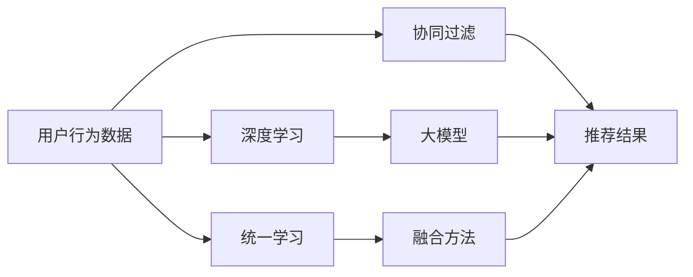

                 

# 大模型在推荐系统的未来：统一与融合的趋势

> 关键词：大模型,推荐系统,统一学习,融合方法,协同过滤,深度学习,分布式计算

## 1. 背景介绍

### 1.1 问题由来
推荐系统是现代互联网电商、内容媒体等平台的核心功能，通过智能算法为用户推荐个性化内容，提升用户体验和平台黏性。传统的推荐系统多采用基于协同过滤和深度学习的方法，但在处理复杂用户行为和海量数据时，面临着诸多挑战。

近年来，大模型的发展为推荐系统带来了新的契机，也激发了新的思考。基于大模型的推荐系统已经在电商、内容分发等多个场景中展现出优秀的性能，未来的推荐系统将如何利用大模型技术进行创新和突破，成为了当下热门的研究话题。

### 1.2 问题核心关键点
在推荐系统中引入大模型的关键点在于，如何充分利用大模型的强大学习能力，结合用户行为数据，提升推荐精准度和多样性。具体来说：

1. **大模型的学习能力**：大模型在自监督预训练中学习到丰富的隐含知识和语言模型能力，能够更好地理解和表示复杂的用户行为数据。
2. **推荐目标的对齐**：推荐系统的目标是提升用户的满意度和平台收益，大模型需要被设计为与这些目标对齐，才能充分发挥其效用。
3. **数据与模型的融合**：推荐系统依赖大量用户行为数据进行训练，如何将这些数据高效地与大模型结合，是一个重要的研究方向。
4. **模型的泛化与迁移**：为了适应不同平台和业务场景，大模型需要在多个任务上进行迁移学习，泛化能力是关键。

### 1.3 问题研究意义
利用大模型技术进行推荐系统创新，可以显著提升推荐系统的效果，改善用户体验，同时降低运营成本，具备重要研究意义：

1. **提升个性化推荐质量**：大模型能够处理更复杂的用户行为，从而实现更精准、更个性化的推荐。
2. **降低运营成本**：通过优化模型训练和推理过程，可以大幅减少数据和计算资源的需求。
3. **增强用户粘性**：优秀的推荐系统能够提升用户对平台的满意度和忠诚度，增加平台收入。
4. **拓展应用场景**：大模型具备跨领域迁移能力，可以应用到更多类型的推荐系统中。

## 2. 核心概念与联系

### 2.1 核心概念概述

为更好地理解大模型在推荐系统中的应用，本节将介绍几个关键概念：

- **推荐系统(Recommendation System)**：通过分析用户行为数据，为用户推荐感兴趣的内容的系统，如电商的推荐商品，新闻的推荐文章等。
- **协同过滤(Collaborative Filtering)**：利用用户之间的相似度，通过相似用户的行为数据推荐新内容，如基于用户-物品交互矩阵的矩阵分解方法。
- **深度学习(Deep Learning)**：基于神经网络的深度学习算法，通过学习数据的高层次表示，提升推荐模型的泛化能力和精度。
- **大模型(Large Model)**：包含数十亿参数的深度学习模型，如BERT、GPT等，通过自监督预训练学习到丰富的语言知识。
- **统一学习(Unified Learning)**：通过将大模型的预训练与推荐任务的训练统一在同一个优化目标下，实现知识共享，提升推荐性能。
- **融合方法(Fusion Method)**：将协同过滤、深度学习、大模型等多种推荐方法进行组合和融合，综合提升推荐系统的性能。

这些概念之间具有紧密的联系和交互作用，通过这些概念，可以更好地理解大模型在推荐系统中的应用和挑战。

### 2.2 核心概念原理和架构的 Mermaid 流程图



该流程图展示了用户行为数据如何通过协同过滤、深度学习和大模型进行推荐的过程。协同过滤和大模型分别从用户-物品关联和语言模型中提取特征，而统一学习将两者融合到同一优化目标下，最终通过融合方法将不同方法的结果进行组合，输出最终的推荐结果。

## 3. 核心算法原理 & 具体操作步骤

### 3.1 算法原理概述

大模型在推荐系统中的应用，主要通过以下几步进行：

1. **预训练**：在大规模无标签数据上，对大模型进行自监督预训练，学习到通用的语言模型能力。
2. **微调**：利用用户行为数据对大模型进行微调，学习特定领域的用户行为和需求。
3. **特征提取**：将微调后的大模型作为特征提取器，将用户行为数据转化为高层次语义特征。
4. **融合**：利用融合方法将协同过滤、深度学习等传统推荐方法与大模型提取的语义特征进行组合，提升推荐结果的质量。
5. **优化**：利用统一的优化目标，综合用户满意度和平台收益，进一步提升推荐效果。

这一过程可以分为四个核心环节：预训练、微调、特征提取和融合。每个环节都需要结合具体任务和数据特点进行设计和优化。

### 3.2 算法步骤详解

#### 3.2.1 预训练

在大模型预训练阶段，一般采用自监督学习任务，如语言建模、掩码语言模型等。以BERT为例，在预训练阶段，模型通过最大化预测下一个词的概率来学习语言模型能力。

具体步骤包括：

1. **数据准备**：收集大规模无标签文本数据，如维基百科、新闻、电子书等。
2. **构建模型**：选择合适的深度学习模型，如BERT、GPT等。
3. **自监督任务**：设计自监督任务，如掩码语言模型、下划线预测等。
4. **模型训练**：在GPU或TPU等高性能设备上训练模型，学习语言模型能力。

#### 3.2.2 微调

在微调阶段，利用用户行为数据对大模型进行有监督学习，使其学习特定领域的用户需求和行为。

具体步骤包括：

1. **数据准备**：收集特定领域的用户行为数据，如电商的购买记录、新闻的阅读行为等。
2. **构建模型**：在预训练模型基础上添加任务适配层，如分类器、回归器等。
3. **模型微调**：使用AdamW、SGD等优化器，设定合适的学习率，对模型进行有监督学习。
4. **评估和调优**：在验证集上评估微调效果，根据评估结果调整模型参数，直至达到最优性能。

#### 3.2.3 特征提取

特征提取是将微调后的大模型作为特征提取器，将用户行为数据转化为高层次语义特征。

具体步骤包括：

1. **输入数据**：将用户行为数据（如购买记录、阅读行为）转化为模型输入。
2. **特征编码**：使用微调后的大模型对输入数据进行编码，输出特征向量。
3. **特征拼接**：将不同来源的特征进行拼接，如用户-物品交互矩阵、深度学习特征等。
4. **特征表示**：对拼接后的特征进行降维、归一化等处理，得到最终的语义表示。

#### 3.2.4 融合

融合是将协同过滤、深度学习等传统推荐方法与大模型提取的语义特征进行组合，提升推荐结果的质量。

具体步骤包括：

1. **传统方法**：利用协同过滤、深度学习等方法，计算用户-物品的相似度或预测评分。
2. **特征融合**：将大模型提取的语义特征与传统方法计算的结果进行融合，如通过加权平均、矩阵加法等方式。
3. **优化目标**：结合用户满意度和平台收益，设计统一的优化目标，进行综合优化。
4. **输出结果**：综合优化后得到最终的推荐结果，输出给用户。

### 3.3 算法优缺点

大模型在推荐系统中的优缺点如下：

#### 3.3.1 优点

1. **高效表示**：大模型能够从丰富的语言知识中提取出高层次语义特征，提升推荐系统的理解能力。
2. **泛化能力强**：大模型具备跨领域迁移能力，可以应用到不同业务场景和数据分布。
3. **模型复杂度低**：大模型通常使用通用语言模型，无需额外复杂计算。
4. **提升推荐质量**：通过结合传统推荐方法，大模型能够综合利用多种信息源，提升推荐精准度和多样性。

#### 3.3.2 缺点

1. **数据依赖性强**：大模型需要大规模高质量数据进行预训练和微调，数据获取成本较高。
2. **计算资源消耗大**：大模型需要强大的计算能力和存储资源，对硬件要求较高。
3. **模型参数多**：大模型的参数量巨大，需要优化内存和计算资源的利用。
4. **输出可解释性不足**：大模型的决策过程难以解释，用户难以理解推荐依据。

### 3.4 算法应用领域

大模型在推荐系统中的应用已经涵盖了多个领域，例如：

1. **电商推荐**：利用用户购买行为数据，对大模型进行微调，输出推荐商品。
2. **内容推荐**：利用用户阅读和观看行为数据，对大模型进行微调，推荐相关文章、视频等。
3. **广告推荐**：利用用户点击和停留行为数据，对大模型进行微调，推荐相关广告。
4. **金融推荐**：利用用户交易和投资行为数据，对大模型进行微调，推荐相关金融产品。
5. **娱乐推荐**：利用用户观影和听歌行为数据，对大模型进行微调，推荐相关娱乐内容。

除了以上领域，大模型还可以应用于社交网络、旅游、健康等领域，助力平台提升用户体验和平台收益。

## 4. 数学模型和公式 & 详细讲解 & 举例说明

### 4.1 数学模型构建

大模型在推荐系统中可以用于表示用户行为和推荐结果，其数学模型可以表示为：

1. **用户行为数据**：设用户行为数据为 $D=\{(x_i, y_i)\}_{i=1}^N$，其中 $x_i$ 为行为向量，$y_i$ 为标签向量。
2. **大模型**：设大模型为 $M_{\theta}(x)$，其中 $\theta$ 为模型参数。
3. **推荐结果**：设推荐结果为 $z_i$，通过 $M_{\theta}(x_i)$ 计算。
4. **推荐损失**：设推荐损失为 $L(z_i, y_i)$，用于衡量推荐结果与真实标签的差异。

### 4.2 公式推导过程

以电商推荐为例，设用户 $i$ 的购买记录为 $x_i \in \mathbb{R}^d$，大模型输出为 $z_i \in \mathbb{R}^m$，推荐结果为 $y_i \in \{0,1\}$。利用交叉熵损失函数，推荐损失为：

$$
L(z_i, y_i) = -y_i \log z_i + (1-y_i) \log (1-z_i)
$$

模型在训练过程中，通过最大化 $L(z_i, y_i)$ 来调整大模型参数 $\theta$。

### 4.3 案例分析与讲解

以Netflix推荐系统为例，Netflix使用协同过滤和大模型相结合的方式进行推荐。具体步骤如下：

1. **协同过滤**：利用用户-物品评分矩阵，进行矩阵分解，得到用户和物品的隐向量表示 $u_i, v_j$。
2. **大模型特征提取**：利用BERT模型对用户行为数据进行编码，得到用户特征表示 $z_i$。
3. **融合**：将协同过滤得到的结果和BERT提取的特征进行加权平均，得到综合推荐结果 $z'_i$。
4. **优化**：通过用户评分 $y_i$ 进行交叉熵损失优化，调整模型参数。

## 5. 项目实践：代码实例和详细解释说明

### 5.1 开发环境搭建

以下是使用PyTorch进行大模型在推荐系统中应用的开发环境配置：

1. 安装Anaconda，创建并激活虚拟环境。
2. 安装PyTorch、TensorFlow、Transformers库。
3. 安装相关依赖库，如numpy、pandas、scikit-learn等。

### 5.2 源代码详细实现

下面以Netflix推荐系统为例，展示使用PyTorch进行大模型微调和特征提取的代码实现：

```python
import torch
import torch.nn as nn
import torch.nn.functional as F
from transformers import BertModel, BertTokenizer

class BERTRecommender(nn.Module):
    def __init__(self, hidden_size, num_labels):
        super(BERTRecommender, self).__init__()
        self.bert = BertModel.from_pretrained('bert-base-cased')
        self.fc = nn.Linear(hidden_size, num_labels)
        
    def forward(self, x):
        outputs = self.bert(x)
        pooled_output = outputs.pooler_output
        logits = self.fc(pooled_output)
        return logits

# 准备数据
train_data = # 用户行为数据
train_labels = # 推荐结果标签
tokenizer = BertTokenizer.from_pretrained('bert-base-cased')
encoded_inputs = tokenizer(train_data, return_tensors='pt', padding=True, truncation=True)

# 模型初始化
model = BERTRecommender(768, 2) # 隐层大小为768，输出层为2个标签
optimizer = torch.optim.AdamW(model.parameters(), lr=2e-5)

# 训练模型
for epoch in range(10):
    model.train()
    optimizer.zero_grad()
    logits = model(encoded_inputs.input_ids)
    loss = F.cross_entropy(logits, train_labels)
    loss.backward()
    optimizer.step()

# 测试模型
model.eval()
test_data = # 测试集用户行为数据
test_labels = # 测试集推荐结果标签
encoded_test = tokenizer(test_data, return_tensors='pt', padding=True, truncation=True)
with torch.no_grad():
    logits = model(encoded_test.input_ids)
    test_loss = F.cross_entropy(logits, test_labels)
```

### 5.3 代码解读与分析

**BERTRecommender类**：
- `__init__`方法：初始化BERT模型和全连接层，隐层大小和输出标签数由用户定义。
- `forward`方法：将输入数据通过BERT模型编码，然后通过全连接层输出预测结果。

**数据准备**：
- 将用户行为数据和推荐结果标签转换为BERT模型所需的格式，并使用BERT分词器进行编码。
- 使用AdamW优化器进行模型训练，设定合适的学习率。

**模型训练**：
- 通过前向传播计算模型输出，计算交叉熵损失。
- 反向传播更新模型参数，使用梯度下降优化。
- 周期性在验证集上评估模型性能，确保模型收敛。

**模型测试**：
- 在测试集上使用模型进行预测，并计算测试损失。
- 通过测试集上的结果评估模型性能。

## 6. 实际应用场景

### 6.1 智能电商推荐

在智能电商推荐中，大模型能够通过用户浏览、购买记录等行为数据，学习用户兴趣和需求，从而提供个性化的商品推荐。大模型可以与传统协同过滤方法结合，利用其强大的语言模型能力，提升推荐结果的精准度和多样性。

### 6.2 内容推荐系统

内容推荐系统通过大模型提取用户行为数据中的语义特征，结合深度学习模型和协同过滤方法，为用户推荐相关文章、视频等。大模型能够捕捉用户阅读习惯、偏好等隐含信息，提升推荐的准确性和个性化。

### 6.3 个性化广告推荐

个性化广告推荐通过大模型提取用户点击、停留等行为数据，学习用户兴趣和需求，结合深度学习模型和协同过滤方法，为用户推荐相关广告。大模型能够捕捉用户的广告反应，提高广告投放的精准度和转化率。

### 6.4 未来应用展望

未来，大模型在推荐系统中的应用将更加广泛和深入：

1. **多模态推荐**：结合图像、视频、语音等多模态数据，提升推荐的智能化水平。
2. **实时推荐**：利用分布式计算和大模型并行，实现实时推荐，提升用户体验。
3. **个性化内容生成**：利用大模型的生成能力，为用户生成个性化的内容，提升推荐的多样性和吸引力。
4. **跨领域迁移**：通过大模型的跨领域迁移能力，将推荐系统应用于更多场景，如旅游、金融等。

## 7. 工具和资源推荐

### 7.1 学习资源推荐

为了帮助开发者系统掌握大模型在推荐系统中的应用，这里推荐一些优质的学习资源：

1. 《深度学习推荐系统》书籍：深入浅出地介绍了推荐系统的原理和实现方法，包含大模型在推荐中的应用。
2. 《推荐系统实战》课程：由工业界专家讲解，结合实际项目，展示大模型在推荐系统中的实践技巧。
3. 《深度学习理论与实践》课程：涵盖深度学习的基本理论和实践方法，适合初学者入门。
4. HuggingFace官方文档：提供丰富的预训练模型和微调样例代码，是上手实践的必备资料。

### 7.2 开发工具推荐

以下是几款用于大模型在推荐系统中的应用开发的常用工具：

1. PyTorch：基于Python的开源深度学习框架，灵活高效，适合研究和大规模模型训练。
2. TensorFlow：由Google主导开发的开源深度学习框架，生产部署方便，适合大规模工程应用。
3. Transformers库：HuggingFace开发的NLP工具库，集成了众多预训练语言模型，方便微调和特征提取。
4. Weights & Biases：模型训练的实验跟踪工具，记录和可视化模型训练过程中的各项指标。
5. TensorBoard：TensorFlow配套的可视化工具，实时监测模型训练状态，提供丰富的图表呈现方式。

### 7.3 相关论文推荐

大模型在推荐系统中的研究与应用源于学界的持续研究。以下是几篇奠基性的相关论文，推荐阅读：

1. A Comprehensive Survey of Deep Learning in Recommendation Systems：综述了深度学习在推荐系统中的应用，包括大模型在推荐中的应用。
2. Deep Learning for Recommender Systems: A Review and New Perspectives：讨论了深度学习在推荐系统中的潜力和挑战，包含大模型的相关研究。
3. Recommendation Systems in a Nutshell：一本推荐系统入门书籍，涵盖传统推荐方法和深度学习推荐方法。
4. Knowledge-Enhanced Neural Recommendation Models：探讨了知识增强的深度学习推荐模型，包括大模型在推荐中的应用。
5. Fusion of Collaborative Filtering and Deep Learning Approaches：探讨了协同过滤和深度学习的融合方法，包含大模型在推荐中的应用。

## 8. 总结：未来发展趋势与挑战

### 8.1 总结

本文对大模型在推荐系统中的应用进行了全面系统的介绍。首先阐述了推荐系统的背景和意义，明确了大模型在推荐系统中的重要地位。其次，从原理到实践，详细讲解了大模型在推荐系统中的预训练、微调、特征提取和融合等步骤，给出了具体的代码实现和分析。同时，本文还广泛探讨了大模型在电商推荐、内容推荐、广告推荐等多个场景中的应用前景，展示了微调范式的巨大潜力。

通过本文的系统梳理，可以看到，大模型在推荐系统中展现了强大的学习能力，能够结合用户行为数据，提升推荐系统的精准度和多样性。未来，大模型还将与更多技术进行融合，进一步拓展推荐系统的应用边界，提升用户体验和平台收益。

### 8.2 未来发展趋势

展望未来，大模型在推荐系统中的应用将呈现以下几个发展趋势：

1. **统一学习与融合**：通过将大模型的预训练与推荐任务的训练统一在同一个优化目标下，实现知识共享，提升推荐性能。
2. **分布式计算**：利用分布式计算和大模型并行，实现实时推荐，提升用户体验。
3. **多模态融合**：结合图像、视频、语音等多模态数据，提升推荐的智能化水平。
4. **跨领域迁移**：通过大模型的跨领域迁移能力，将推荐系统应用于更多场景，如旅游、金融等。
5. **个性化内容生成**：利用大模型的生成能力，为用户生成个性化的内容，提升推荐的多样性和吸引力。

以上趋势凸显了大模型在推荐系统中的广泛应用前景，未来随着技术的不断演进，推荐系统将更加智能化、个性化和多样化。

### 8.3 面临的挑战

尽管大模型在推荐系统中的应用取得了显著进展，但仍面临一些挑战：

1. **数据获取成本高**：大模型需要大规模高质量数据进行预训练和微调，数据获取成本较高。
2. **计算资源消耗大**：大模型需要强大的计算能力和存储资源，对硬件要求较高。
3. **模型参数多**：大模型的参数量巨大，需要优化内存和计算资源的利用。
4. **输出可解释性不足**：大模型的决策过程难以解释，用户难以理解推荐依据。

### 8.4 研究展望

面对大模型在推荐系统中的挑战，未来的研究需要在以下几个方面寻求新的突破：

1. **数据生成与标注**：通过数据生成技术和半监督学习方法，降低对标注数据的依赖。
2. **模型压缩与优化**：开发更加参数高效和计算高效的微调方法，减少资源消耗。
3. **知识图谱与规则库**：将符号化的先验知识，如知识图谱、逻辑规则等，与神经网络模型进行融合，增强模型的解释性和可信度。
4. **跨模态与跨领域学习**：利用多模态数据和跨领域迁移能力，提升推荐系统的泛化能力和应用范围。
5. **模型验证与评估**：建立更加全面和公正的模型评估指标，验证模型在实际应用中的效果。

这些研究方向的探索，必将引领大模型在推荐系统中的应用迈向更高的台阶，为构建更智能、更个性化的推荐系统铺平道路。面向未来，大模型将与更多技术进行深度融合，推动推荐系统的不断创新和优化，实现智能化推荐的新突破。

## 9. 附录：常见问题与解答

**Q1：大模型在推荐系统中如何处理长尾数据？**

A: 长尾数据在推荐系统中是一大挑战。为了处理长尾数据，可以采用以下方法：
1. **重采样**：通过重采样技术，将长尾数据平衡到与高频数据相同的数量级。
2. **正则化**：在模型训练中引入正则化项，防止模型对长尾数据的过拟合。
3. **特征工程**：利用用户行为数据中的隐含信息，提取长尾数据特征，提升模型对长尾数据的敏感度。
4. **协同过滤**：利用协同过滤方法，结合长尾数据的多样性，提升推荐结果的覆盖度。

**Q2：大模型在推荐系统中如何处理冷启动问题？**

A: 冷启动问题指的是新用户或新物品缺乏足够行为数据，难以进行推荐。为了解决冷启动问题，可以采用以下方法：
1. **转移学习**：利用已有用户的相似行为数据进行迁移学习，填补新用户的行为数据。
2. **预训练嵌入**：利用预训练的词向量作为初始化，提升新物品的表示能力。
3. **多模态融合**：结合用户的多模态数据，提升推荐系统的泛化能力和覆盖度。
4. **知识图谱**：利用知识图谱中的隐含关系，提升新用户和物品的推荐质量。

**Q3：大模型在推荐系统中如何进行实时推荐？**

A: 实时推荐要求模型能够快速响应用户请求，生成推荐结果。为了实现实时推荐，可以采用以下方法：
1. **分布式计算**：利用分布式计算技术，将大模型并行部署，提升计算效率。
2. **模型压缩**：通过模型压缩和剪枝技术，减小模型尺寸，提升推理速度。
3. **增量学习**：利用增量学习技术，实时更新模型参数，保持模型性能。
4. **缓存机制**：通过缓存机制，缓存常用推荐结果，减少计算开销。

**Q4：大模型在推荐系统中如何进行跨领域迁移？**

A: 跨领域迁移指的是将在大模型中的一个领域学到的知识迁移到另一个领域。为了实现跨领域迁移，可以采用以下方法：
1. **预训练多任务学习**：在大模型的预训练过程中，加入多个任务，提升模型的泛化能力和迁移能力。
2. **领域自适应**：通过领域自适应技术，调整模型参数，使其适应新的领域数据。
3. **多任务学习**：利用多任务学习技术，同时学习多个任务，提升模型的泛化能力和迁移能力。
4. **迁移学习**：利用迁移学习方法，将已学知识迁移到新领域，提升模型的迁移性能。

通过合理利用这些技术，可以提升大模型在推荐系统中的跨领域迁移能力，扩展其应用范围，提升推荐系统的性能和覆盖度。

---

作者：禅与计算机程序设计艺术 / Zen and the Art of Computer Programming

