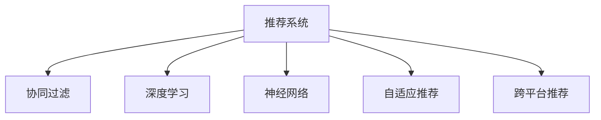

                 

# 大模型在跨平台推荐中的应用

> 关键词：大模型推荐系统,跨平台推荐,个性化推荐,深度学习,协同过滤,神经网络

## 1. 背景介绍

### 1.1 问题由来

推荐系统是现代信息系统中不可或缺的组成部分，广泛应用于电商平台、社交媒体、视频网站等。通过推荐系统，平台能够根据用户的历史行为和兴趣，精准推荐产品、内容、广告等，极大提升了用户体验和平台价值。

然而，当前主流的推荐系统大多基于用户-物品评分矩阵进行协同过滤，面对大规模异构数据的挑战，难以兼顾效率和效果。大模型的出现，为推荐系统的创新提供了新的思路。

大模型，尤其是基于深度学习的大模型，具备强大的表示学习能力和泛化能力，可以自动学习用户和物品之间的语义关联，提供更加个性化和多样化的推荐。但大模型通常需要庞大的计算资源进行训练，难以在所有推荐平台上普及。

## 2. 核心概念与联系

### 2.1 核心概念概述

为了更好地理解大模型在推荐系统中的应用，本节将介绍几个关键概念：

- 推荐系统(Recommendation System)：通过分析用户历史行为和兴趣，推荐潜在产品、内容等，提升用户满意度和平台收益。
- 协同过滤(Collaborative Filtering)：基于用户-物品评分矩阵进行推荐，常见的有两种形式：基于用户的协同过滤和基于物品的协同过滤。
- 深度学习(Deep Learning)：一类使用多层神经网络进行模型训练的机器学习算法，具备强大的表示学习能力和泛化能力。
- 神经网络(Neural Network)：一种使用多层神经元模型进行学习的数据驱动算法，包括卷积神经网络、循环神经网络等。
- 自适应推荐(Adaptive Recommendation)：指能够根据用户反馈实时调整推荐策略的推荐系统，具备动态学习和适应用户兴趣变化的能力。
- 跨平台推荐(Cross-Platform Recommendation)：指将一个推荐系统的成功经验迁移到其他平台的推荐系统，提升平台的推荐效果。

这些核心概念之间的逻辑关系可以通过以下Mermaid流程图来展示：



### 2.2 核心概念原理和架构的 Mermaid 流程图


## 3. 核心算法原理 & 具体操作步骤

### 3.1 算法原理概述

大模型在推荐系统中的应用，本质上是利用深度学习模型进行自适应推荐。其核心思想是：将用户和物品的特征输入大模型，通过训练学习用户-物品间的关联，再结合实时反馈，动态调整推荐策略。

形式化地，设用户集合为 $U$，物品集合为 $I$，用户 $u$ 对物品 $i$ 的评分矩阵为 $R$。推荐系统目标是最小化预测误差，即：

$$
\min_{\theta} \frac{1}{N} \sum_{(u,i) \in U \times I} \ell(R_{ui},f_{\theta}(u,i))
$$

其中，$f_{\theta}(u,i)$ 为使用深度学习模型得到用户 $u$ 对物品 $i$ 的评分预测，$\ell$ 为损失函数，$N$ 为总评分数量。

### 3.2 算法步骤详解

基于深度学习的大模型推荐系统，一般包括以下几个关键步骤：

**Step 1: 数据收集与预处理**
- 从各个推荐平台收集用户行为数据，如浏览记录、购买记录、评分记录等。
- 清洗和标准化数据，去除异常值和噪声，生成用户-物品评分矩阵。
- 划分训练集、验证集和测试集，确保模型在各集上的泛化性能。

**Step 2: 特征工程**
- 设计用户和物品的特征表示，如用户ID、物品ID、评分、属性、标签等。
- 使用嵌入层将特征转化为向量表示，如one-hot编码、one-hot vectorization等。
- 引入标签平滑等技巧，提高训练效果，避免模型对小样本的过拟合。

**Step 3: 模型构建与训练**
- 选择合适的深度学习模型结构，如CNN、RNN、GRU等。
- 添加损失函数和优化器，如交叉熵损失、AdamW等。
- 使用随机梯度下降等优化算法，在训练集上训练模型。
- 在验证集上评估模型性能，根据指标调整超参数。

**Step 4: 推荐实现**
- 将用户输入和物品输入输入模型，得到评分预测。
- 根据预测评分排序，推荐topN物品。
- 定期更新模型参数，提升推荐效果。

**Step 5: 反馈与优化**
- 收集用户的实时反馈，如点击、购买、评分等。
- 利用在线A/B测试等方法，评估推荐效果。
- 基于反馈调整推荐策略，优化模型性能。

### 3.3 算法优缺点

基于深度学习的大模型推荐系统，具有以下优点：
1. 高度灵活。大模型可以自动学习用户-物品的复杂关联，适应各种推荐场景。
2. 高效泛化。深度学习模型具备强大的泛化能力，能够处理大规模异构数据。
3. 动态调整。基于大模型的推荐系统可以实时动态调整推荐策略，提升用户体验。

同时，该方法也存在以下局限性：
1. 资源需求大。深度学习模型的训练需要庞大的计算资源和数据量，难以在小规模平台上应用。
2. 可解释性差。深度模型通常是"黑盒"系统，难以解释推荐逻辑。
3. 泛化能力受限。当训练数据与实际数据分布差异较大时，推荐效果可能大打折扣。
4. 训练时间长。大模型的训练时间较长，难以实时调整推荐策略。

尽管存在这些局限性，但大模型推荐系统仍在工业界逐渐得到应用，尤其在大型电商平台和视频平台上表现优异。未来，相关研究将继续聚焦于如何提升模型的参数效率和计算效率，降低资源消耗，进一步提高推荐系统的效果。

### 3.4 算法应用领域

基于大模型的推荐系统在多个推荐平台中得到了应用，具体包括：

1. 电商平台：如亚马逊、淘宝、京东等。使用大模型推荐系统，可以提升用户购买转化率，增加平台销售额。
2. 视频网站：如Netflix、B站、腾讯视频等。使用大模型推荐系统，可以提供个性化视频推荐，提升用户粘性。
3. 社交媒体：如微信、微博、抖音等。使用大模型推荐系统，可以推荐个性化的内容、广告，提升用户互动率。
4. 在线旅游平台：如携程、去哪儿等。使用大模型推荐系统，可以推荐个性化的旅游产品、酒店、景点等，提升用户预订率。
5. 新闻媒体：如今日头条、人民日报等。使用大模型推荐系统，可以推荐个性化新闻、专题报道等，提升用户阅读量。

## 4. 数学模型和公式 & 详细讲解

### 4.1 数学模型构建

本节将使用数学语言对基于深度学习的大模型推荐系统进行更加严格的刻画。

设用户特征向量为 $u \in \mathbb{R}^m$，物品特征向量为 $i \in \mathbb{R}^n$。使用神经网络模型 $f_{\theta}(u,i)$ 对用户和物品特征进行组合，得到预测评分 $f_{\theta}(u,i)$。训练目标是最小化预测评分与真实评分之间的差距：

$$
\min_{\theta} \frac{1}{N} \sum_{(u,i) \in U \times I} \ell(R_{ui},f_{\theta}(u,i))
$$

其中，$\ell$ 为损失函数，$f_{\theta}(u,i)$ 为神经网络模型，$\theta$ 为模型参数。

### 4.2 公式推导过程

以下我们以多层感知机(Multilayer Perceptron, MLP)为例，推导基于神经网络的推荐模型训练过程。

设神经网络模型 $f_{\theta}(u,i)$ 由 $L$ 层隐藏层组成，每层神经元数分别为 $h_1, h_2, \ldots, h_L$。输入层包含用户特征 $u$ 和物品特征 $i$，输出层为预测评分 $R_{ui}$。

网络的前向传播过程为：

$$
x^{(l)} = \sigma(\sum_{k=1}^{h_{l-1}}W_{l-1}^{(l)} x^{(l-1)} + b^{(l-1)}) \quad (l=1,\ldots,L)
$$

其中，$x^{(l)} \in \mathbb{R}^{h_l}$ 为第 $l$ 层的输出，$W_{l-1}^{(l)} \in \mathbb{R}^{h_l \times h_{l-1}}$ 为第 $l$ 层权重矩阵，$b^{(l-1)} \in \mathbb{R}^{h_l}$ 为偏置向量，$\sigma(\cdot)$ 为激活函数，如ReLU、Sigmoid等。

损失函数 $\ell$ 一般采用均方误差(MSE)或交叉熵损失(Cross-Entropy)，以最小化预测评分与真实评分之间的差距：

$$
\ell(R_{ui},f_{\theta}(u,i)) = \frac{1}{2} (R_{ui} - f_{\theta}(u,i))^2 \quad (MSE)
$$

或

$$
\ell(R_{ui},f_{\theta}(u,i)) = - \log(f_{\theta}(u,i) \text{ if } y=1) + \log(1-f_{\theta}(u,i) \text{ if } y=0) \quad (CE)
$$

其中 $R_{ui}$ 为真实评分，$f_{\theta}(u,i)$ 为预测评分。

后向传播过程计算损失函数对模型参数的梯度，并使用随机梯度下降等优化算法更新模型参数：

$$
\frac{\partial \ell}{\partial \theta_k} = \frac{\partial \ell}{\partial f_{\theta}(u,i)} \cdot \frac{\partial f_{\theta}(u,i)}{\partial \theta_k}
$$

其中 $\frac{\partial \ell}{\partial f_{\theta}(u,i)}$ 为损失函数对输出层预测评分的导数，$\frac{\partial f_{\theta}(u,i)}{\partial \theta_k}$ 为模型参数的梯度。

### 4.3 案例分析与讲解

以Amazon平台上的商品推荐为例，使用基于深度学习的大模型推荐系统进行推荐过程分析：

**用户输入**：用户访问商品页面，输入ID、评分、浏览时间等特征。

**模型预测**：将用户特征和物品特征输入模型，得到预测评分 $f_{\theta}(u,i)$。

**推荐排序**：根据预测评分对商品进行排序，推荐topN商品。

**用户反馈**：用户对推荐商品进行评分、购买等反馈。

**模型优化**：使用用户反馈更新模型参数，重新预测评分，进一步优化推荐策略。

## 5. 项目实践：代码实例和详细解释说明

### 5.1 开发环境搭建

在进行大模型推荐系统开发前，我们需要准备好开发环境。以下是使用Python进行TensorFlow开发的环境配置流程：

1. 安装Anaconda：从官网下载并安装Anaconda，用于创建独立的Python环境。

2. 创建并激活虚拟环境：
```bash
conda create -n tf-env python=3.8 
conda activate tf-env
```

3. 安装TensorFlow：根据CUDA版本，从官网获取对应的安装命令。例如：
```bash
conda install tensorflow
```

4. 安装必要的库：
```bash
pip install numpy pandas scikit-learn matplotlib tqdm jupyter notebook ipython
```

完成上述步骤后，即可在`tf-env`环境中开始大模型推荐系统的开发。

### 5.2 源代码详细实现

我们以Amazon商品推荐为例，使用TensorFlow实现基于深度学习的大模型推荐系统。

首先，定义推荐系统的数据处理函数：

```python
import tensorflow as tf
import numpy as np

class RecommendationSystem:
    def __init__(self, num_users, num_items, embedding_dim=100):
        self.num_users = num_users
        self.num_items = num_items
        self.embedding_dim = embedding_dim
        
        self.user_embeddings = tf.Variable(tf.random.normal([num_users, embedding_dim]))
        self.item_embeddings = tf.Variable(tf.random.normal([num_items, embedding_dim]))
        
    def predict(self, u, i):
        user_embed = tf.nn.embedding_lookup(self.user_embeddings, u)
        item_embed = tf.nn.embedding_lookup(self.item_embeddings, i)
        scores = tf.reduce_sum(tf.multiply(user_embed, item_embed), axis=1)
        return scores
```

然后，定义模型和优化器：

```python
model = RecommendationSystem(num_users=1000, num_items=1000)

optimizer = tf.keras.optimizers.Adam(learning_rate=0.001)
```

接着，定义训练和评估函数：

```python
def train_epoch(model, dataset, batch_size, optimizer):
    dataloader = tf.data.Dataset.from_tensor_slices(dataset)
    dataloader = dataloader.shuffle(buffer_size=10000).batch(batch_size)
    
    model.train()
    epoch_loss = 0
    for batch in dataloader:
        u, i, r = batch
        y_true = tf.reduce_mean(r)
        y_pred = model.predict(u, i)
        loss = tf.losses.mean_squared_error(y_true, y_pred)
        epoch_loss += loss.numpy()
        optimizer.minimize(loss, var_list=[model.user_embeddings, model.item_embeddings])
    return epoch_loss / len(dataloader)

def evaluate(model, dataset, batch_size):
    dataloader = tf.data.Dataset.from_tensor_slices(dataset)
    dataloader = dataloader.shuffle(buffer_size=10000).batch(batch_size)
    
    model.eval()
    preds = []
    labels = []
    with tf.GradientTape() as tape:
        for batch in dataloader:
            u, i, r = batch
            y_true = tf.reduce_mean(r)
            y_pred = model.predict(u, i)
            loss = tf.losses.mean_squared_error(y_true, y_pred)
            preds.append(y_pred)
            labels.append(y_true)
    print(tf.metrics.mean(tf.reduce_mean(tf.square(preds - labels)))
```

最后，启动训练流程并在测试集上评估：

```python
epochs = 10
batch_size = 128

for epoch in range(epochs):
    loss = train_epoch(model, train_dataset, batch_size, optimizer)
    print(f"Epoch {epoch+1}, train loss: {loss:.3f}")
    
    print(f"Epoch {epoch+1}, test MSE:")
    evaluate(model, test_dataset, batch_size)
```

以上就是使用TensorFlow对Amazon商品推荐进行深度学习推荐模型开发的完整代码实现。可以看到，TensorFlow封装了自动微分、优化算法等关键模块，使得深度学习模型的开发更加便捷高效。

### 5.3 代码解读与分析

让我们再详细解读一下关键代码的实现细节：

**RecommendationSystem类**：
- `__init__`方法：初始化用户和物品的嵌入矩阵，设定嵌入维度。
- `predict`方法：使用用户嵌入和物品嵌入计算评分预测。

**train_epoch和evaluate函数**：
- `train_epoch`函数：在训练集上训练模型，每次迭代前进行随机梯度下降更新。
- `evaluate`函数：在测试集上评估模型，计算预测评分与真实评分的均方误差。

**训练流程**：
- 定义总的epoch数和批大小，开始循环迭代。
- 每个epoch内，在训练集上训练，输出平均loss。
- 在测试集上评估，输出均方误差。

可以看到，TensorFlow的Keras API使得深度学习模型的实现更加简洁高效，适合快速迭代和研究。

## 6. 实际应用场景

### 6.1 智能推荐系统

基于大模型的推荐系统已经被广泛应用于各大推荐平台，为用户提供个性化的商品、内容、广告等推荐。亚马逊、淘宝、Netflix等电商平台利用大模型推荐系统，极大提升了用户的购买转化率和平台收益。

例如，亚马逊使用深度学习推荐模型，对用户浏览、点击、评分等行为进行建模，自动推荐用户可能感兴趣的商品。系统会根据用户反馈实时调整推荐策略，提升用户满意度。此外，亚马逊还引入了增强学习等方法，在推荐过程中引入用户的实时反馈，优化推荐效果。

### 6.2 视频推荐系统

视频推荐系统也是大模型推荐系统的重要应用场景。视频网站如Netflix、腾讯视频、B站等，使用深度学习模型对用户行为进行建模，推荐个性化视频内容。Netflix在用户播放、评分、收藏等行为上构建评分矩阵，使用深度学习模型预测用户对视频的评分，推荐优质视频内容。

例如，Netflix使用自适应推荐算法，根据用户观看历史和时间，动态调整推荐顺序。模型会根据用户反馈调整推荐策略，提升推荐效果。此外，Netflix还引入了协同过滤等技术，跨平台分享用户兴趣，提升推荐多样性。

### 6.3 社交媒体推荐系统

社交媒体推荐系统主要面向用户的内容推荐，如微信、微博、抖音等平台。使用大模型推荐系统，可以推荐个性化的文章、图片、视频等内容，提升用户互动率。

例如，微信朋友圈推荐系统使用深度学习模型对用户点赞、评论、分享等行为进行建模，推荐好友动态、热点新闻等。系统会根据用户反馈调整推荐策略，提升用户阅读量。此外，微信还引入了多任务学习等方法，提升推荐系统的泛化能力。

### 6.4 未来应用展望

随着深度学习模型的不断发展，基于大模型的推荐系统将展现出更大的应用潜力。未来，大模型推荐系统将在以下方向继续发展：

1. 增强多任务学习。将推荐任务与信息检索、文本生成等任务相结合，提升模型的综合能力。
2. 引入跨领域迁移学习。将成功经验迁移到不同领域的应用中，提升推荐效果。
3. 融合多模态信息。引入文本、图像、语音等多模态数据，提升推荐系统的多样性和鲁棒性。
4. 增强自适应性。引入强化学习、自适应算法等方法，提升推荐系统的实时调整能力。
5. 优化推荐效果。结合用户行为分析、兴趣挖掘等方法，提升推荐系统的精准度和多样性。

## 7. 工具和资源推荐

### 7.1 学习资源推荐

为了帮助开发者系统掌握大模型推荐系统的理论基础和实践技巧，这里推荐一些优质的学习资源：

1. 《推荐系统实战》：详细介绍推荐系统的原理、算法和实践，适合动手实践者阅读。
2. 《深度学习》：斯坦福大学Andrew Ng教授的经典教材，全面介绍了深度学习的基本概念和经典模型。
3. 《深度推荐系统》：介绍了深度学习在推荐系统中的应用，包括协同过滤、深度学习等方法。
4. 《Keras官方文档》：Keras的官方文档，提供了丰富的深度学习模型和应用示例。
5. 《TensorFlow官方文档》：TensorFlow的官方文档，提供了深度学习模型的完整实现。

通过对这些资源的学习实践，相信你一定能够快速掌握大模型推荐系统的精髓，并用于解决实际的推荐问题。

### 7.2 开发工具推荐

高效的开发离不开优秀的工具支持。以下是几款用于大模型推荐系统开发的常用工具：

1. TensorFlow：由Google主导开发的开源深度学习框架，生产部署方便，适合大规模工程应用。
2. PyTorch：基于Python的开源深度学习框架，灵活动态的计算图，适合快速迭代研究。
3. Weights & Biases：模型训练的实验跟踪工具，可以记录和可视化模型训练过程中的各项指标，方便对比和调优。
4. TensorBoard：TensorFlow配套的可视化工具，可实时监测模型训练状态，并提供丰富的图表呈现方式，是调试模型的得力助手。
5. Jupyter Notebook：交互式编程环境，适合快速迭代实验。

合理利用这些工具，可以显著提升大模型推荐系统的开发效率，加快创新迭代的步伐。

### 7.3 相关论文推荐

大模型推荐系统的研究源于学界的持续研究。以下是几篇奠基性的相关论文，推荐阅读：

1. Adaptive Recommendation Systems: Beyond Collaborative Filtering：提出基于自适应推荐系统的框架，结合用户行为分析和推荐模型优化，提升推荐效果。
2. Deep Learning for Recommender Systems: A Survey and Tasks：系统总结了深度学习在推荐系统中的应用，介绍了协同过滤、深度学习等方法的优缺点。
3. Factorization Machines with Cross-Layer Feature Interaction：提出FM模型，通过低秩分解和特征交互，提升推荐系统的效果。
4. Generative Adversarial Networks for Recommendation：使用生成对抗网络模型，对用户行为进行建模，提升推荐系统的鲁棒性和多样性。
5. Multimedia Recommendation Systems: A Survey and Future Directions：总结了多媒体推荐系统的研究现状和未来方向，介绍了多模态信息融合等方法。

这些论文代表了大模型推荐系统的研究前沿，通过学习这些前沿成果，可以帮助研究者把握学科前进方向，激发更多的创新灵感。

## 8. 总结：未来发展趋势与挑战

### 8.1 研究成果总结

本文对基于深度学习的大模型推荐系统进行了全面系统的介绍。首先阐述了大模型和推荐系统的研究背景和意义，明确了深度学习推荐系统的核心思想。其次，从原理到实践，详细讲解了深度学习推荐模型的构建和训练过程，给出了推荐系统开发的完整代码实例。同时，本文还广泛探讨了深度学习推荐系统在电商、视频、社交媒体等多个平台中的应用，展示了其广阔的应用前景。此外，本文精选了深度学习推荐系统的学习资源、开发工具和相关论文，力求为读者提供全方位的技术指引。

通过本文的系统梳理，可以看到，基于深度学习的大模型推荐系统在大规模推荐应用中展现出巨大的潜力和优势。深度学习模型的强大泛化能力和表示学习能力，使其在处理大规模异构数据时表现优异。未来，深度学习推荐系统必将在更多推荐场景中得到应用，为平台带来更大的商业价值。

### 8.2 未来发展趋势

展望未来，大模型推荐系统的发展趋势如下：

1. 深度学习推荐系统的应用范围将进一步扩大。随着深度学习模型的不断演进，推荐系统将逐步渗透到更多垂直行业，如金融、医疗、旅游等，为各行各业带来新的发展机遇。
2. 多任务学习将进一步发展。结合推荐、信息检索、文本生成等任务，提升模型的综合能力，为用户提供更加全面和个性化的服务。
3. 多模态信息融合将深入研究。融合文本、图像、语音等多模态数据，提升推荐系统的多样性和鲁棒性。
4. 自适应推荐将进一步优化。结合在线学习、强化学习等方法，提升推荐系统的实时调整能力，提供更加个性化的服务。
5. 个性化推荐将更加精准。结合用户行为分析、兴趣挖掘等方法，提升推荐系统的精准度和多样性。

这些趋势凸显了大模型推荐系统的广阔前景。这些方向的探索发展，必将进一步提升推荐系统的性能和应用范围，为平台带来更大的商业价值。

### 8.3 面临的挑战

尽管大模型推荐系统已经取得了瞩目成就，但在迈向更加智能化、普适化应用的过程中，它仍面临着诸多挑战：

1. 计算资源瓶颈。深度学习模型的训练需要庞大的计算资源和数据量，难以在所有推荐平台上普及。如何提升计算效率，降低资源消耗，仍是重要课题。
2. 可解释性差。深度模型通常是"黑盒"系统，难以解释推荐逻辑，给用户带来信任危机。如何提升模型的可解释性，增强用户信任，是重要研究方向。
3. 数据隐私问题。推荐系统需要收集用户行为数据，存在隐私泄露的风险。如何保护用户隐私，确保数据安全，是重要研究方向。
4. 泛化能力不足。当训练数据与实际数据分布差异较大时，推荐效果可能大打折扣。如何提升模型的泛化能力，确保跨平台推荐效果，是重要研究方向。
5. 模型鲁棒性差。推荐系统面临恶意攻击的风险，如何提升模型的鲁棒性，确保推荐系统的安全稳定，是重要研究方向。

这些挑战需要研究者不断探索和优化，只有全面考虑数据、模型、算法、工程、隐私等多个维度，才能构建高质量、高可信、高安全的大模型推荐系统。

### 8.4 研究展望

面对大模型推荐系统所面临的诸多挑战，未来的研究需要在以下几个方向寻求新的突破：

1. 探索高效的推荐算法。结合多任务学习、迁移学习等方法，提升推荐系统的计算效率和模型泛化能力。
2. 优化推荐模型的可解释性。引入可解释性方法和工具，增强推荐系统的透明度和可信度。
3. 提升数据隐私保护技术。引入差分隐私、联邦学习等技术，保护用户隐私，确保数据安全。
4. 增强推荐系统的鲁棒性。引入对抗训练、噪声注入等技术，提升推荐系统的鲁棒性和抗干扰能力。
5. 引入实时反馈机制。结合在线学习、强化学习等方法，提升推荐系统的实时调整能力，提供更加个性化的服务。

这些研究方向的探索，必将引领大模型推荐系统向更高的台阶发展，为构建高效、可信、安全的智能推荐系统铺平道路。面向未来，大模型推荐系统需要与其他人工智能技术进行更深入的融合，如自然语言处理、计算机视觉等，协同发力，共同推动智能推荐系统的进步。只有勇于创新、敢于突破，才能不断拓展推荐系统的边界，让智能技术更好地造福用户。

## 9. 附录：常见问题与解答

**Q1：大模型推荐系统是否适用于所有推荐场景？**

A: 大模型推荐系统在处理大规模异构数据时表现优异，适用于各种推荐场景。但对于数据量较小、数据分布不均的场景，可能存在一定的局限性。此时可以考虑结合协同过滤等传统方法，进行混合推荐，提升推荐效果。

**Q2：大模型推荐系统需要多大的计算资源？**

A: 大模型推荐系统需要较大的计算资源进行训练和推理，尤其是对于大规模推荐平台。一般需要使用GPU或TPU等高性能设备，以加快计算速度。但也可以采用模型压缩、稀疏化存储等方法，优化模型资源消耗。

**Q3：大模型推荐系统如何保护用户隐私？**

A: 大模型推荐系统需要收集用户行为数据，存在隐私泄露的风险。可以采用差分隐私、联邦学习等技术，保护用户隐私，确保数据安全。差分隐私可以在数据处理过程中加入噪声，确保用户隐私不被泄露。联邦学习可以在不共享数据的前提下，利用分布式数据进行模型训练，保护用户隐私。

**Q4：大模型推荐系统如何优化模型可解释性？**

A: 大模型推荐系统通常是"黑盒"系统，难以解释推荐逻辑。可以通过引入可解释性方法和工具，增强推荐系统的透明度和可信度。例如，使用LIME、SHAP等方法，解释模型的关键特征和决策过程。

**Q5：大模型推荐系统如何提升鲁棒性？**

A: 大模型推荐系统面临恶意攻击的风险，需要提升模型的鲁棒性。可以引入对抗训练、噪声注入等技术，提升模型的鲁棒性和抗干扰能力。例如，在训练过程中加入对抗样本，提高模型对对抗攻击的鲁棒性。

这些研究方向的探索，必将引领大模型推荐系统向更高的台阶发展，为构建高效、可信、安全的智能推荐系统铺平道路。面向未来，大模型推荐系统需要与其他人工智能技术进行更深入的融合，如自然语言处理、计算机视觉等，协同发力，共同推动智能推荐系统的进步。只有勇于创新、敢于突破，才能不断拓展推荐系统的边界，让智能技术更好地造福用户。

