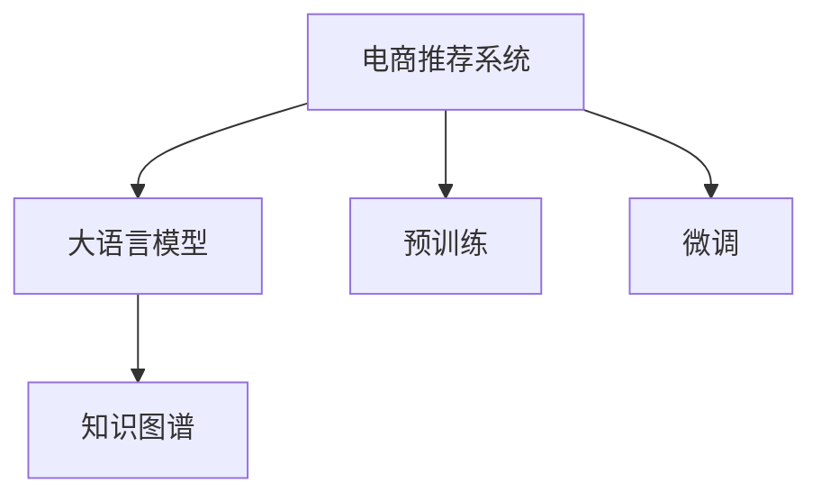

                 

# 大模型如何优化电商平台的实时个性化推荐系统

## 1. 背景介绍

### 1.1 问题由来
随着电商平台的快速发展和用户需求的不断提升，个性化推荐系统成为了电商行业的核心竞争力。通过算法推荐，电商平台可以根据用户的浏览历史、购买行为、兴趣偏好等信息，快速匹配合适的商品，提升用户体验和购买转化率。然而，传统的推荐系统往往基于用户行为数据进行单一的相似度匹配，难以应对海量数据和实时性需求。

为了解决这些问题，越来越多的电商平台开始探索基于大模型的个性化推荐技术，特别是使用预训练语言模型进行微调，在用户行为数据分析、上下文信息理解和用户意图推理等方面取得显著效果。本文章将详细阐述如何使用大语言模型优化电商平台的实时个性化推荐系统，并探讨其应用前景。

### 1.2 问题核心关键点
大模型在电商推荐中的应用，关键在于通过海量语料进行预训练，学习丰富的语言表示和知识，再通过下游任务的微调，提升模型对用户行为和上下文信息的理解能力。具体来说，包括以下几个方面：

1. **语料获取与预训练**：电商推荐场景下，可以通过电商平台的用户行为数据和商品描述构建语料库，进行大模型的预训练。

2. **下游任务微调**：通过微调，模型可以学习到具体的推荐任务，如商品评分预测、点击率预测、转化率预测等，进而实现个性化推荐。

3. **实时推荐**：微调后的模型可以快速响应新用户行为和上下文信息，实现实时推荐。

4. **知识融合**：结合电商平台的外部知识库、规则库等信息，增强模型的上下文理解能力。

5. **计算效率**：在实时推荐场景下，需要优化模型推理速度，减少计算资源消耗。

本文将详细探讨这些关键点，并结合实际项目，提供系统性的解决方案。

## 2. 核心概念与联系

### 2.1 核心概念概述

为更好地理解大语言模型在电商推荐中的应用，本节将介绍几个密切相关的核心概念：

- **电商推荐系统**：基于用户行为数据和商品属性信息，为每个用户推荐最相关的商品，以提升用户体验和销售额。
- **大语言模型**：以Transformer架构为基础，通过在大规模无标签文本数据上进行预训练，学习语言表示和知识的大规模语言模型。
- **预训练**：指在大规模无标签文本数据上，通过自监督学习任务训练模型，获得通用的语言表示。
- **微调(Fine-tuning)**：指在预训练模型的基础上，使用下游任务的少量标注数据，通过有监督学习优化模型在该任务上的性能。
- **知识图谱**：结合电商领域的具体知识，构建的商品、用户、行为三元组图谱，用于增强模型的上下文理解能力。

这些核心概念之间的逻辑关系可以通过以下Mermaid流程图来展示：



这个流程图展示了大语言模型在电商推荐系统中的应用过程：

1. 电商推荐系统通过用户行为数据和商品属性构建语料库。
2. 大语言模型通过预训练学习语言表示和知识。
3. 电商平台对微调后的模型进行训练，学习到具体的推荐任务。
4. 结合知识图谱，增强模型的上下文理解能力。

## 3. 核心算法原理 & 具体操作步骤
### 3.1 算法原理概述

电商推荐场景下，大语言模型的核心思想是通过预训练和微调，学习用户行为和商品属性的语义表示，进而实现个性化推荐。其核心算法原理如下：

1. **预训练**：在大规模无标签电商数据上进行自监督预训练，学习通用的语言表示和知识。
2. **微调**：在电商推荐数据集上进行微调，学习具体的推荐任务，如商品评分预测、点击率预测、转化率预测等。
3. **实时推荐**：在实际推荐场景下，对新数据进行推理，快速生成推荐结果。

具体的算法流程如下：

1. 收集电商平台的商品描述、用户行为数据、商品属性等信息，构建电商语料库。
2. 使用预训练语言模型对语料库进行预训练，获得通用的语言表示。
3. 将预训练模型作为初始化参数，对下游推荐任务进行微调，学习任务特定的参数。
4. 在实时推荐场景中，输入新用户行为和商品信息，使用微调后的模型进行推理，生成个性化推荐结果。

### 3.2 算法步骤详解

#### 3.2.1 数据准备

**Step 1: 数据收集与预处理**

1. **电商数据收集**：收集电商平台的用户行为数据、商品属性信息、商品描述等数据，构建电商语料库。
2. **数据预处理**：对电商数据进行清洗、归一化、标签化等预处理，准备后续的预训练和微调。

**Step 2: 构建训练集和验证集**

1. **划分训练集和验证集**：将电商数据集划分为训练集和验证集，通常训练集用于模型训练，验证集用于模型调优。
2. **数据增强**：对训练集进行数据增强，如随机回译、数据混洗、数据拼接等，增加训练集的多样性。

#### 3.2.2 模型选择与预训练

**Step 3: 选择预训练模型**

1. **模型选择**：选择适合电商推荐任务的预训练模型，如BERT、RoBERTa、GPT等。
2. **模型加载**：从HuggingFace等开源平台下载预训练模型，并进行加载。

**Step 4: 预训练**

1. **微调损失函数**：定义微调的损失函数，如交叉熵损失、均方误差损失等。
2. **微调优化器**：选择适当的优化器，如Adam、SGD等，设置学习率和批大小等超参数。
3. **微调过程**：使用预训练模型和电商数据集，进行微调训练。

#### 3.2.3 微调

**Step 5: 微调模型**

1. **微调训练**：在电商推荐数据集上，使用微调后的模型进行训练，学习具体的推荐任务。
2. **验证集评估**：在验证集上评估微调后的模型，调整超参数，防止过拟合。
3. **模型保存**：保存微调后的模型，供后续的实时推荐使用。

#### 3.2.4 实时推荐

**Step 6: 实时推荐**

1. **输入处理**：输入新用户行为和商品信息，进行预处理。
2. **模型推理**：使用微调后的模型，进行推理，生成推荐结果。
3. **结果输出**：将推荐结果输出到电商平台上，供用户查看。

### 3.3 算法优缺点

大语言模型在电商推荐中的应用，具有以下优点：

1. **通用性强**：大语言模型可以通过预训练学习通用的语言表示和知识，适应多种电商推荐任务。
2. **实时性好**：微调后的模型可以实时响应用户行为，快速生成推荐结果。
3. **效果显著**：大语言模型能够理解复杂的上下文信息，生成高质量的推荐结果。

同时，也存在一些缺点：

1. **数据依赖性高**：预训练和微调需要大量标注数据，获取高质量数据成本较高。
2. **计算资源消耗大**：大模型的预训练和微调需要高性能计算资源，存在资源消耗高的问题。
3. **模型复杂度高**：大模型的结构和参数量较大，推理和部署成本高。
4. **可解释性差**：大语言模型通常缺乏可解释性，难以理解模型的内部工作机制。

### 3.4 算法应用领域

大语言模型在电商推荐中的应用领域非常广泛，涵盖以下几个方面：

1. **商品推荐**：通过用户行为数据，预测用户可能感兴趣的商品，提升用户购买率。
2. **用户画像**：通过用户行为数据，构建用户画像，实现精准推荐。
3. **搜索排序**：根据用户查询词和商品描述，排序推荐商品，提升搜索效率。
4. **广告推荐**：根据用户行为和商品属性，推荐合适的广告，提高广告投放效果。
5. **实时监控**：实时监测用户行为，及时调整推荐策略，优化用户体验。

## 4. 数学模型和公式 & 详细讲解

### 4.1 数学模型构建

在本节中，我们将使用数学语言对电商推荐中大语言模型的微调过程进行详细描述。

设电商推荐任务的训练集为 $D=\{(x_i, y_i)\}_{i=1}^N$，其中 $x_i$ 表示用户行为数据和商品信息，$y_i$ 表示用户对商品的评分、点击率、转化率等。微调的目标是最小化经验风险 $\mathcal{L}(\theta)$，即：

$$
\mathcal{L}(\theta) = \frac{1}{N}\sum_{i=1}^N \ell(M_{\theta}(x_i),y_i)
$$

其中，$M_{\theta}$ 表示微调后的模型，$\ell$ 表示损失函数，$\theta$ 表示模型参数。

### 4.2 公式推导过程

假设模型 $M_{\theta}$ 在输入 $x_i$ 上的输出为 $M_{\theta}(x_i) \in \mathbb{R}$，表示用户对商品 $x_i$ 的评分、点击率、转化率等。定义模型的损失函数为：

$$
\ell(M_{\theta}(x_i),y_i) = \sum_{k=1}^K \ell_k(M_{\theta}(x_i),y_i)
$$

其中 $K$ 表示具体的推荐任务数。常见的推荐任务损失函数包括交叉熵损失、均方误差损失等。

微调的优化目标是最小化经验风险，即：

$$
\theta^* = \mathop{\arg\min}_{\theta} \mathcal{L}(\theta)
$$

在实践中，我们通常使用基于梯度的优化算法（如Adam、SGD等）来近似求解上述最优化问题。设 $\eta$ 为学习率，$\lambda$ 为正则化系数，则参数的更新公式为：

$$
\theta \leftarrow \theta - \eta \nabla_{\theta}\mathcal{L}(\theta) - \eta\lambda\theta
$$

其中 $\nabla_{\theta}\mathcal{L}(\theta)$ 为损失函数对参数 $\theta$ 的梯度，可通过反向传播算法高效计算。

### 4.3 案例分析与讲解

以电商平台的商品评分预测为例，我们定义损失函数为交叉熵损失：

$$
\ell_k(M_{\theta}(x_i),y_i) = -y_i\log M_{\theta}(x_i) - (1-y_i)\log(1-M_{\theta}(x_i))
$$

则电商推荐任务的损失函数为：

$$
\mathcal{L}(\theta) = -\frac{1}{N}\sum_{i=1}^N \sum_{k=1}^K y_i\log M_{\theta}(x_i) + (1-y_i)\log(1-M_{\theta}(x_i))
$$

在得到损失函数的梯度后，即可带入参数更新公式，完成模型的迭代优化。重复上述过程直至收敛，最终得到适应电商推荐任务的最优模型参数 $\theta^*$。

## 5. 项目实践：代码实例和详细解释说明
### 5.1 开发环境搭建

在进行电商推荐系统的大模型微调实践前，我们需要准备好开发环境。以下是使用Python进行PyTorch开发的环境配置流程：

1. 安装Anaconda：从官网下载并安装Anaconda，用于创建独立的Python环境。

2. 创建并激活虚拟环境：
```bash
conda create -n pytorch-env python=3.8 
conda activate pytorch-env
```

3. 安装PyTorch：根据CUDA版本，从官网获取对应的安装命令。例如：
```bash
conda install pytorch torchvision torchaudio cudatoolkit=11.1 -c pytorch -c conda-forge
```

4. 安装Transformers库：
```bash
pip install transformers
```

5. 安装各类工具包：
```bash
pip install numpy pandas scikit-learn matplotlib tqdm jupyter notebook ipython
```

完成上述步骤后，即可在`pytorch-env`环境中开始微调实践。

### 5.2 源代码详细实现

下面我们以电商平台的商品评分预测任务为例，给出使用Transformers库对BERT模型进行微调的PyTorch代码实现。

首先，定义商品评分预测任务的数据处理函数：

```python
from transformers import BertTokenizer
from torch.utils.data import Dataset
import torch

class ReviewDataset(Dataset):
    def __init__(self, reviews, labels, tokenizer, max_len=128):
        self.reviews = reviews
        self.labels = labels
        self.tokenizer = tokenizer
        self.max_len = max_len
        
    def __len__(self):
        return len(self.reviews)
    
    def __getitem__(self, item):
        review = self.reviews[item]
        label = self.labels[item]
        
        encoding = self.tokenizer(review, return_tensors='pt', max_length=self.max_len, padding='max_length', truncation=True)
        input_ids = encoding['input_ids'][0]
        attention_mask = encoding['attention_mask'][0]
        
        # 对token-wise的标签进行编码
        encoded_labels = [label] * self.max_len
        labels = torch.tensor(encoded_labels, dtype=torch.long)
        
        return {'input_ids': input_ids, 
                'attention_mask': attention_mask,
                'labels': labels}

# 定义模型和优化器
from transformers import BertForSequenceClassification

model = BertForSequenceClassification.from_pretrained('bert-base-cased', num_labels=2)

optimizer = AdamW(model.parameters(), lr=2e-5)

# 训练和评估函数
from torch.utils.data import DataLoader
from tqdm import tqdm

device = torch.device('cuda') if torch.cuda.is_available() else torch.device('cpu')
model.to(device)

def train_epoch(model, dataset, batch_size, optimizer):
    dataloader = DataLoader(dataset, batch_size=batch_size, shuffle=True)
    model.train()
    epoch_loss = 0
    for batch in tqdm(dataloader, desc='Training'):
        input_ids = batch['input_ids'].to(device)
        attention_mask = batch['attention_mask'].to(device)
        labels = batch['labels'].to(device)
        model.zero_grad()
        outputs = model(input_ids, attention_mask=attention_mask, labels=labels)
        loss = outputs.loss
        epoch_loss += loss.item()
        loss.backward()
        optimizer.step()
    return epoch_loss / len(dataloader)

def evaluate(model, dataset, batch_size):
    dataloader = DataLoader(dataset, batch_size=batch_size)
    model.eval()
    preds, labels = [], []
    with torch.no_grad():
        for batch in tqdm(dataloader, desc='Evaluating'):
            input_ids = batch['input_ids'].to(device)
            attention_mask = batch['attention_mask'].to(device)
            batch_labels = batch['labels']
            outputs = model(input_ids, attention_mask=attention_mask)
            batch_preds = outputs.logits.argmax(dim=2).to('cpu').tolist()
            batch_labels = batch_labels.to('cpu').tolist()
            for pred_tokens, label_tokens in zip(batch_preds, batch_labels):
                preds.append(pred_tokens)
                labels.append(label_tokens)
                
    print(classification_report(labels, preds))
```

然后，启动训练流程并在测试集上评估：

```python
epochs = 5
batch_size = 16

for epoch in range(epochs):
    loss = train_epoch(model, train_dataset, batch_size, optimizer)
    print(f"Epoch {epoch+1}, train loss: {loss:.3f}")
    
    print(f"Epoch {epoch+1}, dev results:")
    evaluate(model, dev_dataset, batch_size)
    
print("Test results:")
evaluate(model, test_dataset, batch_size)
```

以上就是使用PyTorch对BERT进行电商商品评分预测任务微调的完整代码实现。可以看到，得益于Transformers库的强大封装，我们可以用相对简洁的代码完成BERT模型的加载和微调。

### 5.3 代码解读与分析

让我们再详细解读一下关键代码的实现细节：

**ReviewDataset类**：
- `__init__`方法：初始化用户评论、标签、分词器等关键组件。
- `__len__`方法：返回数据集的样本数量。
- `__getitem__`方法：对单个样本进行处理，将评论输入编码为token ids，将标签编码为数字，并对其进行定长padding，最终返回模型所需的输入。

**标签与id的映射**：
- 定义了标签与数字id之间的映射关系，用于将token-wise的预测结果解码回真实的标签。

**训练和评估函数**：
- 使用PyTorch的DataLoader对数据集进行批次化加载，供模型训练和推理使用。
- 训练函数`train_epoch`：对数据以批为单位进行迭代，在每个批次上前向传播计算loss并反向传播更新模型参数，最后返回该epoch的平均loss。
- 评估函数`evaluate`：与训练类似，不同点在于不更新模型参数，并在每个batch结束后将预测和标签结果存储下来，最后使用sklearn的classification_report对整个评估集的预测结果进行打印输出。

**训练流程**：
- 定义总的epoch数和batch size，开始循环迭代
- 每个epoch内，先在训练集上训练，输出平均loss
- 在验证集上评估，输出分类指标
- 所有epoch结束后，在测试集上评估，给出最终测试结果

可以看到，PyTorch配合Transformers库使得BERT微调的代码实现变得简洁高效。开发者可以将更多精力放在数据处理、模型改进等高层逻辑上，而不必过多关注底层的实现细节。

当然，工业级的系统实现还需考虑更多因素，如模型的保存和部署、超参数的自动搜索、更灵活的任务适配层等。但核心的微调范式基本与此类似。

## 6. 实际应用场景
### 6.1 智能客服系统

基于大语言模型微调的对话技术，可以广泛应用于智能客服系统的构建。传统客服往往需要配备大量人力，高峰期响应缓慢，且一致性和专业性难以保证。而使用微调后的对话模型，可以7x24小时不间断服务，快速响应客户咨询，用自然流畅的语言解答各类常见问题。

在技术实现上，可以收集企业内部的历史客服对话记录，将问题和最佳答复构建成监督数据，在此基础上对预训练对话模型进行微调。微调后的对话模型能够自动理解用户意图，匹配最合适的答案模板进行回复。对于客户提出的新问题，还可以接入检索系统实时搜索相关内容，动态组织生成回答。如此构建的智能客服系统，能大幅提升客户咨询体验和问题解决效率。

### 6.2 金融舆情监测

金融机构需要实时监测市场舆论动向，以便及时应对负面信息传播，规避金融风险。传统的人工监测方式成本高、效率低，难以应对网络时代海量信息爆发的挑战。基于大语言模型微调的文本分类和情感分析技术，为金融舆情监测提供了新的解决方案。

具体而言，可以收集金融领域相关的新闻、报道、评论等文本数据，并对其进行主题标注和情感标注。在此基础上对预训练语言模型进行微调，使其能够自动判断文本属于何种主题，情感倾向是正面、中性还是负面。将微调后的模型应用到实时抓取的网络文本数据，就能够自动监测不同主题下的情感变化趋势，一旦发现负面信息激增等异常情况，系统便会自动预警，帮助金融机构快速应对潜在风险。

### 6.3 个性化推荐系统

当前的推荐系统往往只依赖用户的历史行为数据进行单一的相似度匹配，难以应对海量数据和实时性需求。基于大模型的推荐技术，可以更好地挖掘用户行为背后的语义信息，从而提供更精准、多样的推荐内容。

在实践中，可以收集用户浏览、点击、评论、分享等行为数据，提取和用户交互的物品标题、描述、标签等文本内容。将文本内容作为模型输入，用户的后续行为（如是否点击、购买等）作为监督信号，在此基础上微调预训练语言模型。微调后的模型能够从文本内容中准确把握用户的兴趣点。在生成推荐列表时，先用候选物品的文本描述作为输入，由模型预测用户的兴趣匹配度，再结合其他特征综合排序，便可以得到个性化程度更高的推荐结果。

### 6.4 未来应用展望

随着大语言模型微调技术的发展，基于微调范式将在更多领域得到应用，为传统行业带来变革性影响。

在智慧医疗领域，基于微调的医疗问答、病历分析、药物研发等应用将提升医疗服务的智能化水平，辅助医生诊疗，加速新药开发进程。

在智能教育领域，微调技术可应用于作业批改、学情分析、知识推荐等方面，因材施教，促进教育公平，提高教学质量。

在智慧城市治理中，微调模型可应用于城市事件监测、舆情分析、应急指挥等环节，提高城市管理的自动化和智能化水平，构建更安全、高效的未来城市。

此外，在企业生产、社会治理、文娱传媒等众多领域，基于大模型微调的人工智能应用也将不断涌现，为经济社会发展注入新的动力。相信随着技术的日益成熟，微调方法将成为人工智能落地应用的重要范式，推动人工智能技术在各个垂直行业的应用与发展。

## 7. 工具和资源推荐
### 7.1 学习资源推荐

为了帮助开发者系统掌握大语言模型微调的理论基础和实践技巧，这里推荐一些优质的学习资源：

1. 《Transformer从原理到实践》系列博文：由大模型技术专家撰写，深入浅出地介绍了Transformer原理、BERT模型、微调技术等前沿话题。

2. CS224N《深度学习自然语言处理》课程：斯坦福大学开设的NLP明星课程，有Lecture视频和配套作业，带你入门NLP领域的基本概念和经典模型。

3. 《Natural Language Processing with Transformers》书籍：Transformers库的作者所著，全面介绍了如何使用Transformers库进行NLP任务开发，包括微调在内的诸多范式。

4. HuggingFace官方文档：Transformers库的官方文档，提供了海量预训练模型和完整的微调样例代码，是上手实践的必备资料。

5. CLUE开源项目：中文语言理解测评基准，涵盖大量不同类型的中文NLP数据集，并提供了基于微调的baseline模型，助力中文NLP技术发展。

通过对这些资源的学习实践，相信你一定能够快速掌握大语言模型微调的精髓，并用于解决实际的NLP问题。
###  7.2 开发工具推荐

高效的开发离不开优秀的工具支持。以下是几款用于大语言模型微调开发的常用工具：

1. PyTorch：基于Python的开源深度学习框架，灵活动态的计算图，适合快速迭代研究。大部分预训练语言模型都有PyTorch版本的实现。

2. TensorFlow：由Google主导开发的开源深度学习框架，生产部署方便，适合大规模工程应用。同样有丰富的预训练语言模型资源。

3. Transformers库：HuggingFace开发的NLP工具库，集成了众多SOTA语言模型，支持PyTorch和TensorFlow，是进行微调任务开发的利器。

4. Weights & Biases：模型训练的实验跟踪工具，可以记录和可视化模型训练过程中的各项指标，方便对比和调优。与主流深度学习框架无缝集成。

5. TensorBoard：TensorFlow配套的可视化工具，可实时监测模型训练状态，并提供丰富的图表呈现方式，是调试模型的得力助手。

6. Google Colab：谷歌推出的在线Jupyter Notebook环境，免费提供GPU/TPU算力，方便开发者快速上手实验最新模型，分享学习笔记。

合理利用这些工具，可以显著提升大语言模型微调任务的开发效率，加快创新迭代的步伐。

### 7.3 相关论文推荐

大语言模型和微调技术的发展源于学界的持续研究。以下是几篇奠基性的相关论文，推荐阅读：

1. Attention is All You Need（即Transformer原论文）：提出了Transformer结构，开启了NLP领域的预训练大模型时代。

2. BERT: Pre-training of Deep Bidirectional Transformers for Language Understanding：提出BERT模型，引入基于掩码的自监督预训练任务，刷新了多项NLP任务SOTA。

3. Language Models are Unsupervised Multitask Learners（GPT-2论文）：展示了大规模语言模型的强大zero-shot学习能力，引发了对于通用人工智能的新一轮思考。

4. Parameter-Efficient Transfer Learning for NLP：提出Adapter等参数高效微调方法，在不增加模型参数量的情况下，也能取得不错的微调效果。

5. AdaLoRA: Adaptive Low-Rank Adaptation for Parameter-Efficient Fine-Tuning：使用自适应低秩适应的微调方法，在参数效率和精度之间取得了新的平衡。

这些论文代表了大语言模型微调技术的发展脉络。通过学习这些前沿成果，可以帮助研究者把握学科前进方向，激发更多的创新灵感。

## 8. 总结：未来发展趋势与挑战

### 8.1 总结

本文对基于大语言模型的电商推荐系统进行了详细阐述。首先介绍了电商推荐系统和大语言模型的基本概念，明确了微调在拓展预训练模型应用、提升推荐系统性能方面的独特价值。其次，从原理到实践，详细讲解了电商推荐系统中大语言模型的微调过程，并提供了系统性的代码实现。最后，我们探讨了电商推荐系统在未来智能客服、金融舆情、个性化推荐等领域的广泛应用前景。

通过本文的系统梳理，可以看到，基于大语言模型的电商推荐系统正在成为电商行业的核心竞争力，极大地提升了用户体验和销售额。未来，伴随大语言模型微调技术的发展，基于微调范式将在更多领域得到应用，为传统行业带来变革性影响。

### 8.2 未来发展趋势

展望未来，大语言模型在电商推荐系统中的应用，将呈现以下几个发展趋势：

1. **模型规模持续增大**：随着算力成本的下降和数据规模的扩张，预训练语言模型的参数量还将持续增长。超大规模语言模型蕴含的丰富语言知识，有望支撑更加复杂多变的电商推荐任务。

2. **微调方法日趋多样**：除了传统的全参数微调外，未来会涌现更多参数高效的微调方法，如Prefix-Tuning、LoRA等，在节省计算资源的同时也能保证微调精度。

3. **持续学习成为常态**：随着数据分布的不断变化，微调模型也需要持续学习新知识以保持性能。如何在不遗忘原有知识的同时，高效吸收新样本信息，将成为重要的研究课题。

4. **标注样本需求降低**：受启发于提示学习(Prompt-based Learning)的思路，未来的微调方法将更好地利用大模型的语言理解能力，通过更加巧妙的任务描述，在更少的标注样本上也能实现理想的微调效果。

5. **实时推荐技术成熟**：为了提升用户体验，电商推荐系统需要快速响应用户行为，实现实时推荐。未来，结合缓存技术、流式计算等手段，实时推荐技术将更加成熟，应用场景更加广泛。

6. **跨模态融合能力提升**：电商平台上的商品往往包含图片、视频等多模态数据。未来，大语言模型将更好地融合多模态数据，提升推荐系统的上下文理解能力。

以上趋势凸显了大语言模型微调技术在电商推荐系统中的广阔前景。这些方向的探索发展，必将进一步提升电商推荐系统的性能和应用范围，为电商平台带来更大的商业价值。

### 8.3 面临的挑战

尽管大语言模型在电商推荐系统中取得了显著效果，但在迈向更加智能化、普适化应用的过程中，它仍面临着诸多挑战：

1. **标注成本瓶颈**：预训练和微调需要大量标注数据，获取高质量标注数据的成本较高。如何进一步降低微调对标注样本的依赖，将是一大难题。

2. **计算资源消耗大**：大模型的预训练和微调需要高性能计算资源，存在资源消耗高的问题。如何优化计算图，降低资源消耗，是一个重要的研究方向。

3. **模型复杂度高**：大模型的结构和参数量较大，推理和部署成本高。如何简化模型结构，优化推理速度，是一个亟待解决的问题。

4. **可解释性差**：大语言模型通常缺乏可解释性，难以理解模型的内部工作机制。如何赋予微调模型更强的可解释性，将是亟待攻克的难题。

5. **安全性有待保障**：预训练语言模型难免会学习到有偏见、有害的信息，通过微调传递到电商推荐系统中，可能对用户造成误导或不良影响。如何从数据和算法层面消除模型偏见，确保输出安全，是一个重要的研究方向。

6. **知识整合能力不足**：现有的微调模型往往局限于电商推荐数据，难以灵活吸收和运用更广泛的先验知识。如何让微调过程更好地与外部知识库、规则库等专家知识结合，形成更加全面、准确的信息整合能力，还有很大的想象空间。

正视微调面临的这些挑战，积极应对并寻求突破，将是大语言模型微调走向成熟的必由之路。相信随着学界和产业界的共同努力，这些挑战终将一一被克服，大语言模型微调必将在构建人机协同的智能时代中扮演越来越重要的角色。

### 8.4 研究展望

未来，大语言模型微调技术在电商推荐系统中的应用，将进一步扩展和深化。我们期待在以下几个方面取得新的突破：

1. **多任务学习**：结合电商推荐系统的多种任务，进行多任务联合微调，提升模型性能和泛化能力。

2. **跨领域迁移**：将电商推荐系统中的微调模型，应用于其他领域的推荐任务，实现跨领域的知识迁移。

3. **自适应学习**：开发自适应学习算法，使得模型能够自动调整学习策略，优化微调效果。

4. **知识增强**：结合电商平台的外部知识库、规则库等信息，增强模型的上下文理解能力。

5. **动态更新**：结合实时数据流，动态更新模型参数，实现模型性能的实时优化。

6. **跨模态融合**：结合电商商品的多模态数据，提升推荐系统的上下文理解能力。

这些研究方向将进一步推动大语言模型微调技术在电商推荐系统中的应用，提升推荐系统的智能化水平，为电商平台带来更大的商业价值。

## 9. 附录：常见问题与解答

**Q1：电商推荐系统中大语言模型微调需要哪些预处理步骤？**

A: 电商推荐系统中大语言模型微调的主要预处理步骤包括：
1. **数据收集**：收集电商平台的用户行为数据、商品属性信息、商品描述等数据，构建电商语料库。
2. **数据预处理**：对电商数据进行清洗、归一化、标签化等预处理，准备后续的预训练和微调。
3. **数据增强**：对训练集进行数据增强，如随机回译、数据混洗、数据拼接等，增加训练集的多样性。
4. **划分训练集和验证集**：将电商数据集划分为训练集和验证集，通常训练集用于模型训练，验证集用于模型调优。

**Q2：电商推荐系统中如何选择合适的微调模型？**

A: 在电商推荐系统中，选择合适的微调模型主要考虑以下几个方面：
1. **任务适应性**：选择适合电商推荐任务的微调模型，如BERT、RoBERTa、GPT等。
2. **计算资源**：考虑计算资源成本，选择参数量适中、推理速度较快的模型。
3. **数据集规模**：根据数据集规模，选择模型复杂度与数据量匹配的模型。
4. **模型性能**：在验证集上评估模型性能，选择效果最优的模型。

**Q3：电商推荐系统中大语言模型微调如何进行超参数调优？**

A: 电商推荐系统中大语言模型微调的超参数调优主要包括以下几个步骤：
1. **初始化超参数**：选择常见的超参数设置，如学习率、批大小、迭代轮数等。
2. **网格搜索或随机搜索**：在指定的超参数空间内进行网格搜索或随机搜索，寻找最优超参数组合。
3. **验证集评估**：在验证集上评估不同超参数组合下的模型性能，选择性能最优的组合。
4. **交叉验证**：进行交叉验证，确保超参数选择的稳健性。
5. **最终验证**：在最终测试集上评估超参数选择的模型性能，确保模型泛化能力。

**Q4：电商推荐系统中大语言模型微调如何处理多模态数据？**

A: 电商推荐系统中大语言模型微调处理多模态数据主要包括以下几个步骤：
1. **数据收集**：收集电商平台上包含图片、视频、文本等多模态数据的商品信息。
2. **数据融合**：将多模态数据融合为一个综合向量，作为模型输入。
3. **特征提取**：使用预训练的语言模型和视觉模型对多模态数据进行特征提取。
4. **多模态融合**：结合多模态特征，使用融合算法生成融合向量。
5. **模型微调**：在融合向量上，对预训练语言模型进行微调，学习多模态数据的信息。

**Q5：电商推荐系统中大语言模型微调如何提升实时推荐性能？**

A: 电商推荐系统中大语言模型微调提升实时推荐性能主要包括以下几个方面：
1. **模型裁剪**：去除不必要的层和参数，减小模型尺寸，加快推理速度。
2. **量化加速**：将浮点模型转为定点模型，压缩存储空间，提高计算效率。
3. **流式计算**：结合缓存技术，采用流式计算方式，减少计算资源消耗。
4. **硬件优化**：使用GPU、TPU等高性能设备，加速模型推理。
5. **分布式计算**：采用分布式计算方式，提升计算效率和并行能力。

---

作者：禅与计算机程序设计艺术 / Zen and the Art of Computer Programming

