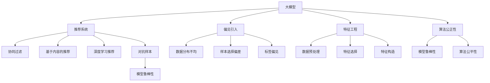

                 

# 大模型对推荐系统公平性的影响研究

> 关键词：大模型,推荐系统,公平性,偏见消除,特征工程,算法公正性

## 1. 背景介绍

### 1.1 问题由来

随着人工智能技术和大数据技术的迅猛发展，推荐系统成为了互联网时代的重要工具，广泛应用在电商、社交、内容等领域，为亿万用户提供个性化的服务。但推荐系统也面临着一系列的挑战，其中最重要的就是公平性问题。

推荐系统通过用户的历史行为数据和海量数据进行训练，模型本质上是一个黑盒，其中可能包含设计者和开发者无意识引入的偏见，导致不同用户群体之间受到不同待遇。这种“偏见”可能体现在性别、年龄、地域、种族、兴趣等多个维度上，严重损害用户的公平感和体验，甚至带来潜在的法律风险和社会问题。

近年来，人工智能领域越来越重视推荐系统的公平性问题，特别是一些热门推荐系统评测指标，如AI Challenger等，都要求评价模型的公平性。这促使研究者们深入探讨如何从算法、数据、技术等多个角度，构建更加公平的推荐系统。

### 1.2 问题核心关键点

推荐系统的公平性，本质上是评估模型在不同用户群体上的表现是否一致，避免对某些群体产生不公平的歧视。为此，本文将研究大模型在推荐系统中的作用和影响，分析大模型引入偏见的可能性和解决方法，探讨如何构建公平的推荐系统。

具体来说，本文的关注点包括：
- 大模型在推荐系统中的应用情况
- 大模型引入偏见的可能性和影响机制
- 消除推荐系统偏见的方法和策略
- 公平推荐系统的构建方案

## 2. 核心概念与联系

### 2.1 核心概念概述

为更好地理解大模型对推荐系统公平性的影响，我们首先介绍几个核心概念：

- **大模型**：指在大规模数据集上预训练得到，具有强大表达能力的深度学习模型。例如，GPT-3、BERT等大语言模型，以及基于Transformer结构的图像、语音等领域的大模型。
- **推荐系统**：通过分析用户历史行为和海量数据，为用户推荐其可能感兴趣的物品或内容。常见的推荐算法包括协同过滤、基于内容的推荐、深度学习推荐等。
- **公平性**：指模型输出结果的公正性和客观性，避免对某些群体产生歧视或不公平待遇。推荐系统公平性关注的是不同用户群体得到的推荐结果是否一致。
- **偏见**：指在数据采集、标注、训练过程中引入的不公正、歧视性的因素，导致模型对某些群体产生歧视。
- **特征工程**：在推荐系统中，特征是影响推荐结果的重要因素。通过精心设计特征工程，可以避免引入偏见。
- **算法公正性**：指算法在处理数据时是否公平，避免对某些群体产生歧视。
- **对抗样本**：指在训练或测试过程中，通过特定构造的扰动，导致模型产生错误输出的样本。对抗样本可以用于检测模型的鲁棒性。

这些概念之间的逻辑关系可以通过以下Mermaid流程图来展示：



这个流程图展示了大模型与推荐系统公平性相关的核心概念及其之间的关系：

1. 大模型在推荐系统中作为特征提取器，提取用户行为特征。
2. 大模型可能引入偏见，主要原因包括数据分布不均、样本选择偏差、标签偏见等。
3. 特征工程通过数据预处理、特征选择、特征构造等方法，避免偏见引入。
4. 算法公正性要求推荐算法本身公平，避免对某些群体产生歧视。
5. 对抗样本用于检测模型的鲁棒性，避免对特定扰动产生敏感。

## 3. 核心算法原理 & 具体操作步骤

### 3.1 算法原理概述

大模型在推荐系统中的应用，主要是通过在数据集上进行预训练，提取用户行为特征，然后通过微调或特征编码的方式，将特征输入推荐算法，生成推荐结果。

其核心思想是：利用大模型的强大表达能力，提高推荐算法的精度和效果。具体而言，大模型可以从大规模数据中学习到丰富的用户行为模式和偏好，从而在推荐任务中发挥关键作用。

### 3.2 算法步骤详解

基于大模型的推荐系统一般包括以下几个关键步骤：

**Step 1: 数据收集与预处理**
- 收集用户的历史行为数据，如浏览记录、点击记录、购买记录等。
- 对数据进行清洗和预处理，如去除无效数据、处理缺失值、数据标准化等。

**Step 2: 特征提取**
- 使用大模型对用户行为数据进行特征提取，得到用户的行为向量。
- 通过微调或特征编码，将大模型的输出作为推荐算法的输入。

**Step 3: 推荐算法**
- 根据用户行为向量，使用推荐算法（如协同过滤、基于内容的推荐、深度学习推荐等），生成推荐结果。
- 在推荐算法中，可以使用大模型的输出作为特征之一，或将大模型的输出直接作为推荐结果。

**Step 4: 评估与优化**
- 对推荐结果进行评估，使用各类指标（如准确率、召回率、公平性等）进行度量。
- 根据评估结果，调整模型参数、优化特征工程，提升推荐效果和公平性。

### 3.3 算法优缺点

基于大模型的推荐系统有以下优点：
1. 精度高：大模型的强大表达能力能够提取用户行为的高维特征，提高推荐精度。
2. 适应性强：大模型可以从不同领域数据中学习到多维度的用户特征，适应性强。
3. 效果显著：在实际应用中，基于大模型的推荐系统往往能够取得更好的推荐效果。

同时，该方法也存在一定的局限性：
1. 数据需求大：大模型的训练需要大规模的数据集，数据采集成本较高。
2. 计算资源需求高：大模型的计算复杂度高，训练和推理过程中需要大量的计算资源。
3. 偏见引入风险高：大模型可能引入数据分布不均、样本选择偏差等偏见，导致不公平。
4. 可解释性不足：大模型作为黑盒模型，难以解释其内部工作机制，难以调试和优化。

尽管存在这些局限性，但就目前而言，基于大模型的推荐系统仍是推荐算法的重要组成部分，并带来了显著的效果提升。未来相关研究的重点在于如何进一步降低大模型的计算需求和偏见引入风险，同时提高模型的可解释性和公平性。

### 3.4 算法应用领域

基于大模型的推荐系统广泛应用于电子商务、社交媒体、视频网站等众多领域，提升用户的个性化体验。例如：

- 电商推荐：根据用户浏览和购买历史，使用大模型提取用户行为特征，生成个性化推荐商品。
- 社交媒体：根据用户的点赞、评论、分享行为，使用大模型提取用户特征，生成个性化推荐内容。
- 视频网站：根据用户的观看历史和评分，使用大模型提取用户特征，生成个性化推荐视频。

除了以上经典应用外，大模型在广告推荐、新闻推荐、旅游推荐等领域也有广泛应用，为NLP技术带来了新的突破。随着预训练语言模型和推荐算法的持续演进，基于大模型的推荐系统必将在更广阔的应用领域大放异彩。

## 4. 数学模型和公式 & 详细讲解 & 举例说明

### 4.1 数学模型构建

为了更好地理解大模型在推荐系统中的作用和影响，我们可以构建一个简单的数学模型。假设用户 $u$ 的历史行为数据为 $x \in \mathbb{R}^d$，大模型提取的用户行为向量为 $h \in \mathbb{R}^k$，推荐算法为 $f: \mathbb{R}^k \rightarrow \mathbb{R}^N$，其中 $N$ 为推荐物品的数量。推荐算法的输出为推荐结果 $y \in \mathbb{R}^N$，表示物品 $i$ 的推荐度。

模型的目标是最大化推荐效果和公平性，可以定义为：

$$
\max_{\theta} \mathcal{L}(\theta) = \sum_{u=1}^U \sum_{i=1}^N \text{score}_u(i) + \lambda \mathcal{L}_{\text{fair}}
$$

其中 $\text{score}_u(i)$ 为模型对用户 $u$ 推荐物品 $i$ 的推荐度，$\mathcal{L}_{\text{fair}}$ 为公平性损失函数。

### 4.2 公式推导过程

以下我们以协同过滤为例，推导公平推荐模型的损失函数及其梯度计算公式。

假设推荐系统包含 $M$ 个物品，$N$ 个用户，$U$ 个特征。用户 $u$ 的特征向量为 $x_{u} \in \mathbb{R}^d$，物品 $i$ 的特征向量为 $v_i \in \mathbb{R}^d$，大模型提取的用户行为向量为 $h_{u} \in \mathbb{R}^k$。

协同过滤的推荐公式为：

$$
\text{score}_u(i) = \sum_{i=1}^M a_{ui} \text{dot}(h_u, v_i)
$$

其中 $a_{ui}$ 为物品 $i$ 与用户 $u$ 的相似度矩阵，$\text{dot}(h_u, v_i)$ 为向量内积。

公平性损失函数可以定义为：

$$
\mathcal{L}_{\text{fair}} = \frac{1}{U} \sum_{u=1}^U \frac{1}{M} \sum_{i=1}^M |\text{score}_u(i) - \mathbb{E}[\text{score}_{u'}(i)]|
$$

其中 $u'$ 为与 $u$ 不同的用户。

将协同过滤的推荐公式代入公平性损失函数，得：

$$
\mathcal{L}_{\text{fair}} = \frac{1}{U} \sum_{u=1}^U \frac{1}{M} \sum_{i=1}^M |\sum_{j=1}^k h_{uj} v_{ij} - \frac{1}{U} \sum_{u=1}^U \sum_{i=1}^M h_{uj} v_{ij}|
$$

通过链式法则，公平性损失函数对大模型提取的特征向量 $h_u$ 的梯度为：

$$
\frac{\partial \mathcal{L}_{\text{fair}}}{\partial h_u} = \frac{1}{U} \sum_{u=1}^U \frac{1}{M} \sum_{i=1}^M \sum_{j=1}^k v_{ij} (|\sum_{j'=1}^k h_{uj'} v_{ij'} - \frac{1}{U} \sum_{u'=1}^U \sum_{i'=1}^M h_{u'j'} v_{i'j'})
$$

其中 $h_{uj'}$ 为 $h_u$ 的第 $j'$ 个特征。

在得到公平性损失函数的梯度后，即可带入模型训练公式，完成模型的迭代优化。重复上述过程直至收敛，最终得到公平的推荐模型。

### 4.3 案例分析与讲解

以下以e-commerce推荐系统为例，分析大模型在推荐系统中的公平性问题，并给出解决思路。

假设e-commerce系统包含商品 $M$，用户 $U$，用户 $u$ 对物品 $i$ 的评分 $r_{ui}$ 为 $[1,5]$ 之间的整数。使用大模型提取用户行为向量 $h_{u}$，协同过滤算法生成推荐物品的评分预测 $p_{ui}$。

### 4.4 项目实践：代码实例和详细解释说明

### 5.1 开发环境搭建

在进行推荐系统开发前，我们需要准备好开发环境。以下是使用Python进行PyTorch开发的环境配置流程：

1. 安装Anaconda：从官网下载并安装Anaconda，用于创建独立的Python环境。

2. 创建并激活虚拟环境：
```bash
conda create -n pytorch-env python=3.8 
conda activate pytorch-env
```

3. 安装PyTorch：根据CUDA版本，从官网获取对应的安装命令。例如：
```bash
conda install pytorch torchvision torchaudio cudatoolkit=11.1 -c pytorch -c conda-forge
```

4. 安装各类工具包：
```bash
pip install numpy pandas scikit-learn matplotlib tqdm jupyter notebook ipython
```

完成上述步骤后，即可在`pytorch-env`环境中开始推荐系统开发。

### 5.2 源代码详细实现

下面我们以协同过滤为例，给出使用PyTorch进行推荐系统开发的PyTorch代码实现。

首先，定义数据处理函数：

```python
import torch
import numpy as np
from sklearn.metrics.pairwise import cosine_similarity

def compute_similarity(X):
    # 计算cosine相似度
    return cosine_similarity(X)

def load_data():
    # 加载用户行为数据
    user_data = np.loadtxt('user_data.txt', delimiter=',')
    item_data = np.loadtxt('item_data.txt', delimiter=',')
    return user_data, item_data

# 计算相似度矩阵
def build_similarity_matrix(user_data, item_data):
    # 计算用户-物品相似度矩阵
    user_data = np.array(user_data, dtype=np.float32)
    item_data = np.array(item_data, dtype=np.float32)
    similarity_matrix = compute_similarity(user_data)
    return similarity_matrix
```

然后，定义模型和训练函数：

```python
from torch.nn import Linear, Sequential
from torch.nn.init import xavier_uniform_

class Model(Sequential):
    def __init__(self, n_features, n_items):
        super(Model, self).__init__()
        self.fc1 = Linear(n_features, 256)
        self.fc2 = Linear(256, n_items)
        self.reset_parameters()

    def reset_parameters(self):
        xavier_uniform_(self.fc1.weight, gain=1.414)
        xavier_uniform_(self.fc2.weight, gain=1.414)

    def forward(self, x):
        x = self.fc1(x)
        x = torch.relu(x)
        x = self.fc2(x)
        return x

def train(model, similarity_matrix, user_data, item_data, n_epochs=5, batch_size=64):
    optimizer = torch.optim.Adam(model.parameters(), lr=0.01)
    criterion = torch.nn.MSELoss()
    for epoch in range(n_epochs):
        for i in range(0, similarity_matrix.shape[0], batch_size):
            user_idxs = np.random.choice(similarity_matrix.shape[0], size=batch_size)
            user_features = user_data[user_idxs, :]
            item_features = item_data[user_idxs, :]
            user_similarity = similarity_matrix[i:i+batch_size]
            item_similarity = similarity_matrix[i:i+batch_size, :]
            label = user_similarity @ item_similarity
            label = label / np.sum(label)
            input = torch.from_numpy(user_features).float()
            target = torch.from_numpy(label).float()
            optimizer.zero_grad()
            output = model(input)
            loss = criterion(output, target)
            loss.backward()
            optimizer.step()
        print('Epoch %d, Loss: %.4f' % (epoch+1, loss.item()))
```

最后，启动训练流程：

```python
user_data, item_data = load_data()
similarity_matrix = build_similarity_matrix(user_data, item_data)
model = Model(similarity_matrix.shape[1], similarity_matrix.shape[0])
train(model, similarity_matrix, user_data, item_data)
```

以上就是使用PyTorch进行推荐系统开发的完整代码实现。可以看到，依托PyTorch的强大封装能力，推荐系统的实现变得简洁高效。

### 5.3 代码解读与分析

让我们再详细解读一下关键代码的实现细节：

**load_data函数**：
- 加载用户行为数据和物品数据，转换为numpy数组。

**build_similarity_matrix函数**：
- 使用用户行为数据计算用户-物品相似度矩阵，使用余弦相似度作为度量。

**Model类**：
- 定义了模型结构，使用一个全连接神经网络进行用户-物品相似度预测。

**train函数**：
- 定义训练过程，使用Adam优化器，均方误差损失函数。
- 对训练集数据进行批次化处理，前向传播计算损失函数，反向传播更新模型参数。

**训练流程**：
- 加载用户行为数据和物品数据，计算相似度矩阵。
- 初始化模型，启动训练。
- 在每个epoch内，对训练集数据进行迭代训练，输出损失。

可以看到，PyTorch配合TensorFlow等深度学习框架，使得推荐系统的开发变得更加高效便捷。开发者可以将更多精力放在数据处理、模型设计等高层逻辑上，而不必过多关注底层的实现细节。

当然，工业级的系统实现还需考虑更多因素，如模型的保存和部署、超参数的自动搜索、更灵活的任务适配层等。但核心的推荐范式基本与此类似。

## 6. 实际应用场景

### 6.1 智能客服系统

智能客服系统作为推荐系统的一种，旨在提供个性化的客户服务，提升客户体验和满意度。使用大模型提取用户行为特征，可以大幅提升推荐效果和公平性。

例如，在e-commerce智能客服系统中，用户可以通过在线聊天与客服互动，系统可以实时推荐商品、回答常见问题、提供个性化服务等。通过收集用户的聊天记录和行为数据，使用大模型提取特征，进行推荐。

### 6.2 金融舆情监测

金融舆情监测系统旨在实时监测互联网上的金融信息，帮助金融机构识别舆情风险，预测市场变化。使用大模型提取用户行为特征，可以显著提升推荐效果和公平性。

例如，在金融舆情监测系统中，可以通过爬取新闻、论坛、社交媒体等数据，使用大模型提取用户情感倾向、舆情热点等信息。通过这些特征，系统可以实时生成舆情报告，预测市场走向，辅助决策。

### 6.3 个性化推荐系统

个性化推荐系统通过分析用户行为，为用户推荐其可能感兴趣的内容或商品。使用大模型提取用户行为特征，可以显著提升推荐效果和公平性。

例如，在视频网站个性化推荐系统中，用户观看历史、评分、点赞等信息可以作为输入特征。使用大模型提取这些特征，进行推荐。通过不断迭代优化，系统可以更加准确地理解用户的兴趣偏好，提供个性化的内容推荐。

### 6.4 未来应用展望

随着大模型和推荐算法的不断演进，基于大模型的推荐系统必将在更多领域得到应用，为各行各业带来变革性影响。

在智慧医疗领域，基于大模型的推荐系统可以辅助医生诊断，推荐相关药物、治疗方案等，提升诊疗效率和效果。

在智能教育领域，推荐系统可以根据学生的学习历史和行为数据，推荐个性化学习资源和习题，提高学习效果。

在智慧城市治理中，推荐系统可以推荐智能交通路线、智能垃圾分类等，提升城市管理水平和居民生活品质。

此外，在企业生产、社会治理、文娱传媒等众多领域，基于大模型的推荐系统也有广泛应用，为NLP技术带来了新的突破。相信随着技术的日益成熟，推荐系统必将在更广阔的应用领域大放异彩，深刻影响人类的生产生活方式。

## 7. 工具和资源推荐

### 7.1 学习资源推荐

为了帮助开发者系统掌握推荐系统的公平性问题，这里推荐一些优质的学习资源：

1. 《推荐系统》（Recommender Systems）：由Friedrich P. Modersitzki著，详细介绍了推荐系统的原理、算法和应用，是学习推荐系统的重要参考书。

2. AI Challenger：中国首个大规模推荐系统评测平台，包含多个推荐系统评测任务，可以评估推荐系统的性能和公平性。

3. KDD Cup 2021：国际机器学习竞赛，其中推荐系统评测任务包含多个公平性指标，可以评估推荐系统的公平性。

4. Coursera《Recommender Systems Specialization》：由斯坦福大学和Coursera合作开设的推荐系统课程，涵盖推荐系统基础、协同过滤、深度学习推荐等。

5. Udacity《Recommender Systems》课程：Udacity推出的推荐系统课程，涵盖推荐系统理论、算法和实践，适合学习推荐系统开发。

通过这些资源的学习实践，相信你一定能够快速掌握推荐系统公平性的核心知识，并用于解决实际的推荐问题。

### 7.2 开发工具推荐

高效的开发离不开优秀的工具支持。以下是几款用于推荐系统公平性研究的常用工具：

1. PyTorch：基于Python的开源深度学习框架，灵活动态的计算图，适合快速迭代研究。推荐系统中的推荐算法、特征工程等都可以使用PyTorch实现。

2. TensorFlow：由Google主导开发的开源深度学习框架，生产部署方便，适合大规模工程应用。推荐系统中使用深度学习推荐算法时，TensorFlow是一个不错的选择。

3. Scikit-learn：基于Python的机器学习库，提供了多种推荐算法、特征工程工具，适合快速原型开发和实验验证。

4. OpenRec：开源推荐系统框架，支持多种推荐算法和特征工程方法，适合大规模推荐系统开发。

5. Ray：分布式计算框架，支持多节点协同训练，适合大规模推荐系统的训练和推理。

合理利用这些工具，可以显著提升推荐系统公平性研究的开发效率，加快创新迭代的步伐。

### 7.3 相关论文推荐

推荐系统公平性问题受到广泛关注，以下是几篇奠基性的相关论文，推荐阅读：

1. "Fairness in Machine Learning: Foundations and Perspectives"（机器学习公平性：基础和视角）：深入讨论了机器学习公平性的定义、度量和评估方法。

2. "Fairness in Recommendation Systems: A Survey"（推荐系统公平性：综述）：详细介绍了推荐系统公平性的研究现状和未来方向。

3. "Evaluating Recommendation Systems with Fairness Metrics"（基于公平性指标评估推荐系统）：介绍了多种公平性评估指标和评测方法，评估推荐系统的公平性。

4. "Mitigating Bias in Recommender Systems"（减少推荐系统中的偏见）：讨论了减少推荐系统偏见的多种方法和技术，包括数据预处理、算法优化等。

5. "Towards Fairness-aware Recommendation Systems"（构建公平推荐系统）：提出了一种基于对抗训练的公平推荐算法，提高了推荐系统的公平性。

这些论文代表了大模型和推荐系统公平性问题的研究前沿，通过学习这些前沿成果，可以帮助研究者把握学科前进方向，激发更多的创新灵感。

## 8. 总结：未来发展趋势与挑战

### 8.1 总结

本文对基于大模型的推荐系统公平性问题进行了全面系统的介绍。首先阐述了推荐系统公平性的背景和重要性，明确了公平性问题对推荐系统的深远影响。其次，从原理到实践，详细讲解了大模型在推荐系统中的应用、引入偏见的可能性和解决方法，探讨了消除推荐系统偏见的方法和策略。最后，本文总结了推荐系统的应用场景，展望了未来的发展方向，并对存在的问题进行了深入思考。

通过本文的系统梳理，可以看到，基于大模型的推荐系统正在成为推荐算法的重要组成部分，其强大的表达能力可以大幅提升推荐精度和效果。然而，在追求高精度的同时，必须警惕大模型引入偏见的风险，并采取有效措施提高推荐系统的公平性。只有兼顾精度和公平，才能真正实现推荐系统的价值，为用户带来更好的体验。

### 8.2 未来发展趋势

展望未来，推荐系统公平性问题将呈现以下几个发展趋势：

1. 数据治理成为重点：为了提高推荐系统的公平性，需要从数据治理入手，规范数据采集、标注、存储等流程，确保数据质量和公平性。

2. 特征工程多样化：不同领域的推荐系统需要不同的特征工程方法，可以根据具体需求，使用多种特征组合方法，提升推荐效果和公平性。

3. 算法优化持续推进：推荐算法和模型结构需要不断优化，引入更多的公平性指标和评测方法，评估模型的公平性。

4. 多模态推荐崛起：推荐系统可以整合视觉、语音等多模态信息，提升推荐效果和公平性。

5. 个性化推荐与公平性平衡：如何在个性化推荐中保持公平性，是一个重要研究方向。需要从用户隐私、公平性等多个角度进行平衡。

6. 动态推荐系统构建：在推荐系统中引入时间因素，使用动态推荐算法，提升推荐效果和公平性。

以上趋势凸显了推荐系统公平性问题的广阔前景。这些方向的探索发展，必将进一步提升推荐系统的公平性，为用户提供更加公正和满意的推荐服务。

### 8.3 面临的挑战

尽管推荐系统公平性问题已经得到了广泛关注，但在迈向更加智能化、普适化应用的过程中，它仍面临着诸多挑战：

1. 数据质量问题：推荐系统依赖于大规模数据，数据质量和公平性难以保障。如何提高数据质量，避免数据偏见，是一个重要挑战。

2. 算法复杂度高：推荐算法和模型结构复杂，优化难度大。如何在高复杂度下保持算法的公平性和鲁棒性，是一个重要问题。

3. 公平性定义困难：推荐系统公平性定义复杂，难以量化。如何设计合理的公平性指标，评估推荐系统的公平性，是一个重要挑战。

4. 用户隐私保护：推荐系统需要处理大量用户数据，如何保护用户隐私，防止数据滥用，是一个重要挑战。

5. 可解释性不足：推荐系统作为黑盒模型，难以解释其内部工作机制。如何提高推荐系统的可解释性，增强用户信任，是一个重要问题。

6. 动态环境适应：推荐系统需要适应动态环境变化，如何在动态环境下保持推荐效果和公平性，是一个重要挑战。

正视推荐系统公平性面临的这些挑战，积极应对并寻求突破，将是大规模推荐系统健康发展的重要保障。相信随着学界和产业界的共同努力，这些问题终将一一被克服，推荐系统必将在构建安全、可靠、可解释、可控的智能系统铺平道路。

### 8.4 研究展望

面对推荐系统公平性面临的种种挑战，未来的研究需要在以下几个方面寻求新的突破：

1. 数据增强和数据治理：通过数据增强技术，提升数据质量和公平性。制定数据治理标准，规范数据采集、标注、存储等流程，确保数据质量和公平性。

2. 对抗训练和鲁棒性提升：引入对抗训练等技术，提升推荐系统的鲁棒性和公平性。构建多模态推荐系统，整合视觉、语音等多模态信息，提升推荐效果和公平性。

3. 动态推荐算法：引入时间因素，构建动态推荐算法，提升推荐效果和公平性。

4. 用户隐私保护：通过隐私保护技术，保护用户数据隐私。设计合理的用户隐私保护策略，确保用户数据安全。

5. 公平性指标设计：设计合理的公平性指标，评估推荐系统的公平性。引入公平性指标评测方法，评估推荐系统的公平性。

6. 推荐系统可解释性：提高推荐系统的可解释性，增强用户信任。引入可解释性技术，提高推荐系统的可解释性。

这些研究方向将引领推荐系统公平性问题的不断进步，为构建更加公正、可靠的智能推荐系统提供重要支撑。只有勇于创新、敢于突破，才能真正实现推荐系统的价值，为用户提供更加公正和满意的推荐服务。

## 9. 附录：常见问题与解答

**Q1：大模型在推荐系统中的应用情况如何？**

A: 大模型在推荐系统中的应用情况主要体现在特征提取和推荐算法两个方面：

1. 特征提取：大模型可以从大规模数据中提取用户行为的高维特征，提供更加全面、准确的特征表示。例如，使用BERT模型提取用户行为文本特征，可以显著提升推荐精度。

2. 推荐算法：大模型可以作为推荐算法的输入，提高推荐精度。例如，在协同过滤算法中，使用大模型提取用户行为特征，生成用户-物品相似度矩阵。

**Q2：大模型引入偏见的可能性和影响机制是什么？**

A: 大模型引入偏见的主要来源包括数据分布不均、样本选择偏差、标签偏见等：

1. 数据分布不均：训练数据中不同用户群体的数据量分布不均，导致模型对某些群体产生偏见。

2. 样本选择偏差：训练数据中可能存在样本选择偏差，导致模型对某些群体产生不公平待遇。

3. 标签偏见：训练数据中的标签可能存在偏见，导致模型对某些标签产生歧视。

**Q3：如何消除推荐系统偏见？**

A: 消除推荐系统偏见的方法和策略主要包括以下几个方面：

1. 数据预处理：对数据进行清洗、标准化等预处理，确保数据质量和公平性。

2. 特征选择：选择合适的特征，避免引入偏见。例如，在选择文本特征时，避免使用具有性别、种族等敏感特征的词汇。

3. 算法优化：引入公平性指标和评测方法，优化推荐算法。例如，在协同过滤算法中，使用公平性损失函数，优化用户-物品相似度矩阵。

4. 对抗训练：引入对抗训练等技术，提升推荐系统的鲁棒性和公平性。

5. 多模态融合：整合视觉、语音等多模态信息，提升推荐效果和公平性。

**Q4：如何构建公平推荐系统？**

A: 构建公平推荐系统的主要策略包括：

1. 数据预处理：对数据进行清洗、标准化等预处理，确保数据质量和公平性。

2. 特征选择：选择合适的特征，避免引入偏见。例如，在选择文本特征时，避免使用具有性别、种族等敏感特征的词汇。

3. 算法优化：引入公平性指标和评测方法，优化推荐算法。例如，在协同过滤算法中，使用公平性损失函数，优化用户-物品相似度矩阵。

4. 对抗训练：引入对抗训练等技术，提升推荐系统的鲁棒性和公平性。

5. 动态推荐算法：引入时间因素，构建动态推荐算法，提升推荐效果和公平性。

6. 用户隐私保护：通过隐私保护技术，保护用户数据隐私。设计合理的用户隐私保护策略，确保用户数据安全。

**Q5：大模型在推荐系统中的实际应用场景有哪些？**

A: 大模型在推荐系统中的实际应用场景主要包括：

1. 智能客服系统：使用大模型提取用户行为特征，进行个性化推荐。

2. 金融舆情监测：使用大模型提取用户情感倾向、舆情热点等信息，进行个性化推荐。

3. 个性化推荐系统：使用大模型提取用户行为特征，进行个性化推荐。

4. 智慧医疗推荐系统：使用大模型提取用户行为特征，推荐相关药物、治疗方案等。

5. 智能教育推荐系统：使用大模型提取用户学习行为特征，推荐个性化学习资源和习题。

6. 智慧城市推荐系统：使用大模型提取用户行为特征，推荐智能交通路线、智能垃圾分类等。

**Q6：大模型对推荐系统公平性有哪些影响？**

A: 大模型对推荐系统公平性的影响主要体现在以下几个方面：

1. 数据分布不均：大模型可以从大规模数据中提取用户行为的高维特征，但训练数据中不同用户群体的数据量分布不均，导致模型对某些群体产生偏见。

2. 样本选择偏差：大模型提取用户行为特征时，可能存在样本选择偏差，导致模型对某些群体产生不公平待遇。

3. 标签偏见：大模型提取用户行为特征时，可能存在标签偏见，导致模型对某些标签产生歧视。

4. 对抗样本：对抗样本可以用于检测模型的鲁棒性，避免对特定扰动产生敏感。

5. 多模态融合：大模型可以整合视觉、语音等多模态信息，提升推荐效果和公平性。

**Q7：如何提高大模型的可解释性？**

A: 提高大模型的可解释性主要包括以下几个方面：

1. 使用可解释性技术：引入可解释性技术，提高模型的可解释性。例如，使用LIME、SHAP等工具，分析模型的决策过程。

2. 模型结构简化：简化模型结构，降低模型复杂度，提高模型的可解释性。例如，使用轻量级模型，降低计算复杂度。

3. 特征工程：选择合适的特征，避免引入复杂模型。例如，在选择文本特征时，避免使用复杂的词向量表示。

4. 模型可视化：使用可视化工具，展示模型的决策过程。例如，使用可视化工具，展示模型的重要特征和决策路径。

总之，大模型对推荐系统公平性的影响是多方面的，需要在数据、算法、技术等多个层面进行全面考虑。只有在兼顾精度和公平的情况下，才能真正实现推荐系统的价值，为用户提供更加公正和满意的推荐服务。

