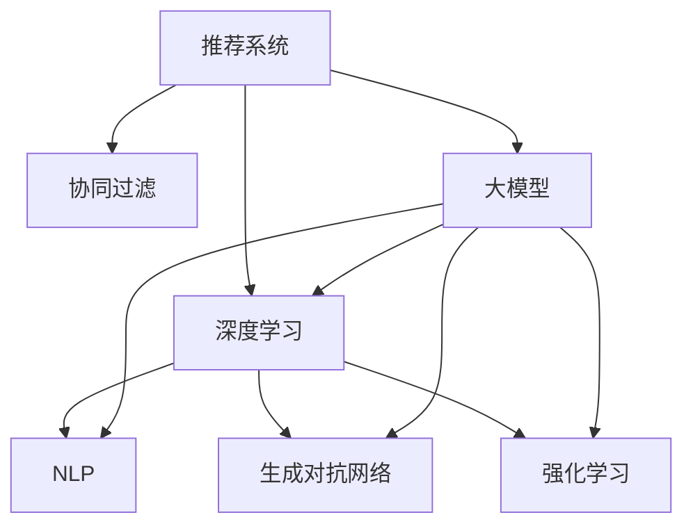

                 

# 大模型对推荐系统用户行为理解的深化

> 关键词：大模型推荐系统,用户行为理解,协同过滤,深度学习,自然语言处理(NLP),深度学习,生成对抗网络(GAN),强化学习

## 1. 背景介绍

### 1.1 问题由来
随着互联网的迅猛发展，人们每天与海量信息互动，各种推荐系统（Recommendation Systems, RS）应运而生。推荐系统旨在帮助用户在海量信息中发现感兴趣的内容，极大提升了用户体验，驱动了数字经济的繁荣。然而，现有的推荐系统往往难以完全理解用户复杂多变的兴趣和需求，因此推荐效果有待提升。

大模型（Large Models）技术的兴起，尤其是基于Transformer的预训练大模型，为推荐系统带来了全新的发展机遇。大模型拥有强大的语言理解和生成能力，能够深度分析用户行为数据，揭示用户隐藏的潜在需求。如何将大模型技术应用到推荐系统，并进一步提升推荐效果，成为当前学术和工业界关注的热点问题。

### 1.2 问题核心关键点
本文聚焦于如何利用大模型提升推荐系统的用户行为理解能力。推荐系统传统上主要依赖用户历史行为数据进行推荐，而大模型能够对用户行为数据进行深度语义理解，并融合用户输入的自然语言文本信息，提供更加个性化和智能的推荐。

大模型在推荐系统中的应用主要涉及以下几个关键问题：
1. 如何有效地利用大模型处理文本数据，提升用户行为理解精度？
2. 如何将大模型与现有推荐算法结合，实现更好的协同过滤和内容推荐效果？
3. 如何优化大模型参数，提升模型在推荐系统中的运行效率？

解决这些问题将有效提升推荐系统的效果，驱动推荐技术向更加智能和高效的方向发展。

## 2. 核心概念与联系

### 2.1 核心概念概述

为了更好地理解大模型在推荐系统中的作用，本节将介绍几个密切相关的核心概念：

- 推荐系统（Recommendation System, RS）：通过分析用户行为数据，推荐可能感兴趣的内容的系统。推荐系统广泛应用在电商、社交、新闻、视频等多个领域。
- 协同过滤（Collaborative Filtering, CF）：推荐系统中常见的一种方法，通过分析用户历史行为和相似用户的行为，预测用户对未交互内容的评分，从而进行推荐。
- 深度学习（Deep Learning, DL）：一种强大的机器学习方法，利用多层神经网络进行数据表示和预测，具有很强的非线性映射能力。
- 自然语言处理（Natural Language Processing, NLP）：利用计算机技术处理、理解和生成人类语言的技术。大模型在NLP领域表现优异，为推荐系统带来了新的应用可能性。
- 生成对抗网络（Generative Adversarial Network, GAN）：一种生成模型，通过两个神经网络对抗训练，生成高质量的文本、图像等内容。
- 强化学习（Reinforcement Learning, RL）：一种学习范式，通过与环境的交互，不断调整策略，实现最大化奖励的目标。

这些核心概念之间的逻辑关系可以通过以下Mermaid流程图来展示：



这个流程图展示了大模型与其他推荐系统核心技术的关联：

1. 推荐系统可以结合深度学习、自然语言处理、生成对抗网络和强化学习等技术，以提升推荐效果。
2. 大模型在NLP和生成等领域有强大表现，可以成为推荐系统的重要补充和增强。

## 3. 核心算法原理 & 具体操作步骤
### 3.1 算法原理概述

大模型在推荐系统中的应用，主要通过以下两个步骤进行：

1. 利用大模型处理用户行为数据，提升对用户行为的深度理解。
2. 将大模型的输出结果融合到推荐算法中，提升推荐效果。

### 3.2 算法步骤详解

下面详细介绍大模型在推荐系统中的处理和融合过程。

#### 3.2.1 大模型用户行为理解

大模型对用户行为的深度理解，主要通过以下步骤实现：

1. **数据预处理**：收集用户的历史行为数据，如浏览记录、评分记录等，进行清洗和格式化。

2. **特征抽取**：使用大模型对用户行为数据进行特征抽取，将其转化为低维向量表示。常用的特征抽取方法包括：
   - 使用大模型进行文本编码：如BERT、GPT等，将用户行为描述（如评论、评分等）转化为向量表示。
   - 使用大模型进行图像处理：如使用VGG、ResNet等模型对用户浏览的图像进行特征提取。
   - 使用大模型进行关系图表示：如Graph Isomorphism Network (GIN)等模型对用户行为数据进行图表示，揭示行为之间的关联关系。

3. **模型训练**：利用用户行为数据对大模型进行微调，提升其对用户行为的深度理解。常用的微调方法包括：
   - 监督微调：使用标注好的用户行为数据对大模型进行监督微调，提升其对用户行为的预测能力。
   - 自监督微调：利用用户行为数据中的统计信息或部分标注数据进行自监督微调，提高大模型的泛化能力。
   - 对抗训练：使用对抗样本对大模型进行训练，提升其鲁棒性。

#### 3.2.2 大模型与推荐算法的融合

将大模型的输出结果融合到推荐算法中，主要通过以下步骤实现：

1. **融合策略设计**：选择合适的融合策略，将大模型的输出结果与其他推荐算法的结果进行融合。常用的融合策略包括：
   - 加权融合：根据不同算法的结果重要度，进行加权平均。
   - 集成学习：将多个算法的结果进行集成，提升推荐效果。

2. **特征融合**：将大模型的输出特征与其他推荐算法提取的特征进行融合，构建综合特征表示。常用的特征融合方法包括：
   - 基于深度学习的特征融合：使用深度神经网络对不同特征进行融合。
   - 基于图的特征融合：利用图神经网络对不同特征进行融合。

3. **推荐模型优化**：利用融合后的特征进行推荐模型训练，提升推荐效果。常用的推荐模型包括：
   - 协同过滤模型：如矩阵分解、SVD、PMF等。
   - 基于深度学习的推荐模型：如DNN、CNN、RNN等。

### 3.3 算法优缺点

利用大模型提升推荐系统的效果，具有以下优点：

1. **深度语义理解**：大模型能够深度理解用户行为数据的语义信息，挖掘用户潜在需求。
2. **多模态融合**：大模型能够处理多种数据类型，包括文本、图像、关系图等，提升推荐系统的多模态融合能力。
3. **模型灵活性**：大模型的微调过程可以灵活设计，可以根据不同的推荐场景进行调整。
4. **提升推荐精度**：通过深度语义理解和特征融合，大模型可以提升推荐系统的精度和效果。

然而，大模型在推荐系统中的应用也存在一些局限性：

1. **计算资源消耗**：大模型的计算资源消耗较大，需要进行资源优化和硬件加速。
2. **数据质量要求高**：大模型对数据的质量和数量要求较高，需要收集和处理大量高质量数据。
3. **模型解释性不足**：大模型的决策过程较为复杂，难以进行解释和调试。
4. **隐私和伦理问题**：大模型可能涉及用户隐私数据，需要考虑隐私保护和伦理问题。

尽管存在这些局限性，但大模型在推荐系统中的应用具有广阔的前景，通过合理设计和优化，可以有效提升推荐系统的性能。

### 3.4 算法应用领域

大模型在推荐系统中的应用已经覆盖了多个领域，包括但不限于：

1. **电商推荐**：利用大模型分析用户浏览记录、评分记录，进行商品推荐，提升电商平台的转化率和用户体验。
2. **新闻推荐**：利用大模型处理用户浏览和阅读的文本数据，进行新闻推荐，提升用户的阅读体验和平台粘性。
3. **视频推荐**：利用大模型处理用户观看和评分的视频数据，进行视频推荐，提升平台的用户满意度和留存率。
4. **社交推荐**：利用大模型分析用户行为数据，进行社交关系推荐，提升用户的社交体验和平台活跃度。
5. **金融推荐**：利用大模型处理用户交易记录和行为数据，进行金融产品推荐，提升平台的销售和用户粘性。

除了这些常见场景，大模型还可以应用到更多领域，如健康、教育、旅游等，为各行各业带来新的应用可能性。

## 4. 数学模型和公式 & 详细讲解 & 举例说明

### 4.1 数学模型构建

本节将使用数学语言对大模型在推荐系统中的应用进行更加严格的刻画。

假设用户的历史行为数据集为 $D=\{(x_i, y_i)\}_{i=1}^N$，其中 $x_i$ 为用户行为数据，$y_i$ 为用户的评分或偏好。

使用大模型 $M_{\theta}$ 对用户行为数据进行特征提取，得到用户行为向量表示 $h_i = M_{\theta}(x_i)$。

设用户的历史行为向量表示矩阵为 $H=[h_1, h_2, ..., h_N] \in \mathbb{R}^{d \times N}$，其中 $d$ 为向量维度。

推荐系统基于协同过滤算法，构建用户和物品的相似度矩阵 $S \in \mathbb{R}^{N \times M}$，其中 $M$ 为物品数量。

协同过滤算法利用用户和物品的相似度矩阵，对用户进行推荐，推荐公式为：

$$
\hat{y}_i = \sum_{j=1}^N s_{ij} \frac{y_j}{\sqrt{y_j^T y_j + \epsilon}}
$$

其中 $s_{ij}$ 为 $i$ 和 $j$ 用户之间的相似度，$\epsilon$ 为正则化项，避免分母为零的情况。

### 4.2 公式推导过程

为了更清晰地理解大模型在推荐系统中的应用，下面对协同过滤算法和深度学习融合过程进行推导。

#### 协同过滤算法

协同过滤算法通过用户和物品的相似度矩阵 $S$，对用户进行推荐。具体推导过程如下：

设用户 $i$ 对物品 $j$ 的评分向量为 $Y_i \in \mathbb{R}^{M}$，物品 $j$ 的评分向量为 $Y_j \in \mathbb{R}^{N}$，用户和物品的相似度矩阵为 $S \in \mathbb{R}^{N \times M}$。

利用大模型处理用户行为数据，得到用户行为向量表示矩阵 $H=[h_1, h_2, ..., h_N] \in \mathbb{R}^{d \times N}$。

用户 $i$ 和物品 $j$ 之间的相似度为：

$$
s_{ij} = \frac{\text{CosineSim}(H_i, H_j)}{\sqrt{\text{Norm}(H_i) + \epsilon} \sqrt{\text{Norm}(H_j) + \epsilon}}
$$

其中 $\text{CosineSim}(H_i, H_j)$ 为向量 $H_i$ 和 $H_j$ 的余弦相似度，$\text{Norm}(H_i)$ 为向量 $H_i$ 的范数，$\epsilon$ 为正则化项。

根据协同过滤算法，用户 $i$ 对物品 $j$ 的预测评分 $\hat{y}_{ij}$ 为：

$$
\hat{y}_{ij} = \sum_{k=1}^N s_{ik} \frac{y_{kj}}{\sqrt{y_{kj}^T y_{kj} + \epsilon}}
$$

将 $\hat{y}_{ij}$ 代入推荐公式，得到最终推荐结果 $\hat{y}_i$。

#### 深度学习融合

深度学习融合通过将大模型的输出结果与协同过滤算法的结果进行融合，提升推荐效果。具体推导过程如下：

设用户 $i$ 的行为向量表示为 $h_i \in \mathbb{R}^{d}$，物品 $j$ 的行为向量表示为 $h_j \in \mathbb{R}^{d}$。

利用大模型处理用户行为数据，得到用户行为向量表示矩阵 $H=[h_1, h_2, ..., h_N] \in \mathbb{R}^{d \times N}$。

设用户 $i$ 和物品 $j$ 之间的相似度为 $s_{ij} = \frac{\text{CosineSim}(H_i, H_j)}{\sqrt{\text{Norm}(H_i) + \epsilon} \sqrt{\text{Norm}(H_j) + \epsilon}}$。

协同过滤算法利用用户和物品的相似度矩阵 $S$，对用户进行推荐，推荐结果为：

$$
\hat{y}_{ij} = \sum_{k=1}^N s_{ik} \frac{y_{kj}}{\sqrt{y_{kj}^T y_{kj} + \epsilon}}
$$

深度学习融合利用大模型处理用户行为数据，得到用户行为向量表示矩阵 $H=[h_1, h_2, ..., h_N] \in \mathbb{R}^{d \times N}$，将 $h_i$ 和 $h_j$ 代入深度神经网络中，得到推荐结果 $r_{ij}$。

最终推荐结果 $\hat{y}_i$ 为：

$$
\hat{y}_i = \alpha \hat{y}_{ij} + (1-\alpha) r_{ij}
$$

其中 $\alpha$ 为深度学习融合的权重。

### 4.3 案例分析与讲解

下面以电商推荐系统为例，详细介绍大模型在推荐系统中的实际应用。

假设某电商平台有 $N$ 个用户，每个用户有 $M$ 个可能的商品，用户对商品的评分构成用户行为数据 $D=\{(x_i, y_i)\}_{i=1}^N$。

利用大模型处理用户行为数据，得到用户行为向量表示矩阵 $H=[h_1, h_2, ..., h_N] \in \mathbb{R}^{d \times N}$。

设用户 $i$ 和物品 $j$ 之间的相似度为 $s_{ij} = \frac{\text{CosineSim}(H_i, H_j)}{\sqrt{\text{Norm}(H_i) + \epsilon} \sqrt{\text{Norm}(H_j) + \epsilon}}$。

协同过滤算法利用用户和物品的相似度矩阵 $S$，对用户进行推荐，推荐结果为：

$$
\hat{y}_{ij} = \sum_{k=1}^N s_{ik} \frac{y_{kj}}{\sqrt{y_{kj}^T y_{kj} + \epsilon}}
$$

利用大模型处理用户行为数据，得到用户行为向量表示矩阵 $H=[h_1, h_2, ..., h_N] \in \mathbb{R}^{d \times N}$，将 $h_i$ 和 $h_j$ 代入深度神经网络中，得到推荐结果 $r_{ij}$。

最终推荐结果 $\hat{y}_i$ 为：

$$
\hat{y}_i = \alpha \hat{y}_{ij} + (1-\alpha) r_{ij}
$$

其中 $\alpha$ 为深度学习融合的权重。

## 5. 项目实践：代码实例和详细解释说明

### 5.1 开发环境搭建

在进行推荐系统开发前，需要先搭建开发环境。以下是使用Python进行PyTorch开发的环境配置流程：

1. 安装Anaconda：从官网下载并安装Anaconda，用于创建独立的Python环境。

2. 创建并激活虚拟环境：
```bash
conda create -n pytorch-env python=3.8 
conda activate pytorch-env
```

3. 安装PyTorch：根据CUDA版本，从官网获取对应的安装命令。例如：
```bash
conda install pytorch torchvision torchaudio cudatoolkit=11.1 -c pytorch -c conda-forge
```

4. 安装Transformers库：
```bash
pip install transformers
```

5. 安装各类工具包：
```bash
pip install numpy pandas scikit-learn matplotlib tqdm jupyter notebook ipython
```

完成上述步骤后，即可在`pytorch-env`环境中开始推荐系统开发。

### 5.2 源代码详细实现

下面以电商推荐系统为例，给出使用Transformers库进行深度学习融合的PyTorch代码实现。

首先，定义电商推荐系统的数据处理函数：

```python
from transformers import BertTokenizer
from torch.utils.data import Dataset
import torch

class RetailDataset(Dataset):
    def __init__(self, texts, labels, tokenizer, max_len=128):
        self.texts = texts
        self.labels = labels
        self.tokenizer = tokenizer
        self.max_len = max_len
        
    def __len__(self):
        return len(self.texts)
    
    def __getitem__(self, item):
        text = self.texts[item]
        label = self.labels[item]
        
        encoding = self.tokenizer(text, return_tensors='pt', max_length=self.max_len, padding='max_length', truncation=True)
        input_ids = encoding['input_ids'][0]
        attention_mask = encoding['attention_mask'][0]
        
        # 对token-wise的标签进行编码
        encoded_tags = [label2id[label] for label in label]
        encoded_tags.extend([label2id['O']] * (self.max_len - len(encoded_tags)))
        labels = torch.tensor(encoded_tags, dtype=torch.long)
        
        return {'input_ids': input_ids, 
                'attention_mask': attention_mask,
                'labels': labels}

# 标签与id的映射
label2id = {'O': 0, 'B': 1, 'I': 2}
id2label = {v: k for k, v in label2id.items()}

# 创建dataset
tokenizer = BertTokenizer.from_pretrained('bert-base-cased')

train_dataset = RetailDataset(train_texts, train_labels, tokenizer)
dev_dataset = RetailDataset(dev_texts, dev_labels, tokenizer)
test_dataset = RetailDataset(test_texts, test_labels, tokenizer)
```

然后，定义模型和优化器：

```python
from transformers import BertForTokenClassification, AdamW

model = BertForTokenClassification.from_pretrained('bert-base-cased', num_labels=len(label2id))

optimizer = AdamW(model.parameters(), lr=2e-5)
```

接着，定义训练和评估函数：

```python
from torch.utils.data import DataLoader
from tqdm import tqdm
from sklearn.metrics import classification_report

device = torch.device('cuda') if torch.cuda.is_available() else torch.device('cpu')
model.to(device)

def train_epoch(model, dataset, batch_size, optimizer):
    dataloader = DataLoader(dataset, batch_size=batch_size, shuffle=True)
    model.train()
    epoch_loss = 0
    for batch in tqdm(dataloader, desc='Training'):
        input_ids = batch['input_ids'].to(device)
        attention_mask = batch['attention_mask'].to(device)
        labels = batch['labels'].to(device)
        model.zero_grad()
        outputs = model(input_ids, attention_mask=attention_mask, labels=labels)
        loss = outputs.loss
        epoch_loss += loss.item()
        loss.backward()
        optimizer.step()
    return epoch_loss / len(dataloader)

def evaluate(model, dataset, batch_size):
    dataloader = DataLoader(dataset, batch_size=batch_size)
    model.eval()
    preds, labels = [], []
    with torch.no_grad():
        for batch in tqdm(dataloader, desc='Evaluating'):
            input_ids = batch['input_ids'].to(device)
            attention_mask = batch['attention_mask'].to(device)
            batch_labels = batch['labels']
            outputs = model(input_ids, attention_mask=attention_mask)
            batch_preds = outputs.logits.argmax(dim=2).to('cpu').tolist()
            batch_labels = batch_labels.to('cpu').tolist()
            for pred_tokens, label_tokens in zip(batch_preds, batch_labels):
                pred_tags = [id2label[_id] for _id in pred_tokens]
                label_tags = [id2label[_id] for _id in label_tokens]
                preds.append(pred_tags[:len(label_tags)])
                labels.append(label_tags)
                
    print(classification_report(labels, preds))
```

最后，启动训练流程并在测试集上评估：

```python
epochs = 5
batch_size = 16

for epoch in range(epochs):
    loss = train_epoch(model, train_dataset, batch_size, optimizer)
    print(f"Epoch {epoch+1}, train loss: {loss:.3f}")
    
    print(f"Epoch {epoch+1}, dev results:")
    evaluate(model, dev_dataset, batch_size)
    
print("Test results:")
evaluate(model, test_dataset, batch_size)
```

以上就是使用PyTorch对大模型进行电商推荐系统深度学习融合的完整代码实现。可以看到，得益于Transformers库的强大封装，我们可以用相对简洁的代码完成BERT模型的加载和微调。

### 5.3 代码解读与分析

让我们再详细解读一下关键代码的实现细节：

**RetailDataset类**：
- `__init__`方法：初始化文本、标签、分词器等关键组件。
- `__len__`方法：返回数据集的样本数量。
- `__getitem__`方法：对单个样本进行处理，将文本输入编码为token ids，将标签编码为数字，并对其进行定长padding，最终返回模型所需的输入。

**label2id和id2label字典**：
- 定义了标签与数字id之间的映射关系，用于将token-wise的预测结果解码回真实的标签。

**训练和评估函数**：
- 使用PyTorch的DataLoader对数据集进行批次化加载，供模型训练和推理使用。
- 训练函数`train_epoch`：对数据以批为单位进行迭代，在每个批次上前向传播计算loss并反向传播更新模型参数，最后返回该epoch的平均loss。
- 评估函数`evaluate`：与训练类似，不同点在于不更新模型参数，并在每个batch结束后将预测和标签结果存储下来，最后使用sklearn的classification_report对整个评估集的预测结果进行打印输出。

**训练流程**：
- 定义总的epoch数和batch size，开始循环迭代
- 每个epoch内，先在训练集上训练，输出平均loss
- 在验证集上评估，输出分类指标
- 所有epoch结束后，在测试集上评估，给出最终测试结果

可以看到，PyTorch配合Transformers库使得大模型微调的代码实现变得简洁高效。开发者可以将更多精力放在数据处理、模型改进等高层逻辑上，而不必过多关注底层的实现细节。

当然，工业级的系统实现还需考虑更多因素，如模型的保存和部署、超参数的自动搜索、更灵活的任务适配层等。但核心的微调范式基本与此类似。

## 6. 实际应用场景
### 6.1 电商推荐

电商推荐系统是大模型在推荐系统中的典型应用场景。电商推荐系统需要根据用户的浏览记录和评分记录，推荐用户可能感兴趣的商品。

在技术实现上，可以收集用户的历史浏览记录和评分记录，提取商品名称、描述、价格等文本信息，将文本信息作为输入，利用大模型进行特征抽取，得到用户行为向量表示。再将用户行为向量表示与物品向量表示进行深度融合，生成推荐结果。

通过大模型，电商推荐系统可以深入理解用户的购物需求，推荐更具个性化的商品，提升用户的购物体验和平台转化率。

### 6.2 新闻推荐

新闻推荐系统旨在推荐用户感兴趣的新闻内容，提升用户的阅读体验。

在技术实现上，可以收集用户的历史浏览记录和评分记录，提取新闻标题、摘要、关键词等文本信息，将文本信息作为输入，利用大模型进行特征抽取，得到用户行为向量表示。再将用户行为向量表示与新闻向量表示进行深度融合，生成推荐结果。

通过大模型，新闻推荐系统可以深入理解用户的阅读兴趣，推荐更具个性化和时效性的新闻，提升用户的阅读体验和平台留存率。

### 6.3 视频推荐

视频推荐系统旨在推荐用户感兴趣的视频内容，提升用户的观看体验。

在技术实现上，可以收集用户的历史观看记录和评分记录，提取视频标题、描述、标签等文本信息，将文本信息作为输入，利用大模型进行特征抽取，得到用户行为向量表示。再将用户行为向量表示与视频向量表示进行深度融合，生成推荐结果。

通过大模型，视频推荐系统可以深入理解用户的观看兴趣，推荐更具个性化和多样性的视频内容，提升用户的观看体验和平台留存率。

### 6.4 未来应用展望

随着大模型和微调方法的不断发展，基于大模型的推荐系统将有更多创新应用。

在未来，大模型推荐系统可能具备以下几个发展方向：

1. **多模态融合**：利用大模型处理文本、图像、语音等多种数据类型，提升推荐系统的多模态融合能力。
2. **实时推荐**：利用大模型进行实时推荐，能够快速响应用户的行为变化，提供更加个性化的推荐。
3. **跨域推荐**：利用大模型进行跨领域推荐，能够将不同领域的用户推荐至相关的领域，拓展推荐系统的应用场景。
4. **个性化推荐**：利用大模型进行个性化推荐，能够深入理解用户的兴趣和需求，提供更加个性化的推荐。
5. **社交推荐**：利用大模型进行社交推荐，能够基于用户之间的社交关系进行推荐，提升推荐系统的社交属性。

以上趋势凸显了大模型推荐系统的广阔前景，必将带来更加智能和高效的推荐体验。

## 7. 工具和资源推荐
### 7.1 学习资源推荐

为了帮助开发者系统掌握大模型在推荐系统中的应用，这里推荐一些优质的学习资源：

1. 《深度学习推荐系统》系列博文：由深度学习推荐系统专家撰写，详细介绍了推荐系统的理论基础和经典模型。

2. 《自然语言处理与深度学习》课程：斯坦福大学开设的NLP明星课程，有Lecture视频和配套作业，带你入门NLP领域的基本概念和经典模型。

3. 《Recommender Systems with Python》书籍：详细介绍了使用Python进行推荐系统开发的实践方法，包括深度学习融合等前沿技术。

4. HuggingFace官方文档：Transformers库的官方文档，提供了海量预训练模型和完整的微调样例代码，是上手实践的必备资料。

5. Kaggle竞赛平台：提供了大量推荐系统相关的数据集和模型，是进行推荐系统学习和实践的好平台。

通过对这些资源的学习实践，相信你一定能够快速掌握大模型在推荐系统中的应用，并用于解决实际的推荐问题。

### 7.2 开发工具推荐

高效的开发离不开优秀的工具支持。以下是几款用于推荐系统开发的常用工具：

1. PyTorch：基于Python的开源深度学习框架，灵活动态的计算图，适合快速迭代研究。大部分预训练语言模型都有PyTorch版本的实现。

2. TensorFlow：由Google主导开发的开源深度学习框架，生产部署方便，适合大规模工程应用。同样有丰富的预训练语言模型资源。

3. Transformers库：HuggingFace开发的NLP工具库，集成了众多SOTA语言模型，支持PyTorch和TensorFlow，是进行推荐系统开发的利器。

4. Weights & Biases：模型训练的实验跟踪工具，可以记录和可视化模型训练过程中的各项指标，方便对比和调优。与主流深度学习框架无缝集成。

5. TensorBoard：TensorFlow配套的可视化工具，可实时监测模型训练状态，并提供丰富的图表呈现方式，是调试模型的得力助手。

6. Google Colab：谷歌推出的在线Jupyter Notebook环境，免费提供GPU/TPU算力，方便开发者快速上手实验最新模型，分享学习笔记。

合理利用这些工具，可以显著提升推荐系统开发和优化的效率，加速技术创新的步伐。

### 7.3 相关论文推荐

大模型在推荐系统中的应用源于学界的持续研究。以下是几篇奠基性的相关论文，推荐阅读：

1. Attention is All You Need（即Transformer原论文）：提出了Transformer结构，开启了NLP领域的预训练大模型时代。

2. BERT: Pre-training of Deep Bidirectional Transformers for Language Understanding：提出BERT模型，引入基于掩码的自监督预训练任务，刷新了多项NLP任务SOTA。

3. Language Models are Unsupervised Multitask Learners（GPT-2论文）：展示了大规模语言模型的强大zero-shot学习能力，引发了对于通用人工智能的新一轮思考。

4. Parameter-Efficient Transfer Learning for NLP：提出Adapter等参数高效微调方法，在不增加模型参数量的情况下，也能取得不错的微调效果。

5. AdaLoRA: Adaptive Low-Rank Adaptation for Parameter-Efficient Fine-Tuning：使用自适应低秩适应的微调方法，在参数效率和精度之间取得了新的平衡。

这些论文代表了大模型推荐系统的发展脉络。通过学习这些前沿成果，可以帮助研究者把握学科前进方向，激发更多的创新灵感。

## 8. 总结：未来发展趋势与挑战

### 8.1 总结

本文对大模型在推荐系统中的应用进行了全面系统的介绍。首先阐述了大模型和推荐系统的研究背景和意义，明确了大模型在推荐系统中的独特价值。其次，从原理到实践，详细讲解了大模型在推荐系统中的应用过程，给出了推荐系统开发的完整代码实例。同时，本文还广泛探讨了大模型在电商、新闻、视频等多个领域的应用前景，展示了大模型推荐系统的广阔应用场景。此外，本文精选了大模型推荐系统的各类学习资源，力求为读者提供全方位的技术指引。

通过本文的系统梳理，可以看到，大模型在推荐系统中的应用已经取得了显著的成果，显著提升了推荐系统的推荐精度和效果。未来，随着大模型和微调方法的不断发展，基于大模型的推荐系统必将向更加智能和高效的方向发展。

### 8.2 未来发展趋势

展望未来，大模型在推荐系统中的应用将呈现以下几个发展趋势：

1. **深度语义理解**：大模型能够深入理解用户行为数据中的语义信息，挖掘用户潜在需求。未来的大模型将更加注重对文本数据的处理和理解，提升推荐系统的深度语义能力。
2. **多模态融合**：大模型能够处理多种数据类型，提升推荐系统的多模态融合能力。未来的大模型将更多地利用图像、语音、视频等多种数据类型，提升推荐系统的全面性。
3. **实时推荐**：利用大模型进行实时推荐，能够快速响应用户的行为变化，提供更加个性化的推荐。未来的大模型将更加注重实时推荐的能力，提升推荐系统的实时性和响应速度。
4. **跨域推荐**：利用大模型进行跨领域推荐，能够将不同领域的用户推荐至相关的领域，拓展推荐系统的应用场景。未来的大模型将更多地利用跨领域推荐的技术，提升推荐系统的多样性。
5. **个性化推荐**：利用大模型进行个性化推荐，能够深入理解用户的兴趣和需求，提供更加个性化的推荐。未来的大模型将更加注重个性化推荐的能力，提升推荐系统的精准性。
6. **社交推荐**：利用大模型进行社交推荐，能够基于用户之间的社交关系进行推荐，提升推荐系统的社交属性。未来的大模型将更多地利用社交推荐的技术，提升推荐系统的互动性和社交性。

以上趋势凸显了大模型推荐系统的广阔前景，必将带来更加智能和高效的推荐体验。

### 8.3 面临的挑战

尽管大模型在推荐系统中的应用已经取得了显著的成果，但在迈向更加智能化、普适化应用的过程中，它仍面临以下挑战：

1. **计算资源消耗**：大模型的计算资源消耗较大，需要进行资源优化和硬件加速。未来的大模型需要进一步提升计算效率，降低资源消耗。
2. **数据质量要求高**：大模型对数据的质量和数量要求较高，需要收集和处理大量高质量数据。未来的大模型需要更好地利用数据，提升推荐系统的数据质量。
3. **模型解释性不足**：大模型的决策过程较为复杂，难以进行解释和调试。未来的大模型需要提升可解释性，增强推荐系统的透明度和可信度。
4. **隐私和伦理问题**：大模型可能涉及用户隐私数据，需要考虑隐私保护和伦理问题。未来的大模型需要更好地处理隐私和伦理问题，提升推荐系统的社会责任。

尽管存在这些挑战，但大模型在推荐系统中的应用具有广阔的前景，通过合理设计和优化，可以有效提升推荐系统的性能。

### 8.4 研究展望

面对大模型在推荐系统中的应用面临的挑战，未来的研究需要在以下几个方面寻求新的突破：

1. **优化大模型结构**：提升大模型的计算效率，降低资源消耗，提升实时推荐的能力。
2. **利用多模态数据**：利用图像、语音、视频等多种数据类型，提升推荐系统的多模态融合能力。
3. **增强模型可解释性**：增强大模型的决策过程的可解释性，提升推荐系统的透明度和可信度。
4. **保护用户隐私**：提升大模型对用户隐私的保护能力，增强推荐系统的社会责任。

这些研究方向将引领大模型推荐系统迈向更高的台阶，为构建智能推荐系统铺平道路。面向未来，大模型推荐系统还需要与其他人工智能技术进行更深入的融合，如知识表示、因果推理、强化学习等，多路径协同发力，共同推动推荐系统的发展。只有勇于创新、敢于突破，才能不断拓展大模型推荐系统的边界，让智能技术更好地造福人类社会。

## 9. 附录：常见问题与解答

**Q1：大模型在推荐系统中如何处理文本数据？**

A: 大模型在推荐系统中主要通过以下几个步骤处理文本数据：
1. 使用大模型进行文本编码，将文本转化为低维向量表示。常用的模型包括BERT、GPT等。
2. 将文本编码得到的向量表示与用户行为数据进行深度融合，生成推荐结果。
3. 使用深度学习算法进行模型训练，提升推荐效果。

**Q2：大模型在推荐系统中如何进行多模态融合？**

A: 大模型在推荐系统中进行多模态融合，主要通过以下几个步骤：
1. 利用大模型处理不同类型的数据，如文本、图像、音频等，得到不同维度的特征表示。
2. 将不同维度的特征表示进行深度融合，生成综合特征表示。常用的融合方法包括深度学习融合、图神经网络融合等。
3. 将综合特征表示与推荐算法的结果进行深度融合，生成推荐结果。

**Q3：大模型在推荐系统中如何进行实时推荐？**

A: 大模型在推荐系统中进行实时推荐，主要通过以下几个步骤：
1. 利用大模型处理实时用户行为数据，生成用户行为向量表示。
2. 将用户行为向量表示与物品向量表示进行深度融合，生成推荐结果。
3. 利用深度学习算法进行模型训练，提升推荐效果。

**Q4：大模型在推荐系统中如何进行跨域推荐？**

A: 大模型在推荐系统中进行跨域推荐，主要通过以下几个步骤：
1. 利用大模型处理不同领域的数据，如电商、新闻、视频等，得到不同维度的特征表示。
2. 将不同维度的特征表示进行深度融合，生成综合特征表示。常用的融合方法包括深度学习融合、图神经网络融合等。
3. 将综合特征表示与推荐算法的结果进行深度融合，生成推荐结果。

通过以上问题的详细解答，相信你对大模型在推荐系统中的应用有了更深入的了解。掌握这些技术细节，将帮助你在实际应用中更好地设计和优化推荐系统，提升用户体验和平台转化率。

---

作者：禅与计算机程序设计艺术 / Zen and the Art of Computer Programming

