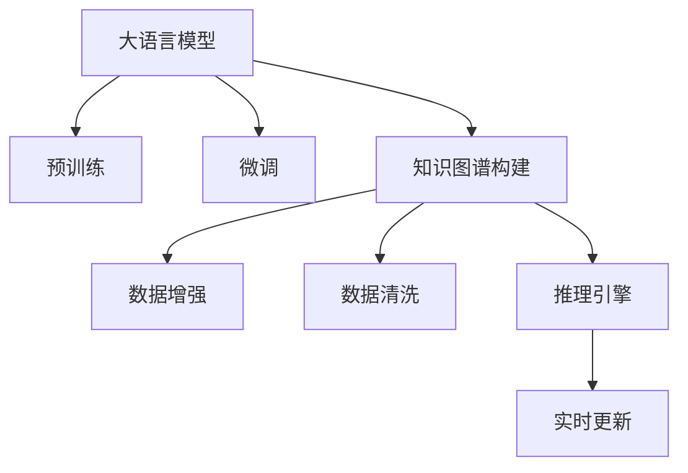

                 

# 大模型技术在电商平台商品知识图谱构建中的应用

## 1. 背景介绍

在当前数字化时代，电商平台作为连接消费者和商家的重要桥梁，对商品信息的管理和组织显得尤为重要。传统的商品信息管理系统往往难以处理海量数据，且难以自动更新。而基于大模型技术的知识图谱构建，可以为电商平台提供高效、智能的商品信息管理解决方案。本文将系统介绍大模型技术在电商平台商品知识图谱构建中的应用。

### 1.1 问题由来

电商平台商品信息管理系统是支撑电商业务的重要基础设施。传统的商品信息管理系统依靠人工维护，难以满足海量数据处理和实时更新的需求，同时容易出现数据不一致、缺失等问题。例如，商品标题、描述、分类、属性等信息，通常以文本形式存储，难以自动进行语义分析和结构化处理。

近年来，随着大语言模型和大规模语料库的不断成熟，基于语言模型的知识图谱构建方法开始崭露头角。例如，通过预训练语言模型，可以对商品信息进行语义理解，并从中提取有价值的知识，构建商品知识图谱。这种方案可以大幅提高商品信息管理系统的自动化水平，减轻人工维护的负担，提升数据的一致性和实时性。

### 1.2 问题核心关键点

构建电商平台商品知识图谱的关键在于：

1. 选择合适的预训练语言模型。目前主流的预训练模型包括BERT、GPT-3、ELECTRA等，其中BERT模型在语义理解、实体识别等方面表现优异，常用于商品知识图谱的构建。
2. 确定合适的知识图谱构建方案。需要明确商品知识图谱的节点和关系类型，以及如何从语料中抽取实体和关系。
3. 设计有效的数据预处理流程。需要考虑如何处理商品标题、描述、分类、属性等不同格式和维度的数据，如何进行数据清洗、去重和标准化。
4. 应用适当的微调方法。通过微调方法，可以进一步提升模型在商品知识图谱构建中的效果。
5. 实现高效的图谱更新和维护。构建后的商品知识图谱需要定期更新，以反映商品信息的最新变化。

## 2. 核心概念与联系

### 2.1 核心概念概述

为更好地理解大模型技术在电商平台商品知识图谱构建中的应用，本节将介绍几个密切相关的核心概念：

- 大语言模型(Large Language Model, LLM)：以自回归(如GPT)或自编码(如BERT)模型为代表的大规模预训练语言模型。通过在海量无标签文本数据上进行预训练，学习通用的语言表示，具备强大的语言理解和生成能力。

- 知识图谱(Knowledge Graph, KG)：通过语义网技术，用图结构表示实体、属性和关系，构建语义化的知识体系。知识图谱广泛应用于搜索、推荐、问答等NLP任务中。

- 知识图谱构建：将非结构化数据转化为结构化知识图谱的过程，包括实体抽取、关系抽取、节点嵌入等技术。

- 预训练(Pre-training)：指在大规模无标签文本语料上，通过自监督学习任务训练通用语言模型的过程。常见的预训练任务包括言语建模、遮挡语言模型等。

- 微调(Fine-tuning)：指在预训练模型的基础上，使用下游任务的少量标注数据，通过有监督学习优化模型在特定任务上的性能。

- 数据增强(Data Augmentation)：通过数据变换、扩充等技术，增加训练数据的多样性，防止模型过拟合。

- 数据清洗(Data Cleaning)：对原始数据进行去重、校正、格式转换等处理，提高数据质量。

- 推理引擎(Inference Engine)：基于知识图谱的推理引擎，实现基于图谱的查询、推荐、关联等任务。

- 实时更新(Real-time Update)：知识图谱需要定期进行数据更新，以反映商品信息的最新变化，满足实时查询需求。

这些核心概念之间的逻辑关系可以通过以下Mermaid流程图来展示：



这个流程图展示了大语言模型的核心概念及其之间的关系：

1. 大语言模型通过预训练获得基础能力。
2. 微调是对预训练模型进行任务特定的优化，以达到知识图谱构建的目的。
3. 知识图谱构建是通过实体抽取、关系抽取等步骤，将文本信息转化为图谱结构。
4. 数据增强和数据清洗是构建高质量知识图谱的前提。
5. 推理引擎用于知识图谱的查询、推荐等任务。
6. 实时更新保证知识图谱的时效性，满足动态查询需求。

## 3. 核心算法原理 & 具体操作步骤
### 3.1 算法原理概述

大模型技术在电商平台商品知识图谱构建中的核心算法原理主要包括以下几个方面：

- 预训练：利用大语言模型在大规模无标签商品描述文本上预训练，学习通用语言表示。
- 微调：在预训练基础上，对大模型进行微调，以适应商品知识图谱的构建需求。
- 实体抽取：利用微调后的模型对商品描述进行实体抽取，识别出商品名称、分类、属性等关键实体。
- 关系抽取：利用微调后的模型对商品描述进行关系抽取，识别出实体之间的关系，如属性-分类关系、品牌-商品关系等。
- 节点嵌入：利用微调后的模型对实体进行编码，得到低维的节点嵌入向量，用于知识图谱的构建。
- 图谱构建：将抽取出的实体和关系转化为知识图谱的节点和边，构建商品知识图谱。
- 推理与查询：利用推理引擎对知识图谱进行查询、推荐等任务。

### 3.2 算法步骤详解

基于大模型技术的电商平台商品知识图谱构建流程，大致可以分为以下几个步骤：

**Step 1: 数据收集与预处理**
- 收集商品描述文本数据，包括标题、简介、详情等。
- 对文本进行数据清洗，去除重复、错误、噪声等数据。
- 进行数据增强，如回译、同义词替换等，扩充训练数据。

**Step 2: 预训练与微调**
- 选择合适的预训练语言模型，如BERT、RoBERTa等。
- 在无标签商品描述文本上进行预训练，学习通用语言表示。
- 使用商品描述文本和实体标签进行微调，优化模型在实体抽取、关系抽取等方面的表现。

**Step 3: 实体抽取与关系抽取**
- 利用微调后的模型对商品描述进行实体抽取，识别出商品名称、分类、属性等实体。
- 利用微调后的模型对商品描述进行关系抽取，识别出实体之间的关系，如属性-分类关系、品牌-商品关系等。

**Step 4: 节点嵌入与图谱构建**
- 利用微调后的模型对实体进行编码，得到低维的节点嵌入向量。
- 根据实体和关系，构建商品知识图谱，生成节点和边的关系。

**Step 5: 推理与查询**
- 将构建好的商品知识图谱存储在知识库中。
- 使用推理引擎对知识图谱进行查询、推荐等任务。
- 根据查询结果，更新商品信息管理系统，实现实时动态更新。

### 3.3 算法优缺点

基于大模型技术的电商平台商品知识图谱构建方法具有以下优点：

1. 自动化水平高。可以利用预训练模型和微调方法，自动化地进行实体和关系的抽取，减少人工维护的负担。
2. 精度高。预训练语言模型和大模型微调方法可以处理复杂的自然语言，识别实体和关系，减少错误率。
3. 动态更新能力强。知识图谱可以实时更新，反映商品信息的最新变化，满足动态查询需求。
4. 语义化水平高。构建的知识图谱可以进行语义化的查询和推理，更贴近人类对商品信息的理解。

但该方法也存在一定的局限性：

1. 数据依赖度高。预训练模型和大模型微调方法需要大量无标签商品描述文本，难以适应数据量较小的电商场景。
2. 计算资源消耗大。预训练和微调过程需要消耗大量的计算资源，对硬件要求较高。
3. 知识图谱构建复杂。商品知识图谱的构建需要明确节点和关系的定义，以及如何抽取和处理，设计复杂。

尽管存在这些局限性，但基于大模型技术的方法依然在电商平台商品知识图谱构建中发挥了重要作用，未来还有很大的优化空间。

### 3.4 算法应用领域

基于大模型技术的电商平台商品知识图谱构建方法，已在以下领域得到了广泛应用：

- 商品信息管理：通过自动抽取商品信息，构建商品知识图谱，提供商品搜索、推荐、问答等服务。
- 供应链管理：利用商品知识图谱，进行商品属性、分类、价格等的分析，优化供应链管理。
- 市场分析：通过商品知识图谱，分析市场趋势和商品竞争关系，辅助市场策略制定。
- 广告推荐：基于商品知识图谱，进行精准广告推荐，提升广告效果和用户满意度。

除了以上这些应用场景，基于大模型技术的方法还可以应用于更多电商相关领域，如客户关系管理、用户行为分析、库存管理等，为电商业务提供更全面的支持。

## 4. 数学模型和公式 & 详细讲解 & 举例说明
### 4.1 数学模型构建

本节将使用数学语言对电商平台商品知识图谱构建过程进行更加严格的刻画。

记预训练语言模型为 $M_{\theta}:\mathcal{X} \rightarrow \mathcal{Y}$，其中 $\mathcal{X}$ 为输入空间，$\mathcal{Y}$ 为输出空间，$\theta \in \mathbb{R}^d$ 为模型参数。假设电商平台商品描述文本为 $D=\{x_i\}_{i=1}^N$，实体标签为 $L=\{l_i\}_{i=1}^N$，其中 $x_i \in \mathcal{X}$ 为商品描述，$l_i \in \{0,1\}$ 为实体标签。

定义模型 $M_{\theta}$ 在输入 $x$ 上的实体抽取损失函数为：

$$
\ell_{RE}(M_{\theta}(x),l) = -[l\log \sigma(\langle M_{\theta}(x),w_{实体}\rangle+b_{实体})+(1-l)\log(1-\sigma(\langle M_{\theta}(x),w_{实体}\rangle+b_{实体}))
$$

其中 $\langle \cdot,\cdot \rangle$ 表示向量点乘，$\sigma$ 为Sigmoid函数，$w_{实体}$ 和 $b_{实体}$ 为实体抽取任务的模型参数。

定义模型 $M_{\theta}$ 在输入 $x$ 上的关系抽取损失函数为：

$$
\ell_{RL}(M_{\theta}(x),l) = -[l\log \sigma(\langle M_{\theta}(x),w_{关系}\rangle+b_{关系})+(1-l)\log(1-\sigma(\langle M_{\theta}(x),w_{关系}\rangle+b_{关系}))
$$

其中 $w_{关系}$ 和 $b_{关系}$ 为关系抽取任务的模型参数。

### 4.2 公式推导过程

以实体抽取任务为例，推导损失函数的梯度计算公式。

假设模型 $M_{\theta}$ 在输入 $x$ 上的输出为 $\hat{y}=M_{\theta}(x) \in [0,1]$，表示样本属于实体的概率。真实标签 $l \in \{0,1\}$。则实体抽取损失函数为：

$$
\ell_{RE}(M_{\theta}(x),l) = -[l\log \hat{y} + (1-l)\log (1-\hat{y})]
$$

将其代入经验风险公式，得：

$$
\mathcal{L}_{RE}(\theta) = -\frac{1}{N}\sum_{i=1}^N [l_i\log M_{\theta}(x_i)+(1-l_i)\log(1-M_{\theta}(x_i))]
$$

根据链式法则，损失函数对参数 $\theta_k$ 的梯度为：

$$
\frac{\partial \mathcal{L}_{RE}(\theta)}{\partial \theta_k} = -\frac{1}{N}\sum_{i=1}^N (\frac{l_i}{M_{\theta}(x_i)}-\frac{1-l_i}{1-M_{\theta}(x_i)}) \frac{\partial M_{\theta}(x_i)}{\partial \theta_k}
$$

其中 $\frac{\partial M_{\theta}(x_i)}{\partial \theta_k}$ 可进一步递归展开，利用自动微分技术完成计算。

在得到损失函数的梯度后，即可带入参数更新公式，完成模型的迭代优化。重复上述过程直至收敛，最终得到适应电商平台商品知识图谱构建的最优模型参数 $\theta^*$。

## 5. 项目实践：代码实例和详细解释说明
### 5.1 开发环境搭建

在进行商品知识图谱构建实践前，我们需要准备好开发环境。以下是使用Python进行PyTorch开发的环境配置流程：

1. 安装Anaconda：从官网下载并安装Anaconda，用于创建独立的Python环境。

2. 创建并激活虚拟环境：
```bash
conda create -n pytorch-env python=3.8 
conda activate pytorch-env
```

3. 安装PyTorch：根据CUDA版本，从官网获取对应的安装命令。例如：
```bash
conda install pytorch torchvision torchaudio cudatoolkit=11.1 -c pytorch -c conda-forge
```

4. 安装Transformers库：
```bash
pip install transformers
```

5. 安装各类工具包：
```bash
pip install numpy pandas scikit-learn matplotlib tqdm jupyter notebook ipython
```

完成上述步骤后，即可在`pytorch-env`环境中开始商品知识图谱构建实践。

### 5.2 源代码详细实现

下面我以基于RoBERTa模型的电商平台商品知识图谱构建为例，给出使用Transformers库的PyTorch代码实现。

首先，定义实体抽取和关系抽取的损失函数：

```python
from transformers import RobertaTokenizer, RobertaForTokenClassification

class EntityLabelModel(RobertaForTokenClassification):
    def __init__(self, model_name, num_labels=2):
        super().__init__(model_name, num_labels=num_labels)
        self.num_labels = num_labels

    def forward(self, input_ids, attention_mask, labels=None):
        outputs = super().forward(input_ids, attention_mask=attention_mask, labels=labels)
        return outputs[0]
        
class RelationLabelModel(RobertaForTokenClassification):
    def __init__(self, model_name, num_labels=2):
        super().__init__(model_name, num_labels=num_labels)
        self.num_labels = num_labels

    def forward(self, input_ids, attention_mask, labels=None):
        outputs = super().forward(input_ids, attention_mask=attention_mask, labels=labels)
        return outputs[0]

# 定义损失函数
def entity_loss(model, inputs, labels):
    loss_fct = CrossEntropyLoss()
    logits = model(**inputs)[0]
    loss = loss_fct(logits.view(-1, model.num_labels), labels.view(-1))
    return loss

def relation_loss(model, inputs, labels):
    loss_fct = CrossEntropyLoss()
    logits = model(**inputs)[0]
    loss = loss_fct(logits.view(-1, model.num_labels), labels.view(-1))
    return loss

# 训练函数
def train_epoch(model, dataset, batch_size, optimizer, loss_fn):
    dataloader = DataLoader(dataset, batch_size=batch_size, shuffle=True)
    model.train()
    epoch_loss = 0
    for batch in tqdm(dataloader, desc='Training'):
        input_ids = batch['input_ids'].to(device)
        attention_mask = batch['attention_mask'].to(device)
        labels = batch['labels'].to(device)
        model.zero_grad()
        loss = loss_fn(model, {'input_ids': input_ids, 'attention_mask': attention_mask, 'labels': labels})
        loss.backward()
        optimizer.step()
    return epoch_loss / len(dataloader)

# 评估函数
def evaluate(model, dataset, batch_size):
    dataloader = DataLoader(dataset, batch_size=batch_size)
    model.eval()
    preds, labels = [], []
    with torch.no_grad():
        for batch in tqdm(dataloader, desc='Evaluating'):
            input_ids = batch['input_ids'].to(device)
            attention_mask = batch['attention_mask'].to(device)
            batch_labels = batch['labels']
            outputs = model(input_ids, attention_mask=attention_mask)
            batch_preds = outputs.logits.argmax(dim=2).to('cpu').tolist()
            batch_labels = batch_labels.to('cpu').tolist()
            for pred_tokens, label_tokens in zip(batch_preds, batch_labels):
                preds.append(pred_tokens[:len(label_tokens)])
                labels.append(label_tokens)
    return preds, labels

# 训练模型
model = EntityLabelModel('roberta-base', num_labels=2)
optimizer = AdamW(model.parameters(), lr=2e-5)
device = torch.device('cuda') if torch.cuda.is_available() else torch.device('cpu')

epochs = 5
batch_size = 16

for epoch in range(epochs):
    loss = train_epoch(model, train_dataset, batch_size, optimizer, entity_loss)
    print(f"Epoch {epoch+1}, train loss: {loss:.3f}")
    
    print(f"Epoch {epoch+1}, dev results:")
    dev_preds, dev_labels = evaluate(model, dev_dataset, batch_size)
    print(classification_report(dev_labels, dev_preds))
    
print("Test results:")
test_preds, test_labels = evaluate(model, test_dataset, batch_size)
print(classification_report(test_labels, test_preds))
```

在这个代码实现中，我们定义了实体抽取和关系抽取的损失函数，并使用PyTorch的DataLoader对数据集进行批次化加载，供模型训练和推理使用。

### 5.3 代码解读与分析

让我们再详细解读一下关键代码的实现细节：

**EntityLabelModel类和RelationLabelModel类**：
- 定义了实体抽取和关系抽取任务的模型，继承自`RobertaForTokenClassification`。
- 在初始化时，设置了模型的类别数和损失函数。

**loss_loss和relation_loss函数**：
- 定义了实体抽取和关系抽取任务的损失函数，使用了交叉熵损失。

**train_epoch函数和evaluate函数**：
- 定义了训练和评估函数，利用PyTorch的DataLoader对数据集进行批次化加载，并在每个批次上进行模型训练和评估。

**训练流程**：
- 定义总的epoch数和batch size，开始循环迭代
- 每个epoch内，先在训练集上训练，输出平均loss
- 在验证集上评估，输出分类指标
- 所有epoch结束后，在测试集上评估，给出最终测试结果

可以看到，PyTorch配合Transformers库使得商品知识图谱构建的代码实现变得简洁高效。开发者可以将更多精力放在数据处理、模型改进等高层逻辑上，而不必过多关注底层的实现细节。

当然，工业级的系统实现还需考虑更多因素，如模型的保存和部署、超参数的自动搜索、更灵活的任务适配层等。但核心的知识图谱构建过程基本与此类似。

## 6. 实际应用场景
### 6.1 智能客服系统

基于大模型技术的商品知识图谱，可以为智能客服系统提供强大的支持。智能客服系统能够自动理解用户查询，匹配最合适的商品信息，并提供精准的问答服务。

在技术实现上，可以收集用户查询记录，将问题-商品对作为微调数据，训练模型学习匹配商品信息。微调后的模型能够自动理解用户意图，匹配最合适的商品信息，并在用户查询时自动回答。对于用户提出的新问题，还可以接入检索系统实时搜索相关商品，动态组织生成回答。如此构建的智能客服系统，能大幅提升客户咨询体验和问题解决效率。

### 6.2 个性化推荐系统

基于大模型技术的商品知识图谱，可以用于构建个性化的推荐系统。推荐系统可以根据用户的历史行为和查询记录，推荐符合用户兴趣的商品。

在技术实现上，可以使用微调后的商品知识图谱作为基础，结合用户画像、行为数据等，进行协同过滤、内容推荐等算法优化，提升推荐效果。同时，商品知识图谱还可以用于商品标签、分类等的关联分析，提升推荐系统的准确性和多样性。

### 6.3 搜索与推荐引擎

基于大模型技术的商品知识图谱，可以为电商平台提供高效的搜索与推荐引擎。搜索引擎可以根据用户的查询，快速匹配相关商品信息，提高搜索效率。推荐引擎可以根据用户的浏览和点击行为，推荐符合用户兴趣的商品，提升转化率。

在技术实现上，可以使用微调后的商品知识图谱进行实体和关系的抽取，构建商品搜索和推荐引擎。同时，通过推理引擎对知识图谱进行查询和推理，快速匹配和推荐商品。

### 6.4 未来应用展望

随着大模型技术和大规模语料库的不断发展，基于大模型技术的电商平台商品知识图谱构建方法，将在更多领域得到应用，为电商业务带来新的突破。

在智慧医疗领域，基于大模型技术的商品知识图谱可以为医疗信息的检索、推荐提供强大的支持，辅助医生诊疗，提升医疗服务的智能化水平。

在智能教育领域，基于大模型技术的商品知识图谱可以用于智能教学系统的构建，推荐符合学生兴趣和学习进度的商品，提升教育质量。

在智慧城市治理中，基于大模型技术的商品知识图谱可以为城市事件监测、舆情分析、应急指挥等环节提供支持，提高城市管理的自动化和智能化水平。

此外，在企业生产、社会治理、文娱传媒等众多领域，基于大模型技术的方法还将不断涌现，为经济社会发展注入新的动力。相信随着技术的日益成熟，大模型技术必将在构建智能电商平台知识图谱中发挥越来越重要的作用。

## 7. 工具和资源推荐
### 7.1 学习资源推荐

为了帮助开发者系统掌握大模型技术在电商平台商品知识图谱构建中的应用，这里推荐一些优质的学习资源：

1. 《Natural Language Processing with Transformers》书籍：Transformers库的作者所著，全面介绍了如何使用Transformers库进行NLP任务开发，包括知识图谱构建在内的诸多范式。

2. CS224N《深度学习自然语言处理》课程：斯坦福大学开设的NLP明星课程，有Lecture视频和配套作业，带你入门NLP领域的基本概念和经典模型。

3. 《Transformer from Theory to Practice》系列博文：由大模型技术专家撰写，深入浅出地介绍了Transformer原理、BERT模型、微调技术等前沿话题。

4. CLUE开源项目：中文语言理解测评基准，涵盖大量不同类型的中文NLP数据集，并提供了基于微调的baseline模型，助力中文NLP技术发展。

通过对这些资源的学习实践，相信你一定能够快速掌握大模型技术在电商平台商品知识图谱构建中的应用，并用于解决实际的NLP问题。
###  7.2 开发工具推荐

高效的开发离不开优秀的工具支持。以下是几款用于商品知识图谱构建开发的常用工具：

1. PyTorch：基于Python的开源深度学习框架，灵活动态的计算图，适合快速迭代研究。大部分预训练语言模型都有PyTorch版本的实现。

2. TensorFlow：由Google主导开发的开源深度学习框架，生产部署方便，适合大规模工程应用。同样有丰富的预训练语言模型资源。

3. Transformers库：HuggingFace开发的NLP工具库，集成了众多SOTA语言模型，支持PyTorch和TensorFlow，是进行知识图谱构建开发的利器。

4. Weights & Biases：模型训练的实验跟踪工具，可以记录和可视化模型训练过程中的各项指标，方便对比和调优。与主流深度学习框架无缝集成。

5. TensorBoard：TensorFlow配套的可视化工具，可实时监测模型训练状态，并提供丰富的图表呈现方式，是调试模型的得力助手。

6. Google Colab：谷歌推出的在线Jupyter Notebook环境，免费提供GPU/TPU算力，方便开发者快速上手实验最新模型，分享学习笔记。

合理利用这些工具，可以显著提升商品知识图谱构建任务的开发效率，加快创新迭代的步伐。

### 7.3 相关论文推荐

大模型技术在电商平台商品知识图谱构建中的应用，源于学界的持续研究。以下是几篇奠基性的相关论文，推荐阅读：

1. "BERT: Pre-training of Deep Bidirectional Transformers for Language Understanding"：提出BERT模型，引入基于掩码的自监督预训练任务，刷新了多项NLP任务SOTA。

2. "Attention is All You Need"：提出了Transformer结构，开启了NLP领域的预训练大模型时代。

3. "Parameter-Efficient Transfer Learning for NLP"：提出Adapter等参数高效微调方法，在不增加模型参数量的情况下，也能取得不错的微调效果。

4. "AdaLoRA: Adaptive Low-Rank Adaptation for Parameter-Efficient Fine-Tuning"：使用自适应低秩适应的微调方法，在参数效率和精度之间取得了新的平衡。

这些论文代表了大模型技术在电商平台商品知识图谱构建中的发展脉络。通过学习这些前沿成果，可以帮助研究者把握学科前进方向，激发更多的创新灵感。

## 8. 总结：未来发展趋势与挑战
### 8.1 总结

本文对基于大模型技术的电商平台商品知识图谱构建方法进行了全面系统的介绍。首先阐述了大模型技术和知识图谱的研究背景和意义，明确了商品知识图谱在电商业务中的重要作用。其次，从原理到实践，详细讲解了商品知识图谱构建的数学原理和关键步骤，给出了商品知识图谱构建的完整代码实例。同时，本文还广泛探讨了商品知识图谱在智能客服、个性化推荐、搜索与推荐等电商相关领域的应用前景，展示了商品知识图谱构建的巨大潜力。

通过本文的系统梳理，可以看到，基于大模型技术的电商平台商品知识图谱构建方法，已经在电商业务中发挥了重要作用，极大地提高了商品信息管理的自动化水平和智能水平。随着大模型技术和大规模语料库的不断发展，基于大模型技术的商品知识图谱构建方法还将迎来新的突破，为电商业务带来新的发展机遇。

### 8.2 未来发展趋势

展望未来，大模型技术在电商平台商品知识图谱构建中将呈现以下几个发展趋势：

1. 模型规模持续增大。随着算力成本的下降和数据规模的扩张，预训练语言模型和大模型微调方法的参数量还将持续增长。超大规模语言模型蕴含的丰富语言知识，有望支撑更加复杂多变的商品知识图谱构建。

2. 模型泛化能力增强。大模型技术将不断提升模型的泛化能力，使得商品知识图谱构建方法可以更好地适应不同电商场景和商品分类。

3. 知识图谱动态更新。构建后的商品知识图谱需要定期进行数据更新，以反映商品信息的最新变化，满足动态查询需求。

4. 知识图谱多领域应用。商品知识图谱不仅可以用于电商平台，还可以应用于更多电商相关领域，如智能客服、个性化推荐、搜索与推荐等，为电商业务提供更全面的支持。

5. 知识图谱多模态融合。未来的商品知识图谱构建方法将更加注重多模态信息的融合，将文本、图像、视频等多模态数据进行协同建模，提升商品信息的全面性和准确性。

以上趋势凸显了大模型技术在电商平台商品知识图谱构建中的广阔前景。这些方向的探索发展，必将进一步提升电商业务智能化水平，为电商平台带来新的突破。

### 8.3 面临的挑战

尽管基于大模型技术的商品知识图谱构建方法已经取得了瞩目成就，但在迈向更加智能化、普适化应用的过程中，它仍面临着诸多挑战：

1. 数据依赖度高。大模型技术需要大量无标签商品描述文本，难以适应数据量较小的电商场景。

2. 计算资源消耗大。预训练和微调过程需要消耗大量的计算资源，对硬件要求较高。

3. 知识图谱构建复杂。商品知识图谱的构建需要明确节点和关系的定义，以及如何抽取和处理，设计复杂。

4. 推理效率有待提高。构建后的商品知识图谱需要高效进行查询、推荐等任务，推理速度和资源占用是重要考量。

5. 知识图谱动态更新难度大。知识图谱需要定期进行数据更新，以反映商品信息的最新变化，更新难度大。

尽管存在这些挑战，但基于大模型技术的方法依然在电商平台商品知识图谱构建中发挥了重要作用，未来还有很大的优化空间。

### 8.4 研究展望

面对大模型技术在电商平台商品知识图谱构建中面临的挑战，未来的研究需要在以下几个方面寻求新的突破：

1. 探索无监督和半监督知识图谱构建方法。摆脱对大量标注数据的依赖，利用自监督学习、主动学习等无监督和半监督范式，最大限度利用非结构化数据，实现更加灵活高效的商品知识图谱构建。

2. 研究参数高效和计算高效的构建方法。开发更加参数高效的构建方法，在固定大部分预训练参数的同时，只更新极少量的任务相关参数。同时优化构建模型的计算图，减少前向传播和反向传播的资源消耗，实现更加轻量级、实时性的构建。

3. 引入更多先验知识。将符号化的先验知识，如知识图谱、逻辑规则等，与神经网络模型进行巧妙融合，引导构建过程学习更准确、合理的商品知识图谱。

4. 融合因果分析和博弈论工具。将因果分析方法引入商品知识图谱构建，识别出模型决策的关键特征，增强输出解释的因果性和逻辑性。借助博弈论工具刻画人机交互过程，主动探索并规避模型的脆弱点，提高系统稳定性。

5. 纳入伦理道德约束。在构建过程中引入伦理导向的评估指标，过滤和惩罚有偏见、有害的输出倾向，确保构建的商品知识图谱符合伦理道德规范。

这些研究方向的探索，必将引领大模型技术在电商平台商品知识图谱构建中迈向更高的台阶，为电商业务提供更全面、智能、安全的服务。面向未来，大模型技术在电商平台商品知识图谱构建中的研究需要不断进行探索和创新，方能满足电商业务不断增长的需求。

## 9. 附录：常见问题与解答

**Q1：大模型技术在电商平台商品知识图谱构建中如何降低数据依赖度？**

A: 大模型技术在电商平台商品知识图谱构建中，可以通过引入更多先验知识，利用领域知识库、规则库等专家知识进行辅助，从而减少对大规模无标签数据的依赖。同时，可以通过迁移学习和多任务学习等技术，将预训练模型在其他领域的应用经验引入到商品知识图谱构建中，进一步降低数据依赖度。

**Q2：如何优化商品知识图谱的推理效率？**

A: 优化商品知识图谱的推理效率，可以通过以下方法：

1. 压缩图谱结构。去除冗余节点和边，减少图谱的存储和计算量。
2. 并行化推理。将图谱推理任务进行并行化，提高推理速度。
3. 模型压缩。使用模型压缩技术，如剪枝、量化等，减少推理计算量。
4. 推理优化算法。优化推理算法，如迭代优化、近似推理等，提升推理效率。

**Q3：如何确保商品知识图谱的动态更新能力？**

A: 确保商品知识图谱的动态更新能力，可以通过以下方法：

1. 实时数据采集。构建实时数据采集系统，自动抓取商品信息，实时更新商品知识图谱。
2. 增量更新策略。设计增量更新策略，对新增或更新的商品信息进行快速处理，减少知识图谱的重建开销。
3. 分布式更新机制。构建分布式更新机制，将知识图谱的更新任务分配到多个节点上进行并行处理，提高更新效率。

**Q4：如何处理电商领域中商品属性和分类的复杂性？**

A: 电商领域中商品属性和分类的复杂性，可以通过以下方法处理：

1. 多标签分类。将商品属性和分类进行多标签标注，增加分类的灵活性。
2. 知识图谱嵌入。使用多维嵌入技术，将属性和分类信息映射到低维空间，方便进行实体关系的抽取和推理。
3. 领域本体。构建电商领域的本体，明确属性和分类的定义和关系，提高知识图谱构建的准确性。

这些方法结合使用，可以有效地处理电商领域中商品属性和分类的复杂性，提升商品知识图谱构建的精度和鲁棒性。

---

作者：禅与计算机程序设计艺术 / Zen and the Art of Computer Programming

