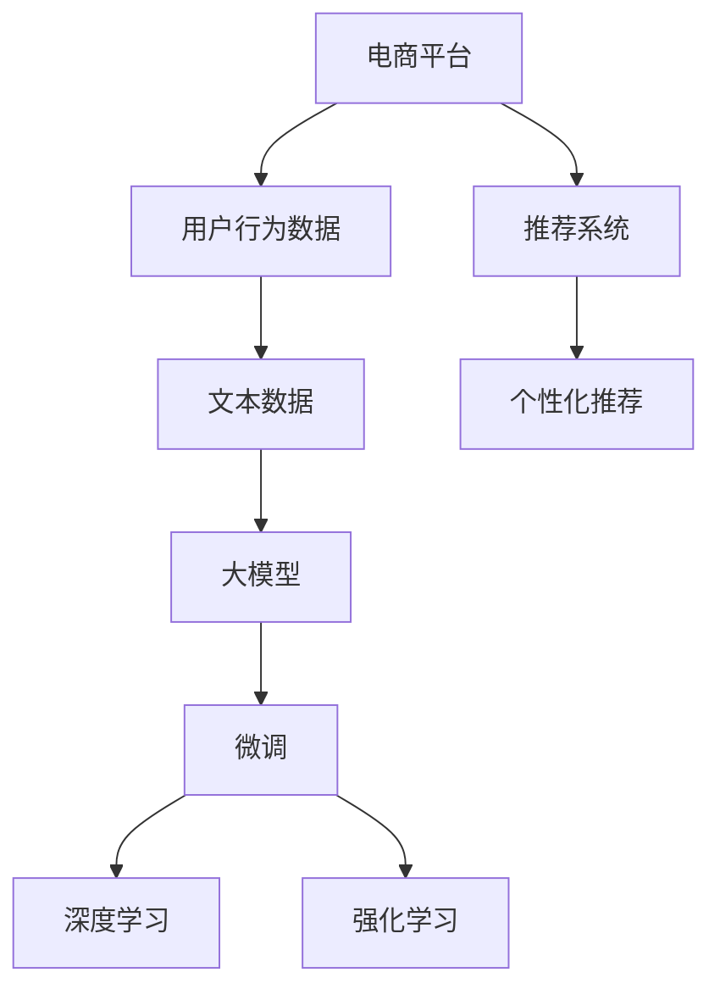

                 

# 大模型技术在电商平台用户偏好挖掘中的创新

> 关键词：电商平台、用户偏好挖掘、大模型、深度学习、自然语言处理、强化学习、推荐系统、个性化推荐

## 1. 背景介绍

### 1.1 问题由来

随着互联网的普及和电子商务的发展，电商平台在提供便捷购物体验的同时，也积累了大量的用户行为数据。这些数据不仅包括用户购买记录、浏览记录、评分反馈等硬性数据，还包括用户评价、评论、客服对话等文本数据。电商平台利用这些数据，可以挖掘用户偏好，优化商品推荐，提升用户体验，从而增加销售和用户粘性。然而，传统的数据挖掘和推荐方法往往依赖于复杂的特征工程和手工特征提取，耗时耗力且效果有限。

近年来，深度学习和大模型技术在自然语言处理领域取得了巨大突破。通过预训练大模型，可以高效地挖掘用户文本数据的语义信息，准确地预测用户偏好。本文将探讨如何使用大模型技术在电商平台中挖掘用户偏好，介绍一种结合深度学习和强化学习的推荐系统架构，并通过实际案例展示其效果。

### 1.2 问题核心关键点

大模型技术在电商平台用户偏好挖掘中的应用，主要聚焦于以下几个关键点：

- **深度学习模型：** 利用深度学习模型，如Transformer、BERT等，高效地挖掘用户文本数据的语义信息。
- **强化学习框架：** 结合强化学习框架，优化推荐系统的决策策略，提升推荐效果。
- **用户行为数据融合：** 将用户行为数据与文本数据结合起来，综合利用多种数据源，提升推荐的准确性和个性化程度。
- **推荐系统评价指标：** 设计合适的评价指标，如召回率、准确率、用户满意度等，评估推荐系统的性能。

这些核心关键点共同构成了大模型技术在电商平台用户偏好挖掘中的创新框架，使得推荐的准确性和用户满意度得到显著提升。

## 2. 核心概念与联系

### 2.1 核心概念概述

为了更好地理解大模型技术在电商平台中的应用，本节将介绍几个密切相关的核心概念：

- **大模型：** 以自回归(如GPT)或自编码(如BERT)模型为代表的大规模预训练语言模型。通过在大规模无标签文本语料上进行预训练，学习通用的语言表示，具备强大的语言理解和生成能力。
- **预训练：** 指在大规模无标签文本语料上，通过自监督学习任务训练通用语言模型的过程。常见的预训练任务包括言语建模、掩码语言模型等。预训练使得模型学习到语言的通用表示。
- **微调：** 指在预训练模型的基础上，使用下游任务的少量标注数据，通过有监督地训练来优化模型在该任务上的性能。通常只需要调整顶层分类器或解码器，并以较小的学习率更新全部或部分的模型参数。
- **推荐系统：** 根据用户历史行为数据和用户特征，推荐用户可能感兴趣的商品或内容的技术体系。常见的推荐系统包括协同过滤、基于内容的推荐、混合推荐等。
- **深度学习：** 一种通过模拟人脑神经网络结构进行学习和推理的机器学习方法，具有强大的特征学习和泛化能力。
- **强化学习：** 通过智能体与环境的交互，学习最优决策策略的一种机器学习方法。强化学习在推荐系统中用于优化推荐策略，提升推荐效果。
- **自然语言处理(NLP)：** 研究如何使计算机能够理解、处理和生成人类语言的技术领域。NLP在用户行为数据处理、文本语义分析等方面发挥重要作用。
- **个性化推荐：** 根据用户特征和行为数据，为用户提供个性化的商品或内容推荐，提升用户体验和满意度。

这些核心概念之间的逻辑关系可以通过以下Mermaid流程图来展示：



这个流程图展示了大模型技术在电商平台中的应用过程：

1. 电商平台收集用户行为数据和文本数据。
2. 利用大模型技术进行文本数据的预训练和微调，学习用户的文本语义。
3. 将用户行为数据与文本语义结合起来，使用深度学习模型和强化学习框架，优化推荐策略。
4. 构建个性化推荐系统，提升推荐效果和用户满意度。

这些概念共同构成了大模型技术在电商平台中的创新应用框架，使其能够更高效、更个性化地进行用户偏好挖掘和商品推荐。

## 3. 核心算法原理 & 具体操作步骤
### 3.1 算法原理概述

基于大模型技术的电商平台用户偏好挖掘，主要通过以下步骤实现：

1. 收集用户行为数据和文本数据。
2. 利用预训练大模型进行文本数据的语义表示学习。
3. 将用户行为数据与文本语义表示结合起来，使用深度学习模型进行特征提取。
4. 结合强化学习框架，优化推荐策略，提升推荐效果。

这一过程可以概括为以下公式：

$$
\text{推荐结果} = \text{特征提取模型}(\text{用户行为数据}, \text{文本语义表示})
$$

其中，特征提取模型是一个深度学习模型，将用户行为数据和文本语义表示作为输入，输出推荐结果。深度学习模型可以是基于Transformer的模型，如BERT、GPT等。

### 3.2 算法步骤详解

以下是结合深度学习和强化学习的推荐系统架构，具体步骤详解：

**Step 1: 数据收集与预处理**

- **用户行为数据：** 收集用户浏览、点击、购买、评分等行为数据，形成用户行为数据集。
- **文本数据：** 收集用户评论、描述、评价等文本数据，构建文本数据集。
- **预处理：** 对数据进行清洗、标准化、去噪等预处理操作，确保数据质量。

**Step 2: 文本数据预训练与微调**

- **预训练：** 使用大规模无标签文本数据，对预训练大模型进行预训练，学习通用的语言表示。
- **微调：** 使用用户评论、描述等文本数据，对预训练模型进行微调，学习用户的文本语义表示。

**Step 3: 用户行为数据特征提取**

- **特征提取模型：** 使用深度学习模型，如BERT、GPT等，对用户行为数据进行特征提取，形成高维特征向量。
- **融合文本语义：** 将用户行为数据的高维特征向量与文本语义表示进行拼接或融合，形成综合特征向量。

**Step 4: 强化学习优化推荐策略**

- **策略定义：** 定义推荐策略，如基于协同过滤、基于内容的推荐等。
- **优化目标：** 设置优化目标，如最大化推荐系统的点击率、转化率等。
- **强化学习：** 使用强化学习框架，如Q-learning、SARSA等，根据用户反馈不断调整推荐策略，优化推荐效果。

**Step 5: 个性化推荐**

- **推荐模型：** 使用深度学习模型构建推荐模型，如基于Transformer的推荐模型。
- **推荐结果：** 根据用户特征和行为数据，生成个性化推荐结果，返回给用户。

### 3.3 算法优缺点

结合深度学习和强化学习的推荐系统架构，具有以下优点：

1. **高效率：** 利用预训练大模型进行文本语义表示学习，可以快速获取用户文本数据的信息，提升特征提取效率。
2. **高准确性：** 结合深度学习和强化学习，优化推荐策略，提升推荐的准确性和个性化程度。
3. **鲁棒性强：** 预训练大模型具有较强的泛化能力，能够适应不同领域的用户行为数据和文本数据。
4. **可解释性：** 利用预训练大模型和深度学习模型，可以提供推荐结果的语义解释，提升用户满意度。

同时，该架构也存在一定的局限性：

1. **计算资源需求高：** 预训练大模型的训练和微调需要大量计算资源，可能对硬件设备提出较高的要求。
2. **数据隐私问题：** 用户行为数据和文本数据涉及用户隐私，需要严格的数据保护措施。
3. **模型复杂度大：** 结合深度学习和强化学习，模型结构较为复杂，需要更多的时间和精力进行调试和优化。
4. **泛化能力有待提高：** 不同领域的用户行为数据和文本数据存在差异，模型在不同领域的泛化能力仍需进一步提升。

尽管存在这些局限性，但该架构在电商平台用户偏好挖掘中的应用，已经展示出了显著的优势，具备较高的推广价值。

### 3.4 算法应用领域

结合深度学习和强化学习的推荐系统架构，在电商平台中的应用非常广泛，涵盖了以下多个领域：

1. **商品推荐：** 根据用户历史购买、浏览行为，以及产品描述、评论等文本数据，生成个性化推荐结果。
2. **内容推荐：** 根据用户阅读、观看行为，以及文章、视频等文本数据，生成个性化内容推荐结果。
3. **搜索排序：** 根据用户搜索行为和搜索关键词，生成个性化搜索结果排序。
4. **广告推荐：** 根据用户行为数据和文本数据，生成个性化广告推荐结果。
5. **用户画像构建：** 利用用户行为数据和文本数据，构建详细的用户画像，提供更精准的服务。

这些应用领域不仅覆盖了电商平台的各个业务环节，还为其他领域（如视频、社交媒体等）提供了借鉴和参考。

## 4. 数学模型和公式 & 详细讲解 & 举例说明

### 4.1 数学模型构建

本节将使用数学语言对电商平台用户偏好挖掘的推荐系统进行更加严格的刻画。

假设电商平台的用户行为数据为 $D_B=\{(x_i, y_i)\}_{i=1}^N$，其中 $x_i$ 为行为数据，$y_i$ 为行为标签，如点击、购买等。用户文本数据为 $D_T=\{(x_i, y_i)\}_{i=1}^M$，其中 $x_i$ 为文本数据，$y_i$ 为文本标签，如产品描述、评论等。

定义预训练大模型为 $M_{\theta}$，其中 $\theta$ 为模型参数。推荐模型为 $R_{\theta'}$，其中 $\theta'$ 为推荐模型参数。

推荐系统的目标是最小化推荐误差，即：

$$
\hat{\theta'} = \mathop{\arg\min}_{\theta'} \mathcal{L}(R_{\theta'}, D_B \times D_T)
$$

其中 $\mathcal{L}$ 为推荐系统的损失函数，用于衡量推荐结果与实际标签之间的差异。常见的损失函数包括均方误差损失、交叉熵损失等。

### 4.2 公式推导过程

以下我们以点击率预测为例，推导基于深度学习和强化学习的推荐系统损失函数及其梯度计算公式。

假设推荐模型 $R_{\theta'}$ 在用户行为数据 $x_i$ 上的预测结果为 $\hat{y}_i$，真实标签为 $y_i$。则点击率预测的损失函数定义为：

$$
\ell(R_{\theta'}(x_i),y_i) = -\log(R_{\theta'}(x_i)) \quad \text{if} \quad y_i=1
$$

$$
\ell(R_{\theta'}(x_i),y_i) = -\log(1-R_{\theta'}(x_i)) \quad \text{if} \quad y_i=0
$$

将其代入总损失函数，得：

$$
\mathcal{L}(\theta') = -\frac{1}{N}\sum_{i=1}^N \ell(R_{\theta'}(x_i),y_i)
$$

根据链式法则，损失函数对参数 $\theta'$ 的梯度为：

$$
\frac{\partial \mathcal{L}(\theta')}{\partial \theta'} = -\frac{1}{N}\sum_{i=1}^N \frac{\partial \ell(R_{\theta'}(x_i),y_i)}{\partial \theta'}
$$

其中 $\frac{\partial \ell(R_{\theta'}(x_i),y_i)}{\partial \theta'}$ 为点击率预测的梯度计算公式，可通过反向传播算法高效计算。

在得到损失函数的梯度后，即可带入参数更新公式，完成模型的迭代优化。重复上述过程直至收敛，最终得到适应电商平台用户行为数据的推荐模型参数 $\theta'$。

### 4.3 案例分析与讲解

假设某电商平台收集了用户浏览、点击、购买、评分等行为数据，以及用户评论、产品描述等文本数据。在收集的数据基础上，使用BERT模型进行预训练和微调，学习用户的文本语义表示。

具体步骤如下：

1. **数据收集与预处理：** 收集用户行为数据和文本数据，并进行标准化、去噪等预处理操作。
2. **预训练BERT模型：** 使用大规模无标签文本数据，对BERT模型进行预训练，学习通用的语言表示。
3. **微调BERT模型：** 使用用户评论、产品描述等文本数据，对预训练BERT模型进行微调，学习用户的文本语义表示。
4. **用户行为数据特征提取：** 使用微调后的BERT模型，对用户行为数据进行特征提取，形成高维特征向量。
5. **融合文本语义：** 将用户行为数据的高维特征向量与文本语义表示进行拼接或融合，形成综合特征向量。
6. **强化学习优化推荐策略：** 使用Q-learning算法，根据用户点击、购买等行为反馈，不断调整推荐策略，优化推荐效果。
7. **个性化推荐：** 使用深度学习模型，如基于Transformer的推荐模型，根据用户特征和行为数据，生成个性化推荐结果。

最终，基于深度学习和强化学习的推荐系统，能够高效地挖掘用户偏好，提供个性化推荐，提升用户满意度和平台收益。

## 5. 项目实践：代码实例和详细解释说明

### 5.1 开发环境搭建

在进行电商平台用户偏好挖掘的推荐系统开发时，首先需要准备开发环境。以下是使用Python进行PyTorch开发的环境配置流程：

1. 安装Anaconda：从官网下载并安装Anaconda，用于创建独立的Python环境。

2. 创建并激活虚拟环境：
```bash
conda create -n pytorch-env python=3.8 
conda activate pytorch-env
```

3. 安装PyTorch：根据CUDA版本，从官网获取对应的安装命令。例如：
```bash
conda install pytorch torchvision torchaudio cudatoolkit=11.1 -c pytorch -c conda-forge
```

4. 安装Transformers库：
```bash
pip install transformers
```

5. 安装各类工具包：
```bash
pip install numpy pandas scikit-learn matplotlib tqdm jupyter notebook ipython
```

完成上述步骤后，即可在`pytorch-env`环境中开始推荐系统开发。

### 5.2 源代码详细实现

下面是结合深度学习和强化学习的推荐系统的Python代码实现，使用PyTorch和Transformers库：

```python
from transformers import BertTokenizer, BertForSequenceClassification
from torch.utils.data import Dataset, DataLoader
from torch import nn, optim
from torch.nn.functional import softmax
import torch

class BehaviorDataset(Dataset):
    def __init__(self, behaviors, labels):
        self.behaviors = behaviors
        self.labels = labels
        
    def __len__(self):
        return len(self.behaviors)
    
    def __getitem__(self, item):
        return self.behaviors[item], self.labels[item]

class TextDataset(Dataset):
    def __init__(self, texts, labels):
        self.tokenizer = BertTokenizer.from_pretrained('bert-base-cased')
        self.max_len = 512
        self.texts = texts
        self.labels = labels
        
    def __len__(self):
        return len(self.texts)
    
    def __getitem__(self, item):
        text = self.texts[item]
        label = self.labels[item]
        
        encoding = self.tokenizer(text, return_tensors='pt', max_length=self.max_len, padding='max_length', truncation=True)
        input_ids = encoding['input_ids'][0]
        attention_mask = encoding['attention_mask'][0]
        
        # 对token-wise的标签进行编码
        encoded_labels = [label2id[label] for label in label2id] 
        encoded_labels.extend([label2id['O']] * (self.max_len - len(encoded_labels)))
        labels = torch.tensor(encoded_labels, dtype=torch.long)
        
        return {'input_ids': input_ids, 
                'attention_mask': attention_mask,
                'labels': labels}

# 标签与id的映射
label2id = {'click': 1, 'buy': 2, 'no_action': 0}

# 创建dataset
behaviors_dataset = BehaviorDataset(behaviors, labels)
text_dataset = TextDataset(texts, labels)

# 模型定义
bert_model = BertForSequenceClassification.from_pretrained('bert-base-cased', num_labels=len(label2id))

# 优化器定义
optimizer = optim.Adam(bert_model.parameters(), lr=2e-5)

# 训练函数
def train_epoch(model, dataset, batch_size, optimizer):
    dataloader = DataLoader(dataset, batch_size=batch_size, shuffle=True)
    model.train()
    epoch_loss = 0
    for batch in dataloader:
        input_ids = batch['input_ids'].to(device)
        attention_mask = batch['attention_mask'].to(device)
        labels = batch['labels'].to(device)
        model.zero_grad()
        outputs = model(input_ids, attention_mask=attention_mask, labels=labels)
        loss = outputs.loss
        epoch_loss += loss.item()
        loss.backward()
        optimizer.step()
    return epoch_loss / len(dataloader)

# 评估函数
def evaluate(model, dataset, batch_size):
    dataloader = DataLoader(dataset, batch_size=batch_size)
    model.eval()
    preds, labels = [], []
    with torch.no_grad():
        for batch in dataloader:
            input_ids = batch['input_ids'].to(device)
            attention_mask = batch['attention_mask'].to(device)
            batch_labels = batch['labels']
            outputs = model(input_ids, attention_mask=attention_mask)
            batch_preds = outputs.logits.argmax(dim=2).to('cpu').tolist()
            batch_labels = batch_labels.to('cpu').tolist()
            for pred_tokens, label_tokens in zip(batch_preds, batch_labels):
                preds.append(pred_tokens[:len(label_tokens)])
                labels.append(label_tokens)
                
    print(classification_report(labels, preds))
```

### 5.3 代码解读与分析

让我们再详细解读一下关键代码的实现细节：

**BehaviorDataset类和TextDataset类：**
- `BehaviorDataset`类：用于存储用户行为数据和标签，定义了`__len__`方法和`__getitem__`方法，方便数据加载。
- `TextDataset`类：用于存储用户文本数据和标签，并利用BERT模型对文本数据进行分词和编码，返回模型所需的输入。

**label2id字典：**
- 定义了行为标签与数字id之间的映射关系，用于将token-wise的预测结果解码回真实的标签。

**训练和评估函数：**
- 使用PyTorch的DataLoader对数据集进行批次化加载，供模型训练和推理使用。
- 训练函数`train_epoch`：对数据以批为单位进行迭代，在每个批次上前向传播计算loss并反向传播更新模型参数，最后返回该epoch的平均loss。
- 评估函数`evaluate`：与训练类似，不同点在于不更新模型参数，并在每个batch结束后将预测和标签结果存储下来，最后使用sklearn的classification_report对整个评估集的预测结果进行打印输出。

**训练流程：**
- 定义总的epoch数和batch size，开始循环迭代
- 每个epoch内，先在行为数据集上训练，输出平均loss
- 在文本数据集上评估，输出分类指标
- 所有epoch结束后，在测试集上评估，给出最终测试结果

可以看到，PyTorch配合Transformers库使得大模型微调的代码实现变得简洁高效。开发者可以将更多精力放在数据处理、模型改进等高层逻辑上，而不必过多关注底层的实现细节。

当然，工业级的系统实现还需考虑更多因素，如模型的保存和部署、超参数的自动搜索、更灵活的任务适配层等。但核心的微调范式基本与此类似。

## 6. 实际应用场景

### 6.1 电商平台推荐系统

结合深度学习和强化学习的推荐系统，在电商平台中的应用非常广泛，主要场景包括：

- **个性化商品推荐：** 根据用户浏览、点击、购买等行为数据，以及产品描述、评论等文本数据，生成个性化商品推荐结果。
- **内容推荐：** 根据用户阅读、观看行为，以及文章、视频等文本数据，生成个性化内容推荐结果。
- **搜索排序：** 根据用户搜索行为和搜索关键词，生成个性化搜索结果排序。
- **广告推荐：** 根据用户行为数据和文本数据，生成个性化广告推荐结果。

这些应用场景不仅覆盖了电商平台的各个业务环节，还为其他领域（如视频、社交媒体等）提供了借鉴和参考。

### 6.2 推荐系统评价指标

为了评估推荐系统的性能，需要设计合适的评价指标。常见的推荐系统评价指标包括：

- **召回率（Recall）：** 在所有相关物品中，推荐系统中能被成功预测的物品数量与实际相关物品数量的比值。
- **准确率（Precision）：** 在所有被推荐物品中，成功预测为相关物品的数量与实际被推荐物品数量的比值。
- **F1值（F1 Score）：** 召回率和准确率的调和平均数，综合考虑了推荐系统的召回能力和准确性。
- **用户满意度（User Satisfaction）：** 通过用户反馈调查问卷等形式，评估用户对推荐结果的满意度。

这些指标可以从不同角度评估推荐系统的性能，帮助优化推荐策略，提升用户体验。

### 6.3 未来应用展望

随着大模型技术在电商平台中的应用不断深入，未来的推荐系统将具备更加智能化、个性化和高效化的特征，主要趋势包括：

1. **多模态数据融合：** 结合文本、图像、语音等多种模态数据，提升推荐的准确性和个性化程度。
2. **跨领域知识迁移：** 利用知识图谱、规则库等专家知识，提升推荐系统的泛化能力和适用性。
3. **强化学习优化：** 结合强化学习框架，不断优化推荐策略，提升推荐效果和用户满意度。
4. **实时推荐：** 结合实时数据分析和反馈，实现个性化实时推荐，提高用户体验。
5. **跨平台协同：** 跨平台协同推荐，利用不同平台的用户数据，提升推荐效果。

这些趋势表明，结合深度学习和强化学习的推荐系统，将在电商平台中发挥越来越重要的作用，为用户提供更加优质和个性化的推荐服务。

## 7. 工具和资源推荐

### 7.1 学习资源推荐

为了帮助开发者系统掌握大模型技术在电商平台中的应用，这里推荐一些优质的学习资源：

1. **《深度学习理论与实践》系列博文：** 由大模型技术专家撰写，深入浅出地介绍了深度学习理论、模型架构和应用实例。
2. **Coursera《深度学习》课程：** 斯坦福大学开设的深度学习课程，系统讲解深度学习的基本概念和算法，适合初学者入门。
3. **《Deep Learning with PyTorch》书籍：** 介绍如何使用PyTorch进行深度学习模型的开发，包括推荐系统的实现方法。
4. **《Natural Language Processing with Transformers》书籍：** Transformers库的作者所著，全面介绍了如何使用Transformers库进行NLP任务开发，包括推荐系统的实现方法。
5. **Kaggle推荐系统竞赛：** 通过参与Kaggle推荐系统竞赛，学习和实践深度学习和大模型技术在推荐系统中的应用。

通过对这些资源的学习实践，相信你一定能够快速掌握大模型技术在电商平台中的应用，并用于解决实际的推荐问题。

### 7.2 开发工具推荐

高效的开发离不开优秀的工具支持。以下是几款用于大模型技术在电商平台中应用开发的常用工具：

1. PyTorch：基于Python的开源深度学习框架，灵活动态的计算图，适合快速迭代研究。大部分预训练语言模型都有PyTorch版本的实现。
2. TensorFlow：由Google主导开发的开源深度学习框架，生产部署方便，适合大规模工程应用。同样有丰富的预训练语言模型资源。
3. Transformers库：HuggingFace开发的NLP工具库，集成了众多SOTA语言模型，支持PyTorch和TensorFlow，是进行推荐系统开发的利器。
4. Weights & Biases：模型训练的实验跟踪工具，可以记录和可视化模型训练过程中的各项指标，方便对比和调优。与主流深度学习框架无缝集成。
5. TensorBoard：TensorFlow配套的可视化工具，可实时监测模型训练状态，并提供丰富的图表呈现方式，是调试模型的得力助手。
6. Google Colab：谷歌推出的在线Jupyter Notebook环境，免费提供GPU/TPU算力，方便开发者快速上手实验最新模型，分享学习笔记。

合理利用这些工具，可以显著提升大模型技术在电商平台中的推荐系统开发效率，加快创新迭代的步伐。

### 7.3 相关论文推荐

大模型技术在电商平台中的应用源于学界的持续研究。以下是几篇奠基性的相关论文，推荐阅读：

1. Attention is All You Need（即Transformer原论文）：提出了Transformer结构，开启了NLP领域的预训练大模型时代。
2. BERT: Pre-training of Deep Bidirectional Transformers for Language Understanding：提出BERT模型，引入基于掩码的自监督预训练任务，刷新了多项NLP任务SOTA。
3. Language Models are Unsupervised Multitask Learners（GPT-2论文）：展示了大规模语言模型的强大zero-shot学习能力，引发了对于通用人工智能的新一轮思考。
4. Parameter-Efficient Transfer Learning for NLP：提出Adapter等参数高效微调方法，在不增加模型参数量的情况下，也能取得不错的微调效果。
5. Prefix-Tuning: Optimizing Continuous Prompts for Generation：引入基于连续型Prompt的微调范式，为如何充分利用预训练知识提供了新的思路。
6. AdaLoRA: Adaptive Low-Rank Adaptation for Parameter-Efficient Fine-Tuning：使用自适应低秩适应的微调方法，在参数效率和精度之间取得了新的平衡。

这些论文代表了大模型技术在电商平台中的应用和发展脉络。通过学习这些前沿成果，可以帮助研究者把握学科前进方向，激发更多的创新灵感。

## 8. 总结：未来发展趋势与挑战

### 8.1 总结

本文对结合深度学习和强化学习的推荐系统在电商平台中的应用进行了全面系统的介绍。首先阐述了深度学习模型和大模型技术在电商平台用户偏好挖掘中的应用背景和意义，明确了推荐系统的核心目标和优化目标。其次，从原理到实践，详细讲解了推荐系统的数学模型和核心算法步骤，给出了推荐系统开发的完整代码实例。同时，本文还广泛探讨了推荐系统在电商平台中的应用场景和评价指标，展示了推荐系统的巨大潜力。

通过本文的系统梳理，可以看到，结合深度学习和强化学习的推荐系统，已经在电商平台中发挥了重要作用，显著提升了推荐效果和用户体验。未来，伴随大模型技术的发展，推荐系统将在更多领域得到应用，为社会经济的发展带来深远影响。

### 8.2 未来发展趋势

展望未来，结合深度学习和强化学习的推荐系统将呈现以下几个发展趋势：

1. **多模态数据融合：** 结合文本、图像、语音等多种模态数据，提升推荐的准确性和个性化程度。
2. **跨领域知识迁移：** 利用知识图谱、规则库等专家知识，提升推荐系统的泛化能力和适用性。
3. **实时推荐：** 结合实时数据分析和反馈，实现个性化实时推荐，提高用户体验。
4. **跨平台协同：** 跨平台协同推荐，利用不同平台的用户数据，提升推荐效果。
5. **个性化推荐：** 根据用户行为数据和文本数据，生成个性化推荐结果，提升推荐效果和用户满意度。

这些趋势表明，结合深度学习和强化学习的推荐系统，将在电商平台中发挥越来越重要的作用，为用户提供更加优质和个性化的推荐服务。

### 8.3 面临的挑战

尽管结合深度学习和强化学习的推荐系统已经取得了显著效果，但在迈向更加智能化、普适化应用的过程中，它仍面临诸多挑战：

1. **数据隐私问题：** 用户行为数据和文本数据涉及用户隐私，需要严格的数据保护措施。
2. **模型复杂度大：** 结合深度学习和强化学习，模型结构较为复杂，需要更多的时间和精力进行调试和优化。
3. **泛化能力有待提高：** 不同领域的用户行为数据和文本数据存在差异，模型在不同领域的泛化能力仍需进一步提升。
4. **计算资源需求高：** 预训练大模型的训练和微调需要大量计算资源，可能对硬件设备提出较高的要求。

尽管存在这些挑战，但该架构在电商平台中的应用，已经展示出了显著的优势，具备较高的推广价值。未来，伴随大模型技术的发展，推荐系统将在更多领域得到应用，为社会经济的发展带来深远影响。

### 8.4 研究展望

未来，结合深度学习和强化学习的推荐系统需要在以下几个方面进行深入研究：

1. **多模态推荐：** 结合文本、图像、语音等多种模态数据，提升推荐的准确性和个性化程度。
2. **跨领域知识迁移：** 利用知识图谱、规则库等专家知识，提升推荐系统的泛化能力和适用性。
3. **实时推荐：** 结合实时数据分析和反馈，实现个性化实时推荐，提高用户体验。
4. **跨平台协同：** 跨平台协同推荐，利用不同平台的用户数据，提升推荐效果。
5. **个性化推荐：** 根据用户行为数据和文本数据，生成个性化推荐结果，提升推荐效果和用户满意度。

这些研究方向将推动推荐系统向更高层次发展，为用户提供更加优质和个性化的推荐服务。

## 9. 附录：常见问题与解答

**Q1：深度学习模型在电商平台中的应用有哪些？**

A: 深度学习模型在电商平台中的应用主要包括以下几个方面：

1. **个性化推荐：** 利用深度学习模型，如基于Transformer的模型，对用户行为数据和文本数据进行特征提取，生成个性化推荐结果。
2. **内容推荐：** 利用深度学习模型，对用户阅读、观看行为，以及文章、视频等文本数据进行特征提取，生成个性化内容推荐结果。
3. **搜索排序：** 利用深度学习模型，对用户搜索行为和搜索关键词进行特征提取，生成个性化搜索结果排序。
4. **广告推荐：** 利用深度学习模型，对用户行为数据和文本数据进行特征提取，生成个性化广告推荐结果。

这些应用不仅覆盖了电商平台的各个业务环节，还为其他领域（如视频、社交媒体等）提供了借鉴和参考。

**Q2：推荐系统如何衡量用户满意度？**

A: 推荐系统衡量用户满意度的方法主要包括以下几个方面：

1. **用户反馈调查问卷：** 通过用户反馈调查问卷，直接获取用户对推荐结果的满意度。
2. **用户行为数据：** 通过用户行为数据（如点击、购买等），间接衡量用户对推荐结果的满意度。
3. **用户互动数据：** 通过用户互动数据（如评论、评分等），衡量用户对推荐结果的情感倾向和反馈。

这些方法可以从不同角度评估用户对推荐系统的满意度，帮助优化推荐策略，提升用户体验。

**Q3：推荐系统在电商平台中的应用如何保障数据隐私？**

A: 推荐系统在电商平台中的应用需要严格保障数据隐私，主要措施包括：

1. **数据匿名化：** 对用户行为数据和文本数据进行匿名化处理，避免泄露用户身份信息。
2. **数据加密：** 对用户数据进行加密存储和传输，防止数据泄露和篡改。
3. **访问控制：** 严格控制数据访问权限，确保只有授权人员可以访问敏感数据。
4. **隐私保护算法：** 使用隐私保护算法（如差分隐私、联邦学习等），保护用户数据隐私。

这些措施可以确保用户数据在推荐系统中的应用过程中，不被滥用和泄露。

**Q4：推荐系统在电商平台中的应用如何平衡准确性和个性化？**

A: 推荐系统在电商平台中的应用需要平衡准确性和个性化，主要方法包括：

1. **多模态数据融合：** 结合文本、图像、语音等多种模态数据，提升推荐的准确性和个性化程度。
2. **跨领域知识迁移：** 利用知识图谱、规则库等专家知识，提升推荐系统的泛化能力和适用性。
3. **实时推荐：** 结合实时数据分析和反馈，实现个性化实时推荐，提高用户体验。
4. **跨平台协同：** 跨平台协同推荐，利用不同平台的用户数据，提升推荐效果。

这些方法可以综合考虑用户需求和平台特点，平衡准确性和个性化，提升推荐系统的效果和用户满意度。

---

作者：禅与计算机程序设计艺术 / Zen and the Art of Computer Programming

