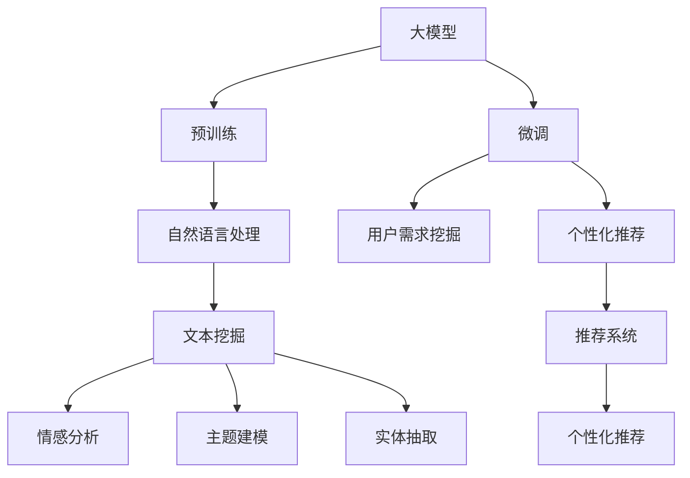

                 

# 大模型技术在电商平台用户潜在需求挖掘与产品开发中的应用

> 关键词：大模型,用户需求挖掘,电商平台,自然语言处理,产品开发,需求预测,个性化推荐

## 1. 背景介绍

### 1.1 问题由来

在快速变化的市场环境中，电商平台需要不断调整产品策略以应对消费者的变化需求。传统的用户需求获取方式如问卷调查、用户访谈等成本高且耗时，难以获取实时、精确的用户需求信息。而随着自然语言处理（Natural Language Processing, NLP）技术的快速发展，大模型（如BERT、GPT等）通过在大量文本数据上进行预训练，能够从中挖掘出丰富的用户情感、兴趣、需求等信息，为电商平台的用户需求挖掘和产品开发提供了一种高效、低成本的新手段。

### 1.2 问题核心关键点

通过大模型技术，电商平台可以从用户评论、产品描述、搜索记录等文本数据中，自动提取用户需求和意见，形成用户画像，并对未来需求进行预测，从而指导产品开发和营销策略。具体来说，核心关键点包括：

- 文本数据的多样性。电商平台涉及的文本数据类型繁多，如用户评论、产品描述、商品标题、搜索记录等，需要大模型能够对不同类型的数据进行理解和提取。
- 用户需求的实时性。用户需求变化迅速，电商平台需要能够实时捕获用户变化的需求，及时调整产品策略。
- 需求预测的准确性。准确预测用户需求不仅能提升产品开发的针对性，也能减少试错成本。
- 个性化推荐的优化。大模型可以基于用户的历史行为和文本数据，推荐个性化商品，提升用户体验和满意度。

### 1.3 问题研究意义

采用大模型技术进行用户需求挖掘和产品开发，具有以下重要意义：

1. 提高用户满意度：通过精准了解用户需求，电商平台能够提供更贴合用户需求的产品，提升用户满意度。
2. 优化库存管理：需求预测帮助电商平台优化库存管理，减少库存积压和缺货情况。
3. 提升营销效率：个性化推荐能够提高营销转化率，降低营销成本。
4. 驱动创新：精准的需求挖掘和预测可以指导产品开发方向，驱动产品创新和迭代。
5. 增强竞争力：通过高效获取用户需求和快速响应市场变化，电商平台能够更好地适应竞争环境，保持市场领先地位。

## 2. 核心概念与联系

### 2.1 核心概念概述

为了更好地理解大模型技术在电商平台用户需求挖掘和产品开发中的应用，本节将介绍几个核心概念：

- 大模型（Large Model）：指在大规模无标签文本数据上进行预训练的语言模型，如BERT、GPT等，能够提取丰富的语言知识和常识。
- 预训练（Pre-training）：通过在海量无标签文本数据上，利用自监督学习任务训练大语言模型，学习到通用的语言表示。
- 微调（Fine-tuning）：在大模型的基础上，通过有监督学习对模型进行优化，使其适应特定任务，如用户需求挖掘、个性化推荐等。
- 自然语言处理（NLP）：涉及文本数据的处理、分析、生成等，是大模型技术应用的核心领域。
- 文本挖掘（Text Mining）：从文本数据中自动抽取有价值的信息，如情感、主题、实体等。
- 推荐系统（Recommendation System）：利用用户的历史行为和文本数据，为用户推荐个性化商品。

这些概念之间的逻辑关系可以通过以下Mermaid流程图来展示：



这个流程图展示了大模型技术的应用框架：

1. 大模型通过预训练获得基础能力。
2. 微调是对大模型的任务特定优化，使其适应电商平台的特定需求。
3. 自然语言处理技术帮助从文本数据中提取有价值的信息。
4. 文本挖掘技术从文本中自动提取情感、主题、实体等信息，进一步辅助用户需求挖掘和个性化推荐。
5. 推荐系统利用用户历史行为和文本数据，生成个性化推荐结果。

## 3. 核心算法原理 & 具体操作步骤

### 3.1 算法原理概述

基于大模型技术进行用户需求挖掘和产品开发，主要涉及以下几个步骤：

1. 在大模型上进行预训练，学习通用的语言表示。
2. 在电商平台的特定任务上微调大模型，如用户评论情感分析、个性化推荐等。
3. 利用微调后的大模型，对用户评论、产品描述等文本数据进行情感分析、实体抽取等文本挖掘工作。
4. 结合文本挖掘结果，进行需求预测、个性化推荐等应用。

其中，预训练和微调是核心步骤，通过预训练学习通用知识，通过微调学习特定任务知识，最终实现用户需求挖掘和产品开发。

### 3.2 算法步骤详解

以下是详细的操作步骤：

**Step 1: 准备数据集**

- 收集电商平台的各类文本数据，如用户评论、商品描述、搜索记录等。
- 对文本进行预处理，包括分词、去除停用词、标准化等。
- 划分训练集、验证集和测试集，确保数据分布相似。

**Step 2: 构建预训练大模型**

- 使用BERT、GPT等大模型，在电商平台的文本数据上进行预训练。
- 通过自监督学习任务，如掩码语言模型（Masked Language Model, MLM）、下一句预测（Next Sentence Prediction, NSP）等，学习通用的语言表示。

**Step 3: 进行微调**

- 在电商平台的特定任务上微调大模型。例如，使用用户评论数据进行情感分析，使用商品描述进行实体抽取。
- 设计任务适配层，如分类头、回归头、编码器等，与大模型连接。
- 选择适当的优化算法和超参数，如学习率、批大小、迭代轮数等。
- 进行梯度下降等优化算法，更新模型参数。

**Step 4: 应用文本挖掘**

- 利用微调后的大模型，进行情感分析、实体抽取等文本挖掘工作。
- 将挖掘出的情感、主题、实体等信息作为特征，用于需求预测、个性化推荐等任务。

**Step 5: 进行需求预测和个性化推荐**

- 结合文本挖掘结果，利用推荐算法生成个性化推荐结果。
- 根据需求预测结果，指导产品开发和库存管理。

### 3.3 算法优缺点

大模型技术在电商平台用户需求挖掘和产品开发中具有以下优点：

- 高效：能够自动处理海量文本数据，快速提取用户需求和意见。
- 低成本：减少问卷调查、用户访谈等传统方式的时间和成本。
- 精准：通过学习大模型的通用语言知识，挖掘出更丰富的用户需求。

但同时，也存在一些缺点：

- 数据依赖：大模型效果依赖于电商平台的文本数据质量，需收集和处理大量数据。
- 模型复杂：大模型的训练和微调需要强大的计算资源。
- 效果不稳定：不同用户、不同场景下的需求挖掘结果可能存在差异。
- 可解释性不足：大模型的决策过程难以解释，难以理解模型内部的推理逻辑。

### 3.4 算法应用领域

大模型技术在电商平台用户需求挖掘和产品开发中的应用领域广泛，主要包括以下几个方面：

1. 用户评论情感分析：通过分析用户评论情感，了解用户对产品的满意度、偏好和改进建议。
2. 商品描述实体抽取：从商品描述中自动抽取产品名称、价格、功能等关键信息，用于产品管理。
3. 搜索查询意图预测：根据用户搜索查询，预测用户需求，提供相关商品推荐。
4. 个性化推荐：基于用户历史行为和文本数据，生成个性化商品推荐。
5. 产品开发指导：通过分析用户评论和需求，指导产品开发方向，提升产品质量。

## 4. 数学模型和公式 & 详细讲解 & 举例说明

### 4.1 数学模型构建

假设电商平台的文本数据为 $D=\{x_i\}_{i=1}^N$，其中 $x_i$ 为文本向量。设大模型为 $M_{\theta}$，其中 $\theta$ 为模型参数。

预训练任务的目标函数为：

$$
\mathcal{L}_{pre} = -\frac{1}{N}\sum_{i=1}^N \ell(M_{\theta}(x_i))
$$

其中 $\ell$ 为预训练任务设计的损失函数，如掩码语言模型损失。

微调任务的目标函数为：

$$
\mathcal{L}_{fin} = -\frac{1}{N}\sum_{i=1}^N \ell(M_{\theta}(x_i), y_i)
$$

其中 $y_i$ 为任务标注。

文本挖掘任务的目标函数为：

$$
\mathcal{L}_{text} = \frac{1}{N}\sum_{i=1}^N \ell(\text{ExtractedFeatures}(x_i))
$$

其中 $\text{ExtractedFeatures}(x_i)$ 为从文本中提取的特征，$\ell$ 为损失函数，如交叉熵损失。

### 4.2 公式推导过程

以下以情感分析为例，推导基于大模型进行用户评论情感分析的数学模型。

假设用户评论 $x$ 的情感类别为 $y \in \{1, -1\}$，表示正面、负面情绪。模型 $M_{\theta}$ 的输出为 $\hat{y}=M_{\theta}(x)$，表示用户评论的情感概率。

定义二分类交叉熵损失函数：

$$
\ell(y, \hat{y}) = -[y\log \hat{y} + (1-y)\log (1-\hat{y})]
$$

将情感分析任务的目标函数代入上述公式：

$$
\mathcal{L}_{fin} = -\frac{1}{N}\sum_{i=1}^N [y_i\log M_{\theta}(x_i)+(1-y_i)\log(1-M_{\theta}(x_i))]
$$

在微调过程中，通过梯度下降等优化算法更新模型参数 $\theta$：

$$
\theta \leftarrow \theta - \eta \nabla_{\theta}\mathcal{L}_{fin}(\theta)
$$

其中 $\eta$ 为学习率。

在文本挖掘阶段，假设从用户评论中提取出的情感强度为 $s$，损失函数为：

$$
\ell(s) = \frac{1}{N}\sum_{i=1}^N (s_i - s)^2
$$

其中 $s_i$ 为第 $i$ 个样本的情感强度预测值。

### 4.3 案例分析与讲解

假设电商平台收集了大量用户评论数据 $D=\{x_1, x_2, ..., x_N\}$，每条评论标注了正面或负面情绪 $y_i$。使用BERT模型作为大模型，在电商平台的评论数据上进行预训练和微调。

**Step 1: 预训练**

在电商评论数据上，使用掩码语言模型任务进行预训练，目标函数为：

$$
\mathcal{L}_{pre} = -\frac{1}{N}\sum_{i=1}^N \ell_{MLM}(M_{\theta}(x_i))
$$

其中 $\ell_{MLM}$ 为掩码语言模型损失函数。

**Step 2: 微调**

在评论数据上，使用情感分析任务进行微调，目标函数为：

$$
\mathcal{L}_{fin} = -\frac{1}{N}\sum_{i=1}^N \ell_{CE}(M_{\theta}(x_i), y_i)
$$

其中 $\ell_{CE}$ 为交叉熵损失函数。

在微调过程中，模型参数 $\theta$ 更新如下：

$$
\theta \leftarrow \theta - \eta \nabla_{\theta}\mathcal{L}_{fin}(\theta)
$$

**Step 3: 文本挖掘**

利用微调后的BERT模型，对每条评论进行情感分析，预测情感概率 $\hat{y}$：

$$
\hat{y} = \text{softmax}(M_{\theta}(x_i))
$$

通过文本挖掘，得到每条评论的情感强度 $s$：

$$
s = \sum_j f_j \cdot \hat{y}_j
$$

其中 $f_j$ 为第 $j$ 个词的情感强度权重，$\hat{y}_j$ 为该词在评论中的情感概率。

## 5. 项目实践：代码实例和详细解释说明

### 5.1 开发环境搭建

在进行项目实践前，我们需要准备好开发环境。以下是使用Python进行PyTorch开发的环境配置流程：

1. 安装Anaconda：从官网下载并安装Anaconda，用于创建独立的Python环境。

2. 创建并激活虚拟环境：
```bash
conda create -n pytorch-env python=3.8 
conda activate pytorch-env
```

3. 安装PyTorch：根据CUDA版本，从官网获取对应的安装命令。例如：
```bash
conda install pytorch torchvision torchaudio cudatoolkit=11.1 -c pytorch -c conda-forge
```

4. 安装HuggingFace库：
```bash
pip install transformers
```

5. 安装各类工具包：
```bash
pip install numpy pandas scikit-learn matplotlib tqdm jupyter notebook ipython
```

完成上述步骤后，即可在`pytorch-env`环境中开始项目实践。

### 5.2 源代码详细实现

下面以情感分析为例，给出使用HuggingFace库对BERT模型进行微调的PyTorch代码实现。

首先，定义情感分析任务的数据处理函数：

```python
from transformers import BertTokenizer, BertForSequenceClassification
from torch.utils.data import Dataset
import torch

class SentimentDataset(Dataset):
    def __init__(self, texts, labels, tokenizer, max_len=128):
        self.texts = texts
        self.labels = labels
        self.tokenizer = tokenizer
        self.max_len = max_len
        
    def __len__(self):
        return len(self.texts)
    
    def __getitem__(self, item):
        text = self.texts[item]
        label = self.labels[item]
        
        encoding = self.tokenizer(text, return_tensors='pt', max_length=self.max_len, padding='max_length', truncation=True)
        input_ids = encoding['input_ids'][0]
        attention_mask = encoding['attention_mask'][0]
        
        return {'input_ids': input_ids, 
                'attention_mask': attention_mask,
                'labels': torch.tensor(label, dtype=torch.long)}
```

然后，定义模型和优化器：

```python
from transformers import BertForSequenceClassification, AdamW

model = BertForSequenceClassification.from_pretrained('bert-base-cased', num_labels=2)

optimizer = AdamW(model.parameters(), lr=2e-5)
```

接着，定义训练和评估函数：

```python
from torch.utils.data import DataLoader
from tqdm import tqdm
from sklearn.metrics import accuracy_score, f1_score, precision_score, recall_score

device = torch.device('cuda') if torch.cuda.is_available() else torch.device('cpu')
model.to(device)

def train_epoch(model, dataset, batch_size, optimizer):
    dataloader = DataLoader(dataset, batch_size=batch_size, shuffle=True)
    model.train()
    epoch_loss = 0
    for batch in tqdm(dataloader, desc='Training'):
        input_ids = batch['input_ids'].to(device)
        attention_mask = batch['attention_mask'].to(device)
        labels = batch['labels'].to(device)
        model.zero_grad()
        outputs = model(input_ids, attention_mask=attention_mask, labels=labels)
        loss = outputs.loss
        epoch_loss += loss.item()
        loss.backward()
        optimizer.step()
    return epoch_loss / len(dataloader)

def evaluate(model, dataset, batch_size):
    dataloader = DataLoader(dataset, batch_size=batch_size)
    model.eval()
    preds, labels = [], []
    with torch.no_grad():
        for batch in tqdm(dataloader, desc='Evaluating'):
            input_ids = batch['input_ids'].to(device)
            attention_mask = batch['attention_mask'].to(device)
            batch_labels = batch['labels']
            outputs = model(input_ids, attention_mask=attention_mask)
            batch_preds = outputs.logits.argmax(dim=1).to('cpu').tolist()
            batch_labels = batch_labels.to('cpu').tolist()
            for pred, label in zip(batch_preds, batch_labels):
                preds.append(pred)
                labels.append(label)
                
    accuracy = accuracy_score(labels, preds)
    f1 = f1_score(labels, preds, average='macro')
    precision = precision_score(labels, preds, average='macro')
    recall = recall_score(labels, preds, average='macro')
    return accuracy, f1, precision, recall
```

最后，启动训练流程并在测试集上评估：

```python
epochs = 5
batch_size = 16

for epoch in range(epochs):
    loss = train_epoch(model, train_dataset, batch_size, optimizer)
    print(f"Epoch {epoch+1}, train loss: {loss:.3f}")
    
    print(f"Epoch {epoch+1}, dev results:")
    accuracy, f1, precision, recall = evaluate(model, dev_dataset, batch_size)
    print(f"Accuracy: {accuracy:.2f}, F1 Score: {f1:.2f}, Precision: {precision:.2f}, Recall: {recall:.2f}")
    
print("Test results:")
accuracy, f1, precision, recall = evaluate(model, test_dataset, batch_size)
print(f"Accuracy: {accuracy:.2f}, F1 Score: {f1:.2f}, Precision: {precision:.2f}, Recall: {recall:.2f}")
```

以上就是使用PyTorch对BERT进行情感分析任务的微调的完整代码实现。可以看到，得益于HuggingFace库的强大封装，我们可以用相对简洁的代码完成BERT模型的加载和微调。

### 5.3 代码解读与分析

让我们再详细解读一下关键代码的实现细节：

**SentimentDataset类**：
- `__init__`方法：初始化文本、标签、分词器等关键组件。
- `__len__`方法：返回数据集的样本数量。
- `__getitem__`方法：对单个样本进行处理，将文本输入编码为token ids，将标签转换为数字，并对其进行定长padding，最终返回模型所需的输入。

**模型和优化器**：
- 使用HuggingFace的BertForSequenceClassification和AdamW，在指定模型和优化器参数下加载BERT模型和优化器。

**训练和评估函数**：
- 使用PyTorch的DataLoader对数据集进行批次化加载，供模型训练和推理使用。
- 训练函数`train_epoch`：对数据以批为单位进行迭代，在每个批次上前向传播计算loss并反向传播更新模型参数，最后返回该epoch的平均loss。
- 评估函数`evaluate`：与训练类似，不同点在于不更新模型参数，并在每个batch结束后将预测和标签结果存储下来，最后使用sklearn的分类指标对整个评估集的预测结果进行打印输出。

**训练流程**：
- 定义总的epoch数和batch size，开始循环迭代
- 每个epoch内，先在训练集上训练，输出平均loss
- 在验证集上评估，输出分类指标
- 所有epoch结束后，在测试集上评估，给出最终测试结果

可以看到，HuggingFace库使得BERT微调的代码实现变得简洁高效。开发者可以将更多精力放在数据处理、模型改进等高层逻辑上，而不必过多关注底层的实现细节。

当然，工业级的系统实现还需考虑更多因素，如模型的保存和部署、超参数的自动搜索、更灵活的任务适配层等。但核心的微调范式基本与此类似。

## 6. 实际应用场景

### 6.1 智能客服系统

基于大模型技术，电商平台的智能客服系统可以实现更高效、更人性化的客户服务。智能客服系统能够7x24小时不间断服务，快速响应客户咨询，用自然流畅的语言解答各类常见问题。

在技术实现上，可以收集企业内部的历史客服对话记录，将问题和最佳答复构建成监督数据，在此基础上对预训练对话模型进行微调。微调后的对话模型能够自动理解用户意图，匹配最合适的答案模板进行回复。对于客户提出的新问题，还可以接入检索系统实时搜索相关内容，动态组织生成回答。如此构建的智能客服系统，能大幅提升客户咨询体验和问题解决效率。

### 6.2 个性化推荐系统

当前的推荐系统往往只依赖用户的历史行为数据进行物品推荐，无法深入理解用户的真实兴趣偏好。基于大模型技术，个性化推荐系统可以更好地挖掘用户行为背后的语义信息，从而提供更精准、多样的推荐内容。

在实践中，可以收集用户浏览、点击、评论、分享等行为数据，提取和用户交互的物品标题、描述、标签等文本内容。将文本内容作为模型输入，用户的后续行为（如是否点击、购买等）作为监督信号，在此基础上微调预训练语言模型。微调后的模型能够从文本内容中准确把握用户的兴趣点。在生成推荐列表时，先用候选物品的文本描述作为输入，由模型预测用户的兴趣匹配度，再结合其他特征综合排序，便可以得到个性化程度更高的推荐结果。

### 6.3 用户评论情感分析

电商平台收集了大量用户评论数据，利用大模型进行情感分析，可以帮助了解用户对产品的满意度、偏好和改进建议。通过情感分析，电商平台能够及时发现产品的问题和用户的反馈，快速进行产品改进。

在实践中，可以使用大模型对用户评论进行情感分析，预测每条评论的情感极性（正面、负面、中性）。通过情感分析结果，电商平台可以评估产品的整体用户满意度，识别出用户的常见问题，制定针对性的改进措施。例如，在电商平台上发现某类商品的用户评论普遍为负面，平台可以立即进行产品下架或改进，以减少用户流失。

### 6.4 搜索查询意图预测

电商平台收集了大量用户的搜索查询数据，利用大模型进行查询意图预测，可以帮助提高搜索的精准度和效率。通过查询意图预测，电商平台能够理解用户的搜索需求，提供更相关的搜索结果。

在实践中，可以使用大模型对用户的搜索查询进行意图分类，预测用户的搜索意图。例如，对于用户输入的“如何购买某款商品”，模型能够预测出用户的意图为购买，从而推荐相关商品信息。通过查询意图预测，电商平台能够动态调整搜索策略，优化用户体验。

## 7. 工具和资源推荐

### 7.1 学习资源推荐

为了帮助开发者系统掌握大模型技术在电商平台用户需求挖掘和产品开发中的应用，这里推荐一些优质的学习资源：

1. 《Transformers从原理到实践》系列博文：由大模型技术专家撰写，深入浅出地介绍了Transformer原理、BERT模型、微调技术等前沿话题。

2. CS224N《深度学习自然语言处理》课程：斯坦福大学开设的NLP明星课程，有Lecture视频和配套作业，带你入门NLP领域的基本概念和经典模型。

3. 《Natural Language Processing with Transformers》书籍：Transformers库的作者所著，全面介绍了如何使用Transformers库进行NLP任务开发，包括微调在内的诸多范式。

4. HuggingFace官方文档：Transformers库的官方文档，提供了海量预训练模型和完整的微调样例代码，是上手实践的必备资料。

5. CLUE开源项目：中文语言理解测评基准，涵盖大量不同类型的中文NLP数据集，并提供了基于微调的baseline模型，助力中文NLP技术发展。

通过对这些资源的学习实践，相信你一定能够快速掌握大模型技术在电商平台用户需求挖掘和产品开发中的应用精髓，并用于解决实际的NLP问题。

### 7.2 开发工具推荐

高效的开发离不开优秀的工具支持。以下是几款用于大模型技术开发和应用的工具：

1. PyTorch：基于Python的开源深度学习框架，灵活动态的计算图，适合快速迭代研究。大部分预训练语言模型都有PyTorch版本的实现。

2. TensorFlow：由Google主导开发的开源深度学习框架，生产部署方便，适合大规模工程应用。同样有丰富的预训练语言模型资源。

3. Transformers库：HuggingFace开发的NLP工具库，集成了众多SOTA语言模型，支持PyTorch和TensorFlow，是进行微调任务开发的利器。

4. Weights & Biases：模型训练的实验跟踪工具，可以记录和可视化模型训练过程中的各项指标，方便对比和调优。与主流深度学习框架无缝集成。

5. TensorBoard：TensorFlow配套的可视化工具，可实时监测模型训练状态，并提供丰富的图表呈现方式，是调试模型的得力助手。

6. Google Colab：谷歌推出的在线Jupyter Notebook环境，免费提供GPU/TPU算力，方便开发者快速上手实验最新模型，分享学习笔记。

合理利用这些工具，可以显著提升大模型技术在电商平台用户需求挖掘和产品开发中的应用效率，加快创新迭代的步伐。

### 7.3 相关论文推荐

大模型技术在电商平台用户需求挖掘和产品开发中的应用源于学界的持续研究。以下是几篇奠基性的相关论文，推荐阅读：

1. Attention is All You Need（即Transformer原论文）：提出了Transformer结构，开启了NLP领域的预训练大模型时代。

2. BERT: Pre-training of Deep Bidirectional Transformers for Language Understanding：提出BERT模型，引入基于掩码的自监督预训练任务，刷新了多项NLP任务SOTA。

3. Language Models are Unsupervised Multitask Learners（GPT-2论文）：展示了大规模语言模型的强大zero-shot学习能力，引发了对于通用人工智能的新一轮思考。

4. Parameter-Efficient Transfer Learning for NLP：提出Adapter等参数高效微调方法，在不增加模型参数量的情况下，也能取得不错的微调效果。

5. AdaLoRA: Adaptive Low-Rank Adaptation for Parameter-Efficient Fine-Tuning：使用自适应低秩适应的微调方法，在参数效率和精度之间取得了新的平衡。

这些论文代表了大模型技术在电商平台用户需求挖掘和产品开发中的应用方向。通过学习这些前沿成果，可以帮助研究者把握学科前进方向，激发更多的创新灵感。

## 8. 总结：未来发展趋势与挑战

### 8.1 总结

本文对大模型技术在电商平台用户需求挖掘与产品开发中的应用进行了全面系统的介绍。首先阐述了大模型技术的研究背景和应用前景，明确了其在电商平台用户需求挖掘、个性化推荐、搜索查询意图预测等方面的独特价值。其次，从原理到实践，详细讲解了基于大模型的情感分析、实体抽取、意图预测等文本挖掘任务的具体实现步骤。最后，给出了大模型技术在实际电商平台的多个应用场景的详细说明，展示了其在电商平台用户需求挖掘和产品开发中的巨大潜力。

通过本文的系统梳理，可以看到，大模型技术在电商平台用户需求挖掘和产品开发中的应用前景广阔，能够显著提升电商平台的用户满意度、个性化推荐和搜索效果。通过深入挖掘大模型在电商领域的潜力和价值，有助于电商平台更好地应对快速变化的市场需求，驱动业务创新和增长。

### 8.2 未来发展趋势

展望未来，大模型技术在电商平台用户需求挖掘和产品开发中呈现以下几个发展趋势：

1. 模型规模持续增大。随着算力成本的下降和数据规模的扩张，大模型的参数量还将持续增长。超大规模语言模型蕴含的丰富语言知识，有望支撑更加复杂多变的电商平台需求挖掘。

2. 微调方法日趋多样。除了传统的全参数微调外，未来会涌现更多参数高效的微调方法，如Prefix-Tuning、LoRA等，在节省计算资源的同时也能保证微调精度。

3. 持续学习成为常态。随着数据分布的不断变化，微调模型也需要持续学习新知识以保持性能。如何在不遗忘原有知识的同时，高效吸收新样本信息，将成为重要的研究课题。

4. 标注样本需求降低。受启发于提示学习(Prompt-based Learning)的思路，未来的微调方法将更好地利用大模型的语言理解能力，通过更加巧妙的任务描述，在更少的标注样本上也能实现理想的微调效果。

5. 多模态微调崛起。当前的微调主要聚焦于纯文本数据，未来会进一步拓展到图像、视频、语音等多模态数据微调。多模态信息的融合，将显著提升电商平台对现实世界的理解和建模能力。

6. 模型通用性增强。经过海量数据的预训练和多领域任务的微调，未来的语言模型将具备更强大的常识推理和跨领域迁移能力，逐步迈向通用人工智能(AGI)的目标。

以上趋势凸显了大模型技术在电商平台用户需求挖掘和产品开发中的广阔前景。这些方向的探索发展，必将进一步提升电商平台的性能和应用范围，为电商平台带来新的商业价值。

### 8.3 面临的挑战

尽管大模型技术在电商平台用户需求挖掘和产品开发中取得了显著成就，但在迈向更加智能化、普适化应用的过程中，它仍面临诸多挑战：

1. 标注成本瓶颈。虽然微调大大降低了标注数据的需求，但对于长尾应用场景，难以获得充足的高质量标注数据，成为制约微调性能的瓶颈。如何进一步降低微调对标注样本的依赖，将是一大难题。

2. 模型鲁棒性不足。当前微调模型面对域外数据时，泛化性能往往大打折扣。对于测试样本的微小扰动，微调模型的预测也容易发生波动。如何提高微调模型的鲁棒性，避免灾难性遗忘，还需要更多理论和实践的积累。

3. 推理效率有待提高。大规模语言模型虽然精度高，但在实际部署时往往面临推理速度慢、内存占用大等效率问题。如何在保证性能的同时，简化模型结构，提升推理速度，优化资源占用，将是重要的优化方向。

4. 可解释性亟需加强。当前微调模型更像是"黑盒"系统，难以解释其内部工作机制和决策逻辑。对于医疗、金融等高风险应用，算法的可解释性和可审计性尤为重要。如何赋予微调模型更强的可解释性，将是亟待攻克的难题。

5. 安全性有待保障。预训练语言模型难免会学习到有偏见、有害的信息，通过微调传递到下游任务，产生误导性、歧视性的输出，给实际应用带来安全隐患。如何从数据和算法层面消除模型偏见，避免恶意用途，确保输出的安全性，也将是重要的研究课题。

6. 知识整合能力不足。现有的微调模型往往局限于任务内数据，难以灵活吸收和运用更广泛的先验知识。如何让微调过程更好地与外部知识库、规则库等专家知识结合，形成更加全面、准确的信息整合能力，还有很大的想象空间。

正视大模型技术在电商平台用户需求挖掘和产品开发中面临的这些挑战，积极应对并寻求突破，将是大模型技术走向成熟的必由之路。相信随着学界和产业界的共同努力，这些挑战终将一一被克服，大模型技术必将在构建人机协同的智能时代中扮演越来越重要的角色。

### 8.4 研究展望

面向未来，大模型技术在电商平台用户需求挖掘和产品开发中的研究展望包括以下几个方面：

1. 探索无监督和半监督微调方法。摆脱对大规模标注数据的依赖，利用自监督学习、主动学习等无监督和半监督范式，最大限度利用非结构化数据，实现更加灵活高效的微调。

2. 研究参数高效和计算高效的微调范式。开发更加参数高效的微调方法，在固定大部分预训练参数的同时，只更新极少量的任务相关参数。同时优化微调模型的计算图，减少前向传播和反向传播的资源消耗，实现更加轻量级、实时性的部署。

3. 融合因果和对比学习范式。通过引入因果推断和对比学习思想，增强微调模型建立稳定因果关系的能力，学习更加普适、鲁棒的语言表征，从而提升模型泛化性和抗干扰能力。

4. 引入更多先验知识。将符号化的先验知识，如知识图谱、逻辑规则等，与神经网络模型进行巧妙融合，引导微调过程学习更准确、合理的语言模型。同时加强不同模态数据的整合，实现视觉、语音等多模态信息与文本信息的协同建模。

5. 结合因果分析和博弈论工具。将因果分析方法引入微调模型，识别出模型决策的关键特征，增强输出解释的因果性和逻辑性。借助博弈论工具刻画人机交互过程，主动探索并规避模型的脆弱点，提高系统稳定性。

6. 纳入伦理道德约束。在模型训练目标中引入伦理导向的评估指标，过滤和惩罚有偏见、有害的输出倾向。同时加强人工干预和审核，建立模型行为的监管机制，确保输出符合人类价值观和伦理道德。

这些研究方向的探索，必将引领大模型技术在电商平台用户需求挖掘和产品开发中迈向更高的台阶，为构建安全、可靠、可解释、可控的智能系统铺平道路。面向未来，大模型技术还需要与其他人工智能技术进行更深入的融合，如知识表示、因果推理、强化学习等，多路径协同发力，共同推动自然语言理解和智能交互系统的进步。只有勇于创新、敢于突破，才能不断拓展语言模型的边界，让智能技术更好地造福人类社会。

## 9. 附录：常见问题与解答

**Q1：大模型技术在电商平台用户需求挖掘与产品开发中是否具有普遍适用性？**

A: 大模型技术在电商平台用户需求挖掘与产品开发中具有广泛适用性，但并不是所有电商平台都适合直接应用。例如，对于一些具有强烈地域特色、行业特色的小众电商平台，由于数据规模较小、用户行为多样，直接使用大模型可能无法获得理想的效果。此时需要在特定领域语料上进一步预训练，再进行微调。

**Q2：大模型技术如何避免过度拟合问题？**

A: 大模型在电商平台用户需求挖掘与产品开发中容易过拟合，主要原因在于数据规模较小、标注样本质量不高。为了避免过拟合，可以采用以下方法：

1. 数据增强：通过对训练样本进行回译、改写等方式，丰富训练集多样性。
2. 正则化技术：如L2正则、Dropout、Early Stopping等，防止模型过度适应小规模训练集。
3. 对抗训练：引入对抗样本，提高模型鲁棒性。
4. 参数高效微调：只调整少量模型参数，而固定大部分预训练权重不变，以提高微调效率，避免过拟合。
5. 多模型集成：训练多个微调模型，取平均输出，抑制过拟合。

这些策略往往需要根据具体任务和数据特点进行灵活组合。只有在数据、模型、训练、推理等各环节进行全面优化，才能最大限度地发挥大模型技术的优势。

**Q3：电商平台大模型技术的应用前景如何？**

A: 电商平台大模型技术的应用前景非常广阔。通过大模型技术，电商平台能够实现以下应用：

1. 用户需求挖掘：通过分析用户评论、产品描述等文本数据，挖掘用户需求和意见，形成用户画像。
2. 个性化推荐：基于用户历史行为和文本数据，生成个性化商品推荐。
3. 搜索查询意图预测：通过分析用户搜索查询，预测用户需求，提供更相关的搜索结果。
4. 情感分析：通过分析用户评论情感，了解用户对产品的满意度、偏好和改进建议。
5. 实体抽取：从产品描述中自动抽取产品名称、价格、功能等关键信息，用于产品管理。

这些应用场景能够显著提升电商平台的用户满意度、个性化推荐和搜索效果，带来更高的商业价值。

**Q4：电商平台大模型技术的应用难点有哪些？**

A: 电商平台大模型技术在实际应用中面临以下难点：

1. 数据质量问题：电商平台用户行为数据质量参差不齐，存在大量无效、噪声数据，需要预处理和清洗。
2. 标注数据稀缺：电商平台标注数据成本高、获取难，难以获取充足的标注数据进行微调。
3. 模型规模大：大模型参数量庞大，训练和推理需要大量计算资源，对硬件设备要求高。
4. 模型鲁棒性不足：电商平台的商业环境复杂多变，模型需要具备较好的鲁棒性，避免过拟合和泛化能力不足的问题。
5. 可解释性差：大模型技术本质上是一个"黑盒"系统，难以解释其内部工作机制和决策逻辑。

这些难点需要通过数据增强、正则化、对抗训练、参数高效微调等技术手段进行优化，才能充分发挥大模型技术在电商平台用户需求挖掘和产品开发中的潜力。

**Q5：电商平台大模型技术的应用场景有哪些？**

A: 电商平台大模型技术的应用场景主要包括以下几个方面：

1. 智能客服系统：利用大模型构建智能客服系统，提升客户服务效率和满意度。
2. 个性化推荐系统：基于用户历史行为和文本数据，生成个性化商品推荐。
3. 用户评论情感分析：通过分析用户评论情感，了解用户对产品的满意度、偏好和改进建议。
4. 搜索查询意图预测：通过分析用户搜索查询，预测用户需求，提供更相关的搜索结果。
5. 实体抽取：从产品描述中自动抽取产品名称、价格、功能等关键信息，用于产品管理。

这些应用场景能够显著提升电商平台的用户满意度、个性化推荐和搜索效果，带来更高的商业价值。

**Q6：电商平台大模型技术的优势有哪些？**

A: 电商平台大模型技术的优势主要体现在以下几个方面：

1. 高效性：能够自动处理海量文本数据，快速提取用户需求和意见，降低人工成本。
2. 准确性：通过学习大模型的通用语言知识，能够提取更丰富的用户需求和意见，提升模型预测的准确性。
3. 可扩展性：大模型技术具有较好的可扩展性，能够适用于不同的电商平台和应用场景。
4. 实时性：能够实时捕获用户需求变化，快速响应市场变化，提升电商平台的竞争力。
5. 可解释性：尽管大模型技术本质上是一个"黑盒"系统，但通过进一步的研究，可以实现对模型输出的可解释性。

这些优势使得大模型技术在电商平台用户需求挖掘和产品开发中具有巨大的应用前景。

---

作者：禅与计算机程序设计艺术 / Zen and the Art of Computer Programming

