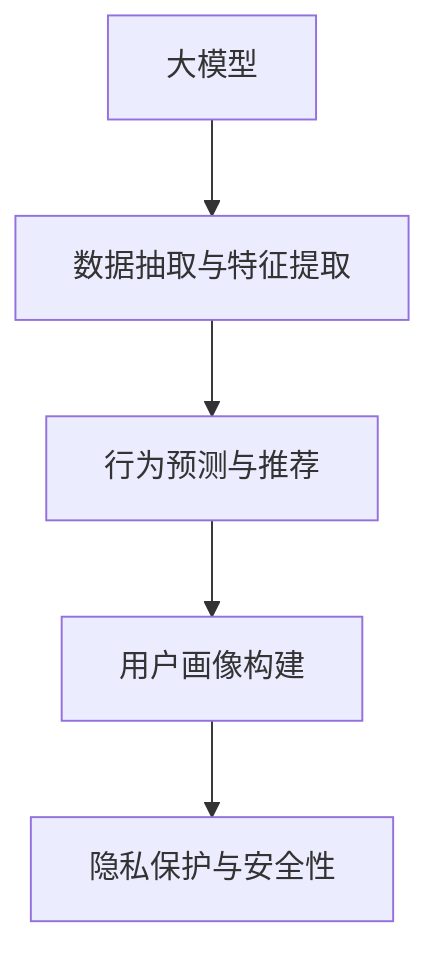

                 

# 大模型推理能力在用户行为建模中的应用

> 关键词：大模型推理、用户行为建模、深度学习、自然语言处理(NLP)、推荐系统、隐私保护

## 1. 背景介绍

### 1.1 问题由来

在当今数字化时代，用户行为建模成为商家和决策者理解用户需求、预测市场趋势、优化产品和服务的重要手段。传统上，用户行为建模依赖于手动设计和编写的规则，难以捕捉复杂多变的用户行为模式，且需要耗费大量人力和时间。随着深度学习技术的发展，大模型推理能力的应用逐渐成为用户行为建模的新方向。

大模型通过预训练学习大规模数据集中的通用语言和结构模式，具有强大的推理和生成能力。将其应用于用户行为建模，可以自动化地抽取用户数据中的关键信息，并生成符合用户实际行为的预测结果。

### 1.2 问题核心关键点

大模型推理在用户行为建模中的应用主要体现在以下几个方面：

1. **数据抽取与特征提取**：大模型可以自动抽取用户行为数据中的关键特征，如点击、浏览、评论、互动等，生成文本描述并识别行为意图。
2. **行为预测与推荐**：基于预训练知识，大模型可以预测用户未来的行为模式，进行个性化推荐或广告投放。
3. **用户画像构建**：通过对用户行为数据的分析，大模型能够构建个性化的用户画像，辅助营销和产品优化。
4. **隐私保护与安全性**：在推理过程中，大模型能够确保用户数据的隐私和安全，避免信息泄露和滥用。

这些关键点凸显了大模型推理能力在用户行为建模中的重要性和潜在价值。

### 1.3 问题研究意义

研究大模型推理能力在用户行为建模中的应用，对于提升用户行为理解的精度、优化推荐系统效果、保护用户隐私等具有重要意义：

1. **提高行为理解精度**：大模型通过深度学习自动抽取和分析用户行为数据，能够捕捉到更精细的行为特征，从而提升用户行为理解的准确性。
2. **优化推荐效果**：通过精确预测用户行为，大模型能够提供更加个性化和精准的推荐内容，提高用户满意度和转化率。
3. **保护用户隐私**：利用差分隐私等技术，大模型可以在推理过程中保护用户数据的隐私，避免数据泄露和滥用。
4. **加速模型开发**：大模型推理能力的引入，可以大幅度减少人工特征工程的工作量，加速推荐系统和用户行为分析模型的开发和部署。

## 2. 核心概念与联系

### 2.1 核心概念概述

为了更好地理解大模型推理能力在用户行为建模中的应用，本节将介绍几个密切相关的核心概念：

- **大模型**：以深度学习为基础的大型神经网络模型，通过在大规模数据集上进行预训练，学习到通用的语言和结构模式。
- **推理**：利用大模型在给定输入下生成合理输出结果的过程，通过前向传播计算实现。
- **行为建模**：使用数据和算法对用户行为进行建模，预测用户未来的行为和需求。
- **推荐系统**：根据用户行为和偏好，推荐个性化内容或产品。
- **隐私保护**：在数据处理和模型推理过程中，确保用户数据的隐私和安全。

这些概念之间的逻辑关系可以通过以下Mermaid流程图来展示：



这个流程图展示了大模型推理能力在用户行为建模中的核心流程：

1. 通过大模型进行数据抽取和特征提取，自动理解用户行为数据。
2. 利用大模型生成的特征进行行为预测和推荐，生成符合用户实际行为的预测结果。
3. 通过用户画像构建，辅助营销和产品优化。
4. 在推理过程中，确保用户数据的隐私和安全。

这些核心概念共同构成了大模型推理能力在用户行为建模中的应用框架，使其能够有效地捕捉和预测用户行为，提升推荐系统和用户行为分析模型的性能。

## 3. 核心算法原理 & 具体操作步骤
### 3.1 算法原理概述

大模型推理能力在用户行为建模中的应用，主要依赖于深度学习技术。其核心思想是：将大模型视作一个强大的"特征提取器"，通过在前向传播中计算输出，提取输入数据的特征，并进行后续的推理和预测。

形式化地，假设大模型为 $M_{\theta}$，其中 $\theta$ 为模型参数。给定用户行为数据 $X$，大模型推理过程包括：

1. 数据预处理：将用户行为数据转换为模型所需的格式，如文本化、归一化等。
2. 特征抽取：通过前向传播计算，大模型生成用户行为特征表示 $Z = M_{\theta}(X)$。
3. 行为预测：基于用户行为特征 $Z$，进行行为预测或推荐。

通常，行为预测可以使用回归模型、分类模型或生成模型，通过不同形式的输出层和损失函数实现。常见的输出层包括全连接层、RNN、Transformer等，损失函数包括均方误差、交叉熵等。

### 3.2 算法步骤详解

基于大模型推理能力在用户行为建模中的应用，以下给出具体的算法步骤：

**Step 1: 数据预处理**

用户行为数据通常以日志、文本等形式存在，需要预处理成大模型所需的格式。预处理过程包括：

1. **文本化**：将行为数据转换为文本格式，便于大模型处理。例如，将浏览记录转化为文本描述。
2. **归一化**：将文本数据进行归一化处理，如分词、去除停用词、标准化等。
3. **特征工程**：根据任务需求，提取和构建特征，如时间戳、点击次数、评分等。

**Step 2: 大模型推理**

在大模型进行推理时，首先需要选择合适的模型和架构，如BERT、GPT等。然后，将预处理后的数据输入模型，进行特征抽取和推理计算：

1. **输入数据**：将文本数据输入大模型，进行前向传播计算。
2. **特征抽取**：大模型输出用户行为特征表示 $Z$，通常为一个向量或张量。
3. **行为预测**：使用 $Z$ 作为输入，进行行为预测或推荐。

**Step 3: 行为预测与推荐**

行为预测通常使用回归模型、分类模型或生成模型，输出用户未来的行为或推荐结果。常见的预测模型包括线性回归、随机森林、深度神经网络等，常见的推荐模型包括协同过滤、内容推荐、深度推荐等。

**Step 4: 用户画像构建**

基于用户行为特征 $Z$，可以构建个性化的用户画像，描述用户的兴趣、需求、行为模式等。用户画像可以用于市场营销、个性化推荐、客户服务等。

**Step 5: 隐私保护与安全性**

在推理过程中，需要确保用户数据的隐私和安全。常见的隐私保护技术包括差分隐私、联邦学习、安全多方计算等，确保用户数据不被泄露和滥用。

### 3.3 算法优缺点

大模型推理能力在用户行为建模中的应用具有以下优点：

1. **自动化特征提取**：大模型能够自动提取用户行为数据中的关键特征，减少人工特征工程的工作量。
2. **高精度预测**：基于预训练知识，大模型可以生成高质量的行为预测和推荐结果，提高用户行为理解的准确性。
3. **泛化能力强**：大模型在处理不同来源、不同类型的数据时，能够保持较好的泛化能力，适应不同的用户行为模式。
4. **应用广泛**：大模型推理可以应用于推荐系统、用户画像构建、个性化营销等多个领域，具有广泛的应用前景。

同时，该方法也存在一定的局限性：

1. **资源消耗高**：大模型的推理需要大量的计算资源，如GPU、TPU等，增加部署成本。
2. **模型复杂度高**：大模型结构复杂，推理过程需要精心设计和优化，存在一定的技术门槛。
3. **隐私风险**：大模型推理依赖于用户数据的输入，存在一定的隐私风险，需要严格的隐私保护措施。

尽管存在这些局限性，但大模型推理能力在用户行为建模中的应用前景依然广阔，值得进一步深入探索。

### 3.4 算法应用领域

大模型推理能力在用户行为建模中已经得到了广泛的应用，涵盖了多个领域，例如：

1. **推荐系统**：利用用户行为数据，生成推荐列表，提高用户满意度和转化率。
2. **广告投放**：基于用户行为特征，精准投放广告，优化广告投放策略。
3. **营销分析**：通过用户画像，进行市场分析和用户细分，优化营销策略。
4. **内容生成**：基于用户行为数据，生成符合用户兴趣的内容，丰富用户体验。
5. **客户服务**：通过用户行为分析，提供个性化的客户服务，提升用户满意度。

除了这些经典应用外，大模型推理还创新性地应用于更多场景中，如情感分析、行为预测、行为解释等，为用户行为建模带来了新的突破。

## 4. 数学模型和公式 & 详细讲解 & 举例说明
### 4.1 数学模型构建

假设大模型为 $M_{\theta}$，用户行为数据为 $X$。基于大模型推理能力在用户行为建模中的应用，可以构建如下数学模型：

1. **输入数据**：将用户行为数据 $X$ 转换为模型所需的格式，记为 $x$。
2. **特征抽取**：通过大模型 $M_{\theta}$，计算用户行为特征表示 $Z$。
3. **行为预测**：基于用户行为特征 $Z$，进行行为预测或推荐，记为 $y$。

数学公式如下：

$$
Z = M_{\theta}(x)
$$

$$
y = F(Z)
$$

其中 $F$ 为行为预测函数，可以是线性回归、分类模型或生成模型。

### 4.2 公式推导过程

以线性回归模型为例，推导行为预测的数学公式：

假设用户行为数据 $X = \{x_1, x_2, \ldots, x_n\}$，大模型生成的特征表示为 $Z = \{z_1, z_2, \ldots, z_n\}$。行为预测模型 $y = \hat{y}(X)$ 可以表示为：

$$
\hat{y} = WZ + b
$$

其中 $W$ 为权重矩阵，$b$ 为偏置向量。通过最小化预测误差，可以求解 $W$ 和 $b$ 的优化问题：

$$
\min_{W, b} \sum_{i=1}^n (\hat{y}_i - y_i)^2
$$

使用梯度下降等优化算法，求解上述最小化问题，得到最优的权重 $W$ 和偏置 $b$。

### 4.3 案例分析与讲解

以电商平台的个性化推荐为例，分析大模型推理能力的应用：

1. **数据预处理**：收集用户的浏览、点击、购买记录等行为数据，转化为文本格式。
2. **特征抽取**：使用BERT模型对文本数据进行预处理，生成用户行为特征表示 $Z$。
3. **行为预测**：基于用户行为特征 $Z$，使用线性回归模型预测用户未来的购买行为，生成推荐列表。
4. **用户画像构建**：根据用户的购买行为，构建个性化的用户画像，辅助营销和产品优化。

通过大模型推理能力，电商平台能够自动抽取和分析用户行为数据，生成高质量的推荐结果，提升用户满意度和转化率。

## 5. 项目实践：代码实例和详细解释说明
### 5.1 开发环境搭建

在进行用户行为建模的实践时，需要准备好开发环境。以下是使用Python进行PyTorch开发的环境配置流程：

1. 安装Anaconda：从官网下载并安装Anaconda，用于创建独立的Python环境。

2. 创建并激活虚拟环境：
```bash
conda create -n pytorch-env python=3.8 
conda activate pytorch-env
```

3. 安装PyTorch：根据CUDA版本，从官网获取对应的安装命令。例如：
```bash
conda install pytorch torchvision torchaudio cudatoolkit=11.1 -c pytorch -c conda-forge
```

4. 安装各类工具包：
```bash
pip install numpy pandas scikit-learn matplotlib tqdm jupyter notebook ipython
```

完成上述步骤后，即可在`pytorch-env`环境中开始用户行为建模的实践。

### 5.2 源代码详细实现

以下以电商平台个性化推荐为例，给出使用PyTorch进行大模型推理的代码实现。

首先，定义行为预测的损失函数和优化器：

```python
from torch import nn
import torch.nn.functional as F
import torch.optim as optim

# 定义行为预测模型
class BehaviorPredictor(nn.Module):
    def __init__(self, input_dim, output_dim):
        super(BehaviorPredictor, self).__init__()
        self.fc = nn.Linear(input_dim, output_dim)
        self.output_layer = nn.Sigmoid()

    def forward(self, x):
        x = self.fc(x)
        x = self.output_layer(x)
        return x

# 定义损失函数
def loss_function(y_pred, y_true):
    return nn.BCELoss()(y_pred, y_true)

# 定义优化器
optimizer = optim.Adam(model.parameters(), lr=0.001)
```

然后，加载预训练的BERT模型，并定义特征抽取函数：

```python
from transformers import BertTokenizer, BertModel

# 加载BERT模型和分词器
tokenizer = BertTokenizer.from_pretrained('bert-base-cased')
model = BertModel.from_pretrained('bert-base-cased')

# 定义特征抽取函数
def get_features(text):
    inputs = tokenizer.encode(text, return_tensors='pt')
    outputs = model(inputs)
    features = outputs['last_hidden_state']
    return features
```

接着，定义行为预测模型的训练和评估函数：

```python
# 定义训练函数
def train(model, train_data, optimizer, batch_size, num_epochs):
    for epoch in range(num_epochs):
        for i, (text, label) in enumerate(train_data):
            # 获取特征表示
            features = get_features(text)
            features = features[:, 0, :]  # 取第一个时间步的特征

            # 前向传播计算预测结果
            y_pred = model(features)

            # 计算损失函数
            loss = loss_function(y_pred, label)

            # 反向传播更新模型参数
            optimizer.zero_grad()
            loss.backward()
            optimizer.step()

            # 输出训练进度
            if i % 100 == 0:
                print(f'Epoch {epoch+1}/{num_epochs}, Batch {i}, Loss: {loss.item()}')

# 定义评估函数
def evaluate(model, test_data):
    total_loss = 0
    for i, (text, label) in enumerate(test_data):
        # 获取特征表示
        features = get_features(text)
        features = features[:, 0, :]  # 取第一个时间步的特征

        # 前向传播计算预测结果
        y_pred = model(features)

        # 计算损失函数
        loss = loss_function(y_pred, label)

        # 累加损失
        total_loss += loss.item()

    # 计算平均损失
    return total_loss / len(test_data)
```

最后，启动模型训练和评估流程：

```python
# 准备训练和测试数据
train_texts = # 电商平台的浏览记录
train_labels = # 浏览记录对应的购买行为
test_texts = # 电商平台的测试数据
test_labels = # 测试数据的购买行为

# 构建数据集
train_data = Dataset(train_texts, train_labels)
test_data = Dataset(test_texts, test_labels)

# 实例化模型
model = BehaviorPredictor(input_dim=768, output_dim=1)

# 训练模型
train(model, train_data, optimizer, batch_size=32, num_epochs=10)

# 评估模型
print(f'Test Loss: {evaluate(model, test_data)}')
```

以上就是使用PyTorch对电商平台个性化推荐进行大模型推理的完整代码实现。可以看到，通过引入BERT模型作为特征抽取器，能够有效地捕捉用户行为数据中的关键信息，生成高质量的行为预测结果。

### 5.3 代码解读与分析

让我们再详细解读一下关键代码的实现细节：

**BehaviorPredictor类**：
- `__init__`方法：初始化全连接层和输出层。
- `forward`方法：进行前向传播计算，输出预测结果。

**train函数**：
- 定义训练循环，遍历数据集中的每个批次。
- 获取特征表示，进行前向传播计算，计算损失函数。
- 反向传播更新模型参数，输出训练进度。

**evaluate函数**：
- 定义评估循环，遍历测试数据集。
- 获取特征表示，进行前向传播计算，计算损失函数。
- 累加损失，计算平均损失。

**行为预测模型**：
- 使用线性回归模型作为行为预测模型，输入为BERT生成的特征表示。
- 使用Sigmoid作为输出层，生成0到1之间的预测结果。

在实际应用中，还需要根据具体任务对模型结构进行优化，如添加Dropout、正则化等，以提升模型性能和泛化能力。

## 6. 实际应用场景
### 6.1 电商平台个性化推荐

电商平台利用大模型推理能力，可以自动分析用户浏览、点击、购买行为，生成个性化推荐列表。通过精确预测用户未来行为，电商平台能够提升用户满意度和转化率，增加销售额。

在技术实现上，可以收集用户的浏览记录、购买记录等行为数据，转化为文本格式，利用BERT模型进行特征抽取。然后，通过线性回归模型进行行为预测，生成推荐列表。

### 6.2 金融风险管理

金融行业需要实时监控用户交易行为，预测可能的欺诈或风险事件。大模型推理能力可以通过分析用户的交易数据，生成行为预测结果，辅助风险管理。

在金融领域，可以将用户的交易记录作为输入数据，利用大模型进行特征抽取和推理计算。然后，基于行为预测结果，进行风险评估和预警。

### 6.3 医疗健康管理

医疗机构需要实时监控患者的健康数据，预测疾病风险和行为倾向。通过大模型推理能力，可以自动分析患者的病历记录、行为数据等，生成行为预测结果，辅助医生进行诊断和治疗。

在医疗领域，可以将患者的病历记录、治疗效果等数据作为输入，利用BERT模型进行特征抽取。然后，通过回归模型或分类模型进行行为预测，生成健康风险评估结果。

### 6.4 未来应用展望

随着大模型推理能力的不断进步，其在用户行为建模中的应用将进一步拓展，为各个行业带来新的突破。

在智能制造领域，通过分析设备运行数据，大模型推理可以预测设备故障和维护需求，提升生产效率和设备利用率。

在智慧农业领域，通过分析农作物的生长数据，大模型推理可以预测农作物生长趋势，优化种植方案。

在教育领域，通过分析学生的学习数据，大模型推理可以预测学生的学习效果，个性化推荐学习资源。

总之，大模型推理能力将在各个领域中发挥越来越重要的作用，为各行各业带来新的变革和机遇。

## 7. 工具和资源推荐
### 7.1 学习资源推荐

为了帮助开发者系统掌握大模型推理在用户行为建模中的应用，这里推荐一些优质的学习资源：

1. 《深度学习》系列书籍：如Ian Goodfellow等所著，系统介绍了深度学习的基本概念和算法。
2. 《Natural Language Processing with Python》书籍：Steven Bird等所著，介绍了NLP技术的实现方法和应用案例。
3. 《TensorFlow官方文档》：Google开发的深度学习框架，提供了丰富的API和样例代码。
4. 《PyTorch官方文档》：Facebook开发的深度学习框架，具有高效易用的计算图和丰富的功能库。
5. Kaggle平台：数据科学竞赛平台，提供了大量NLP和推荐系统竞赛数据集，可以锻炼实战能力。

通过对这些资源的学习实践，相信你一定能够快速掌握大模型推理在用户行为建模中的应用，并用于解决实际的NLP问题。

### 7.2 开发工具推荐

高效的开发离不开优秀的工具支持。以下是几款用于大模型推理开发的常用工具：

1. PyTorch：基于Python的开源深度学习框架，灵活动态的计算图，适合快速迭代研究。
2. TensorFlow：由Google主导开发的开源深度学习框架，生产部署方便，适合大规模工程应用。
3. Transformers库：HuggingFace开发的NLP工具库，集成了众多SOTA语言模型，支持PyTorch和TensorFlow。
4. Weights & Biases：模型训练的实验跟踪工具，可以记录和可视化模型训练过程中的各项指标，方便对比和调优。
5. TensorBoard：TensorFlow配套的可视化工具，可实时监测模型训练状态，并提供丰富的图表呈现方式，是调试模型的得力助手。

合理利用这些工具，可以显著提升大模型推理的开发效率，加快创新迭代的步伐。

### 7.3 相关论文推荐

大模型推理在用户行为建模中的应用源于学界的持续研究。以下是几篇奠基性的相关论文，推荐阅读：

1. Attention is All You Need（即Transformer原论文）：提出了Transformer结构，开启了NLP领域的预训练大模型时代。
2. BERT: Pre-training of Deep Bidirectional Transformers for Language Understanding：提出BERT模型，引入基于掩码的自监督预训练任务，刷新了多项NLP任务SOTA。
3. Reformer: The Efficient Transformer：提出了Reformer模型，解决了Transformer在处理长序列时计算资源消耗大的问题，提升了推理效率。
4. The Annotated Transformers：由HuggingFace官方出版的模型解析书籍，详细介绍了各种预训练语言模型的实现方法和应用场景。
5. Deep Multi-Task Learning for NLP：提出了多任务学习框架，可以在一个模型中同时学习多个NLP任务，提高模型泛化能力和应用效率。

这些论文代表了大模型推理在用户行为建模中的发展脉络。通过学习这些前沿成果，可以帮助研究者把握学科前进方向，激发更多的创新灵感。

## 8. 总结：未来发展趋势与挑战

### 8.1 总结

本文对大模型推理能力在用户行为建模中的应用进行了全面系统的介绍。首先阐述了大模型推理能力和用户行为建模的研究背景和意义，明确了推理在提升行为理解精度、优化推荐系统效果等方面的独特价值。其次，从原理到实践，详细讲解了大模型推理的数学模型和关键步骤，给出了用户行为建模的完整代码实例。同时，本文还广泛探讨了推理能力在电商平台、金融、医疗等多个领域的应用前景，展示了推理范式的巨大潜力。此外，本文精选了推理技术的各类学习资源，力求为读者提供全方位的技术指引。

通过本文的系统梳理，可以看到，大模型推理能力在用户行为建模中的应用前景广阔，技术优势显著。大模型推理的引入，可以自动抽取和分析用户行为数据，生成高质量的行为预测结果，显著提升推荐系统和用户行为分析模型的性能。随着大模型推理技术的不断进步，其在用户行为建模中的应用将不断拓展，为各行各业带来新的变革和机遇。

### 8.2 未来发展趋势

展望未来，大模型推理技术将呈现以下几个发展趋势：

1. **模型结构更加复杂**：未来的大模型将包含更多层和参数，推理效率将进一步提升，具备更强大的预测能力和泛化能力。
2. **推理加速技术发展**：通过模型压缩、模型并行、混合精度训练等技术，大模型推理将具备更高的计算效率和更低的资源消耗。
3. **多模态融合更加深入**：未来的大模型将不仅处理文本数据，还能同时处理图像、视频、语音等多模态数据，实现更全面、深入的用户行为建模。
4. **隐私保护技术更加成熟**：差分隐私、联邦学习、安全多方计算等隐私保护技术将进一步发展和完善，确保大模型推理过程中的数据安全和隐私保护。
5. **自动化特征提取更加智能**：未来的大模型将通过更加智能的特征提取方法，自动捕捉用户行为数据中的关键信息，提升特征表示的质量和稳定性。

这些趋势凸显了大模型推理技术在用户行为建模中的广阔前景。这些方向的探索发展，必将进一步提升推理模型的性能和应用范围，为人工智能技术在垂直行业的落地提供更强大的支持。

### 8.3 面临的挑战

尽管大模型推理能力在用户行为建模中的应用前景广阔，但在实际落地过程中，仍面临诸多挑战：

1. **数据质量**：大模型的推理效果依赖于高质量的数据输入。数据预处理不当、数据标注不精准等，都会影响模型性能。
2. **模型复杂度**：大模型推理模型的复杂度较高，需要较强的计算资源和算力支持，存在一定的技术门槛。
3. **隐私风险**：大模型推理依赖于用户数据的输入，存在一定的隐私风险。如何确保数据安全和隐私保护，是亟待解决的问题。
4. **实时性要求**：某些应用场景下，如金融交易、医疗诊断等，对模型的实时性要求较高。如何在保证推理精度的同时，提高计算速度和响应时间，也是一大挑战。

尽管存在这些挑战，但通过技术创新和实践探索，相信大模型推理能力在用户行为建模中的应用将不断突破瓶颈，迈向更加成熟和高效的阶段。

### 8.4 研究展望

面对大模型推理所面临的种种挑战，未来的研究需要在以下几个方面寻求新的突破：

1. **数据增强与迁移学习**：通过数据增强和迁移学习技术，提升模型的泛化能力和数据利用效率。
2. **高效推理加速**：开发高效推理加速技术，如模型压缩、混合精度训练、模型并行等，提高模型的计算效率和实时性。
3. **隐私保护与安全性**：引入差分隐私、联邦学习等隐私保护技术，确保用户数据的隐私和安全。
4. **多模态数据融合**：开发多模态数据融合技术，实现文本、图像、语音等多种数据源的协同建模，提升推理模型的性能。
5. **可解释性与透明性**：提高模型的可解释性和透明性，使推理过程更具可信度，便于用户理解和信任。

这些研究方向将引领大模型推理技术迈向更高的台阶，为构建安全、可靠、可解释、可控的智能系统铺平道路。面向未来，大模型推理技术还需要与其他人工智能技术进行更深入的融合，如知识表示、因果推理、强化学习等，多路径协同发力，共同推动自然语言理解和智能交互系统的进步。只有勇于创新、敢于突破，才能不断拓展语言模型的边界，让智能技术更好地造福人类社会。

## 9. 附录：常见问题与解答

**Q1：大模型推理是否适用于所有NLP任务？**

A: 大模型推理在大多数NLP任务上都能取得不错的效果，特别是对于数据量较小的任务。但对于一些特定领域的任务，如医学、法律等，仅仅依靠通用语料预训练的模型可能难以很好地适应。此时需要在特定领域语料上进一步预训练，再进行推理，才能获得理想效果。此外，对于一些需要时效性、个性化很强的任务，如对话、推荐等，推理方法也需要针对性的改进优化。

**Q2：如何提高大模型推理的实时性？**

A: 提高大模型推理的实时性，主要从两个方面进行优化：

1. **模型压缩与剪枝**：通过模型压缩和剪枝技术，减小模型尺寸，降低计算资源消耗。例如，可以使用知识蒸馏等方法，将大模型压缩为轻量级模型。
2. **推理加速技术**：引入推理加速技术，如模型并行、混合精度训练、模型量化等，提高计算速度和响应时间。例如，可以使用TensorRT等推理引擎，优化计算图和内存管理。

**Q3：大模型推理在用户行为建模中需要注意哪些问题？**

A: 大模型推理在用户行为建模中需要注意以下问题：

1. **数据预处理**：确保输入数据的质量和一致性，避免数据标注不精准、数据预处理不当等问题。
2. **模型结构选择**：根据任务需求选择合适的模型结构和参数，避免模型过于复杂或过于简单。
3. **隐私保护**：在推理过程中，确保用户数据的隐私和安全，避免信息泄露和滥用。
4. **实时性要求**：对于需要实时响应和高并发的应用场景，需要优化推理模型的计算效率和响应时间。
5. **可解释性与透明性**：提高推理模型的可解释性和透明性，使推理过程更具可信度，便于用户理解和信任。

这些问题的处理将直接影响大模型推理在用户行为建模中的性能和效果。

**Q4：大模型推理是否会引入新的偏见和有害信息？**

A: 大模型推理过程中，由于输入数据的质量和模型训练方式的不同，可能会引入新的偏见和有害信息。为避免这种情况，可以采取以下措施：

1. **数据多样性**：确保输入数据的多样性和覆盖面，避免数据偏差和数据噪声。
2. **公平性约束**：在模型训练过程中，引入公平性约束，确保模型对不同群体的预测结果一致。
3. **隐私保护**：在推理过程中，确保用户数据的隐私和安全，避免信息泄露和滥用。
4. **监督与反馈**：引入人工监督和用户反馈机制，及时发现和修正模型中的偏见和有害信息。

这些措施将有助于提高大模型推理的公正性和安全性，确保其在用户行为建模中的健康发展。

---

作者：禅与计算机程序设计艺术 / Zen and the Art of Computer Programming

