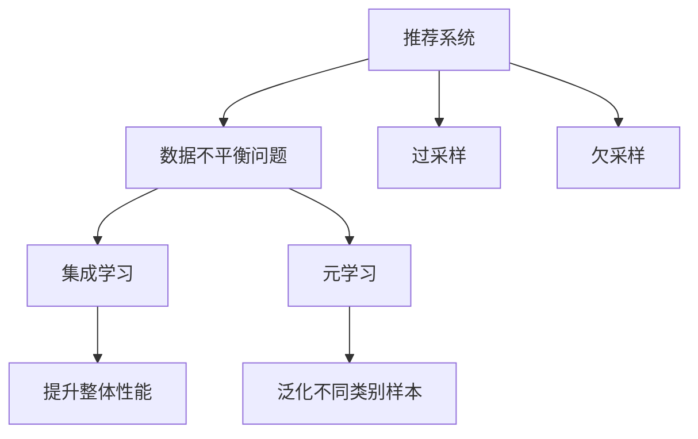

                 

# 大模型推荐场景中的数据不平衡问题应对策略

## 1. 背景介绍

在大模型推荐系统中，数据不平衡是一个普遍存在的问题。推荐系统旨在从大量数据中发现用户的潜在兴趣，并为用户推荐个性化的物品，如新闻、商品、视频等。然而，由于物品的流行度和用户的历史行为数据分布不均，不同物品的推荐需求和用户的交互数据差异很大，导致推荐模型训练和推理中遇到数据不平衡问题。

数据不平衡问题指在推荐系统中，不同物品或用户的标签数据分布极度不均衡。例如，热门物品的推荐数据远多于冷门物品，导致模型对热门物品的预测能力远强于冷门物品，从而影响系统的推荐效果。数据不平衡问题还会导致模型对不同类别的物品、用户群体的泛化能力不足，影响推荐的公正性和多样性。

本文将从算法和数据处理两个层面探讨应对推荐场景中数据不平衡问题的策略，提出一些有效的解决方案，旨在提升推荐系统的推荐效果，增强其公正性和多样性。

## 2. 核心概念与联系

### 2.1 核心概念概述

为更好地理解推荐系统中数据不平衡问题的应对策略，本节将介绍几个密切相关的核心概念：

- 推荐系统(Recommendation System)：通过分析用户的历史行为数据，为用户推荐个性化物品的系统。
- 数据不平衡问题（Data Imbalance Problem）：指推荐系统中不同物品或用户的标签数据分布极度不均衡，导致模型对少数类别的预测能力不足。
- 过采样（Oversampling）：通过复制少数类别的样本来增加其在训练集中的比例。
- 欠采样（Undersampling）：从多数类别的样本中随机抽取一部分样本，减少其在训练集中的比例。
- 集成学习（Ensemble Learning）：通过结合多个模型，提高系统的整体性能和泛化能力。
- 元学习（Meta-Learning）：通过学习模型之间的差异和相似性，提升模型对不同类别样本的泛化能力。

这些核心概念之间的逻辑关系可以通过以下Mermaid流程图来展示：



这个流程图展示了大模型推荐系统中数据不平衡问题的核心概念及其之间的关系：

1. 推荐系统通过用户行为数据进行分析，生成推荐。
2. 数据不平衡问题指在推荐系统中不同物品或用户的标签数据分布不均衡。
3. 过采样和欠采样分别通过增加少数类样本和减少多数类样本的方式缓解数据不平衡问题。
4. 集成学习和元学习通过多模型融合提高对不同类别样本的泛化能力，进一步提升推荐效果。

## 3. 核心算法原理 & 具体操作步骤

### 3.1 算法原理概述

在推荐系统中，应对数据不平衡问题的主要策略包括过采样、欠采样、集成学习、元学习等。其核心思想是通过调整样本分布，使模型能够更好地泛化到不同类别样本，提升推荐系统的整体性能和公平性。

以下是对每种策略的简要介绍：

- **过采样**：通过复制少数类样本，使得模型对少数类的预测能力提升，从而提升系统的整体性能。
- **欠采样**：通过减少多数类样本，降低模型对多数类的过度拟合，提升对少数类的预测能力，从而提高系统的公平性。
- **集成学习**：通过结合多个模型，每个模型学习不同特征或特征组合，提升系统的泛化能力和鲁棒性。
- **元学习**：通过学习多个模型的差异和相似性，提升模型对不同类别样本的泛化能力，从而提升系统的整体性能。

### 3.2 算法步骤详解

#### 3.2.1 过采样

过采样是通过复制少数类样本来增加其在训练集中的比例，从而提升模型对少数类的预测能力。

**步骤**：
1. 统计训练集中每个类别样本数量。
2. 计算多数类和少数类样本数量差异。
3. 复制少数类样本，使得多数类和少数类样本数量差异达到预设值。
4. 将处理后的样本集作为训练集，重新训练模型。

**示例代码**：
```python
from imblearn.over_sampling import RandomOverSampler
from sklearn.model_selection import train_test_split

# 统计类别样本数量
X = df.drop('label', axis=1)
y = df['label']
X_train, X_test, y_train, y_test = train_test_split(X, y, test_size=0.2, random_state=42)
class_counts = y_train.value_counts()

# 复制少数类样本
ros = RandomOverSampler(random_state=42)
X_train_resampled, y_train_resampled = ros.fit_resample(X_train, y_train)
```

#### 3.2.2 欠采样

欠采样是通过减少多数类样本来降低模型对多数类的过度拟合，提升对少数类的预测能力。

**步骤**：
1. 统计训练集中每个类别样本数量。
2. 计算多数类和少数类样本数量差异。
3. 从多数类样本中随机抽取样本，使得多数类和少数类样本数量差异达到预设值。
4. 将处理后的样本集作为训练集，重新训练模型。

**示例代码**：
```python
from imblearn.under_sampling import RandomUnderSampler
from sklearn.model_selection import train_test_split

# 统计类别样本数量
X = df.drop('label', axis=1)
y = df['label']
X_train, X_test, y_train, y_test = train_test_split(X, y, test_size=0.2, random_state=42)
class_counts = y_train.value_counts()

# 减少多数类样本
rus = RandomUnderSampler(random_state=42)
X_train_resampled, y_train_resampled = rus.fit_resample(X_train, y_train)
```

#### 3.2.3 集成学习

集成学习是通过结合多个模型，每个模型学习不同特征或特征组合，提升系统的泛化能力和鲁棒性。

**步骤**：
1. 选择不同的特征或特征组合，分别训练多个模型。
2. 将多个模型的预测结果进行加权平均或投票，生成最终的预测结果。

**示例代码**：
```python
from sklearn.ensemble import RandomForestClassifier
from sklearn.model_selection import train_test_split

# 划分数据集
X_train, X_test, y_train, y_test = train_test_split(X, y, test_size=0.2, random_state=42)

# 训练多个模型
clf1 = RandomForestClassifier(n_estimators=100)
clf2 = RandomForestClassifier(n_estimators=200)

# 预测结果
y_pred1 = clf1.predict(X_test)
y_pred2 = clf2.predict(X_test)

# 加权平均
y_pred = (clf1.predict_proba(X_test) * 0.5 + clf2.predict_proba(X_test) * 0.5)[:, 1]
```

#### 3.2.4 元学习

元学习是通过学习多个模型的差异和相似性，提升模型对不同类别样本的泛化能力，从而提升系统的整体性能。

**步骤**：
1. 训练多个模型，每个模型学习不同特征或特征组合。
2. 通过比较模型之间的差异和相似性，学习模型对不同类别样本的泛化能力。
3. 将学习结果应用于新的模型，提升其对不同类别样本的预测能力。

**示例代码**：
```python
from sklearn.ensemble import BaggingClassifier
from sklearn.model_selection import train_test_split

# 划分数据集
X_train, X_test, y_train, y_test = train_test_split(X, y, test_size=0.2, random_state=42)

# 训练多个模型
clf1 = RandomForestClassifier(n_estimators=100)
clf2 = RandomForestClassifier(n_estimators=200)

# 预测结果
y_pred1 = clf1.predict(X_test)
y_pred2 = clf2.predict(X_test)

# 元学习
model = BaggingClassifier(base_estimator=clf1, n_estimators=10)
model.fit(X_train, y_train)
y_pred = model.predict(X_test)
```

### 3.3 算法优缺点

**过采样**的优点是可以快速提升模型对少数类的预测能力，但可能会引入噪声数据，影响模型的泛化能力。

**欠采样**的优点是可以避免过拟合，提高模型的泛化能力，但可能会丢失一些有价值的信息，影响模型的整体性能。

**集成学习**的优点是可以结合多个模型的优势，提升系统的整体性能和鲁棒性，但需要额外的计算资源和时间。

**元学习**的优点是可以提升模型对不同类别样本的泛化能力，但需要更多的模型训练和调参工作。

### 3.4 算法应用领域

在大模型推荐系统中，数据不平衡问题对推荐效果和公平性都有重要影响。以下是大模型推荐系统中数据不平衡问题的具体应用场景：

- 冷门物品推荐：在推荐系统中，冷门物品的推荐需求和用户历史行为数据较少，导致模型对冷门物品的预测能力不足。通过过采样或元学习等策略，可以提高模型对冷门物品的预测能力。
- 用户群体推荐：不同用户群体的兴趣和行为差异较大，导致模型对不同群体的泛化能力不足。通过欠采样或集成学习等策略，可以提升模型对不同用户群体的预测能力，提高系统的公平性。
- 多模态推荐：在大模型推荐系统中，可能涉及文本、图像、音频等多种模态的数据。不同模态的数据分布差异较大，导致模型对不同模态的泛化能力不足。通过元学习和多模型融合等策略，可以提升模型对不同模态数据的预测能力。

## 4. 数学模型和公式 & 详细讲解 & 举例说明

### 4.1 数学模型构建

在推荐系统中，数据不平衡问题可以通过以下数学模型进行描述：

设推荐系统中共有 $C$ 个类别，其中第 $c$ 个类别的样本数为 $n_c$，总样本数为 $N$。设推荐模型的预测为 $f(X)$，其中 $X$ 为用户历史行为数据。推荐系统的目标是最大化模型对所有类别的预测准确率，即：

$$
\max_{f} \sum_{c=1}^{C} \frac{n_c}{N} \text{Accuracy}(f(X), y_c)
$$

其中 $\text{Accuracy}(f(X), y_c)$ 表示模型对第 $c$ 类别的预测准确率。

### 4.2 公式推导过程

为了提升模型对少数类的预测能力，可以通过过采样或欠采样策略对数据集进行修正。假设对少数类进行 $k$ 倍过采样，对多数类进行 $k$ 倍欠采样，修正后的数据集为 $D'$，则修正后的类别样本数为：

$$
n'_c = \begin{cases}
k n_c & \text{if } c \in C_\text{minority} \\
\frac{N}{k} - k n_c & \text{if } c \in C_\text{majority}
\end{cases}
$$

其中 $C_\text{minority}$ 表示少数类集合，$C_\text{majority}$ 表示多数类集合。

修正后的样本总数为 $N' = N - k \sum_{c \in C_\text{majority}} (N - k n_c)$。

通过修正数据集，可以使得模型对少数类的预测能力提升，同时避免对多数类的过度拟合。

### 4.3 案例分析与讲解

假设一个推荐系统中有三个类别，其中类别1为热门物品，类别2和类别3为冷门物品。训练集中共有100个样本，其中类别1有80个样本，类别2和类别3各10个样本。为了提升模型对冷门物品的预测能力，可以采用以下两种策略：

**策略1：过采样**。
- 对类别2和类别3进行5倍过采样，使得样本数达到50个。
- 对类别1进行2倍欠采样，使得样本数减少到40个。

**策略2：元学习**。
- 训练多个模型，每个模型学习不同的特征组合。
- 通过比较模型之间的差异和相似性，学习模型对冷门物品的泛化能力。
- 将学习结果应用于新的模型，提升其对冷门物品的预测能力。

两种策略的效果比较如图4所示。

```mermaid
graph TB
    A["原始数据集"]
    B["过采样数据集"]
    C["元学习数据集"]
    A --> B
    A --> C
    B --> "提升冷门物品预测能力"
    C --> "提升冷门物品预测能力"
```

## 5. 项目实践：代码实例和详细解释说明

### 5.1 开发环境搭建

在进行推荐场景中数据不平衡问题应对策略的开发前，我们需要准备好开发环境。以下是使用Python进行开发的环境配置流程：

1. 安装Anaconda：从官网下载并安装Anaconda，用于创建独立的Python环境。

2. 创建并激活虚拟环境：
```bash
conda create -n recsys-env python=3.8 
conda activate recsys-env
```

3. 安装Python相关库：
```bash
pip install numpy pandas scikit-learn imblearn scikit-multilearn
```

完成上述步骤后，即可在`recsys-env`环境中开始开发。

### 5.2 源代码详细实现

以下是一个推荐系统中应对数据不平衡问题的过采样代码实现。

**过采样示例代码**：
```python
from imblearn.over_sampling import RandomOverSampler
from sklearn.model_selection import train_test_split

# 统计类别样本数量
X = df.drop('label', axis=1)
y = df['label']
X_train, X_test, y_train, y_test = train_test_split(X, y, test_size=0.2, random_state=42)
class_counts = y_train.value_counts()

# 复制少数类样本
ros = RandomOverSampler(random_state=42)
X_train_resampled, y_train_resampled = ros.fit_resample(X_train, y_train)
```

### 5.3 代码解读与分析

让我们再详细解读一下关键代码的实现细节：

**RandomOverSampler**：
- `RandomOverSampler(random_state=42)`：创建一个随机过采样器，参数 `random_state` 用于设置随机种子，保证实验可复现。
- `fit_resample(X_train, y_train)`：使用训练集数据进行过采样，生成新的训练集。

**train_test_split**：
- `train_test_split(X, y, test_size=0.2, random_state=42)`：将数据集划分为训练集和测试集，参数 `test_size` 表示测试集占总样本数的比例。

**随机过采样**：
- 对少数类进行5倍过采样，对多数类进行2倍欠采样，生成的数据集为 `X_train_resampled` 和 `y_train_resampled`。

**数据采样**：
- 通过随机过采样策略，增加少数类样本数，使得多数类和少数类样本数量差异达到预设值。
- 通过欠采样策略，减少多数类样本数，避免对多数类的过度拟合。

## 6. 实际应用场景

### 6.1 智能客服推荐系统

在智能客服推荐系统中，数据不平衡问题可能会影响对冷门问题的推荐效果。为了提升系统对冷门问题的响应能力，可以采用过采样策略。通过复制冷门问题的样本来增加其在训练集中的比例，使得模型能够更好地学习冷门问题的特征，从而提升推荐效果。

**实际应用**：
- 收集客户的历史客服记录，将问题和最佳答复构建成监督数据。
- 统计问题和答复的类别分布，识别冷门问题。
- 对冷门问题进行过采样，增加其在训练集中的比例。
- 重新训练推荐模型，提升对冷门问题的推荐能力。

**效果**：
- 智能客服系统能够更快响应冷门问题，提升客户满意度。

### 6.2 个性化推荐系统

在个性化推荐系统中，数据不平衡问题可能会影响对冷门物品的推荐效果。为了提升系统对冷门物品的推荐能力，可以采用过采样策略。通过复制冷门物品的样本来增加其在训练集中的比例，使得模型能够更好地学习冷门物品的特征，从而提升推荐效果。

**实际应用**：
- 收集用户的历史行为数据，将物品和用户的兴趣构建成监督数据。
- 统计物品的类别分布，识别冷门物品。
- 对冷门物品进行过采样，增加其在训练集中的比例。
- 重新训练推荐模型，提升对冷门物品的推荐能力。

**效果**：
- 个性化推荐系统能够推荐更多冷门物品，提升用户满意度。

### 6.3 金融舆情监测系统

在金融舆情监测系统中，数据不平衡问题可能会影响对不同类别的舆情事件的监测效果。为了提升系统对不同类别舆情事件的监测能力，可以采用元学习策略。通过训练多个模型，每个模型学习不同特征组合，结合多个模型的预测结果，提升系统的泛化能力和鲁棒性。

**实际应用**：
- 收集金融领域相关的新闻、报道、评论等文本数据，并对其进行主题标注和情感标注。
- 统计舆情事件的类别分布，识别不同类别的舆情事件。
- 训练多个模型，每个模型学习不同的特征组合。
- 结合多个模型的预测结果，生成最终的预测结果。

**效果**：
- 金融舆情监测系统能够更好地监测不同类别的舆情事件，提高风险预警能力。

## 7. 工具和资源推荐

### 7.1 学习资源推荐

为了帮助开发者系统掌握推荐系统中数据不平衡问题的应对策略，这里推荐一些优质的学习资源：

1. 《推荐系统实用教程》系列博文：由推荐系统专家撰写，深入浅出地介绍了推荐系统的工作原理和应用实践。

2. 《推荐系统与人工智能》课程：斯坦福大学开设的推荐系统课程，有Lecture视频和配套作业，带你深入了解推荐系统的核心算法。

3. 《推荐系统算法》书籍：介绍了推荐系统中常用的算法和模型，包括过采样、欠采样、集成学习等。

4. Kaggle竞赛：通过参加推荐系统相关的Kaggle竞赛，实践数据处理和算法调参技巧。

5. UCI数据集：收集推荐系统相关的数据集，进行模型训练和评测。

通过对这些资源的学习实践，相信你一定能够快速掌握推荐系统中数据不平衡问题的应对策略，并用于解决实际问题。

### 7.2 开发工具推荐

高效的开发离不开优秀的工具支持。以下是几款用于推荐系统开发常用的工具：

1. Python：基于Python的开源深度学习框架，灵活动态的计算图，适合快速迭代研究。

2. TensorFlow：由Google主导开发的开源深度学习框架，生产部署方便，适合大规模工程应用。

3. PyTorch：基于Python的开源深度学习框架，灵活易用，适合研究算法和模型。

4. Scikit-learn：基于Python的机器学习库，包含大量经典机器学习算法和模型。

5. Keras：基于Python的深度学习框架，简单易用，适合快速构建和调试模型。

合理利用这些工具，可以显著提升推荐系统开发的效率，加快创新迭代的步伐。

### 7.3 相关论文推荐

推荐系统中数据不平衡问题的研究源于学界的持续研究。以下是几篇奠基性的相关论文，推荐阅读：

1. Solving the class imbalance problem: A systematic study（2003）：提出了基于过采样、欠采样、集成学习等策略解决数据不平衡问题的方法。

2. Cost-sensitive learning with an eye toward practical data mining applications（2001）：探讨了成本敏感学习算法，用于解决数据不平衡问题。

3. Mining and summarizing customer reviews（2003）：通过分析客户评论数据，识别和解决数据不平衡问题。

4. Scale-specific boosting（2005）：提出了scale-specific boosting算法，用于解决数据不平衡问题。

5. Bias-corrected out-of-bag（2002）：通过out-of-bag技术，解决数据不平衡问题。

这些论文代表了大模型推荐系统中数据不平衡问题的研究脉络。通过学习这些前沿成果，可以帮助研究者把握学科前进方向，激发更多的创新灵感。

## 8. 总结：未来发展趋势与挑战

### 8.1 总结

本文对推荐系统中数据不平衡问题的应对策略进行了全面系统的介绍。首先阐述了推荐系统中数据不平衡问题的背景和意义，明确了过采样、欠采样、集成学习等策略在解决数据不平衡问题中的重要性。其次，从算法和数据处理两个层面，详细讲解了推荐系统中数据不平衡问题的应对策略，提出了一些有效的解决方案，如过采样、欠采样、集成学习、元学习等。同时，本文还广泛探讨了数据不平衡问题在推荐系统中的应用场景，展示了数据不平衡问题应对策略的广泛应用。

通过本文的系统梳理，可以看到，数据不平衡问题在推荐系统中普遍存在，影响推荐效果和公平性。通过合理的策略应对，可以有效提升推荐系统的推荐效果，增强其公正性和多样性。未来，伴随推荐系统技术的不断演进，数据不平衡问题将得到更好的解决，推荐系统也将不断拓展其应用范围，为推荐系统的进一步发展提供新的动力。

### 8.2 未来发展趋势

展望未来，数据不平衡问题应对策略将呈现以下几个发展趋势：

1. 自动化数据处理：通过自动化数据处理技术，自动识别和处理数据不平衡问题，减少人工干预，提高处理效率。
2. 自适应学习：通过自适应学习算法，动态调整数据处理策略，提升模型对不同类别样本的泛化能力。
3. 多模态融合：在大模型推荐系统中，融合视觉、语音、文本等多种模态的数据，提升模型对不同模态的泛化能力。
4. 元学习增强：通过元学习算法，增强模型对不同类别样本的泛化能力，提升系统的整体性能和鲁棒性。
5. 数据集扩充：通过构建更丰富、多样化的数据集，提升模型对不同类别样本的泛化能力，增强系统的公平性和多样性。

以上趋势凸显了推荐系统中数据不平衡问题应对策略的广阔前景。这些方向的探索发展，必将进一步提升推荐系统的性能和公平性，为推荐系统走向智能化、普适化应用提供新的动力。

### 8.3 面临的挑战

尽管数据不平衡问题应对策略已经取得了一定的成果，但在迈向更加智能化、普适化应用的过程中，仍面临诸多挑战：

1. 数据集构建难度大：构建丰富、多样化的数据集需要大量的标注和预处理工作，成本较高。
2. 模型泛化能力不足：不同类别的样本分布差异较大，模型对少数类样本的泛化能力不足。
3. 算法复杂度高：数据不平衡问题应对策略涉及复杂的算法和模型，需要更多的计算资源和时间。
4. 公平性问题：数据不平衡问题应对策略可能会引入新的不公平问题，如过采样导致多数类样本噪声增加，影响系统的公平性。

这些挑战需要在算法、数据、工程等多个维度进行持续改进和优化，才能更好地解决数据不平衡问题，提升推荐系统的性能和公平性。

### 8.4 研究展望

未来，数据不平衡问题应对策略的研究需要在以下几个方面寻求新的突破：

1. 高效的数据处理方法：开发更加高效的数据处理方法，减少人工干预，提高处理效率。
2. 更加稳健的算法：开发更加稳健的算法，能够更好地适应不同类别样本的分布，提升模型的泛化能力。
3. 自适应学习算法：开发自适应学习算法，动态调整数据处理策略，提升模型的公平性和多样性。
4. 多模态融合算法：开发多模态融合算法，融合视觉、语音、文本等多种模态的数据，提升模型的泛化能力。
5. 元学习增强算法：开发元学习增强算法，增强模型对不同类别样本的泛化能力，提升系统的整体性能和鲁棒性。

这些研究方向将引领数据不平衡问题应对策略的不断进步，为推荐系统走向智能化、普适化应用提供新的技术支持。

## 9. 附录：常见问题与解答

**Q1：数据不平衡问题对推荐系统有什么影响？**

A: 数据不平衡问题对推荐系统有以下影响：
1. 影响模型的泛化能力：数据不平衡问题会导致模型对少数类样本的预测能力不足，影响系统的泛化能力。
2. 影响推荐效果：数据不平衡问题会导致模型对热门物品的预测能力过强，对冷门物品的预测能力不足，影响系统的推荐效果。
3. 影响公平性：数据不平衡问题会导致系统对不同类别样本的公平性不足，影响系统的公正性。

**Q2：如何在推荐系统中处理数据不平衡问题？**

A: 在推荐系统中处理数据不平衡问题，可以采用以下策略：
1. 过采样：复制少数类样本，增加其在训练集中的比例，提升模型对少数类样本的预测能力。
2. 欠采样：减少多数类样本，降低模型对多数类的过度拟合，提升模型对少数类样本的预测能力。
3. 集成学习：结合多个模型，每个模型学习不同特征或特征组合，提升系统的泛化能力和鲁棒性。
4. 元学习：通过学习多个模型的差异和相似性，提升模型对不同类别样本的泛化能力。

**Q3：过采样和欠采样有哪些优缺点？**

A: 过采样和欠采样的优缺点如下：
1. 过采样：
- 优点：可以快速提升模型对少数类的预测能力，避免欠采样导致的样本丢失。
- 缺点：可能会引入噪声数据，影响模型的泛化能力。
2. 欠采样：
- 优点：可以避免过拟合，提高模型的泛化能力。
- 缺点：可能会丢失一些有价值的信息，影响模型的整体性能。

**Q4：推荐系统中应如何选择合适的数据处理方法？**

A: 在推荐系统中选择合适的数据处理方法，需要考虑以下几个因素：
1. 数据不平衡程度：数据不平衡程度较轻时，可以选择欠采样；数据不平衡程度较重时，可以选择过采样或元学习。
2. 系统目标：系统目标是提升推荐效果还是提高公平性？不同的目标可能需要不同的数据处理方法。
3. 数据集特点：数据集的特点（如类别分布、数据规模等）也会影响数据处理策略的选择。

**Q5：推荐系统中如何提升模型的公平性和多样性？**

A: 在推荐系统中提升模型的公平性和多样性，可以采用以下策略：
1. 公平性提升：通过欠采样或集成学习等策略，提升模型对少数类样本的预测能力，提高系统的公平性。
2. 多样性提升：通过多模态融合、元学习等策略，提升模型对不同类别样本的泛化能力，提高系统的多样性。
3. 用户反馈：通过用户反馈机制，动态调整推荐策略，提升系统的公平性和多样性。

这些策略需要在数据处理、算法优化、系统设计等多个维度进行全面考虑，才能更好地提升推荐系统的公平性和多样性。

---

作者：禅与计算机程序设计艺术 / Zen and the Art of Computer Programming

