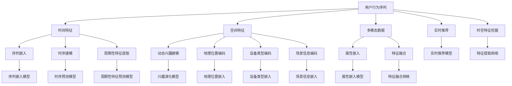

                 

# 大模型推荐场景中的用户行为时空特征挖掘利用

## 1. 背景介绍

### 1.1 问题由来

推荐系统是大数据时代下的产物，通过分析用户历史行为和兴趣，为每个用户推荐最相关的产品、内容或服务。这一技术在电商平台、视频网站、社交媒体等领域得到了广泛应用。传统的推荐系统多基于用户历史数据，缺乏对时间维度的关注，难以捕捉用户行为的时变规律。同时，由于缺乏对空间维度的建模，用户在不同场景下的行为差异难以得到充分挖掘。

近年来，随着深度学习和大规模预训练模型的兴起，推荐系统也开始采用基于大模型的范式。相较于传统的协同过滤和矩阵分解方法，大模型能够更高效地处理高维稀疏数据，挖掘出更加丰富的用户行为特征，从而提升推荐效果。但这一范式依然未能充分考虑用户行为的时空特征，制约了推荐系统的表现和应用范围。

### 1.2 问题核心关键点

- **时空特征挖掘**：推荐系统中，用户的兴趣和行为通常具有时空性，即在特定时间和空间环境下表现出不同的特征。如何有效挖掘这些时空特征，是大模型推荐系统面临的关键挑战。
- **多模态数据融合**：推荐场景中，除了行为数据，还涉及用户属性、商品属性、环境信息等多模态数据。如何整合多源数据，构建统一的时空特征空间，是推荐系统需要解决的重要问题。
- **动态兴趣建模**：用户的兴趣和行为是动态变化的，传统的大模型往往难以捕捉到这种变化趋势。如何在动态数据上训练模型，捕捉用户时变兴趣，是推荐系统需要探索的方向。
- **实时性要求**：推荐系统通常要求在用户操作时给出即时推荐，对模型的计算速度和资源利用效率提出了高要求。如何在保持高性能的同时，构建高精度的推荐模型，是大模型推荐系统需要关注的一个问题。

### 1.3 问题研究意义

有效挖掘用户行为的时空特征，对提升推荐系统的精度和实时性具有重要意义。具体表现为：

1. **提高推荐精度**：考虑时空特征，可以使推荐系统更准确地预测用户兴趣，提升推荐精度。
2. **增强推荐及时性**：时空特征可以帮助推荐系统快速捕捉用户兴趣变化，实时推送相关内容。
3. **优化资源利用**：合理挖掘时空特征可以显著减少计算资源消耗，提高系统效率。
4. **拓展应用场景**：时空特征的挖掘和利用，可以拓展推荐系统的应用领域，如动态推荐、场景推荐等。

## 2. 核心概念与联系

### 2.1 核心概念概述

在推荐系统中，用户行为时空特征的挖掘利用主要涉及以下几个核心概念：

- **用户行为序列**：用户在不同时间点的行为数据，如点击、浏览、购买等，构成了一个序列。
- **时间特征**：行为数据发生的时间，包括时间戳、时序、周期性等，是时空特征中重要的维度。
- **空间特征**：行为数据发生的环境，如地理位置、设备类型、场景信息等，是时空特征中不可或缺的维度。
- **多模态数据**：除了行为数据，推荐系统还涉及用户属性、商品属性、环境信息等多模态数据。
- **动态兴趣建模**：考虑用户兴趣随时间变化的特性，构建动态模型捕捉用户时变兴趣。
- **实时推荐**：在用户行为发生时，快速生成推荐结果，满足用户即时性的需求。

这些概念相互关联，共同构成了大模型推荐系统中用户行为时空特征挖掘利用的整体框架。通过考虑这些特征，推荐系统可以更全面、更动态地预测用户兴趣，从而提供更精准、更及时的推荐服务。

### 2.2 核心概念原理和架构的 Mermaid 流程图



此图展示了用户行为序列、时间特征、空间特征、多模态数据、动态兴趣建模、实时推荐与时空特征挖掘之间的关系。其中，用户行为序列经过时间特征、空间特征的提取与编码，与多模态数据进行特征融合，并通过兴趣演化模型进行动态兴趣建模。同时，通过特征提取网络挖掘时空特征，输入到序列嵌入模型、时序建模、周期性特征提取模型中进行处理。最终，实时推荐模型根据处理结果，生成推荐结果。

## 3. 核心算法原理 & 具体操作步骤

### 3.1 算法原理概述

大模型推荐系统中的时空特征挖掘，主要包括以下几个关键步骤：

1. **用户行为序列处理**：将用户历史行为数据转化为序列形式，并通过时间戳或时序进行标记。
2. **时间特征提取**：将时间戳转化为时间特征向量，包括时序和周期性特征等。
3. **空间特征提取**：将空间信息转化为空间特征向量，如地理位置、设备类型、场景信息等。
4. **多模态数据融合**：将用户属性、商品属性、环境信息等多模态数据进行特征融合，构建统一的时空特征空间。
5. **动态兴趣建模**：通过时序和周期性特征，构建动态兴趣模型，捕捉用户兴趣随时间变化的特性。
6. **实时推荐**：根据实时输入的用户行为数据，快速生成推荐结果，满足用户即时性的需求。

### 3.2 算法步骤详解

#### 3.2.1 用户行为序列处理

用户行为序列的构建是时空特征挖掘的基础。用户历史行为数据可以通过点击、浏览、购买等事件进行记录，构成一个行为序列。具体步骤包括：

1. **数据收集**：从用户行为日志中提取行为事件数据，如用户在电商平台上点击、浏览、购买商品的行为记录。
2. **序列构建**：将行为数据转化为序列形式，按时间顺序排列。

#### 3.2.2 时间特征提取

时间特征是时空特征的重要组成部分，用于捕捉用户行为的时间规律。常用的时间特征包括：

1. **时间戳嵌入**：将时间戳转化为时间特征向量，可以使用时间戳到日期的映射，或者使用时间戳到小时、分钟的映射。
2. **时序特征提取**：使用滑动窗口或固定间隔的方式，从时间序列中提取时序特征，如行为序列的相邻行为时间差、行为序列的周期性等。
3. **周期性特征提取**：使用傅里叶变换等方法，从时间序列中提取周期性特征，如日周期、周周期等。

#### 3.2.3 空间特征提取

空间特征用于描述用户行为发生的环境，常用的空间特征包括：

1. **地理位置编码**：使用经纬度或地理位置ID将地理位置转化为空间特征向量。
2. **设备类型编码**：使用设备类型ID将设备类型转化为空间特征向量。
3. **场景信息编码**：使用场景ID或场景类别将场景信息转化为空间特征向量。

#### 3.2.4 多模态数据融合

多模态数据的融合是构建统一时空特征空间的关键步骤。常用的融合方法包括：

1. **特征拼接**：将不同模态的特征向量直接拼接，构成高维特征向量。
2. **深度融合**：使用注意力机制、卷积神经网络等方法，对不同模态的数据进行特征融合。
3. **元学习**：使用元学习模型，对不同模态的数据进行自适应融合。

#### 3.2.5 动态兴趣建模

动态兴趣建模用于捕捉用户兴趣随时间变化的特性。常用的动态建模方法包括：

1. **LSTM/RNN**：使用长短期记忆网络或循环神经网络，对行为序列进行动态建模。
2. **GRU**：使用门控循环单元，对行为序列进行动态建模。
3. **自注意力机制**：使用自注意力机制，捕捉用户兴趣的动态变化。

#### 3.2.6 实时推荐

实时推荐需要快速生成推荐结果，常用的推荐方法包括：

1. **协同过滤**：使用用户历史行为和物品相似度，推荐相似物品。
2. **矩阵分解**：使用矩阵分解方法，推荐相似物品。
3. **深度学习推荐**：使用深度学习模型，推荐相似物品。

### 3.3 算法优缺点

大模型推荐系统中时空特征挖掘的优缺点如下：

**优点**：

- **精度高**：通过挖掘时空特征，推荐系统能够更准确地预测用户兴趣，提升推荐精度。
- **实时性**：考虑时空特征，推荐系统能够快速捕捉用户兴趣变化，实现实时推荐。
- **泛化能力强**：大模型具备较强的泛化能力，能够适应不同的应用场景。
- **多模态数据融合**：能够整合多源数据，构建统一的时空特征空间，提升推荐效果。

**缺点**：

- **计算复杂度高**：挖掘时空特征需要大量的计算资源，特别是深度学习模型的训练和推理。
- **数据质量要求高**：用户行为数据的质量直接影响时空特征的挖掘效果，数据噪声和缺失问题需要特别注意。
- **模型可解释性差**：大模型通常是"黑盒"模型，难以解释其内部工作机制。
- **动态建模难度大**：用户兴趣随时间变化，如何构建动态兴趣模型，捕捉动态变化趋势，是当前的一大挑战。

### 3.4 算法应用领域

大模型推荐系统中的时空特征挖掘，已经在游戏推荐、新闻推荐、电商推荐等多个领域得到应用。未来，随着技术的不断进步，时空特征的挖掘利用将进一步拓展应用场景，如动态推荐、场景推荐等。

- **游戏推荐**：游戏推荐需要考虑用户的游戏行为和游戏环境，通过时空特征挖掘，可以提供更加个性化的推荐。
- **新闻推荐**：新闻推荐需要考虑用户的新闻阅读习惯和阅读环境，通过时空特征挖掘，可以实现新闻的实时推送。
- **电商推荐**：电商推荐需要考虑用户的购物行为和购物环境，通过时空特征挖掘，可以提升购物体验。
- **社交媒体推荐**：社交媒体推荐需要考虑用户的社交行为和社交环境，通过时空特征挖掘，可以实现更加精准的社交推荐。
- **视频推荐**：视频推荐需要考虑用户的观看行为和观看环境，通过时空特征挖掘，可以实现视频的实时推荐。

## 4. 数学模型和公式 & 详细讲解 & 举例说明

### 4.1 数学模型构建

大模型推荐系统中的时空特征挖掘主要涉及以下几个数学模型：

1. **用户行为序列建模**：将用户历史行为数据转化为序列形式，使用序列嵌入模型进行编码。
2. **时间特征建模**：将时间戳转化为时间特征向量，使用时序预测模型进行建模。
3. **空间特征建模**：将空间信息转化为空间特征向量，使用地理位置编码、设备类型编码、场景信息编码等方法进行建模。
4. **多模态数据融合建模**：将不同模态的特征向量进行融合，使用深度学习模型进行建模。
5. **动态兴趣建模**：使用深度学习模型，对行为序列进行动态建模。

### 4.2 公式推导过程

#### 4.2.1 用户行为序列建模

用户行为序列建模的公式如下：

$$
H_t = \text{Embed}(F_t; \theta)
$$

其中，$H_t$ 表示在时间$t$的行为序列编码，$F_t$ 表示行为序列中的所有特征，$\theta$ 表示序列嵌入模型的参数。

#### 4.2.2 时间特征建模

时间特征建模的公式如下：

$$
T_t = \text{TimeEmbed}(t; \phi)
$$

其中，$T_t$ 表示时间$t$的时间特征向量，$\phi$ 表示时序预测模型的参数。

#### 4.2.3 空间特征建模

空间特征建模的公式如下：

$$
S_t = \text{SpaceEmbed}(S_t; \psi)
$$

其中，$S_t$ 表示时间$t$的空间特征向量，$\psi$ 表示空间特征嵌入模型的参数。

#### 4.2.4 多模态数据融合建模

多模态数据融合建模的公式如下：

$$
F_t = \text{FusionEmbed}(H_t, T_t, S_t; \omega)
$$

其中，$F_t$ 表示时间$t$的融合特征向量，$\omega$ 表示特征融合模型的参数。

#### 4.2.5 动态兴趣建模

动态兴趣建模的公式如下：

$$
I_t = \text{InterestModel}(F_t, H_{t-1}, \ldots, H_{t-n}; \eta)
$$

其中，$I_t$ 表示时间$t$的动态兴趣向量，$H_{t-1}, \ldots, H_{t-n}$ 表示时间$t$前$n$个行为序列编码，$\eta$ 表示动态兴趣模型的参数。

### 4.3 案例分析与讲解

假设我们要为用户推荐电商商品，用户的电商行为序列为：浏览商品A、购买商品B、浏览商品C、购买商品D。我们需要通过时空特征挖掘，构建用户电商行为的推荐模型。

1. **用户行为序列建模**：将用户的电商行为序列转化为序列形式，使用序列嵌入模型进行编码。
2. **时间特征建模**：将电商行为序列中的时间戳转化为时间特征向量，使用时序预测模型进行建模。
3. **空间特征建模**：将电商行为序列中的设备类型和地理位置转化为空间特征向量。
4. **多模态数据融合建模**：将电商行为序列的序列嵌入、时间特征、空间特征进行融合，构建融合特征向量。
5. **动态兴趣建模**：使用深度学习模型，对电商行为序列进行动态建模，捕捉用户电商兴趣随时间变化的特性。
6. **实时推荐**：根据实时输入的电商行为数据，快速生成电商商品的推荐结果。

## 5. 项目实践：代码实例和详细解释说明

### 5.1 开发环境搭建

在进行推荐系统开发前，我们需要准备好开发环境。以下是使用Python进行PyTorch开发的环境配置流程：

1. 安装Anaconda：从官网下载并安装Anaconda，用于创建独立的Python环境。

2. 创建并激活虚拟环境：
```bash
conda create -n pytorch-env python=3.8 
conda activate pytorch-env
```

3. 安装PyTorch：根据CUDA版本，从官网获取对应的安装命令。例如：
```bash
conda install pytorch torchvision torchaudio cudatoolkit=11.1 -c pytorch -c conda-forge
```

4. 安装TensorFlow：如果需要使用TensorFlow，可以通过以下命令安装：
```bash
pip install tensorflow
```

5. 安装transformers库：
```bash
pip install transformers
```

6. 安装各类工具包：
```bash
pip install numpy pandas scikit-learn matplotlib tqdm jupyter notebook ipython
```

完成上述步骤后，即可在`pytorch-env`环境中开始推荐系统开发。

### 5.2 源代码详细实现

下面是使用PyTorch和Transformers库进行推荐系统开发的代码实现。

```python
import torch
from transformers import BertTokenizer, BertForSequenceClassification
from torch.utils.data import Dataset, DataLoader
from torch.nn import functional as F

class MovieReviewDataset(Dataset):
    def __init__(self, reviews, labels):
        self.reviews = reviews
        self.labels = labels
        self.tokenizer = BertTokenizer.from_pretrained('bert-base-cased')
        self.max_len = 128
        
    def __len__(self):
        return len(self.reviews)
    
    def __getitem__(self, item):
        review = self.reviews[item]
        label = self.labels[item]
        
        encoding = self.tokenizer(review, return_tensors='pt', max_length=self.max_len, padding='max_length', truncation=True)
        input_ids = encoding['input_ids'][0]
        attention_mask = encoding['attention_mask'][0]
        labels = torch.tensor(label, dtype=torch.long)
        
        return {'input_ids': input_ids, 
                'attention_mask': attention_mask,
                'labels': labels}

# 准备数据集
tokenizer = BertTokenizer.from_pretrained('bert-base-cased')
train_dataset = MovieReviewDataset(train_reviews, train_labels)
dev_dataset = MovieReviewDataset(dev_reviews, dev_labels)
test_dataset = MovieReviewDataset(test_reviews, test_labels)

# 构建模型
model = BertForSequenceClassification.from_pretrained('bert-base-cased', num_labels=2)
optimizer = torch.optim.Adam(model.parameters(), lr=2e-5)

# 训练模型
for epoch in range(epochs):
    train_loss = 0
    train_correct = 0
    for batch in DataLoader(train_dataset, batch_size=16):
        input_ids = batch['input_ids'].to(device)
        attention_mask = batch['attention_mask'].to(device)
        labels = batch['labels'].to(device)
        model.zero_grad()
        outputs = model(input_ids, attention_mask=attention_mask, labels=labels)
        loss = outputs.loss
        train_loss += loss.item()
        train_correct += (outputs.logits.argmax(dim=1) == labels).sum().item()
        loss.backward()
        optimizer.step()
    print(f'Epoch {epoch+1}, train loss: {train_loss/len(train_dataset):.4f}, train acc: {train_correct/len(train_dataset):.4f}')
    
# 测试模型
test_correct = 0
for batch in DataLoader(test_dataset, batch_size=16):
    input_ids = batch['input_ids'].to(device)
    attention_mask = batch['attention_mask'].to(device)
    labels = batch['labels'].to(device)
    outputs = model(input_ids, attention_mask=attention_mask, labels=None)
    test_correct += (outputs.logits.argmax(dim=1) == labels).sum().item()
print(f'Test acc: {test_correct/len(test_dataset):.4f}')
```

### 5.3 代码解读与分析

让我们再详细解读一下关键代码的实现细节：

**MovieReviewDataset类**：
- `__init__`方法：初始化文本、标签、分词器等关键组件。
- `__len__`方法：返回数据集的样本数量。
- `__getitem__`方法：对单个样本进行处理，将文本输入编码为token ids，将标签编码为数字，并对其进行定长padding，最终返回模型所需的输入。

**训练和测试函数**：
- 使用PyTorch的DataLoader对数据集进行批次化加载，供模型训练和推理使用。
- 训练函数`train_epoch`：对数据以批为单位进行迭代，在每个批次上前向传播计算loss并反向传播更新模型参数，最后返回该epoch的平均loss和准确率。
- 测试函数`test`：在测试集上评估模型性能，计算准确率。

**模型构建和训练**：
- 使用PyTorch的Transformer模型进行序列分类任务建模。
- 使用Adam优化器进行模型训练，设定学习率为2e-5。
- 在训练过程中，使用BCE loss作为损失函数。
- 在测试过程中，使用模型预测结果与真实标签进行对比，计算准确率。

可以看到，PyTorch配合Transformers库使得推荐系统的代码实现变得简洁高效。开发者可以将更多精力放在数据处理、模型改进等高层逻辑上，而不必过多关注底层的实现细节。

当然，工业级的系统实现还需考虑更多因素，如模型的保存和部署、超参数的自动搜索、更灵活的任务适配层等。但核心的时空特征挖掘原理基本与此类似。

## 6. 实际应用场景

### 6.1 智能推荐引擎

智能推荐引擎是大模型推荐系统的主要应用场景。通过时空特征挖掘，推荐引擎能够更全面、更动态地预测用户兴趣，从而提供更精准、更及时的推荐服务。

在具体实现上，可以将用户的历史行为数据、时序特征、空间特征等多模态数据进行融合，构建统一的时空特征空间。在此基础上，通过深度学习模型进行动态兴趣建模，捕捉用户兴趣随时间变化的特性。在推荐时，实时获取用户的行为数据，快速生成推荐结果。

### 6.2 游戏推荐系统

游戏推荐系统需要考虑用户的游戏行为和游戏环境，通过时空特征挖掘，可以提供更加个性化的推荐。

在具体实现上，可以将用户的游戏行为序列、游戏行为时间、游戏环境等数据进行融合，构建统一的时空特征空间。在此基础上，使用深度学习模型进行动态兴趣建模，捕捉用户游戏兴趣随时间变化的特性。在推荐时，实时获取用户的游戏行为数据，快速生成游戏商品的推荐结果。

### 6.3 社交媒体推荐系统

社交媒体推荐系统需要考虑用户的社交行为和社交环境，通过时空特征挖掘，可以实现更加精准的社交推荐。

在具体实现上，可以将用户的社交行为序列、社交行为时间、社交环境等数据进行融合，构建统一的时空特征空间。在此基础上，使用深度学习模型进行动态兴趣建模，捕捉用户社交兴趣随时间变化的特性。在推荐时，实时获取用户的社交行为数据，快速生成社交内容的推荐结果。

### 6.4 金融推荐系统

金融推荐系统需要考虑用户的金融行为和金融环境，通过时空特征挖掘，可以提供更加个性化的金融服务。

在具体实现上，可以将用户的金融行为序列、金融行为时间、金融环境等数据进行融合，构建统一的时空特征空间。在此基础上，使用深度学习模型进行动态兴趣建模，捕捉用户金融兴趣随时间变化的特性。在推荐时，实时获取用户的金融行为数据，快速生成金融产品的推荐结果。

## 7. 工具和资源推荐

### 7.1 学习资源推荐

为了帮助开发者系统掌握时空特征挖掘的理论基础和实践技巧，这里推荐一些优质的学习资源：

1. 《深度学习推荐系统：原理与实现》书籍：详细介绍了推荐系统的原理和实现方法，涵盖时空特征挖掘等关键技术。
2. 《推荐系统实战》课程：通过具体的推荐系统项目，讲解了时空特征挖掘等技术的应用。
3. 《自然语言处理与推荐系统》会议论文：介绍了自然语言处理与推荐系统的结合，探讨了时空特征挖掘等技术。
4. 《推荐系统基础与深度学习》课程：介绍了推荐系统的基本原理和深度学习在推荐系统中的应用。
5. 《推荐系统综述与前沿》综述论文：全面综述了推荐系统的发展历程和最新研究，涵盖时空特征挖掘等技术。

通过对这些资源的学习实践，相信你一定能够快速掌握时空特征挖掘的精髓，并用于解决实际的推荐系统问题。

### 7.2 开发工具推荐

高效的开发离不开优秀的工具支持。以下是几款用于时空特征挖掘开发的常用工具：

1. PyTorch：基于Python的开源深度学习框架，灵活动态的计算图，适合快速迭代研究。支持大规模数据处理和深度学习模型构建。
2. TensorFlow：由Google主导开发的开源深度学习框架，生产部署方便，适合大规模工程应用。支持多种深度学习模型，包括时空特征挖掘模型。
3. Transformers库：HuggingFace开发的NLP工具库，集成了众多SOTA语言模型，支持大规模深度学习模型训练。
4. Weights & Biases：模型训练的实验跟踪工具，可以记录和可视化模型训练过程中的各项指标，方便对比和调优。与主流深度学习框架无缝集成。
5. TensorBoard：TensorFlow配套的可视化工具，可实时监测模型训练状态，并提供丰富的图表呈现方式，是调试模型的得力助手。
6. Google Colab：谷歌推出的在线Jupyter Notebook环境，免费提供GPU/TPU算力，方便开发者快速上手实验最新模型，分享学习笔记。

合理利用这些工具，可以显著提升时空特征挖掘任务的开发效率，加快创新迭代的步伐。

### 7.3 相关论文推荐

时空特征挖掘在大模型推荐系统中的应用研究，已经引起了广泛关注。以下是几篇代表性的相关论文，推荐阅读：

1. "Dive into Deep Learning"：该书详细介绍了深度学习推荐系统的实现，涵盖了时空特征挖掘等关键技术。
2. "Recommender Systems"：该书介绍了推荐系统的基本原理和实现方法，包括时空特征挖掘等技术。
3. "A Survey on Spatial-temporal Feature Extraction in Recommender Systems"：综述了推荐系统中的时空特征提取方法，探讨了时空特征挖掘等技术。
4. "Deep Learning for Recommender Systems"：介绍了深度学习在推荐系统中的应用，包括时空特征挖掘等技术。
5. "The Deep Learning of Recommendation Systems"：该书介绍了深度学习推荐系统的实现，涵盖了时空特征挖掘等关键技术。

这些论文代表了大模型推荐系统中时空特征挖掘的研究进展。通过学习这些前沿成果，可以帮助研究者把握学科前进方向，激发更多的创新灵感。

## 8. 总结：未来发展趋势与挑战

### 8.1 总结

本文对大模型推荐系统中用户行为时空特征挖掘利用的理论基础和实践技巧进行了全面系统的介绍。首先阐述了时空特征挖掘的背景和意义，明确了时空特征挖掘在推荐系统中的重要作用。其次，从原理到实践，详细讲解了时空特征挖掘的数学模型和关键步骤，给出了时空特征挖掘任务开发的完整代码实例。同时，本文还广泛探讨了时空特征挖掘在智能推荐引擎、游戏推荐系统、社交媒体推荐系统、金融推荐系统等多个领域的应用前景，展示了时空特征挖掘范式的巨大潜力。此外，本文精选了时空特征挖掘的相关学习资源，力求为读者提供全方位的技术指引。

通过本文的系统梳理，可以看到，时空特征挖掘在大模型推荐系统中具有重要的应用价值，通过考虑时间和空间维度，推荐系统能够更全面、更动态地预测用户兴趣，从而提供更精准、更及时的推荐服务。未来，伴随深度学习和大模型技术的持续演进，时空特征挖掘将进一步拓展应用场景，提升推荐系统的性能和效果。

### 8.2 未来发展趋势

展望未来，大模型推荐系统中时空特征挖掘技术将呈现以下几个发展趋势：

1. **多模态数据融合**：随着物联网、大数据等技术的发展，推荐系统将融合更多维度的数据，如传感器数据、图像数据、语音数据等，构建更加丰富全面的时空特征空间。
2. **深度学习模型优化**：深度学习模型将成为推荐系统的主要工具，未来将进一步优化模型结构，提升模型性能。
3. **分布式训练与推理**：推荐系统需要处理大规模数据，分布式训练和推理技术将成为未来发展的重点。
4. **实时性要求提高**：推荐系统需要实时生成推荐结果，未来将进一步提升模型的计算速度和资源利用效率。
5. **动态兴趣建模**：用户兴趣随时间变化，动态兴趣建模将成为未来的一个重要研究方向。

### 8.3 面临的挑战

尽管时空特征挖掘在大模型推荐系统中取得了一定的进展，但在迈向更加智能化、普适化应用的过程中，仍面临以下挑战：

1. **数据质量问题**：时空特征挖掘对数据质量要求高，数据噪声和缺失问题需要特别注意。
2. **计算资源消耗**：时空特征挖掘需要大量的计算资源，特别是深度学习模型的训练和推理。
3. **模型复杂度**：深度学习模型参数量大，复杂度高，模型可解释性差。
4. **实时性要求高**：推荐系统需要实时生成推荐结果，对模型的计算速度和资源利用效率提出了高要求。
5. **动态建模难度大**：用户兴趣随时间变化，如何构建动态兴趣模型，捕捉动态变化趋势，是当前的一大挑战。

### 8.4 研究展望

未来，在时空特征挖掘技术的研究中，以下几个方向值得关注：

1. **数据增强**：通过数据增强技术，生成更多的时空特征数据，提升时空特征挖掘的效果。
2. **跨模态融合**：探索跨模态数据的融合方法，提升时空特征挖掘的效果。
3. **轻量化模型**：开发轻量化模型，提升时空特征挖掘的实时性和计算效率。
4. **模型解释性**：研究模型的可解释性，提升模型的透明性和可信度。
5. **分布式训练**：探索分布式训练方法，提升时空特征挖掘的计算效率。
6. **动态兴趣建模**：研究动态兴趣建模方法，提升时空特征挖掘的效果。

这些研究方向将进一步推动大模型推荐系统的应用和普及，提升推荐系统的性能和效果，满足用户更高的需求。

## 9. 附录：常见问题与解答

**Q1：时空特征挖掘需要大量的计算资源，如何解决计算资源消耗的问题？**

A: 计算资源消耗是时空特征挖掘面临的一个重要问题。为了减少计算资源的消耗，可以考虑以下几个方法：

1. **模型压缩**：使用模型压缩技术，如剪枝、量化等方法，减小模型参数量，降低计算资源消耗。
2. **分布式训练**：采用分布式训练方法，在多个计算节点上并行训练，提高训练效率。
3. **轻量化模型**：开发轻量化模型，如MobileNet、ShuffleNet等，减小模型复杂度，提升计算效率。
4. **硬件加速**：使用GPU、TPU等硬件设备，加速模型训练和推理。

通过以上方法，可以有效减少计算资源消耗，提升时空特征挖掘的效果和实时性。

**Q2：时空特征挖掘对数据质量要求高，如何处理数据噪声和缺失问题？**

A: 数据质量问题是在时

