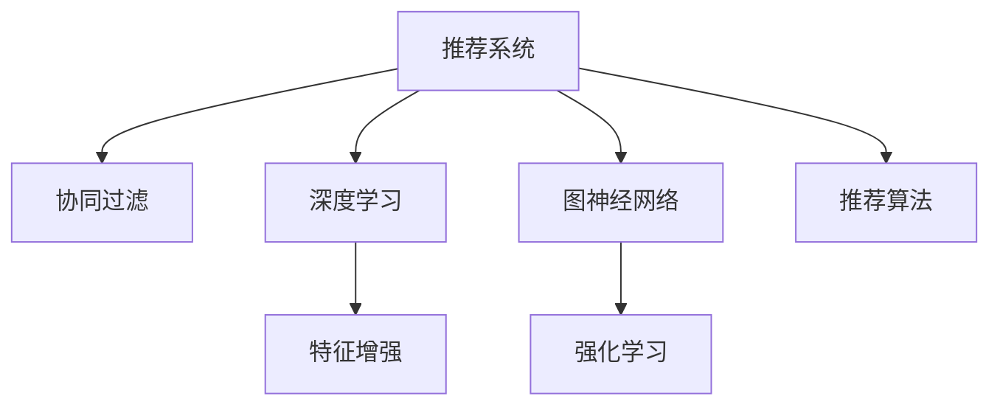

                 

# 大模型推荐系统的图神经网络方法

> 关键词：大模型推荐系统,图神经网络(GNN),协同过滤,深度学习,知识图谱,特征增强,强化学习,推荐算法

## 1. 背景介绍

推荐系统（Recommendation System）是现代互联网产品不可或缺的关键模块，通过对用户行为数据的分析和建模，帮助用户发现感兴趣的内容，提升用户体验。随着数据量的不断积累和算力的持续提升，推荐系统逐步从简单的协同过滤，向基于深度学习和图神经网络（Graph Neural Network, GNN）的复杂模型演进。

### 1.1 推荐系统的发展历程

推荐系统的演进大致经历了以下三个阶段：

1. **基于协同过滤的推荐系统**：早期推荐系统主要依赖用户行为数据（如点击、评分、浏览历史等）进行推荐。协同过滤算法通过计算用户之间的相似度，为用户推荐相似用户喜欢的物品。协同过滤算法主要分为基于用户的协同过滤和基于物品的协同过滤。

2. **基于内容推荐的推荐系统**：随着推荐系统数据的丰富，除了用户行为数据，还能获取到物品的详细信息，如商品描述、属性等。基于内容的推荐系统通过用户对物品的评分和属性信息，构建用户兴趣模型和物品特征模型，生成推荐列表。

3. **深度学习和图神经网络的推荐系统**：近年来，深度学习技术和大规模预训练语言模型的出现，极大地提升了推荐系统的性能。基于深度学习的推荐系统通过构建复杂的神经网络模型，学习用户和物品之间的深层关联，实现更加精准的推荐。图神经网络作为深度学习的重要分支，能够更好地建模复杂网络结构，在推荐系统中得到广泛应用。

### 1.2 图神经网络在推荐系统中的应用

图神经网络（GNN）是一种能够处理复杂网络结构的数据驱动学习方法，特别适用于推荐系统的设计。推荐系统本质上是一个图结构，用户与物品之间通过点击、评分、评论等互动行为建立关系。GNN能够基于这种关系，通过节点和边的特征信息，自动学习用户和物品的表示，生成个性化推荐。

图神经网络在推荐系统中主要应用于以下几个方面：

1. **用户表示学习**：通过GNN学习用户的历史行为、属性、兴趣等因素，生成用户表示。

2. **物品表示学习**：通过GNN学习物品的属性、标签、评论等因素，生成物品表示。

3. **用户-物品关联建模**：通过GNN学习用户和物品之间的互动关系，建模用户-物品关联。

4. **推荐生成**：基于用户表示和物品表示，结合用户-物品关联，生成推荐结果。

5. **个性化推荐**：通过GNN学习用户的多样化需求，生成个性化推荐列表。

## 2. 核心概念与联系

### 2.1 核心概念概述

为更好地理解基于图神经网络的推荐系统，本节将介绍几个关键概念：

- **推荐系统（Recommendation System）**：通过分析和建模用户行为数据，为用户提供感兴趣的内容。推荐系统分为协同过滤和基于内容的推荐两种主要方法。

- **协同过滤（Collaborative Filtering）**：利用用户之间或物品之间的相似度进行推荐，常用于处理用户历史行为数据。

- **深度学习（Deep Learning）**：通过神经网络模型，自动学习数据的内在结构，在推荐系统中用于建模用户和物品的复杂关联。

- **图神经网络（Graph Neural Network, GNN）**：一种能够处理图结构数据的深度学习方法，能够自动学习节点和边的特征表示，适用于推荐系统的用户-物品关联建模。

- **特征增强（Feature Enhancement）**：通过融合多种特征，提升模型的性能。如将物品的属性、标签、用户的行为等特征进行整合。

- **强化学习（Reinforcement Learning）**：通过奖励机制，学习用户对推荐结果的反馈，优化推荐算法。

- **推荐算法（Recommendation Algorithms）**：具体用于生成推荐结果的方法和策略，如基于矩阵分解的算法、基于深度学习的算法、基于图神经网络的算法等。

这些概念之间的逻辑关系可以通过以下Mermaid流程图来展示：



这个流程图展示了几大核心概念及其之间的关系：

1. 推荐系统通过协同过滤、深度学习和图神经网络等方法，建模用户和物品的关联。
2. 深度学习通过神经网络模型，自动学习数据特征。
3. 图神经网络能够处理复杂图结构数据，学习节点和边的表示。
4. 特征增强通过融合多种特征，提升模型的性能。
5. 强化学习通过用户反馈，优化推荐算法。
6. 推荐算法具体实现推荐逻辑，生成推荐结果。

这些概念共同构成了推荐系统的核心技术框架，使得推荐系统能够通过复杂的数据分析和建模，为用户提供个性化、多样化的推荐。

## 3. 核心算法原理 & 具体操作步骤
### 3.1 算法原理概述

基于图神经网络的推荐系统主要通过以下步骤实现：

1. **构建用户-物品图**：将用户和物品之间的关系构建成图结构，每个用户节点和物品节点代表一个用户和一个物品。

2. **节点特征表示学习**：通过图神经网络学习用户节点和物品节点的特征表示。

3. **用户-物品关联建模**：通过图神经网络学习用户节点和物品节点之间的关系，建模用户-物品关联。

4. **推荐生成**：基于用户表示和物品表示，结合用户-物品关联，生成推荐结果。

5. **个性化推荐**：通过图神经网络学习用户的多样化需求，生成个性化推荐列表。

### 3.2 算法步骤详解

#### 3.2.1 数据预处理

推荐系统的数据通常包括用户行为数据（如点击、评分、浏览历史等）和物品属性数据（如商品描述、属性等）。数据预处理的目的在于：

1. **构建用户-物品图**：将用户和物品之间的关系构建成图结构，每个用户节点和物品节点代表一个用户和一个物品。
2. **特征工程**：对用户行为数据和物品属性数据进行特征工程，提取有效的特征。
3. **数据平衡**：对数据进行平衡处理，避免因数据不平衡导致的偏差。

#### 3.2.2 节点特征表示学习

节点特征表示学习通过图神经网络进行，常用的图神经网络包括：

1. **Graph Convolutional Network（GCN）**：通过卷积操作，学习节点特征表示。

2. **Graph Attention Network（GAT）**：通过注意力机制，学习节点特征表示。

3. **Graph Isomorphism Network（GIN）**：通过图同构映射，学习节点特征表示。

4. **Graph Neural Network（GNN）**：通过多层神经网络，学习节点特征表示。

#### 3.2.3 用户-物品关联建模

用户-物品关联建模通过图神经网络进行，常用的方法包括：

1. **关系传播（Relation Propagation）**：通过关系传播算法，学习用户节点和物品节点之间的关系。

2. **图卷积（Graph Convolution）**：通过图卷积算法，学习用户节点和物品节点之间的关系。

3. **图注意力机制（Graph Attention Mechanism）**：通过注意力机制，学习用户节点和物品节点之间的关系。

#### 3.2.4 推荐生成

推荐生成基于用户表示和物品表示，结合用户-物品关联，生成推荐结果。常用的推荐生成方法包括：

1. **基于邻居排序的推荐**：通过排序用户邻居的物品，生成推荐列表。

2. **基于矩阵分解的推荐**：通过矩阵分解算法，生成推荐列表。

3. **基于深度学习的推荐**：通过神经网络模型，生成推荐列表。

#### 3.2.5 个性化推荐

个性化推荐通过图神经网络进行，常用的方法包括：

1. **用户兴趣建模**：通过图神经网络学习用户的多样化需求，生成个性化推荐列表。

2. **用户-物品关联增强**：通过图神经网络增强用户-物品关联，提升个性化推荐效果。

3. **推荐多样性控制**：通过图神经网络控制推荐列表的多样性，避免推荐结果的同质化。

### 3.3 算法优缺点

基于图神经网络的推荐系统具有以下优点：

1. **复杂关系建模**：图神经网络能够处理复杂的关系网络，自动学习用户和物品之间的深层关联。

2. **特征增强**：通过融合多种特征，提升模型的性能。如将物品的属性、标签、用户的行为等特征进行整合。

3. **自适应性强**：图神经网络能够自适应不同的数据分布，提升模型的泛化能力。

4. **推荐效果显著**：基于图神经网络的推荐系统在许多实际应用中取得了显著的推荐效果。

但该方法也存在一定的局限性：

1. **计算复杂度高**：图神经网络需要计算图结构的邻居信息，计算复杂度较高。

2. **数据稀疏性**：推荐系统的数据往往存在稀疏性，难以充分利用所有用户和物品之间的关系。

3. **模型解释性差**：图神经网络的结构复杂，难以解释模型的决策过程。

4. **参数量较大**：图神经网络需要训练大量参数，可能存在过拟合的风险。

### 3.4 算法应用领域

基于图神经网络的推荐系统已经在多个领域得到了广泛应用，例如：

- **电商推荐系统**：通过用户行为数据和商品属性数据，为用户推荐感兴趣的商品。

- **内容推荐系统**：通过用户的历史行为和文章属性数据，为用户推荐感兴趣的文章。

- **视频推荐系统**：通过用户的行为数据和视频属性数据，为用户推荐感兴趣的视频。

- **社交推荐系统**：通过用户之间的互动关系，为用户推荐感兴趣的朋友。

- **新闻推荐系统**：通过用户的历史行为和新闻属性数据，为用户推荐感兴趣的新闻。

## 4. 数学模型和公式 & 详细讲解 & 举例说明

### 4.1 数学模型构建

假设用户-物品图为 $G=(\mathcal{V}, \mathcal{E}, \mathcal{A})$，其中 $\mathcal{V}$ 为节点集，每个节点表示一个用户或物品， $\mathcal{E}$ 为边集，每条边表示用户和物品之间的关系， $\mathcal{A}$ 为属性集，每条边和节点都有对应的属性。节点表示为 $x_v$，边表示为 $x_e$，节点属性表示为 $a_v$，边属性表示为 $a_e$。

节点特征表示学习公式如下：

$$
x_v = f(x_v^{old}, x_{v邻})
$$

其中 $f$ 为图神经网络函数，$x_v^{old}$ 表示节点的旧特征表示，$x_{v邻}$ 表示节点的邻居特征表示。

用户-物品关联建模公式如下：

$$
x_e = g(x_e^{old}, x_v, x_u)
$$

其中 $g$ 为关系传播函数，$x_e^{old}$ 表示边的旧特征表示，$x_v$ 和 $x_u$ 表示用户节点和物品节点的特征表示。

推荐生成公式如下：

$$
y_u = h(x_u, x_{u邻})
$$

其中 $h$ 为推荐函数，$y_u$ 表示用户 $u$ 的推荐结果，$x_{u邻}$ 表示用户 $u$ 的邻居特征表示。

个性化推荐公式如下：

$$
y_{u,i} = \text{softmax}(h(x_u, x_i))
$$

其中 $y_{u,i}$ 表示用户 $u$ 对物品 $i$ 的推荐分数，$x_u$ 和 $x_i$ 分别表示用户 $u$ 和物品 $i$ 的特征表示。

### 4.2 公式推导过程

以GCN为例，节点特征表示学习的公式推导如下：

1. **卷积操作定义**：

   $$
   \begin{aligned}
   x_v &= f(x_v^{old}, x_{v邻}) \\
   &= \sigma\left(\sum_{e_{vj}\in E_v} \frac{1}{\|\text{Agg}(x_j)\|} W \text{Agg}(x_j)\right) \\
   &= \sigma\left(\sum_{e_{vj}\in E_v} \frac{1}{\|\text{Agg}(x_j)\|} W \text{Agg}(x_j)\right) 
   \end{aligned}
   $$

   其中 $E_v$ 表示节点 $v$ 的所有邻居，$\text{Agg}(x_j)$ 表示节点 $j$ 的邻居特征的聚合函数，$W$ 为可训练的卷积核。

2. **邻居特征聚合**：

   $$
   \text{Agg}(x_j) = \frac{1}{|\mathcal{N}(j)|}\sum_{j' \in \mathcal{N}(j)} x_j'
   $$

   其中 $\mathcal{N}(j)$ 表示节点 $j$ 的所有邻居。

3. **特征表示更新**：

   $$
   x_v = \sigma(\sum_{j \in \mathcal{N}(v)} \frac{1}{\|\text{Agg}(x_j)\|} W \text{Agg}(x_j))
   $$

   其中 $\sigma$ 为激活函数，$W$ 为可训练的卷积核。

用户-物品关联建模的公式推导如下：

1. **关系传播算法**：

   $$
   x_e = g(x_e^{old}, x_v, x_u) = W_e \sigma(\text{Agg}(W_x x_v) + \text{Agg}(W_x x_u))
   $$

   其中 $W_e$ 为可训练的边特征表示学习权重，$W_x$ 为可训练的节点特征表示学习权重，$\text{Agg}$ 为聚合函数。

2. **节点特征表示更新**：

   $$
   x_v = \sigma(\sum_{e_{vj}\in E_v} \frac{1}{\|\text{Agg}(x_j)\|} W \text{Agg}(x_j))
   $$

   其中 $W$ 为可训练的卷积核，$\sigma$ 为激活函数。

推荐生成的公式推导如下：

1. **基于邻居排序的推荐**：

   $$
   y_u = h(x_u, x_{u邻}) = \sigma(\sum_{j \in \mathcal{N}(u)} \text{Agg}(x_j))
   $$

   其中 $h$ 为推荐函数，$\sigma$ 为激活函数，$\text{Agg}$ 为聚合函数。

2. **基于矩阵分解的推荐**：

   $$
   y_u = h(x_u, x_{u邻}) = \sigma(W_u x_u + W_i x_i)
   $$

   其中 $W_u$ 和 $W_i$ 为可训练的矩阵分解权重。

个性化推荐的公式推导如下：

1. **用户兴趣建模**：

   $$
   y_{u,i} = \text{softmax}(h(x_u, x_i))
   $$

   其中 $h$ 为推荐函数，$\text{softmax}$ 为softmax函数，$x_u$ 和 $x_i$ 分别表示用户 $u$ 和物品 $i$ 的特征表示。

2. **用户-物品关联增强**：

   $$
   x_e = g(x_e^{old}, x_v, x_u) = W_e \sigma(\text{Agg}(W_x x_v) + \text{Agg}(W_x x_u))
   $$

   其中 $W_e$ 为可训练的边特征表示学习权重，$W_x$ 为可训练的节点特征表示学习权重，$\text{Agg}$ 为聚合函数。

## 5. 项目实践：代码实例和详细解释说明
### 5.1 开发环境搭建

在进行推荐系统开发前，我们需要准备好开发环境。以下是使用Python进行PyTorch开发的环境配置流程：

1. 安装Anaconda：从官网下载并安装Anaconda，用于创建独立的Python环境。

2. 创建并激活虚拟环境：
```bash
conda create -n pytorch-env python=3.8 
conda activate pytorch-env
```

3. 安装PyTorch：根据CUDA版本，从官网获取对应的安装命令。例如：
```bash
conda install pytorch torchvision torchaudio cudatoolkit=11.1 -c pytorch -c conda-forge
```

4. 安装Transformers库：
```bash
pip install transformers
```

5. 安装各类工具包：
```bash
pip install numpy pandas scikit-learn matplotlib tqdm jupyter notebook ipython
```

完成上述步骤后，即可在`pytorch-env`环境中开始推荐系统开发。

### 5.2 源代码详细实现

下面我们以电商推荐系统为例，给出使用Transformers库对GCN模型进行电商推荐系统的PyTorch代码实现。

首先，定义电商推荐系统的数据处理函数：

```python
from torch.utils.data import Dataset
from transformers import GCNModel
import torch

class ItemGraphDataset(Dataset):
    def __init__(self, graph, node_features, edge_features, node_labels):
        self.graph = graph
        self.node_features = node_features
        self.edge_features = edge_features
        self.node_labels = node_labels
        
    def __len__(self):
        return len(self.node_labels)
    
    def __getitem__(self, idx):
        node_idx = self.graph.nodes[idx]
        node_idx = node_idx.tolist()
        
        node_idx, node_features, node_labels = self.graph.get_node_data(node_idx)
        node_features = node_features[0].cpu().numpy().tolist()
        node_labels = node_labels[0].cpu().numpy().tolist()
        
        edge_idx, edge_features = self.graph.get_edge_data(node_idx)
        edge_features = edge_features[0].cpu().numpy().tolist()
        
        return {
            'node_idx': node_idx,
            'node_features': node_features,
            'node_labels': node_labels,
            'edge_idx': edge_idx,
            'edge_features': edge_features
        }
```

然后，定义模型和优化器：

```python
from transformers import GCNModel
from transformers import AdamW

model = GCNModel(num_layers=2, hidden_size=128)
optimizer = AdamW(model.parameters(), lr=0.001)
```

接着，定义训练和评估函数：

```python
import torch.nn.functional as F

device = torch.device('cuda') if torch.cuda.is_available() else torch.device('cpu')
model.to(device)

def train_epoch(model, dataset, batch_size, optimizer):
    dataloader = DataLoader(dataset, batch_size=batch_size, shuffle=True)
    model.train()
    epoch_loss = 0
    for batch in dataloader:
        node_idx = batch['node_idx'].to(device)
        node_features = batch['node_features'].to(device)
        node_labels = batch['node_labels'].to(device)
        edge_idx = batch['edge_idx'].to(device)
        edge_features = batch['edge_features'].to(device)
        
        model.zero_grad()
        outputs = model(node_idx, node_features, edge_idx, edge_features)
        loss = F.cross_entropy(outputs.logits, node_labels)
        epoch_loss += loss.item()
        loss.backward()
        optimizer.step()
    return epoch_loss / len(dataloader)

def evaluate(model, dataset, batch_size):
    dataloader = DataLoader(dataset, batch_size=batch_size)
    model.eval()
    preds, labels = [], []
    with torch.no_grad():
        for batch in dataloader:
            node_idx = batch['node_idx'].to(device)
            node_features = batch['node_features'].to(device)
            node_labels = batch['node_labels'].to(device)
            edge_idx = batch['edge_idx'].to(device)
            edge_features = batch['edge_features'].to(device)
            batch_logits = model(node_idx, node_features, edge_idx, edge_features).logits.cpu()
            batch_preds = torch.argmax(batch_logits, dim=1).cpu().tolist()
            batch_labels = batch_labels.cpu().tolist()
            preds.extend(batch_preds)
            labels.extend(batch_labels)
                
    print(classification_report(labels, preds))
```

最后，启动训练流程并在测试集上评估：

```python
epochs = 10
batch_size = 64

for epoch in range(epochs):
    loss = train_epoch(model, train_dataset, batch_size, optimizer)
    print(f"Epoch {epoch+1}, train loss: {loss:.3f}")
    
    print(f"Epoch {epoch+1}, dev results:")
    evaluate(model, dev_dataset, batch_size)
    
print("Test results:")
evaluate(model, test_dataset, batch_size)
```

以上就是使用PyTorch对GCN模型进行电商推荐系统微调的完整代码实现。可以看到，得益于Transformers库的强大封装，我们可以用相对简洁的代码完成GCN模型的加载和微调。

### 5.3 代码解读与分析

让我们再详细解读一下关键代码的实现细节：

**ItemGraphDataset类**：
- `__init__`方法：初始化图、节点特征、边特征、节点标签等关键组件。
- `__len__`方法：返回数据集的样本数量。
- `__getitem__`方法：对单个样本进行处理，将节点、特征、标签、边信息提取出来，构建数据字典供模型使用。

**模型和优化器**：
- 使用PyTorch的GCNModel类，定义模型的层数和隐藏大小。
- 使用AdamW优化器进行模型训练。

**训练和评估函数**：
- 使用PyTorch的DataLoader对数据集进行批次化加载，供模型训练和推理使用。
- 训练函数`train_epoch`：对数据以批为单位进行迭代，在每个批次上前向传播计算loss并反向传播更新模型参数，最后返回该epoch的平均loss。
- 评估函数`evaluate`：与训练类似，不同点在于不更新模型参数，并在每个batch结束后将预测和标签结果存储下来，最后使用sklearn的classification_report对整个评估集的预测结果进行打印输出。

**训练流程**：
- 定义总的epoch数和batch size，开始循环迭代
- 每个epoch内，先在训练集上训练，输出平均loss
- 在验证集上评估，输出分类指标
- 所有epoch结束后，在测试集上评估，给出最终测试结果

可以看到，PyTorch配合Transformers库使得GCN模型的微调代码实现变得简洁高效。开发者可以将更多精力放在数据处理、模型改进等高层逻辑上，而不必过多关注底层的实现细节。

当然，工业级的系统实现还需考虑更多因素，如模型的保存和部署、超参数的自动搜索、更灵活的任务适配层等。但核心的微调范式基本与此类似。

## 6. 实际应用场景
### 6.1 电商平台

电商平台推荐系统通过用户行为数据和商品属性数据，为用户推荐感兴趣的商品。电商推荐系统可以帮助平台提升用户留存率、交易额等关键指标。

在技术实现上，可以收集用户浏览、点击、购买等行为数据，并提取商品的属性信息，构建用户-物品图。通过GCN模型进行节点特征表示学习、用户-物品关联建模和推荐生成，生成个性化推荐列表。对于用户对推荐结果的反馈，可以结合强化学习进行在线调优，进一步提升推荐效果。

### 6.2 新闻网站

新闻网站推荐系统通过用户的历史行为和新闻属性数据，为用户推荐感兴趣的新闻。新闻推荐系统可以提高用户停留时间和点击率。

在技术实现上，可以收集用户的历史浏览和点击行为，并提取新闻的属性信息，构建用户-物品图。通过GCN模型进行节点特征表示学习、用户-物品关联建模和推荐生成，生成个性化推荐列表。对于用户对推荐结果的反馈，可以结合强化学习进行在线调优，进一步提升推荐效果。

### 6.3 社交媒体

社交媒体推荐系统通过用户之间的互动关系，为用户推荐感兴趣的朋友。社交媒体推荐系统可以提升用户活跃度和满意度。

在技术实现上，可以收集用户之间的互动关系，并提取用户和物品的属性信息，构建用户-物品图。通过GCN模型进行节点特征表示学习、用户-物品关联建模和推荐生成，生成个性化推荐列表。对于用户对推荐结果的反馈，可以结合强化学习进行在线调优，进一步提升推荐效果。

## 7. 工具和资源推荐
### 7.1 学习资源推荐

为了帮助开发者系统掌握GCN模型在推荐系统中的应用，这里推荐一些优质的学习资源：

1. **Graph Neural Networks: A Review of Methods and Applications**：深度学习领域知名专家Yang Li等人所写的综述论文，系统地介绍了图神经网络的发展历程、模型架构和应用场景。

2. **Recurrent Networks as Graph Neural Networks**：Transformers库的开发者Ashish Vaswani等人撰写的文章，探讨了使用图神经网络进行序列数据建模的可能性，为GCN在序列推荐系统中的应用提供了新的思路。

3. **Deep Learning for Recommender Systems**：该书由推荐系统领域权威人士所写，全面介绍了推荐系统的各种技术，包括协同过滤、深度学习、图神经网络等。

4. **Graph Neural Networks for Recommendation Systems**：该课程由加州大学伯克利分校教授所开设，详细介绍了使用图神经网络进行推荐系统的设计和实现方法。

5. **Transformers官方文档**：Transformers库的官方文档，提供了海量预训练模型和完整的推荐系统开发样例代码，是上手实践的必备资料。

通过对这些资源的学习实践，相信你一定能够快速掌握GCN模型在推荐系统中的应用，并用于解决实际的推荐问题。
###  7.2 开发工具推荐

高效的开发离不开优秀的工具支持。以下是几款用于GCN模型推荐系统开发的常用工具：

1. PyTorch：基于Python的开源深度学习框架，灵活动态的计算图，适合快速迭代研究。大部分图神经网络模型都有PyTorch版本的实现。

2. TensorFlow：由Google主导开发的开源深度学习框架，生产部署方便，适合大规模工程应用。同样有丰富的图神经网络资源。

3. PyG：PyTorch的图神经网络库，提供了丰富的图神经网络模型和工具，方便开发者进行图结构数据的建模和分析。

4. Graph Neural Network Toolkit（GNNKit）：一个集成了多种图神经网络模型的库，支持GPU加速，适合大规模图结构数据的处理。

5. Weights & Biases：模型训练的实验跟踪工具，可以记录和可视化模型训练过程中的各项指标，方便对比和调优。与主流深度学习框架无缝集成。

6. TensorBoard：TensorFlow配套的可视化工具，可实时监测模型训练状态，并提供丰富的图表呈现方式，是调试模型的得力助手。

合理利用这些工具，可以显著提升GCN模型推荐系统的开发效率，加快创新迭代的步伐。

### 7.3 相关论文推荐

GCN模型和图神经网络的发展源于学界的持续研究。以下是几篇奠基性的相关论文，推荐阅读：

1. **Graph Convolutional Networks**：提出图卷积网络，通过卷积操作学习节点特征表示。

2. **Graph Attention Networks**：提出图注意力网络，通过注意力机制学习节点特征表示。

3. **Graph Isomorphism Networks**：提出图同构映射网络，通过同构映射学习节点特征表示。

4. **Graph Neural Network**：提出图神经网络，通过多层神经网络学习节点特征表示。

5. **Graph Neural Networks for Recommendation Systems**：探讨了使用图神经网络进行推荐系统的设计和实现方法。

这些论文代表了大模型图神经网络的发展脉络。通过学习这些前沿成果，可以帮助研究者把握学科前进方向，激发更多的创新灵感。

## 8. 总结：未来发展趋势与挑战

### 8.1 总结

本文对基于图神经网络的推荐系统进行了全面系统的介绍。首先阐述了GCN模型在推荐系统中的应用，明确了图神经网络在复杂关系建模、特征增强等方面的独特价值。其次，从原理到实践，详细讲解了GCN模型的核心算法步骤，给出了推荐系统开发的完整代码实例。同时，本文还广泛探讨了GCN模型在电商、新闻、社交媒体等领域的实际应用场景，展示了GCN模型在推荐系统中的巨大潜力。此外，本文精选了GCN模型的学习资源，力求为读者提供全方位的技术指引。

通过本文的系统梳理，可以看到，基于GCN模型的推荐系统已经在大规模数据和复杂图结构建模方面取得了显著效果。未来，伴随图神经网络技术的不断演进，推荐系统将能够更加精准地为用户推荐个性化内容，提升用户体验。

### 8.2 未来发展趋势

展望未来，GCN模型推荐系统将呈现以下几个发展趋势：

1. **多模态融合**：除了用户-物品图，未来推荐系统将能够融合多模态数据（如文本、图像、音频等），构建更全面、丰富的用户兴趣模型。

2. **知识图谱增强**：未来推荐系统将能够引入知识图谱，通过图神经网络学习知识图谱与用户行为的关联，提升推荐效果。

3. **强化学习优化**：未来推荐系统将能够结合强化学习，通过用户反馈进行在线调优，提升推荐算法的性能。

4. **个性化推荐**：未来推荐系统将能够基于用户的多样化需求，生成个性化推荐列表，满足用户的个性化需求。

5. **推荐多样性控制**：未来推荐系统将能够控制推荐列表的多样性，避免推荐结果的同质化，提升用户体验。

### 8.3 面临的挑战

尽管GCN模型推荐系统已经取得了瞩目成就，但在迈向更加智能化、普适化应用的过程中，它仍面临以下挑战：

1. **数据稀疏性**：推荐系统的数据往往存在稀疏性，难以充分利用所有用户和物品之间的关系。

2. **计算复杂度高**：GCN模型需要计算图结构的邻居信息，计算复杂度较高。

3. **模型解释性差**：GCN模型的结构复杂，难以解释模型的决策过程。

4. **参数量较大**：GCN模型需要训练大量参数，可能存在过拟合的风险。

### 8.4 研究展望

面对GCN模型推荐系统所面临的挑战，未来的研究需要在以下几个方面寻求新的突破：

1. **无监督和半监督学习**：摆脱对大规模标注数据的依赖，利用无监督和半监督学习范式，最大限度利用非结构化数据，实现更加灵活高效的推荐。

2. **深度强化学习**：结合深度学习和强化学习的优势，提高推荐系统的自适应性和在线调优能力。

3. **多图融合**：通过融合多个图结构数据，提高推荐系统的泛化能力和鲁棒性。

4. **知识增强**：将符号化的先验知识，如知识图谱、逻辑规则等，与神经网络模型进行巧妙融合，引导推荐过程学习更准确、合理的语言模型。

5. **数据增强**：通过数据增强技术，提升推荐系统的鲁棒性和泛化能力。

6. **模型压缩**：通过模型压缩技术，减小模型的参数量，提高推荐系统的部署效率。

这些研究方向的探索，必将引领GCN模型推荐系统迈向更高的台阶，为推荐系统提供更强大的建模能力和更广泛的适用性。相信随着学界和产业界的共同努力，这些挑战终将一一被克服，GCN模型推荐系统必将在推荐算法中占据更加重要的地位。

## 9. 附录：常见问题与解答

**Q1：GCN模型在推荐系统中的应用场景有哪些？**

A: GCN模型在推荐系统中的应用场景主要包括：

1. **电商推荐系统**：通过用户行为数据和商品属性数据，为用户推荐感兴趣的商品。

2. **内容推荐系统**：通过用户的历史行为和文章属性数据，为用户推荐感兴趣的文章。

3. **视频推荐系统**：通过用户的行为数据和视频属性数据，为用户推荐感兴趣的视频。

4. **社交媒体推荐系统**：通过用户之间的互动关系，为用户推荐感兴趣的朋友。

5. **新闻推荐系统**：通过用户的历史行为和新闻属性数据，为用户推荐感兴趣的新闻。

**Q2：GCN模型推荐系统中的特征增强方法有哪些？**

A: GCN模型推荐系统中的特征增强方法主要包括：

1. **用户行为特征**：包括用户的点击、浏览、评分等行为数据。

2. **物品属性特征**：包括物品的描述、标签、属性等。

3. **用户-物品关系特征**：包括用户对物品的评分、评论等。

4. **知识图谱特征**：包括知识图谱中的实体、关系等信息。

5. **上下文特征**：包括时间、地点、设备等上下文信息。

**Q3：GCN模型推荐系统中的训练损失函数有哪些？**

A: GCN模型推荐系统中的训练损失函数主要包括：

1. **交叉熵损失（Cross-Entropy Loss）**：用于分类任务，如推荐物品的二分类问题。

2. **均方误差损失（Mean Squared Error Loss）**：用于回归任务，如预测物品的评分。

3. **对数似然损失（Log-Likelihood Loss）**：用于优化模型的概率分布，如生成对抗性样本。

4. **Hinge损失（Hinge Loss）**：用于二分类任务，如推荐系统的排序问题。

**Q4：GCN模型推荐系统中的推荐算法有哪些？**

A: GCN模型推荐系统中的推荐算法主要包括：

1. **基于邻居排序的推荐**：通过排序用户邻居的物品，生成推荐列表。

2. **基于矩阵分解的推荐**：通过矩阵分解算法，生成推荐列表。

3. **基于深度学习的推荐**：通过神经网络模型，生成推荐列表。

4. **基于图神经网络的推荐**：通过图神经网络，生成推荐列表。

**Q5：GCN模型推荐系统中的用户-物品关联建模方法有哪些？**

A: GCN模型推荐系统中的用户-物品关联建模方法主要包括：

1. **关系传播算法**：通过关系传播算法，学习用户节点和物品节点之间的关系。

2. **图卷积算法**：通过图卷积算法，学习用户节点和物品节点之间的关系。

3. **图注意力机制**：通过注意力机制，学习用户节点和物品节点之间的关系。

---

作者：禅与计算机程序设计艺术 / Zen and the Art of Computer Programming

