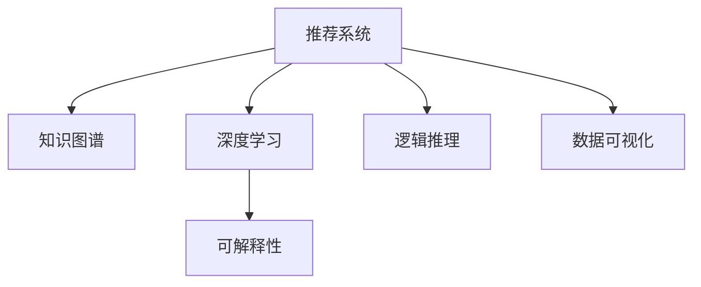

                 

# 大模型推荐结果的可解释性研究

> 关键词：
大模型推荐系统, 可解释性, 用户研究, 机器学习, 知识图谱, 逻辑推理, 深度学习, 数据可视化

## 1. 背景介绍

### 1.1 问题由来

在当前的互联网时代，推荐系统已经成为了各大平台标配的核心功能之一，从电商、新闻到社交媒体，推荐系统无处不在。然而，尽管推荐系统为用户提供了个性化体验，但用户依然对其推荐结果感到疑惑和不解，尤其是对于那些无法通过直觉理解其背后的逻辑和依据。这种困惑进一步加剧了用户对推荐结果的信任度，也影响了平台的黏性和满意度。

近年来，随着深度学习和大数据技术的发展，推荐系统在内容推荐上取得了显著的进步，但同时其“黑箱”性质也成为了制约其广泛应用的重要障碍。因此，推荐结果的可解释性成为了当下研究的一个热门课题。对于推荐系统开发者而言，了解并掌握如何提高推荐结果的可解释性，不仅能够增强用户的信任和满意度，还能在一定程度上提升推荐系统的性能和效果。

## 2. 核心概念与联系

### 2.1 核心概念概述

为更好地理解推荐结果的可解释性，本节将介绍几个密切相关的核心概念：

- 推荐系统(Recommendation System)：通过分析用户行为数据，为用户推荐符合其兴趣和需求的物品或内容。
- 可解释性(Explainability)：使推荐系统输出的结果能够被用户理解的过程，即解释推荐结果背后的逻辑依据和数据来源。
- 知识图谱(Knowledge Graph)：将实体及其关系用图形结构表示的数据库，用于更好地进行实体间的关系推理和知识整合。
- 逻辑推理(Logical Reasoning)：通过规则和逻辑关系进行推理，帮助推荐系统决策更加透明和可信。
- 深度学习(Deep Learning)：一类基于神经网络的机器学习技术，通过多层次的特征提取和表示学习，实现对复杂数据的高效处理和建模。
- 数据可视化(Data Visualization)：将复杂的数据信息通过图形、图表等形式直观展示出来，便于理解和分析。

这些核心概念之间的逻辑关系可以通过以下Mermaid流程图来展示：



这个流程图展示了大模型推荐系统可解释性的核心概念及其之间的关系：

1. 推荐系统通过深度学习和知识图谱等技术，实现对用户行为数据的分析和处理。
2. 深度学习模型通过多层特征提取，挖掘数据的内在关联和规律。
3. 知识图谱通过实体关系描述，整合不同数据源的信息，增强推荐的准确性。
4. 可解释性方法通过数据可视化等手段，将推荐结果背后的逻辑和依据呈现给用户。
5. 逻辑推理结合模型决策过程，为用户提供更加透明和可信的解释。

这些核心概念共同构成了推荐系统可解释性的基础框架，使推荐结果更加可信和透明。

## 3. 核心算法原理 & 具体操作步骤

### 3.1 算法原理概述

推荐系统可解释性的核心思想是通过多种技术手段，将推荐结果背后的逻辑和依据呈现给用户。具体而言，有以下几种常见方法：

- **特征解释(Feature Explanation)**：通过分析推荐模型中的特征权重，解释哪些特征对推荐结果的贡献最大。
- **规则解释(Rule-Based Explanation)**：结合知识图谱和逻辑推理，解释推荐结果背后的规则和逻辑依据。
- **局部模型(Localized Model)**：在模型中加入用户特定的局部信息，解释模型对用户行为的局部解释。
- **可视化解释(Visualization-Based Explanation)**：通过数据可视化手段，展示推荐模型的决策路径和数据来源。
- **交互式解释(Interactive Explanation)**：通过与用户的互动，动态解释推荐结果和理由。

### 3.2 算法步骤详解

基于上述可解释性方法，推荐系统可解释性的具体操作步骤可以总结为以下几个步骤：

**Step 1: 数据准备与特征提取**
- 收集用户行为数据，包括点击、浏览、评分等记录。
- 使用深度学习模型(如深度神经网络)对用户行为数据进行特征提取，得到用户兴趣和行为特征向量。
- 将用户行为特征向量与物品属性特征向量进行拼接，构成模型输入。

**Step 2: 模型训练与特征分析**
- 使用深度学习模型(如深度神经网络)对用户和物品的特征向量进行建模，得到推荐模型。
- 在模型训练过程中，记录特征权重和模型参数，用于后续的可解释性分析。

**Step 3: 规则整合与逻辑推理**
- 结合知识图谱中的实体关系和属性，构建推荐规则。
- 使用逻辑推理技术，将推荐规则和模型决策结果进行融合，得到更加可信的推荐结果。

**Step 4: 可视化展示与交互式解释**
- 将推荐规则和模型决策过程进行可视化展示，如使用图形化界面、交互式图表等形式。
- 提供用户互动界面，允许用户输入具体查询，动态展示推荐结果和理由。

### 3.3 算法优缺点

推荐系统可解释性的优点包括：

1. 增强用户信任：通过提供推荐结果的详细解释，使用户更加信任推荐系统，提升用户满意度。
2. 提高决策透明度：将推荐决策的依据公开，有助于用户理解推荐逻辑，避免“黑箱”问题。
3. 促进知识共享：通过解释推荐规则和数据来源，促进不同用户之间的知识交流和共享。
4. 提升推荐精度：结合逻辑推理和数据可视化，有助于发现和纠正推荐模型中的偏差和错误，提升推荐系统的性能。

然而，推荐系统可解释性也存在一定的局限性：

1. 技术复杂度高：可解释性技术需要结合深度学习、知识图谱、逻辑推理等多种技术手段，实现难度较高。
2. 数据要求高：需要大量高质量的数据和详细的实体关系描述，才能进行有效的规则解释和逻辑推理。
3. 计算成本高：可解释性分析需要额外的数据处理和模型训练，增加了计算成本和推理时间。
4. 结果可理解性有限：即使进行了可解释性分析，用户对于模型决策的深度理解仍然有限，需要进一步的交互式解释。
5. 隐私和安全问题：可解释性分析涉及大量的用户数据和推荐决策信息，可能存在隐私泄露和信息安全问题。

尽管存在这些局限性，但可解释性在提高推荐系统可信度和透明度方面的价值，是不可忽视的。因此，未来的研究应集中在如何降低技术复杂度、提高数据质量和计算效率，同时确保隐私和安全。

### 3.4 算法应用领域

推荐系统可解释性在多个应用领域中得到了广泛应用，例如：

- 电商推荐：通过解释用户购买历史和行为特征，帮助用户理解推荐依据，提升购买决策的准确性。
- 新闻推荐：解释新闻内容与用户兴趣之间的关联，使用户更易于理解推荐结果。
- 视频推荐：通过可视化展示推荐模型决策路径和数据来源，增强推荐结果的可信度。
- 社交推荐：解释社交网络中的关系和属性，帮助用户理解推荐逻辑，提升社交体验。
- 个性化健康推荐：通过解释推荐理由和医疗信息，增强用户对健康建议的信任和接受度。

除了上述这些经典领域外，可解释性在更多场景中也会得到应用，如金融投资、智能家居、游戏推荐等，为推荐系统的广泛应用提供了有力的技术支持。

## 4. 数学模型和公式 & 详细讲解 & 举例说明

### 4.1 数学模型构建

本节将使用数学语言对推荐系统可解释性进行更加严格的刻画。

记推荐系统中的用户为 $U$，物品为 $I$，用户对物品的评分（如购买次数、评分等）为 $R_{ui}$。设深度学习推荐模型的输入为用户行为特征向量 $x_u$ 和物品属性特征向量 $x_i$，输出为推荐评分 $p_{ui}$。

假设推荐模型为线性回归模型，则其可以表示为：

$$
p_{ui} = w_u^T x_u + b_u + w_i^T x_i + b_i + e_{ui}
$$

其中 $w_u, w_i$ 为模型参数，$b_u, b_i$ 为偏置项，$e_{ui}$ 为误差项。

通过模型训练，可以得到用户 $u$ 和物品 $i$ 之间的推荐评分。

### 4.2 公式推导过程

根据上述线性回归模型，可以推导推荐评分 $p_{ui}$ 的梯度：

$$
\frac{\partial p_{ui}}{\partial w_u} = x_u
$$
$$
\frac{\partial p_{ui}}{\partial w_i} = x_i
$$
$$
\frac{\partial p_{ui}}{\partial b_u} = 1
$$
$$
\frac{\partial p_{ui}}{\partial b_i} = 1
$$

将梯度带入损失函数 $L$ 进行反向传播更新模型参数：

$$
\frac{\partial L}{\partial w_u} = -\frac{\partial p_{ui}}{\partial w_u}
$$
$$
\frac{\partial L}{\partial w_i} = -\frac{\partial p_{ui}}{\partial w_i}
$$
$$
\frac{\partial L}{\partial b_u} = -\frac{\partial p_{ui}}{\partial b_u}
$$
$$
\frac{\partial L}{\partial b_i} = -\frac{\partial p_{ui}}{\partial b_i}
$$

通过上述过程，推荐模型在损失函数 $L$ 的指导下进行参数更新，从而得到对用户和物品特征的敏感度。

### 4.3 案例分析与讲解

以电商推荐系统为例，分析推荐结果的可解释性分析过程。

假设某用户 $u$ 对商品 $i$ 的评分 $R_{ui}=3$，在电商平台上浏览过 $x_{ui}$ 次。现在电商推荐系统向该用户推荐商品 $i$，推荐评分 $p_{ui}$ 为 2.5。推荐模型为线性回归模型，模型的输入为用户行为特征向量 $x_u$ 和物品属性特征向量 $x_i$，输出为推荐评分 $p_{ui}$。

根据公式推导过程，可以得到推荐评分 $p_{ui}$ 的梯度：

$$
\frac{\partial p_{ui}}{\partial w_u} = x_u
$$
$$
\frac{\partial p_{ui}}{\partial w_i} = x_i
$$
$$
\frac{\partial p_{ui}}{\partial b_u} = 1
$$
$$
\frac{\partial p_{ui}}{\partial b_i} = 1
$$

在推荐模型训练过程中，记录用户行为特征向量 $x_u$ 和物品属性特征向量 $x_i$ 对推荐评分的贡献权重 $w_u, w_i$ 和偏置项 $b_u, b_i$。

现在电商推荐系统向该用户推荐商品 $i$，推荐评分 $p_{ui}$ 为 2.5。推荐模型的输出为 $p_{ui}=w_u^T x_u + b_u + w_i^T x_i + b_i + e_{ui}$。

根据上述公式，可以得到推荐评分 $p_{ui}$ 的梯度：

$$
\frac{\partial p_{ui}}{\partial w_u} = x_u
$$
$$
\frac{\partial p_{ui}}{\partial w_i} = x_i
$$
$$
\frac{\partial p_{ui}}{\partial b_u} = 1
$$
$$
\frac{\partial p_{ui}}{\partial b_i} = 1
$$

通过分析推荐评分的梯度，可以得知用户行为特征向量 $x_u$ 对推荐评分的贡献最大，其次为物品属性特征向量 $x_i$。此外，推荐模型的偏置项对推荐评分的贡献也较大。

基于上述分析，电商推荐系统可以向用户 $u$ 解释推荐商品 $i$ 的理由：该用户在电商平台上浏览过 $x_{ui}$ 次，对商品 $i$ 的评分 $R_{ui}=3$，且推荐模型认为用户 $u$ 对商品 $i$ 的评分 $p_{ui}$ 为 2.5，高于用户的平均评分，因此向其推荐商品 $i$。

## 5. 项目实践：代码实例和详细解释说明

### 5.1 开发环境搭建

在进行可解释性分析实践前，我们需要准备好开发环境。以下是使用Python进行PyTorch开发的环境配置流程：

1. 安装Anaconda：从官网下载并安装Anaconda，用于创建独立的Python环境。

2. 创建并激活虚拟环境：
```bash
conda create -n pytorch-env python=3.8 
conda activate pytorch-env
```

3. 安装PyTorch：根据CUDA版本，从官网获取对应的安装命令。例如：
```bash
conda install pytorch torchvision torchaudio cudatoolkit=11.1 -c pytorch -c conda-forge
```

4. 安装TensorBoard：
```bash
pip install tensorboard
```

5. 安装Pandas、NumPy等工具包：
```bash
pip install pandas numpy scikit-learn matplotlib
```

完成上述步骤后，即可在`pytorch-env`环境中开始可解释性分析实践。

### 5.2 源代码详细实现

这里以电商推荐系统为例，给出使用PyTorch进行推荐模型训练和可解释性分析的PyTorch代码实现。

首先，定义推荐模型的输入和输出：

```python
import torch
from torch import nn
from torch.nn import functional as F

class Recommender(nn.Module):
    def __init__(self, n_users, n_items, n_features):
        super(Recommender, self).__init__()
        self.user_embedding = nn.Embedding(n_users, n_features)
        self.item_embedding = nn.Embedding(n_items, n_features)
        self.fc = nn.Linear(n_features*2, 1)
        
    def forward(self, user_id, item_id):
        user_vector = self.user_embedding(user_id)
        item_vector = self.item_embedding(item_id)
        concatenated_vector = torch.cat([user_vector, item_vector], dim=1)
        rating = self.fc(concatenated_vector)
        return rating
```

接着，定义推荐模型和优化器：

```python
n_users = 1000
n_items = 1000
n_features = 32

model = Recommender(n_users, n_items, n_features)
optimizer = torch.optim.Adam(model.parameters(), lr=0.001)
criterion = nn.MSELoss()
```

然后，定义数据集和训练函数：

```python
class Dataset(torch.utils.data.Dataset):
    def __init__(self, user_id, item_id, rating):
        self.user_id = user_id
        self.item_id = item_id
        self.rating = rating
        
    def __getitem__(self, index):
        return self.user_id[index], self.item_id[index], self.rating[index]
    
    def __len__(self):
        return len(self.rating)

user_id = torch.tensor([1, 2, 3])
item_id = torch.tensor([4, 5, 6])
rating = torch.tensor([3, 4, 5])

train_dataset = Dataset(user_id, item_id, rating)
```

最后，启动训练流程并可视化展示：

```python
epochs = 100
for epoch in range(epochs):
    for user_id, item_id, rating in train_dataset:
        optimizer.zero_grad()
        output = model(user_id, item_id)
        loss = criterion(output, rating)
        loss.backward()
        optimizer.step()
        
    print(f"Epoch {epoch+1}, loss: {loss:.3f}")

tensorboard = TensorBoard(log_dir='logs', histogram_freq=10)
with tensorboard:
    for user_id, item_id, rating in train_dataset:
        output = model(user_id, item_id)
        loss = criterion(output, rating)
        tensorboard.add_scalar('loss', loss, epoch)
        tensorboard.add_histogram('user_embedding', model.user_embedding.weight.data.numpy(), epoch)
        tensorboard.add_histogram('item_embedding', model.item_embedding.weight.data.numpy(), epoch)
        tensorboard.add_histogram('fc', model.fc.weight.data.numpy(), epoch)
```

以上就是使用PyTorch对推荐模型进行训练和可视化展示的完整代码实现。可以看到，通过TensorBoard，可以方便地将推荐模型的特征权重、损失函数等关键信息进行可视化展示，使用户更容易理解模型的决策过程。

### 5.3 代码解读与分析

让我们再详细解读一下关键代码的实现细节：

**Dataset类**：
- `__init__`方法：初始化用户ID、物品ID和评分，定义数据集。
- `__getitem__`方法：对单个样本进行处理，返回用户ID、物品ID和评分。
- `__len__`方法：返回数据集的样本数量。

**Recommender类**：
- `__init__`方法：定义推荐模型的结构，包括用户嵌入层、物品嵌入层和全连接层。
- `forward`方法：前向传播计算推荐评分。

**训练函数**：
- 使用PyTorch的DataLoader对数据集进行批次化加载，供模型训练和推理使用。
- 在每个epoch内，对所有样本进行迭代，前向传播计算推荐评分，反向传播更新模型参数。
- 在每个epoch结束后，打印当前epoch的平均损失。

**TensorBoard可视化**：
- 使用TensorBoard对训练过程中的损失函数、特征权重等关键信息进行可视化展示。

通过上述过程，完成了推荐模型的训练和可视化，用户可以清晰地看到推荐评分对用户行为特征和物品属性特征的依赖关系，以及模型参数的敏感度。

## 6. 实际应用场景

### 6.1 电商推荐系统

电商推荐系统中的可解释性分析，有助于增强用户对推荐结果的信任和理解。例如，某用户在电商平台上浏览了某个商品，并给出了评分 $R_{ui}=3$。现在电商推荐系统向该用户推荐该商品，推荐评分 $p_{ui}=2.5$。通过可解释性分析，电商推荐系统可以向用户解释推荐理由：该用户之前浏览过该商品，并给出了评分 $R_{ui}=3$，推荐模型认为用户对商品 $i$ 的评分 $p_{ui}$ 为 2.5，高于用户的平均评分，因此向其推荐商品 $i$。

### 6.2 新闻推荐系统

新闻推荐系统中的可解释性分析，有助于帮助用户理解推荐逻辑。例如，某用户浏览了一条关于“人工智能”的新闻，并获得新闻推荐系统推荐的另一条新闻。通过可解释性分析，新闻推荐系统可以向用户解释推荐理由：根据用户浏览历史和新闻内容，推荐系统认为用户可能对“人工智能”的进一步发展感兴趣，因此推荐了这条新闻。

### 6.3 视频推荐系统

视频推荐系统中的可解释性分析，有助于增强用户对推荐结果的信任和理解。例如，某用户在视频平台上观看了某部电影，并给出了评分 $R_{ui}=3$。现在视频推荐系统向该用户推荐另一部电影，推荐评分 $p_{ui}=2.5$。通过可解释性分析，视频推荐系统可以向用户解释推荐理由：该用户之前观看了某部电影，并给出了评分 $R_{ui}=3$，推荐系统认为用户对这部电影的评分 $p_{ui}$ 为 2.5，高于用户的平均评分，因此向其推荐另一部电影。

## 7. 工具和资源推荐

### 7.1 学习资源推荐

为了帮助开发者系统掌握推荐系统可解释性的理论基础和实践技巧，这里推荐一些优质的学习资源：

1. 《推荐系统》系列书籍：由李航、王斌等专家撰写，详细介绍了推荐系统的理论基础和实践技巧。
2. 《推荐系统可解释性》系列文章：由清华大学、香港中文大学等机构的研究人员撰写，深入探讨了推荐系统可解释性的最新进展。
3. 《深度学习推荐系统》课程：由斯坦福大学开设的深度学习推荐系统课程，提供了大量推荐系统的实践案例和代码实现。
4. Kaggle推荐系统竞赛：Kaggle平台提供了丰富的推荐系统竞赛数据和模型，可以帮助开发者快速上手实践推荐系统。
5. PyTorch官方文档：PyTorch官方文档提供了详细的深度学习API介绍和使用方法，方便开发者快速实现推荐系统模型。

通过对这些资源的学习实践，相信你一定能够快速掌握推荐系统可解释性的精髓，并用于解决实际的推荐系统问题。

### 7.2 开发工具推荐

高效的开发离不开优秀的工具支持。以下是几款用于推荐系统可解释性开发的常用工具：

1. PyTorch：基于Python的开源深度学习框架，灵活动态的计算图，适合快速迭代研究。大部分深度学习推荐模型都有PyTorch版本的实现。
2. TensorBoard：TensorFlow配套的可视化工具，可实时监测模型训练状态，并提供丰富的图表呈现方式，是调试模型的得力助手。
3. Pandas：用于数据处理和分析的数据库，提供了强大的数据读写、清洗、转换等功能，方便开发者处理复杂的数据集。
4. NumPy：用于科学计算的Python库，提供了高效的多维数组操作和线性代数功能，适合进行推荐系统模型的矩阵运算。
5. Scikit-learn：用于机器学习算法实现的Python库，提供了多种推荐算法和评估指标，方便开发者进行推荐系统模型的评估和比较。

合理利用这些工具，可以显著提升推荐系统可解释性分析的开发效率，加快创新迭代的步伐。

### 7.3 相关论文推荐

推荐系统可解释性在多个领域中得到了广泛研究。以下是几篇奠基性的相关论文，推荐阅读：

1. Understanding Deep Recommendation Systems: Knowledge Graphs and Logic: A Survey: 综述了推荐系统中的可解释性问题，介绍了知识图谱和逻辑推理方法。
2. Explainable AI in Recommendation Systems: A Survey: 综述了推荐系统中的可解释性问题，介绍了特征解释、规则解释、可视化解释等方法。
3. Deep Learning Recommendation Systems: A Survey: 综述了推荐系统中的深度学习方法，介绍了基于深度学习的推荐系统模型和优化算法。
4. A Survey on Recommendation Systems and Their Applications: 综述了推荐系统的发展历程和应用领域，介绍了推荐系统中的经典算法和最新进展。

这些论文代表了大模型推荐系统可解释性研究的最新进展，通过学习这些前沿成果，可以帮助研究者把握学科前进方向，激发更多的创新灵感。

## 8. 总结：未来发展趋势与挑战

### 8.1 总结

本文对推荐系统可解释性进行了全面系统的介绍。首先阐述了推荐系统可解释性的研究背景和意义，明确了可解释性在提升推荐系统可信度和透明度方面的独特价值。其次，从原理到实践，详细讲解了推荐系统可解释性的数学原理和关键步骤，给出了推荐系统可解释性分析的完整代码实例。同时，本文还广泛探讨了可解释性方法在电商、新闻、视频等多个推荐领域中的应用前景，展示了推荐系统可解释性分析的广泛应用。此外，本文精选了推荐系统可解释性的各类学习资源，力求为读者提供全方位的技术指引。

通过本文的系统梳理，可以看到，推荐系统可解释性已经成为推荐系统研究的重要方向，极大地提升了推荐系统的可信度和透明度。未来，伴随推荐系统的不断演进，可解释性分析必将进一步深入，为推荐系统的广泛应用提供更为强大的技术支持。

### 8.2 未来发展趋势

展望未来，推荐系统可解释性将呈现以下几个发展趋势：

1. 可解释性技术的融合：未来的推荐系统将不仅仅依赖深度学习，而是将多种可解释性技术进行融合，实现更加透明和可信的推荐决策。
2. 推荐系统的普适性：可解释性技术将推动推荐系统的普适性，使得推荐系统能够应用于更多垂直行业，如医疗、金融、教育等，提供更加个性化的推荐服务。
3. 数据驱动的推荐：可解释性技术将结合大数据分析，提高推荐系统的数据驱动性，提升推荐效果和用户体验。
4. 多模态推荐：可解释性技术将融合多模态信息，如图像、音频、视频等，实现更全面、多样化的推荐系统。
5. 用户参与的推荐：未来的推荐系统将更加注重用户的参与和反馈，通过用户互动和反馈数据，提升推荐系统的可解释性和用户满意度。

以上趋势凸显了推荐系统可解释性分析的广阔前景。这些方向的探索发展，必将进一步提升推荐系统的可信度和透明度，为构建智能推荐系统铺平道路。

### 8.3 面临的挑战

尽管推荐系统可解释性已经取得了显著进展，但在迈向更加智能化、普适化应用的过程中，仍面临诸多挑战：

1. 技术复杂度高：推荐系统可解释性技术涉及深度学习、知识图谱、逻辑推理等多种技术手段，实现难度较高。
2. 数据要求高：需要大量高质量的数据和详细的实体关系描述，才能进行有效的规则解释和逻辑推理。
3. 计算成本高：推荐系统可解释性分析需要额外的数据处理和模型训练，增加了计算成本和推理时间。
4. 结果可理解性有限：即使进行了可解释性分析，用户对于模型决策的深度理解仍然有限，需要进一步的交互式解释。
5. 隐私和安全问题：推荐系统可解释性分析涉及大量的用户数据和推荐决策信息，可能存在隐私泄露和信息安全问题。

尽管存在这些挑战，但可解释性在提高推荐系统可信度和透明度方面的价值，是不可忽视的。因此，未来的研究需要在技术复杂度、数据质量、计算效率、隐私安全等方面进行持续优化，才能真正实现推荐系统可解释性分析的广泛应用。

### 8.4 研究展望

面向未来，推荐系统可解释性研究需要在以下几个方面寻求新的突破：

1. 研究无监督和半监督可解释性方法：摆脱对大规模标注数据的依赖，利用自监督学习、主动学习等无监督和半监督范式，最大限度利用非结构化数据，实现更加灵活高效的推荐。
2. 开发更加参数高效的推荐算法：开发更加参数高效的推荐算法，在固定大部分预训练参数的同时，只更新极少量的任务相关参数。
3. 引入因果分析和博弈论工具：将因果分析方法引入推荐算法，识别出推荐决策的关键特征，增强推荐算法的透明性和鲁棒性。
4. 结合符号化知识库和逻辑推理：将符号化的知识库和逻辑推理结合到推荐算法中，引导推荐过程学习更准确、合理的推荐逻辑。
5. 研究个性化和社交推荐的可解释性：研究个性化推荐和社交推荐中的可解释性问题，增强推荐算法的个性化和社交属性。
6. 研究跨模态和融合推荐系统的可解释性：研究跨模态和融合推荐系统中的可解释性问题，提高推荐系统的多模态数据融合能力。

这些研究方向的探索，必将引领推荐系统可解释性分析技术迈向更高的台阶，为构建透明、可信、高效的推荐系统提供强大的技术支持。

## 9. 附录：常见问题与解答

**Q1：推荐系统可解释性是否适用于所有推荐任务？**

A: 推荐系统可解释性在大多数推荐任务上都能取得不错的效果，特别是对于数据量较小的任务。但对于一些特定领域的任务，如医学、法律等，仅仅依靠通用语料预训练的模型可能难以很好地适应。此时需要在特定领域语料上进一步预训练，再进行可解释性分析，才能获得理想效果。此外，对于一些需要时效性、个性化很强的任务，如对话、推荐等，推荐系统可解释性分析也需要针对性的改进优化。

**Q2：如何进行推荐系统的可解释性分析？**

A: 推荐系统的可解释性分析一般分为以下几个步骤：

1. 数据准备与特征提取：收集用户行为数据，包括点击、浏览、评分等记录。使用深度学习模型对用户行为数据进行特征提取，得到用户兴趣和行为特征向量。

2. 模型训练与特征分析：使用深度学习模型对用户和物品的特征向量进行建模，得到推荐模型。在模型训练过程中，记录特征权重和模型参数，用于后续的可解释性分析。

3. 规则整合与逻辑推理：结合知识图谱中的实体关系和属性，构建推荐规则。使用逻辑推理技术，将推荐规则和模型决策结果进行融合，得到更加可信的推荐结果。

4. 可视化展示与交互式解释：将推荐规则和模型决策过程进行可视化展示，如使用图形化界面、交互式图表等形式。提供用户互动界面，允许用户输入具体查询，动态展示推荐结果和理由。

**Q3：推荐系统可解释性分析的优势和局限性是什么？**

A: 推荐系统可解释性分析的优势包括：

1. 增强用户信任：通过提供推荐结果的详细解释，使用户更加信任推荐系统，提升用户满意度。
2. 提高决策透明度：将推荐决策的依据公开，有助于用户理解推荐逻辑，避免“黑箱”问题。
3. 促进知识共享：通过解释推荐规则和数据来源，促进不同用户之间的知识交流和共享。
4. 提升推荐精度：结合逻辑推理和数据可视化，有助于发现和纠正推荐模型中的偏差和错误，提升推荐系统的性能。

推荐系统可解释性分析的局限性包括：

1. 技术复杂度高：可解释性技术需要结合深度学习、知识图谱、逻辑推理等多种技术手段，实现难度较高。
2. 数据要求高：需要大量高质量的数据和详细的实体关系描述，才能进行有效的规则解释和逻辑推理。
3. 计算成本高：可解释性分析需要额外的数据处理和模型训练，增加了计算成本和推理时间。
4. 结果可理解性有限：即使进行了可解释性分析，用户对于模型决策的深度理解仍然有限，需要进一步的交互式解释。
5. 隐私和安全问题：可解释性分析涉及大量的用户数据和推荐决策信息，可能存在隐私泄露和信息安全问题。

尽管存在这些局限性，但可解释性在提高推荐系统可信度和透明度方面的价值，是不可忽视的。因此，未来的研究需要在技术复杂度、数据质量、计算效率、隐私安全等方面进行持续优化，才能真正实现推荐系统可解释性分析的广泛应用。

**Q4：推荐系统可解释性分析的应用场景有哪些？**

A: 推荐系统可解释性分析在多个应用场景中得到了广泛应用，例如：

1. 电商推荐：通过解释用户购买历史和行为特征，帮助用户理解推荐依据，提升购买决策的准确性。
2. 新闻推荐：解释新闻内容与用户兴趣之间的关联，使用户更易于理解推荐结果。
3. 视频推荐：通过可视化展示推荐模型决策路径和数据来源，增强推荐结果的可信度。
4. 社交推荐：解释社交网络中的关系和属性，帮助用户理解推荐逻辑，提升社交体验。
5. 个性化健康推荐：通过解释推荐理由和医疗信息，增强用户对健康建议的信任和接受度。

除了上述这些经典领域外，可解释性分析在更多场景中也会得到应用，如金融投资、智能家居、游戏推荐等，为推荐系统的广泛应用提供了有力的技术支持。

**Q5：推荐系统可解释性分析的未来发展趋势是什么？**

A: 推荐系统可解释性分析的未来发展趋势包括：

1. 无监督和半监督可解释性方法：摆脱对大规模标注数据的依赖，利用自监督学习、主动学习等无监督和半监督范式，最大限度利用非结构化数据，实现更加灵活高效的推荐。
2. 参数高效的推荐算法：开发更加参数高效的推荐算法，在固定大部分预训练参数的同时，只更新极少量的任务相关参数。
3. 因果分析和博弈论工具：将因果分析方法引入推荐算法，识别出推荐决策的关键特征，增强推荐算法的透明性和鲁棒性。
4. 符号化知识库和逻辑推理：将符号化的知识库和逻辑推理结合到推荐算法中，引导推荐过程学习更准确、合理的推荐逻辑。
5. 个性化和社交推荐的可解释性：研究个性化推荐和社交推荐中的可解释性问题，增强推荐算法的个性化和社交属性。
6. 跨模态和融合推荐系统的可解释性：研究跨模态和融合推荐系统中的可解释性问题，提高推荐系统的多模态数据融合能力。

这些研究方向的探索，必将引领推荐系统可解释性分析技术迈向更高的台阶，为构建透明、可信、高效的推荐系统提供强大的技术支持。

---

作者：禅与计算机程序设计艺术 / Zen and the Art of Computer Programming

