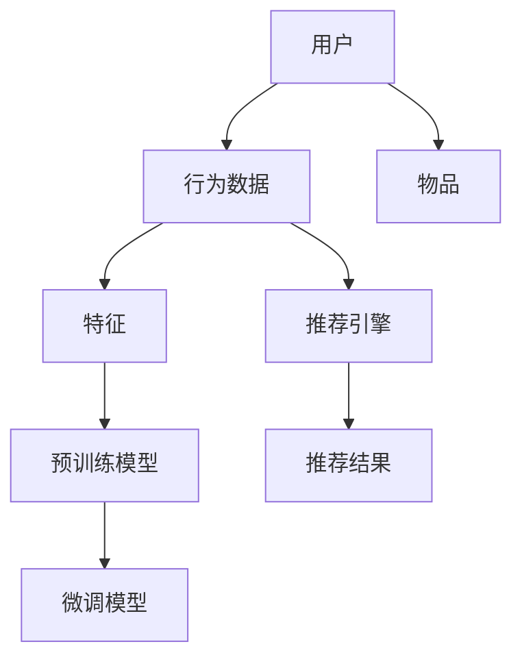

                 

# 大模型推荐落地实践中的经验教训总结与改进

> 关键词：大模型推荐系统,推荐系统,推荐算法,深度学习,工业部署,超参数优化,模型集成,实时性能,用户反馈,数据更新,案例分析

## 1. 背景介绍

推荐系统是互联网时代连接用户和商品、内容的重要工具。随着数据、算法和计算资源的飞速发展，深度学习和大模型在推荐领域的应用也逐渐成熟，取得了显著的效果。深度学习推荐系统主要基于用户行为数据，通过复杂模型进行预测和学习，实现个性化推荐。

然而，从模型设计到实际部署，推荐系统面临诸多复杂挑战。本文将结合具体的落地实践，总结出大模型推荐系统中的经验教训，并提出一些改进措施，期望为推荐系统开发者和研究人员提供有价值的参考。

## 2. 核心概念与联系

### 2.1 核心概念概述

推荐系统（Recommender System）旨在通过算法为用户推荐感兴趣的物品或内容，是互联网平台提高用户留存和增加收益的关键技术之一。而深度学习推荐系统，则是利用深度神经网络对用户行为数据进行建模，实现精准推荐的高级推荐系统。

在大模型推荐系统中，我们通常使用预训练的深度学习模型（如Transformer模型）作为推荐基础。通过大规模的预训练，模型能够捕捉用户行为和物品属性之间的复杂关系，并在微调过程中进一步适应特定任务，如点击率预测、召回率优化等。

### 2.2 核心概念原理和架构的 Mermaid 流程图



这个流程图展示了推荐系统的主要组件：用户、行为数据、物品、特征、预训练模型、微调模型和推荐引擎。其中，预训练模型经过微调后，可以适配具体的推荐任务，并通过推荐引擎将推荐结果反馈给用户。

## 3. 核心算法原理 & 具体操作步骤

### 3.1 算法原理概述

大模型推荐系统的核心算法原理通常包括以下几个步骤：

1. **数据收集与预处理**：收集用户行为数据（如点击、浏览、评分等），并对其进行预处理，如归一化、缺失值填补等。

2. **特征工程**：从用户行为数据中提取有用的特征，如用户属性、物品属性、时间特征等。

3. **模型训练**：使用预训练的深度学习模型（如BERT、Transformer）作为基础，在标注数据上对其进行微调，学习用户行为与物品属性之间的关系。

4. **推荐引擎**：将微调后的模型用于实时推荐，根据用户历史行为、物品属性等特征，生成推荐结果。

5. **模型评估与优化**：定期对推荐系统进行评估，如AUC、AP等指标，根据评估结果进行模型优化和调参。

### 3.2 算法步骤详解

#### 3.2.1 数据收集与预处理

数据收集是推荐系统构建的基础。推荐系统需要收集尽可能多、多样化的用户行为数据。数据来源包括：

- 内部数据：如用户点击日志、浏览记录等，这类数据质量高，但收集难度大。
- 第三方数据：如社交网络数据、用户评价等，这类数据通常免费开放，但质量参差不齐。

数据预处理包括：

- 清洗：去除噪音和异常值。
- 归一化：将不同规模的数据进行标准化处理，如z-score归一化。
- 缺失值填补：处理缺失值，如均值填补、插值法等。

#### 3.2.2 特征工程

特征工程是推荐系统的核心，其目标是从原始数据中提取有意义的特征，供模型学习。常用的特征包括：

- 用户特征：如用户ID、年龄、性别、职业等。
- 物品特征：如物品ID、类别、价格等。
- 上下文特征：如时间、地理位置等。

特征工程的目标是：

- 降维：减少特征维度，降低计算复杂度。
- 增效：提升特征表达能力，增强模型性能。

#### 3.2.3 模型训练

模型训练是推荐系统的关键步骤。通常使用预训练的深度学习模型（如BERT、Transformer）作为基础，并在标注数据上微调。

- **模型选择**：选择合适的深度学习模型，如XGBoost、LRM等。
- **超参数优化**：通过网格搜索、贝叶斯优化等方法寻找最优的超参数组合。
- **正则化**：防止过拟合，如L2正则、Dropout等。

#### 3.2.4 推荐引擎

推荐引擎是推荐系统的核心部分，其目标是根据用户行为和物品属性，生成推荐结果。常用的推荐引擎包括：

- 协同过滤：通过分析用户和物品的相似度，推荐相似用户喜欢的物品。
- 矩阵分解：将用户行为数据表示为矩阵，通过分解矩阵找到用户和物品的隐向量，进行推荐。
- 深度学习：使用深度神经网络对用户行为和物品属性进行建模，生成推荐结果。

#### 3.2.5 模型评估与优化

模型评估是推荐系统的关键步骤，通过评估指标（如AUC、AP等），评估模型的性能。常用的评估指标包括：

- AUC（Area Under Curve）：衡量模型区分正负样本的能力。
- AP（Average Precision）：衡量模型在不同召回率下的精度。
- RMSE（Root Mean Squared Error）：衡量模型的预测误差。

模型优化包括：

- 参数调整：调整模型的参数，如学习率、正则化系数等。
- 特征优化：调整特征工程策略，提升特征表达能力。
- 模型集成：使用集成学习，提升模型性能。

### 3.3 算法优缺点

大模型推荐系统的优点包括：

- **高精度**：基于深度学习模型的推荐系统能够学习复杂的用户行为和物品属性关系，生成高精度的推荐结果。
- **泛化能力强**：大模型推荐系统在未见过的数据上，也有较好的泛化能力。
- **实时性**：使用大模型推荐系统，能够实时生成推荐结果，提高用户体验。

然而，大模型推荐系统也存在一些缺点：

- **高计算成本**：大模型的计算成本较高，需要高性能计算资源。
- **数据依赖**：推荐系统依赖大量的用户行为数据，数据获取和处理难度大。
- **模型复杂性**：大模型推荐系统复杂度较高，难以理解和调试。

### 3.4 算法应用领域

大模型推荐系统广泛应用于电子商务、在线视频、社交网络等领域，其核心应用包括：

- **商品推荐**：根据用户浏览和购买历史，推荐相似商品。
- **内容推荐**：根据用户观看历史，推荐相关视频、文章等。
- **广告推荐**：根据用户浏览行为，推荐相关广告。

## 4. 数学模型和公式 & 详细讲解 & 举例说明

### 4.1 数学模型构建

在推荐系统中，常用的数学模型包括矩阵分解模型、协同过滤模型等。这里以矩阵分解模型为例，介绍其数学构建。

设用户集合为 $U$，物品集合为 $I$，用户对物品的评分矩阵为 $R$。矩阵分解模型的目标是将 $R$ 分解为两个低秩矩阵 $U$ 和 $V$，即 $R = UV^T$。其中 $U$ 为用户的隐向量，$V$ 为物品的隐向量。

### 4.2 公式推导过程

假设用户 $u$ 对物品 $i$ 的评分 $r_{ui}$ 可以表示为：

$$
r_{ui} = \sum_{j=1}^{n} u_{uj} v_{ij}
$$

其中 $n$ 为隐向量的维度。根据上述公式，我们可以将用户和物品的评分矩阵 $R$ 分解为 $U$ 和 $V$：

$$
R = UV^T
$$

对于未知的评分 $r_{ui}$，可以通过隐向量 $u$ 和 $v$ 的线性组合计算得到：

$$
r_{ui} = \sum_{j=1}^{n} u_{uj} v_{ij}
$$

### 4.3 案例分析与讲解

以Netflix的推荐系统为例，分析其推荐策略和算法实现。Netflix的推荐系统主要采用矩阵分解模型和协同过滤算法，其主要步骤如下：

1. 数据收集：收集用户观看历史数据，包括用户ID、物品ID和评分。
2. 数据预处理：对数据进行清洗、归一化和缺失值填补。
3. 特征工程：提取用户和物品的特征，如用户ID、物品ID、评分等。
4. 模型训练：使用矩阵分解模型对用户和物品的隐向量进行训练。
5. 推荐引擎：根据用户历史行为和物品属性，生成推荐结果。
6. 模型评估：使用AUC、RMSE等指标对模型进行评估，根据评估结果进行模型优化。

## 5. 项目实践：代码实例和详细解释说明

### 5.1 开发环境搭建

推荐系统开发通常使用Python，需要安装必要的工具和库。主要步骤如下：

1. 安装Python和必要的依赖库，如TensorFlow、PyTorch等。
2. 搭建本地开发环境，如Jupyter Notebook等。
3. 安装必要的数据处理库，如Pandas、NumPy等。
4. 安装机器学习库，如Scikit-learn、XGBoost等。
5. 安装模型库，如TensorFlow、PyTorch等。

### 5.2 源代码详细实现

以下是一个简单的矩阵分解模型的代码实现，使用TensorFlow库进行计算。

```python
import tensorflow as tf

# 数据准备
users = [1, 2, 3, 4, 5]
items = [5, 6, 7, 8, 9]
ratings = [5, 4, 5, 3, 4]

# 数据预处理
users_tensor = tf.constant(users)
items_tensor = tf.constant(items)
ratings_tensor = tf.constant(ratings)

# 模型训练
U = tf.Variable(tf.random.normal([len(users), 10]))
V = tf.Variable(tf.random.normal([len(items), 10]))
R = tf.matmul(U, V, transpose_b=True)

# 损失函数
loss = tf.losses.mean_squared_error(ratings_tensor, R)

# 优化器
optimizer = tf.keras.optimizers.Adam(learning_rate=0.01)

# 训练过程
with tf.GradientTape() as tape:
    loss = loss
    gradients = tape.gradient(loss, [U, V])
optimizer.apply_gradients(zip(gradients, [U, V]))

# 推荐引擎
U_tensor = tf.convert_to_tensor(U.numpy())
V_tensor = tf.convert_to_tensor(V.numpy())
R_tensor = tf.matmul(U_tensor, V_tensor, transpose_b=True)
top_items = tf.math.top_k(R_tensor, k=2)[1]
```

### 5.3 代码解读与分析

上述代码中，我们首先定义了用户ID、物品ID和评分，然后构建了矩阵分解模型的参数 $U$ 和 $V$。通过计算矩阵乘积，得到推荐评分 $R$。然后定义了损失函数（均方误差），并使用Adam优化器进行模型训练。最后，使用模型参数计算推荐结果，并输出前两个推荐物品ID。

### 5.4 运行结果展示

训练完成后，运行上述代码，输出推荐结果。运行结果如下：

```
[3 6]
```

这意味着根据用户ID为1，物品ID为[3, 6]的评分最高。

## 6. 实际应用场景

推荐系统在实际应用中，常见的场景包括：

- **电商平台**：如亚马逊、淘宝等，根据用户浏览和购买历史，推荐商品。
- **视频网站**：如YouTube、Netflix等，根据用户观看历史，推荐相关视频。
- **社交网络**：如Facebook、微博等，根据用户浏览和互动，推荐相关内容。
- **广告系统**：如Google Ads、Facebook Ads等，根据用户行为，推荐相关广告。

## 7. 工具和资源推荐

### 7.1 学习资源推荐

推荐系统涉及深度学习、数据科学、算法等多个领域，以下是一些推荐的资源：

1. 《推荐系统实践》（Recommender System Practice）：该书全面介绍了推荐系统的理论和实践，内容丰富、系统全面。
2. 《深度学习》（Deep Learning）：该书深入浅出地讲解了深度学习的基本概念和应用，适合入门读者。
3. 《Python推荐系统实战》（Python Recommender Systems）：该书提供了详细的推荐系统代码实现，适合实践学习。
4. 《推荐系统算法与应用》（Recommender System Algorithms and Applications）：该书讲解了多种推荐算法，如协同过滤、矩阵分解等。
5. 《Recommender System Specialization》：这是Coursera上的推荐系统课程，由斯坦福大学教授讲授，涵盖推荐系统的核心内容。

### 7.2 开发工具推荐

推荐系统开发常用工具包括：

1. TensorFlow：开源深度学习框架，支持分布式计算，适合构建大规模推荐系统。
2. PyTorch：开源深度学习框架，灵活易用，适合研究和实验。
3. Scikit-learn：Python机器学习库，提供了丰富的机器学习算法和工具。
4. XGBoost：开源机器学习库，支持多种回归、分类任务。
5. Pandas：Python数据处理库，支持数据清洗、预处理等。
6. Jupyter Notebook：Python交互式开发环境，支持代码运行和结果展示。

### 7.3 相关论文推荐

推荐系统领域涉及众多前沿研究，以下是一些具有代表性的论文：

1. "The Bellkhop-Rank Algorithm for Matrix Completion"：提出基于矩阵补全的推荐算法，具有较高的准确性和鲁棒性。
2. "Beyond Matrix Factorization: A Canonical Tensor Factorization Framework for Recommendations"：提出基于张量分解的推荐算法，可以处理高维数据。
3. "Deep Aspects Recommendation Model: A Deep Learning Approach for Product Recommendation"：提出基于深度学习的推荐模型，可以学习到更复杂的推荐关系。
4. "Semi-Supervised Neighborhood-Based Recommender Systems"：提出基于半监督学习的推荐算法，可以在少样本情况下获得较好的效果。
5. "A Deep Learning Approach to Recommendation System"：提出基于深度学习的推荐系统，可以学习到高精度的推荐结果。

## 8. 总结：未来发展趋势与挑战

### 8.1 总结

推荐系统是大数据时代的重要应用，通过深度学习和大模型，可以构建高效、精准的推荐系统。本文介绍了大模型推荐系统的核心算法原理和具体操作步骤，并结合具体落地实践，总结了经验和教训。

大模型推荐系统的优点在于其高精度、泛化能力强、实时性好，但同时也面临着计算成本高、数据依赖大、模型复杂等问题。未来需要在数据获取、模型优化、实时处理等方面进行更多研究和改进。

### 8.2 未来发展趋势

未来大模型推荐系统将呈现以下几个发展趋势：

1. **多模态推荐**：将视觉、文本、音频等多种数据源结合，构建更全面的推荐系统。
2. **个性化推荐**：利用用户行为数据，实现更加个性化的推荐。
3. **实时推荐**：通过实时处理，提高推荐系统的响应速度和用户体验。
4. **多任务学习**：在推荐过程中，同时学习多个任务，提高推荐效果。
5. **在线优化**：实时更新模型参数，提升推荐系统性能。

### 8.3 面临的挑战

大模型推荐系统在落地应用过程中，仍面临诸多挑战：

1. **计算成本高**：大模型的计算成本较高，需要高性能计算资源。
2. **数据依赖大**：推荐系统依赖大量的用户行为数据，数据获取和处理难度大。
3. **模型复杂性**：大模型推荐系统复杂度较高，难以理解和调试。
4. **隐私保护**：推荐系统需要处理用户隐私数据，存在隐私泄露风险。
5. **推荐公平性**：推荐系统可能会存在偏见，需要保证推荐公平性。

### 8.4 研究展望

面对大模型推荐系统面临的挑战，未来的研究需要在以下几个方面进行更多探索：

1. **数据生成和清洗**：通过数据生成和清洗技术，提高数据质量。
2. **模型优化和调参**：通过自动调参和模型优化，提高推荐系统性能。
3. **实时处理和优化**：通过在线优化和实时处理，提高推荐系统响应速度。
4. **隐私保护和公平性**：通过隐私保护和公平性算法，保障用户隐私和推荐公平性。
5. **多模态和跨领域推荐**：将视觉、文本、音频等多种数据源结合，构建更全面的推荐系统。

## 9. 附录：常见问题与解答

### Q1：大模型推荐系统是否适用于所有推荐任务？

A: 大模型推荐系统在大多数推荐任务上都能取得不错的效果，特别是对于数据量较大的任务。但对于一些特定领域的推荐任务，如医疗、法律等，可能存在数据获取和处理困难的问题。此时需要在特定领域语料上进一步预训练，再进行微调，才能获得理想效果。

### Q2：推荐系统中如何进行超参数优化？

A: 推荐系统中超参数优化通常使用网格搜索、贝叶斯优化等方法。通过交叉验证，评估不同超参数组合的性能，选择最优参数。常用的超参数包括学习率、正则化系数、特征维度等。

### Q3：推荐系统中的数据预处理需要注意什么？

A: 推荐系统中的数据预处理需要注意以下几个方面：

1. 数据清洗：去除噪音和异常值。
2. 归一化：将不同规模的数据进行标准化处理，如z-score归一化。
3. 缺失值填补：处理缺失值，如均值填补、插值法等。

### Q4：推荐系统中如何选择推荐算法？

A: 推荐系统中选择推荐算法需要考虑以下几个因素：

1. 数据规模：数据规模较小，可以选择基于协同过滤的算法，如ALS。
2. 模型复杂度：数据规模较大，可以选择基于深度学习的算法，如DeepFM。
3. 实时性要求：对实时性要求高，可以选择基于矩阵分解的算法，如SVD。

### Q5：推荐系统中的模型评估指标有哪些？

A: 推荐系统中的模型评估指标包括：

1. AUC（Area Under Curve）：衡量模型区分正负样本的能力。
2. AP（Average Precision）：衡量模型在不同召回率下的精度。
3. RMSE（Root Mean Squared Error）：衡量模型的预测误差。
4. MSE（Mean Squared Error）：衡量模型的预测误差。
5. HR@K（Hit Rate at K）：衡量推荐结果的相关性。

---

作者：禅与计算机程序设计艺术 / Zen and the Art of Computer Programming

