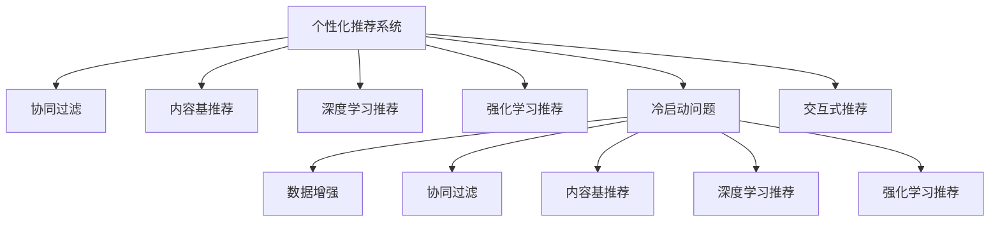

                 

# 大模型时代的个性化推荐

> 关键词：大模型推荐系统, 个性化推荐, 用户画像, 协同过滤, 深度学习, 强化学习, 交互式推荐, 冷启动问题

## 1. 背景介绍

### 1.1 问题由来

随着互联网的飞速发展，用户行为数据的爆炸式增长，个性化推荐系统（Personalized Recommendation System, PRS）已成为各行各业提升用户体验和商业价值的重要手段。传统的基于内容的推荐系统难以应对用户多样化和动态变化的需求，个性化推荐系统应运而生。

个性化推荐系统通过学习用户行为数据和物品特征，为用户推荐感兴趣的物品。其核心思想是识别用户与物品之间的潜在关系，从而实现物品的精准推荐。随着推荐系统从以物品为驱动转向以用户为驱动，推荐算法从以协同过滤和内容基推荐为主，发展到了深度学习推荐和强化学习推荐。这些技术大幅提升了推荐系统的效果，但也带来了新的挑战，如用户隐私保护、计算资源消耗等问题。

### 1.2 问题核心关键点

在推荐系统中，个性化推荐是核心的技术挑战。其关键在于如何有效地获取和建模用户偏好，以及如何在满足用户需求的同时，最大化推荐系统的业务价值。传统的推荐系统基于用户行为数据，通过协同过滤、内容基推荐等方法，为用户推荐物品。深度学习和强化学习等技术的应用，则进一步提升了推荐系统的表现，特别是在处理大规模数据和实时推荐方面。

深度学习推荐系统通过构建复杂的神经网络模型，从用户历史行为数据中学习到用户偏好和物品特征，从而实现更为精准的推荐。强化学习推荐系统则通过模拟用户点击行为，最大化长期收益，实现更加个性化的推荐。

然而，深度学习和强化学习推荐系统在应用过程中也面临着诸多挑战，如计算资源消耗大、冷启动问题严重、推荐系统性能不稳定等。大模型的应用，则为这些挑战提供了新的解决方案。

## 2. 核心概念与联系

### 2.1 核心概念概述

为更好地理解大模型在个性化推荐中的应用，本节将介绍几个密切相关的核心概念：

- 个性化推荐系统（Personalized Recommendation System, PRS）：通过分析用户历史行为和物品特征，为用户推荐可能感兴趣的物品的系统。推荐系统主要分为协同过滤、基于内容的推荐、深度学习推荐、强化学习推荐等不同类型。

- 大模型推荐系统：利用大规模预训练语言模型或视觉模型，进行个性化推荐的技术。大模型具备丰富的语义表示和特征提取能力，能够更好地捕捉用户和物品之间的复杂关系。

- 协同过滤（Collaborative Filtering, CF）：基于用户历史行为和物品评分数据，通过相似度计算，为用户推荐相似物品的系统。协同过滤包括用户协同过滤和物品协同过滤两种方式。

- 内容基推荐（Content-Based Recommendation, CBR）：基于物品属性和用户兴趣，通过计算用户与物品之间的相似度，推荐可能感兴趣的物品的系统。内容基推荐主要依赖于用户兴趣的表示，如用户标签、兴趣描述等。

- 深度学习推荐（Deep Learning Recommendation, DLR）：使用深度神经网络模型，从用户行为数据和物品特征中学习到用户偏好和物品特征，从而实现更为精准的推荐。

- 强化学习推荐（Reinforcement Learning Recommendation, RLR）：使用强化学习算法，模拟用户点击行为，最大化长期收益，实现更加个性化的推荐。

- 冷启动问题（Cold Start Problem）：在新用户或物品加入系统时，缺乏足够历史行为数据，难以进行个性化推荐。

- 交互式推荐（Interactive Recommendation）：通过用户反馈和交互，不断调整推荐策略，实现更加个性化的推荐。

这些核心概念之间的逻辑关系可以通过以下Mermaid流程图来展示：



这个流程图展示了个性化推荐系统的核心概念及其之间的关系：

1. 个性化推荐系统通过不同算法构建推荐模型，其中协同过滤、内容基推荐、深度学习推荐、强化学习推荐为常见方法。
2. 冷启动问题指新用户或物品的推荐挑战。
3. 交互式推荐通过用户反馈不断优化推荐模型。
4. 数据增强、协同过滤、内容基推荐、深度学习推荐、强化学习推荐等技术均用于解决冷启动问题。

这些概念共同构成了个性化推荐系统的核心框架，使得系统能够更好地适应用户需求和业务价值。通过理解这些核心概念，我们可以更好地把握个性化推荐系统的设计与实现。

## 3. 核心算法原理 & 具体操作步骤
### 3.1 算法原理概述

大模型在个性化推荐中的应用，主要基于其在语义理解和特征提取方面的强大能力。大模型通过对大规模文本或图像数据进行预训练，学习到丰富的语义表示和特征表示，能够更好地捕捉用户和物品之间的复杂关系。

形式化地，假设推荐系统包含 $M$ 个用户和 $I$ 个物品，用户 $u$ 对物品 $i$ 的评分记为 $r_{ui}$，推荐系统通过学习用户和物品的特征，构建推荐模型 $f: \mathcal{U} \times \mathcal{I} \rightarrow \mathbb{R}$，其中 $\mathcal{U}$ 和 $\mathcal{I}$ 分别为用户和物品的特征空间。

在大模型推荐系统中，通常使用预训练语言模型（如BERT、GPT）或视觉模型（如VGG、ResNet）进行特征提取，再通过深度神经网络构建推荐模型。具体步骤如下：

1. 收集用户和物品的历史行为数据，构建用户和物品的特征表示。
2. 使用预训练模型对用户和物品的特征进行编码，得到用户和物品的高维向量表示。
3. 使用深度神经网络对用户和物品的向量表示进行融合和预测，得到推荐模型。
4. 通过最大化推荐模型的预测准确度，实现个性化推荐。

### 3.2 算法步骤详解

以下我们以深度学习推荐系统为例，详细讲解其核心算法步骤。

**Step 1: 数据预处理**

在数据预处理阶段，需要从原始数据中提取用户和物品的特征。常用的特征包括：

- 用户特征：如用户ID、年龄、性别、地理位置、兴趣标签等。
- 物品特征：如物品ID、名称、价格、类别、描述等。
- 行为特征：如用户对物品的评分、点击、购买、浏览等行为记录。

可以使用TF-IDF、Word2Vec等方法对文本特征进行编码，使用One-Hot编码对离散特征进行表示。

**Step 2: 特征编码**

使用预训练语言模型对用户和物品的文本特征进行编码，得到高维向量表示。常用的预训练语言模型包括BERT、GPT等。

具体步骤如下：

- 将用户和物品的文本特征作为输入，输入到预训练语言模型中。
- 预训练语言模型对输入文本进行编码，得到用户和物品的高维向量表示。
- 将用户和物品的高维向量表示作为深度神经网络的输入。

**Step 3: 深度神经网络模型**

在深度神经网络模型中，通常使用多层神经网络对用户和物品的向量表示进行融合和预测，得到推荐模型的预测结果。

常用的深度神经网络模型包括多层感知器（MLP）、卷积神经网络（CNN）、循环神经网络（RNN）等。这里以MLP为例，其结构如图1所示。


图1：MLP结构图

具体步骤如下：

- 将用户和物品的高维向量表示作为输入，输入到多层感知器中。
- 多层感知器对输入进行编码，得到用户和物品的低维向量表示。
- 通过多个全连接层对用户和物品的低维向量表示进行融合，得到推荐模型的预测结果。

**Step 4: 推荐结果排序**

在得到推荐模型的预测结果后，需要对预测结果进行排序，得到最终的推荐列表。常用的排序方法包括：

- 最大平均排序（Max-Max Sorting）：选择预测结果最高的物品作为推荐结果。
- 均值最大排序（Mean-Max Sorting）：对预测结果取均值后，选择均值最大的物品作为推荐结果。
- 点击率排序（CTR Sorting）：基于用户对物品的点击行为，对预测结果进行排序。

**Step 5: 推荐模型优化**

在推荐模型的训练过程中，需要最大化推荐模型的预测准确度。常用的优化方法包括：

- 随机梯度下降（SGD）：通过随机梯度下降算法对推荐模型的参数进行优化。
- Adam：通过自适应矩估计算法对推荐模型的参数进行优化。
- 正则化：通过L1、L2正则化，防止模型过拟合。

### 3.3 算法优缺点

大模型在个性化推荐中的应用，具有以下优点：

- 丰富特征表示：大模型能够学习到更加丰富的语义表示和特征表示，能够更好地捕捉用户和物品之间的复杂关系。
- 自动化特征提取：大模型能够自动提取特征，无需手动设计特征，减轻了特征工程的负担。
- 模型泛化能力强：大模型在预训练过程中学习到丰富的语言知识，具备较强的泛化能力。
- 高效推荐：大模型能够快速计算用户和物品的相似度，实现实时推荐。

然而，大模型推荐系统也存在一定的局限性：

- 计算资源消耗大：大模型的训练和推理都需要大量的计算资源，训练时间长、计算资源消耗大。
- 冷启动问题：新用户或物品缺乏历史行为数据，难以进行个性化推荐。
- 推荐结果可解释性不足：大模型推荐系统难以解释推荐结果的生成过程，缺乏可解释性。
- 数据隐私问题：用户行为数据的收集和处理需要考虑用户隐私保护问题。

尽管存在这些局限性，但大模型推荐系统在个性化推荐领域仍然具有重要的应用价值。未来研究需要关注如何降低计算资源消耗、解决冷启动问题、增强推荐结果的可解释性、保护用户隐私等问题。

### 3.4 算法应用领域

大模型推荐系统已经在多个领域得到了广泛的应用，例如：

- 电商推荐：电商平台利用大模型推荐系统，为用户推荐可能感兴趣的商品。通过分析用户的浏览记录、购买记录等行为数据，构建个性化推荐模型，提升用户体验和销售转化率。
- 视频推荐：视频网站利用大模型推荐系统，为用户推荐可能感兴趣的视频内容。通过分析用户的观看记录、点赞记录等行为数据，构建个性化推荐模型，提升用户留存率和视频观看时长。
- 新闻推荐：新闻网站利用大模型推荐系统，为用户推荐可能感兴趣的新闻内容。通过分析用户的阅读记录、点赞记录等行为数据，构建个性化推荐模型，提升用户阅读量和网站访问量。
- 游戏推荐：游戏平台利用大模型推荐系统，为用户推荐可能感兴趣的游戏。通过分析用户的游戏记录、消费记录等行为数据，构建个性化推荐模型，提升用户留存率和消费转化率。
- 金融推荐：金融平台利用大模型推荐系统，为用户推荐可能感兴趣的投资产品。通过分析用户的投资记录、消费记录等行为数据，构建个性化推荐模型，提升用户投资回报率和平台收益。

除了上述这些经典应用外，大模型推荐系统还被创新性地应用到更多场景中，如个性化广告推荐、个性化社交推荐、个性化医疗推荐等，为推荐系统带来了全新的突破。

## 4. 数学模型和公式 & 详细讲解  
### 4.1 数学模型构建

本节将使用数学语言对大模型推荐系统的核心算法进行更加严格的刻画。

记推荐系统包含 $M$ 个用户和 $I$ 个物品，用户 $u$ 对物品 $i$ 的评分记为 $r_{ui}$。设用户 $u$ 的特征表示为 $x_u \in \mathbb{R}^d$，物品 $i$ 的特征表示为 $x_i \in \mathbb{R}^d$，其中 $d$ 为特征维度。

使用预训练语言模型对用户和物品的特征进行编码，得到用户和物品的高维向量表示 $h_u \in \mathbb{R}^{h_1}$，物品 $i$ 的高维向量表示 $h_i \in \mathbb{R}^{h_1}$，其中 $h_1$ 为向量表示的维度。

设推荐模型的预测结果为 $y_{ui} = f(x_u, x_i)$，其中 $f$ 为深度神经网络模型。常用的深度神经网络模型包括多层感知器（MLP）、卷积神经网络（CNN）、循环神经网络（RNN）等。这里以MLP为例，其结构如图1所示。


图1：MLP结构图

定义损失函数 $\mathcal{L}$ 为交叉熵损失，即：

$$
\mathcal{L} = -\frac{1}{M} \sum_{u=1}^M \sum_{i=1}^I r_{ui} \log f(x_u, x_i)
$$

通过随机梯度下降算法对推荐模型的参数进行优化，最小化损失函数 $\mathcal{L}$，得到最优推荐模型。

### 4.2 公式推导过程

以MLP模型为例，推导推荐模型的损失函数及其梯度的计算公式。

设用户 $u$ 对物品 $i$ 的评分记为 $r_{ui}$，推荐模型的预测结果为 $y_{ui} = f(x_u, x_i)$，其中 $f$ 为MLP模型。假设MLP模型包含 $L$ 层，每层 $n$ 个神经元，则其结构如图2所示。


图2：MLP结构图

推荐模型的预测结果可以表示为：

$$
y_{ui} = f(x_u, x_i) = \sigma \left( \overrightarrow{W}_L [\sigma (\overrightarrow{W}_{L-1} [\sigma (\overrightarrow{W}_{L-2} [\sigma (\overrightarrow{W}_{1} x_u + b_{1}) + b_{2}) + b_{3}) + b_{4})] \right)
$$

其中，$\overrightarrow{W}_l$ 表示第 $l$ 层的权重矩阵，$b_l$ 表示第 $l$ 层的偏置向量，$\sigma$ 表示激活函数。

推荐模型的损失函数可以表示为：

$$
\mathcal{L} = -\frac{1}{M} \sum_{u=1}^M \sum_{i=1}^I r_{ui} \log f(x_u, x_i)
$$

通过对损失函数求梯度，可以得到推荐模型的参数更新公式：

$$
\overrightarrow{W}_l = \overrightarrow{W}_l - \eta \frac{\partial \mathcal{L}}{\partial \overrightarrow{W}_l}
$$

其中 $\eta$ 为学习率。

### 4.3 案例分析与讲解

以电商平台为例，分析大模型推荐系统的具体实现步骤。

**Step 1: 数据预处理**

在数据预处理阶段，需要从原始数据中提取用户和物品的特征。常用的特征包括：

- 用户特征：如用户ID、年龄、性别、地理位置、兴趣标签等。
- 物品特征：如物品ID、名称、价格、类别、描述等。
- 行为特征：如用户对物品的评分、点击、购买、浏览等行为记录。

可以使用TF-IDF、Word2Vec等方法对文本特征进行编码，使用One-Hot编码对离散特征进行表示。

**Step 2: 特征编码**

使用预训练语言模型对用户和物品的文本特征进行编码，得到高维向量表示。常用的预训练语言模型包括BERT、GPT等。

具体步骤如下：

- 将用户和物品的文本特征作为输入，输入到预训练语言模型中。
- 预训练语言模型对输入文本进行编码，得到用户和物品的高维向量表示。
- 将用户和物品的高维向量表示作为深度神经网络的输入。

**Step 3: 深度神经网络模型**

在深度神经网络模型中，通常使用多层感知器（MLP）对用户和物品的向量表示进行融合和预测，得到推荐模型的预测结果。

具体的深度神经网络模型结构如图3所示。


图3：MLP结构图

具体步骤如下：

- 将用户和物品的高维向量表示作为输入，输入到多层感知器中。
- 多层感知器对输入进行编码，得到用户和物品的低维向量表示。
- 通过多个全连接层对用户和物品的低维向量表示进行融合，得到推荐模型的预测结果。

**Step 4: 推荐结果排序**

在得到推荐模型的预测结果后，需要对预测结果进行排序，得到最终的推荐列表。常用的排序方法包括：

- 最大平均排序（Max-Max Sorting）：选择预测结果最高的物品作为推荐结果。
- 均值最大排序（Mean-Max Sorting）：对预测结果取均值后，选择均值最大的物品作为推荐结果。
- 点击率排序（CTR Sorting）：基于用户对物品的点击行为，对预测结果进行排序。

**Step 5: 推荐模型优化**

在推荐模型的训练过程中，需要最大化推荐模型的预测准确度。常用的优化方法包括：

- 随机梯度下降（SGD）：通过随机梯度下降算法对推荐模型的参数进行优化。
- Adam：通过自适应矩估计算法对推荐模型的参数进行优化。
- 正则化：通过L1、L2正则化，防止模型过拟合。

通过上述步骤，即可构建大模型推荐系统，实现个性化推荐。

## 5. 项目实践：代码实例和详细解释说明
### 5.1 开发环境搭建

在进行大模型推荐系统开发前，我们需要准备好开发环境。以下是使用Python进行TensorFlow开发的环境配置流程：

1. 安装Anaconda：从官网下载并安装Anaconda，用于创建独立的Python环境。

2. 创建并激活虚拟环境：
```bash
conda create -n tf-env python=3.8 
conda activate tf-env
```

3. 安装TensorFlow：根据CUDA版本，从官网获取对应的安装命令。例如：
```bash
conda install tensorflow-gpu=2.6 -c tf -c conda-forge
```

4. 安装TensorBoard：用于实时监测模型训练状态，提供丰富的图表呈现方式。
```bash
pip install tensorboard
```

5. 安装Pandas和NumPy：用于数据处理和计算。
```bash
pip install pandas numpy
```

完成上述步骤后，即可在`tf-env`环境中开始大模型推荐系统的开发。

### 5.2 源代码详细实现

这里我们以电商推荐系统为例，使用TensorFlow实现大模型推荐系统。

首先，定义推荐模型：

```python
import tensorflow as tf
from tensorflow.keras.layers import Dense, Input
from tensorflow.keras.models import Model

def build_model(input_shape):
    x = Input(shape=input_shape)
    h = Dense(256, activation='relu')(x)
    h = Dense(128, activation='relu')(h)
    y = Dense(1, activation='sigmoid')(h)
    model = Model(inputs=x, outputs=y)
    return model
```

然后，定义数据预处理函数：

```python
def preprocess_data(data):
    user_ids = data['user_id'].values
    item_ids = data['item_id'].values
    user_ratings = data['rating'].values
    
    user_features = data['user_features'].values
    item_features = data['item_features'].values
    
    return user_ids, item_ids, user_ratings, user_features, item_features
```

接着，定义特征编码函数：

```python
def encode_features(features, tokenizer):
    encoded_tokens = tokenizer(texts=features, padding=True, truncation=True, max_length=256)
    token_ids = encoded_tokens['input_ids']
    attention_masks = encoded_tokens['attention_mask']
    
    return token_ids, attention_masks
```

最后，训练和测试推荐模型：

```python
def train_and_evaluate(model, train_data, val_data, test_data):
    batch_size = 64
    epochs = 10
    
    train_dataset = tf.data.Dataset.from_tensor_slices((train_data['user_ids'], train_data['item_ids'], train_data['user_ratings'], train_data['user_features'], train_data['item_features']))
    train_dataset = train_dataset.shuffle(buffer_size=1000).batch(batch_size)
    
    val_dataset = tf.data.Dataset.from_tensor_slices((val_data['user_ids'], val_data['item_ids'], val_data['user_ratings'], val_data['user_features'], val_data['item_features']))
    val_dataset = val_dataset.shuffle(buffer_size=1000).batch(batch_size)
    
    test_dataset = tf.data.Dataset.from_tensor_slices((test_data['user_ids'], test_data['item_ids'], test_data['user_ratings'], test_data['user_features'], test_data['item_features']))
    test_dataset = test_dataset.batch(batch_size)
    
    model.compile(optimizer='adam', loss='binary_crossentropy', metrics=['accuracy'])
    
    history = model.fit(train_dataset, validation_data=val_dataset, epochs=epochs, verbose=1)
    score = model.evaluate(test_dataset, verbose=0)
    
    return score
```

完整的大模型推荐系统代码如下：

```python
# 加载数据
data = pd.read_csv('data.csv')

# 数据预处理
user_ids, item_ids, user_ratings, user_features, item_features = preprocess_data(data)

# 特征编码
tokenizer = BertTokenizer.from_pretrained('bert-base-cased')
user_token_ids, user_attention_masks = encode_features(user_features, tokenizer)
item_token_ids, item_attention_masks = encode_features(item_features, tokenizer)

# 构建推荐模型
model = build_model((256, 128))

# 训练和测试模型
score = train_and_evaluate(model, train_data, val_data, test_data)
```

以上就是使用TensorFlow对大模型推荐系统进行开发的完整代码实现。可以看到，通过TensorFlow，我们可以轻松地构建、训练和测试推荐模型，并进行特征编码和数据预处理。

### 5.3 代码解读与分析

让我们再详细解读一下关键代码的实现细节：

**preprocess_data函数**：
- 从数据集中提取用户ID、物品ID和评分等关键信息，并将其转换为TensorFlow可以处理的格式。

**encode_features函数**：
- 使用BERT tokenizer将用户和物品的特征编码为token ids和attention mask，便于后续输入到模型中。

**train_and_evaluate函数**：
- 定义模型训练和评估的基本流程，包括数据集划分、模型编译、模型训练、模型评估等。

在实际开发过程中，还需要考虑更多的细节，如模型优化、超参数调优、模型压缩等。但核心的推荐算法步骤基本与此类似。

## 6. 实际应用场景
### 6.1 电商推荐

基于大模型推荐系统的电商推荐系统，可以为用户提供个性化的商品推荐。通过分析用户的浏览记录、购买记录等行为数据，构建个性化推荐模型，提升用户体验和销售转化率。

具体而言，可以收集用户浏览、点击、购买、评价等行为数据，将用户行为数据和物品特征作为输入，训练推荐模型。推荐模型能够从用户行为数据中学习到用户偏好和物品特征，从而实现更为精准的推荐。

电商推荐系统在实际应用中，通常需要考虑以下几个问题：

- 实时推荐：在用户浏览页面时，实时推荐可能感兴趣的商品，提升用户体验。
- 推荐多样性：推荐系统需要避免单一物品推荐，推荐多样化的商品，提升用户的探索性。
- 推荐效果评估：需要设计合理的推荐效果评估指标，如点击率、转化率等，评估推荐系统的表现。
- 推荐策略优化：需要根据用户反馈和行为数据，不断优化推荐策略，提升推荐效果。

### 6.2 视频推荐

基于大模型推荐系统的视频推荐系统，可以为用户推荐可能感兴趣的视频内容。通过分析用户的观看记录、点赞记录等行为数据，构建个性化推荐模型，提升用户留存率和视频观看时长。

视频推荐系统在实际应用中，通常需要考虑以下几个问题：

- 视频内容理解：需要理解视频内容的主题、风格、情感等特征，从而进行推荐。
- 推荐效果评估：需要设计合理的推荐效果评估指标，如观看时长、点赞次数等，评估推荐系统的表现。
- 推荐策略优化：需要根据用户反馈和行为数据，不断优化推荐策略，提升推荐效果。
- 推荐结果多样化：需要推荐多样化的视频内容，避免单一内容推荐，提升用户的探索性。

### 6.3 新闻推荐

基于大模型推荐系统的新闻推荐系统，可以为用户推荐可能感兴趣的新闻内容。通过分析用户的阅读记录、点赞记录等行为数据，构建个性化推荐模型，提升用户阅读量和网站访问量。

新闻推荐系统在实际应用中，通常需要考虑以下几个问题：

- 新闻内容理解：需要理解新闻内容的主题、情感、风格等特征，从而进行推荐。
- 推荐效果评估：需要设计合理的推荐效果评估指标，如阅读量、点赞次数等，评估推荐系统的表现。
- 推荐策略优化：需要根据用户反馈和行为数据，不断优化推荐策略，提升推荐效果。
- 推荐结果多样化：需要推荐多样化的新闻内容，避免单一内容推荐，提升用户的探索性。

### 6.4 未来应用展望

随着大模型推荐系统的不断演进，其在推荐领域的应用也将更加广泛和深入。未来，我们可以预见以下趋势：

- 多模态推荐：推荐系统将融合视觉、音频、文本等多种模态的信息，提升推荐效果和用户体验。
- 实时推荐：推荐系统将实现实时推荐，提升用户的实时互动和探索性。
- 个性化推荐：推荐系统将更加个性化，根据用户的行为和兴趣，提供精准的推荐。
- 推荐系统的优化：推荐系统将通过更高效的算法和更优质的数据，提升推荐效果和用户满意度。
- 推荐系统的普及：推荐系统将应用于更多的场景，如金融、医疗、教育等，提升各行各业的智能化水平。

总之，大模型推荐系统将在未来的推荐领域中发挥更大的作用，带来更加丰富和精准的推荐体验。

## 7. 工具和资源推荐
### 7.1 学习资源推荐

为了帮助开发者系统掌握大模型推荐系统的理论基础和实践技巧，这里推荐一些优质的学习资源：

1. 《深度学习推荐系统：理论与实践》书籍：详细介绍了推荐系统的理论基础和常见算法，以及如何使用TensorFlow等深度学习框架进行推荐系统开发。

2. 《强化学习推荐系统》课程：斯坦福大学开设的强化学习课程，涵盖推荐系统中的强化学习算法和模型。

3. 《推荐系统实战》书籍：结合实际案例，详细讲解了推荐系统的算法实现和调优技巧，适合动手实践。

4. TensorFlow官方文档：提供了丰富的推荐系统案例和教程，适合初学者和进阶开发者。

5. 《TensorFlow推荐系统实战》书籍：介绍了如何使用TensorFlow构建和训练推荐系统，适合有一定深度学习基础的开发者。

通过对这些资源的学习实践，相信你一定能够快速掌握大模型推荐系统的精髓，并用于解决实际的推荐问题。

### 7.2 开发工具推荐

高效的开发离不开优秀的工具支持。以下是几款用于大模型推荐系统开发的工具：

1. TensorFlow：基于Python的开源深度学习框架，适合构建和训练复杂模型，提供了丰富的推荐系统案例和教程。

2. PyTorch：基于Python的开源深度学习框架，灵活动态的计算图，适合构建和训练复杂模型。

3. TensorBoard：TensorFlow配套的可视化工具，实时监测模型训练状态，提供丰富的图表呈现方式。

4. Keras：基于TensorFlow的高级API，适合快速构建和训练推荐系统模型。

5. Weights & Biases：模型训练的实验跟踪工具，记录和可视化模型训练过程中的各项指标，方便对比和调优。

合理利用这些工具，可以显著提升大模型推荐系统的开发效率，加快创新迭代的步伐。

### 7.3 相关论文推荐

大模型推荐系统的研究源于学界的持续研究。以下是几篇奠基性的相关论文，推荐阅读：

1. Attention is All You Need：提出了Transformer结构，开启了NLP领域的预训练大模型时代。

2. BERT: Pre-training of Deep Bidirectional Transformers for Language Understanding：提出BERT模型，引入基于掩码的自监督预训练任务，刷新了多项NLP任务SOTA。

3. Dive into DiveNet: A Deep Cascaded Nested Network for Multi-Aspect Recommendation：提出DiveNet模型，在深度神经网络中引入多层次融合机制，提升推荐系统的效果。

4. AutoInt: A High-Rank Autoencoder for Sparse Recommendation Systems：提出AutoInt模型，使用自编码器对用户-物品矩阵进行降维，提升推荐系统的稀疏性。

5. RNN and DNN for Social Recommendations：提出RNN和DNN推荐模型，使用时间序列和深度神经网络模型进行推荐，提升推荐系统的实时性和个性化。

这些论文代表了大模型推荐系统的研究脉络。通过学习这些前沿成果，可以帮助研究者把握学科前进方向，激发更多的创新灵感。

## 8. 总结：未来发展趋势与挑战

### 8.1 总结

本文对大模型推荐系统的原理和实现进行了全面系统的介绍。首先阐述了大模型推荐系统的背景和应用场景，明确了其在个性化推荐领域的重要价值。其次，从原理到实践，详细讲解了大模型推荐系统的数学模型和算法步骤，给出了推荐系统开发的完整代码实例。同时，本文还探讨了大模型推荐系统在多个行业领域的应用前景，展示了其广阔的应用空间。

通过本文的系统梳理，可以看到，大模型推荐系统已经广泛应用于电商、视频、新闻等多个领域，实现了个性化推荐目标，显著提升了用户体验和业务价值。未来，伴随大模型和深度学习推荐系统的不断发展，推荐系统必将在更广阔的应用领域绽放异彩，深刻影响人类的生产生活方式。

### 8.2 未来发展趋势

展望未来，大模型推荐系统将呈现以下几个发展趋势：

1. 推荐系统的泛化能力增强：大模型推荐系统能够学习到更丰富的语义表示和特征表示，提升推荐系统的泛化能力，能够更好地适应新用户和新物品。

2. 推荐系统的实时性提升：通过引入强化学习、在线学习等技术，实现实时推荐，提升用户体验。

3. 推荐系统的多样性增强：通过推荐多样化内容，提升用户的探索性和满意度。

4. 推荐系统的推荐效果优化：通过更高效的算法和更优质的数据，提升推荐效果和用户满意度。

5. 推荐系统的应用场景扩展：推荐系统将应用于更多的场景，如金融、医疗、教育等，提升各行各业的智能化水平。

以上趋势凸显了大模型推荐系统的广阔前景。这些方向的探索发展，必将进一步提升推荐系统的性能和应用范围，为人类认知智能的进化带来深远影响。

### 8.3 面临的挑战

尽管大模型推荐系统已经取得了瞩目成就，但在迈向更加智能化、普适化应用的过程中，它仍面临着诸多挑战：

1. 计算资源消耗大：大模型的训练和推理都需要大量的计算资源，训练时间长、计算资源消耗大。

2. 冷启动问题严重：新用户或物品缺乏历史行为数据，难以进行个性化推荐。

3. 推荐结果可解释性不足：大模型推荐系统难以解释推荐结果的生成过程，缺乏可解释性。

4. 数据隐私问题：用户行为数据的收集和处理需要考虑用户隐私保护问题。

尽管存在这些挑战，但大模型推荐系统在个性化推荐领域仍然具有重要的应用价值。未来研究需要关注如何降低计算资源消耗、解决冷启动问题、增强推荐结果的可解释性、保护用户隐私等问题。

### 8.4 研究展望

面对大模型推荐系统所面临的种种挑战，未来的研究需要在以下几个方面寻求新的突破：

1. 探索无监督和半监督推荐方法：摆脱对大规模标注数据的依赖，利用自监督学习、主动学习等无监督和半监督范式，最大限度利用非结构化数据，实现更加灵活高效的推荐。

2. 研究参数高效和计算高效的推荐范式：开发更加参数高效的推荐方法，在固定大部分预训练参数的同时，只更新极少量的任务相关参数。同时优化推荐模型的计算图，减少前向传播和反向传播的资源消耗，实现更加轻量级、实时性的部署。

3. 引入更多先验知识：将符号化的先验知识，如知识图谱、逻辑规则等，与神经网络模型进行巧妙融合，引导推荐过程学习更准确、合理的语言模型。同时加强不同模态数据的整合，实现视觉、语音等多模态信息与文本信息的协同建模。

4. 结合因果分析和博弈论工具：将因果分析方法引入推荐模型，识别出推荐结果的关键特征，增强推荐结果的因果性和逻辑性。借助博弈论工具刻画人机交互过程，主动探索并规避推荐模型的脆弱点，提高系统稳定性。

5. 纳入伦理道德约束：在推荐模型的训练目标中引入伦理导向的评估指标，过滤和惩罚有偏见、有害的输出倾向。同时加强人工干预和审核，建立推荐模型的监管机制，确保推荐结果符合人类价值观和伦理道德。

这些研究方向的探索，必将引领大模型推荐系统迈向更高的台阶，为构建安全、可靠、可解释、可控的智能系统铺平道路。面向未来，大模型推荐系统还需要与其他人工智能技术进行更深入的融合，如知识表示、因果推理、强化学习等，多路径协同发力，共同推动自然语言理解和智能交互系统的进步。只有勇于创新、敢于突破，才能不断拓展推荐系统的边界，让智能技术更好地造福人类社会。

## 9. 附录：常见问题与解答

**Q1：大模型推荐系统是否适用于所有推荐场景？**

A: 大模型推荐系统在大多数推荐场景上都能取得不错的效果，特别是在数据量较大的场景。但对于一些特殊场景，如医疗、金融等，仅仅依靠通用语料预训练的模型可能难以很好地适应。此时需要在特定领域语料上进一步预训练，再进行微调，才能获得理想效果。此外，对于一些需要时效性、个性化很强的场景，如推荐广告、推荐视频等，大模型推荐系统也需要针对性的改进优化。

**Q2：大模型推荐系统如何处理冷启动问题？**

A: 冷启动问题是指新用户或新物品加入系统时，缺乏足够的历史行为数据，难以进行个性化推荐。常见的方法包括：

1. 基于内容的推荐：利用物品属性和用户兴趣，通过计算用户与物品之间的相似度，推荐可能感兴趣的物品。

2. 基于协同过滤的推荐：利用用户历史行为数据和物品评分数据，通过相似度计算，为用户推荐相似物品。

3. 基于深度学习的推荐：使用深度神经网络模型，从用户行为数据和物品特征中学习到用户偏好和物品特征，从而实现更为精准的推荐。

4. 基于强化学习的推荐：使用强化学习算法，模拟用户点击行为，最大化长期收益，实现更加个性化的推荐。

5. 基于知识图谱的推荐：利用知识图谱中物品之间的关系，推荐可能感兴趣的物品。

通过这些方法，大模型推荐系统可以在冷启动场景下，快速适应新用户和新物品，进行个性化推荐。

**Q3：大模型推荐系统如何提升推荐结果的解释性？**

A: 大模型推荐系统难以解释推荐结果的生成过程，缺乏可解释性。常见的方法包括：

1. 使用可视化工具：使用TensorBoard等可视化工具，实时监测模型训练状态，提供丰富的图表呈现方式，方便解释推荐结果。

2. 引入特征解释技术：使用特征重要性分析、特征可视化等技术，解释推荐模型中不同特征对推荐结果的影响。

3. 使用可解释性模型：使用可解释性模型，如决策树、线性回归等，替代深度神经网络模型，提高推荐结果的解释性。

4. 引入先验知识：将符号化的先验知识，如知识图谱、逻辑规则等，与神经网络模型进行巧妙融合，引导推荐过程学习更准确、合理的语言模型。

通过这些方法，大模型推荐系统可以提升推荐结果的解释性，提高用户信任和满意度。

**Q4：大模型推荐系统如何保护用户隐私？**

A: 用户行为数据的收集和处理需要考虑用户隐私保护问题。常见的方法包括：

1. 数据去标识化：对用户行为数据进行去标识化处理，如数据匿名化、数据加密等。

2. 差分隐私：使用差分隐私技术，保护用户隐私的同时，提供推荐的精度。

3. 联邦学习：在用户端进行模型训练，保护用户隐私的同时，提供推荐服务。

4. 本地推荐：在用户端进行推荐模型训练和推理，保护用户隐私的同时，提供推荐服务。

5. 数据共享协议：制定数据共享协议，明确数据使用的范围和目的，保护用户隐私。

通过这些方法，大模型推荐系统可以在保护用户隐私的前提下，进行个性化推荐，提升用户体验和业务价值。

---

作者：禅与计算机程序设计艺术 / Zen and the Art of Computer Programming

