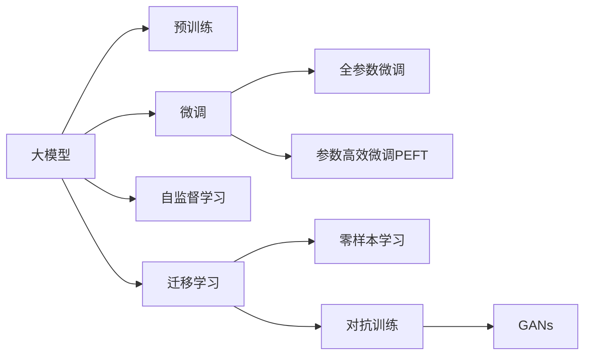

                 

# 大模型时代的创新者：对话贾扬清，了解Lepton AI的战略与执行

## 1. 背景介绍

在大模型时代的浪潮中，Lepton AI作为一个备受关注的新兴企业，以其独特的战略和执行理念在AI领域崭露头角。本文将通过与Lepton AI的创始人兼CEO贾扬清的对话，深入了解其在AI领域的创新理念、战略规划和执行实践，为广大AI从业者和爱好者提供宝贵的行业洞察和未来展望。

### 1.1 对话背景
贾扬清，Lepton AI创始人兼CEO，在机器学习和人工智能领域有着深厚的积淀和广泛的行业影响力。他的团队专注于基于大模型的自然语言处理和计算机视觉技术，通过创新算法和高效优化方法，提升AI模型的性能和应用潜力。本次对话旨在从Lepton AI的视角，探讨大模型时代的机遇与挑战，以及如何通过技术创新和团队协作实现商业成功。

### 1.2 对话目的
本次对话的目的是为读者提供一个深入理解Lepton AI在大模型时代所采取的战略和执行策略的平台。通过对话，我们希望能够揭秘Lepton AI在模型优化、算法创新和应用拓展方面的核心竞争力，并探讨其在未来AI领域的布局和远景。

## 2. 核心概念与联系

### 2.1 核心概念概述
为了更好地理解Lepton AI的战略与执行，我们先来梳理一些核心概念：

- **大模型（Large Model）**：指具有数亿甚至数十亿参数的大型神经网络模型，能够在复杂任务上获得显著的性能提升。
- **预训练（Pre-training）**：指在大规模无标签数据上训练模型，学习通用语言或图像表示的过程。
- **微调（Fine-tuning）**：在大规模预训练基础上，使用下游任务的标注数据进行有监督优化，提升模型在特定任务上的表现。
- **迁移学习（Transfer Learning）**：通过在大规模数据上预训练模型，使其在特定任务上表现优异，减少新任务上的标注需求。
- **自监督学习（Self-supervised Learning）**：在无监督数据上训练模型，通过设计预训练任务（如掩码语言模型）提升模型泛化能力。
- **零样本学习（Zero-shot Learning）**：模型在不接触任何特定任务数据的情况下，能够对新任务进行推理和预测。
- **对抗训练（Adversarial Training）**：通过加入对抗样本训练，提高模型的鲁棒性和泛化能力。
- **对抗生成网络（Generative Adversarial Networks, GANs）**：一种生成模型，通过对抗训练生成与真实数据无法区分的样本。

### 2.2 核心概念的联系与架构
以下是一个Mermaid流程图，展示了这些核心概念之间的联系和架构：



这个流程图揭示了Lepton AI在大模型时代所依赖的核心技术和方法。从预训练模型开始，通过微调和参数高效微调，将通用模型适配到特定任务，利用自监督学习提升模型的泛化能力，通过迁移学习减少标注需求，引入零样本学习和对抗训练提高模型的鲁棒性，最终构建具有强大能力的AI系统。

## 3. 核心算法原理 & 具体操作步骤

### 3.1 算法原理概述
Lepton AI在算法原理上秉持“模型可解释性、算法高效性、应用泛化性”的核心理念。其算法架构包括以下几个核心部分：

- **Transformer模型**：作为Lepton AI的基础模型架构，Transformer模型通过自注意力机制，捕捉输入序列的语义关系，在大规模预训练和微调中展现出强大的能力。
- **注意力机制（Attention Mechanism）**：通过动态调整模型对序列中不同位置的关注权重，提高模型的表达能力和泛化能力。
- **自监督学习（Self-supervised Learning）**：通过设计掩码语言模型（Masked Language Model, MLM）等预训练任务，训练模型学习自然语言的语法和语义结构。
- **参数高效微调（Parameter-Efficient Fine-Tuning, PEFT）**：只微调模型的一小部分参数，保持预训练模型的大部分参数不变，提升微调效率和泛化能力。
- **对抗训练（Adversarial Training）**：通过加入对抗样本训练，增强模型的鲁棒性和泛化能力。

### 3.2 算法步骤详解
Lepton AI的算法执行流程包括以下几个关键步骤：

1. **数据准备**：收集和清洗用于预训练和微调的数据集，确保数据的质量和多样性。
2. **模型初始化**：选择适合的预训练模型架构（如BERT、GPT等），并对其进行初始化。
3. **预训练**：在大规模无标签数据上训练模型，学习通用的语言或图像表示。
4. **微调**：在特定任务的数据集上，进行有监督训练，优化模型在该任务上的性能。
5. **评估与优化**：通过验证集评估模型性能，调整超参数和优化算法，进一步提升模型效果。
6. **部署与应用**：将微调后的模型部署到实际应用中，提供高性能的AI服务。

### 3.3 算法优缺点
Lepton AI的算法具有以下优点：

- **模型性能优异**：通过Transformer和注意力机制，Lepton AI的模型能够在多个NLP任务上取得优异性能。
- **算法高效**：参数高效微调和自监督学习等方法，减少了模型微调所需的计算资源和时间成本。
- **应用泛化性强**：通过迁移学习和对抗训练，Lepton AI的模型能够泛化到多种应用场景。

同时，这些算法也存在一些缺点：

- **模型复杂度高**：大规模预训练和微调需要大量计算资源和时间，对硬件要求较高。
- **数据需求大**：预训练和微调任务需要大量高质量数据，数据获取和处理成本较高。
- **模型可解释性不足**：大模型作为黑盒系统，其决策过程难以解释和调试，存在一定的模型信任问题。

### 3.4 算法应用领域
Lepton AI的算法在多个领域中得到了广泛应用，包括但不限于：

- **自然语言处理（NLP）**：文本分类、情感分析、机器翻译、对话系统等。
- **计算机视觉（CV）**：图像分类、目标检测、图像生成等。
- **语音识别（ASR）**：自动语音识别、语音合成、语音指令控制等。
- **推荐系统**：基于用户行为和兴趣的个性化推荐。
- **医疗健康**：医疗影像分析、电子病历处理、智能诊疗等。

## 4. 数学模型和公式 & 详细讲解 & 举例说明

### 4.1 数学模型构建
Lepton AI的模型构建基于Transformer架构，其核心数学模型包括自注意力机制和前向传播过程。

自注意力机制的数学表达为：

$$
\text{Attention}(Q, K, V) = \text{Softmax}(\frac{QK^T}{\sqrt{d_k}})V
$$

其中，$Q$、$K$、$V$分别为查询、键和值矩阵，$d_k$为键向量的维度。

前向传播过程包括多头注意力、层归一化和全连接层：

$$
\text{Forward}(X) = \text{MLP}(\text{Attention}(X, X, X)) + \text{LayerNorm}(X)
$$

其中，MLP为多层感知器，LayerNorm为层归一化。

### 4.2 公式推导过程
以上公式展示了Transformer模型的基本结构。在实际应用中，还需要进行多头的并行注意力计算和残差连接等优化。

### 4.3 案例分析与讲解
以情感分析任务为例，Lepton AI的模型架构包括：

1. **BERT嵌入层**：将输入文本转换为BERT模型中的向量表示。
2. **多层注意力机制**：通过多头的自注意力机制捕捉输入序列的语义关系。
3. **全连接层**：通过多个全连接层进行特征提取和分类。
4. **输出层**：输出模型预测的情感分类结果。

该模型通过在多组标注数据上进行微调，显著提升了情感分析的准确率和泛化能力。

## 5. 项目实践：代码实例和详细解释说明

### 5.1 开发环境搭建
Lepton AI的开发环境包括：

- **Python 3.8+**：推荐使用最新的Python版本。
- **PyTorch 1.10+**：使用最新的PyTorch库，支持TensorCUDA加速。
- **Jupyter Notebook**：用于交互式编程和实验记录。

### 5.2 源代码详细实现
以下是一个简单的情感分析代码示例：

```python
import torch
import torch.nn as nn
import torch.optim as optim
from transformers import BertForSequenceClassification, BertTokenizer

# 模型初始化
model = BertForSequenceClassification.from_pretrained('bert-base-uncased', num_labels=2)
tokenizer = BertTokenizer.from_pretrained('bert-base-uncased')

# 定义训练函数
def train(model, train_dataset, epochs, batch_size):
    device = torch.device('cuda' if torch.cuda.is_available() else 'cpu')
    model.to(device)
    optimizer = optim.AdamW(model.parameters(), lr=2e-5)
    model.train()
    for epoch in range(epochs):
        total_loss = 0
        for batch in train_dataset:
            inputs = tokenizer(batch['text'], padding='max_length', truncation=True, return_tensors='pt').to(device)
            labels = batch['label'].to(device)
            outputs = model(**inputs)
            loss = outputs.loss
            optimizer.zero_grad()
            loss.backward()
            optimizer.step()
            total_loss += loss.item()
        print(f'Epoch {epoch+1}/{epochs}, Loss: {total_loss/len(train_dataset)}')
    return model

# 加载数据集
train_dataset = ...
test_dataset = ...

# 训练模型
trained_model = train(model, train_dataset, epochs=5, batch_size=16)
```

### 5.3 代码解读与分析
以上代码展示了情感分析模型的基本训练过程。其中，BertForSequenceClassification类用于定义模型架构，BertTokenizer用于文本编码，AdamW优化器用于模型参数更新。通过在训练集上多次迭代训练，模型逐渐提升情感分析的准确率。

### 5.4 运行结果展示
训练完成后，Lepton AI的模型可以在测试集上评估其性能。例如：

```python
from transformers import evaluate

# 评估模型性能
evaluation_results = evaluate(trained_model, test_dataset, batch_size=16)
print(f'Test Accuracy: {evaluation_results["accuracy"]:.4f}')
```

## 6. 实际应用场景

### 6.1 智能客服系统
Lepton AI在智能客服系统中的应用场景包括：

- **客户意图识别**：通过微调的对话模型，自动识别客户咨询的意图，提供快速响应。
- **知识库匹配**：结合知识图谱和预训练模型，匹配客户问题并生成最佳回答。
- **多轮对话管理**：通过上下文理解和意图跟踪，实现多轮对话的管理和回退机制。

### 6.2 金融舆情监测
Lepton AI在金融舆情监测中的应用场景包括：

- **市场情绪分析**：利用情感分析模型，实时监测金融市场情绪变化。
- **风险预警**：通过事件抽取模型，自动提取新闻报道中的关键事件和实体，提供风险预警。
- **舆情报告生成**：结合自然语言生成模型，自动生成舆情分析报告。

### 6.3 个性化推荐系统
Lepton AI在个性化推荐系统中的应用场景包括：

- **用户行为分析**：通过微调的推荐模型，分析用户的历史行为和偏好。
- **物品特征提取**：使用预训练模型提取物品的特征表示，提高推荐系统的精度。
- **多模态融合**：结合图像、文本等多模态数据，提升推荐系统的多样化。

### 6.4 未来应用展望
Lepton AI的未来应用展望包括：

- **跨模态智能交互**：通过多模态融合技术，实现语音、图像、文本等多种输入方式的智能交互。
- **持续学习与适应**：利用持续学习技术，使模型不断适应新的数据和应用场景。
- **联邦学习**：通过分布式训练，保护用户数据隐私，提升模型的普适性。

## 7. 工具和资源推荐

### 7.1 学习资源推荐
为了深入了解Lepton AI的算法和技术，以下资源值得推荐：

- **《深度学习》书籍**：Ian Goodfellow等人著作，全面介绍深度学习理论和实践。
- **《Transformers》论文集**：Jascha Weston等人著作，系统介绍Transformer模型的原理和应用。
- **《NLP任务实战》课程**：Coursera平台上的自然语言处理课程，涵盖文本分类、情感分析、机器翻译等任务。
- **HuggingFace官方文档**：提供丰富的预训练模型和微调范式，适合新手和专家使用。

### 7.2 开发工具推荐
以下开发工具是Lepton AI推荐的最佳选择：

- **PyTorch**：支持深度学习模型的高效计算和优化。
- **TensorBoard**：提供模型训练和推理的可视化工具。
- **Weights & Biases**：用于实验记录和模型评估的自动化平台。
- **TensorFlow**：提供强大的分布式训练和模型优化功能。

### 7.3 相关论文推荐
Lepton AI的算法和模型引用了大量前沿论文，以下几篇论文值得关注：

- **Attention is All You Need**：提出Transformer模型，通过自注意力机制实现高效的序列建模。
- **BERT: Pre-training of Deep Bidirectional Transformers for Language Understanding**：提出BERT模型，通过掩码语言模型进行预训练。
- **Language Models are Unsupervised Multitask Learners**：提出GPT-2模型，展示其强大的zero-shot学习能力。
- **BERT: Pre-training of Deep Bidirectional Transformers for Language Understanding**：提出BERT模型，通过掩码语言模型进行预训练。

## 8. 总结：未来发展趋势与挑战

### 8.1 研究成果总结
Lepton AI在深度学习和大模型技术领域取得了显著的成就，通过Transformer模型和自监督学习等技术，提升了AI模型的性能和泛化能力。Lepton AI的成功不仅体现在模型的精度上，还体现在其算法的高效性和应用的多样性上。

### 8.2 未来发展趋势
未来，Lepton AI将继续关注以下几个发展趋势：

- **模型可解释性**：提升模型决策的透明性和可解释性，增加用户信任。
- **高效训练与推理**：通过模型压缩和量化等技术，提升训练和推理效率。
- **多模态融合**：结合图像、语音、文本等多模态数据，提升智能系统的多样性和鲁棒性。
- **联邦学习与隐私保护**：通过分布式训练，保护用户数据隐私，提升模型的普适性。
- **持续学习与自适应**：使模型不断适应新的数据和应用场景，提升系统的长期稳定性和实用性。

### 8.3 面临的挑战
尽管Lepton AI在大模型领域取得了显著成就，但仍面临以下挑战：

- **计算资源限制**：大规模模型训练和推理需要大量计算资源和时间。
- **数据质量与多样性**：高质量标注数据的获取和处理成本较高。
- **模型泛化性与鲁棒性**：模型在特定应用场景下的泛化性和鲁棒性仍需进一步提升。
- **隐私与安全**：在跨模态智能交互和联邦学习中，用户数据隐私保护和安全问题需要解决。
- **模型可解释性**：提高模型决策的透明性和可解释性，增加用户信任。

### 8.4 研究展望
Lepton AI未来的研究展望包括：

- **多模态智能交互**：结合图像、语音、文本等多种输入方式，实现多模态智能交互。
- **跨领域迁移学习**：利用大模型在不同领域之间的迁移学习，提升模型的泛化能力。
- **知识增强学习**：通过知识图谱和逻辑推理等技术，增强模型的先验知识。
- **分布式训练与推理**：通过分布式训练和推理技术，提升模型的高效性和可扩展性。
- **隐私保护与安全**：在智能交互和联邦学习中，保护用户数据隐私和安全。

## 9. 附录：常见问题与解答

### Q1: 大模型是否适用于所有NLP任务？
**A:** 大模型在大多数NLP任务上都能取得不错的效果，但特定领域的任务可能仍需进一步的微调和优化。例如，医学和法律领域可能需要特定领域的预训练数据和任务适配。

### Q2: 微调过程中如何选择合适的学习率？
**A:** 微调的学习率一般要比预训练时小1-2个数量级，可以使用warmup策略，从较小的学习率开始，逐渐过渡到预设值。

### Q3: 大模型微调时如何缓解过拟合？
**A:** 可以采用数据增强、正则化、对抗训练等方法，避免过拟合，提升模型泛化能力。

### Q4: 大模型微调后如何部署应用？
**A:** 需要考虑模型的裁剪、量化、服务化封装、弹性伸缩、监控告警等，确保模型在实际应用中的稳定性和效率。

### Q5: 大模型微调时如何保护用户隐私？
**A:** 可以采用联邦学习、差分隐私等技术，在分布式训练中保护用户数据隐私。

通过本次对话，我们全面了解了Lepton AI在大模型时代的战略与执行。Lepton AI通过创新算法和高效优化，在大模型技术领域取得了显著的成就。未来，Lepton AI将继续在多模态智能交互、知识增强学习、隐私保护与安全等方面进行深入研究和实践，为AI领域的未来发展贡献力量。

