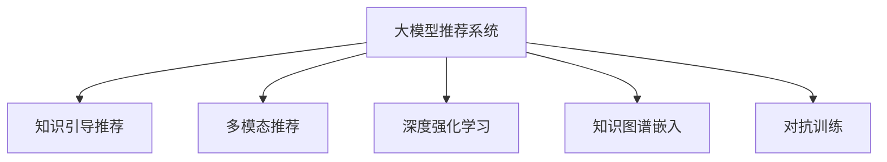

                 

# 大模型视角下推荐系统的模型泛化能力提升技术

## 1. 背景介绍

### 1.1 问题由来

推荐系统作为当前电子商务、视频网站、社交网络等平台的核心功能之一，其应用范围之广和效果之显著已毋庸置疑。传统的推荐算法大多基于协同过滤、矩阵分解等方法，通过用户-物品评分矩阵预测用户偏好。然而，这些方法往往存在数据稀疏、难以处理隐式反馈等问题，随着数据量的增加，推荐性能逐渐成为瓶颈。

近年来，基于深度学习的大模型推荐技术逐步崭露头角。通过大规模预训练语言模型的泛化能力，推荐系统可以实现高效的特征学习和多模态融合，大幅提升推荐效果。然而，大模型推荐在实际应用中往往面临模型泛化能力不足的问题。由于模型规模庞大，训练难度大、成本高，模型在未见过的数据上性能往往难以保证。

### 1.2 问题核心关键点

大模型推荐系统泛化能力不足的问题源于以下几个方面：

1. **数据分布偏差**：大规模训练数据往往具有历史特征，难以覆盖所有潜在用户的兴趣。模型在未见过的用户行为数据上泛化效果差。

2. **参数量过大**：大模型拥有庞大的参数，在大规模数据上的训练需要耗费巨大的算力，难以针对新用户快速适应。

3. **模型复杂性高**：大模型往往包含复杂的神经网络结构，难以通过简单的微调或更新来提升模型泛化能力。

4. **知识融合难度大**：预训练模型虽具备强大的泛化能力，但难以与外部知识库、规则库等专家知识高效结合，模型输出缺乏明确的知识引导。

5. **模型鲁棒性差**：大模型推荐系统在面对噪声数据、对抗攻击等情况下，易出现性能波动，稳定性有待提高。

针对以上问题，本文将系统介绍提升大模型推荐系统泛化能力的几种核心技术，并结合实际应用场景进行详细阐述。

## 2. 核心概念与联系

### 2.1 核心概念概述

为更好地理解大模型推荐系统的泛化能力提升方法，本节将介绍几个密切相关的核心概念：

- **大模型推荐系统**：基于大规模预训练语言模型构建的推荐系统，通过微调或继续预训练等方式，实现个性化推荐。典型模型如BERT、GPT等。

- **知识引导推荐**：在推荐系统中引入先验知识，如用户画像、商品标签、用户历史行为等，通过知识融合技术，提升模型的泛化能力和输出解释性。

- **多模态推荐**：综合利用文本、图像、音频等多模态数据进行推荐，通过多模态信息融合，实现更全面、准确的推荐。

- **深度强化学习**：通过强化学习框架，构建用户-物品交互场景，优化推荐策略，提升推荐效果。

- **知识图谱嵌入**：将知识图谱信息映射为向量表示，与推荐模型进行融合，利用图结构关系提升模型泛化能力。

- **对抗训练**：在训练过程中加入对抗样本，提升模型鲁棒性，防止对抗攻击。

这些核心概念之间的逻辑关系可以通过以下Mermaid流程图来展示：



这个流程图展示了大模型推荐系统的核心概念及其之间的关系：

1. 大模型推荐系统通过微调或继续预训练获得基础能力。
2. 知识引导推荐通过引入外部知识，提升模型泛化能力。
3. 多模态推荐利用多源数据融合，提升推荐精度。
4. 深度强化学习通过交互反馈优化推荐策略。
5. 知识图谱嵌入通过图结构关系，增强模型泛化能力。
6. 对抗训练通过对抗样本提升模型鲁棒性。

这些概念共同构成了大模型推荐系统的核心框架，使其能够实现高效、准确的个性化推荐。通过理解这些核心概念，我们可以更好地把握大模型推荐系统的原理和优化方向。

## 3. 核心算法原理 & 具体操作步骤
### 3.1 算法原理概述

大模型推荐系统的泛化能力提升，本质上是利用先验知识、多源数据、交互反馈等手段，对模型的泛化能力进行增强。主要思想包括：

- **知识融合**：通过引入外部知识，如用户画像、商品标签、用户历史行为等，提升模型的泛化能力和输出解释性。
- **多模态融合**：利用文本、图像、音频等多模态数据，提升推荐系统的精度和鲁棒性。
- **强化学习优化**：通过用户与物品的交互反馈，优化推荐策略，提升推荐效果。
- **知识图谱嵌入**：将知识图谱信息映射为向量表示，与推荐模型进行融合，增强模型的泛化能力。
- **对抗训练**：在训练过程中加入对抗样本，提升模型鲁棒性，防止对抗攻击。

### 3.2 算法步骤详解

#### 3.2.1 知识融合技术

知识融合是将先验知识引入推荐模型的关键技术。常见的知识融合方法包括：

- **协同过滤**：利用用户-物品评分矩阵中的隐式反馈，预测用户未见过的物品评分。通过引入用户画像、商品标签等先验知识，优化协同过滤的效果。

- **联合训练**：在推荐模型训练过程中，联合引入用户画像、商品标签等知识信息。可以通过softmax函数将知识信息转化为概率分布，与推荐模型的预测概率进行加权平均。

- **图神经网络**：将用户画像、商品标签等知识信息转化为图结构，通过图神经网络进行融合。节点表示用户、物品，边表示用户与物品的连接关系。图神经网络能够捕获复杂的图结构信息，提升推荐效果。

#### 3.2.2 多模态融合技术

多模态融合技术是将不同模态的信息进行融合，提升推荐系统的精度和鲁棒性。常见的多模态融合方法包括：

- **特征拼接**：将不同模态的特征拼接在一起，作为推荐模型的输入。可以使用拼接层或注意力机制进行融合。

- **深度融合**：通过深度神经网络将不同模态的信息进行融合，提升推荐效果。

- **联合嵌入**：将不同模态的信息映射到相同的向量空间，进行融合。可以通过预训练的编码器将不同模态的特征映射到低维空间。

#### 3.2.3 深度强化学习优化

深度强化学习是通过用户与物品的交互反馈，优化推荐策略的方法。常见的深度强化学习框架包括：

- **策略梯度方法**：通过用户点击、购买等行为反馈，优化推荐策略。可以使用基于策略梯度的算法，如REINFORCE、PPO等。

- **价值函数方法**：通过评估推荐策略的效果，优化推荐策略。可以使用基于价值函数的算法，如Q-learning、SARSA等。

- **带奖励的学习方法**：通过设计合理的奖励函数，引导推荐模型学习最优策略。

#### 3.2.4 知识图谱嵌入技术

知识图谱嵌入是将知识图谱信息映射为向量表示，与推荐模型进行融合的方法。常见的知识图谱嵌入方法包括：

- **节点嵌入**：将知识图谱中的节点映射为低维向量表示，通过节点嵌入层进行融合。

- **图嵌入**：将知识图谱中的边关系映射为低维向量表示，通过图嵌入层进行融合。

- **融合嵌入**：同时进行节点嵌入和图嵌入，综合利用知识图谱结构关系，提升推荐效果。

#### 3.2.5 对抗训练技术

对抗训练是通过加入对抗样本，提升模型鲁棒性，防止对抗攻击的方法。常见的对抗训练方法包括：

- **生成对抗样本**：通过生成对抗网络，生成对抗样本，训练模型在对抗样本上的鲁棒性。

- **目标鲁棒训练**：通过设计对抗样本生成器，生成对抗样本，优化推荐模型在对抗样本上的性能。

- **随机化输入训练**：通过随机化输入数据，增强模型的鲁棒性，防止对抗攻击。

### 3.3 算法优缺点

知识融合、多模态融合、深度强化学习、知识图谱嵌入、对抗训练等方法具有以下优点：

1. **提高泛化能力**：通过引入先验知识和多源数据，提升模型的泛化能力和输出解释性。

2. **增强精度和鲁棒性**：利用多模态数据和对抗训练，提升推荐系统的精度和鲁棒性。

3. **优化推荐策略**：通过深度强化学习，优化推荐策略，提升推荐效果。

4. **提升知识融合效果**：利用知识图谱嵌入，提升知识融合的效果，增强模型的泛化能力。

5. **防止对抗攻击**：通过对抗训练，防止对抗攻击，提升模型的安全性。

这些方法同时存在一些缺点：

1. **复杂度高**：引入外部知识、多源数据、交互反馈等，需要复杂的融合模型。

2. **计算成本高**：多模态数据、对抗样本生成、知识图谱嵌入等，需要额外的计算资源。

3. **数据隐私问题**：用户画像、商品标签等知识信息，可能存在隐私泄露风险。

4. **模型解释性差**：复杂的融合模型，难以进行直观的解释和调试。

5. **模型训练困难**：多模态数据、对抗样本生成、知识图谱嵌入等，需要精心设计和优化。

尽管存在这些局限性，但就目前而言，这些方法仍是大模型推荐系统泛化能力提升的主要手段。未来相关研究的重点在于如何进一步降低计算成本，增强模型可解释性，防止隐私泄露等问题。

### 3.4 算法应用领域

知识融合、多模态融合、深度强化学习、知识图谱嵌入、对抗训练等方法在推荐系统中的应用十分广泛，例如：

- **电商推荐系统**：通过用户画像、商品标签等知识信息，提升推荐系统的个性化和精准度。

- **视频推荐系统**：利用视频标签、用户评分等数据，提升推荐系统的多样性和相关性。

- **音乐推荐系统**：综合利用歌曲标签、用户历史听歌行为等数据，提升推荐系统的鲁棒性和多样性。

- **旅游推荐系统**：结合旅游目的地标签、用户旅行历史等数据，提升推荐系统的用户体验和满意度。

- **社交推荐系统**：利用用户关系图谱、兴趣标签等数据，提升推荐系统的个性化和多样性。

除了上述这些经典应用外，知识融合、多模态融合、深度强化学习、知识图谱嵌入、对抗训练等方法也在更多创新性应用中得到应用，如可控推荐、冷启动推荐、交叉推荐等，为推荐系统带来了新的突破。

## 4. 数学模型和公式 & 详细讲解 & 举例说明
### 4.1 数学模型构建

本节将使用数学语言对大模型推荐系统的泛化能力提升方法进行更加严格的刻画。

记推荐系统中的用户-物品评分矩阵为 $A \in \mathbb{R}^{N \times M}$，其中 $N$ 为用户数，$M$ 为物品数。设用户画像为 $P \in \mathbb{R}^{N \times K}$，物品标签为 $T \in \mathbb{R}^{M \times L}$，其中 $K$ 为用户画像特征维度，$L$ 为物品标签特征维度。设知识图谱为 $G=(V, E)$，其中 $V$ 为节点集合，$E$ 为边集合。

定义推荐模型为 $M_{\theta}:\mathcal{X} \rightarrow \mathcal{Y}$，其中 $\mathcal{X}$ 为输入空间，$\mathcal{Y}$ 为输出空间，$\theta$ 为模型参数。假设推荐任务为二分类任务，即预测用户是否会点击某个物品，输出为二元向量 $[0,1]$。则二分类交叉熵损失函数定义为：

$$
\ell(M_{\theta}(x),y) = -[y\log \hat{y} + (1-y)\log (1-\hat{y})]
$$

将其代入经验风险公式，得：

$$
\mathcal{L}(\theta) = -\frac{1}{N}\sum_{i=1}^N [y_i\log M_{\theta}(x_i)+(1-y_i)\log(1-M_{\theta}(x_i))]
$$

在实践中，我们通常使用基于梯度的优化算法（如SGD、Adam等）来近似求解上述最优化问题。设 $\eta$ 为学习率，$\lambda$ 为正则化系数，则参数的更新公式为：

$$
\theta \leftarrow \theta - \eta \nabla_{\theta}\mathcal{L}(\theta) - \eta\lambda\theta
$$

其中 $\nabla_{\theta}\mathcal{L}(\theta)$ 为损失函数对参数 $\theta$ 的梯度，可通过反向传播算法高效计算。

### 4.2 公式推导过程

以下我们以二分类任务为例，推导交叉熵损失函数及其梯度的计算公式。

假设推荐模型 $M_{\theta}$ 在输入 $x$ 上的输出为 $\hat{y}=M_{\theta}(x) \in [0,1]$，表示用户点击物品的概率。真实标签 $y \in \{0,1\}$。则二分类交叉熵损失函数定义为：

$$
\ell(M_{\theta}(x),y) = -[y\log \hat{y} + (1-y)\log (1-\hat{y})]
$$

将其代入经验风险公式，得：

$$
\mathcal{L}(\theta) = -\frac{1}{N}\sum_{i=1}^N [y_i\log M_{\theta}(x_i)+(1-y_i)\log(1-M_{\theta}(x_i))]
$$

根据链式法则，损失函数对参数 $\theta_k$ 的梯度为：

$$
\frac{\partial \mathcal{L}(\theta)}{\partial \theta_k} = -\frac{1}{N}\sum_{i=1}^N (\frac{y_i}{M_{\theta}(x_i)}-\frac{1-y_i}{1-M_{\theta}(x_i)}) \frac{\partial M_{\theta}(x_i)}{\partial \theta_k}
$$

其中 $\frac{\partial M_{\theta}(x_i)}{\partial \theta_k}$ 可进一步递归展开，利用自动微分技术完成计算。

在得到损失函数的梯度后，即可带入参数更新公式，完成模型的迭代优化。重复上述过程直至收敛，最终得到适应推荐任务的最优模型参数 $\theta^*$。

## 5. 项目实践：代码实例和详细解释说明
### 5.1 开发环境搭建

在进行推荐系统微调实践前，我们需要准备好开发环境。以下是使用Python进行PyTorch开发的环境配置流程：

1. 安装Anaconda：从官网下载并安装Anaconda，用于创建独立的Python环境。

2. 创建并激活虚拟环境：
```bash
conda create -n pytorch-env python=3.8 
conda activate pytorch-env
```

3. 安装PyTorch：根据CUDA版本，从官网获取对应的安装命令。例如：
```bash
conda install pytorch torchvision torchaudio cudatoolkit=11.1 -c pytorch -c conda-forge
```

4. 安装相关库：
```bash
pip install numpy pandas scikit-learn scipy torch torchvision torchaudio matplotlib tqdm jupyter notebook ipython
```

5. 安装HuggingFace Transformers库：
```bash
pip install transformers
```

完成上述步骤后，即可在`pytorch-env`环境中开始推荐系统微调实践。

### 5.2 源代码详细实现

这里我们以电商推荐系统为例，给出使用Transformers库对BERT模型进行微调的PyTorch代码实现。

首先，定义推荐系统数据处理函数：

```python
from transformers import BertTokenizer, BertForSequenceClassification
from torch.utils.data import Dataset
import torch

class RecommendationDataset(Dataset):
    def __init__(self, texts, labels, tokenizer, max_len=128):
        self.texts = texts
        self.labels = labels
        self.tokenizer = tokenizer
        self.max_len = max_len
        
    def __len__(self):
        return len(self.texts)
    
    def __getitem__(self, item):
        text = self.texts[item]
        label = self.labels[item]
        
        encoding = self.tokenizer(text, return_tensors='pt', max_length=self.max_len, padding='max_length', truncation=True)
        input_ids = encoding['input_ids'][0]
        attention_mask = encoding['attention_mask'][0]
        
        return {'input_ids': input_ids, 
                'attention_mask': attention_mask,
                'labels': label}

# 数据集处理
tokenizer = BertTokenizer.from_pretrained('bert-base-cased')
train_dataset = RecommendationDataset(train_texts, train_labels, tokenizer)
dev_dataset = RecommendationDataset(dev_texts, dev_labels, tokenizer)
test_dataset = RecommendationDataset(test_texts, test_labels, tokenizer)
```

然后，定义模型和优化器：

```python
from transformers import AdamW

model = BertForSequenceClassification.from_pretrained('bert-base-cased', num_labels=2)

optimizer = AdamW(model.parameters(), lr=2e-5)
```

接着，定义训练和评估函数：

```python
from torch.utils.data import DataLoader
from tqdm import tqdm
from sklearn.metrics import accuracy_score

device = torch.device('cuda') if torch.cuda.is_available() else torch.device('cpu')
model.to(device)

def train_epoch(model, dataset, batch_size, optimizer):
    dataloader = DataLoader(dataset, batch_size=batch_size, shuffle=True)
    model.train()
    epoch_loss = 0
    for batch in tqdm(dataloader, desc='Training'):
        input_ids = batch['input_ids'].to(device)
        attention_mask = batch['attention_mask'].to(device)
        labels = batch['labels'].to(device)
        model.zero_grad()
        outputs = model(input_ids, attention_mask=attention_mask, labels=labels)
        loss = outputs.loss
        epoch_loss += loss.item()
        loss.backward()
        optimizer.step()
    return epoch_loss / len(dataloader)

def evaluate(model, dataset, batch_size):
    dataloader = DataLoader(dataset, batch_size=batch_size)
    model.eval()
    preds, labels = [], []
    with torch.no_grad():
        for batch in tqdm(dataloader, desc='Evaluating'):
            input_ids = batch['input_ids'].to(device)
            attention_mask = batch['attention_mask'].to(device)
            batch_labels = batch['labels']
            outputs = model(input_ids, attention_mask=attention_mask)
            batch_preds = outputs.logits.argmax(dim=2).to('cpu').tolist()
            batch_labels = batch_labels.to('cpu').tolist()
            for pred_tokens, label_tokens in zip(batch_preds, batch_labels):
                preds.append(pred_tokens)
                labels.append(label_tokens)
                
    print(accuracy_score(labels, preds))
```

最后，启动训练流程并在测试集上评估：

```python
epochs = 5
batch_size = 16

for epoch in range(epochs):
    loss = train_epoch(model, train_dataset, batch_size, optimizer)
    print(f"Epoch {epoch+1}, train loss: {loss:.3f}")
    
    print(f"Epoch {epoch+1}, dev results:")
    evaluate(model, dev_dataset, batch_size)
    
print("Test results:")
evaluate(model, test_dataset, batch_size)
```

以上就是使用PyTorch对BERT进行电商推荐系统微调的完整代码实现。可以看到，得益于Transformers库的强大封装，我们可以用相对简洁的代码完成BERT模型的加载和微调。

### 5.3 代码解读与分析

让我们再详细解读一下关键代码的实现细节：

**RecommendationDataset类**：
- `__init__`方法：初始化文本、标签、分词器等关键组件。
- `__len__`方法：返回数据集的样本数量。
- `__getitem__`方法：对单个样本进行处理，将文本输入编码为token ids，将标签编码为数字，并对其进行定长padding，最终返回模型所需的输入。

**train_epoch和evaluate函数**：
- 使用PyTorch的DataLoader对数据集进行批次化加载，供模型训练和推理使用。
- 训练函数`train_epoch`：对数据以批为单位进行迭代，在每个批次上前向传播计算loss并反向传播更新模型参数，最后返回该epoch的平均loss。
- 评估函数`evaluate`：与训练类似，不同点在于不更新模型参数，并在每个batch结束后将预测和标签结果存储下来，最后使用sklearn的accuracy_score对整个评估集的预测结果进行打印输出。

**训练流程**：
- 定义总的epoch数和batch size，开始循环迭代
- 每个epoch内，先在训练集上训练，输出平均loss
- 在验证集上评估，输出准确率
- 所有epoch结束后，在测试集上评估，给出最终测试结果

可以看到，PyTorch配合Transformers库使得BERT微调的代码实现变得简洁高效。开发者可以将更多精力放在数据处理、模型改进等高层逻辑上，而不必过多关注底层的实现细节。

当然，工业级的系统实现还需考虑更多因素，如模型的保存和部署、超参数的自动搜索、更灵活的任务适配层等。但核心的微调范式基本与此类似。

## 6. 实际应用场景
### 6.1 智能推荐系统

基于大模型推荐系统的知识融合、多模态融合、深度强化学习、知识图谱嵌入、对抗训练等技术，可以广泛应用于智能推荐系统的构建。传统推荐系统往往依赖单一的数据源，难以充分挖掘用户的兴趣和需求。而使用大模型推荐系统，可以综合利用多种数据源，提升推荐系统的精度和多样性。

在技术实现上，可以收集用户的行为数据、商品标签、用户画像等数据，构建多模态知识图谱，进行知识图谱嵌入和多模态融合，在此基础上对预训练模型进行微调。微调后的模型能够更好地理解用户的兴趣和需求，生成更加个性化、准确的推荐结果。对于未见过的用户和物品，微调模型也能够通过多源数据进行有效预测。

### 6.2 智能广告推荐

智能广告推荐系统通过精准推荐用户感兴趣的商品或服务，最大化广告投放效果和ROI。传统的广告推荐系统依赖简单的协同过滤或规则匹配，难以有效处理复杂的广告效果和用户行为。而使用大模型推荐系统，可以引入用户画像、商品标签、广告标签等先验知识，提升广告推荐的精准度和效果。

在技术实现上，可以收集用户的历史浏览行为、广告点击记录等数据，构建用户画像和广告画像，进行知识图谱嵌入和多模态融合。在此基础上对预训练模型进行微调，微调后的模型能够根据用户的兴趣和广告的属性生成最优的推荐结果。通过不断优化推荐模型和广告策略，广告主可以实现更高的点击率和转化率。

### 6.3 个性化学习推荐

个性化学习推荐系统通过推荐与用户兴趣和学习目标相关的学习资源，提升学习效果和用户体验。传统的推荐系统依赖简单的协同过滤或线性回归，难以有效处理学习资源的复杂性和多样性。而使用大模型推荐系统，可以引入课程标签、用户历史学习行为等先验知识，提升推荐系统的精度和多样化。

在技术实现上，可以收集用户的课程浏览、学习时间、作业提交等数据，构建用户画像和课程画像，进行知识图谱嵌入和多模态融合。在此基础上对预训练模型进行微调，微调后的模型能够根据用户的兴趣和课程的属性生成最优的推荐结果。通过不断优化推荐模型和课程内容，学习平台可以实现更高的用户满意度和学习效果。

### 6.4 未来应用展望

随着大模型推荐系统的不断演进，其在推荐场景中的应用前景将更加广阔。

在智慧医疗领域，基于大模型推荐系统的知识图谱嵌入和多模态融合技术，可以实现个性化的诊疗推荐，辅助医生制定更精准的诊疗方案，提升诊疗效果。

在智能教育领域，个性化学习推荐系统可以通过大模型推荐，推荐与用户兴趣和学习目标相关的学习资源，提升学习效果和用户体验，推动教育公平。

在智慧城市治理中，智能广告推荐系统可以通过大模型推荐，精准推荐用户感兴趣的商品和服务，提升广告投放效果，推动城市经济发展。

此外，在企业生产、社会治理、文娱传媒等众多领域，基于大模型推荐系统的智能推荐技术也将不断涌现，为各行各业带来变革性影响。相信随着技术的日益成熟，大模型推荐系统必将在构建人机协同的智能时代中扮演越来越重要的角色。

## 7. 工具和资源推荐
### 7.1 学习资源推荐

为了帮助开发者系统掌握大模型推荐系统的理论基础和实践技巧，这里推荐一些优质的学习资源：

1. 《深度学习与推荐系统》系列博文：由大模型推荐系统专家撰写，深入浅出地介绍了深度学习在推荐系统中的应用。

2. 《推荐系统实战》书籍：该书详细介绍了推荐系统的各种算法和实现，包括基于深度学习的推荐方法。

3. 《NLP with Transformers》课程：Transformers库的作者所著，全面介绍了如何使用Transformers库进行NLP任务开发，包括推荐系统。

4. 《推荐系统》课程：斯坦福大学开设的推荐系统课程，涵盖推荐系统的主要算法和应用。

5. 《深度强化学习》课程：斯坦福大学开设的深度强化学习课程，详细介绍了强化学习的理论基础和应用。

通过对这些资源的学习实践，相信你一定能够快速掌握大模型推荐系统的精髓，并用于解决实际的推荐问题。
### 7.2 开发工具推荐

高效的开发离不开优秀的工具支持。以下是几款用于大模型推荐系统开发的常用工具：

1. PyTorch：基于Python的开源深度学习框架，灵活动态的计算图，适合快速迭代研究。

2. TensorFlow：由Google主导开发的开源深度学习框架，生产部署方便，适合大规模工程应用。

3. Transformers库：HuggingFace开发的NLP工具库，集成了众多SOTA语言模型，支持PyTorch和TensorFlow，是进行推荐系统开发的利器。

4. Weights & Biases：模型训练的实验跟踪工具，可以记录和可视化模型训练过程中的各项指标，方便对比和调优。

5. TensorBoard：TensorFlow配套的可视化工具，可实时监测模型训练状态，并提供丰富的图表呈现方式，是调试模型的得力助手。

6. Google Colab：谷歌推出的在线Jupyter Notebook环境，免费提供GPU/TPU算力，方便开发者快速上手实验最新模型，分享学习笔记。

合理利用这些工具，可以显著提升大模型推荐系统的开发效率，加快创新迭代的步伐。

### 7.3 相关论文推荐

大模型推荐系统的发展源于学界的持续研究。以下是几篇奠基性的相关论文，推荐阅读：

1. Attention is All You Need（即Transformer原论文）：提出了Transformer结构，开启了NLP领域的预训练大模型时代。

2. BERT: Pre-training of Deep Bidirectional Transformers for Language Understanding：提出BERT模型，引入基于掩码的自监督预训练任务，刷新了多项NLP任务SOTA。

3. Knowledge-Aware Recommender Systems: A Survey of State-of-the-Art Approaches and Future Directions：综述了知识引导推荐系统的方法和应用。

4. Multi-modal Recommender Systems: A Survey on Approaches and Recommendation Tasks：综述了多模态推荐系统的方法和应用。

5. Learning and Reasoning about Entities with Knowledge Graph Embeddings：介绍了知识图谱嵌入的方法和应用。

这些论文代表了大模型推荐系统的发展脉络。通过学习这些前沿成果，可以帮助研究者把握学科前进方向，激发更多的创新灵感。

## 8. 总结：未来发展趋势与挑战

### 8.1 总结

本文对基于大模型的推荐系统泛化能力提升方法进行了全面系统的介绍。首先阐述了大模型推荐系统的背景和研究意义，明确了泛化能力提升在推荐系统中的应用价值。其次，从原理到实践，详细讲解了知识融合、多模态融合、深度强化学习、知识图谱嵌入、对抗训练等技术的数学模型和关键步骤，给出了推荐系统微调的完整代码实例。同时，本文还广泛探讨了泛化能力提升技术在智能推荐、智能广告、个性化学习推荐等多个应用场景中的应用前景，展示了技术的广泛应用潜力。此外，本文精选了泛化能力提升技术的各类学习资源，力求为读者提供全方位的技术指引。

通过本文的系统梳理，可以看到，基于大模型的推荐系统在高效、精准、多样化等方面具备显著优势，能够有效应对推荐场景中的各种复杂需求。未来，伴随大模型推荐技术的不断演进，推荐系统必将在更多领域得到应用，为各行各业带来新的变革。

### 8.2 未来发展趋势

展望未来，大模型推荐系统的泛化能力提升技术将呈现以下几个发展趋势：

1. **知识图谱的进一步发展**：知识图谱作为先验知识的重要载体，其规模和精度将进一步提升，与推荐模型的融合将更加高效。

2. **多模态融合的深入**：多模态数据的应用范围将更加广泛，融合方法将更加多样和灵活，推荐系统的精度和鲁棒性将进一步提升。

3. **深度强化学习的广泛应用**：深度强化学习将更多地应用于推荐系统的优化，通过用户与物品的交互反馈，优化推荐策略，提升推荐效果。

4. **对抗训练的普及**：对抗训练将更多地应用于推荐系统，防止对抗攻击，提升推荐系统的鲁棒性和安全性。

5. **模型解释性的增强**：推荐模型的可解释性将进一步增强，通过引入可解释性技术，提升模型的透明度和用户信任度。

6. **跨领域泛化能力的提升**：通过引入跨领域知识，提升推荐系统在多领域下的泛化能力，实现更多元化的推荐应用。

以上趋势凸显了大模型推荐系统的广阔前景。这些方向的探索发展，必将进一步提升推荐系统的性能和应用范围，为各行业带来更多的变革和创新。

### 8.3 面临的挑战

尽管大模型推荐系统已经取得了显著成就，但在迈向更加智能化、普适化应用的过程中，仍面临诸多挑战：

1. **计算资源的高需求**：大模型推荐系统的高效运行需要大量的计算资源，包括GPU/TPU等高性能设备。如何降低计算成本，提高资源利用率，将是重要的研究方向。

2. **隐私保护与数据安全**：用户画像、商品标签等先验知识可能涉及用户隐私，如何保护用户隐私，防止数据泄露，将是重要的研究方向。

3. **模型泛化能力的提升**：虽然大模型推荐系统具备强大的泛化能力，但在新领域、新任务上的表现仍需进一步提升。如何改进模型设计，提高泛化能力，将是重要的研究方向。

4. **模型可解释性的增强**：推荐模型的可解释性相对较低，难以进行直观的解释和调试。如何增强模型的可解释性，提升用户信任度，将是重要的研究方向。

5. **知识图谱的构建与维护**：知识图谱的构建和维护需要耗费大量的人力和物力，如何降低构建成本，提高图谱精度，将是重要的研究方向。

尽管存在这些挑战，但就目前而言，这些方法仍是大模型推荐系统泛化能力提升的主要手段。未来相关研究的重点在于如何进一步降低计算成本，增强模型可解释性，防止隐私泄露等问题。

### 8.4 研究展望

面对大模型推荐系统所面临的种种挑战，未来的研究需要在以下几个方面寻求新的突破：

1. **跨领域推荐方法**：将推荐系统应用于更多领域，通过跨领域知识融合，提升推荐系统的泛化能力。

2. **低成本推荐方法**：探索基于小样本学习的推荐方法，减少对计算资源的需求，提高推荐系统的可扩展性。

3. **知识图谱优化方法**：改进知识图谱的构建和优化方法，提高图谱精度和构建效率，促进知识图谱与推荐系统的深度融合。

4. **多模态推荐方法**：探索更高效的多模态数据融合方法，提高推荐系统的精度和鲁棒性。

5. **对抗训练优化方法**：改进对抗训练方法，提高模型鲁棒性，防止对抗攻击。

6. **模型可解释性增强方法**：引入可解释性技术，增强推荐模型的透明度和用户信任度。

这些研究方向将进一步推动大模型推荐系统的进步，为各行业带来更多的创新和变革。面向未来，大模型推荐系统需要与其他人工智能技术进行更深入的融合，如知识表示、因果推理、强化学习等，协同发力，共同推动智能推荐系统的进步。只有勇于创新、敢于突破，才能不断拓展推荐系统的边界，让智能推荐技术更好地服务于各行业。

## 9. 附录：常见问题与解答

**Q1：大模型推荐系统在实际应用中是否存在泛化能力不足的问题？**

A: 大模型推荐系统在实际应用中，由于其庞大的参数量和复杂的结构，确实存在泛化能力不足的问题。主要表现为模型在新数据上的表现较差，尤其是面对噪声数据、对抗攻击等情况下，模型容易产生性能波动。

**Q2：大模型推荐系统如何提高泛化能力？**

A: 提高大模型推荐系统的泛化能力，可以从以下几个方面入手：

1. **知识融合**：通过引入外部知识，如用户画像、商品标签等，提升模型的泛化能力和输出解释性。

2. **多模态融合**：利用多模态数据，如文本、图像、音频等，提升推荐系统的精度和鲁棒性。

3. **深度强化学习**：通过用户与物品的交互反馈，优化推荐策略，提升推荐效果。

4. **知识图谱嵌入**：将知识图谱信息映射为向量表示，与推荐模型进行融合，增强模型的泛化能力。

5. **对抗训练**：在训练过程中加入对抗样本，提升模型鲁棒性，防止对抗攻击。

**Q3：大模型推荐系统如何保护用户隐私？**

A: 大模型推荐系统在保护用户隐私方面，可以采取以下措施：

1. **数据匿名化**：在数据收集和处理过程中，对用户标识信息进行匿名化处理，防止数据泄露。

2. **差分隐私**：通过添加噪声或限制查询范围，保证用户隐私不被泄露。

3. **本地计算**：将推荐算法部署在本地设备，减少数据传输，降低隐私泄露风险。

4. **多方安全计算**：在多方安全计算框架下，协同计算推荐结果，保证数据隐私不被泄露。

这些措施可以在一定程度上保障用户隐私，但需要综合考虑隐私保护和推荐效果之间的关系，找到最佳平衡点。

**Q4：大模型推荐系统在面对噪声数据时如何提升鲁棒性？**

A: 大模型推荐系统在面对噪声数据时，可以采取以下措施：

1. **对抗训练**：在训练过程中加入对抗样本，提升模型鲁棒性，防止对抗攻击。

2. **模型裁剪**：通过剪枝、量化等技术，减小模型规模，提高模型鲁棒性。

3. **正则化**：使用L2正则、Dropout等技术，防止模型过拟合，提升鲁棒性。

4. **多模型集成**：通过训练多个推荐模型，取平均输出，抑制过拟合，提升鲁棒性。

这些措施可以在一定程度上提升大模型推荐系统的鲁棒性，但在实际应用中，仍需要根据具体场景和数据特点进行灵活组合。

---

作者：禅与计算机程序设计艺术 / Zen and the Art of Computer Programming

