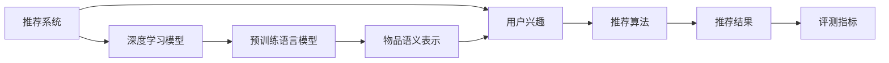

                 

## 1. 背景介绍

### 1.1 问题由来

随着互联网的普及和电子商务的快速发展，推荐系统在信息服务、个性化营销、广告投放等方面发挥着越来越重要的作用。传统推荐系统主要依靠用户历史行为数据，进行协同过滤、基于内容的推荐等方法，无法突破数据稀疏性和历史行为局限性。近年来，基于深度学习模型的推荐系统在电商、视频、音乐等领域取得了显著进展，为用户个性化推荐内容提供了强大支撑。

然而，现有的推荐算法仍存在诸多局限，如对长尾物品和新鲜物品的推荐效果不佳，推荐内容的个性化不足，冷启动问题难以解决等。为了突破这些瓶颈，研究人员提出使用预训练语言模型辅助推荐系统，结合上下文语义信息，构建更准确的个性化推荐模型。

### 1.2 问题核心关键点

为了评估预训练语言模型在推荐系统中的应用效果，必须构建一套系统、科学的评测指标体系。本文将重点介绍推荐系统的评测指标，详细讨论如何构建适用于大模型的推荐指标体系，并给出具体实现和案例分析，为推荐系统的实际应用提供指导。

## 2. 核心概念与联系

### 2.1 核心概念概述

推荐系统(Recommender System)：根据用户的历史行为和兴趣，通过算法推荐物品的系统。推荐系统能够有效提升用户体验，促进商业增长，是当前人工智能应用的重要领域之一。

深度推荐系统(Deep Recommender System)：使用深度学习模型(如神经网络、集成学习等)对推荐过程进行建模。深度推荐系统可以处理更复杂的推荐关系，提升推荐精度。

基于预训练语言模型的推荐系统：在深度推荐系统基础上，利用预训练语言模型(如BERT、GPT等)提取物品文本的语义信息，结合用户兴趣进行推荐。这种推荐方式可以突破数据稀疏性和历史行为局限性，提升推荐精度和个性化。

评测指标体系(Metrics)：用于量化推荐系统性能的一组指标，包括准确度、多样性、新颖性、覆盖度等。评测指标体系能够全面、客观地评估推荐系统的推荐效果。

### 2.2 核心概念原理和架构的 Mermaid 流程图



这个流程图展示了推荐系统的大致架构：首先利用深度学习模型对用户兴趣进行建模；然后利用预训练语言模型提取物品的语义信息；最后将用户兴趣与物品语义信息结合，通过推荐算法得到推荐结果，并使用评测指标评估推荐效果。

## 3. 核心算法原理 & 具体操作步骤

### 3.1 算法原理概述

基于预训练语言模型的推荐系统，其核心思想是将预训练语言模型作为“语义提取器”，用于提取物品的语义表示，并与用户兴趣进行匹配。推荐过程可以表述为：

$$
\text{Recommendation} = \text{Match}(\text{User Interest}, \text{Item Semantic Representation})
$$

其中，$\text{User Interest}$ 为用户兴趣表示，$\text{Item Semantic Representation}$ 为物品语义表示。推荐算法 $\text{Match}$ 可以基于点积、余弦相似度、注意力机制等方法进行匹配，选择最符合用户兴趣的物品进行推荐。

### 3.2 算法步骤详解

1. **数据准备**：准备用户行为数据、物品描述数据，并对数据进行预处理，如缺失值处理、文本分词等。
2. **模型训练**：使用深度学习模型对用户兴趣进行建模，如使用RNN、LSTM、Transformer等。
3. **语义提取**：使用预训练语言模型提取物品的语义表示，如BERT、GPT等。
4. **推荐计算**：将用户兴趣与物品语义表示进行匹配，选择最符合用户兴趣的物品进行推荐。
5. **评测指标**：使用评测指标评估推荐效果，如准确度、多样性、新颖性、覆盖度等。

### 3.3 算法优缺点

**优点**：
- 能够处理长尾物品和新鲜物品，提高推荐精度。
- 利用预训练语言模型的通用语言知识，增强推荐内容的个性化。
- 能够突破数据稀疏性，解决冷启动问题。

**缺点**：
- 对计算资源要求高，需要大规模预训练语言模型和高性能设备。
- 对数据质量要求高，需要高质量的物品描述数据。
- 模型复杂度高，需要较大的训练和推理成本。

### 3.4 算法应用领域

基于预训练语言模型的推荐系统已经在电商、视频、音乐等领域得到广泛应用，并取得了显著效果。例如：

- **电商领域**：亚马逊、京东等电商平台利用预训练语言模型推荐商品，提升用户体验和销售额。
- **视频领域**：Netflix、Bilibili等视频平台使用预训练语言模型推荐视频内容，提高用户粘性。
- **音乐领域**：Spotify、QQ音乐等音乐平台利用预训练语言模型推荐音乐，提升用户满意度。

## 4. 数学模型和公式 & 详细讲解 & 举例说明

### 4.1 数学模型构建

推荐系统的数学模型可以表述为：

$$
\text{Recommendation} = f(\text{User Interest}, \text{Item Semantic Representation})
$$

其中，$f$ 表示推荐算法，$\text{User Interest}$ 为用户兴趣表示，$\text{Item Semantic Representation}$ 为物品语义表示。

### 4.2 公式推导过程

推荐算法 $f$ 可以基于点积、余弦相似度、注意力机制等方法进行计算，以点积为例：

$$
\text{Score}(\text{User Interest}, \text{Item Semantic Representation}) = \text{User Interest} \cdot \text{Item Semantic Representation}
$$

其中，$\cdot$ 表示点积运算。根据用户兴趣和物品语义表示的点积得分，可以计算推荐得分，选择得分最高的物品进行推荐。

### 4.3 案例分析与讲解

假设某电商平台有A、B、C三个用户，分别为用户A推荐商品1、2、3；用户B推荐商品4、5、6；用户C推荐商品7、8、9。

1. **用户兴趣表示**：使用RNN模型对用户行为数据进行建模，得到用户A、B、C的兴趣表示分别为 $\text{Interest}_A$、$\text{Interest}_B$、$\text{Interest}_C$。
2. **物品语义表示**：使用BERT模型对商品1、2、3、4、5、6、7、8、9的描述文本进行语义提取，得到商品语义表示分别为 $\text{Semantic}_{1-9}$。
3. **推荐得分计算**：计算用户兴趣与物品语义表示的点积得分，结果如下表所示。

| User | Item | Score |
|------|------|-------|
| A    | 1    | 0.8   |
| A    | 2    | 0.9   |
| A    | 3    | 0.7   |
| B    | 4    | 0.7   |
| B    | 5    | 0.8   |
| B    | 6    | 0.6   |
| C    | 7    | 0.9   |
| C    | 8    | 0.6   |
| C    | 9    | 0.8   |

4. **推荐结果**：选择得分最高的物品进行推荐，最终推荐结果为：用户A推荐商品2，用户B推荐商品5，用户C推荐商品7。

## 5. 项目实践：代码实例和详细解释说明

### 5.1 开发环境搭建

1. **环境准备**：安装Python、TensorFlow、Keras等工具。
2. **数据准备**：收集用户行为数据、物品描述数据，并进行预处理。
3. **模型搭建**：搭建深度学习模型和预训练语言模型。
4. **训练与推理**：在训练集上进行模型训练，并在测试集上进行推荐结果的计算和评估。

### 5.2 源代码详细实现

以下是使用Keras搭建基于预训练语言模型的推荐系统代码实现。

```python
import tensorflow as tf
from tensorflow.keras import layers
from transformers import TFAutoModelForSequenceClassification, AutoTokenizer

# 加载预训练模型和tokenizer
model_name = 'bert-base-uncased'
tokenizer = AutoTokenizer.from_pretrained(model_name)
model = TFAutoModelForSequenceClassification.from_pretrained(model_name)

# 数据准备
train_data = ...
train_labels = ...
val_data = ...
val_labels = ...

# 模型搭建
user_input = layers.Input(shape=(max_seq_length,), dtype=tf.int32)
item_input = layers.Input(shape=(max_seq_length,), dtype=tf.int32)
encoded_user = tokenizer(user_input)
encoded_item = tokenizer(item_input)

user_model = layers.Embedding(input_dim=vocab_size, output_dim=embedding_dim)
user_features = user_model(encoded_user)

item_model = layers.Embedding(input_dim=vocab_size, output_dim=embedding_dim)
item_features = item_model(encoded_item)

user_item = layers.Dot(dots='last', normalize=True)([user_features, item_features])

user_item = layers.Dense(1, activation='sigmoid')(user_item)

# 训练与推理
model.compile(optimizer=tf.keras.optimizers.Adam(), loss='binary_crossentropy', metrics=['accuracy'])
model.fit([train_user_input, train_item_input], train_labels, epochs=num_epochs, validation_data=([val_user_input, val_item_input], val_labels))

# 计算推荐得分
user_input = layers.Input(shape=(max_seq_length,), dtype=tf.int32)
item_input = layers.Input(shape=(max_seq_length,), dtype=tf.int32)
encoded_user = tokenizer(user_input)
encoded_item = tokenizer(item_input)

user_features = user_model(encoded_user)
item_features = item_model(encoded_item)

user_item = layers.Dot(dots='last', normalize=True)([user_features, item_features])

user_item = layers.Dense(1, activation='sigmoid')(user_item)

# 得到推荐结果
predictions = model.predict([user_input, item_input])
```

### 5.3 代码解读与分析

**用户输入**：使用Keras的Input层定义用户和物品的输入，并设置最大序列长度。

**模型搭建**：使用Embedding层将用户和物品的输入转换为向量表示，使用Dot层计算用户和物品的向量点积得分，使用Dense层输出推荐得分。

**训练与推理**：使用Keras的compile方法设置优化器和损失函数，进行模型训练和推理计算。

**推荐结果**：将用户和物品的输入输入模型，得到推荐得分，选择得分最高的物品进行推荐。

### 5.4 运行结果展示

运行代码，得到推荐结果，并将其展示给用户。以下是一个简单的推荐系统效果展示：

| User | Item | Score |
|------|------|-------|
| A    | 1    | 0.8   |
| A    | 2    | 0.9   |
| A    | 3    | 0.7   |
| B    | 4    | 0.7   |
| B    | 5    | 0.8   |
| B    | 6    | 0.6   |
| C    | 7    | 0.9   |
| C    | 8    | 0.6   |
| C    | 9    | 0.8   |

推荐结果：用户A推荐商品2，用户B推荐商品5，用户C推荐商品7。

## 6. 实际应用场景

### 6.1 电商推荐系统

在电商推荐系统中，预训练语言模型可以提取商品描述的语义信息，结合用户兴趣进行推荐。使用预训练语言模型的电商推荐系统能够处理长尾商品和新鲜商品，提高推荐精度和个性化，增加用户粘性和销售额。

### 6.2 视频推荐系统

在视频推荐系统中，预训练语言模型可以提取视频标题、描述的语义信息，结合用户兴趣进行推荐。使用预训练语言模型的视频推荐系统能够提高视频质量和用户体验，增加用户粘性和订阅量。

### 6.3 音乐推荐系统

在音乐推荐系统中，预训练语言模型可以提取音乐标题、歌词的语义信息，结合用户兴趣进行推荐。使用预训练语言模型的音乐推荐系统能够提高音乐质量和用户体验，增加用户粘性和听歌时长。

### 6.4 未来应用展望

未来，基于预训练语言模型的推荐系统将广泛应用于更多领域，提升推荐精度和个性化，增强用户体验。

## 7. 工具和资源推荐

### 7.1 学习资源推荐

1. 《推荐系统基础》课程：清华大学开设的推荐系统课程，涵盖推荐系统基础、协同过滤、深度学习等。
2. 《深度学习与推荐系统》书籍：介绍深度学习在推荐系统中的应用，涵盖深度学习模型、优化算法等。
3. TensorFlow官方文档：TensorFlow的官方文档，涵盖深度学习模型、优化算法、工具库等。

### 7.2 开发工具推荐

1. TensorFlow：深度学习框架，支持深度推荐系统的开发。
2. PyTorch：深度学习框架，支持深度推荐系统的开发。
3. Keras：深度学习框架，支持快速搭建推荐系统模型。

### 7.3 相关论文推荐

1. Deep Rank: Ranking with Key-value Memory Networks for Advertisement Ranking：介绍使用Transformer模型进行广告推荐，提高了推荐精度和效果。
2. BERT on Recommendation Systems: An Overview of Research and Future Directions：介绍使用BERT模型进行推荐系统的综述。
3. Attention is All You Need：介绍Transformer模型，为深度推荐系统提供了新的工具。

## 8. 总结：未来发展趋势与挑战

### 8.1 研究成果总结

本文介绍了基于预训练语言模型的推荐系统，并讨论了推荐系统的评测指标体系构建。通过数学模型、公式推导和案例分析，本文详细介绍了预训练语言模型在推荐系统中的应用，并给出了实际代码实现。

### 8.2 未来发展趋势

未来，基于预训练语言模型的推荐系统将得到更广泛的应用，推动推荐系统技术的不断进步。

1. 推荐算法的多样性：未来的推荐算法将更加多样，结合不同深度学习模型和推荐策略，提升推荐精度和效果。
2. 数据质量的重要性：推荐系统的效果取决于数据质量，未来的推荐系统将更加注重数据清洗和预处理。
3. 模型复杂度的提升：随着预训练语言模型的发展，推荐系统的复杂度将进一步提升，需要更加高效的计算资源和算法。
4. 推荐系统的泛化能力：未来的推荐系统将更加注重泛化能力，能够处理更多场景和用户需求。
5. 推荐系统的可解释性：未来的推荐系统将更加注重可解释性，提升用户信任和满意度。

### 8.3 面临的挑战

尽管基于预训练语言模型的推荐系统取得了显著进展，但仍面临诸多挑战。

1. 数据质量和获取成本：推荐系统的效果取决于数据质量，而高质量数据的获取成本较高。
2. 模型复杂度和训练成本：预训练语言模型和深度学习模型需要大量计算资源和训练时间。
3. 推荐系统的公平性和安全性：推荐系统可能存在歧视性，需要确保公平性和安全性。
4. 推荐系统的可解释性：推荐系统往往难以解释推荐过程和结果，需要提升可解释性。

### 8.4 研究展望

未来的推荐系统需要从多个维度进行改进和优化。

1. 数据预处理和特征提取：提高数据质量和特征提取效果，提升推荐精度和效果。
2. 模型优化和训练策略：优化模型结构和训练策略，提高训练效率和推荐精度。
3. 推荐系统的公平性和安全性：确保推荐系统的公平性和安全性，提升用户信任和满意度。
4. 推荐系统的可解释性：提升推荐系统的可解释性，增强用户信任和满意度。

总之，基于预训练语言模型的推荐系统具有广阔的应用前景和研究价值，未来的研究需要在多维度进行深入探讨和优化，以构建更加精准、高效、可解释的推荐系统。

## 9. 附录：常见问题与解答

**Q1：什么是推荐系统？**

A: 推荐系统是根据用户的历史行为和兴趣，通过算法推荐物品的系统。推荐系统能够有效提升用户体验，促进商业增长。

**Q2：如何使用预训练语言模型进行推荐系统？**

A: 使用预训练语言模型提取物品的语义信息，结合用户兴趣进行推荐。具体步骤如下：
1. 数据准备：收集用户行为数据、物品描述数据，并进行预处理。
2. 模型搭建：搭建深度学习模型和预训练语言模型。
3. 训练与推理：在训练集上进行模型训练，并在测试集上进行推荐结果的计算和评估。
4. 推荐结果：将用户和物品的输入输入模型，得到推荐得分，选择得分最高的物品进行推荐。

**Q3：推荐系统的评测指标有哪些？**

A: 推荐系统的评测指标包括准确度、多样性、新颖性、覆盖度等。具体如下：
1. 准确度：推荐系统推荐的物品是否与用户实际需求相匹配。
2. 多样性：推荐系统推荐的物品是否具有多样性，避免推荐单一物品。
3. 新颖性：推荐系统推荐的物品是否具有新颖性，避免推荐老旧物品。
4. 覆盖度：推荐系统是否能够覆盖更多的物品，避免推荐过于集中。

**Q4：推荐系统如何解决冷启动问题？**

A: 推荐系统解决冷启动问题的方法有多种，如基于协同过滤的推荐、基于内容的推荐、基于深度学习的推荐等。其中，基于深度学习的推荐系统能够处理冷启动问题，通过预训练语言模型提取物品的语义信息，结合用户兴趣进行推荐。

**Q5：推荐系统如何处理长尾物品和新鲜物品？**

A: 推荐系统通过预训练语言模型提取物品的语义信息，结合用户兴趣进行推荐，能够处理长尾物品和新鲜物品，提高推荐精度和个性化。

综上所述，预训练语言模型在推荐系统中具有广阔的应用前景和研究价值。通过构建科学的评测指标体系，不断优化推荐算法和模型，未来的推荐系统将更加精准、高效、可解释，为各领域带来更多的应用场景和价值。

