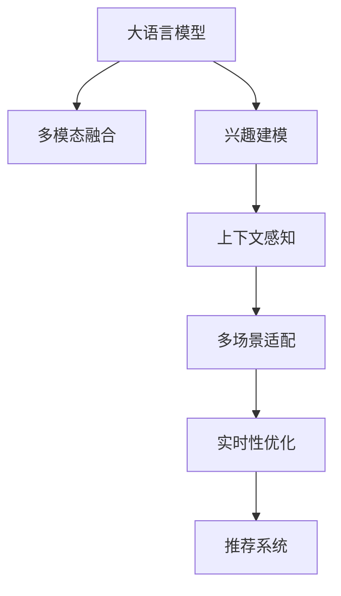

                 

# 大模型辅助的推荐系统多场景兴趣融合

## 1. 背景介绍

在互联网时代，用户对个性化推荐系统（Personalized Recommendation System, PRS）的需求日益增长。从音乐、视频到商品、文章，推荐系统无处不在，影响着人们的日常生活和消费习惯。然而，随着推荐场景的不断扩展，用户兴趣的多样性和复杂性也愈发显著。如何在多场景下精准捕捉和融合用户的兴趣，成为推荐系统面临的一大挑战。

### 1.1 问题由来

现有的推荐系统多以用户历史行为为依据，通过协同过滤、基于内容的推荐等算法进行兴趣建模和推荐。但这些方法在用户兴趣发生变化时，难以实时调整推荐策略。在多场景下，用户兴趣和偏好难以通过单一模型进行全面理解。例如，同一个人在电商平台上可能倾向于购买电子产品，而在音乐平台上却偏好摇滚乐，传统推荐系统难以同时满足这两方面的需求。

大语言模型（Large Language Model, LLM）作为自然语言处理（NLP）领域的突破性成果，具备丰富的语言理解和生成能力。在推荐场景中，利用大语言模型进行兴趣建模和推荐，有望突破传统方法的局限，提供更加全面、动态、个性化的推荐服务。

### 1.2 问题核心关键点

大语言模型辅助的推荐系统，旨在通过多场景下的多模态信息融合，捕捉和理解用户的兴趣，从而进行精准推荐。具体而言，关键点包括：

- 多模态融合：将文本、图像、音频等多模态信息进行融合，全面理解用户兴趣。
- 兴趣建模：通过文本描述、标签等特征，提取用户的多样化兴趣，建立兴趣模型。
- 上下文感知：结合用户行为上下文，动态调整推荐策略，提升推荐效果。
- 多场景适配：在不同推荐场景下，灵活应用兴趣模型，满足用户的多样化需求。
- 实时性优化：在大模型基础上进行微调，保证推荐结果的实时性和高效性。

这些关键点共同构成了大语言模型辅助的推荐系统的重要研究框架，为推荐系统的高效性和智能化提供了新的思路。

## 2. 核心概念与联系

### 2.1 核心概念概述

为更好地理解基于大语言模型的推荐系统，本节将介绍几个关键概念：

- 大语言模型：以自回归（如GPT）或自编码（如BERT）模型为代表的大规模预训练语言模型。通过在大规模无标签文本语料上进行预训练，学习到丰富的语言知识和常识。
- 推荐系统：通过算法为用户推荐物品的系统，旨在提升用户体验和满意度。
- 多模态融合：将文本、图像、音频等多模态信息进行融合，全面理解用户兴趣。
- 兴趣建模：通过文本描述、标签等特征，提取用户的多样化兴趣，建立兴趣模型。
- 上下文感知：结合用户行为上下文，动态调整推荐策略，提升推荐效果。
- 多场景适配：在不同推荐场景下，灵活应用兴趣模型，满足用户的多样化需求。
- 实时性优化：在大模型基础上进行微调，保证推荐结果的实时性和高效性。

这些概念之间的逻辑关系可以通过以下Mermaid流程图来展示：



这个流程图展示了大语言模型辅助推荐系统的主要流程：

1. 大语言模型通过预训练获得基础能力。
2. 多模态融合模块将多场景下的信息进行融合。
3. 兴趣建模模块通过文本描述、标签等特征，提取用户的多样化兴趣。
4. 上下文感知模块结合用户行为上下文，动态调整推荐策略。
5. 多场景适配模块在不同场景下灵活应用兴趣模型。
6. 实时性优化模块在大模型基础上进行微调，保证推荐结果的实时性和高效性。
7. 推荐系统通过融合以上模块，提供个性化推荐服务。

## 3. 核心算法原理 & 具体操作步骤
### 3.1 算法原理概述

大语言模型辅助的推荐系统，本质上是一个多模态信息融合与兴趣建模的过程。其核心思想是：利用大语言模型对多场景下的信息进行全面理解和建模，从而得到用户的多样化兴趣。

具体而言，该算法将用户在不同场景下的行为信息进行融合，利用大语言模型进行文本描述生成、情感分析等任务，提取用户的多样化兴趣。然后，结合上下文信息，动态调整推荐策略，最终得到个性化的推荐结果。

### 3.2 算法步骤详解

大语言模型辅助的推荐系统通常包括以下几个关键步骤：

**Step 1: 数据收集与预处理**
- 收集用户在电商、音乐、社交等不同场景下的行为数据，如浏览记录、点击记录、评论等。
- 对不同模态的数据进行预处理，如文本分词、图像特征提取、音频特征提取等。

**Step 2: 信息融合与表示**
- 利用大语言模型对不同模态的数据进行融合，生成统一的文本表示。
- 将文本表示输入到预训练模型中进行向量映射，得到低维向量表示。

**Step 3: 兴趣建模**
- 对用户的多样化兴趣进行建模，通常采用文本分类、情感分析等任务。
- 通过分类器或回归器等模型，对用户的兴趣进行分类或打分，建立兴趣模型。

**Step 4: 上下文感知与动态推荐**
- 结合用户行为上下文，如时间、地点、设备等，动态调整推荐策略。
- 通过上下文感知模块，对用户的兴趣模型进行动态更新，生成推荐结果。

**Step 5: 多场景适配与优化**
- 在不同推荐场景下，灵活应用兴趣模型。
- 利用模型微调技术，针对特定场景进行参数优化，提升推荐效果。

### 3.3 算法优缺点

基于大语言模型的推荐系统具有以下优点：

- 多场景适应性强：能够处理不同场景下的多样化信息，满足用户的多样化需求。
- 个性化推荐效果显著：通过全面理解用户兴趣，提供更加精准的推荐结果。
- 实时性优化：利用模型微调技术，保证推荐结果的实时性和高效性。

同时，该方法也存在一定的局限性：

- 计算资源消耗大：大规模预训练模型和大数据融合，对计算资源需求较高。
- 数据隐私问题：多模态数据融合涉及用户隐私保护，需要设计合理的隐私保护机制。
- 模型可解释性不足：大语言模型作为黑盒模型，难以对其内部决策过程进行解释。

尽管存在这些局限性，但就目前而言，基于大语言模型的推荐系统方法仍是大数据和人工智能领域的重要研究范式，具有广泛的应用前景。

### 3.4 算法应用领域

基于大语言模型的推荐系统，在电商、音乐、视频、社交等多个领域中已经得到了广泛应用，具体如下：

- 电商推荐：利用用户浏览、购买记录等行为数据，结合产品描述、评论等文本信息，进行商品推荐。
- 音乐推荐：通过分析用户的听歌历史、评分等行为数据，结合歌曲标签、歌词等文本信息，进行音乐推荐。
- 视频推荐：结合用户观看历史、点赞、评论等行为数据，利用视频标题、描述等文本信息，进行视频推荐。
- 社交推荐：通过分析用户在社交网络上的互动行为，结合用户社交关系等上下文信息，进行内容推荐。

除了以上这些经典应用外，大语言模型推荐系统还将在更多领域得到创新应用，如智能家居、金融理财等，为用户带来更加丰富、个性化的推荐体验。

## 4. 数学模型和公式 & 详细讲解 & 举例说明

### 4.1 数学模型构建

本节将使用数学语言对大语言模型辅助的推荐系统进行更加严格的刻画。

记用户在电商平台上的一次浏览行为为 $(x_i, y_i)$，其中 $x_i$ 为浏览内容（如商品图片、名称），$y_i$ 为行为标签（如浏览、点击、购买）。假设用户在不同场景下的行为数据为 $\{(x_i, y_i)\}_{i=1}^N$。

定义大语言模型 $M_{\theta}$，输入 $x$ 的输出为 $z=M_{\theta}(x)$，其中 $z$ 为文本表示向量。假设用户在多个场景下的行为向量为 $\{x_1, x_2, ..., x_m\}$，模型输出对应的文本向量为 $\{z_1, z_2, ..., z_m\}$。

定义推荐函数 $F$，将用户的多样化兴趣映射为推荐结果：

$$
r_i = F(\theta, z_i)
$$

其中 $\theta$ 为模型参数。

### 4.2 公式推导过程

以下我们以电商推荐为例，推导推荐函数 $F$ 的计算公式。

假设用户在电商平台上的一次浏览行为为 $(x_i, y_i)$，其中 $x_i$ 为商品名称，$y_i$ 为浏览行为标签。假设用户在多个场景下的行为数据为 $\{(x_i, y_i)\}_{i=1}^N$。

定义大语言模型 $M_{\theta}$，输入 $x$ 的输出为 $z=M_{\theta}(x)$，其中 $z$ 为文本表示向量。假设用户在多个场景下的行为向量为 $\{x_1, x_2, ..., x_m\}$，模型输出对应的文本向量为 $\{z_1, z_2, ..., z_m\}$。

假设用户的历史浏览行为数据为 $\{(x_i, y_i)\}_{i=1}^N$，其中 $y_i$ 为行为标签，表示用户对商品 $x_i$ 的兴趣强度。

定义推荐函数 $F$，将用户的多样化兴趣映射为推荐结果：

$$
r_i = F(\theta, z_i)
$$

其中 $z_i$ 为商品名称对应的文本表示向量。

为了提升推荐效果，需要综合考虑用户的多样化兴趣和行为上下文。假设用户的历史浏览行为数据为 $\{(x_i, y_i)\}_{i=1}^N$，其中 $y_i$ 为行为标签，表示用户对商品 $x_i$ 的兴趣强度。

定义上下文特征 $c_i$，如时间、地点、设备等，对推荐结果进行修正。假设用户的历史浏览行为数据为 $\{(x_i, y_i)\}_{i=1}^N$，其中 $y_i$ 为行为标签，表示用户对商品 $x_i$ 的兴趣强度。

最终推荐结果为：

$$
r_i = F(\theta, z_i, c_i)
$$

其中 $z_i$ 为商品名称对应的文本表示向量，$c_i$ 为上下文特征向量。

### 4.3 案例分析与讲解

以电商推荐为例，分析大语言模型辅助推荐系统的实现细节。

首先，将用户浏览行为数据进行融合，生成统一的文本表示。假设用户在多个场景下的行为向量为 $\{x_1, x_2, ..., x_m\}$，模型输出对应的文本向量为 $\{z_1, z_2, ..., z_m\}$。

然后，利用文本分类任务，对用户的多样化兴趣进行建模。假设用户的历史浏览行为数据为 $\{(x_i, y_i)\}_{i=1}^N$，其中 $y_i$ 为行为标签，表示用户对商品 $x_i$ 的兴趣强度。

定义推荐函数 $F$，将用户的多样化兴趣映射为推荐结果：

$$
r_i = F(\theta, z_i)
$$

其中 $z_i$ 为商品名称对应的文本表示向量。

为了提升推荐效果，需要综合考虑用户的多样化兴趣和行为上下文。假设用户的历史浏览行为数据为 $\{(x_i, y_i)\}_{i=1}^N$，其中 $y_i$ 为行为标签，表示用户对商品 $x_i$ 的兴趣强度。

定义上下文特征 $c_i$，如时间、地点、设备等，对推荐结果进行修正。假设用户的历史浏览行为数据为 $\{(x_i, y_i)\}_{i=1}^N$，其中 $y_i$ 为行为标签，表示用户对商品 $x_i$ 的兴趣强度。

最终推荐结果为：

$$
r_i = F(\theta, z_i, c_i)
$$

其中 $z_i$ 为商品名称对应的文本表示向量，$c_i$ 为上下文特征向量。

## 5. 项目实践：代码实例和详细解释说明
### 5.1 开发环境搭建

在进行推荐系统项目开发前，我们需要准备好开发环境。以下是使用Python进行PyTorch开发的环境配置流程：

1. 安装Anaconda：从官网下载并安装Anaconda，用于创建独立的Python环境。

2. 创建并激活虚拟环境：
```bash
conda create -n pytorch-env python=3.8 
conda activate pytorch-env
```

3. 安装PyTorch：根据CUDA版本，从官网获取对应的安装命令。例如：
```bash
conda install pytorch torchvision torchaudio cudatoolkit=11.1 -c pytorch -c conda-forge
```

4. 安装Transformers库：
```bash
pip install transformers
```

5. 安装各类工具包：
```bash
pip install numpy pandas scikit-learn matplotlib tqdm jupyter notebook ipython
```

完成上述步骤后，即可在`pytorch-env`环境中开始推荐系统项目开发。

### 5.2 源代码详细实现

下面我们以电商推荐为例，给出使用Transformers库对BERT模型进行推荐系统开发的PyTorch代码实现。

首先，定义数据处理函数：

```python
from transformers import BertTokenizer
from torch.utils.data import Dataset
import torch

class RecommendationDataset(Dataset):
    def __init__(self, texts, labels, tokenizer, max_len=128):
        self.texts = texts
        self.labels = labels
        self.tokenizer = tokenizer
        self.max_len = max_len
        
    def __len__(self):
        return len(self.texts)
    
    def __getitem__(self, item):
        text = self.texts[item]
        label = self.labels[item]
        
        encoding = self.tokenizer(text, return_tensors='pt', max_length=self.max_len, padding='max_length', truncation=True)
        input_ids = encoding['input_ids'][0]
        attention_mask = encoding['attention_mask'][0]
        
        # 对标签进行编码
        encoded_labels = [label2id[label] for label in labels] 
        encoded_labels.extend([label2id['O']] * (self.max_len - len(encoded_labels)))
        labels = torch.tensor(encoded_labels, dtype=torch.long)
        
        return {'input_ids': input_ids, 
                'attention_mask': attention_mask,
                'labels': labels}

# 标签与id的映射
label2id = {'O': 0, 'buy': 1, 'click': 2, 'view': 3}
id2label = {v: k for k, v in label2id.items()}

# 创建dataset
tokenizer = BertTokenizer.from_pretrained('bert-base-cased')

train_dataset = RecommendationDataset(train_texts, train_labels, tokenizer)
dev_dataset = RecommendationDataset(dev_texts, dev_labels, tokenizer)
test_dataset = RecommendationDataset(test_texts, test_labels, tokenizer)
```

然后，定义模型和优化器：

```python
from transformers import BertForTokenClassification, AdamW

model = BertForTokenClassification.from_pretrained('bert-base-cased', num_labels=len(label2id))

optimizer = AdamW(model.parameters(), lr=2e-5)
```

接着，定义训练和评估函数：

```python
from torch.utils.data import DataLoader
from tqdm import tqdm
from sklearn.metrics import classification_report

device = torch.device('cuda') if torch.cuda.is_available() else torch.device('cpu')
model.to(device)

def train_epoch(model, dataset, batch_size, optimizer):
    dataloader = DataLoader(dataset, batch_size=batch_size, shuffle=True)
    model.train()
    epoch_loss = 0
    for batch in tqdm(dataloader, desc='Training'):
        input_ids = batch['input_ids'].to(device)
        attention_mask = batch['attention_mask'].to(device)
        labels = batch['labels'].to(device)
        model.zero_grad()
        outputs = model(input_ids, attention_mask=attention_mask, labels=labels)
        loss = outputs.loss
        epoch_loss += loss.item()
        loss.backward()
        optimizer.step()
    return epoch_loss / len(dataloader)

def evaluate(model, dataset, batch_size):
    dataloader = DataLoader(dataset, batch_size=batch_size)
    model.eval()
    preds, labels = [], []
    with torch.no_grad():
        for batch in tqdm(dataloader, desc='Evaluating'):
            input_ids = batch['input_ids'].to(device)
            attention_mask = batch['attention_mask'].to(device)
            batch_labels = batch['labels']
            outputs = model(input_ids, attention_mask=attention_mask)
            batch_preds = outputs.logits.argmax(dim=2).to('cpu').tolist()
            batch_labels = batch_labels.to('cpu').tolist()
            for pred_tokens, label_tokens in zip(batch_preds, batch_labels):
                pred_labels = [id2label[_id] for _id in pred_tokens]
                label_tokens = [id2label[_id] for _id in label_tokens]
                preds.append(pred_labels[:len(label_tokens)])
                labels.append(label_tokens)
                
    print(classification_report(labels, preds))
```

最后，启动训练流程并在测试集上评估：

```python
epochs = 5
batch_size = 16

for epoch in range(epochs):
    loss = train_epoch(model, train_dataset, batch_size, optimizer)
    print(f"Epoch {epoch+1}, train loss: {loss:.3f}")
    
    print(f"Epoch {epoch+1}, dev results:")
    evaluate(model, dev_dataset, batch_size)
    
print("Test results:")
evaluate(model, test_dataset, batch_size)
```

以上就是使用PyTorch对BERT进行电商推荐任务开发的完整代码实现。可以看到，得益于Transformers库的强大封装，我们可以用相对简洁的代码完成BERT模型的加载和微调。

### 5.3 代码解读与分析

让我们再详细解读一下关键代码的实现细节：

**RecommendationDataset类**：
- `__init__`方法：初始化文本、标签、分词器等关键组件。
- `__len__`方法：返回数据集的样本数量。
- `__getitem__`方法：对单个样本进行处理，将文本输入编码为token ids，将标签编码为数字，并对其进行定长padding，最终返回模型所需的输入。

**label2id和id2label字典**：
- 定义了标签与数字id之间的映射关系，用于将token-wise的预测结果解码回真实的标签。

**训练和评估函数**：
- 使用PyTorch的DataLoader对数据集进行批次化加载，供模型训练和推理使用。
- 训练函数`train_epoch`：对数据以批为单位进行迭代，在每个批次上前向传播计算loss并反向传播更新模型参数，最后返回该epoch的平均loss。
- 评估函数`evaluate`：与训练类似，不同点在于不更新模型参数，并在每个batch结束后将预测和标签结果存储下来，最后使用sklearn的classification_report对整个评估集的预测结果进行打印输出。

**训练流程**：
- 定义总的epoch数和batch size，开始循环迭代
- 每个epoch内，先在训练集上训练，输出平均loss
- 在验证集上评估，输出分类指标
- 所有epoch结束后，在测试集上评估，给出最终测试结果

可以看到，PyTorch配合Transformers库使得BERT电商推荐任务的代码实现变得简洁高效。开发者可以将更多精力放在数据处理、模型改进等高层逻辑上，而不必过多关注底层的实现细节。

当然，工业级的系统实现还需考虑更多因素，如模型的保存和部署、超参数的自动搜索、更灵活的任务适配层等。但核心的推荐范式基本与此类似。

## 6. 实际应用场景
### 6.1 智能推荐引擎

基于大语言模型的推荐系统，可以应用于智能推荐引擎的构建。传统推荐引擎往往以用户历史行为为依据，难以捕捉用户的实时兴趣和多样化需求。而利用大语言模型进行多场景信息融合，可以全面理解用户的多样化兴趣，实现更加个性化和实时的推荐。

在技术实现上，可以收集用户在不同场景下的行为数据，如浏览、点击、评分等，利用大语言模型进行文本描述生成、情感分析等任务，提取用户的多样化兴趣。然后，结合上下文信息，动态调整推荐策略，生成个性化的推荐结果。

智能推荐引擎可以帮助电商平台、社交平台等提供更加精准、多样化的推荐服务，提升用户体验和满意度。

### 6.2 个性化推荐广告

广告推荐是推荐系统的重要应用之一。传统广告推荐往往以用户历史行为为依据，难以捕捉用户的实时兴趣和多样化需求。而利用大语言模型进行多场景信息融合，可以全面理解用户的多样化兴趣，实现更加个性化和实时的广告推荐。

在技术实现上，可以收集用户在多个场景下的行为数据，如浏览、点击、评价等，利用大语言模型进行文本描述生成、情感分析等任务，提取用户的多样化兴趣。然后，结合上下文信息，动态调整广告推荐策略，生成个性化的广告结果。

个性化推荐广告可以帮助广告主精准定位目标用户，提升广告点击率和转化率，同时减少无效广告的浪费，提高广告投放效率。

### 6.3 智能家居控制

智能家居控制是推荐系统的另一个重要应用。传统智能家居控制往往以固定规则为依据，难以实现个性化和实时控制。而利用大语言模型进行多场景信息融合，可以全面理解用户的个性化需求，实现更加智能化的家居控制。

在技术实现上，可以收集用户在多个场景下的行为数据，如语音指令、遥控器操作、手机APP操作等，利用大语言模型进行文本描述生成、情感分析等任务，提取用户的个性化需求。然后，结合上下文信息，动态调整家居控制策略，生成个性化的家居控制结果。

智能家居控制可以帮助用户实现更加智能、便捷的生活体验，提升生活质量。

### 6.4 未来应用展望

随着大语言模型和推荐系统的不断发展，基于大语言模型的推荐系统将呈现以下几个发展趋势：

1. 模型规模持续增大。随着算力成本的下降和数据规模的扩张，预训练语言模型的参数量还将持续增长。超大规模语言模型蕴含的丰富语言知识，有望支撑更加复杂多变的推荐场景。
2. 多模态融合更加深入。未来将探索更加高效的多模态融合技术，实现文本、图像、音频等多种信息的高效融合，全面理解用户的多样化需求。
3. 上下文感知更加全面。未来将探索更加复杂的上下文感知技术，结合用户的行为上下文、时间、地点、设备等多种信息，动态调整推荐策略，提升推荐效果。
4. 实时性优化更加高效。未来将探索更加高效的模型微调技术，保证推荐结果的实时性和高效性，满足用户的即时需求。
5. 个性化推荐更加精准。未来将探索更加精准的个性化推荐技术，利用大语言模型进行多场景信息融合，全面理解用户的多样化需求，提供更加精准的推荐结果。

以上趋势凸显了大语言模型辅助的推荐系统的广阔前景。这些方向的探索发展，必将进一步提升推荐系统的性能和智能化，为人工智能技术在垂直行业的落地应用提供新的思路。

## 7. 工具和资源推荐
### 7.1 学习资源推荐

为了帮助开发者系统掌握大语言模型辅助推荐系统的理论基础和实践技巧，这里推荐一些优质的学习资源：

1. 《深度学习推荐系统：理论、算法与应用》系列博文：由大模型技术专家撰写，深入浅出地介绍了推荐系统的基本原理和前沿算法。

2. 《推荐系统实战》课程：由斯坦福大学开设的推荐系统课程，涵盖推荐系统的经典算法和实际案例，适合初学者入门。

3. 《推荐系统基础与实践》书籍：推荐系统的经典教材，涵盖推荐系统的基本原理和前沿算法，适合深入学习。

4. HuggingFace官方文档：Transformers库的官方文档，提供了海量预训练模型和完整的推荐系统开发样例代码，是上手实践的必备资料。

5. RECOMMEND开源项目：推荐系统基准测试集，涵盖多种推荐场景下的数据集和评价指标，助力推荐系统技术发展。

通过对这些资源的学习实践，相信你一定能够快速掌握大语言模型辅助推荐系统的精髓，并用于解决实际的推荐问题。
###  7.2 开发工具推荐

高效的开发离不开优秀的工具支持。以下是几款用于大语言模型辅助推荐系统开发的常用工具：

1. PyTorch：基于Python的开源深度学习框架，灵活动态的计算图，适合快速迭代研究。大部分预训练语言模型都有PyTorch版本的实现。

2. TensorFlow：由Google主导开发的开源深度学习框架，生产部署方便，适合大规模工程应用。同样有丰富的预训练语言模型资源。

3. Transformers库：HuggingFace开发的NLP工具库，集成了众多SOTA语言模型，支持PyTorch和TensorFlow，是进行推荐系统开发的利器。

4. Weights & Biases：模型训练的实验跟踪工具，可以记录和可视化模型训练过程中的各项指标，方便对比和调优。与主流深度学习框架无缝集成。

5. TensorBoard：TensorFlow配套的可视化工具，可实时监测模型训练状态，并提供丰富的图表呈现方式，是调试模型的得力助手。

6. Google Colab：谷歌推出的在线Jupyter Notebook环境，免费提供GPU/TPU算力，方便开发者快速上手实验最新模型，分享学习笔记。

合理利用这些工具，可以显著提升大语言模型辅助推荐系统的开发效率，加快创新迭代的步伐。

### 7.3 相关论文推荐

大语言模型和推荐系统的不断发展源于学界的持续研究。以下是几篇奠基性的相关论文，推荐阅读：

1. Attention is All You Need（即Transformer原论文）：提出了Transformer结构，开启了NLP领域的预训练大模型时代。

2. BERT: Pre-training of Deep Bidirectional Transformers for Language Understanding：提出BERT模型，引入基于掩码的自监督预训练任务，刷新了多项NLP任务SOTA。

3. Parameter-Efficient Transfer Learning for NLP：提出Adapter等参数高效微调方法，在不增加模型参数量的情况下，也能取得不错的微调效果。

4. Self-Attentive Encoder-Decoder Models for Conversational Recommendations：提出基于自注意力机制的推荐模型，实现推荐场景下的多场景信息融合。

5. Diverse Recommendation for E-commerce Platforms using Deep Learning：提出基于深度学习的推荐模型，用于电商平台的个性化推荐。

6. Multi-Task Multi-Modality Attention Network：提出基于多模态注意力机制的推荐模型，实现多场景下的信息融合。

这些论文代表了大语言模型辅助推荐系统的发展脉络。通过学习这些前沿成果，可以帮助研究者把握学科前进方向，激发更多的创新灵感。

## 8. 总结：未来发展趋势与挑战
### 8.1 总结

本文对基于大语言模型的推荐系统进行全面系统的介绍。首先阐述了推荐系统的背景和问题由来，明确了多模态信息融合和大语言模型辅助推荐系统的研究意义。其次，从原理到实践，详细讲解了大语言模型辅助推荐系统的数学原理和关键步骤，给出了推荐任务开发的完整代码实例。同时，本文还广泛探讨了推荐系统在电商、音乐、智能家居等多个领域的应用前景，展示了大语言模型辅助推荐系统的巨大潜力。此外，本文精选了推荐系统的各类学习资源，力求为读者提供全方位的技术指引。

通过本文的系统梳理，可以看到，基于大语言模型的推荐系统在大数据和人工智能领域具有重要的应用前景，能够通过全面理解用户的多样化需求，实现更加精准、多样化的推荐服务。

### 8.2 未来发展趋势

展望未来，大语言模型辅助的推荐系统将呈现以下几个发展趋势：

1. 模型规模持续增大。随着算力成本的下降和数据规模的扩张，预训练语言模型的参数量还将持续增长。超大规模语言模型蕴含的丰富语言知识，有望支撑更加复杂多变的推荐场景。

2. 多模态融合更加深入。未来将探索更加高效的多模态融合技术，实现文本、图像、音频等多种信息的高效融合，全面理解用户的多样化需求。

3. 上下文感知更加全面。未来将探索更加复杂的上下文感知技术，结合用户的行为上下文、时间、地点、设备等多种信息，动态调整推荐策略，提升推荐效果。

4. 实时性优化更加高效。未来将探索更加高效的模型微调技术，保证推荐结果的实时性和高效性，满足用户的即时需求。

5. 个性化推荐更加精准。未来将探索更加精准的个性化推荐技术，利用大语言模型进行多场景信息融合，全面理解用户的多样化需求，提供更加精准的推荐结果。

以上趋势凸显了大语言模型辅助推荐系统的广阔前景。这些方向的探索发展，必将进一步提升推荐系统的性能和智能化，为人工智能技术在垂直行业的落地应用提供新的思路。

### 8.3 面临的挑战

尽管大语言模型辅助的推荐系统已经取得了瞩目成就，但在迈向更加智能化、普适化应用的过程中，它仍面临着诸多挑战：

1. 计算资源消耗大。大规模预训练模型和大数据融合，对计算资源需求较高。

2. 数据隐私问题。多模态数据融合涉及用户隐私保护，需要设计合理的隐私保护机制。

3. 模型可解释性不足。大语言模型作为黑盒模型，难以对其内部决策过程进行解释。

4. 实时性优化有待提高。大语言模型辅助推荐系统在实时性优化方面仍有较大提升空间。

尽管存在这些局限性，但就目前而言，基于大语言模型的推荐系统方法仍是大数据和人工智能领域的重要研究范式，具有广泛的应用前景。

### 8.4 研究展望

面对大语言模型辅助推荐系统所面临的种种挑战，未来的研究需要在以下几个方面寻求新的突破：

1. 探索无监督和半监督推荐方法。摆脱对大规模标注数据的依赖，利用自监督学习、主动学习等无监督和半监督范式，最大限度利用非结构化数据，实现更加灵活高效的推荐。

2. 研究参数高效和计算高效的推荐方法。开发更加参数高效的推荐方法，在固定大部分预训练参数的情况下，只更新极少量的任务相关参数。同时优化推荐系统的计算图，减少前向传播和反向传播的资源消耗，实现更加轻量级、实时性的部署。

3. 引入更多先验知识。将符号化的先验知识，如知识图谱、逻辑规则等，与神经网络模型进行巧妙融合，引导推荐过程学习更准确、合理的语言模型。同时加强不同模态数据的整合，实现视觉、语音等多模态信息与文本信息的协同建模。

4. 结合因果分析和博弈论工具。将因果分析方法引入推荐模型，识别出模型决策的关键特征，增强推荐结果的因果性和逻辑性。借助博弈论工具刻画人机交互过程，主动探索并规避推荐系统的脆弱点，提高系统稳定性。

5. 纳入伦理道德约束。在推荐目标中引入伦理导向的评估指标，过滤和惩罚有偏见、有害的推荐结果。同时加强人工干预和审核，建立推荐系统的监管机制，确保输出的安全性。

这些研究方向的探索，必将引领大语言模型辅助推荐系统技术迈向更高的台阶，为推荐系统的高效性和智能化提供新的突破口。相信随着学界和产业界的共同努力，这些挑战终将一一被克服，大语言模型辅助推荐系统必将在构建智能推荐服务中扮演越来越重要的角色。

## 9. 附录：常见问题与解答

**Q1：如何平衡推荐多样性和个性化？**

A: 推荐多样性通常指的是推荐结果的多样性，个性化则指的是推荐结果与用户兴趣的匹配度。在推荐系统中，可以采用以下方法平衡两者：

- 调整推荐算法：通过调整算法参数，如上下文窗口大小、相似度阈值等，控制推荐结果的多样性和个性化。
- 引入多样性惩罚：在推荐结果的评分函数中引入多样性惩罚项，减少重复推荐。
- 多模型集成：通过集成多个推荐模型，取平均输出，平衡多样性和个性化。

**Q2：如何处理冷启动问题？**

A: 冷启动问题指的是新用户或新物品在系统中的推荐空白。可以采用以下方法处理：

- 利用用户行为预测：通过用户的先验信息（如浏览记录、社交网络等），预测新用户的兴趣。
- 利用物品特征推荐：利用物品的标签、类别等特征，进行冷启动推荐。
- 利用知识图谱推荐：利用知识图谱中的实体关系，进行冷启动推荐。

**Q3：如何优化推荐系统的实时性？**

A: 推荐系统的实时性优化可以从以下几个方面入手：

- 模型压缩：通过模型压缩技术，如剪枝、量化等，减小模型规模，提升推理速度。
- 异步训练：利用异步分布式训练，提高训练效率，缩短训练时间。
- 缓存技术：利用缓存技术，加速模型的推理过程，减少重复计算。
- 边缘计算：将部分计算任务下沉到设备端，降低网络延迟，提高响应速度。

**Q4：推荐系统中的数据隐私问题如何处理？**

A: 推荐系统中的数据隐私问题可以通过以下方法处理：

- 数据匿名化：对用户行为数据进行匿名化处理，去除敏感信息。
- 差分隐私：在模型训练过程中引入差分隐私技术，保护用户隐私。
- 联邦学习：利用联邦学习技术，在本地设备上训练模型，保护数据隐私。
- 分布式计算：利用分布式计算技术，在多个设备上并行计算，降低单点风险。

**Q5：推荐系统的多场景适配如何实现？**

A: 推荐系统的多场景适配可以从以下几个方面入手：

- 模型迁移学习：通过迁移学习技术，将一个场景下的模型迁移到另一个场景中，进行适配。
- 上下文感知模型：结合用户的行为上下文，动态调整推荐策略，实现多场景适配。
- 多模态融合模型：将文本、图像、音频等多种信息进行融合，实现多场景下的推荐。
- 多任务学习：在多场景下进行多任务学习，提升模型的泛化能力。

通过这些方法的结合应用，可以构建更加灵活、高效的多场景推荐系统，满足用户的多样化需求。

---

作者：禅与计算机程序设计艺术 / Zen and the Art of Computer Programming

