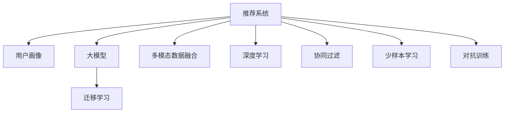

                 

# 大模型辅助的推荐系统多维度兴趣融合

> 关键词：推荐系统,大语言模型,多维度兴趣融合,用户画像,协同过滤,深度学习,迁移学习

## 1. 背景介绍

### 1.1 问题由来
随着互联网的迅猛发展和智能技术的不断突破，推荐系统已成为各行各业用户获取信息、享受服务的重要工具。然而，传统的推荐算法如协同过滤、基于内容的推荐、矩阵分解等，均存在明显的缺陷，难以适应日新月异的市场变化和多样化的用户需求。特别是在多模态数据的融合、用户兴趣建模的准确性、新用户冷启动等问题上，传统算法显得力不从心。

为了更好地满足用户需求，提升推荐系统的智能化水平，众多学者和企业开始探索基于深度学习和大模型的推荐方法。通过在用户历史行为、商品属性、社交关系等数据上预训练大模型，再结合具体推荐任务进行微调，可以大大提升推荐系统的精准度和个性化程度，有效缓解了传统推荐算法的诸多局限。

### 1.2 问题核心关键点
大模型辅助的推荐系统，重点关注以下几个核心关键点：

1. **用户兴趣建模**：如何全面、准确地建模用户兴趣，是推荐系统成功的关键。大模型可以通过多模态数据融合、自监督学习等方法，更全面地捕捉用户的隐式和显式偏好。

2. **多维度兴趣融合**：推荐系统涉及多方面的因素，如商品属性、用户画像、社交关系等。如何合理融合这些维度，以提升推荐的准确性和多样性，是大模型推荐需要解决的难点。

3. **跨模态数据融合**：推荐系统面临多模态数据融合的挑战，包括文本、图片、音频等，大模型可以有效地将不同模态的数据进行融合，提供更全面、准确的推荐。

4. **新用户冷启动**：新用户往往缺乏历史行为数据，传统算法难以有效进行推荐。大模型可以通过迁移学习、少样本学习等方法，在少量数据下也能获得较好效果。

5. **模型的泛化和鲁棒性**：推荐系统需要在多变的场景中保持稳定的性能，大模型通过迁移学习、对抗训练等方法，可以有效提升模型的泛化和鲁棒性。

6. **模型的可解释性**：推荐系统的黑箱特性让用户难以理解其推荐逻辑，大模型可以通过提示学习、多模型集成等方法，提升模型的可解释性。

### 1.3 问题研究意义
基于大模型的推荐系统方法，能够从多维度融合用户兴趣，提升推荐精准度，增强推荐系统的智能化水平。在学术界和工业界，众多研究团队和企业已经取得了丰硕成果，推动了推荐系统技术的产业化进程。

这些技术的研发和应用，对提升用户体验、推动经济增长、增强企业竞争力具有重要意义：

1. **提升用户体验**：通过个性化推荐，提升用户满意度，增加用户粘性，促进用户留存。
2. **推动经济增长**：推荐系统能够帮助企业发掘优质商品，提升销售转化率，优化库存管理，从而驱动经济增长。
3. **增强企业竞争力**：通过精准的推荐，提升企业的市场竞争力，吸引更多用户，实现业务创新。

总之，大模型辅助的推荐系统，作为智能技术的重要组成部分，具有广阔的应用前景和深远的社会影响。

## 2. 核心概念与联系

### 2.1 核心概念概述

为更好地理解大模型辅助推荐系统的工作原理，本节将介绍几个密切相关的核心概念：

- **推荐系统(Recommender System)**：基于用户行为数据或商品属性数据，为用户推荐感兴趣的物品的系统。推荐系统分为基于协同过滤的推荐、基于内容的推荐、混合推荐、深度学习推荐等几种主流类型。

- **大模型(Large Model)**：以自回归(如GPT)或自编码(如BERT)模型为代表的大规模预训练模型。通过在大规模无标签文本语料上进行预训练，学习通用的语言表示，具备强大的语言理解和生成能力。

- **用户画像(User Profiling)**：通过用户的历史行为、社交关系、人口属性等多维度信息，构建用户兴趣特征向量，用于推荐系统决策。

- **多模态数据融合(Multi-modal Data Fusion)**：将不同模态的数据(如文本、图片、音频等)进行融合，提升推荐的准确性和多样性。

- **迁移学习(Transfer Learning)**：将一个领域学习到的知识，迁移应用到另一个不同但相关的领域的学习范式。推荐系统中的迁移学习通常指在大模型上进行微调，以适应特定任务。

- **深度学习(Deep Learning)**：通过神经网络等模型进行数据建模和预测，广泛应用于推荐系统中的特征提取、序列建模等环节。

- **协同过滤(Collaborative Filtering)**：利用用户和物品之间的协同关系，进行推荐。包括基于用户的协同过滤和基于物品的协同过滤两种方式。

- **少样本学习(Few-shot Learning)**：在只有少量标注样本的情况下，模型能够快速适应新任务的学习方法。

- **对抗训练(Adversarial Training)**：在模型训练中加入对抗样本，提高模型的鲁棒性。

这些核心概念之间的逻辑关系可以通过以下Mermaid流程图来展示：



这个流程图展示了大模型辅助推荐系统的主要构成要素及其之间的关系：

1. 推荐系统基于用户画像和多模态数据融合进行推荐。
2. 用户画像通过多维度数据构建，涵盖用户历史行为、社交关系、人口属性等。
3. 大模型通过自监督学习或迁移学习获取通用特征表示，用于推荐任务。
4. 深度学习模型在特征提取、序列建模等环节进行建模。
5. 协同过滤利用用户-物品之间的协同关系进行推荐。
6. 对抗训练和少样本学习提升模型鲁棒性和泛化能力。

这些概念共同构成了大模型辅助推荐系统的核心架构，使其能够更好地融合多维度兴趣，提升推荐效果。

## 3. 核心算法原理 & 具体操作步骤
### 3.1 算法原理概述

基于大模型的推荐系统，本质上是一个基于深度学习的推荐模型，其核心思想是：将预训练大模型视作一个强大的"特征提取器"，通过多模态数据融合和用户画像构建，得到用户的兴趣特征向量，并结合具体推荐任务进行微调，优化模型的推荐性能。

形式化地，假设推荐系统要为用户 $u$ 推荐商品 $i$，其中 $u$ 的兴趣特征向量为 $x_u$，商品 $i$ 的特征向量为 $x_i$。推荐模型的目标函数为：

$$
\min_{\theta} \mathcal{L}(x_u, x_i, \theta)
$$

其中 $\theta$ 为模型的可训练参数，$\mathcal{L}$ 为损失函数，用于衡量推荐结果与真实标签之间的差异。常见的损失函数包括交叉熵损失、均方误差损失等。

通过梯度下降等优化算法，推荐模型不断更新参数 $\theta$，最小化损失函数 $\mathcal{L}$，使得推荐结果逼近真实标签。由于 $\theta$ 已经通过预训练获得了较好的初始化，因此即便在少量数据集上微调，也能较快收敛到理想的模型参数。

### 3.2 算法步骤详解

基于深度学习的大模型推荐系统一般包括以下几个关键步骤：

**Step 1: 准备预训练模型和数据集**
- 选择合适的预训练语言模型 $M_{\theta}$ 作为初始化参数，如 BERT、GPT 等。
- 准备推荐系统的数据集，包括用户行为数据、商品属性数据、社交关系数据等。

**Step 2: 用户画像构建**
- 将多维度数据（如历史行为、社交关系、人口属性等）输入到大模型中，得到用户的兴趣特征向量 $x_u$。
- 可以选择多种方式构建用户画像，如基于预训练的大模型进行多模态数据融合，或使用预训练的embedding作为用户特征向量。

**Step 3: 商品特征提取**
- 对商品进行特征提取，得到商品的特征向量 $x_i$。
- 可以将商品的属性、评论、图片等多模态数据输入到预训练大模型中，得到商品的特征表示。

**Step 4: 添加推荐目标函数**
- 根据推荐任务，设计合适的推荐目标函数。如基于物品的协同过滤，可以采用$\text{cosine similarity}$作为损失函数。
- 对于基于内容的推荐，可以设计多模态特征的加权求和函数作为损失函数。

**Step 5: 执行梯度训练**
- 将用户兴趣特征向量 $x_u$ 和商品特征向量 $x_i$ 输入到推荐模型中，计算推荐结果。
- 反向传播计算参数梯度，根据设定的优化算法和学习率更新模型参数。
- 周期性在验证集上评估模型性能，根据性能指标决定是否触发 Early Stopping。
- 重复上述步骤直到满足预设的迭代轮数或 Early Stopping 条件。

**Step 6: 测试和部署**
- 在测试集上评估推荐模型的效果，对比推荐准确率和多样性等指标。
- 使用推荐模型对新商品进行推荐，集成到实际的应用系统中。
- 持续收集新的用户行为数据，定期重新微调模型，以适应数据分布的变化。

以上是基于深度学习的大模型推荐系统的一般流程。在实际应用中，还需要针对具体推荐任务和数据特点，对微调过程的各个环节进行优化设计，如改进推荐目标函数，引入更多的正则化技术，搜索最优的超参数组合等，以进一步提升模型性能。

### 3.3 算法优缺点

基于深度学习的大模型推荐系统，具有以下优点：
1. 可以融合多维度数据，提升推荐效果。
2. 通过迁移学习，可以大大提升模型在特定任务上的效果。
3. 深度学习模型在特征提取、序列建模等方面具有优势。
4. 可以通过多模态数据融合，提升推荐的丰富性和多样性。
5. 在少样本学习下，仍能取得不错效果，缓解冷启动问题。

同时，该方法也存在一定的局限性：
1. 对数据质量要求较高，数据缺失或不完整会影响模型效果。
2. 模型训练和推理资源消耗较大，对算力、存储要求较高。
3. 模型复杂度较高，需要大量标注数据进行微调。
4. 模型解释性较差，难以理解推荐逻辑。
5. 对抗攻击可能影响模型鲁棒性。

尽管存在这些局限性，但就目前而言，基于深度学习的大模型推荐方法仍是最主流范式。未来相关研究的重点在于如何进一步降低对数据质量的要求，提高模型的泛化能力和解释性，同时兼顾可解释性和伦理安全性等因素。

### 3.4 算法应用领域

基于大模型的推荐系统方法，已经在多个领域得到应用，覆盖了电商、社交媒体、视频平台等常见场景，具体包括：

- 电商平台：为用户推荐商品、广告、内容等。
- 视频平台：为用户推荐视频、直播、节目等。
- 社交媒体：为用户推荐好友、内容、话题等。
- 金融行业：为用户推荐金融产品、广告、资讯等。

除了这些典型应用外，大模型推荐系统还被创新性地应用于广告定向、内容生成、知识图谱等领域，为推荐系统带来了新的突破。随着预训练模型和推荐方法的不断进步，相信推荐系统将在更广阔的应用领域大放异彩。

## 4. 数学模型和公式 & 详细讲解  
### 4.1 数学模型构建

本节将使用数学语言对基于大模型的推荐系统过程进行更加严格的刻画。

假设推荐系统要为用户 $u$ 推荐商品 $i$，其中 $u$ 的兴趣特征向量为 $x_u$，商品 $i$ 的特征向量为 $x_i$。推荐模型的目标函数为：

$$
\min_{\theta} \mathcal{L}(x_u, x_i, \theta)
$$

其中 $\theta$ 为模型的可训练参数，$\mathcal{L}$ 为损失函数，用于衡量推荐结果与真实标签之间的差异。常见的损失函数包括交叉熵损失、均方误差损失等。

在实践中，我们通常使用基于梯度的优化算法（如SGD、Adam等）来近似求解上述最优化问题。设 $\eta$ 为学习率，$\lambda$ 为正则化系数，则参数的更新公式为：

$$
\theta \leftarrow \theta - \eta \nabla_{\theta}\mathcal{L}(\theta) - \eta\lambda\theta
$$

其中 $\nabla_{\theta}\mathcal{L}(\theta)$ 为损失函数对参数 $\theta$ 的梯度，可通过反向传播算法高效计算。

### 4.2 公式推导过程

以下我们以基于物品的协同过滤为例，推导交叉熵损失函数及其梯度的计算公式。

假设推荐系统在用户 $u$ 对商品 $i$ 的评分 $r_{ui}$ 和实际评分 $y_{ui}$ 上，设计损失函数 $\ell(x_u, x_i, \theta)$。推荐模型输出为 $p_{ui}$，则交叉熵损失函数定义为：

$$
\ell(x_u, x_i, \theta) = -[y_{ui}\log p_{ui} + (1-y_{ui})\log (1-p_{ui})]
$$

将其代入目标函数，得：

$$
\mathcal{L}(\theta) = -\frac{1}{N}\sum_{u=1}^N \sum_{i=1}^N [y_{ui}\log p_{ui} + (1-y_{ui})\log(1-p_{ui})]
$$

根据链式法则，目标函数对参数 $\theta$ 的梯度为：

$$
\frac{\partial \mathcal{L}(\theta)}{\partial \theta} = -\frac{1}{N}\sum_{u=1}^N \sum_{i=1}^N \left[\frac{y_{ui}}{p_{ui}}-\frac{1-y_{ui}}{1-p_{ui}}\right] \frac{\partial p_{ui}}{\partial \theta}
$$

其中 $\frac{\partial p_{ui}}{\partial \theta}$ 可进一步递归展开，利用自动微分技术完成计算。

在得到目标函数的梯度后，即可带入参数更新公式，完成模型的迭代优化。重复上述过程直至收敛，最终得到适应推荐任务的推荐模型。

## 5. 项目实践：代码实例和详细解释说明
### 5.1 开发环境搭建

在进行推荐系统开发前，我们需要准备好开发环境。以下是使用Python进行PyTorch开发的环境配置流程：

1. 安装Anaconda：从官网下载并安装Anaconda，用于创建独立的Python环境。

2. 创建并激活虚拟环境：
```bash
conda create -n pytorch-env python=3.8 
conda activate pytorch-env
```

3. 安装PyTorch：根据CUDA版本，从官网获取对应的安装命令。例如：
```bash
conda install pytorch torchvision torchaudio cudatoolkit=11.1 -c pytorch -c conda-forge
```

4. 安装Transformers库：
```bash
pip install transformers
```

5. 安装各类工具包：
```bash
pip install numpy pandas scikit-learn matplotlib tqdm jupyter notebook ipython
```

完成上述步骤后，即可在`pytorch-env`环境中开始推荐系统开发。

### 5.2 源代码详细实现

这里我们以基于BERT的推荐系统为例，给出使用Transformers库进行推荐系统的PyTorch代码实现。

首先，定义推荐系统任务的数据处理函数：

```python
from transformers import BertTokenizer
from torch.utils.data import Dataset
import torch

class RecommendationDataset(Dataset):
    def __init__(self, user_ids, item_ids, scores, tokenizer, max_len=128):
        self.user_ids = user_ids
        self.item_ids = item_ids
        self.scores = scores
        self.tokenizer = tokenizer
        self.max_len = max_len
        
    def __len__(self):
        return len(self.user_ids)
    
    def __getitem__(self, item):
        user_id = self.user_ids[item]
        item_id = self.item_ids[item]
        score = self.scores[item]
        
        encoding = self.tokenizer(user_id, return_tensors='pt', max_length=self.max_len, padding='max_length', truncation=True)
        input_ids = encoding['input_ids'][0]
        attention_mask = encoding['attention_mask'][0]
        
        item_info = [item_id, score]
        encoded_item_info = self.tokenizer(item_info, return_tensors='pt', padding='max_length', truncation=True)
        item_ids = encoded_item_info['input_ids'][0]
        item_attention_mask = encoded_item_info['attention_mask'][0]
        
        return {'input_ids': input_ids, 
                'attention_mask': attention_mask,
                'item_ids': item_ids,
                'item_attention_mask': item_attention_mask,
                'score': score}

# 定义输入格式，包括用户ID、商品ID、评分
tokenizer = BertTokenizer.from_pretrained('bert-base-cased')

train_dataset = RecommendationDataset(train_user_ids, train_item_ids, train_scores, tokenizer)
dev_dataset = RecommendationDataset(dev_user_ids, dev_item_ids, dev_scores, tokenizer)
test_dataset = RecommendationDataset(test_user_ids, test_item_ids, test_scores, tokenizer)
```

然后，定义推荐模型和优化器：

```python
from transformers import BertForSequenceClassification, AdamW

model = BertForSequenceClassification.from_pretrained('bert-base-cased', num_labels=1)

optimizer = AdamW(model.parameters(), lr=2e-5)
```

接着，定义训练和评估函数：

```python
from torch.utils.data import DataLoader
from tqdm import tqdm
from sklearn.metrics import mean_squared_error

device = torch.device('cuda') if torch.cuda.is_available() else torch.device('cpu')
model.to(device)

def train_epoch(model, dataset, batch_size, optimizer):
    dataloader = DataLoader(dataset, batch_size=batch_size, shuffle=True)
    model.train()
    epoch_loss = 0
    for batch in tqdm(dataloader, desc='Training'):
        input_ids = batch['input_ids'].to(device)
        attention_mask = batch['attention_mask'].to(device)
        item_ids = batch['item_ids'].to(device)
        item_attention_mask = batch['item_attention_mask'].to(device)
        score = batch['score'].to(device)
        model.zero_grad()
        outputs = model(input_ids, attention_mask=attention_mask, labels=score)
        loss = outputs.loss
        epoch_loss += loss.item()
        loss.backward()
        optimizer.step()
    return epoch_loss / len(dataloader)

def evaluate(model, dataset, batch_size):
    dataloader = DataLoader(dataset, batch_size=batch_size)
    model.eval()
    mse = 0
    with torch.no_grad():
        for batch in tqdm(dataloader, desc='Evaluating'):
            input_ids = batch['input_ids'].to(device)
            attention_mask = batch['attention_mask'].to(device)
            item_ids = batch['item_ids'].to(device)
            item_attention_mask = batch['item_attention_mask'].to(device)
            score = batch['score'].to(device)
            outputs = model(input_ids, attention_mask=attention_mask, labels=score)
            mse += mean_squared_error(outputs.logits, score).item()
                
    return mse / len(dataset)

```

最后，启动训练流程并在测试集上评估：

```python
epochs = 5
batch_size = 16

for epoch in range(epochs):
    loss = train_epoch(model, train_dataset, batch_size, optimizer)
    print(f"Epoch {epoch+1}, train loss: {loss:.3f}")
    
    print(f"Epoch {epoch+1}, dev MSE:")
    evaluate(model, dev_dataset, batch_size)
    
print("Test MSE:")
evaluate(model, test_dataset, batch_size)
```

以上就是使用PyTorch对BERT进行推荐系统微调的完整代码实现。可以看到，得益于Transformers库的强大封装，我们可以用相对简洁的代码完成BERT模型的加载和微调。

### 5.3 代码解读与分析

让我们再详细解读一下关键代码的实现细节：

**RecommendationDataset类**：
- `__init__`方法：初始化用户ID、商品ID、评分、分词器等关键组件。
- `__len__`方法：返回数据集的样本数量。
- `__getitem__`方法：对单个样本进行处理，将用户ID、商品ID、评分输入编码为token ids，将商品ID、评分作为输入，得到商品的token ids和注意力掩码，返回模型所需的输入。

**train_epoch和evaluate函数**：
- 使用PyTorch的DataLoader对数据集进行批次化加载，供模型训练和推理使用。
- `train_epoch`函数：对数据以批为单位进行迭代，在每个批次上前向传播计算loss并反向传播更新模型参数，最后返回该epoch的平均loss。
- `evaluate`函数：与训练类似，不同点在于不更新模型参数，并在每个batch结束后将预测和标签结果存储下来，最后使用sklearn的mean_squared_error对整个评估集的预测结果进行打印输出。

**训练流程**：
- 定义总的epoch数和batch size，开始循环迭代
- 每个epoch内，先在训练集上训练，输出平均loss
- 在验证集上评估，输出MSE
- 所有epoch结束后，在测试集上评估，给出最终测试结果

可以看到，PyTorch配合Transformers库使得BERT微调的代码实现变得简洁高效。开发者可以将更多精力放在数据处理、模型改进等高层逻辑上，而不必过多关注底层的实现细节。

当然，工业级的系统实现还需考虑更多因素，如模型的保存和部署、超参数的自动搜索、更灵活的任务适配层等。但核心的微调范式基本与此类似。

## 6. 实际应用场景
### 6.1 电商平台推荐

基于大语言模型的推荐系统，可以广泛应用于电商平台的商品推荐。传统电商推荐系统往往基于用户行为数据进行推荐，难以适应多样化的用户需求。而使用大模型推荐系统，通过融合用户画像、商品属性、社交关系等多维度数据，可以更全面地了解用户需求，提供个性化的推荐服务。

在技术实现上，可以收集用户浏览、点击、收藏、购买等行为数据，构建用户画像。同时收集商品的标题、描述、图片、价格等多模态属性数据，并输入到预训练大模型中进行特征提取。最后，结合多模态数据融合技术，对用户画像和商品特征进行计算，得到推荐结果。如此构建的电商平台推荐系统，能够更好地满足用户需求，提升购物体验。

### 6.2 视频平台推荐

视频平台推荐系统面临大量视频内容的推荐问题。传统推荐系统往往依赖内容标签进行推荐，难以应对视频内容的丰富多样性。使用大语言模型推荐系统，可以结合用户画像、视频内容、观看行为等多维度数据，进行更加全面和精准的推荐。

在技术实现上，可以收集用户的观看历史、评分、点赞、评论等多维度数据，构建用户画像。同时收集视频的内容标签、场景信息、导演信息等多模态属性数据，并输入到预训练大模型中进行特征提取。最后，结合多模态数据融合技术，对用户画像和视频特征进行计算，得到推荐结果。如此构建的视频平台推荐系统，能够更好地满足用户需求，提升用户体验。

### 6.3 社交媒体推荐

社交媒体推荐系统面临大量用户社交关系和内容数据的推荐问题。传统推荐系统往往基于用户的历史行为数据进行推荐，难以应对用户多样化的兴趣偏好。使用大语言模型推荐系统，可以结合用户画像、社交关系、内容标签等多维度数据，进行更加全面和精准的推荐。

在技术实现上，可以收集用户的点赞、评论、分享等多维度数据，构建用户画像。同时收集社交关系数据和内容标签，并输入到预训练大模型中进行特征提取。最后，结合多模态数据融合技术，对用户画像和社交内容进行计算，得到推荐结果。如此构建的社交媒体推荐系统，能够更好地满足用户需求，提升社交体验。

### 6.4 未来应用展望

随着大模型推荐技术的不断发展，基于大语言模型的推荐系统将在更多领域得到应用，为推荐系统带来新的突破。

在智慧医疗领域，基于大语言模型的推荐系统可以为用户提供个性化的医疗咨询、药物推荐等，提升医疗服务的智能化水平。

在智能教育领域，推荐系统可以为用户提供个性化的学习资源、课程推荐等，因材施教，促进教育公平，提高教学质量。

在智慧城市治理中，推荐系统可以为用户提供个性化的旅游推荐、活动推荐等，提高城市管理的自动化和智能化水平，构建更安全、高效的未来城市。

此外，在企业生产、社会治理、文娱传媒等众多领域，基于大语言模型的推荐系统也将不断涌现，为经济社会发展注入新的动力。相信随着技术的日益成熟，大语言模型推荐范式将成为推荐系统的重要方向，推动推荐系统技术的产业化进程。

## 7. 工具和资源推荐
### 7.1 学习资源推荐

为了帮助开发者系统掌握大语言模型推荐系统的工作原理和实践技巧，这里推荐一些优质的学习资源：

1. 《推荐系统实战》系列博文：由大模型技术专家撰写，深入浅出地介绍了推荐系统的工作原理、算法优化、模型评估等内容。

2. 《深度学习与推荐系统》课程：由清华大学开设的NLP明星课程，涵盖推荐系统的基本概念和经典模型。

3. 《Recommender Systems》书籍：该书系统介绍了推荐系统的发展历程、主要算法和实际应用，是推荐系统领域的经典著作。

4. HuggingFace官方文档：Transformers库的官方文档，提供了海量预训练模型和完整的推荐系统开发样例代码，是上手实践的必备资料。

5. KDD Cup推荐竞赛：KDD Cup推荐竞赛是机器学习领域重要的竞赛之一，推荐系统从业者可以通过该竞赛了解最新算法和技术进展。

通过对这些资源的学习实践，相信你一定能够快速掌握大语言模型推荐系统的精髓，并用于解决实际的推荐问题。
###  7.2 开发工具推荐

高效的开发离不开优秀的工具支持。以下是几款用于大语言模型推荐系统开发的常用工具：

1. PyTorch：基于Python的开源深度学习框架，灵活动态的计算图，适合快速迭代研究。大部分预训练语言模型都有PyTorch版本的实现。

2. TensorFlow：由Google主导开发的开源深度学习框架，生产部署方便，适合大规模工程应用。同样有丰富的预训练语言模型资源。

3. Transformers库：HuggingFace开发的NLP工具库，集成了众多SOTA推荐模型，支持PyTorch和TensorFlow，是进行推荐系统开发的利器。

4. Weights & Biases：模型训练的实验跟踪工具，可以记录和可视化模型训练过程中的各项指标，方便对比和调优。与主流深度学习框架无缝集成。

5. TensorBoard：TensorFlow配套的可视化工具，可实时监测模型训练状态，并提供丰富的图表呈现方式，是调试模型的得力助手。

6. Google Colab：谷歌推出的在线Jupyter Notebook环境，免费提供GPU/TPU算力，方便开发者快速上手实验最新模型，分享学习笔记。

合理利用这些工具，可以显著提升大语言模型推荐系统的开发效率，加快创新迭代的步伐。

### 7.3 相关论文推荐

大语言模型推荐技术的发展源于学界的持续研究。以下是几篇奠基性的相关论文，推荐阅读：

1. Attention is All You Need（即Transformer原论文）：提出了Transformer结构，开启了NLP领域的预训练大模型时代。

2. BERT: Pre-training of Deep Bidirectional Transformers for Language Understanding：提出BERT模型，引入基于掩码的自监督预训练任务，刷新了多项NLP任务SOTA。

3. Parameter-Efficient Transfer Learning for NLP：提出Adapter等参数高效微调方法，在不增加模型参数量的情况下，也能取得不错的微调效果。

4. Prompt-Based Recommendation Systems：引入基于连续型Prompt的推荐范式，为如何充分利用预训练知识提供了新的思路。

5. BigBird: Big Bidirectional Encoder Representations from Transformers：提出BigBird模型，通过改进Transformer的自注意力机制，提升了模型的表示能力。

这些论文代表了大语言模型推荐系统的发展脉络。通过学习这些前沿成果，可以帮助研究者把握学科前进方向，激发更多的创新灵感。

## 8. 总结：未来发展趋势与挑战

### 8.1 总结

本文对基于大模型的推荐系统多维度兴趣融合方法进行了全面系统的介绍。首先阐述了大模型推荐系统的研究背景和意义，明确了推荐系统成功的关键在于全面、准确地建模用户兴趣。其次，从原理到实践，详细讲解了推荐系统的数学原理和关键步骤，给出了推荐系统任务开发的完整代码实例。同时，本文还广泛探讨了推荐系统在电商、视频、社交等多个领域的应用前景，展示了推荐系统技术的广泛应用。

通过本文的系统梳理，可以看到，基于大语言模型的推荐系统方法，能够融合多维度数据，提升推荐效果，具有广阔的应用前景和深远的社会影响。

### 8.2 未来发展趋势

展望未来，大语言模型推荐系统将呈现以下几个发展趋势：

1. 模型规模持续增大。随着算力成本的下降和数据规模的扩张，推荐模型将不断增大，提升推荐效果。

2. 多模态数据融合技术更加先进。推荐系统将融合更多模态数据，提升推荐的丰富性和精准性。

3. 深度学习推荐技术更加成熟。推荐模型将更加深入地结合深度学习技术，提升特征提取和序列建模能力。

4. 迁移学习技术进一步优化。推荐模型将更加灵活地结合迁移学习技术，适应多样化的推荐任务。

5. 推荐系统跨领域应用更加广泛。推荐系统将不仅应用于电商、视频、社交等领域，还将扩展到医疗、教育、城市治理等领域。

6. 推荐系统与知识图谱深度融合。推荐系统将更加深入地结合知识图谱，提升推荐的合理性和可靠性。

以上趋势凸显了大语言模型推荐系统的广阔前景。这些方向的探索发展，必将进一步提升推荐系统的性能和应用范围，为经济社会发展注入新的动力。

### 8.3 面临的挑战

尽管大语言模型推荐系统已经取得了丰硕成果，但在迈向更加智能化、普适化应用的过程中，它仍面临着诸多挑战：

1. 对数据质量要求较高。推荐系统需要高质量的用户行为和商品属性数据，数据缺失或不完整会影响模型效果。

2. 模型训练和推理资源消耗较大。推荐模型在处理多模态数据时，资源消耗较大，需要高性能的硬件设备。

3. 模型复杂度较高。推荐模型需要大量的标注数据进行微调，训练复杂度高。

4. 模型解释性较差。推荐系统黑箱特性明显，难以解释其推荐逻辑。

5. 对抗攻击可能影响模型鲁棒性。对抗攻击可能会对推荐系统造成不良影响，降低模型鲁棒性。

尽管存在这些挑战，但就目前而言，基于深度学习的大模型推荐方法仍是最主流范式。未来相关研究的重点在于如何进一步降低对数据质量的要求，提高模型的泛化能力和解释性，同时兼顾可解释性和伦理安全性等因素。

### 8.4 研究展望

面对大语言模型推荐系统所面临的挑战，未来的研究需要在以下几个方面寻求新的突破：

1. 探索无监督和半监督推荐方法。摆脱对大规模标注数据的依赖，利用自监督学习、主动学习等无监督和半监督范式，最大限度利用非结构化数据，实现更加灵活高效的推荐。

2. 研究参数高效和计算高效的推荐范式。开发更加参数高效的推荐方法，在固定大部分预训练参数的同时，只更新极少量的任务相关参数。同时优化推荐模型的计算图，减少前向传播和反向传播的资源消耗，实现更加轻量级、实时性的部署。

3. 融合因果和对比学习范式。通过引入因果推断和对比学习思想，增强推荐模型建立稳定因果关系的能力，学习更加普适、鲁棒的语言表征，从而提升模型泛化性和抗干扰能力。

4. 引入更多先验知识。将符号化的先验知识，如知识图谱、逻辑规则等，与神经网络模型进行巧妙融合，引导推荐过程学习更准确、合理的语言模型。同时加强不同模态数据的整合，实现视觉、语音等多模态信息与文本信息的协同建模。

5. 结合因果分析和博弈论工具。将因果分析方法引入推荐模型，识别出模型决策的关键特征，增强推荐逻辑的因果性和合理性。借助博弈论工具刻画人机交互过程，主动探索并规避推荐模型的脆弱点，提高系统稳定性。

6. 纳入伦理道德约束。在推荐模型训练目标中引入伦理导向的评估指标，过滤和惩罚有偏见、有害的输出倾向。同时加强人工干预和审核，建立模型行为的监管机制，确保推荐结果符合人类价值观和伦理道德。

这些研究方向的探索，必将引领大语言模型推荐系统技术迈向更高的台阶，为构建安全、可靠、可解释、可控的智能系统铺平道路。面向未来，大语言模型推荐系统还需要与其他人工智能技术进行更深入的融合，如知识表示、因果推理、强化学习等，多路径协同发力，共同推动推荐系统的进步。只有勇于创新、敢于突破，才能不断拓展推荐系统的边界，让智能技术更好地造福人类社会。

## 9. 附录：常见问题与解答

**Q1：如何处理数据缺失或不完整的问题？**

A: 数据缺失或不完整是推荐系统面临的常见问题，会影响模型效果。可以通过以下方法处理：

1. 数据清洗：对缺失数据进行清洗，删除无效或不一致的样本。

2. 数据插补：对缺失数据进行插补，常用的插补方法包括均值插补、中值插补、KNN插补等。

3. 模型预测：使用模型预测缺失数据，常用的模型包括KNN、线性回归、随机森林等。

4. 多维度数据融合：利用用户画像、商品属性、社交关系等多维度数据，对缺失数据进行补充，提升推荐效果。

5. 异常值检测：对异常数据进行检测和处理，避免对模型产生不良影响。

这些方法需要根据具体数据特点进行选择，并结合业务场景进行优化。

**Q2：如何选择推荐模型参数？**

A: 推荐模型参数的选择需要考虑多个因素，如模型复杂度、数据规模、硬件资源等。以下是一些常见的参数选择策略：

1. 学习率选择：通常选择学习率衰减策略，如warmup策略、余弦衰减等，逐渐调整学习率，防止过拟合。

2. 批量大小选择：通常选择适当的批量大小，如64、128、256等，避免内存不足和计算效率低下。

3. 模型规模选择：通常选择适当的模型规模，如单层、多层、深度等，平衡模型复杂度和效果。

4. 正则化选择：通常选择适当的正则化方法，如L2正则、Dropout等，避免过拟合。

5. 初始化策略选择：通常选择适当的初始化方法，如Xavier初始化、He初始化等，提升模型收敛速度。

这些参数的选择需要根据具体任务和数据特点进行优化，并结合业务场景进行综合考虑。

**Q3：推荐系统如何应对对抗攻击？**

A: 推荐系统面临对抗攻击的风险，攻击者通过干扰模型输入，导致模型输出不安全。可以采取以下措施：

1. 数据清洗：对输入数据进行清洗，删除恶意或异常样本。

2. 鲁棒性训练：通过对抗训练、对抗样本生成等技术，增强模型的鲁棒性，抵抗对抗攻击。

3. 检测和防御：对输入数据进行检测，发现恶意样本后进行防御，如过滤、重采样等。

4. 加密和匿名化：对输入数据进行加密和匿名化，保护用户隐私和数据安全。

5. 模型监控：对推荐系统进行实时监控，发现异常行为后及时采取措施，保障系统安全。

这些措施需要结合具体应用场景进行综合考虑，并不断进行优化和改进。

**Q4：推荐系统如何进行跨领域应用？**

A: 推荐系统需要进行跨领域应用，提升多领域推荐效果。可以通过以下方法实现：

1. 数据融合：将不同领域的用户画像和商品属性数据进行融合，提升推荐的全面性和准确性。

2. 模型迁移：将已有领域的推荐模型进行迁移，在新领域上进行微调，提升推荐效果。

3. 多领域数据共享：在多领域间共享数据和模型，提升推荐模型的泛化能力和鲁棒性。

4. 多领域任务优化：对多领域推荐任务进行优化，如增加相似度计算、融合多领域标签等，提升推荐效果。

5. 多领域联合学习：利用联合学习技术，在多个领域间共享知识和参数，提升推荐模型的效果。

这些方法需要根据具体应用场景进行综合考虑，并不断进行优化和改进。

---

作者：禅与计算机程序设计艺术 / Zen and the Art of Computer Programming

