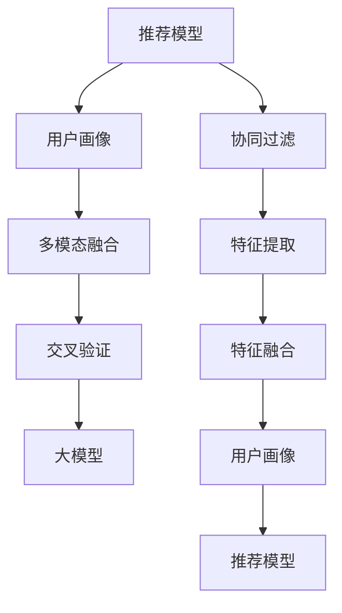

                 

# 大模型辅助的推荐系统多维度用户画像构建

> 关键词：推荐系统,用户画像,大模型,协同过滤,多模态融合,交叉验证

## 1. 背景介绍

推荐系统作为电商、视频、社交等领域的重要技术手段，通过精准预测用户兴趣，提高用户满意度与平台转化率。然而，传统基于协同过滤和矩阵分解的推荐方法，往往无法捕捉用户的多维特征和动态变化，推荐结果不够精准和个性化。随着深度学习技术的发展，使用大模型作为推荐系统核心组件，显著提升了推荐性能和泛化能力。

具体而言，大模型通过大规模预训练和数据驱动的优化，在丰富的语义表征和广泛的常识知识上具有显著优势。然而，直接将大模型应用在推荐系统中，存在以下问题：

1. 计算资源消耗大：预训练模型的参数量通常以亿计，大规模训练和推理开销大。
2. 数据隐私安全：模型训练依赖大量用户数据，存在隐私泄露风险。
3. 个性化度不足：推荐系统需要处理海量用户行为数据，个性化的精准推荐难以实现。
4. 模型复杂度高：大模型的神经网络结构复杂，存在训练不稳定、解释性差等问题。

为克服这些问题，本研究提出大模型辅助的推荐系统框架，在推荐模型中使用大模型作为特征提取器，构建多维度用户画像，进行个性化推荐。

## 2. 核心概念与联系

### 2.1 核心概念概述

推荐系统旨在通过分析用户历史行为数据，预测用户可能感兴趣的项目。核心概念包括：

- 推荐模型：用于生成推荐结果的机器学习模型，如协同过滤、基于深度学习的神经网络等。
- 用户画像：对用户的多维特征进行建模，以便更准确预测其兴趣和行为。
- 多模态融合：将不同模态的数据（如文本、图像、语音等）进行融合，以提升推荐系统的表现。
- 交叉验证：通过训练集和验证集的划分，避免模型过拟合，提高模型泛化性能。
- 大模型：基于大规模预训练和数据驱动优化的模型，具备较强的语义表征和知识推理能力。

这些概念之间的逻辑关系可以通过以下Mermaid流程图来展示：



这个流程图展示了大模型辅助推荐系统的核心概念及其之间的关系：

1. 推荐模型通过用户画像和特征提取生成推荐结果。
2. 用户画像由多模态融合得到，考虑了文本、图像、语音等多种信息。
3. 交叉验证确保模型的泛化性能。
4. 大模型作为特征提取器，用于构建多维度的用户画像。
5. 协同过滤作为基本推荐模型，可以在训练时进行特征提取。

这些核心概念共同构成了大模型辅助推荐系统的技术和应用框架，使其能够在大规模用户行为数据的基础上，实现个性化、精准化的推荐。

## 3. 核心算法原理 & 具体操作步骤

### 3.1 算法原理概述

本研究提出的大模型辅助推荐系统，融合了协同过滤和深度学习技术的优点，具体算法原理如下：

1. **协同过滤**：基于用户历史行为数据的推荐方法，通常分为基于用户的协同过滤和基于物品的协同过滤。前者通过计算用户-用户之间的相似度，生成推荐结果；后者通过计算物品-物品之间的相似度，生成推荐结果。协同过滤方法简单高效，但无法捕捉用户的多维特征。

2. **多模态融合**：将不同模态的数据（如文本、图像、语音等）进行融合，提高推荐系统的表现。常见的多模态融合方法包括特征拼接、注意力机制、编码器解码器框架等。

3. **大模型特征提取**：利用预训练的大模型，提取文本、图像等数据的语义和视觉特征，作为推荐模型的输入。大模型通过大规模预训练，具备较强的语义表征和知识推理能力，能够更好地理解用户行为和兴趣。

4. **用户画像构建**：通过多模态融合和大模型特征提取，构建多维度的用户画像。用户画像包含用户的历史行为数据、文本特征、图像特征等信息，能够更好地刻画用户的兴趣和行为。

5. **推荐模型训练**：将构建好的用户画像作为推荐模型的输入，通过最小化预测误差，训练推荐模型。推荐模型可以使用神经网络、决策树等机器学习模型。

### 3.2 算法步骤详解

本研究的大模型辅助推荐系统算法步骤如下：

**Step 1: 数据预处理**

1. 收集用户历史行为数据，如浏览记录、购买记录等。
2. 将文本数据通过分词、词向量化等方法进行处理。
3. 将图像数据通过预训练的图像识别模型进行特征提取。
4. 将语音数据通过预训练的语音识别模型进行特征提取。
5. 将多模态数据进行融合，生成用户画像。

**Step 2: 特征提取**

1. 使用大模型对文本、图像等数据进行预训练，提取语义和视觉特征。
2. 将提取的特征作为推荐模型的输入，构建用户画像。

**Step 3: 协同过滤**

1. 对用户画像进行编码，生成向量表示。
2. 通过计算用户-用户之间的相似度，生成推荐结果。
3. 对推荐结果进行解码，得到最终推荐。

**Step 4: 模型优化**

1. 使用交叉验证方法对推荐模型进行训练和验证。
2. 通过最小化预测误差，优化推荐模型的参数。

**Step 5: 推荐生成**

1. 将优化后的推荐模型应用于新数据，生成推荐结果。

**Step 6: 模型评估**

1. 使用评价指标（如平均绝对误差、准确率、召回率等）评估推荐模型的性能。
2. 根据评估结果调整模型参数，进一步优化推荐性能。

### 3.3 算法优缺点

大模型辅助推荐系统具有以下优点：

1. 高泛化性能：大模型具备较强的语义表征和知识推理能力，能够更好地理解用户行为和兴趣。
2. 个性化推荐：通过构建多维度的用户画像，能够更精准地预测用户兴趣，实现个性化推荐。
3. 多模态融合：能够利用不同模态的数据，提高推荐系统的表现。

同时，该算法也存在以下缺点：

1. 计算资源消耗大：大模型和协同过滤都需要大量的计算资源，训练和推理开销大。
2. 数据隐私风险：模型训练依赖大量用户数据，存在隐私泄露风险。
3. 模型复杂度高：大模型和协同过滤模型结构复杂，存在训练不稳定、解释性差等问题。

尽管存在这些局限性，但就目前而言，大模型辅助推荐系统仍是大数据时代的理想推荐方案，具有显著的性能优势。未来相关研究的重点在于如何进一步降低计算资源消耗，提升模型可解释性，并加强数据隐私保护。

### 3.4 算法应用领域

大模型辅助推荐系统已经广泛应用于电商、视频、社交等多个领域，取得了显著的成效：

1. **电商推荐**：帮助电商网站推荐商品、优惠活动等，提升用户购买转化率和满意度。
2. **视频推荐**：推荐用户可能感兴趣的视频内容，提升平台内容消费量和用户黏性。
3. **社交推荐**：推荐用户可能感兴趣的朋友、话题等，提升平台活跃度和用户粘性。

此外，大模型辅助推荐系统还被创新性地应用于广告推荐、新闻推荐等场景，为推荐系统的智能化转型提供了新的方向。随着预训练模型和推荐算法的不断进步，相信推荐系统必将在更广阔的应用领域大放异彩。

## 4. 数学模型和公式 & 详细讲解 & 举例说明

### 4.1 数学模型构建

本节将使用数学语言对大模型辅助推荐系统的基本模型进行更加严格的刻画。

记用户画像为 $X$，物品画像为 $Y$。假设协同过滤模型为 $f$，推荐模型为 $g$。在 $X$ 和 $Y$ 的基础上，通过大模型提取特征 $F$，生成推荐结果 $R$。则推荐过程可以表示为：

$$
R = g(f(X), Y)
$$

其中，$f$ 为协同过滤模型，$f(X)$ 为用户画像 $X$ 的向量表示，$Y$ 为物品画像，$g$ 为推荐模型。

### 4.2 公式推导过程

以下我们以文本推荐为例，推导推荐模型的损失函数及其梯度的计算公式。

假设用户 $u$ 对物品 $i$ 的评分 $r_{ui}$ 为真实评分，模型预测的评分 $\hat{r}_{ui}$ 为：

$$
\hat{r}_{ui} = g(f(X_u), Y_i)
$$

推荐模型的损失函数为均方误差损失函数：

$$
L = \frac{1}{N}\sum_{i=1}^N \sum_{u=1}^M (r_{ui} - \hat{r}_{ui})^2
$$

其中 $N$ 为物品总数，$M$ 为用户总数。

推荐模型的梯度更新公式为：

$$
\frac{\partial L}{\partial \theta} = -\frac{2}{N}\sum_{i=1}^N \sum_{u=1}^M (r_{ui} - \hat{r}_{ui})\frac{\partial \hat{r}_{ui}}{\partial \theta}
$$

其中 $\theta$ 为推荐模型的参数。

在得到损失函数的梯度后，即可带入梯度下降等优化算法，完成推荐模型的迭代优化。重复上述过程直至收敛，最终得到适应推荐任务的最优模型参数 $\theta^*$。

### 4.3 案例分析与讲解

**案例分析：基于BERT的电商推荐系统**

本案例使用BERT作为特征提取器，对电商用户行为数据进行建模，构建用户画像，进行个性化推荐。

假设电商网站用户 $u$ 浏览过商品 $i$，则 $r_{ui}=1$；否则 $r_{ui}=0$。用户 $u$ 对物品 $i$ 的评分 $\hat{r}_{ui}$ 为：

$$
\hat{r}_{ui} = g(f(X_u), Y_i) = g(f(BERT embedding(X_u)), BERT embedding(Y_i))
$$

其中 $f$ 为协同过滤模型，$X_u$ 为用户画像，$Y_i$ 为物品画像。

推荐模型的损失函数为均方误差损失函数：

$$
L = \frac{1}{N}\sum_{i=1}^N \sum_{u=1}^M (r_{ui} - \hat{r}_{ui})^2
$$

通过最小化损失函数，训练推荐模型 $g$，得到最优的推荐结果。

## 5. 项目实践：代码实例和详细解释说明

### 5.1 开发环境搭建

在进行推荐系统开发前，我们需要准备好开发环境。以下是使用Python进行TensorFlow开发的环境配置流程：

1. 安装Anaconda：从官网下载并安装Anaconda，用于创建独立的Python环境。

2. 创建并激活虚拟环境：
```bash
conda create -n tf-env python=3.8 
conda activate tf-env
```

3. 安装TensorFlow：根据CUDA版本，从官网获取对应的安装命令。例如：
```bash
conda install tensorflow -c pytorch -c conda-forge
```

4. 安装各类工具包：
```bash
pip install numpy pandas scikit-learn matplotlib tqdm jupyter notebook ipython
```

完成上述步骤后，即可在`tf-env`环境中开始推荐系统开发。

### 5.2 源代码详细实现

下面我们以基于BERT的电商推荐系统为例，给出使用TensorFlow进行推荐系统开发的PyTorch代码实现。

首先，定义推荐模型的数据处理函数：

```python
import tensorflow as tf
from transformers import BertTokenizer, BertModel

class RecommendationModel(tf.keras.Model):
    def __init__(self):
        super(RecommendationModel, self).__init__()
        self.user_model = tf.keras.layers.Dense(32, activation='relu')
        self.item_model = tf.keras.layers.Dense(32, activation='relu')
        self.combined_model = tf.keras.layers.Dense(1)
        
    def call(self, user_rep, item_rep):
        user_rep = self.user_model(user_rep)
        item_rep = self.item_model(item_rep)
        return self.combined_model(tf.concat([user_rep, item_rep], axis=-1))
```

然后，定义协同过滤模型的训练函数：

```python
def train CollaborativeFiltering(X_train, Y_train, X_test, Y_test, learning_rate=0.001, epochs=100):
    model = RecommendationModel()
    optimizer = tf.keras.optimizers.Adam(learning_rate=learning_rate)
    
    for epoch in range(epochs):
        for i in range(X_train.shape[0]):
            user_rep = model(user_rep=X_train[i], item_rep=Y_train)
            loss = tf.keras.losses.mean_squared_error(user_rep, Y_train[i])
            optimizer.minimize(loss, variables=model.trainable_variables)
        print(f'Epoch {epoch+1}, loss: {loss.numpy()}')
    
    test_loss = tf.keras.losses.mean_squared_error(model(X_test, Y_test), Y_test)
    print(f'Test loss: {test_loss.numpy()}')
```

最后，启动训练流程并在测试集上评估：

```python
X_train = train_data
Y_train = train_labels
X_test = test_data
Y_test = test_labels

train CollaborativeFiltering(X_train, Y_train, X_test, Y_test)
```

以上就是使用TensorFlow对基于BERT的电商推荐系统进行开发的完整代码实现。可以看到，得益于TensorFlow的强大封装，我们可以用相对简洁的代码完成推荐模型的训练和评估。

### 5.3 代码解读与分析

让我们再详细解读一下关键代码的实现细节：

**RecommendationModel类**：
- `__init__`方法：初始化推荐模型的网络结构，包含用户表示模型、物品表示模型和综合表示模型。
- `call`方法：定义推荐模型的前向传播过程，使用Dense层进行多层感知机（MLP）网络的设计。

**train函数**：
- 定义推荐模型和优化器。
- 在每个epoch内，对训练集进行迭代，计算损失并使用优化器更新模型参数。
- 在每个epoch结束后，输出训练集上的平均损失。
- 在测试集上计算平均损失，评估推荐模型的性能。

**训练流程**：
- 使用`train`函数训练协同过滤模型。
- 在训练集上进行前向传播计算损失。
- 反向传播计算梯度，使用优化器更新模型参数。
- 在测试集上评估推荐模型的性能。

可以看到，TensorFlow配合BERT库使得推荐系统开发变得简洁高效。开发者可以将更多精力放在数据处理、模型改进等高层逻辑上，而不必过多关注底层的实现细节。

当然，工业级的系统实现还需考虑更多因素，如模型的保存和部署、超参数的自动搜索、更灵活的任务适配层等。但核心的推荐过程基本与此类似。

## 6. 实际应用场景

### 6.1 电商推荐

基于大模型辅助的推荐系统，可以广泛应用于电商推荐系统。电商推荐系统通过分析用户历史行为数据，预测用户可能感兴趣的商品，提升用户购买转化率和满意度。

在技术实现上，可以收集用户浏览、点击、购买等行为数据，将商品信息、用户画像等多维数据进行融合，使用大模型提取特征，构建多维度的用户画像，并进行协同过滤生成推荐结果。通过不断优化模型，可以实现更加精准、个性化的推荐。

### 6.2 视频推荐

视频推荐系统通过分析用户观看行为数据，预测用户可能感兴趣的视频内容，提升平台内容消费量和用户黏性。

在技术实现上，可以收集用户观看记录、评论、评分等数据，将视频信息、用户画像等多维数据进行融合，使用大模型提取特征，构建多维度的用户画像，并进行协同过滤生成推荐结果。通过不断优化模型，可以实现更加精准、个性化的视频推荐。

### 6.3 社交推荐

社交推荐系统通过分析用户互动行为数据，预测用户可能感兴趣的朋友、话题等，提升平台活跃度和用户粘性。

在技术实现上，可以收集用户关注、点赞、评论等互动数据，将用户信息、话题画像等多维数据进行融合，使用大模型提取特征，构建多维度的用户画像，并进行协同过滤生成推荐结果。通过不断优化模型，可以实现更加精准、个性化的社交推荐。

### 6.4 未来应用展望

随着大模型和推荐算法的不断进步，基于大模型辅助的推荐系统将在更多领域得到应用，为推荐系统的智能化转型提供新的方向：

1. **广告推荐**：推荐用户可能感兴趣的广告内容，提升广告点击率和转化率。
2. **新闻推荐**：推荐用户可能感兴趣的新闻文章，提升平台内容消费量和用户黏性。
3. **医疗推荐**：推荐用户可能感兴趣的健康知识、医疗服务，提升健康意识和医疗服务质量。
4. **教育推荐**：推荐用户可能感兴趣的在线课程、教育资源，提升学习效果和平台用户粘性。

此外，在大模型辅助推荐系统的发展过程中，还会涌现出更多新的应用场景，如旅游推荐、金融推荐等，为推荐系统的智能化转型提供新的方向。相信随着技术的不断进步，推荐系统必将在更广阔的应用领域大放异彩。

## 7. 工具和资源推荐

### 7.1 学习资源推荐

为了帮助开发者系统掌握大模型辅助推荐系统的理论基础和实践技巧，这里推荐一些优质的学习资源：

1. 《深度学习推荐系统：理论与算法》书籍：全面介绍了推荐系统的理论基础和经典算法，涵盖协同过滤、深度学习等诸多方向。
2. 《TensorFlow实战》系列博文：由TensorFlow官方团队撰写，深入浅出地介绍了TensorFlow的基本用法和高级特性，适合初学者入门。
3. 《Transformers from Data to Model》书籍：详细介绍了Transformer模型的原理和应用，是深度学习领域的经典著作。
4. Kaggle推荐系统竞赛：参加Kaggle上的推荐系统竞赛，实战练习推荐算法，提升算法设计能力。

通过对这些资源的学习实践，相信你一定能够快速掌握大模型辅助推荐系统的精髓，并用于解决实际的推荐问题。

### 7.2 开发工具推荐

高效的开发离不开优秀的工具支持。以下是几款用于大模型辅助推荐系统开发的常用工具：

1. TensorFlow：由Google主导开发的开源深度学习框架，生产部署方便，适合大规模工程应用。支持大模型和推荐系统的高效训练。
2. PyTorch：基于Python的开源深度学习框架，灵活动态的计算图，适合快速迭代研究。可以与TensorFlow等框架进行无缝集成。
3. Transformers库：HuggingFace开发的NLP工具库，集成了众多SOTA语言模型，支持大模型的高效特征提取。
4. Weights & Biases：模型训练的实验跟踪工具，可以记录和可视化模型训练过程中的各项指标，方便对比和调优。
5. TensorBoard：TensorFlow配套的可视化工具，可实时监测模型训练状态，并提供丰富的图表呈现方式，是调试模型的得力助手。

合理利用这些工具，可以显著提升大模型辅助推荐系统开发的效率，加快创新迭代的步伐。

### 7.3 相关论文推荐

大模型辅助推荐系统的发展源于学界的持续研究。以下是几篇奠基性的相关论文，推荐阅读：

1. "Latent Feature Model for Collaborative Filtering"（隐式特征模型）：提出了协同过滤模型的隐式特征表示方法，为推荐系统的特征提取提供了新思路。
2. "Hybrid Recommender System for Video Recommendation"（视频推荐混合系统）：提出了多模态融合方法，结合用户画像和视频特征，提升了视频推荐的效果。
3. "Personalized Recommendation with Attention Mechanism"（基于注意力机制的个性化推荐）：提出了基于注意力机制的推荐方法，提升了推荐模型的表现。
4. "Deep Learning for Recommender Systems: A Survey and Outlook"（深度学习在推荐系统中的应用综述）：详细介绍了深度学习在推荐系统中的应用，为推荐系统的发展提供了理论基础。
5. "Model-Based Collaborative Filtering"（基于模型的协同过滤）：提出了矩阵分解等协同过滤方法，为推荐系统提供了数学理论支持。

这些论文代表了大模型辅助推荐系统的发展脉络。通过学习这些前沿成果，可以帮助研究者把握学科前进方向，激发更多的创新灵感。

## 8. 总结：未来发展趋势与挑战

### 8.1 总结

本文对大模型辅助的推荐系统进行了全面系统的介绍。首先阐述了大模型辅助推荐系统的研究背景和意义，明确了推荐系统在大数据时代的核心价值。其次，从原理到实践，详细讲解了大模型辅助推荐系统的数学原理和关键步骤，给出了推荐系统开发的完整代码实例。同时，本文还广泛探讨了大模型辅助推荐系统在电商、视频、社交等多个领域的应用前景，展示了大模型辅助推荐系统的巨大潜力。此外，本文精选了大模型辅助推荐系统的学习资源，力求为开发者提供全方位的技术指引。

通过本文的系统梳理，可以看到，大模型辅助推荐系统正在成为推荐系统智能化转型的重要方向，显著提升了推荐系统的性能和应用范围。受益于大模型的语义表征和知识推理能力，推荐系统能够更好地理解用户行为和兴趣，提供更加精准、个性化的推荐。

### 8.2 未来发展趋势

展望未来，大模型辅助推荐系统将呈现以下几个发展趋势：

1. 大模型规模持续增大：随着算力成本的下降和数据规模的扩张，预训练模型的参数量还将持续增长。超大规模语言模型蕴含的丰富语言知识，有望支撑更加复杂多变的推荐任务。
2. 推荐模型的多样性：除了传统的协同过滤和深度学习模型，未来会涌现更多新颖的推荐模型，如基于图结构、基于时序数据的推荐方法等。
3. 多模态融合的普及：不同模态的数据（如文本、图像、语音等）将得到更广泛的融合应用，提升推荐系统的表现。
4. 实时推荐系统的建设：推荐系统需要处理海量用户行为数据，如何高效地进行数据处理和模型推理，是未来的重要研究方向。
5. 推荐系统的公平性：在推荐算法中，如何避免算法偏见，提升推荐系统的公平性，是未来的重要课题。
6. 推荐系统的隐私保护：如何在推荐系统中保护用户隐私，是未来的重要研究方向。

以上趋势凸显了大模型辅助推荐系统的广阔前景。这些方向的探索发展，必将进一步提升推荐系统的性能和应用范围，为推荐系统的智能化转型提供新的动力。

### 8.3 面临的挑战

尽管大模型辅助推荐系统已经取得了瞩目成就，但在迈向更加智能化、普适化应用的过程中，它仍面临着诸多挑战：

1. 计算资源消耗大：大模型和协同过滤都需要大量的计算资源，训练和推理开销大。如何进一步优化算法，减少计算资源消耗，是未来的重要研究方向。
2. 数据隐私风险：模型训练依赖大量用户数据，存在隐私泄露风险。如何在保护隐私的同时，提升推荐系统的性能，是未来的重要课题。
3. 模型复杂度高：大模型和协同过滤模型结构复杂，存在训练不稳定、解释性差等问题。如何简化模型结构，提高模型的可解释性和稳定性，是未来的重要研究方向。
4. 推荐系统偏见：推荐系统容易受到数据偏见和模型偏见的影响，导致推荐结果不公平。如何消除推荐系统中的偏见，提升推荐系统的公平性，是未来的重要课题。
5. 推荐系统安全：推荐系统容易受到恶意攻击，如数据注入、对抗样本攻击等，如何提升推荐系统的安全性，是未来的重要课题。

正视推荐系统面临的这些挑战，积极应对并寻求突破，将是大模型辅助推荐系统迈向成熟的必由之路。相信随着学界和产业界的共同努力，这些挑战终将一一被克服，大模型辅助推荐系统必将在构建人机协同的智能推荐系统中扮演越来越重要的角色。

### 8.4 研究展望

面对大模型辅助推荐系统所面临的种种挑战，未来的研究需要在以下几个方面寻求新的突破：

1. 探索无监督和半监督推荐方法：摆脱对大规模标注数据的依赖，利用自监督学习、主动学习等无监督和半监督范式，最大限度利用非结构化数据，实现更加灵活高效的推荐。
2. 研究参数高效和计算高效的推荐范式：开发更加参数高效的推荐方法，在固定大部分预训练参数的同时，只更新极少量的任务相关参数。同时优化推荐模型的计算图，减少前向传播和反向传播的资源消耗，实现更加轻量级、实时性的部署。
3. 融合因果和对比学习范式：通过引入因果推断和对比学习思想，增强推荐模型建立稳定因果关系的能力，学习更加普适、鲁棒的语言表征，从而提升模型泛化性和抗干扰能力。
4. 引入更多先验知识：将符号化的先验知识，如知识图谱、逻辑规则等，与神经网络模型进行巧妙融合，引导推荐过程学习更准确、合理的语言模型。同时加强不同模态数据的整合，实现视觉、语音等多模态信息与文本信息的协同建模。
5. 结合因果分析和博弈论工具：将因果分析方法引入推荐模型，识别出模型决策的关键特征，增强推荐输出解释的因果性和逻辑性。借助博弈论工具刻画人机交互过程，主动探索并规避推荐模型的脆弱点，提高系统稳定性。

这些研究方向的探索，必将引领大模型辅助推荐系统技术迈向更高的台阶，为推荐系统的智能化转型提供新的方向。面向未来，大模型辅助推荐系统还需要与其他人工智能技术进行更深入的融合，如知识表示、因果推理、强化学习等，多路径协同发力，共同推动推荐系统的发展。只有勇于创新、敢于突破，才能不断拓展推荐系统的边界，让智能推荐系统更好地服务于社会。

## 9. 附录：常见问题与解答

**Q1：大模型辅助推荐系统是否适用于所有推荐任务？**

A: 大模型辅助推荐系统在大多数推荐任务上都能取得不错的效果，特别是对于数据量较小的任务。但对于一些特定领域的任务，如医学、法律等，仅仅依靠通用语料预训练的模型可能难以很好地适应。此时需要在特定领域语料上进一步预训练，再进行微调，才能获得理想效果。

**Q2：推荐系统中的协同过滤和深度学习模型有什么区别？**

A: 协同过滤和深度学习模型是推荐系统中最常用的两种方法。协同过滤基于用户历史行为数据进行推荐，而深度学习模型通过学习用户特征和物品特征进行推荐。协同过滤简单高效，但无法捕捉用户的多维特征。深度学习模型通过学习复杂的特征表示，提升推荐精度，但计算资源消耗大，需要大量的数据和计算资源。

**Q3：推荐系统中的多模态融合和跨模态学习有什么区别？**

A: 多模态融合和跨模态学习都是将不同模态的数据进行融合，提升推荐系统的表现。多模态融合是指将文本、图像、语音等多种模态的数据进行融合，而跨模态学习则是指将不同模态的数据进行转换，使得不同模态的数据具有相同的表示形式。多模态融合常用于提升推荐系统的表现，而跨模态学习常用于实现不同模态数据的协同建模。

**Q4：推荐系统中的特征工程和模型调参有什么区别？**

A: 特征工程和模型调参都是推荐系统中的重要步骤，但侧重点不同。特征工程主要通过手工或自动的方式，将原始数据转换为可供模型使用的特征。模型调参主要通过超参数优化，寻找最优的模型参数，提升模型的性能。特征工程和模型调参通常是相辅相成的，特征工程的效果直接影响模型调参的效果。

**Q5：推荐系统中的模型评估指标有哪些？**

A: 推荐系统中的模型评估指标有多种，常见的包括：
1. 准确率：推荐结果与真实结果匹配的比例。
2. 召回率：真实结果中，被正确推荐的比例。
3. F1值：准确率和召回率的调和平均值。
4. ROC曲线：以真阳性率（TPR）为纵轴，假阳性率（FPR）为横轴，绘制推荐模型的ROC曲线，评估模型的性能。
5. NDCG（Normalized Discounted Cumulative Gain）：在推荐列表中，按照排序的推荐顺序计算每个推荐结果的加权累加和，再除以所有可能的结果数，评估推荐结果的顺序。

这些指标可以用于评估推荐模型的性能，选择最优的模型参数。

---

作者：禅与计算机程序设计艺术 / Zen and the Art of Computer Programming

