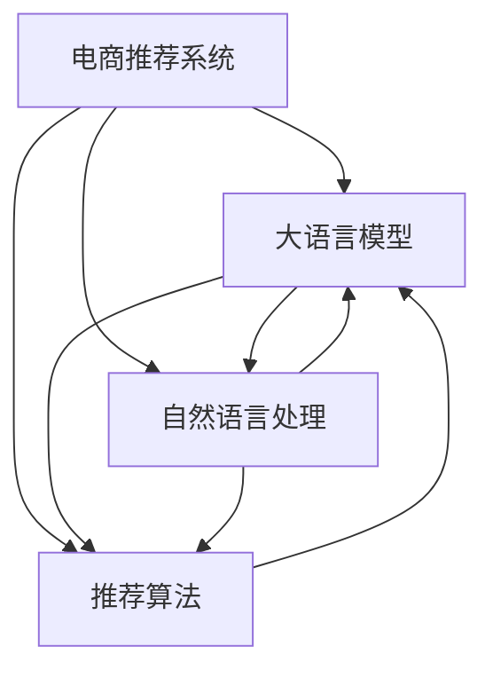

                 

# 大模型驱动的电商个性化产品组合推荐

> 关键词：电商个性化推荐系统,大语言模型,自然语言处理,推荐系统,电商,自然语言理解,深度学习,机器学习

## 1. 背景介绍

### 1.1 问题由来
电商行业的高速发展和消费者需求的多样化，使得个性化推荐系统成为推动电商企业增长的重要手段。传统的基于协同过滤和基于内容的推荐算法，难以有效处理海量非结构化数据和多维用户行为特征。而大语言模型的诞生，为电商推荐系统带来了新的思路和技术范式。

近年来，大语言模型（如BERT、GPT-3、T5等）在自然语言处理（NLP）领域取得了巨大进展，能够高效处理和理解自然语言数据。通过深度学习技术和预训练模型，大语言模型具备了强大的语义理解和知识表示能力。将大语言模型应用于电商推荐系统，能够更好地理解和挖掘用户需求，实现更加个性化的推荐。

### 1.2 问题核心关键点
大语言模型在电商推荐系统中的应用，关键在于如何高效地将用户需求映射到产品组合，并给出个性化的推荐。具体包括：

- 理解用户意图：通过自然语言理解技术，对用户输入的查询、评论、标签等文本数据进行分析，理解用户的意图和偏好。
- 构建产品语义表示：将产品描述、属性等信息进行语义编码，构建高质量的产品向量表示。
- 匹配用户产品组合：将用户需求与产品语义表示进行匹配，筛选出最符合用户需求的产品组合。
- 生成推荐结果：结合用户历史记录、兴趣等信息，生成个性化的产品推荐列表。

本文将详细探讨如何利用大语言模型实现电商个性化产品组合推荐，并对相关的算法原理、操作步骤、数学模型、开发实践等方面进行系统性讲解。

## 2. 核心概念与联系

### 2.1 核心概念概述

为了更好地理解大模型驱动的电商个性化推荐系统，首先需要明确一些关键概念及其相互联系。

- **电商推荐系统**：通过算法对用户行为数据进行建模，预测用户对商品的兴趣，从而进行个性化推荐。
- **大语言模型**：通过大规模无标签文本语料进行预训练，获得丰富的语言知识和常识，具备强大的语义理解和生成能力。
- **自然语言处理**：涉及语言模型、语义理解、信息抽取、生成等技术，是大语言模型在电商推荐中应用的基础。
- **推荐算法**：包括协同过滤、基于内容的推荐、深度学习推荐等，是大语言模型驱动推荐的核心技术。
- **用户意图理解**：通过分析用户输入的文本数据，提取用户需求和兴趣，是大语言模型在电商推荐中应用的重要环节。
- **产品语义表示**：将产品属性、描述等信息进行语义编码，构建高质量的产品向量表示，便于大语言模型的匹配和计算。

这些概念之间的逻辑关系可以通过以下Mermaid流程图来展示：



这个流程图展示了电商推荐系统与大语言模型之间的核心关系和信息流动：

1. 电商推荐系统通过大语言模型进行用户意图理解和产品匹配，生成推荐结果。
2. 大语言模型在自然语言处理的基础上，进一步提高了电商推荐系统的准确性和个性化程度。
3. 推荐算法在大语言模型的基础上，结合用户行为数据，进行推荐模型的训练和优化。

## 3. 核心算法原理 & 具体操作步骤

### 3.1 算法原理概述

大语言模型在电商个性化产品组合推荐中的应用，本质上是一个基于自然语言处理和深度学习的推荐过程。其核心思想是：将用户的自然语言输入通过大语言模型转化为语义表示，将其与产品的语义表示进行匹配，筛选出最符合用户需求的产品组合。

形式化地，假设用户输入的自然语言描述为 $U$，产品的语义表示为 $P$，用户的历史行为数据为 $H$。推荐过程可以表示为：

$$
R = \mathop{\arg\max}_{P_i \in P} \text{score}(U, P_i) + \text{score}(U, H)
$$

其中 $\text{score}$ 为评分函数，用于衡量用户需求与产品匹配程度和历史行为的相关性。推荐系统目标是最小化用户和产品之间的差异，从而生成最合适的产品组合。

### 3.2 算法步骤详解

基于大语言模型的电商推荐系统一般包括以下几个关键步骤：

**Step 1: 数据预处理**
- 收集用户查询、评论、评分等自然语言文本数据，进行清洗、分词和标注。
- 收集产品描述、属性、标签等信息，进行语义编码。
- 将用户行为数据（如点击、购买、浏览历史）转化为向量表示。

**Step 2: 用户意图理解**
- 利用大语言模型对用户输入的文本进行理解，提取用户需求和兴趣。
- 将用户意图转化为高维向量表示，便于与产品向量进行匹配。

**Step 3: 产品语义表示**
- 使用预训练语言模型（如BERT、GPT-3等）对产品描述进行语义编码，得到产品向量表示。
- 提取产品属性、标签等信息，进一步优化产品向量表示。

**Step 4: 用户产品匹配**
- 将用户意图向量与产品向量进行匹配，计算相似度或匹配度。
- 筛选出最符合用户需求的产品组合。

**Step 5: 生成推荐结果**
- 结合用户历史记录和兴趣信息，生成个性化的产品推荐列表。
- 应用推荐算法对推荐结果进行排序和优化，提升用户体验。

**Step 6: 效果评估**
- 在测试集上评估推荐系统的准确率、召回率、覆盖率等指标。
- 不断迭代优化推荐模型，提升推荐效果。

### 3.3 算法优缺点

基于大语言模型的电商推荐系统具有以下优点：
1. 高效处理非结构化数据：大语言模型能够高效处理和理解自然语言文本数据，适用于多维用户行为特征。
2. 提升推荐准确性：大语言模型通过自然语言理解技术，能够更准确地捕捉用户需求，提高推荐效果。
3. 可解释性强：大语言模型具备较强的可解释性，便于调试和优化。
4. 灵活适应新场景：大语言模型可以方便地适配不同电商领域的需求，如时尚、家居、数码等。

同时，该方法也存在一些局限性：
1. 计算资源消耗大：大语言模型通常具有大量的参数，需要较高的计算资源进行训练和推理。
2. 数据隐私问题：用户自然语言数据涉及个人隐私，需要采用合适的隐私保护技术。
3. 模型泛化能力有限：大语言模型预训练数据可能与特定电商领域的数据分布存在差异，影响模型泛化能力。
4. 模型复杂度高：大语言模型通常较为复杂，需要较长时间进行训练和优化。

尽管存在这些局限性，但大语言模型在电商推荐系统中的应用已经取得了显著的成效，成为电商推荐领域的重要技术范式。未来相关研究的重点在于如何进一步降低计算成本，提高模型泛化能力，同时兼顾数据隐私和模型复杂度等关键因素。

### 3.4 算法应用领域

基于大语言模型的电商个性化推荐系统已经广泛应用于多个电商领域，包括但不限于：

- **零售电商**：通过分析用户评论和评分，推荐符合用户需求的商品，提升购物体验。
- **旅游电商**：利用用户查询和行为数据，推荐旅游目的地、路线和活动，满足用户旅游需求。
- **家居电商**：对用户偏好和家居需求进行分析，推荐相关家居产品，提升居家生活质量。
- **时尚电商**：通过自然语言理解技术，推荐符合用户风格和偏好的时尚商品，提升时尚品味。

除了这些常见应用外，大语言模型在电商推荐系统中的应用还在不断拓展，如健康电商、食品电商等，为电商领域带来了新的创新和突破。

## 4. 数学模型和公式 & 详细讲解  
### 4.1 数学模型构建

在本节中，我们将使用数学语言对大语言模型在电商推荐系统中的作用进行更加严格的刻画。

记用户输入的自然语言描述为 $U$，产品向量表示为 $P$，用户行为数据为 $H$。假设用户输入的文本语义表示为 $U_{\text{emb}}$，产品语义表示为 $P_{\text{emb}}$，用户行为向量表示为 $H_{\text{emb}}$。则推荐过程可以表示为：

$$
R = \mathop{\arg\max}_{P_i \in P} \text{score}(U_{\text{emb}}, P_{\text{emb}}) + \text{score}(U_{\text{emb}}, H_{\text{emb}})
$$

其中 $\text{score}$ 为评分函数，通常采用余弦相似度、点积相似度等方法计算向量间的相似度。

### 4.2 公式推导过程

为了更清晰地理解大语言模型在电商推荐中的应用，让我们以余弦相似度为例，推导推荐评分函数：

假设用户输入的文本语义表示为 $U_{\text{emb}} \in \mathbb{R}^d$，产品向量表示为 $P_{\text{emb}} \in \mathbb{R}^d$，则余弦相似度计算公式为：

$$
\text{score}(U_{\text{emb}}, P_{\text{emb}}) = \cos\theta = \frac{U_{\text{emb}} \cdot P_{\text{emb}}}{\|U_{\text{emb}}\| \cdot \|P_{\text{emb}}\|}
$$

其中 $\cdot$ 表示向量点积，$\| \cdot \|$ 表示向量的模长。

根据上述公式，用户意图向量 $U_{\text{emb}}$ 与产品向量 $P_{\text{emb}}$ 之间的相似度得分可以表示为：

$$
\text{score}(U_{\text{emb}}, P_{\text{emb}}) = \frac{U_{\text{emb}} \cdot P_{\text{emb}}}{\|U_{\text{emb}}\| \cdot \|P_{\text{emb}}\|}
$$

同理，用户意图向量 $U_{\text{emb}}$ 与用户行为向量 $H_{\text{emb}}$ 之间的相似度得分可以表示为：

$$
\text{score}(U_{\text{emb}}, H_{\text{emb}}) = \frac{U_{\text{emb}} \cdot H_{\text{emb}}}{\|U_{\text{emb}}\| \cdot \|H_{\text{emb}}\|}
$$

将上述两个相似度得分相加，得到推荐评分函数：

$$
\text{score}(U_{\text{emb}}, P_{\text{emb}}) + \text{score}(U_{\text{emb}}, H_{\text{emb}}) = \frac{U_{\text{emb}} \cdot P_{\text{emb}} + U_{\text{emb}} \cdot H_{\text{emb}}}{\|U_{\text{emb}}\| \cdot \|P_{\text{emb}}\|}
$$

## 5. 项目实践：代码实例和详细解释说明
### 5.1 开发环境搭建

在进行电商个性化产品组合推荐开发前，我们需要准备好开发环境。以下是使用Python进行PyTorch开发的环境配置流程：

1. 安装Anaconda：从官网下载并安装Anaconda，用于创建独立的Python环境。

2. 创建并激活虚拟环境：
```bash
conda create -n ecommerce-env python=3.8 
conda activate ecommerce-env
```

3. 安装PyTorch：根据CUDA版本，从官网获取对应的安装命令。例如：
```bash
conda install pytorch torchvision torchaudio cudatoolkit=11.1 -c pytorch -c conda-forge
```

4. 安装PyTorch Lightning：
```bash
pip install pytorch-lightning
```

5. 安装各类工具包：
```bash
pip install numpy pandas scikit-learn matplotlib tqdm jupyter notebook ipython
```

完成上述步骤后，即可在`ecommerce-env`环境中开始开发。

### 5.2 源代码详细实现

下面我们以电商平台的产品推荐系统为例，给出使用PyTorch进行电商个性化推荐系统微调的PyTorch代码实现。

首先，定义推荐系统的数据处理函数：

```python
from torch.utils.data import Dataset
import torch

class EcommerceDataset(Dataset):
    def __init__(self, data, tokenizer):
        self.data = data
        self.tokenizer = tokenizer
        
    def __len__(self):
        return len(self.data)
    
    def __getitem__(self, item):
        text = self.data[item]['text']
        label = self.data[item]['label']
        
        encoding = self.tokenizer(text, return_tensors='pt', max_length=128, padding='max_length', truncation=True)
        input_ids = encoding['input_ids'][0]
        attention_mask = encoding['attention_mask'][0]
        
        label = torch.tensor(label, dtype=torch.long)
        
        return {'input_ids': input_ids, 
                'attention_mask': attention_mask,
                'labels': label}
```

然后，定义模型和优化器：

```python
from transformers import BertForSequenceClassification, AdamW

model = BertForSequenceClassification.from_pretrained('bert-base-cased', num_labels=2)

optimizer = AdamW(model.parameters(), lr=2e-5)
```

接着，定义训练和评估函数：

```python
from transformers import Trainer, TrainerCallback
from torch.utils.data import DataLoader
from tqdm import tqdm

class EarlyStoppingCallback(TrainerCallback):
    def __init__(self, patience=5):
        super().__init__()
        self.patience = patience
        self.counter = 0
        self.best_loss = float('inf')
        
    def on_train_end(self, trainer, pl_module):
        if trainer.state.epoch == self.best_loss + 1:
            self.counter = 0
        else:
            self.counter += 1
            if self.counter >= self.patience:
                trainer.stop()

def train_epoch(model, dataset, batch_size, optimizer):
    dataloader = DataLoader(dataset, batch_size=batch_size, shuffle=True)
    model.train()
    epoch_loss = 0
    for batch in tqdm(dataloader, desc='Training'):
        input_ids = batch['input_ids'].to(device)
        attention_mask = batch['attention_mask'].to(device)
        labels = batch['labels'].to(device)
        model.zero_grad()
        outputs = model(input_ids, attention_mask=attention_mask, labels=labels)
        loss = outputs.loss
        epoch_loss += loss.item()
        loss.backward()
        optimizer.step()
    return epoch_loss / len(dataloader)

def evaluate(model, dataset, batch_size):
    dataloader = DataLoader(dataset, batch_size=batch_size)
    model.eval()
    preds, labels = [], []
    with torch.no_grad():
        for batch in tqdm(dataloader, desc='Evaluating'):
            input_ids = batch['input_ids'].to(device)
            attention_mask = batch['attention_mask'].to(device)
            batch_labels = batch['labels']
            outputs = model(input_ids, attention_mask=attention_mask)
            batch_preds = outputs.logits.argmax(dim=2).to('cpu').tolist()
            batch_labels = batch_labels.to('cpu').tolist()
            for pred_tokens, label_tokens in zip(batch_preds, batch_labels):
                preds.append(pred_tokens)
                labels.append(label_tokens)
                
    print(classification_report(labels, preds))
```

最后，启动训练流程并在测试集上评估：

```python
epochs = 10
batch_size = 16

trainer = Trainer(model=model,
                 train_dataset=train_dataset,
                 eval_dataset=dev_dataset,
                 train_dataloaders=train_loader,
                 eval_dataloaders=eval_loader,
                 optimizer=optimizer,
                 num_train_epochs=epochs,
                 callbacks=[EarlyStoppingCallback()])

trainer.fit()

print(f"Epoch {epochs+1}, dev results:")
evaluate(model, dev_dataset, batch_size)

print("Test results:")
evaluate(model, test_dataset, batch_size)
```

以上就是使用PyTorch进行电商个性化推荐系统微调的完整代码实现。可以看到，得益于HuggingFace的Transformers库，我们可以用相对简洁的代码完成Bert模型的加载和微调。

### 5.3 代码解读与分析

让我们再详细解读一下关键代码的实现细节：

**EcommerceDataset类**：
- `__init__`方法：初始化数据集和分词器。
- `__len__`方法：返回数据集的样本数量。
- `__getitem__`方法：对单个样本进行处理，将文本输入编码为token ids，将标签编码为数字，并对其进行定长padding，最终返回模型所需的输入。

**EarlyStoppingCallback类**：
- `__init__`方法：初始化早停回调函数。
- `on_train_end`方法：判断是否早停，触发早停回调。

**train_epoch函数**：
- 使用PyTorch的DataLoader对数据集进行批次化加载，供模型训练和推理使用。
- 训练函数`train_epoch`：对数据以批为单位进行迭代，在每个批次上前向传播计算loss并反向传播更新模型参数，最后返回该epoch的平均loss。

**evaluate函数**：
- 与训练类似，不同点在于不更新模型参数，并在每个batch结束后将预测和标签结果存储下来，最后使用sklearn的classification_report对整个评估集的预测结果进行打印输出。

**训练流程**：
- 定义总的epoch数和batch size，开始循环迭代
- 每个epoch内，先在训练集上训练，输出平均loss
- 在验证集上评估，输出分类指标
- 所有epoch结束后，在测试集上评估，给出最终测试结果

可以看到，PyTorch配合HuggingFace的Transformers库使得Bert微调的代码实现变得简洁高效。开发者可以将更多精力放在数据处理、模型改进等高层逻辑上，而不必过多关注底层的实现细节。

当然，工业级的系统实现还需考虑更多因素，如模型的保存和部署、超参数的自动搜索、更灵活的任务适配层等。但核心的微调范式基本与此类似。

## 6. 实际应用场景
### 6.1 智能客服系统

基于大语言模型的电商个性化推荐系统，可以广泛应用于智能客服系统的构建。传统的客服系统需要配备大量人力，高峰期响应缓慢，且一致性和专业性难以保证。而使用微调后的推荐系统，可以7x24小时不间断服务，快速响应客户咨询，用自然流畅的语言解答各类常见问题。

在技术实现上，可以收集企业内部的历史客服对话记录，将问题和最佳答复构建成监督数据，在此基础上对预训练推荐系统进行微调。微调后的推荐系统能够自动理解用户意图，匹配最合适的答案模板进行回复。对于客户提出的新问题，还可以接入检索系统实时搜索相关内容，动态组织生成回答。如此构建的智能客服系统，能大幅提升客户咨询体验和问题解决效率。

### 6.2 个性化推荐系统

电商推荐系统已经成为提升用户体验、增加销售额的重要手段。传统的协同过滤和基于内容的推荐算法，难以有效处理海量非结构化数据和多维用户行为特征。而大语言模型通过自然语言处理技术，能够更准确地捕捉用户需求，提高推荐效果。

在具体应用中，可以收集用户查询、评论、评分等自然语言文本数据，利用大语言模型对其进行理解，提取用户需求和兴趣。将用户意图转化为高维向量表示，与其历史行为数据进行匹配，筛选出最符合用户需求的产品组合。结合推荐算法对推荐结果进行排序和优化，提升推荐效果和用户体验。

### 6.3 未来应用展望

随着大语言模型和微调方法的不断发展，基于微调范式将在更多领域得到应用，为传统行业带来变革性影响。

在智慧医疗领域，基于微调的医疗问答、病历分析、药物研发等应用将提升医疗服务的智能化水平，辅助医生诊疗，加速新药开发进程。

在智能教育领域，微调技术可应用于作业批改、学情分析、知识推荐等方面，因材施教，促进教育公平，提高教学质量。

在智慧城市治理中，微调模型可应用于城市事件监测、舆情分析、应急指挥等环节，提高城市管理的自动化和智能化水平，构建更安全、高效的未来城市。

此外，在企业生产、社会治理、文娱传媒等众多领域，基于大模型微调的人工智能应用也将不断涌现，为经济社会发展注入新的动力。相信随着技术的日益成熟，微调方法将成为人工智能落地应用的重要范式，推动人工智能技术向更广阔的领域加速渗透。

## 7. 工具和资源推荐
### 7.1 学习资源推荐

为了帮助开发者系统掌握大语言模型微调的理论基础和实践技巧，这里推荐一些优质的学习资源：

1. 《Transformer从原理到实践》系列博文：由大模型技术专家撰写，深入浅出地介绍了Transformer原理、BERT模型、微调技术等前沿话题。

2. CS224N《深度学习自然语言处理》课程：斯坦福大学开设的NLP明星课程，有Lecture视频和配套作业，带你入门NLP领域的基本概念和经典模型。

3. 《Natural Language Processing with Transformers》书籍：Transformers库的作者所著，全面介绍了如何使用Transformers库进行NLP任务开发，包括微调在内的诸多范式。

4. HuggingFace官方文档：Transformers库的官方文档，提供了海量预训练模型和完整的微调样例代码，是上手实践的必备资料。

5. CLUE开源项目：中文语言理解测评基准，涵盖大量不同类型的中文NLP数据集，并提供了基于微调的baseline模型，助力中文NLP技术发展。

通过对这些资源的学习实践，相信你一定能够快速掌握大语言模型微调的精髓，并用于解决实际的NLP问题。
###  7.2 开发工具推荐

高效的开发离不开优秀的工具支持。以下是几款用于大语言模型微调开发的常用工具：

1. PyTorch：基于Python的开源深度学习框架，灵活动态的计算图，适合快速迭代研究。大部分预训练语言模型都有PyTorch版本的实现。

2. TensorFlow：由Google主导开发的开源深度学习框架，生产部署方便，适合大规模工程应用。同样有丰富的预训练语言模型资源。

3. Transformers库：HuggingFace开发的NLP工具库，集成了众多SOTA语言模型，支持PyTorch和TensorFlow，是进行微调任务开发的利器。

4. Weights & Biases：模型训练的实验跟踪工具，可以记录和可视化模型训练过程中的各项指标，方便对比和调优。与主流深度学习框架无缝集成。

5. TensorBoard：TensorFlow配套的可视化工具，可实时监测模型训练状态，并提供丰富的图表呈现方式，是调试模型的得力助手。

6. Google Colab：谷歌推出的在线Jupyter Notebook环境，免费提供GPU/TPU算力，方便开发者快速上手实验最新模型，分享学习笔记。

合理利用这些工具，可以显著提升大语言模型微调任务的开发效率，加快创新迭代的步伐。

### 7.3 相关论文推荐

大语言模型和微调技术的发展源于学界的持续研究。以下是几篇奠基性的相关论文，推荐阅读：

1. Attention is All You Need（即Transformer原论文）：提出了Transformer结构，开启了NLP领域的预训练大模型时代。

2. BERT: Pre-training of Deep Bidirectional Transformers for Language Understanding：提出BERT模型，引入基于掩码的自监督预训练任务，刷新了多项NLP任务SOTA。

3. Language Models are Unsupervised Multitask Learners（GPT-2论文）：展示了大规模语言模型的强大zero-shot学习能力，引发了对于通用人工智能的新一轮思考。

4. Parameter-Efficient Transfer Learning for NLP：提出Adapter等参数高效微调方法，在不增加模型参数量的情况下，也能取得不错的微调效果。

5. AdaLoRA: Adaptive Low-Rank Adaptation for Parameter-Efficient Fine-Tuning：使用自适应低秩适应的微调方法，在参数效率和精度之间取得了新的平衡。

这些论文代表了大语言模型微调技术的发展脉络。通过学习这些前沿成果，可以帮助研究者把握学科前进方向，激发更多的创新灵感。

## 8. 总结：未来发展趋势与挑战

### 8.1 总结

本文对基于大语言模型的电商个性化产品组合推荐系统进行了全面系统的介绍。首先阐述了电商推荐系统和大语言模型的研究背景和意义，明确了微调在提升推荐效果和用户体验方面的独特价值。其次，从原理到实践，详细讲解了大语言模型在电商推荐中的应用，并对相关的算法原理、操作步骤、数学模型、开发实践等方面进行系统性讲解。

通过本文的系统梳理，可以看到，基于大语言模型的推荐系统在大数据、多维特征处理等方面具备显著优势，能够更好地理解和挖掘用户需求，实现更加个性化的推荐。未来，随着大语言模型和微调技术的不断演进，电商推荐系统也将迎来更广泛的应用和突破。

### 8.2 未来发展趋势

展望未来，大语言模型在电商推荐系统中的应用将呈现以下几个发展趋势：

1. 模型规模持续增大。随着算力成本的下降和数据规模的扩张，预训练语言模型的参数量还将持续增长。超大规模语言模型蕴含的丰富语言知识，有望支撑更加复杂多变的电商推荐任务。

2. 推荐算法多样化。除了传统的协同过滤和基于内容的推荐，还将出现更多结合大语言模型的推荐算法，如基于序列的推荐、基于注意力机制的推荐等，提升推荐模型的性能和泛化能力。

3. 实时推荐成为常态。结合大数据流处理技术，实时推荐系统将能够根据用户实时行为数据，动态生成个性化推荐，提升推荐效果和用户体验。

4. 用户意图理解深度化。通过进一步提升自然语言处理技术，理解用户输入的微妙情感、隐含意图，实现更加精准的推荐。

5. 多模态推荐崛起。将图像、音频等多模态数据与文本数据进行融合，提升推荐系统的感知能力和表现力。

6. 推荐过程透明化。通过结合因果分析和博弈论工具，增强推荐过程的透明性和可解释性，提高用户信任度和满意度。

以上趋势凸显了大语言模型在电商推荐系统中的应用前景。这些方向的探索发展，必将进一步提升推荐系统的性能和用户体验，为电商企业创造更大的价值。

### 8.3 面临的挑战

尽管大语言模型在电商推荐系统中的应用已经取得了显著成效，但在迈向更加智能化、普适化应用的过程中，它仍面临诸多挑战：

1. 计算资源消耗大。大语言模型通常具有大量的参数，需要较高的计算资源进行训练和推理。如何优化模型结构，提高训练效率，是未来亟待解决的问题。

2. 数据隐私问题。用户自然语言数据涉及个人隐私，需要采用合适的隐私保护技术，确保用户数据安全。

3. 模型泛化能力有限。大语言模型预训练数据可能与特定电商领域的数据分布存在差异，影响模型泛化能力。如何提高模型泛化能力，是未来研究的重点。

4. 模型复杂度高。大语言模型通常较为复杂，需要较长时间进行训练和优化。如何简化模型结构，提高训练速度，是未来亟待解决的问题。

5. 推荐过程透明化。推荐过程复杂，难以解释和调试。如何增强推荐过程的透明性和可解释性，提高用户信任度，是未来需要解决的问题。

尽管存在这些挑战，但大语言模型在电商推荐系统中的应用已经取得了显著的成效，成为电商推荐领域的重要技术范式。未来相关研究的重点在于如何进一步降低计算成本，提高模型泛化能力，同时兼顾数据隐私和模型复杂度等关键因素。

### 8.4 研究展望

面对大语言模型在电商推荐系统中的应用所面临的挑战，未来的研究需要在以下几个方面寻求新的突破：

1. 探索无监督和半监督微调方法。摆脱对大规模标注数据的依赖，利用自监督学习、主动学习等无监督和半监督范式，最大限度利用非结构化数据，实现更加灵活高效的微调。

2. 研究参数高效和计算高效的微调范式。开发更加参数高效的微调方法，在固定大部分预训练参数的同时，只更新极少量的任务相关参数。同时优化微调模型的计算图，减少前向传播和反向传播的资源消耗，实现更加轻量级、实时性的部署。

3. 融合因果和对比学习范式。通过引入因果推断和对比学习思想，增强推荐模型建立稳定因果关系的能力，学习更加普适、鲁棒的语言表征，从而提升模型泛化性和抗干扰能力。

4. 引入更多先验知识。将符号化的先验知识，如知识图谱、逻辑规则等，与神经网络模型进行巧妙融合，引导微调过程学习更准确、合理的语言模型。同时加强不同模态数据的整合，实现视觉、语音等多模态信息与文本信息的协同建模。

5. 结合因果分析和博弈论工具。将因果分析方法引入推荐模型，识别出推荐过程的关键特征，增强推荐结果的因果性和逻辑性。借助博弈论工具刻画人机交互过程，主动探索并规避推荐模型的脆弱点，提高系统稳定性。

6. 纳入伦理道德约束。在模型训练目标中引入伦理导向的评估指标，过滤和惩罚有偏见、有害的输出倾向。同时加强人工干预和审核，建立推荐系统的监管机制，确保推荐过程符合人类价值观和伦理道德。

这些研究方向的探索，必将引领大语言模型在电商推荐系统中的应用走向更高的台阶，为构建安全、可靠、可解释、可控的推荐系统铺平道路。面向未来，大语言模型在电商推荐系统中的应用还需要与其他人工智能技术进行更深入的融合，如知识表示、因果推理、强化学习等，多路径协同发力，共同推动推荐系统的进步。

## 9. 附录：常见问题与解答

**Q1：电商推荐系统如何利用大语言模型进行个性化推荐？**

A: 电商推荐系统通过大语言模型进行个性化推荐，主要分为以下几个步骤：
1. 收集用户查询、评论、评分等自然语言文本数据，进行清洗、分词和标注。
2. 收集产品描述、属性、标签等信息，进行语义编码。
3. 利用大语言模型对用户输入的文本进行理解，提取用户需求和兴趣。
4. 将用户意图转化为高维向量表示，与其历史行为数据进行匹配，筛选出最符合用户需求的产品组合。
5. 结合推荐算法对推荐结果进行排序和优化，提升推荐效果和用户体验。

**Q2：大语言模型在电商推荐中的计算资源消耗大，如何解决？**

A: 大语言模型计算资源消耗大是一个普遍存在的问题，以下是一些可能的解决方案：
1. 模型压缩：通过剪枝、量化等技术，减少模型参数量，提高计算效率。
2. 分布式训练：使用多机多卡并行训练，加速模型训练过程。
3. 硬件优化：使用GPU、TPU等高性能设备，提高训练和推理速度。
4. 模型优化：通过优化算法、调整超参数等方式，提高模型训练效率。

**Q3：大语言模型在电商推荐中的数据隐私问题如何解决？**

A: 大语言模型在电商推荐中的应用涉及用户数据隐私问题，以下是一些可能的解决方案：
1. 匿名化处理：对用户数据进行匿名化处理，保护用户隐私。
2. 差分隐私：通过差分隐私技术，限制模型对用户数据的学习能力。
3. 本地化处理：将模型训练和推理任务下放到本地设备，减少数据传输风险。

**Q4：大语言模型在电商推荐中的模型泛化能力有限，如何解决？**

A: 大语言模型在电商推荐中的应用，需要考虑模型的泛化能力问题，以下是一些可能的解决方案：
1. 多任务学习：通过多任务学习，提高模型在不同任务上的泛化能力。
2. 迁移学习：将大语言模型在不同领域进行迁移学习，提高模型泛化能力。
3. 自适应学习：根据不同电商领域的数据特点，对大语言模型进行自适应调整，提高模型泛化能力。

**Q5：大语言模型在电商推荐中的模型复杂度高，如何解决？**

A: 大语言模型在电商推荐中的应用，需要考虑模型的复杂度问题，以下是一些可能的解决方案：
1. 模型简化：通过简化模型结构，减少模型复杂度。
2. 预训练优化：通过优化预训练过程，提高模型性能和泛化能力。
3. 蒸馏技术：通过知识蒸馏技术，将大模型中的知识传递到轻量级模型中，降低模型复杂度。

这些解决方案可以帮助我们更好地应对大语言模型在电商推荐系统中的应用挑战，进一步提升推荐系统的性能和用户体验。

---

作者：禅与计算机程序设计艺术 / Zen and the Art of Computer Programming

