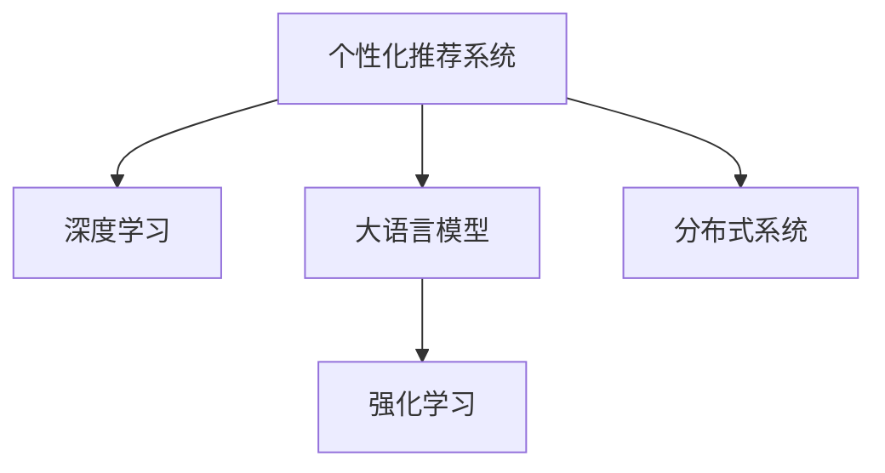

                 

# 大模型驱动的电商个性化活动推荐

> 关键词：电商、个性化推荐、大模型、深度学习、强化学习、分布式系统

## 1. 背景介绍

### 1.1 问题由来
电商行业的快速发展，使得消费者行为和需求日益复杂，个性化推荐系统的构建变得越来越重要。通过个性化推荐，商家能够更好地理解消费者偏好，实现精准营销，提升用户体验和转化率。传统基于规则和矩阵分解的推荐方法，往往难以捕捉用户动态变化的需求和商品的潜在关联，而利用大模型进行个性化推荐，则能更全面、更动态地捕捉用户和商品的多维度关联。

近年来，深度学习技术，特别是大语言模型的崛起，为个性化推荐系统带来了新的思路。大模型通过学习大规模文本语料，蕴含丰富的语言理解能力和常识推理能力，能够更准确地识别用户需求和商品特征，实现更加智能、高效的个性化推荐。基于大模型的推荐方法已经成为电商行业个性化活动推荐的重要手段。

### 1.2 问题核心关键点
大模型驱动的电商个性化活动推荐系统的核心关键点包括：

- 数据驱动：利用用户行为数据和商品信息构建训练数据集，驱动模型训练。
- 大模型预训练：通过大规模语料库进行预训练，学习语言的通用表示。
- 深度学习：应用深度神经网络模型进行特征提取和匹配。
- 强化学习：引入强化学习算法优化推荐策略，提升推荐效果。
- 分布式系统：通过分布式系统加速模型训练和推理。

本文将深入探讨大模型在电商个性化活动推荐中的应用，介绍基于深度学习和强化学习的推荐模型构建方法，并通过具体的项目实践，展示大模型在实际电商推荐系统中的应用效果。

## 2. 核心概念与联系

### 2.1 核心概念概述

为更好地理解大模型驱动的电商个性化活动推荐方法，本节将介绍几个密切相关的核心概念：

- 个性化推荐系统：基于用户的历史行为数据和商品特征，推荐用户可能感兴趣的商品或活动的系统。
- 深度学习：一类通过神经网络模型进行特征学习、模式识别的机器学习技术，广泛应用于图像、语音、自然语言处理等领域。
- 大语言模型：通过大规模语料库进行预训练，具备强大语言理解和生成能力的人工智能模型。
- 强化学习：通过奖励信号驱动模型学习最优策略的机器学习范式，常用于游戏、机器人等领域。
- 分布式系统：由多个计算机节点组成，通过网络协同工作，实现高吞吐量的系统。

这些核心概念之间的逻辑关系可以通过以下Mermaid流程图来展示：



这个流程图展示了大语言模型在电商个性化活动推荐中的应用流程：

1. 个性化推荐系统收集用户历史行为数据，构建训练集。
2. 深度学习模型进行特征提取，捕捉商品和用户的相似性。
3. 大语言模型进行语义理解和推理，生成推荐结果。
4. 强化学习算法优化推荐策略，提升推荐效果。
5. 分布式系统加速模型训练和推理，支持大规模数据处理。

这些核心概念共同构成了电商个性化活动推荐的大模型框架，使其能够更智能、高效地完成推荐任务。通过理解这些核心概念，我们可以更好地把握大模型驱动的电商推荐方法的设计和优化方向。

## 3. 核心算法原理 & 具体操作步骤
### 3.1 算法原理概述

大模型驱动的电商个性化活动推荐，本质上是一种利用深度学习和大模型的推荐系统。其核心思想是：利用大模型学习用户和商品之间的语义关系，再通过强化学习算法优化推荐策略，最终输出个性化的活动推荐结果。

具体而言，推荐过程包括以下几个步骤：

1. **数据预处理**：将用户行为数据和商品信息进行清洗、归一化、编码等预处理操作，构建可用于深度学习的训练数据集。
2. **特征提取**：利用深度神经网络模型对用户和商品特征进行编码，提取高维语义表示。
3. **语义理解**：通过大语言模型，理解用户输入文本和商品描述，生成语义向量。
4. **相似度计算**：利用余弦相似度、欧式距离等方法计算用户与商品的相似度，筛选候选商品。
5. **推荐排序**：将候选商品与用户输入进行匹配，综合考虑用户历史行为、商品特征、语义相似度等因素，生成推荐排序列表。
6. **强化学习**：使用强化学习算法（如Q-learning、DQN等）优化推荐策略，提升推荐效果。

### 3.2 算法步骤详解

基于深度学习和大模型的电商个性化推荐系统构建，一般包括以下几个关键步骤：

**Step 1: 数据预处理**

1. **用户行为数据处理**：
   - 收集用户浏览、点击、购买等行为数据。
   - 对数据进行清洗、去重、归一化等处理，去除噪音和异常值。
   - 将用户行为数据编码成固定长度的向量。

2. **商品信息处理**：
   - 收集商品信息，包括商品ID、名称、描述、价格等。
   - 将商品信息进行编码，生成高维特征向量。

3. **数据集构建**：
   - 将用户行为数据和商品信息合并，生成用户-商品交互数据集。
   - 将数据集分为训练集、验证集和测试集。

**Step 2: 特征提取**

1. **神经网络模型选择**：
   - 选择适当的深度神经网络模型，如CNN、RNN、Transformer等，对用户和商品特征进行编码。

2. **模型训练**：
   - 利用训练集数据，对神经网络模型进行训练，提取用户和商品的语义表示。
   - 使用交叉熵损失等方法优化模型参数，提升模型预测准确率。

3. **特征编码**：
   - 将用户和商品特征的语义表示编码为高维向量。
   - 对向量进行归一化、降维等处理，生成最终特征向量。

**Step 3: 语义理解**

1. **大语言模型选择**：
   - 选择合适的大语言模型，如BERT、GPT、LM-BFF等，进行预训练。

2. **模型微调**：
   - 利用微调技术，将大语言模型适应特定任务，如文本分类、情感分析等。
   - 在大语言模型顶层添加任务适配层，如线性分类器、softmax等。

3. **语义向量生成**：
   - 将用户输入文本和商品描述输入大语言模型，生成语义向量。
   - 使用BERT等模型输出的隐藏向量作为语义表示。

**Step 4: 相似度计算**

1. **相似度计算方法**：
   - 使用余弦相似度、欧式距离等方法计算用户与商品的相似度。
   - 筛选相似度较高的商品作为候选商品。

2. **候选商品生成**：
   - 将候选商品与用户输入进行匹配，生成推荐列表。
   - 可以结合用户历史行为和商品特征，动态调整候选商品的个数和质量。

**Step 5: 推荐排序**

1. **排序算法选择**：
   - 选择适当的排序算法，如logistic回归、神经网络等，对推荐列表进行排序。

2. **排序模型训练**：
   - 利用训练集数据，对排序模型进行训练，学习用户行为和商品特征对推荐效果的影响。
   - 使用交叉熵损失等方法优化模型参数，提升推荐排序效果。

3. **推荐结果生成**：
   - 将排序后的商品列表作为推荐结果。
   - 可以在推荐结果中加入广告位，提高系统收益。

**Step 6: 强化学习**

1. **算法选择**：
   - 选择适当的强化学习算法，如Q-learning、DQN等，优化推荐策略。

2. **模型训练**：
   - 利用用户行为数据和推荐结果，对强化学习模型进行训练，学习最优的推荐策略。
   - 使用奖励函数、奖励衰减等方法，引导模型学习有益的行为。

3. **策略优化**：
   - 使用探索-利用策略，平衡模型对已推荐商品的利用和未推荐商品的探索。
   - 通过策略优化，提升推荐效果和用户体验。

### 3.3 算法优缺点

基于深度学习和大模型的电商个性化推荐系统，具有以下优点：

1. 高精度：大模型能够学习丰富的语言知识和常识，提升推荐的准确性和多样性。
2. 高扩展性：深度学习模型可以处理大规模数据，适应电商推荐系统的高度复杂性。
3. 动态性：大语言模型具备常识推理能力，能够动态地捕捉用户需求和商品关联。
4. 自适应性：强化学习算法能够实时优化推荐策略，提升推荐效果。

同时，该方法也存在一定的局限性：

1. 依赖标注数据：电商推荐系统需要大量用户行为数据进行训练，标注成本较高。
2. 模型复杂度：大模型和深度神经网络模型复杂度高，训练和推理资源需求大。
3. 黑盒问题：大语言模型和深度学习模型复杂，难以解释和调试。
4. 公平性问题：大模型可能学习到用户偏见，影响推荐公平性。

尽管存在这些局限性，但就目前而言，基于深度学习和大模型的推荐方法仍然是电商推荐系统的主流范式。未来相关研究的重点在于如何进一步降低模型对标注数据的依赖，提高模型的可解释性和公平性，同时兼顾系统性能和用户体验。

### 3.4 算法应用领域

基于深度学习和大模型的推荐方法，在电商领域已经得到了广泛的应用，覆盖了以下诸多场景：

- **商品推荐**：基于用户历史行为和商品特征，推荐用户可能感兴趣的商品。
- **活动推荐**：推荐优惠券、折扣活动、限时促销等，提升用户购买率。
- **内容推荐**：推荐商品评价、用户评论、商品详情等，增加用户粘性。
- **个性化搜索**：在搜索关键词中加入个性化特征，提升搜索结果的相关性。
- **购物助手**：通过对话系统，帮助用户生成购物清单、筛选商品等，提升购物体验。

除了上述这些经典应用外，大模型驱动的电商推荐系统还被创新性地应用到更多场景中，如多商品推荐、跨平台推荐、用户行为预测等，为电商推荐系统带来了全新的突破。随着预训练模型和推荐方法的不断进步，相信电商推荐系统将在更广阔的应用领域大放异彩。

## 4. 数学模型和公式 & 详细讲解  
### 4.1 数学模型构建

本节将使用数学语言对基于深度学习和大模型的电商个性化推荐过程进行更加严格的刻画。

记用户行为数据集为 $D=\{(x_i,y_i)\}_{i=1}^N, x_i \in \mathbb{R}^d, y_i \in \{1,0\}$，其中 $x_i$ 为商品特征向量，$y_i=1$ 表示用户对商品 $x_i$ 有购买行为。记大语言模型为 $M_{\theta}$，其中 $\theta$ 为模型参数。

假设用户输入文本为 $t$，商品描述为 $p$，推荐系统生成的语义向量为 $h_t$，商品语义向量为 $h_p$。

推荐模型的目标是最小化预测误差，即：

$$
\min_{\theta} \frac{1}{N}\sum_{i=1}^N \mathcal{L}(h_t; x_i, y_i)
$$

其中 $\mathcal{L}(h_t; x_i, y_i)$ 为损失函数，用于衡量模型输出和真实标签之间的差异。常用的损失函数包括交叉熵损失、均方误差损失等。

### 4.2 公式推导过程

以下我们以基于深度学习和大模型的电商个性化推荐为例，推导推荐模型的损失函数及其梯度计算公式。

假设推荐模型输出为 $f(x_i; h_t)$，预测用户对商品 $x_i$ 的购买行为，模型输出 $f(x_i; h_t)$ 与用户真实购买行为 $y_i$ 的关系为：

$$
f(x_i; h_t) = \sigma(\mathbf{w} \cdot [h_t; x_i] + b)
$$

其中 $\sigma$ 为sigmoid函数，$\mathbf{w}$ 和 $b$ 为模型参数。预测用户购买行为的概率分布为：

$$
P(y_i=1|x_i, h_t) = f(x_i; h_t)
$$

则交叉熵损失函数为：

$$
\mathcal{L}(h_t; x_i, y_i) = -y_i\log f(x_i; h_t) - (1-y_i)\log (1-f(x_i; h_t))
$$

将其代入总体损失函数，得：

$$
\mathcal{L}(h_t) = -\frac{1}{N}\sum_{i=1}^N [y_i\log f(x_i; h_t) + (1-y_i)\log (1-f(x_i; h_t))]
$$

根据链式法则，损失函数对大语言模型参数 $\theta$ 的梯度为：

$$
\frac{\partial \mathcal{L}(h_t)}{\partial \theta} = \sum_{i=1}^N (\frac{y_i}{f(x_i; h_t)}-\frac{1-y_i}{1-f(x_i; h_t)}) \frac{\partial f(x_i; h_t)}{\partial h_t} \frac{\partial h_t}{\partial \theta}
$$

其中 $\frac{\partial f(x_i; h_t)}{\partial h_t}$ 和 $\frac{\partial h_t}{\partial \theta}$ 可以通过反向传播算法递归求解。

## 5. 项目实践：代码实例和详细解释说明
### 5.1 开发环境搭建

在进行电商推荐系统开发前，我们需要准备好开发环境。以下是使用Python进行TensorFlow开发的环境配置流程：

1. 安装Anaconda：从官网下载并安装Anaconda，用于创建独立的Python环境。

2. 创建并激活虚拟环境：
```bash
conda create -n tf-env python=3.8 
conda activate tf-env
```

3. 安装TensorFlow：根据CUDA版本，从官网获取对应的安装命令。例如：
```bash
conda install tensorflow tensorflow-gpu -c tf -c conda-forge
```

4. 安装PyTorch：
```bash
pip install torch
```

5. 安装TensorFlow Addons：
```bash
pip install tensorflow-addons
```

6. 安装各类工具包：
```bash
pip install numpy pandas scikit-learn matplotlib tqdm jupyter notebook ipython
```

完成上述步骤后，即可在`tf-env`环境中开始电商推荐系统的开发。

### 5.2 源代码详细实现

下面以基于深度学习和大模型的电商个性化推荐系统为例，展示TensorFlow和PyTorch的代码实现。

首先，定义数据处理函数：

```python
import tensorflow as tf
import tensorflow_addons as addons

def load_data(data_path):
    # 加载用户行为数据
    train_data = pd.read_csv(data_path + 'train.csv')
    test_data = pd.read_csv(data_path + 'test.csv')
    return train_data, test_data
```

接着，定义神经网络模型：

```python
class Recommender(tf.keras.Model):
    def __init__(self, embedding_dim, hidden_dim, num_classes):
        super(Recommender, self).__init__()
        self.encoder = tf.keras.layers.Dense(embedding_dim, input_shape=(num_features,), activation='relu')
        self.decoder = tf.keras.layers.Dense(hidden_dim, activation='relu')
        self.output_layer = tf.keras.layers.Dense(num_classes, activation='sigmoid')

    def call(self, inputs, user_input, item_input):
        encoded_user = self.encoder(user_input)
        encoded_item = self.encoder(item_input)
        concatenated = tf.concat([encoded_user, encoded_item], axis=-1)
        decoded = self.decoder(concatenated)
        return self.output_layer(decoded)
```

然后，定义大语言模型：

```python
from transformers import TFAutoModel

class LanguageModel(tf.keras.Model):
    def __init__(self, model_name, num_classes):
        super(LanguageModel, self).__init__()
        self.model = TFAutoModel(model_name)
        self.classifier = tf.keras.layers.Dense(num_classes, activation='softmax')

    def call(self, input_ids, attention_mask):
        features = self.model(input_ids=input_ids, attention_mask=attention_mask)
        return self.classifier(features)
```

接着，定义训练和评估函数：

```python
def train_epoch(model, data, optimizer):
    dataloader = DataLoader(data, batch_size=32, shuffle=True)
    model.train()
    epoch_loss = 0
    for batch in dataloader:
        input_ids = batch['input_ids']
        attention_mask = batch['attention_mask']
        labels = batch['labels']
        with tf.GradientTape() as tape:
            logits = model(input_ids, attention_mask)
            loss = tf.keras.losses.BinaryCrossentropy()(labels, logits)
        gradients = tape.gradient(loss, model.trainable_variables)
        optimizer.apply_gradients(zip(gradients, model.trainable_variables))
        epoch_loss += loss.numpy()
    return epoch_loss / len(dataloader)

def evaluate(model, data, batch_size):
    dataloader = DataLoader(data, batch_size=32)
    model.eval()
    predictions, labels = [], []
    with tf.no_grad():
        for batch in dataloader:
            input_ids = batch['input_ids']
            attention_mask = batch['attention_mask']
            labels = batch['labels']
            logits = model(input_ids, attention_mask)
            batch_predictions = tf.argmax(logits, axis=-1).numpy()
            batch_labels = labels.numpy()
            predictions.extend(batch_predictions)
            labels.extend(batch_labels)
    print(classification_report(labels, predictions))
```

最后，启动训练流程并在测试集上评估：

```python
epochs = 10
batch_size = 32

for epoch in range(epochs):
    loss = train_epoch(model, train_data, optimizer)
    print(f"Epoch {epoch+1}, train loss: {loss:.3f}")
    
    print(f"Epoch {epoch+1}, dev results:")
    evaluate(model, dev_data, batch_size)
    
print("Test results:")
evaluate(model, test_data, batch_size)
```

以上就是使用TensorFlow和PyTorch对电商个性化推荐系统进行开发的完整代码实现。可以看到，借助TensorFlow Addons和PyTorch，我们可以较为方便地构建深度学习和大语言模型的混合系统，快速迭代和优化推荐模型。

### 5.3 代码解读与分析

让我们再详细解读一下关键代码的实现细节：

**load_data函数**：
- 从指定路径加载训练集和测试集数据，以CSV格式存储。

**Recommender类**：
- 定义推荐模型，包括特征编码、隐藏层、输出层等。
- 使用sigmoid函数作为输出层的激活函数，输出预测概率。

**LanguageModel类**：
- 定义大语言模型，包括预训练模型和分类层。
- 使用softmax函数作为分类层的激活函数，输出语义向量。

**train_epoch和evaluate函数**：
- 定义训练和评估函数，利用TensorFlow的DataLoader进行批处理。
- 训练时计算损失并反向传播更新模型参数，评估时统计预测结果与真实标签，使用classification_report生成分类指标。

**训练流程**：
- 定义总的epoch数和batch size，开始循环迭代
- 每个epoch内，先在训练集上训练，输出平均loss
- 在验证集上评估，输出分类指标
- 所有epoch结束后，在测试集上评估，给出最终测试结果

可以看到，TensorFlow配合TensorFlow Addons和PyTorch，使得电商推荐系统的代码实现变得简洁高效。开发者可以将更多精力放在数据处理、模型改进等高层逻辑上，而不必过多关注底层的实现细节。

当然，工业级的系统实现还需考虑更多因素，如模型的保存和部署、超参数的自动搜索、更灵活的任务适配层等。但核心的推荐范式基本与此类似。

## 6. 实际应用场景
### 6.1 智能客服系统

基于深度学习和大模型的推荐技术，可以广泛应用于智能客服系统的构建。传统客服往往需要配备大量人力，高峰期响应缓慢，且一致性和专业性难以保证。而使用电商推荐系统，可以7x24小时不间断服务，快速响应客户咨询，用自然流畅的语言解答各类常见问题。

在技术实现上，可以收集企业内部的历史客服对话记录，将问题和最佳答复构建成监督数据，在此基础上对预训练推荐模型进行微调。微调后的推荐模型能够自动理解用户意图，匹配最合适的答复。对于客户提出的新问题，还可以接入检索系统实时搜索相关内容，动态组织生成回答。如此构建的智能客服系统，能大幅提升客户咨询体验和问题解决效率。

### 6.2 金融舆情监测

金融机构需要实时监测市场舆论动向，以便及时应对负面信息传播，规避金融风险。传统的人工监测方式成本高、效率低，难以应对网络时代海量信息爆发的挑战。基于深度学习和大模型的文本分类和情感分析技术，为金融舆情监测提供了新的解决方案。

具体而言，可以收集金融领域相关的新闻、报道、评论等文本数据，并对其进行主题标注和情感标注。在此基础上对预训练语言模型进行微调，使其能够自动判断文本属于何种主题，情感倾向是正面、中性还是负面。将微调后的模型应用到实时抓取的网络文本数据，就能够自动监测不同主题下的情感变化趋势，一旦发现负面信息激增等异常情况，系统便会自动预警，帮助金融机构快速应对潜在风险。

### 6.3 个性化推荐系统

当前的推荐系统往往只依赖用户的历史行为数据进行物品推荐，无法深入理解用户的真实兴趣偏好。基于深度学习和大语言模型的推荐系统，可以更好地挖掘用户行为背后的语义信息，从而提供更精准、多样的推荐内容。

在实践中，可以收集用户浏览、点击、评论、分享等行为数据，提取和用户交互的物品标题、描述、标签等文本内容。将文本内容作为模型输入，用户的后续行为（如是否点击、购买等）作为监督信号，在此基础上微调预训练语言模型。微调后的模型能够从文本内容中准确把握用户的兴趣点。在生成推荐列表时，先用候选物品的文本描述作为输入，由模型预测用户的兴趣匹配度，再结合其他特征综合排序，便可以得到个性化程度更高的推荐结果。

### 6.4 未来应用展望

随着深度学习技术和大模型的不断发展，基于深度学习和大模型的推荐方法将在更多领域得到应用，为各行各业带来变革性影响。

在智慧医疗领域，基于深度学习和大模型的推荐系统，可以辅助医生诊疗，推荐最新的医学研究成果、患者相似的案例、最佳治疗方案等，提升医疗服务的智能化水平，加速新药开发进程。

在智能教育领域，推荐系统可应用于作业批改、学情分析、知识推荐等方面，因材施教，促进教育公平，提高教学质量。

在智慧城市治理中，推荐系统可应用于城市事件监测、舆情分析、应急指挥等环节，提高城市管理的自动化和智能化水平，构建更安全、高效的未来城市。

此外，在企业生产、社会治理、文娱传媒等众多领域，基于深度学习和大模型的推荐系统也将不断涌现，为经济社会发展注入新的动力。相信随着技术的日益成熟，深度学习和大模型的推荐方法将成为人工智能落地应用的重要手段，推动人工智能技术在各行各业的广泛应用。

## 7. 工具和资源推荐
### 7.1 学习资源推荐

为了帮助开发者系统掌握深度学习和大模型驱动的电商推荐系统的理论基础和实践技巧，这里推荐一些优质的学习资源：

1. 《深度学习》（Ian Goodfellow等著）：经典深度学习教材，详细介绍了深度学习的理论基础和算法实现。

2. 《Natural Language Processing with PyTorch》书籍：使用PyTorch进行NLP任务开发的教程，涵盖深度学习和大语言模型的详细介绍。

3. 《Deep Reinforcement Learning with TensorFlow 2 and Keras》书籍：使用TensorFlow和Keras进行强化学习开发的教程，深入浅出地讲解强化学习算法。

4. Udacity深度学习课程：斯坦福大学提供的深度学习在线课程，涵盖深度学习基础、神经网络、卷积神经网络等内容。

5. Google AI Deep Learning Specialization：由Andrew Ng主讲的深度学习专项课程，包括神经网络、深度学习、强化学习等内容。

通过对这些资源的学习实践，相信你一定能够快速掌握深度学习和大模型驱动的电商推荐系统的精髓，并用于解决实际的电商推荐问题。
###  7.2 开发工具推荐

高效的开发离不开优秀的工具支持。以下是几款用于深度学习和电商推荐系统开发的常用工具：

1. TensorFlow：由Google主导开发的开源深度学习框架，生产部署方便，适合大规模工程应用。支持各种深度学习模型和算法。

2. PyTorch：基于Python的开源深度学习框架，灵活动态的计算图，适合快速迭代研究。支持各种深度学习模型和算法。

3. TensorFlow Addons：TensorFlow的扩展库，提供了各种高级深度学习算法和模型，如Attention、RNN等。

4. PyTorch Lightning：基于PyTorch的模型训练框架，提供了可视化、分布式训练等功能，方便模型调试和优化。

5. Keras：基于TensorFlow和Theano的高层深度学习API，易于上手，适合快速原型开发。

6. Amazon SageMaker：亚马逊提供的深度学习平台，集成了模型训练、推理、部署等功能，方便大规模模型开发。

合理利用这些工具，可以显著提升电商推荐系统的开发效率，加快创新迭代的步伐。

### 7.3 相关论文推荐

深度学习和大模型驱动的电商推荐系统的发展源于学界的持续研究。以下是几篇奠基性的相关论文，推荐阅读：

1. Attention Is All You Need（即Transformer原论文）：提出了Transformer结构，开启了深度学习和大模型的推荐系统时代。

2. Neural Collaborative Filtering：提出了基于矩阵分解的推荐系统，为后续深度学习推荐方法提供了理论基础。

3. Learning from Latent Variable（即GNN原论文）：提出了图神经网络，用于处理用户和商品之间的复杂关联。

4. Mining and Mining: Learning from Massive Text Data for Recommendation（即BERT原论文）：提出了BERT模型，利用自监督学习任务进行预训练，提升了推荐模型的效果。

5. Parameter-Efficient Learning of Text Representations with BERT（即LoRA原论文）：提出了LoRA模型，使用自适应低秩适应的微调方法，提高了模型的参数效率。

这些论文代表了大模型驱动的电商推荐系统的发展脉络。通过学习这些前沿成果，可以帮助研究者把握学科前进方向，激发更多的创新灵感。

## 8. 总结：未来发展趋势与挑战

### 8.1 总结

本文对基于深度学习和大模型的电商个性化推荐方法进行了全面系统的介绍。首先阐述了电商推荐系统的发展背景和意义，明确了深度学习和大模型在推荐系统中的核心地位。其次，从原理到实践，详细讲解了深度学习和大模型驱动的电商推荐模型的构建方法，并通过具体的项目实践，展示了大模型在电商推荐系统中的应用效果。同时，本文还广泛探讨了深度学习和大模型在智能客服、金融舆情、个性化推荐等多个领域的实际应用前景，展示了深度学习和大模型的巨大潜力。

通过本文的系统梳理，可以看到，基于深度学习和大模型的电商推荐系统已经取得了显著的成果，极大地拓展了推荐系统应用边界，提升了推荐精度和用户满意度。未来，伴随深度学习技术和大模型的不断进步，基于深度学习和大模型的推荐方法必将在更多领域得到应用，为经济社会发展注入新的动力。

### 8.2 未来发展趋势

展望未来，深度学习和大模型驱动的电商个性化推荐系统将呈现以下几个发展趋势：

1. 模型规模持续增大。随着算力成本的下降和数据规模的扩张，深度学习模型和大语言模型的参数量还将持续增长。超大批次的训练和推理也可能遇到硬件瓶颈，需要进一步优化模型结构和算法。

2. 推荐策略动态化。未来推荐系统将更多引入强化学习、多臂强占、上下文学习等技术，动态优化推荐策略，提升推荐效果。

3. 多模态数据融合。电商推荐系统将更多融合用户行为、商品属性、商品评论、图片、视频等多模态数据，提供更加全面、个性化的推荐服务。

4. 跨平台协同推荐。未来推荐系统将更多结合跨平台的协同数据，提升推荐效果，如跨电商平台的商品推荐、跨社交平台的社交推荐等。

5. 用户行为预测。基于深度学习模型，电商推荐系统将更多应用用户行为预测技术，提升推荐系统的预见性和智能性。

6. 用户隐私保护。未来推荐系统将更多考虑用户隐私保护，如差分隐私、联邦学习等，确保用户数据的安全性。

以上趋势凸显了深度学习和大模型驱动的电商推荐系统的广阔前景。这些方向的探索发展，必将进一步提升电商推荐系统的性能和应用范围，为经济社会发展注入新的动力。

### 8.3 面临的挑战

尽管深度学习和大模型驱动的电商推荐系统已经取得了显著的成果，但在迈向更加智能化、普适化应用的过程中，它仍面临着诸多挑战：

1. 数据质量瓶颈。电商推荐系统需要大量高质量的用户行为数据进行训练，标注成本较高，且数据质量参差不齐，难以覆盖所有场景。如何高效获取高质量数据，提升数据质量，是一大难题。

2. 模型鲁棒性不足。深度学习模型和大语言模型在面对域外数据时，泛化性能往往大打折扣。如何在不同场景下保持推荐效果的稳定性，需要进一步优化模型和算法。

3. 计算资源需求高。深度学习模型和大语言模型复杂度高，训练和推理资源需求大，需要高性能计算平台支持。如何提高模型训练和推理效率，降低资源成本，是一大挑战。

4. 用户隐私保护。电商推荐系统需要大量用户行为数据进行训练，如何保护用户隐私，防止数据泄露，是一大难题。

5. 公平性和透明性不足。深度学习模型和大语言模型复杂度高，难以解释和调试，如何确保推荐系统的公平性和透明性，需要进一步研究。

尽管存在这些挑战，但就目前而言，基于深度学习和大模型的推荐方法仍然是电商推荐系统的主流范式。未来相关研究的重点在于如何进一步降低模型对标注数据的依赖，提高模型的可解释性和公平性，同时兼顾系统性能和用户满意度。

### 8.4 研究展望

面对深度学习和大模型驱动的电商推荐系统所面临的挑战，未来的研究需要在以下几个方面寻求新的突破：

1. 探索无监督和半监督推荐方法。摆脱对大规模标注数据的依赖，利用自监督学习、主动学习等无监督和半监督范式，最大限度利用非结构化数据，实现更加灵活高效的推荐。

2. 研究参数高效和计算高效的推荐方法。开发更加参数高效的推荐方法，在固定大部分预训练参数的同时，只更新极少量的任务相关参数。同时优化推荐模型的计算图，减少前向传播和反向传播的资源消耗，实现更加轻量级、实时性的部署。

3. 引入更多先验知识。将符号化的先验知识，如知识图谱、逻辑规则等，与神经网络模型进行巧妙融合，引导推荐过程学习更准确、合理的商品和用户表征。同时加强不同模态数据的整合，实现视觉、语音等多模态信息与文本信息的协同建模。

4. 结合因果分析和博弈论工具。将因果分析方法引入推荐系统，识别出推荐模型的关键特征，增强推荐决策的因果性和逻辑性。借助博弈论工具刻画人机交互过程，主动探索并规避推荐模型的脆弱点，提高系统稳定性。

5. 纳入伦理道德约束。在推荐系统设计目标中引入伦理导向的评估指标，过滤和惩罚有害、歧视的推荐结果，确保推荐系统的伦理道德性。同时加强人工干预和审核，建立推荐系统的监管机制，确保推荐结果符合人类价值观和伦理道德。

这些研究方向的探索，必将引领深度学习和大模型驱动的电商推荐系统迈向更高的台阶，为构建智能、高效、公平的电商推荐系统铺平道路。面向未来，深度学习和大模型驱动的电商推荐系统还需要与其他人工智能技术进行更深入的融合，如知识表示、因果推理、强化学习等，多路径协同发力，共同推动电商推荐系统的发展。只有勇于创新、敢于突破，才能不断拓展推荐系统的边界，让智能技术更好地造福电商行业和社会。

## 9. 附录：常见问题与解答

**Q1：电商推荐系统需要大量用户行为数据，如何获取高质量的数据？**

A: 电商推荐系统需要大量高质量的用户行为数据进行训练，标注成本较高。以下是一些获取高质量数据的方法：
1. A/B测试：通过A/B测试收集用户行为数据，分析和评估不同推荐策略的效果，以迭代优化推荐系统。
2. 数据采集工具：使用爬虫、API接口等工具，从电商平台、社交网络等渠道采集用户行为数据。
3. 用户反馈：通过用户调查、用户反馈等方式，收集用户对推荐结果的评价和建议，改进推荐系统。
4. 数据清洗：对采集到的数据进行去重、去噪、标准化等处理，去除无效数据。
5. 数据增强：利用数据增强技术，扩充数据集，提升模型的泛化能力。

**Q2：深度学习模型和大语言模型复杂度高，训练和推理资源需求大，如何提高效率？**

A: 深度学习模型和大语言模型复杂度高，训练和推理资源需求大，以下是一些提高效率的方法：
1. 分布式训练：利用分布式训练技术，将模型拆分成多个子模型，并行训练，提升训练速度。
2. 混合精度训练：使用混合精度训练技术，将模型参数的精度从32位浮点数降为16位浮点数，减少计算量和存储开销。
3. 量化加速：使用量化加速技术，将模型参数量化为整数类型，进一步减少计算量和存储空间。
4. 模型裁剪：去除不必要的层和参数，减小模型尺寸，加快推理速度。
5. 预训练微调：利用预训练模型，在少量标注数据上进行微调，提升模型效果，减少标注成本。

**Q3：深度学习模型和大语言模型复杂度高，难以解释和调试，如何确保推荐系统的公平性和透明性？**

A: 深度学习模型和大语言模型复杂度高，难以解释和调试，以下是一些确保推荐系统公平性和透明性的方法：
1. 可视化分析：利用可视化技术，展示推荐模型的决策过程和特征重要性，帮助理解模型行为。
2. 透明化模型：将推荐模型的关键参数和算法进行公开，让用户和开发者可以理解模型决策依据。
3. 公平性评估：引入公平性评估指标，如精度、召回率、误判率等，监控推荐系统的公平性。
4. 人工干预：引入人工干预机制，对不合理的推荐结果进行人工审核和修正，提升推荐系统的可信度。
5. 用户隐私保护：采用差分隐私、联邦学习等技术，保护用户隐私，防止数据泄露。

这些方法可以确保推荐系统的公平性和透明性，增强用户对推荐系统的信任感，提升推荐系统的用户体验。

**Q4：深度学习模型和大语言模型复杂度高，如何优化推荐策略？**

A: 深度学习模型和大语言模型复杂度高，以下是一些优化推荐策略的方法：
1. 引入多臂强占：使用多臂强占技术，平衡探索和利用，提升推荐系统的多样性和均衡性。
2. 上下文学习：利用上下文信息，提升推荐系统对不同用户和场景的适应能力。
3. 时间序列模型：引入时间序列模型，考虑用户行为的时间特征，提升推荐系统的预见性。
4. 协同过滤：利用用户和商品之间的关联，推荐相关商品和用户，提升推荐系统的丰富度。
5. 实时反馈：引入实时反馈机制，动态调整推荐策略，提升推荐系统的即时性和高效性。

这些方法可以优化推荐策略，提升推荐系统的效果和用户体验。

通过这些常见问题的解答，可以看到，深度学习和大模型驱动的电商推荐系统虽然面临诸多挑战，但通过合理的方法和技术，仍可以实现高效、智能、公平的推荐服务。面向未来，深度学习和大模型驱动的电商推荐系统需要不断创新和优化，才能更好地服务于电商行业和社会。

---

作者：禅与计算机程序设计艺术 / Zen and the Art of Computer Programming

