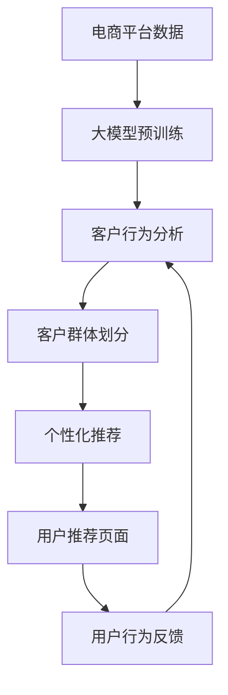

                 

# 大模型驱动的电商平台智能客户细分

> 关键词：大模型,客户细分,电商平台,智能推荐,自然语言处理(NLP),深度学习,无监督学习

## 1. 背景介绍

在互联网时代，电子商务平台已成为消费者购买商品和服务的的首选渠道。然而，面对海量用户和丰富多样的商品，如何准确识别并细分不同特征的客户群体，提供个性化的购物体验，是大规模电商平台面临的一项巨大挑战。传统的客户细分方法，如基于聚类算法的客户画像，往往难以捕捉用户深层次的行为特征和需求偏好，且计算复杂度较高。

近年来，大语言模型和大规模预训练技术在自然语言处理(NLP)领域取得了显著进展。以BERT、GPT等为代表的大模型，通过在大量无标签文本数据上预训练，学习到丰富的语言表征，具备强大的语义理解和生成能力。这些模型不仅可以应用于文本分类、情感分析等NLP任务，还可以在电商平台数据上找到广阔的应用前景。本文将重点探讨大语言模型如何驱动电商平台实现智能客户细分，构建个性化推荐引擎，提升用户满意度和平台运营效率。

## 2. 核心概念与联系

### 2.1 核心概念概述

为更好地理解大模型驱动的电商平台智能客户细分方法，本节将介绍几个关键概念：

- 大模型(Large Model)：如BERT、GPT等，通过大规模无标签文本预训练，学习到丰富的语言知识和表示能力。

- 客户细分(Customer Segmentation)：将客户根据其特征和行为进行分组，以便更精准地营销和定制服务。

- 电商平台(E-commerce Platform)：提供在线购物、支付、物流等服务的互联网平台，如淘宝、京东、亚马逊等。

- 个性化推荐系统(Personalized Recommendation System)：利用机器学习算法，根据用户的历史行为和特征，生成个性化的商品推荐。

- 深度学习(Deep Learning)：一种基于神经网络的机器学习范式，能够学习复杂的数据模式，应用于各种任务中。

- 无监督学习(Unsupervised Learning)：指在无标签数据上进行模式识别和特征提取，适用于客户行为分析等场景。

- 自然语言处理(NLP)：利用计算机处理和理解人类语言的技术，应用于客户评论分析、聊天机器人等。

这些概念之间有着紧密的联系，通过大模型结合电商平台数据，可以实现客户细分和个性化推荐，最终提升用户体验和平台运营效率。

### 2.2 核心概念原理和架构的 Mermaid 流程图



这个流程图展示了从电商平台数据到大模型驱动的客户细分和推荐流程：

1. 电商平台数据：收集用户行为数据，包括浏览记录、购买历史、评价反馈等。
2. 大模型预训练：在无标签文本数据上预训练大模型，学习语言表示和语义理解能力。
3. 客户行为分析：使用大模型对用户评论和行为数据进行分析，提取用户特征。
4. 客户群体划分：将用户根据行为特征分成不同群体，识别出各类特征客户。
5. 个性化推荐：针对不同客户群体生成个性化推荐结果，推送至用户页面。
6. 用户行为反馈：收集用户对推荐结果的反馈数据，进一步训练和优化模型。

通过大模型，电商平台可以实现智能化的客户细分和推荐，从而提升用户体验和运营效率。

## 3. 核心算法原理 & 具体操作步骤
### 3.1 算法原理概述

基于大模型的电商平台客户细分方法，核心思想是利用无监督学习，通过大模型学习用户评论和行为数据，提取用户特征，并在此基础上进行客户群体划分和个性化推荐。具体步骤如下：

1. 收集电商平台用户评论和行为数据，清洗并预处理。
2. 在大规模无标签文本数据上预训练大模型，学习语言表示和语义理解能力。
3. 使用大模型对用户评论和行为数据进行编码，提取用户特征。
4. 利用聚类算法或其他划分方法，将用户分成不同群体。
5. 根据不同客户群体的特征，生成个性化推荐结果。
6. 持续收集用户反馈数据，更新大模型和推荐策略。

### 3.2 算法步骤详解

#### 3.2.1 数据收集与预处理

1. **数据收集**：电商平台需要收集用户评论、浏览记录、购买历史、评价反馈等数据。
   - 评论数据：包含用户对商品的评价、评分和评论文本。
   - 行为数据：包括用户的浏览记录、搜索历史、点击行为、购买记录等。
   - 标签数据：如果需要，可以收集部分有标签的监督数据，用于微调模型。

2. **数据清洗**：对收集的数据进行去重、去噪、标准化处理，去除无用信息，保证数据质量。
   - 去重：去除重复的评论和行为记录。
   - 去噪：删除低质量、异常值和噪声数据。
   - 标准化：统一日期格式、去除敏感信息、统一商品编码等。

3. **特征提取**：将清洗后的数据转换成模型可以处理的格式，提取有用的特征。
   - 评论特征：提取评论中的情感、词汇、主题等文本特征。
   - 行为特征：提取浏览时长、点击率、购买频率等行为特征。
   - 用户特征：根据用户的历史数据，提取年龄、性别、职业等用户特征。

#### 3.2.2 大模型预训练

1. **选择预训练模型**：选择合适的预训练大模型，如BERT、GPT等。
   - BERT：适用于处理结构化文本数据，能够捕捉丰富的语义信息。
   - GPT：适用于生成式任务，能够生成自然流畅的语言文本。

2. **预训练过程**：在大规模无标签文本数据上对预训练模型进行微调。
   - 使用自监督学习任务，如掩码语言模型、下一个句子预测等，学习语言表示。
   - 通过大量的预训练数据，提升模型的通用语言能力和泛化性能。

3. **提取语言表示**：使用预训练模型对用户评论和行为数据进行编码，提取语言表示。
   - 对于评论数据，将评论文本输入模型，输出文本表示向量。
   - 对于行为数据，可以将行为特征进行编码，生成行为表示向量。

#### 3.2.3 客户行为分析

1. **特征向量计算**：使用大模型提取用户评论和行为数据的语言表示。
   - 对评论数据，输入BERT模型，输出[CLS]向量的表示。
   - 对行为数据，将行为特征转换为向量，输入模型进行编码。

2. **用户特征融合**：将文本表示和行为表示进行融合，生成综合的用户特征向量。
   - 文本表示和行为表示拼接或加权融合，生成综合用户特征向量。
   - 对于多特征融合，可以使用线性加权、多模态融合等方法。

#### 3.2.4 客户群体划分

1. **聚类算法**：使用聚类算法对用户特征向量进行划分，生成不同客户群体。
   - K-means算法：使用K-means算法对用户特征进行聚类。
   - DBSCAN算法：使用DBSCAN算法对用户特征进行密度聚类。
   - 层次聚类算法：使用层次聚类算法构建聚类树。

2. **客户群体标签**：为每个客户群体分配唯一的标签，用于后续推荐。
   - 标签设置：根据聚类结果，设置不同客户群体的标签。
   - 标签编码：将客户群体标签编码为数值型特征，用于模型训练。

#### 3.2.5 个性化推荐

1. **模型选择**：选择合适的推荐模型，如基于协同过滤、基于内容、基于深度学习的推荐模型。
   - 协同过滤：基于用户历史行为相似度进行推荐。
   - 基于内容：基于商品描述和用户特征相似度进行推荐。
   - 基于深度学习：使用神经网络模型学习用户和商品的关联。

2. **推荐生成**：根据客户群体的特征，生成个性化推荐结果。
   - 对于文本数据，使用BERT等模型生成文本推荐结果。
   - 对于行为数据，使用神经网络模型生成行为推荐结果。
   - 将文本推荐和行为推荐融合，生成最终推荐结果。

3. **推荐展示**：将推荐结果展示在用户页面上，供用户选择。
   - 展示形式：展示商品图片、简短描述、评分等信息。
   - 推荐算法：根据点击率、曝光率、互动率等指标进行排序和展示。

### 3.3 算法优缺点

#### 3.3.1 优点

1. **高效特征提取**：利用大模型的语言表示能力，能够自动提取丰富的用户特征，无需手动设计特征工程。
2. **泛化性能强**：通过在大规模无标签数据上预训练大模型，提升模型的泛化能力，更好地适应新用户和新场景。
3. **可解释性强**：大模型生成的语言表示，具有较好的可解释性，便于理解用户的语言行为。
4. **可扩展性强**：大模型的预训练和微调过程，可以灵活扩展到多个电商平台和多个任务，具有较好的通用性。

#### 3.3.2 缺点

1. **数据质量依赖高**：大模型的性能很大程度上依赖于输入数据的质量，数据清洗和预处理较为复杂。
2. **计算资源消耗大**：大模型的预训练和推理，需要大量的计算资源，对硬件设备要求较高。
3. **模型复杂度高**：大模型参数量庞大，训练和推理过程较为复杂，需要专业的技术支持。
4. **业务场景复杂**：电商平台业务场景复杂多变，需要针对不同场景进行个性化定制，增加实现难度。

### 3.4 算法应用领域

基于大模型的电商平台智能客户细分方法，已经在电商、零售、金融等多个领域得到了广泛应用，取得了显著的效果。以下是几个典型应用场景：

- **电商平台推荐系统**：如淘宝、京东、亚马逊等，使用大模型分析用户行为数据，实现个性化推荐。
- **零售业客户细分**：如服装、食品等零售企业，使用大模型进行客户行为分析和市场细分。
- **金融领域用户分析**：如银行、保险等金融机构，使用大模型进行用户画像和风险评估。
- **智能客服系统**：使用大模型分析客户反馈数据，提高客服系统响应速度和用户满意度。
- **社交媒体分析**：如微博、微信等社交平台，使用大模型分析用户评论和行为数据，实现内容推荐和用户画像。

## 4. 数学模型和公式 & 详细讲解 & 举例说明

### 4.1 数学模型构建

我们以电商平台推荐系统为例，构建一个基于大模型的推荐模型。

假设电商平台有$m$个用户，$n$个商品，用户-商品交互矩阵为$A \in \mathbb{R}^{m \times n}$，其中$A_{i,j}$表示用户$i$是否购买商品$j$。

定义用户评论数据为$X \in \mathbb{R}^{m \times d}$，其中$d$为评论特征维度。定义行为数据为$Y \in \mathbb{R}^{m \times e}$，其中$e$为行为特征维度。

定义预训练模型为$M_{\theta}$，用户行为表示为$u_i = M_{\theta}(X_i)$，商品特征表示为$v_j = M_{\theta}(Y_j)$。

定义用户-商品评分矩阵为$R \in \mathbb{R}^{m \times n}$，其中$R_{i,j}$表示用户$i$对商品$j$的评分。

推荐模型的目标是最大化用户评分，即：

$$
\max_{\theta} \sum_{i=1}^m \sum_{j=1}^n R_{i,j} \log \sigma(\langle u_i, v_j \rangle)
$$

其中$\sigma(\cdot)$为sigmoid函数，$\langle \cdot, \cdot \rangle$为点积运算。

### 4.2 公式推导过程

1. **评论特征提取**：将用户评论数据$X$输入预训练模型$M_{\theta}$，输出用户评论表示$u_i$。
   - 设$X_i$为第$i$个用户的评论数据，$X_i \in \mathbb{R}^{d}$。
   - 将$X_i$输入模型，输出用户评论表示$u_i \in \mathbb{R}^{d'}$，其中$d' \ll d$。

2. **行为特征提取**：将用户行为数据$Y$输入预训练模型$M_{\theta}$，输出商品特征表示$v_j$。
   - 设$Y_j$为第$j$个商品的特征数据，$Y_j \in \mathbb{R}^{e}$。
   - 将$Y_j$输入模型，输出商品特征表示$v_j \in \mathbb{R}^{e'}$，其中$e' \ll e$。

3. **用户评分预测**：根据用户评论表示和商品特征表示，预测用户对商品的评分。
   - 设$\theta$为预训练模型参数。
   - 将$u_i$和$v_j$进行点积，得到预测评分$\hat{R}_{i,j} = \langle u_i, v_j \rangle$。
   - 通过sigmoid函数，将预测评分转换为[0,1]之间的概率值$\hat{p}_{i,j} = \sigma(\hat{R}_{i,j})$。

4. **损失函数计算**：使用均方误差损失函数，计算模型预测评分与实际评分之间的误差。
   - 设$R_{i,j}$为实际评分，$\hat{p}_{i,j}$为预测评分。
   - 均方误差损失函数为$L(R_{i,j}, \hat{p}_{i,j}) = (R_{i,j} - \hat{p}_{i,j})^2$。

5. **模型优化**：通过优化损失函数，更新预训练模型参数$\theta$。
   - 使用梯度下降算法，最小化均方误差损失函数。
   - 优化过程为：
   $$
   \theta = \theta - \eta \nabla_{\theta}L(R, \hat{p})
   $$
   其中$\eta$为学习率，$\nabla_{\theta}L(R, \hat{p})$为损失函数的梯度。

### 4.3 案例分析与讲解

假设电商平台收集了1万个用户的评论数据，每个用户有10条评论，每条评论有100个特征。将评论数据输入BERT模型进行预训练，输出用户评论表示$u_i$。

定义行为数据为用户的浏览历史、点击记录和购买记录，每个用户有20条记录，每条记录有5个特征。将行为数据输入BERT模型进行预训练，输出商品特征表示$v_j$。

假设用户对商品$j$的实际评分为$R_{i,j} \in [0,1]$，模型预测评分为$\hat{R}_{i,j} \in [0,1]$。使用均方误差损失函数计算预测误差$L(R_{i,j}, \hat{R}_{i,j})$，通过梯度下降算法更新BERT模型参数$\theta$，使得预测评分逼近实际评分。

## 5. 项目实践：代码实例和详细解释说明

### 5.1 开发环境搭建

在进行大模型驱动的电商平台智能客户细分实践前，需要准备好开发环境。以下是使用Python进行PyTorch开发的环境配置流程：

1. 安装Anaconda：从官网下载并安装Anaconda，用于创建独立的Python环境。

2. 创建并激活虚拟环境：
```bash
conda create -n pytorch-env python=3.8 
conda activate pytorch-env
```

3. 安装PyTorch：根据CUDA版本，从官网获取对应的安装命令。例如：
```bash
conda install pytorch torchvision torchaudio cudatoolkit=11.1 -c pytorch -c conda-forge
```

4. 安装Transformers库：
```bash
pip install transformers
```

5. 安装各类工具包：
```bash
pip install numpy pandas scikit-learn matplotlib tqdm jupyter notebook ipython
```

完成上述步骤后，即可在`pytorch-env`环境中开始项目实践。

### 5.2 源代码详细实现

这里以构建基于BERT的电商平台推荐系统为例，给出完整代码实现：

```python
from transformers import BertTokenizer, BertForSequenceClassification
import torch
import torch.nn.functional as F
import numpy as np

class BertRecommender:
    def __init__(self, model_path):
        self.tokenizer = BertTokenizer.from_pretrained('bert-base-uncased')
        self.model = BertForSequenceClassification.from_pretrained(model_path, num_labels=2)
        self.model.eval()
        self.model.to('cuda')
    
    def preprocess_data(self, X, Y):
        X = self.tokenizer(X, padding=True, truncation=True, return_tensors='pt', max_length=128)
        Y = self.tokenizer(Y, padding=True, truncation=True, return_tensors='pt', max_length=128)
        return X.to('cuda'), Y.to('cuda')
    
    def predict_scores(self, X, Y):
        X, Y = self.preprocess_data(X, Y)
        with torch.no_grad():
            outputs = self.model(X['input_ids'], attention_mask=X['attention_mask'])
            scores = outputs.logits
        return scores
    
    def compute_loss(self, R, scores):
        loss = F.binary_cross_entropy_with_logits(scores, R, reduction='none')
        loss = loss.mean()
        return loss
    
    def train(self, X_train, Y_train, X_dev, Y_dev, epochs=10, batch_size=64, learning_rate=2e-5):
        self.model.train()
        device = torch.device('cuda' if torch.cuda.is_available() else 'cpu')
        criterion = torch.nn.BCELoss()
        
        for epoch in range(epochs):
            loss = 0
            for i in range(0, len(X_train), batch_size):
                X_batch = X_train[i:i+batch_size].to(device)
                Y_batch = Y_train[i:i+batch_size].to(device)
                scores = self.predict_scores(X_batch, Y_batch)
                loss += self.compute_loss(R_batch, scores)
            
            loss /= len(X_train)
            print(f'Epoch {epoch+1}, loss: {loss:.4f}')
        
        self.model.eval()
        with torch.no_grad():
            correct = 0
            total = 0
            for X_batch, Y_batch in zip(X_dev, Y_dev):
                scores = self.predict_scores(X_batch, Y_batch)
                _, predicted = torch.max(scores, 1)
                total += len(Y_batch)
                correct += (predicted == Y_batch).sum().item()
            
            acc = correct / total
            print(f'Validation accuracy: {acc:.4f}')
```

### 5.3 代码解读与分析

**BertRecommender类**：
- `__init__`方法：初始化BERT模型、分词器等关键组件。
- `preprocess_data`方法：对输入数据进行分词、编码，生成模型可以处理的格式。
- `predict_scores`方法：对输入数据进行预测，输出评分向量。
- `compute_loss`方法：计算模型预测评分与实际评分之间的损失。
- `train`方法：定义训练过程，包括前向传播、损失计算、优化更新等。

**预训练过程**：
- 使用BERT模型对评论数据和行为数据进行编码，生成用户评论表示$u_i$和商品特征表示$v_j$。
- 使用预训练模型对用户评论表示和商品特征表示进行点积运算，生成预测评分$\hat{R}_{i,j}$。
- 使用sigmoid函数将预测评分转换为概率值$\hat{p}_{i,j}$。

**模型优化**：
- 使用二元交叉熵损失函数，计算模型预测评分与实际评分之间的误差。
- 使用梯度下降算法更新BERT模型参数$\theta$，使得预测评分逼近实际评分。
- 在训练过程中，定义评估指标，如准确率，监控模型性能。

## 6. 实际应用场景

### 6.1 电商平台推荐系统

在大模型驱动的推荐系统中，用户评论和行为数据可以作为模型输入，生成个性化推荐结果。电商平台可以利用推荐系统提升用户粘性和购买转化率，降低流失率。

例如，淘宝可以通过分析用户评论和行为数据，生成商品推荐结果，推送给用户。用户点击推荐结果，生成点击率、浏览时长等行为数据，进一步优化推荐模型。

### 6.2 零售业客户细分

零售业可以借助大模型驱动的推荐系统，实现客户细分和个性化推荐。通过对用户评论和行为数据进行分析，识别不同客户群体的特征，制定针对性营销策略。

例如，服装品牌可以通过分析用户评论和购买历史，将用户分成年轻时尚、中老年实用等不同群体，针对不同群体推出个性化产品。

### 6.3 金融领域用户分析

金融领域可以利用大模型驱动的推荐系统，进行用户画像和风险评估。通过对用户评论和交易数据进行分析，识别高风险用户，制定针对性的风控策略。

例如，银行可以对用户评论和交易数据进行预处理，使用BERT模型提取用户特征，生成用户画像，进行风险评估和信用评分。

### 6.4 智能客服系统

智能客服系统可以借助大模型驱动的推荐系统，提升用户满意度和服务质量。通过对用户评论和行为数据进行分析，识别常见问题，自动生成应答模板。

例如，电商平台可以使用智能客服系统，自动回答用户咨询，生成应答模板，提高客服响应速度和用户满意度。

## 7. 工具和资源推荐

### 7.1 学习资源推荐

为了帮助开发者系统掌握大模型驱动的电商平台智能客户细分技术，这里推荐一些优质的学习资源：

1. 《深度学习与推荐系统》系列课程：由清华大学开设的在线课程，系统介绍深度学习在推荐系统中的应用。

2. 《自然语言处理与深度学习》书籍：北京大学出版社出版的经典教材，详细讲解NLP和深度学习的基础知识和应用。

3. 《Recommender Systems》书籍：由Kluwer Academic出版社出版的推荐系统经典教材，涵盖各种推荐算法和技术。

4. 《Python深度学习》书籍：由Francois Chollet编写的深度学习实战指南，涵盖多种深度学习模型和框架。

5. HuggingFace官方文档：Transformers库的官方文档，提供了海量预训练模型和完整的推荐系统样例代码，是学习推荐系统的必备资料。

通过对这些资源的学习实践，相信你一定能够快速掌握大模型驱动的电商平台智能客户细分技术，并应用于实际项目中。

### 7.2 开发工具推荐

高效的开发离不开优秀的工具支持。以下是几款用于大模型驱动的电商平台智能客户细分开发的常用工具：

1. PyTorch：基于Python的开源深度学习框架，灵活动态的计算图，适合快速迭代研究。大部分预训练语言模型都有PyTorch版本的实现。

2. TensorFlow：由Google主导开发的开源深度学习框架，生产部署方便，适合大规模工程应用。同样有丰富的预训练语言模型资源。

3. Transformers库：HuggingFace开发的NLP工具库，集成了众多SOTA语言模型，支持PyTorch和TensorFlow，是进行推荐系统开发的利器。

4. Weights & Biases：模型训练的实验跟踪工具，可以记录和可视化模型训练过程中的各项指标，方便对比和调优。与主流深度学习框架无缝集成。

5. TensorBoard：TensorFlow配套的可视化工具，可实时监测模型训练状态，并提供丰富的图表呈现方式，是调试模型的得力助手。

6. Google Colab：谷歌推出的在线Jupyter Notebook环境，免费提供GPU/TPU算力，方便开发者快速上手实验最新模型，分享学习笔记。

合理利用这些工具，可以显著提升大模型驱动的电商平台智能客户细分任务的开发效率，加快创新迭代的步伐。

### 7.3 相关论文推荐

大模型驱动的电商平台智能客户细分技术已经得到了广泛应用，并在学术界和工业界获得了大量关注。以下是几篇奠基性的相关论文，推荐阅读：

1. Attention Is All You Need：提出Transformer结构，开启了深度学习在自然语言处理中的应用。

2. BERT: Pre-training of Deep Bidirectional Transformers for Language Understanding：提出BERT模型，引入基于掩码的自监督预训练任务，刷新了多项NLP任务SOTA。

3. Personalized Recommendation in E-commerce Platforms using Large-Scale Pre-trained Language Models：利用BERT模型对电商平台用户评论和行为数据进行编码，生成个性化推荐结果。

4. Large-Scale Sequence Models for News Recommendation：使用BERT模型对新闻标题进行编码，生成新闻推荐结果。

5. How Much Do Data Science and Machine Learning Contribute to Personalized Recommendations at Netflix：Netflix在个性化推荐系统上的深度学习实践，涵盖数据预处理、模型训练、推荐评估等环节。

这些论文代表了大模型驱动的电商平台智能客户细分技术的发展脉络。通过学习这些前沿成果，可以帮助研究者把握学科前进方向，激发更多的创新灵感。

## 8. 总结：未来发展趋势与挑战

### 8.1 总结

本文对大模型驱动的电商平台智能客户细分方法进行了全面系统的介绍。首先阐述了该方法的研究背景和意义，明确了基于大模型的客户细分在电商平台推荐系统中的重要价值。其次，从原理到实践，详细讲解了基于大模型的推荐系统构建过程，给出了推荐系统开发的完整代码实例。同时，本文还探讨了该方法在电商、零售、金融等多个领域的应用前景，展示了其广阔的应用空间。

通过本文的系统梳理，可以看到，基于大模型的客户细分方法在大数据和深度学习的推动下，具备高效特征提取、泛化性能强、可解释性强等诸多优点，在电商平台推荐系统中取得了显著的效果。未来，伴随大语言模型和推荐算法技术的不断发展，基于大模型的客户细分方法将进一步拓展其应用范围，提升客户满意度和运营效率，引领电商行业的数字化转型升级。

### 8.2 未来发展趋势

展望未来，基于大模型的客户细分技术将呈现以下几个发展趋势：

1. **多模态推荐**：结合视觉、听觉等多模态数据，提升推荐系统性能。例如，使用图像识别技术，分析用户图片和视频数据，生成个性化推荐。

2. **实时推荐**：利用流式数据处理技术，实现实时推荐，提升用户体验。例如，使用TensorStream等工具，对用户实时行为数据进行流式处理，生成个性化推荐结果。

3. **增强推荐算法**：结合强化学习、因果推理等技术，提升推荐系统的决策能力和鲁棒性。例如，使用强化学习算法，优化推荐模型参数，提升推荐效果。

4. **跨平台推荐**：打破不同电商平台之间的数据壁垒，实现跨平台推荐，提升用户体验。例如，使用联邦学习等技术，联合多个电商平台的数据，进行联合推荐。

5. **个性化推荐扩展**：将个性化推荐扩展到更多应用场景，如智能广告、社交媒体等。例如，使用大模型驱动的广告推荐系统，提升广告点击率和转化率。

6. **用户隐私保护**：在推荐系统中引入隐私保护技术，如差分隐私、联邦学习等，保护用户隐私。例如，使用差分隐私技术，对用户数据进行匿名化处理，保护用户隐私。

### 8.3 面临的挑战

尽管基于大模型的客户细分技术已经取得了显著成果，但在迈向更加智能化、普适化应用的过程中，仍面临诸多挑战：

1. **数据隐私和安全**：电商平台上用户数据量大，涉及用户隐私和商业秘密，如何在推荐系统中保护用户隐私是一个重大挑战。

2. **数据质量和多样性**：电商平台上用户行为数据存在缺失、噪声等问题，需要提高数据质量和多样性，以提升模型性能。

3. **算法复杂性**：大模型推荐系统需要大规模数据处理和复杂算法支持，需要提高算法效率和可扩展性。

4. **模型泛化能力**：大模型推荐系统需要适应不同电商平台的业务需求，提高模型泛化能力，避免模型过拟合。

5. **实时推荐技术**：实时推荐系统需要高效的数据处理和算法计算，如何提高推荐效率是一个重要问题。

6. **用户反馈机制**：用户对推荐结果的反馈会直接影响模型性能，如何设计高效的用户反馈机制是一个重要问题。

### 8.4 研究展望

面对基于大模型的客户细分技术面临的挑战，未来的研究需要在以下几个方面寻求新的突破：

1. **多模态数据融合**：结合图像、语音等多模态数据，提升推荐系统性能。例如，使用多模态数据融合技术，提升推荐效果。

2. **实时推荐技术优化**：优化实时推荐系统的计算效率和存储效率，提升推荐效率。例如，使用分布式计算、流式处理等技术，提高推荐效率。

3. **隐私保护技术**：引入差分隐私、联邦学习等隐私保护技术，保护用户隐私。例如，使用差分隐私技术，对用户数据进行匿名化处理。

4. **模型泛化能力提升**：通过迁移学习、多任务学习等技术，提高模型泛化能力，避免模型过拟合。例如，使用迁移学习技术，提升模型泛化能力。

5. **用户反馈机制优化**：设计高效的用户反馈机制，提升推荐系统性能。例如，使用强化学习技术，优化推荐模型参数。

6. **推荐算法创新**：结合深度学习、强化学习等技术，创新推荐算法，提升推荐效果。例如，使用强化学习算法，优化推荐模型参数。

## 9. 附录：常见问题与解答

**Q1：电商平台数据质量如何保证？**

A: 电商平台数据质量保证需要从数据采集、清洗、预处理等多个环节入手，确保数据的完整性、准确性和一致性。具体措施包括：
- 数据采集：使用标准化的数据采集接口，减少数据缺失和噪声。
- 数据清洗：对数据进行去重、去噪、标准化处理，去除无用信息，保证数据质量。
- 数据预处理：对数据进行归一化、编码等预处理，提高数据可读性和可用性。

**Q2：大模型推荐系统如何提升推荐效果？**

A: 大模型推荐系统提升推荐效果的关键在于：
- 数据质量：保证数据的质量和多样性，提升模型的泛化能力。
- 模型选择：选择合适的预训练模型和推荐算法，提升模型的性能。
- 特征提取：使用大模型自动提取用户特征，提升特征表示能力。
- 模型优化：使用高效的优化算法和评价指标，提升模型的优化效果。
- 实时推荐：利用流式数据处理技术，实现实时推荐，提升用户体验。

**Q3：电商平台的推荐系统如何应对恶意行为？**

A: 电商平台的推荐系统需要应对恶意行为，防止黑产刷单、恶意点击等行为，可以通过以下措施：
- 用户行为监控：监控用户行为，识别异常行为。
- 风险控制：根据用户行为特征，设置风险阈值，进行风险控制。
- 恶意行为识别：使用机器学习算法，识别和防范恶意行为。

**Q4：如何评估电商平台的推荐系统效果？**

A: 电商平台的推荐系统效果可以通过多种指标进行评估，具体包括：
- 点击率（Click-Through Rate, CTR）：用户点击推荐结果的比例。
- 转化率（Conversion Rate, CR）：用户购买推荐商品的比例。
- 用户满意度（User Satisfaction, US）：用户对推荐结果的满意度评价。
- 覆盖率（Coverage Rate, CR）：推荐系统推荐的商品覆盖率。

这些指标可以从不同角度评估推荐系统的性能，需要综合考虑多个指标。

**Q5：电商平台的推荐系统如何实现个性化推荐？**

A: 电商平台的推荐系统实现个性化推荐需要从以下几个方面入手：
- 用户画像：通过用户评论和行为数据，构建用户画像，识别用户兴趣和偏好。
- 商品画像：通过商品描述和用户评价，构建商品画像，描述商品特征和属性。
- 推荐算法：结合用户画像和商品画像，使用深度学习算法，生成个性化推荐结果。
- 推荐结果排序：根据用户点击率、曝光率、互动率等指标，对推荐结果进行排序，提升用户体验。

综上所述，基于大模型的电商平台智能客户细分方法，结合深度学习和大规模预训练技术，具备高效特征提取、泛化性能强、可解释性强等诸多优点，在电商平台推荐系统中取得了显著的效果。未来，伴随大语言模型和推荐算法技术的不断发展，基于大模型的客户细分方法将进一步拓展其应用范围，提升客户满意度和运营效率，引领电商行业的数字化转型升级。

---

作者：禅与计算机程序设计艺术 / Zen and the Art of Computer Programming

