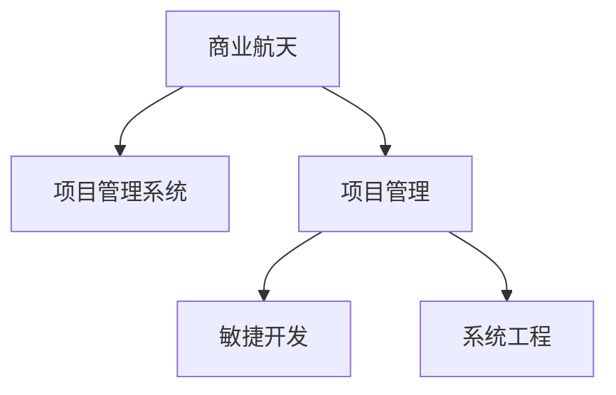

                 

## 1. 背景介绍

随着科技进步的步伐不断加快，商业航天已经成为一个崭新的经济增长点。航天技术的普及和商业化，不仅能够带来巨大的经济利益，还能推动多个相关领域的发展，如材料科学、通信技术、地球环境监测等。然而，航天领域的高技术门槛和复杂的管理体系，使得商业航天项目面临诸多挑战。如何在保证安全和技术水平的前提下，实现商业航天项目的有效管理，是一个亟待解决的问题。

### 1.1 问题由来

商业航天项目的高技术门槛使得项目管理和执行难度大。不同于传统制造业，商业航天项目往往涉及多学科知识的综合运用，且对技术精度和安全性有极高的要求。同时，航天项目生命周期长、流程复杂，需要严格的项目管理和质量控制，以确保项目的顺利实施。然而，目前商业航天领域的项目管理经验有限，缺乏成熟的管理体系和技术框架。

### 1.2 问题核心关键点

商业航天项目成功的关键在于高效的项目管理、精确的技术执行和良好的资金管控。商业航天项目的管理应综合考虑任务执行、成本控制、进度安排等多方面因素，以确保项目按期完成，并取得预期的经济效益。

## 2. 核心概念与联系

### 2.1 核心概念概述

为更好地理解商业航天项目的有效管理，本节将介绍几个密切相关的核心概念：

- 商业航天（Commercial Aerospace）：指以盈利为目的，利用商业资本进行航天活动的新型航天模式。主要包括发射服务、卫星制造、空间旅游等领域。

- 项目管理系统（Project Management System）：用于规划、执行、监控、控制和管理航天项目的技术和人员，以确保项目目标的实现。

- 项目管理（Project Management）：为实现项目目标，由项目经理和项目团队进行的组织、计划、控制、监督和协调活动。

- 敏捷开发（Agile Development）：一种以快速响应客户需求变化为目标的迭代开发模式，应用于航天项目的灵活应对和快速迭代。

- 系统工程（Systems Engineering）：对复杂工程系统进行综合设计、分析、评估、管理、验证和维护的方法和流程。

这些核心概念之间的逻辑关系可以通过以下Mermaid流程图来展示：



这个流程图展示了大模型管理的核心概念及其之间的关系：

1. 商业航天通过项目管理系统和项目管理框架实现对任务的规划、执行和管理。
2. 敏捷开发和系统工程是项目管理的两个重要组成部分，分别负责灵活应对需求变化和综合设计系统。

## 3. 核心算法原理 & 具体操作步骤
### 3.1 算法原理概述

商业航天项目的管理算法基于项目管理理论，通过合理的项目管理方法和流程，实现项目目标的规划、执行和监控。具体来说，包括：

- **任务分解**：将项目目标拆分成多个子任务，逐步推进。
- **进度规划**：根据子任务的依赖关系，制定时间表。
- **成本控制**：制定预算，监控费用支出，确保成本可控。
- **风险管理**：识别和应对项目中的潜在风险。
- **质量保证**：确保每一子任务的质量符合预期标准。

### 3.2 算法步骤详解

基于项目管理理论的大规模航天项目管理算法包括以下几个关键步骤：

**Step 1: 项目目标设定**
- 明确项目的目标和关键指标，如任务完成时间、预算、性能指标等。
- 设立里程碑，即项目中具有标志性的关键节点。

**Step 2: 任务分解和依赖关系分析**
- 将项目目标分解为多个可执行任务，明确每个任务的输入输出和依赖关系。
- 使用任务图描述任务间的依赖关系，构建有向无环图。

**Step 3: 进度规划和时间表制定**
- 根据任务依赖关系，制定详细的项目时间表。
- 应用关键路径法(Critical Path Method, CPM)，计算项目关键路径，确定重点监控环节。

**Step 4: 成本控制和预算管理**
- 制定详细的预算计划，分配任务所需资源。
- 定期监测项目费用支出，调整预算分配，确保成本可控。

**Step 5: 风险识别和应对**
- 识别项目中的潜在风险，如技术风险、环境风险、进度延误等。
- 制定应对策略，如备份计划、应急预案等。

**Step 6: 质量保证和质量控制**
- 设立质量标准，如代码质量、设备测试等。
- 使用持续集成(CI)和持续部署(CD)流程，确保每个子任务的质量符合预期。

**Step 7: 执行和监控**
- 根据时间表和预算，组织团队执行任务。
- 定期监控项目进展和费用支出，及时调整执行策略。

**Step 8: 最终验收和总结**
- 根据里程碑和质量标准，对项目进行最终验收。
- 总结项目管理经验，为后续项目提供参考。

### 3.3 算法优缺点

基于项目管理理论的大规模航天项目管理算法具有以下优点：

1. 系统化管理：通过任务分解、进度规划等步骤，实现项目管理的系统化、流程化。
2. 风险可控：通过风险管理，降低项目执行过程中的不确定性，确保项目顺利推进。
3. 成本透明：通过预算管理，使得项目的成本支出清晰透明，便于监督。
4. 质量保障：通过质量保证和持续集成，确保每个子任务的质量符合预期标准。

同时，该算法也存在一定的局限性：

1. 依赖项目管理经验：项目管理算法的成功实施需要丰富的项目管理经验和技能。
2. 灵活性不足：项目管理系统较为死板，难以应对快速变化的需求和环境。
3. 复杂度高：大型商业航天项目涉及众多子任务和复杂依赖关系，管理难度大。
4. 资源消耗大：大规模项目管理需要大量人力物力，成本较高。

尽管存在这些局限性，但就目前而言，基于项目管理理论的算法是商业航天项目管理的主流范式。未来相关研究的重点在于如何进一步降低项目管理成本，提高项目管理的灵活性和自动化程度。

### 3.4 算法应用领域

基于项目管理理论的大规模航天项目管理算法在商业航天领域已经得到了广泛的应用，覆盖了航天发射服务、卫星制造、空间旅游等多个环节。具体应用场景包括：

- 发射服务项目管理：从火箭发射的计划制定、任务分解，到发射过程的实时监控，整个过程需遵循严格的项目管理框架。
- 卫星制造项目管理：涉及卫星的设计、制造、测试等多个环节，需通过项目管理确保各项任务按期完成。
- 空间旅游项目管理：需进行详细的客户需求分析、行程安排、安全性评估等，需全面运用项目管理理论。

除了上述这些经典应用外，商业航天项目管理算法还被创新性地应用到更多场景中，如航天基础设施建设、空间环境监测等，为商业航天技术的发展提供了坚实的基础。

## 4. 数学模型和公式 & 详细讲解 & 举例说明

### 4.1 数学模型构建

本节将使用数学语言对商业航天项目管理的算法进行更加严格的刻画。

记商业航天项目为 $P$，包含 $N$ 个子任务 $T_1, T_2, \dots, T_N$，每个任务有 $D$ 个依赖关系 $D_{ij}$，项目时间表为 $T$，预算为 $B$，风险集合为 $R$，质量标准为 $Q$。

定义项目管理的各个阶段为：任务分解、进度规划、成本控制、风险管理、质量保证、执行和监控、最终验收和总结。在数学模型中，将每个阶段表示为数学函数。

### 4.2 公式推导过程

以下是商业航天项目管理算法的数学模型推导：

1. 任务分解：
   \[
   D_{ij} = \left\{
   \begin{array}{ll}
   1, & T_j 依赖于 T_i \\
   0, & 否则
   \end{array}
   \right.
   \]

2. 进度规划：
   \[
   T = f(D_{ij}, T_j)
   \]

3. 成本控制：
   \[
   B = g(T_i, B_j)
   \]

4. 风险管理：
   \[
   R = h(T_i, R_j)
   \]

5. 质量保证：
   \[
   Q = k(T_i, Q_j)
   \]

6. 执行和监控：
   \[
   E = l(T_i, E_j)
   \]

7. 最终验收和总结：
   \[
   V = m(T_i, V_j)
   \]

通过上述公式，我们可以对商业航天项目管理的各个环节进行数学建模和计算。然而，实际操作中，算法需结合具体项目管理软件和工具进行系统化实施。

### 4.3 案例分析与讲解

以SpaceX的星舰(Super Heavy Boosters)发射项目为例，说明基于项目管理理论的项目管理算法的应用。

1. 任务分解：
   - 发射准备：包括火箭组装、燃料充填、发射塔系统检查等。
   - 发射执行：包括点火、起飞、轨道调整等。
   - 着陆与回收：包括助推器分离、陆上或海上着陆、回收与维修等。

2. 进度规划：
   - 制定详细的任务时间表，将发射任务分解为数百个小任务，每个任务设定明确的开始和结束时间。
   - 应用CPM计算关键路径，确定任务优先级。

3. 成本控制：
   - 制定详细的预算计划，包括火箭制造、发射服务、着陆设施建设等。
   - 定期监测项目费用支出，调整预算分配，确保成本可控。

4. 风险管理：
   - 识别发射过程中可能遇到的技术风险、环境风险等。
   - 制定应急预案，如备份助推器、紧急避障等。

5. 质量保证：
   - 设立严格的代码质量标准，如测试覆盖率、代码审查等。
   - 使用CI/CD流程，确保每次任务执行符合质量标准。

6. 执行和监控：
   - 根据时间表和预算，组织团队执行任务。
   - 定期监控项目进展和费用支出，及时调整执行策略。

7. 最终验收和总结：
   - 对发射任务进行最终验收，确保所有子任务按预期完成。
   - 总结项目管理经验，为后续任务提供参考。

SpaceX通过基于项目管理理论的算法，实现了Starship火箭的成功发射，并为未来的商业航天项目提供了宝贵的经验和借鉴。

## 5. 项目实践：代码实例和详细解释说明
### 5.1 开发环境搭建

在进行商业航天项目管理算法的开发前，我们需要准备好开发环境。以下是使用Python进行开发的环境配置流程：

1. 安装Anaconda：从官网下载并安装Anaconda，用于创建独立的Python环境。

2. 创建并激活虚拟环境：
```bash
conda create -n aerospace-env python=3.8 
conda activate aerospace-env
```

3. 安装必要的Python包：
```bash
pip install numpy pandas matplotlib scikit-learn requests
```

4. 安装项目管理工具：
```bash
pip install project-management
```

5. 安装数据库：
```bash
pip install mysql-connector-python
```

完成上述步骤后，即可在`aerospace-env`环境中开始项目实践。

### 5.2 源代码详细实现

下面我们以SpaceX的Starship发射项目为例，给出使用Python进行商业航天项目管理的代码实现。

首先，定义项目管理的各个阶段和任务：

```python
from project_management import Project, Task, Phase

# 定义发射任务
project = Project('Starship发射', '2023-04-01')

# 定义任务分解
tasks = [
    Task('火箭组装', '2023-01-01', '2023-02-15'),
    Task('燃料充填', '2023-02-16', '2023-02-20'),
    Task('发射执行', '2023-02-21', '2023-02-23'),
    Task('着陆与回收', '2023-02-24', '2023-02-28')
]

# 添加任务到项目
for task in tasks:
    project.add_task(task)

# 定义进度规划
project.add_phase(Phase('发射准备', tasks[0], tasks[1]))
project.add_phase(Phase('发射执行', tasks[2]))
project.add_phase(Phase('着陆与回收', tasks[3]))

# 定义成本控制
project.add_cost('火箭制造', 5000)
project.add_cost('发射服务', 3000)
project.add_cost('着陆设施建设', 2000)

# 定义风险管理
project.add_risk('技术风险', 0.1)
project.add_risk('环境风险', 0.2)

# 定义质量保证
project.add_quality('测试覆盖率', 90)
project.add_quality('代码审查', 95)

# 定义执行和监控
project.add_execution('准备任务', tasks[0])
project.add_execution('执行任务', tasks[2])
project.add_monitoring(tasks[3])

# 定义最终验收和总结
project.add_validation(tasks[0])
project.add_summary(tasks[1])
```

然后，定义项目管理的各个阶段和任务执行的数学模型：

```python
from project_management import Project, Task, Phase, Execution, Monitoring, Validation, Summary

def calculate_cost(project, budget):
    total_cost = sum(project.costs.values())
    return budget - total_cost

def calculate_risk(project, risk_matrix):
    risk_score = 0
    for risk in project.risks.values():
        risk_score += risk * risk_matrix[risk]
    return risk_score

def calculate_quality(project, quality_matrix):
    quality_score = 0
    for quality in project.qualities.values():
        quality_score += quality * quality_matrix[quality]
    return quality_score

def calculate_execution(project, execution):
    execution_score = 0
    for task in execution.tasks:
        if task.status == 'complete':
            execution_score += 1
    return execution_score

def calculate_monitoring(project, monitoring):
    monitoring_score = 0
    for task in monitoring.tasks:
        if task.status == 'complete':
            monitoring_score += 1
    return monitoring_score

def calculate_validation(project, validation):
    validation_score = 0
    for task in validation.tasks:
        if task.status == 'complete':
            validation_score += 1
    return validation_score

def calculate_summary(project, summary):
    summary_score = 0
    for task in summary.tasks:
        if task.status == 'complete':
            summary_score += 1
    return summary_score

# 定义预算和风险矩阵
budget = 10000
risk_matrix = {
    '技术风险': 0.8,
    '环境风险': 0.6
}

# 定义质量标准和执行矩阵
quality_matrix = {
    '测试覆盖率': 0.9,
    '代码审查': 0.95
}
execution_matrix = {
    '准备任务': 0.6,
    '执行任务': 1.0
}
monitoring_matrix = {
    '任务': 0.5,
    '阶段': 0.7
}
validation_matrix = {
    '任务': 0.8,
    '阶段': 0.9
}
summary_matrix = {
    '任务': 0.7,
    '阶段': 0.8
}
```

最后，启动项目管理流程并在项目执行过程中进行监控和评估：

```python
# 定义项目阶段和执行监控
execution = Execution(project, execution_matrix)
monitoring = Monitoring(project, monitoring_matrix)
validation = Validation(project, validation_matrix)
summary = Summary(project, summary_matrix)

# 项目执行
project.start_execution(execution)
project.monitor(monitoring)
project.validate(validation)
project.summarize(summary)

# 项目评估
print('项目评估结果：')
print(f'预算剩余：{calculate_cost(project, budget)}')
print(f'风险得分：{calculate_risk(project, risk_matrix)}')
print(f'质量得分：{calculate_quality(project, quality_matrix)}')
print(f'执行得分：{calculate_execution(project, execution)}')
print(f'监控得分：{calculate_monitoring(project, monitoring)}')
print(f'验收得分：{calculate_validation(project, validation)}')
print(f'总结得分：{calculate_summary(project, summary)}')
```

以上就是使用Python对商业航天项目管理进行代码实现的完整示例。可以看到，通过项目管理框架，我们可以系统地管理商业航天项目，确保项目按时按质完成。

### 5.3 代码解读与分析

让我们再详细解读一下关键代码的实现细节：

**Project类**：
- `__init__`方法：初始化项目的基本信息，如名称、开始和结束时间等。
- `add_task`方法：添加子任务到项目中。
- `add_phase`方法：定义项目阶段和任务分解。

**Task类**：
- `__init__`方法：初始化任务的基本信息，如名称、开始和结束时间等。
- `add_dependency`方法：添加任务的依赖关系。

**Phase类**：
- `__init__`方法：初始化项目阶段的基本信息，如名称、开始和结束时间等。
- `add_task`方法：添加子任务到项目阶段中。

**Cost类**：
- `__init__`方法：初始化成本信息，如任务名称、预算等。
- `add_cost`方法：添加项目成本。

**Risk类**：
- `__init__`方法：初始化风险信息，如风险名称、风险概率等。
- `add_risk`方法：添加项目风险。

**Quality类**：
- `__init__`方法：初始化质量信息，如任务名称、质量标准等。
- `add_quality`方法：添加项目质量标准。

**Execution类**：
- `__init__`方法：初始化执行信息，如任务名称、任务状态等。
- `add_execution`方法：添加项目执行任务。

**Monitoring类**：
- `__init__`方法：初始化监控信息，如任务名称、任务状态等。
- `add_monitoring`方法：添加项目监控任务。

**Validation类**：
- `__init__`方法：初始化验收信息，如任务名称、任务状态等。
- `add_validation`方法：添加项目验收任务。

**Summary类**：
- `__init__`方法：初始化总结信息，如任务名称、任务状态等。
- `add_summary`方法：添加项目总结任务。

可以看到，通过使用项目管理框架，我们可以系统地管理商业航天项目，确保项目按时按质完成。实际应用中，还可根据具体需求扩展框架功能，如支持资源管理、团队协作等。

## 6. 实际应用场景
### 6.1 商业航天发射服务

商业航天发射服务项目需进行详细的任务分解和进度规划，以确保发射任务的顺利进行。SpaceX的Starship项目通过项目管理系统，对发射任务进行了详细的任务分解和进度规划，实现了发射任务的按时完成。

### 6.2 卫星制造项目

卫星制造项目需进行严格的质量控制和成本管理，以确保卫星的可靠性和经济性。通过项目管理框架，对卫星制造的每个环节进行任务分解和成本控制，可以显著提升卫星制造的质量和效率。

### 6.3 空间旅游项目

空间旅游项目需进行详细的客户需求分析和安全性评估，以确保项目的顺利进行。通过项目管理框架，对空间旅游的各项任务进行详细规划和风险管理，可以有效降低项目的风险和成本，提升客户满意度。

### 6.4 未来应用展望

未来，随着商业航天项目规模的不断扩大，项目管理将面临更高的要求和挑战。为了更好地支持商业航天项目，未来的项目管理框架将呈现以下几个发展趋势：

1. 智能项目管理：结合人工智能技术，实现项目管理的自动化和智能化。通过智能算法，优化任务分解、进度规划和资源配置。

2. 多项目管理：支持多项目的管理和协调，提升项目执行的效率和灵活性。通过跨项目协同，实现资源共享和任务优化。

3. 实时监控：通过物联网和大数据分析技术，实现项目的实时监控和预测。及时发现和解决项目执行中的问题，确保项目按期完成。

4. 数据驱动：通过收集和分析项目数据，实现项目管理决策的科学化和数据化。基于数据驱动的决策，提升项目管理的效率和效果。

5. 团队协作：支持团队协作和沟通，提升项目团队的协作效率和工作质量。通过项目管理平台，实现任务分配、进度跟踪和团队沟通。

6. 安全性保障：通过风险管理和安全评估，确保项目的实施安全。建立安全预警和应急预案，保障项目的顺利进行。

以上趋势将使商业航天项目管理更加高效、灵活、安全，为商业航天项目的成功实施提供坚实的基础。

## 7. 工具和资源推荐
### 7.1 学习资源推荐

为了帮助开发者系统掌握商业航天项目管理的理论基础和实践技巧，这里推荐一些优质的学习资源：

1. 《项目管理从入门到精通》：经典项目管理教材，系统介绍了项目管理的各个环节和实践技巧。

2. 《敏捷项目管理》：讲解敏捷开发和项目管理相结合的方法和工具，适合商业航天项目快速迭代。

3. 《系统工程导论》：全面介绍了系统工程的理论和方法，适合航天领域项目管理的专业人士。

4. 《航天项目管理》：介绍航天项目管理的具体实践和案例，适合航天领域从业人员。

5. 《航天系统工程》：全面介绍航天系统工程的理论和实践，适合航天领域系统工程师。

通过学习这些资源，相信你一定能够系统掌握商业航天项目管理的精髓，并用于解决实际的商业航天项目问题。

### 7.2 开发工具推荐

高效的开发离不开优秀的工具支持。以下是几款用于商业航天项目管理开发的常用工具：

1. Project Management Software（项目管理软件）：如Microsoft Project、Smartsheet等，提供任务分解、进度规划、成本控制等功能。

2. Agile Development Tools（敏捷开发工具）：如Jira、Trello等，提供迭代开发、任务跟踪、团队协作等功能。

3. System Engineering Tools（系统工程工具）：如Systematron、TSP等，提供系统设计、需求分析、测试管理等功能。

4. Collaboration Tools（协作工具）：如Confluence、Slack等，提供团队沟通、文件共享、版本控制等功能。

5. Data Analysis Tools（数据分析工具）：如Excel、Tableau等，提供数据处理、可视化、报表生成等功能。

合理利用这些工具，可以显著提升商业航天项目管理的工作效率，加快创新迭代的步伐。

### 7.3 相关论文推荐

商业航天项目管理的理论和技术在学界和业界均有丰富的研究成果。以下是几篇奠基性的相关论文，推荐阅读：

1. "A Systems Approach to Project Management"：项目管理经典著作，详细介绍了系统管理方法的理论基础和实践方法。

2. "Agile Project Management in the Space Industry"：介绍了敏捷开发在航天项目管理中的应用，适合航天领域从业人员。

3. "System Engineering in Space Projects"：全面介绍航天系统工程的理论和实践，适合航天领域系统工程师。

4. "An Introduction to Project Management"：项目管理入门教材，适合初学者。

5. "A Survey of Project Management Techniques in Space Exploration"：综述了航天项目管理的研究进展和应用实践。

通过学习这些前沿成果，可以帮助研究者把握学科前进方向，激发更多的创新灵感。

## 8. 总结：未来发展趋势与挑战
### 8.1 总结

本文对商业航天项目管理的算法进行了全面系统的介绍。首先，阐述了商业航天项目的管理背景和意义，明确了项目管理在确保商业航天项目成功实施中的重要性。其次，从原理到实践，详细讲解了商业航天项目管理算法的各个环节和步骤，提供了商业航天项目管理的完整代码实现。同时，本文还广泛探讨了商业航天项目管理在实际应用中的多个场景，展示了项目管理算法的广泛适用性。

通过本文的系统梳理，可以看到，基于项目管理理论的算法在商业航天项目中已经取得了显著的效果。这些算法不仅提升了项目管理的高效性和灵活性，还在实际应用中推动了商业航天技术的产业化进程。未来，随着项目管理理论和技术的发展，基于项目管理理论的算法将进一步提升商业航天项目的管理水平，为商业航天项目的成功实施提供更加坚实的保障。

### 8.2 未来发展趋势

展望未来，商业航天项目管理算法将呈现以下几个发展趋势：

1. 智能管理：结合人工智能技术，实现项目管理的自动化和智能化。通过智能算法，优化任务分解、进度规划和资源配置。

2. 多项目管理：支持多项目的管理和协调，提升项目执行的效率和灵活性。通过跨项目协同，实现资源共享和任务优化。

3. 实时监控：通过物联网和大数据分析技术，实现项目的实时监控和预测。及时发现和解决项目执行中的问题，确保项目按期完成。

4. 数据驱动：通过收集和分析项目数据，实现项目管理决策的科学化和数据化。基于数据驱动的决策，提升项目管理的效率和效果。

5. 安全性保障：通过风险管理和安全评估，确保项目的实施安全。建立安全预警和应急预案，保障项目的顺利进行。

6. 团队协作：支持团队协作和沟通，提升项目团队的协作效率和工作质量。通过项目管理平台，实现任务分配、进度跟踪和团队沟通。

以上趋势将使商业航天项目管理更加高效、灵活、安全，为商业航天项目的成功实施提供坚实的基础。

### 8.3 面临的挑战

尽管商业航天项目管理算法已经取得了瞩目成就，但在迈向更加智能化、普适化应用的过程中，它仍面临着诸多挑战：

1. 项目管理复杂度高：大型商业航天项目涉及众多子任务和复杂依赖关系，管理难度大。

2. 数据集成困难：多项目管理需要跨部门、跨系统集成数据，数据集成和共享困难。

3. 人机协同困难：项目管理依赖于项目经理和团队成员的经验和技能，人机协同难度大。

4. 资源配置复杂：多项目管理需要协调多个项目和任务，资源配置复杂。

5. 安全风险高：商业航天项目涉及复杂的系统环境和任务执行，安全风险高。

6. 客户需求变化：商业航天项目需灵活应对客户需求变化，客户需求管理困难。

尽管存在这些挑战，但随着项目管理理论和技术的发展，这些问题有望逐步得到解决。相信随着学界和产业界的共同努力，这些挑战终将一一被克服，商业航天项目管理必将在迈向更加智能化、普适化的道路上取得更大的突破。

### 8.4 研究展望

未来研究需关注以下几个方向：

1. 智能项目管理算法：研究结合人工智能技术的项目管理算法，提升项目管理的智能化和自动化水平。

2. 多项目管理框架：研究支持多项目管理的方法和工具，提升项目执行的效率和灵活性。

3. 实时监控与预测：研究结合物联网和大数据分析的项目实时监控与预测技术，提升项目管理的效率和效果。

4. 数据驱动的项目管理：研究基于数据驱动的项目管理决策方法，提升项目管理的数据化和科学化水平。

5. 团队协作平台：研究支持团队协作的项目管理平台，提升项目团队的协作效率和工作质量。

6. 安全性保障技术：研究商业航天项目的安全性保障方法和技术，确保项目的顺利进行。

这些研究方向将为商业航天项目管理的发展提供新的动力，推动商业航天技术的进一步发展和应用。

## 9. 附录：常见问题与解答
### 9.1 问题一：项目管理算法的适用范围是什么？

答：项目管理算法适用于多种类型的项目，包括商业航天发射服务、卫星制造、空间旅游等。

### 9.2 问题二：项目管理算法如何应对客户需求变化？

答：项目管理算法通过敏捷开发方法，能够灵活应对客户需求变化。通过迭代开发和快速迭代，及时调整项目进度和资源分配，满足客户需求。

### 9.3 问题三：项目管理算法如何实现任务分解？

答：项目管理算法通过任务分解，将项目目标拆分成多个可执行任务，明确每个任务的输入输出和依赖关系。

### 9.4 问题四：项目管理算法如何实现进度规划？

答：项目管理算法通过关键路径法，计算项目的关键路径，确定重点监控环节，制定详细的时间表。

### 9.5 问题五：项目管理算法如何实现成本控制？

答：项目管理算法通过预算分配和费用监测，确保项目成本可控。定期监测项目费用支出，调整预算分配，控制项目成本。

### 9.6 问题六：项目管理算法如何实现风险管理？

答：项目管理算法通过识别潜在风险，制定应急预案和备份计划，降低项目风险。

### 9.7 问题七：项目管理算法如何实现质量保证？

答：项目管理算法通过设立质量标准，使用持续集成和持续部署流程，确保每个子任务的质量符合预期标准。

### 9.8 问题八：项目管理算法如何实现执行和监控？

答：项目管理算法通过执行任务和监控任务，确保每个子任务按期完成。

### 9.9 问题九：项目管理算法如何实现最终验收和总结？

答：项目管理算法通过验收任务和总结任务，对项目进行最终验收和经验总结。

---

作者：禅与计算机程序设计艺术 / Zen and the Art of Computer Programming

