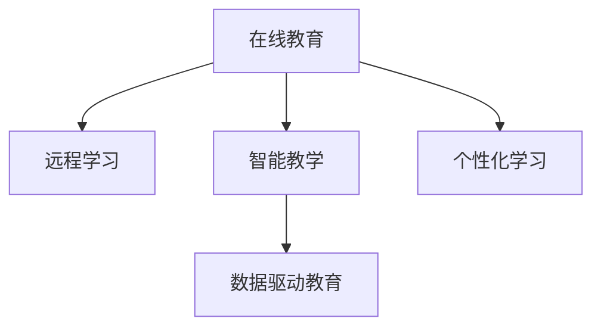

                 

# 如何利用技术能力创建在线课程

> 关键词：在线教育, 远程学习, 课程设计, 智能教学, 数据驱动, 个性化学习

## 1. 背景介绍

### 1.1 问题由来
近年来，随着互联网技术的飞速发展和教育需求的不断增长，在线教育逐渐成为教育领域的重要组成部分。在线课程作为一种新型的教育形式，以其灵活性、可扩展性和互动性，为学习者提供了更自由的学习空间和更丰富学习资源。但是，高质量的在线课程创建过程繁琐复杂，且传统方法在教学内容、学习体验、评估反馈等方面存在诸多瓶颈。

### 1.2 问题核心关键点
- 教学内容设计：如何构建有深度、有广度的课程体系？
- 互动体验优化：如何提升在线学习者的参与度和互动体验？
- 评估反馈机制：如何量化学习者的学习效果并给予及时反馈？
- 技术集成应用：如何将AI、大数据等前沿技术有效应用到在线课程中？
- 学习者个性化：如何根据学习者的特点和需求提供个性化学习路径？

### 1.3 问题研究意义
在线课程的创建不仅能够满足学习者的个性化需求，更能够推动教育资源的均衡分布，促进教育公平。通过技术手段创新教育模式，可以大幅提升教学质量和学习效率，同时降低教育成本。利用大数据和人工智能技术，将为在线教育注入新的活力，帮助学习者实现更高效、更有针对性的学习。

## 2. 核心概念与联系

### 2.1 核心概念概述

为更好地理解如何利用技术能力创建在线课程，本节将介绍几个密切相关的核心概念：

- 在线教育（Online Education）：通过网络平台进行教学和学习的教育形式，具有远程、自主、个性化等特点。
- 远程学习（Distance Learning）：通过通讯技术和网络平台进行学习的一种方式，可以跨越地理限制。
- 智能教学（Intelligent Teaching）：利用人工智能技术，自动生成教学内容、评估学生表现、个性化推荐等，提升教学质量。
- 数据驱动教育（Data-Driven Education）：通过大数据分析学习行为，优化教学策略，提升教学效果。
- 个性化学习（Personalized Learning）：根据学习者的兴趣、能力等个性化需求，提供定制化的学习路径和资源。

这些核心概念之间的逻辑关系可以通过以下Mermaid流程图来展示：



这个流程图展示在线教育的相关概念及其之间的关系：

1. 在线教育通过网络平台实现教学和学习，具有远程和自主的特点。
2. 远程学习克服地理限制，实现随时随地学习。
3. 智能教学利用AI技术自动生成和优化教学过程。
4. 数据驱动教育通过大数据分析提升教学效果。
5. 个性化学习根据学习者需求提供定制化学习路径。

## 3. 核心算法原理 & 具体操作步骤

### 3.1 算法原理概述

在线课程的创建涉及多个领域的知识，包括课程设计、教学互动、学习评估等。其核心算法原理包括以下几个方面：

- 教学内容生成：基于预设的教学大纲，利用NLP技术自动生成教学文本和多媒体资源。
- 学习互动优化：通过构建讨论区、实时问答、虚拟现实等形式，提升学习者的参与度和互动体验。
- 学习评估反馈：使用机器学习技术对学习者的作业和测试进行自动评分，分析学习效果。
- 个性化学习路径：根据学习者的历史数据和学习行为，推荐个性化的学习内容和路径。

### 3.2 算法步骤详解

#### 教学内容生成

1. **课程大纲设计**：确定课程目标、内容、结构、时间等要素，建立课程体系。
2. **文本生成**：使用预训练语言模型（如GPT-3）根据课程大纲自动生成教学文本，包括章节、讲义、习题等。
3. **多媒体资源整合**：利用OCR技术提取书籍、视频等资源中的文本信息，自动生成字幕、注解等辅助材料。
4. **资源审核与优化**：通过专家评审和学生反馈，优化教学资源的质量和适用性。

#### 学习互动优化

1. **互动平台构建**：搭建在线讨论区、论坛、实时问答系统等，促进学习者之间的交流。
2. **虚拟现实场景设计**：利用VR技术设计沉浸式学习场景，提升学习体验。
3. **游戏化学习机制**：引入游戏化元素，如积分系统、排行榜等，增强学习动力。
4. **智能推荐系统**：基于学习者的行为数据，实时推荐相关资源和内容。

#### 学习评估反馈

1. **作业与测试设计**：设计多样化的作业和测试形式，覆盖知识掌握、应用能力、创新能力等方面。
2. **自动评分系统**：利用NLP和机器学习技术自动评分，如基于NLP的作文评分、基于OCR的多选题评分等。
3. **学习效果分析**：利用大数据分析学习者的测试成绩、作业完成情况、学习轨迹等，评估学习效果。
4. **个性化反馈机制**：根据学习者的薄弱环节，提供个性化的学习建议和资源推荐。

#### 个性化学习路径

1. **学习行为数据收集**：通过日志记录学习者的学习时间、题目完成情况、互动频率等数据。
2. **学习者画像构建**：利用聚类算法、分类算法等构建学习者的兴趣、能力、风格等画像。
3. **推荐系统设计**：构建推荐模型，根据学习者画像推荐个性化的学习内容和路径。
4. **学习路径调整**：根据学习者的反馈和学习效果，动态调整个性化学习路径。

### 3.3 算法优缺点

在线课程创建过程中，这些算法具有以下优点：

- **高效性**：自动生成和优化教学内容，节省大量人力和时间成本。
- **互动性**：提升学习者的参与度和互动体验，增强学习动力。
- **个性化**：根据学习者的特点和需求提供定制化的学习路径和资源，提升学习效果。
- **数据驱动**：利用大数据分析优化教学策略，提升教学质量。

同时，这些算法也存在一些缺点：

- **内容质量控制**：自动生成的教学内容可能存在误差，需要人工审核和优化。
- **技术实现难度**：这些算法涉及多个领域的前沿技术，实现和集成难度较大。
- **学习效果评估**：自动评分和数据分析可能存在偏差，影响评估结果的准确性。
- **学习者隐私保护**：在数据收集和分析过程中，需要注意学习者的隐私保护。

### 3.4 算法应用领域

基于这些算法的在线课程创建方法，已经应用于多个教育领域，如：

- K-12教育：提供个性化学习路径和资源，提升基础教育效果。
- 高等教育：开设大规模在线课程（MOOCs），提供灵活的学习方式。
- 职业技能培训：利用游戏化学习机制，提升培训效果和参与度。
- 远程职业认证：通过互动平台和自动化评估，实现灵活的职业认证方式。
- 语言学习：提供沉浸式学习场景和个性化推荐，提升语言学习效果。

## 4. 数学模型和公式 & 详细讲解 & 举例说明

### 4.1 数学模型构建

本节将使用数学语言对在线课程的创建方法进行严格的数学建模。

记在线课程的自动生成过程为 $f$，其中输入为课程大纲 $D$，输出为教学内容 $C$。设学习者 $i$ 在课程 $j$ 上的学习效果为 $E_{ij}$，其学习行为数据为 $B_{ij}$。

定义在线课程的自动生成模型为：

$$
C = f(D)
$$

学习评估模型的目标是最小化预测误差：

$$
\min_{\theta} \sum_{i,j} (E_{ij} - \hat{E}_{ij})^2
$$

其中 $\hat{E}_{ij}$ 为模型预测的学习效果。

### 4.2 公式推导过程

以下我们将以简单的自动评分系统为例，推导其数学模型。

设学习者的作业 $A$ 和测试 $T$ 由 $n$ 个题目组成，每个题目的正确答案为 $y$，学习者的答题结果为 $a$。假设有 $k$ 种可能的答题结果 $y$。则评分模型为：

$$
S(y,a) = \begin{cases}
1, & y = a \\
0, & y \neq a
\end{cases}
$$

设学习者 $i$ 在题目 $j$ 上的答题结果为 $a_{ij}$，则其作业或测试成绩为：

$$
S_i = \frac{1}{n} \sum_{j=1}^n S(y_{ij},a_{ij})
$$

使用基于神经网络的评分模型对 $S_i$ 进行预测：

$$
\hat{S}_i = \sum_{j=1}^n \hat{S}_{ij}
$$

其中 $\hat{S}_{ij}$ 为模型对第 $j$ 题的预测评分。

### 4.3 案例分析与讲解

以NLP技术为基础的自动评分系统为例：

1. **模型选择**：选择基于BERT的语言模型，利用其预训练的通用语言知识进行自动评分。
2. **数据预处理**：对作业或测试进行分词、向量嵌入等预处理，将问题转化为模型可以处理的形式。
3. **评分预测**：将预处理后的向量输入模型，得到每个题目的预测评分。
4. **结果汇总**：将每个题目的预测评分汇总，计算最终成绩。

## 5. 项目实践：代码实例和详细解释说明

### 5.1 开发环境搭建

在进行在线课程创建实践前，我们需要准备好开发环境。以下是使用Python进行TensorFlow开发的环境配置流程：

1. 安装Anaconda：从官网下载并安装Anaconda，用于创建独立的Python环境。

2. 创建并激活虚拟环境：
```bash
conda create -n tf-env python=3.8 
conda activate tf-env
```

3. 安装TensorFlow：根据CUDA版本，从官网获取对应的安装命令。例如：
```bash
conda install tensorflow==2.7 -c conda-forge
```

4. 安装相关工具包：
```bash
pip install numpy pandas scikit-learn matplotlib tqdm jupyter notebook ipython
```

完成上述步骤后，即可在`tf-env`环境中开始在线课程创建实践。

### 5.2 源代码详细实现

下面我们以基于NLP的作业自动评分系统为例，给出使用TensorFlow进行开发的完整代码实现。

首先，定义评分模型的输入和输出：

```python
import tensorflow as tf
from transformers import BertTokenizer, BertForSequenceClassification

# 定义模型输入
class InputLayer(tf.keras.layers.Layer):
    def __init__(self, vocab_size, embedding_dim, **kwargs):
        super().__init__(**kwargs)
        self.tokenizer = BertTokenizer.from_pretrained('bert-base-cased')
        self.embedding = tf.keras.layers.Embedding(vocab_size, embedding_dim)
        self.maxlen = 512
        self.trunc_type = 'post'
        self.padding_type = 'post'
        self.python_output = False

    def call(self, inputs):
        attention_mask = self.tokenizer.inputs_ids(inputs)
        token_type_ids = self.tokenizer.token_type_ids(inputs)
        embeddings = self.embedding(inputs)
        return embeddings, attention_mask, token_type_ids

# 定义模型输出
class OutputLayer(tf.keras.layers.Layer):
    def __init__(self, vocab_size, **kwargs):
        super().__init__(**kwargs)
        self.tokenizer = BertTokenizer.from_pretrained('bert-base-cased')
        self.dense = tf.keras.layers.Dense(1)

    def call(self, inputs):
        embeddings, attention_mask, token_type_ids = inputs
        pooling_layer = tf.keras.layers.GlobalAveragePooling1D()
        pooling_output = pooling_layer(embeddings)
        output = self.dense(pooling_output)
        return output
```

然后，定义模型和评分函数：

```python
# 定义评分模型
model = tf.keras.Sequential([
    InputLayer(vocab_size=32000, embedding_dim=128),
    OutputLayer(vocab_size=2),  # 2类评分，0和1
])

# 定义评分函数
def predict_score(model, input):
    embeddings, attention_mask, token_type_ids = model(input)
    output = model.output
    score = tf.reduce_mean(output, axis=1)
    return score
```

接着，定义数据集和训练流程：

```python
# 创建数据集
train_dataset = tf.data.Dataset.from_tensor_slices((train_input, train_labels))

# 定义训练流程
model.compile(optimizer=tf.keras.optimizers.Adam(learning_rate=0.001),
              loss='binary_crossentropy',
              metrics=['accuracy'])

model.fit(train_dataset, epochs=5)
```

最后，在测试集上评估模型：

```python
# 创建测试集
test_dataset = tf.data.Dataset.from_tensor_slices((test_input, test_labels))

# 在测试集上评估模型
model.evaluate(test_dataset)
```

以上就是使用TensorFlow进行基于NLP的作业自动评分系统的完整代码实现。可以看到，TensorFlow提供了丰富的工具和组件，使得模型构建和训练过程变得简洁高效。

### 5.3 代码解读与分析

让我们再详细解读一下关键代码的实现细节：

**InputLayer类**：
- `__init__`方法：初始化分词器、嵌入层等关键组件。
- `call`方法：将输入数据转换为模型可以处理的格式，包括分词、向量嵌入、掩码处理等。

**OutputLayer类**：
- `__init__`方法：初始化全连接层等关键组件。
- `call`方法：将池化后的向量输入全连接层，输出评分结果。

**评分模型**：
- 由InputLayer和OutputLayer组成，定义了从输入到输出的完整流程。
- 输入层负责分词、嵌入和处理掩码，输出层进行池化并输出评分。

**评分函数**：
- `predict_score`方法：将输入数据传入评分模型，计算预测评分。

**数据集创建**：
- `train_dataset`和`test_dataset`：分别定义训练集和测试集，使用`from_tensor_slices`方法从列表数据中创建数据集。

**模型训练**：
- `model.compile`：定义优化器、损失函数和评估指标。
- `model.fit`：在训练集上训练模型，循环多次。

**模型评估**：
- `model.evaluate`：在测试集上评估模型，输出预测结果和评估指标。

## 6. 实际应用场景

### 6.1 智能课堂

在线课程的创建在智能课堂中有着广泛的应用。智能课堂利用AI和大数据分析，帮助教师实时监控和反馈学生的学习状态，提升教学效果。

具体而言，可以引入智能教学平台，将自动生成的教学内容、互动问答系统等集成到课堂中。教师可以利用这些工具，实时评估学生的学习效果，提供个性化的学习建议，帮助学生克服学习困难，提升学习成效。

### 6.2 远程教育

在线课程在远程教育中也发挥着重要作用。特别是对于偏远地区的学生，远程学习可以提供更多优质教育资源，弥补地域差距。

通过在线课程平台，教师可以轻松开展远程教学，与学生实时互动，布置和批改作业。学生可以利用在线资源自主学习，获取丰富的学习资料和指导。远程教育使得优质教育资源更加普及，推动了教育公平。

### 6.3 职业培训

在线课程在职业技能培训中也具备重要意义。职业技能培训需要灵活的教学模式和高效的学习资源，在线课程能够满足这些需求。

在职业培训中，可以利用在线课程提供的多种教学形式，如视频讲解、在线实验、互动问答等，提升培训效果和参与度。学习者可以随时随地进行学习，获取最新的职业知识和技能，适应行业变化。

### 6.4 语言学习

在线课程在语言学习中也具有巨大潜力。通过在线课程，学习者可以随时随地学习新语言，获取丰富的语言资源和互动体验。

在线课程平台可以提供个性化推荐系统，根据学习者的水平和学习兴趣，推荐适合的学习内容和路径。同时，利用虚拟现实技术，学习者可以进行沉浸式语言学习，提升语言掌握效果。

## 7. 工具和资源推荐

### 7.1 学习资源推荐

为了帮助开发者系统掌握在线课程的创建理论基础和实践技巧，这里推荐一些优质的学习资源：

1. 《在线教育设计与开发》系列博文：由在线教育专家撰写，涵盖课程设计、教学技术、学习评估等前沿话题。

2. 《大规模在线课程MOOCs》课程：由Coursera和edX等在线平台提供的MOOCs课程，覆盖多种学科和领域。

3. 《智能教学系统》书籍：全面介绍了智能教学系统的原理和应用，包括机器学习、自然语言处理、数据挖掘等技术。

4. 《在线学习行为分析》书籍：探讨了在线学习者的行为特征和心理需求，提供了多种数据分析方法。

5. 《在线教育平台设计与实现》书籍：详细介绍了在线教育平台的技术架构和开发流程，提供了大量的实践案例。

通过对这些资源的学习实践，相信你一定能够快速掌握在线课程创建的精髓，并用于解决实际的NLP问题。

### 7.2 开发工具推荐

高效的开发离不开优秀的工具支持。以下是几款用于在线课程创建的常用工具：

1. TensorFlow：基于Python的开源深度学习框架，灵活动态的计算图，适合快速迭代研究。 TensorFlow提供了丰富的工具和组件，使得模型构建和训练过程变得简洁高效。

2. PyTorch：基于Python的开源深度学习框架，灵活的计算图，适合快速原型设计和研究。 PyTorch在学术界和工业界广泛应用，提供了丰富的深度学习组件。

3. Transformers库：HuggingFace开发的NLP工具库，集成了多种预训练语言模型，支持多种任务开发，是创建在线课程的重要工具。

4. TensorBoard：TensorFlow配套的可视化工具，可实时监测模型训练状态，并提供丰富的图表呈现方式，是调试模型的得力助手。

5. Weights & Biases：模型训练的实验跟踪工具，可以记录和可视化模型训练过程中的各项指标，方便对比和调优。

6. Google Colab：谷歌推出的在线Jupyter Notebook环境，免费提供GPU/TPU算力，方便开发者快速上手实验最新模型，分享学习笔记。

合理利用这些工具，可以显著提升在线课程创建的开发效率，加快创新迭代的步伐。

### 7.3 相关论文推荐

在线课程的创建涉及多个领域的知识，研究者可以参考以下几篇奠基性的相关论文：

1. "A Framework for Data-Driven Personalized Learning"：探讨了大数据在个性化学习中的应用，提出了一套数据驱动的个性化学习框架。

2. "An Overview of Recent Research on Intelligent Tutoring Systems"：介绍了智能教学系统的最新研究进展，涵盖了多种教学技术和模型。

3. "A Survey on Massive Open Online Courses"：全面综述了MOOCs的发展现状和未来趋势，探讨了MOOCs在教育中的应用和挑战。

4. "A Framework for Research on Online Learning"：提出了在线学习的研究框架，涵盖学习者特征、教学策略和评估指标等多个方面。

5. "Educational Data Mining for Personalized Learning"：探讨了教育数据挖掘在个性化学习中的应用，提出了一套基于数据挖掘的个性化学习方案。

这些论文代表了大语言模型微调技术的发展脉络。通过学习这些前沿成果，可以帮助研究者把握学科前进方向，激发更多的创新灵感。

## 8. 总结：未来发展趋势与挑战

### 8.1 总结

本文对在线课程的创建方法进行了全面系统的介绍。首先阐述了在线教育的发展背景和意义，明确了在线课程创建的重要性和核心挑战。其次，从理论到实践，详细讲解了在线课程创建的关键技术，给出了完整的代码实例。同时，本文还广泛探讨了在线课程在多个行业领域的应用前景，展示了其广阔的发展潜力。

通过本文的系统梳理，可以看到，利用技术能力创建在线课程，不仅能够提升教学质量和效率，还能满足学习者的个性化需求，推动教育公平。基于AI和大数据的在线课程，正逐步成为未来教育的重要组成部分，为实现教育资源的均衡分布和公平性提供了新的可能性。

### 8.2 未来发展趋势

展望未来，在线课程的创建将呈现以下几个发展趋势：

1. 技术融合创新：在线课程将与AR、VR、MR等新兴技术融合，提升学习体验和效果。
2. 个性化学习深化：利用大数据和机器学习技术，进一步挖掘学习者的个性化需求，提供更加定制化的学习路径和资源。
3. 多模态学习模式：引入语音、图像、视频等多模态学习形式，提升学习效果和参与度。
4. 协作学习增强：通过在线协作平台，促进学生之间的互动和合作，培养团队协作能力。
5. 实时反馈优化：利用实时数据分析和反馈机制，动态调整教学策略，提升学习效果。
6. 智能评估完善：引入AI技术自动评估学习效果，提供更加客观、公正的评估结果。

这些趋势将进一步提升在线课程的效率和质量，推动教育技术的不断进步。

### 8.3 面临的挑战

尽管在线课程的创建技术不断进步，但在迈向更加智能化、普适化应用的过程中，它仍面临着诸多挑战：

1. 数据安全和隐私：在线课程需要处理大量学习者数据，需要采取严格的数据安全措施，保障数据隐私。
2. 技术兼容性和稳定性：不同平台和技术之间的兼容性和稳定性问题，需要不断优化和改进。
3. 学习效果评估：如何科学合理地评估在线学习效果，需要进一步研究。
4. 学习动机和参与度：如何激发学习者的学习动机和提高参与度，需要更多创新和探索。
5. 教学资源多样化：需要丰富多样化的教学资源，满足不同学习者的需求。

### 8.4 研究展望

面对在线课程创建所面临的这些挑战，未来的研究需要在以下几个方面寻求新的突破：

1. 探索新的教学模式和互动形式：结合新兴技术，如AR、VR、MR等，探索更多有趣、有效的教学模式和互动形式。
2. 深化个性化学习研究：利用大数据和机器学习技术，进一步挖掘学习者的个性化需求，提供更加定制化的学习路径和资源。
3. 引入多模态学习形式：将语音、图像、视频等多模态学习形式引入在线课程，提升学习效果和参与度。
4. 增强协作学习功能：利用在线协作平台，促进学生之间的互动和合作，培养团队协作能力。
5. 优化实时反馈机制：利用实时数据分析和反馈机制，动态调整教学策略，提升学习效果。
6. 提升智能评估能力：引入AI技术自动评估学习效果，提供更加客观、公正的评估结果。

这些研究方向将推动在线课程的不断创新和进步，为教育技术带来新的突破和发展。

## 9. 附录：常见问题与解答

**Q1：在线课程创建过程中，如何选择和设计教学内容？**

A: 选择和设计教学内容是创建在线课程的关键步骤。建议从以下几个方面进行：
1. 确定课程目标和范围：明确课程要达到的教学目标和教学内容范围。
2. 设计课程大纲：列出每个章节的主要内容和教学方法。
3. 选择优质教学资源：选取高质量的教学视频、讲义、习题等资源。
4. 引入互动元素：设计互动问答、虚拟实验等环节，提升学习体验。
5. 定期更新内容：根据课程反馈和学习者的需求，定期更新和改进教学内容。

**Q2：如何设计在线课程的互动环节？**

A: 设计互动环节是提升学习者参与度和学习效果的重要手段。建议从以下几个方面进行：
1. 创建在线讨论区：搭建论坛、聊天室等，促进学生之间的交流和讨论。
2. 引入实时问答系统：建立即时问答平台，解答学生问题。
3. 设计虚拟现实场景：利用VR技术设计沉浸式学习场景，提升学习体验。
4. 引入游戏化元素：设计积分系统、排行榜等，增强学习动力。
5. 实时反馈机制：利用在线平台，提供及时的作业反馈和评估结果。

**Q3：如何评估在线课程的学习效果？**

A: 评估在线课程的学习效果是衡量教学质量的重要手段。建议从以下几个方面进行：
1. 设计多样化的评估方式：包括作业、测试、项目等多种评估形式。
2. 引入AI评分系统：利用自动评分系统，提高评估效率和客观性。
3. 分析学习行为数据：利用大数据分析学习者的行为数据，评估学习效果。
4. 提供个性化反馈：根据学习者的薄弱环节，提供个性化的学习建议和资源推荐。
5. 定期评估和改进：根据评估结果，不断改进教学策略和课程内容。

**Q4：在线课程的创建过程中，需要注意哪些问题？**

A: 在线课程的创建需要考虑多个方面的问题，建议从以下几个方面进行：
1. 数据安全和隐私：确保学习者数据的隐私和安全，防止数据泄露和滥用。
2. 技术兼容性和稳定性：不同平台和技术之间的兼容性和稳定性问题，需要不断优化和改进。
3. 学习动机和参与度：如何激发学习者的学习动机和提高参与度，需要更多创新和探索。
4. 教学资源多样化：需要丰富多样化的教学资源，满足不同学习者的需求。
5. 教学策略和互动形式：需要不断改进和创新教学策略和互动形式，提升教学效果和参与度。
6. 学习效果的评估和反馈：如何科学合理地评估在线学习效果，需要进一步研究。

**Q5：在线课程在实际应用中，需要注意哪些问题？**

A: 在线课程在实际应用中，还需要考虑以下问题：
1. 用户界面友好：设计简洁、易用的用户界面，提升用户体验。
2. 教学资源适配：确保教学资源适配不同设备和学习环境。
3. 技术支持和服务保障：提供及时的技术支持和保障，确保平台稳定运行。
4. 个性化学习路径：根据学习者的特点和需求，提供个性化的学习路径和资源。
5. 教学内容更新和维护：定期更新和维护教学内容，保持课程的新鲜和有效性。

---

作者：禅与计算机程序设计艺术 / Zen and the Art of Computer Programming

