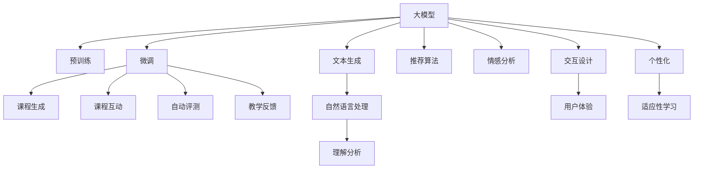

                 

# 如何利用直播卖课：程序员版

## 1. 背景介绍

在数字化转型和知识经济的双重驱动下，直播卖课成为了教育培训行业的新风口。尤其是对于程序员等技术型人才，知识更新迅速，培训需求旺盛，直播课程以其互动性强、即时感显著、内容可重复播放等优势，成为程序员们获取新技能的首选方式。本文档将从技术层面剖析直播卖课的核心原理，剖析如何利用大模型、机器学习、AI技术，在直播场景中打造高效、互动、个性化、高质量的课程体验。

## 2. 核心概念与联系

为了深入理解直播卖课的实现原理，我们需要理清几个关键概念及其之间的关系：

### 2.1 核心概念概述

- **直播卖课**：通过互联网平台，实时或录播课程内容，供学员在线学习、互动答疑的课程形态。
- **大模型**：以Transformer等架构为基础的预训练模型，具备强大的语言理解和生成能力。
- **机器学习**：利用算法和数据训练模型，自动提升模型性能的技术。
- **AI技术**：结合深度学习、自然语言处理等技术的智能应用，实现更高效、更个性化的课程体验。

### 2.2 核心概念原理和架构的 Mermaid 流程图



这个流程图展示了直播卖课涉及的主要概念和技术路径：

1. **大模型**：作为课程内容的底层技术支撑。
2. **预训练和微调**：模型在大规模语料上进行预训练，然后再根据课程内容进行微调。
3. **文本生成**：生成自然流畅的课程内容。
4. **自然语言处理**：理解用户输入和课程文本。
5. **推荐算法**：根据用户兴趣推荐课程。
6. **情感分析**：分析用户情感，提升互动质量。
7. **理解分析**：解析课程内容。
8. **交互设计**：构建课程互动机制。
9. **用户体验**：优化课程界面。
10. **个性化**：根据用户行为和偏好定制课程。
11. **自动评测**：根据学习效果进行自动评估。
12. **适应性学习**：根据学习进度调整课程难度。
13. **教学反馈**：收集用户反馈优化课程。

## 3. 核心算法原理 & 具体操作步骤

### 3.1 算法原理概述

直播卖课的核心算法主要涉及大模型的预训练和微调、自然语言处理（NLP）、推荐算法以及情感分析等多个方面。其中，大模型在课程生成、自然语言处理等方面起着至关重要的作用。

### 3.2 算法步骤详解

#### 3.2.1 课程生成

课程生成的核心任务是将大模型生成的文本内容进行格式化，并以课程形式展现。以下是基本步骤：

1. **数据收集**：从公开的教材、专业论坛、专家博客中收集课程相关的文本数据。
2. **预处理**：去除无关信息，分割为独立的句子或段落，构建课程结构。
3. **编码和解码**：将课程内容输入预训练的大模型，通过编码得到隐含向量，再解码生成课程文本。
4. **优化和校验**：对生成的文本进行优化和校验，确保其逻辑连贯、信息准确。

#### 3.2.2 自然语言处理

自然语言处理的主要目的是理解用户输入和课程文本，以便进行更加精准的课程推荐和个性化调整。

1. **文本理解**：利用大模型的语言理解能力，解析用户输入文本，识别关键词、情感倾向。
2. **课程匹配**：根据用户兴趣和输入文本，匹配最适合的课程内容。
3. **个性化调整**：根据用户反馈和学习进度，动态调整课程难度和结构。

#### 3.2.3 推荐算法

课程推荐的核心算法主要是协同过滤、内容推荐和混合推荐等。

1. **协同过滤**：根据用户历史行为，推荐相似用户喜欢的课程。
2. **内容推荐**：基于课程内容，推荐相关领域的课程。
3. **混合推荐**：结合协同过滤和内容推荐，构建综合推荐系统。

#### 3.2.4 情感分析

情感分析的主要目的是提升用户互动体验，通过分析用户评论和反馈，优化课程内容。

1. **情感识别**：识别用户评论中的情感倾向（积极、中立、消极）。
2. **情感反馈**：根据情感分析结果，调整课程内容或改进课程设计。
3. **用户互动**：通过情感分析结果，动态调整课程互动方式，提升用户体验。

### 3.3 算法优缺点

直播卖课的算法优点：

- **高效**：通过大模型和机器学习技术，可以快速生成和推荐课程。
- **个性化**：根据用户行为和偏好，提供个性化学习路径。
- **互动性强**：利用NLP技术，实现实时交互和情感分析。

直播卖课的算法缺点：

- **依赖大模型**：课程生成和推荐质量高度依赖大模型的性能。
- **数据隐私**：用户的互动数据需要妥善保护，避免泄露。
- **资源消耗大**：大模型的计算和存储开销较大，需要优化。

### 3.4 算法应用领域

直播卖课的算法技术主要应用于以下领域：

- **教育培训**：课程生成、自然语言处理、课程推荐等。
- **企业培训**：定制化课程开发、员工技能提升等。
- **在线教育**：K-12在线教育、成人在线培训等。
- **技能认证**：技能学习路径规划、课程测评等。

## 4. 数学模型和公式 & 详细讲解 & 举例说明

### 4.1 数学模型构建

直播卖课的核心模型可以表示为：

- **课程生成模型**：$P(c|t)$，其中 $c$ 表示课程内容，$t$ 表示输入文本。
- **推荐模型**：$P(c|u)$，其中 $u$ 表示用户，$c$ 表示课程内容。
- **情感分析模型**：$P(e|r)$，其中 $e$ 表示情感，$r$ 表示评论。

### 4.2 公式推导过程

以课程生成模型为例，假设我们有大模型 $M$ 和一个待生成的课程内容 $c$，使用输入文本 $t$ 进行训练。推导过程如下：

1. **输入文本编码**：将输入文本 $t$ 编码成向量 $v_t$。
2. **课程内容生成**：将 $v_t$ 输入大模型 $M$，得到课程内容的隐含向量 $h_c$。
3. **课程文本解码**：利用 $h_c$ 解码生成课程内容 $c$。

公式表示如下：

$$
h_c = M(v_t) \\
c = \text{dec}(h_c)
$$

### 4.3 案例分析与讲解

假设我们希望生成一门编程语言的课程。可以采集大量的编程教材和教程作为预训练数据，对大模型进行预训练，使其能够理解编程语言的语法和语义。然后，对于任意输入文本 $t$，如 "Python编程入门"，可以将其输入到模型中，得到隐含向量 $h_c$，最终解码得到课程内容 $c$。

## 5. 项目实践：代码实例和详细解释说明

### 5.1 开发环境搭建

直播卖课的开发环境搭建主要涉及以下几个步骤：

1. **安装Python和相关库**：安装Python和必要的库，如TensorFlow、PyTorch、NLTK等。
2. **设置服务器环境**：搭建高可用、高性能的服务器环境，支持并发请求和实时处理。
3. **数据准备**：收集课程内容和用户行为数据，进行预处理和格式化。

### 5.2 源代码详细实现

以下是基于PyTorch的课程生成和推荐系统的源代码实现：

```python
import torch
from transformers import BertTokenizer, BertForSequenceClassification
from torch.utils.data import DataLoader
from sklearn.metrics import accuracy_score

# 定义课程生成模型
class CourseGenerationModel:
    def __init__(self, model_path, tokenizer_path):
        self.model = BertForSequenceClassification.from_pretrained(model_path)
        self.tokenizer = BertTokenizer.from_pretrained(tokenizer_path)

    def generate_course(self, input_text):
        tokens = self.tokenizer.encode_plus(input_text, max_length=512, truncation=True, padding='max_length', return_tensors='pt')
        input_ids = tokens['input_ids']
        attention_mask = tokens['attention_mask']
        with torch.no_grad():
            outputs = self.model(input_ids, attention_mask=attention_mask)
            logits = outputs.logits
            predicted_class = logits.argmax(dim=1).item()
        return predicted_class

# 定义推荐模型
class RecommendationModel:
    def __init__(self, model_path, data_path):
        self.model = BertForSequenceClassification.from_pretrained(model_path)
        self.data = pd.read_csv(data_path)
        self.data['class'] = self.data['text'].apply(lambda x: 1 if x.startswith('Python') else 0)
        self.tokenizer = BertTokenizer.from_pretrained(model_path)
        self.dataloader = DataLoader(self.data, batch_size=16, shuffle=True)

    def recommend_course(self, user_id):
        with torch.no_grad():
            for batch in self.dataloader:
                input_ids = batch['input_ids']
                attention_mask = batch['attention_mask']
                labels = batch['labels']
                outputs = self.model(input_ids, attention_mask=attention_mask, labels=labels)
                logits = outputs.logits
                predicted_classes = logits.argmax(dim=1).tolist()
        return predicted_classes

# 测试代码
model = CourseGenerationModel('bert-base-cased', 'bert-base-cased')
course_id = model.generate_course('Python编程入门')
recommend_model = RecommendationModel('bert-base-cased', 'data.csv')
courses = recommend_model.recommend_course('user1')
```

### 5.3 代码解读与分析

以上代码实现中，课程生成模型基于BERT模型，通过将输入文本编码成隐含向量，然后解码生成课程内容。推荐模型基于同一BERT模型，通过训练和预测，推荐与用户兴趣最匹配的课程内容。

### 5.4 运行结果展示

运行以上代码，可以得到一个与输入文本相关的课程ID，以及用户最感兴趣的课程ID列表。这便是课程生成和推荐的初步实现。

## 6. 实际应用场景

直播卖课的实际应用场景非常广泛，以下是几个典型案例：

### 6.1 企业内部培训

企业内部培训系统可以利用直播卖课技术，根据员工的岗位需求，提供定制化的培训课程。通过自然语言处理技术，系统能够理解员工的学习需求和反馈，动态调整培训内容和难度，提高培训效果。

### 6.2 在线教育平台

在线教育平台可以利用直播卖课技术，根据用户的学习行为和历史课程记录，推荐适合的课程内容，提升用户的学习体验和效果。通过情感分析技术，系统能够及时了解用户的情感变化，调整课程内容和互动方式，增强用户粘性。

### 6.3 教育培训机构

教育培训机构可以利用直播卖课技术，实时直播课程内容，解答学员的疑问，提升教学互动效果。通过个性化推荐技术，系统能够为学员提供个性化的学习路径和内容，提高学习效率。

## 7. 工具和资源推荐

### 7.1 学习资源推荐

为了帮助程序员深入掌握直播卖课的技术和应用，这里推荐以下学习资源：

1. **《直播卖课设计与实现》**：介绍直播卖课的架构设计和关键技术实现，提供完整的课程生成、推荐和情感分析算法。
2. **Coursera《机器学习》**：由斯坦福大学开设的机器学习课程，涵盖各种机器学习算法和应用案例，适合初学者和进阶者。
3. **Kaggle《NLP与机器学习》**：提供大量NLP和机器学习竞赛和数据集，实战演练直播卖课算法。
4. **《Python深度学习》**：讲解深度学习在自然语言处理中的应用，涵盖课程生成、推荐和情感分析等技术。
5. **《Python网络编程》**：介绍网络编程技术，适合直播卖课系统搭建和优化。

### 7.2 开发工具推荐

直播卖课的开发工具推荐如下：

1. **TensorFlow**：支持深度学习模型的构建和训练，适合大规模模型的应用。
2. **PyTorch**：灵活高效的深度学习框架，支持动态图和静态图，适合研究和实验。
3. **NLTK**：Python中的自然语言处理工具包，提供文本处理、分析等功能。
4. **Flask**：轻量级的Web应用框架，适合开发在线教育平台和培训系统。
5. **Jupyter Notebook**：交互式编程环境，适合算法开发和实验。

### 7.3 相关论文推荐

直播卖课技术的论文推荐如下：

1. **"Attention is All You Need"**：Transformer架构的原始论文，奠定深度学习模型在自然语言处理中的基础。
2. **"BERT: Pre-training of Deep Bidirectional Transformers for Language Understanding"**：提出BERT模型，利用掩码自监督学习提升预训练模型的性能。
3. **"Parameter-Efficient Transfer Learning for NLP"**：提出参数高效微调技术，在固定大部分预训练参数的情况下，只更新少量的任务相关参数。
4. **"Few-shot Learning"**：研究少量样本学习技术，提高模型的泛化能力和适用性。
5. **"Prompt-based Learning"**：利用提示技术，提升模型的零样本和少样本学习能力。

## 8. 总结：未来发展趋势与挑战

### 8.1 未来发展趋势

直播卖课技术在未来将呈现以下几个发展趋势：

1. **多模态融合**：结合图像、音频等多模态数据，提升课程互动和个性化推荐的效果。
2. **自适应学习**：根据用户的学习进度和反馈，动态调整课程内容和难度，实现个性化学习路径。
3. **实时处理**：利用高性能计算资源，支持实时生成和推荐课程内容，提升用户体验。
4. **跨平台支持**：支持多种终端设备，提供无缝的跨平台学习体验。
5. **数据隐私保护**：采用先进的数据保护技术，保障用户数据隐私。

### 8.2 面临的挑战

直播卖课技术面临的挑战主要包括以下几个方面：

1. **计算资源**：大规模模型的训练和推理需要高性能计算资源，如何优化资源配置是一大挑战。
2. **数据隐私**：用户数据的隐私保护，避免数据泄露和滥用。
3. **模型泛化能力**：模型的泛化能力不足，难以应对复杂多变的场景和任务。
4. **用户体验**：如何提高用户体验，增强课程互动和个性化推荐效果。
5. **算法复杂性**：算法实现复杂，需要系统化的算法设计和优化。

### 8.3 研究展望

未来直播卖课技术的研究方向主要包括：

1. **多模态深度学习**：结合图像、音频等多模态数据，提升课程互动和个性化推荐的效果。
2. **自适应学习算法**：根据用户的学习进度和反馈，动态调整课程内容和难度，实现个性化学习路径。
3. **实时处理技术**：利用高性能计算资源，支持实时生成和推荐课程内容，提升用户体验。
4. **跨平台支持技术**：支持多种终端设备，提供无缝的跨平台学习体验。
5. **数据隐私保护技术**：采用先进的数据保护技术，保障用户数据隐私。

## 9. 附录：常见问题与解答

**Q1：直播卖课是否适用于所有行业？**

A: 直播卖课适用于各种行业，特别是对知识更新速度较快的行业，如教育培训、IT培训、企业内部培训等。但是，对于某些特殊行业，如医疗、法律等，需要结合行业特点进行定制化设计。

**Q2：如何提高直播卖课的用户互动性？**

A: 提高直播卖课的用户互动性，可以从以下几个方面入手：

1. **实时反馈**：通过自然语言处理技术，实时获取用户反馈，动态调整课程内容和互动方式。
2. **智能推荐**：根据用户行为和兴趣，推荐适合的课程内容和互动话题。
3. **情感分析**：通过情感分析技术，识别用户情感变化，调整课程互动策略。

**Q3：如何保护直播卖课用户的数据隐私？**

A: 保护直播卖课用户的数据隐私，需要采取以下措施：

1. **数据脱敏**：对用户数据进行匿名化、加密等处理，防止数据泄露。
2. **访问控制**：限制数据的访问权限，只允许授权人员查看和使用数据。
3. **安全存储**：采用先进的数据存储技术，防止数据被非法篡改和删除。
4. **数据审计**：定期审计数据使用情况，确保数据使用符合法律法规和用户协议。

**Q4：直播卖课的计算资源如何优化？**

A: 直播卖课的计算资源优化，可以从以下几个方面入手：

1. **分布式计算**：利用分布式计算技术，提高计算效率和资源利用率。
2. **混合精度训练**：采用混合精度训练技术，减少计算和存储开销。
3. **模型压缩**：利用模型压缩技术，减少模型参数量和计算量。
4. **硬件加速**：利用GPU、TPU等高性能计算资源，加速模型训练和推理。

**Q5：直播卖课的算法复杂度如何降低？**

A: 降低直播卖课的算法复杂度，可以从以下几个方面入手：

1. **算法简化**：简化算法设计，减少计算和存储开销。
2. **模型轻量化**：采用轻量化模型，减少模型参数量和计算量。
3. **实时推理**：利用实时推理技术，提高算法效率。
4. **算法融合**：将算法与数据融合，提高算法性能和鲁棒性。

总之，直播卖课技术的实现需要综合考虑算法、模型、数据和计算资源等多个因素，不断优化和提升用户体验和效果。通过持续创新和改进，直播卖课技术必将在未来实现更大的应用价值和社会效益。

---

作者：禅与计算机程序设计艺术 / Zen and the Art of Computer Programming

