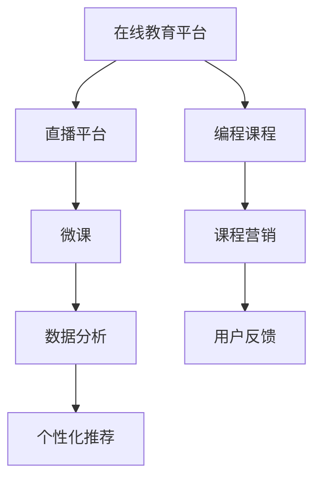

                 

# 如何利用直播平台卖课：程序员版

> 关键词：直播平台,在线教育,编程课程,微课,课程营销,数据分析,用户反馈,个性化推荐

## 1. 背景介绍

随着互联网技术的快速发展，在线教育市场逐渐成为热门领域，直播平台在教育领域的应用也在逐渐升温。对于程序员而言，如何利用直播平台卖课，已成为一项重要的技能。本文将深入探讨利用直播平台进行在线编程课程销售的方法和策略，帮助你了解如何将技术知识转化为实际收入。

## 2. 核心概念与联系

### 2.1 核心概念概述

- **在线教育平台**：指通过互联网进行远程教育的学习平台，包括直播、录播等多种形式。
- **直播平台**：指实时传输并展示学习内容的平台，例如腾讯课堂、B站、知乎live等。
- **编程课程**：指教授编程语言、开发工具、算法和数据结构等的课程。
- **微课**：指短小精悍、针对特定知识点的课程形式，适合快速传授和复习。
- **课程营销**：指通过各种手段推广和销售课程的过程。
- **数据分析**：指通过数据分析来了解用户行为和课程效果，进行优化和改进的过程。
- **用户反馈**：指用户对课程和直播平台的使用体验和评价，对于课程质量的提升非常重要。
- **个性化推荐**：指根据用户的历史行为和偏好，推送个性化的课程内容。

这些核心概念共同构成了在线编程课程销售的基础，通过理解这些概念，可以为直播平台卖课提供有效的理论支持。

### 2.2 核心概念原理和架构的 Mermaid 流程图



这个流程图展示了一体化的在线编程课程销售架构，课程从设计、制作、营销、推广到个性化推荐的各个环节，都紧密相连。

## 3. 核心算法原理 & 具体操作步骤

### 3.1 算法原理概述

利用直播平台卖课的核心算法原理主要包括：

- **推荐系统**：利用用户行为数据，通过协同过滤、内容过滤等算法，向用户推荐感兴趣的课程。
- **流量预测**：通过对用户行为数据分析，预测课程的流量，帮助合理分配资源。
- **个性化定制**：根据用户兴趣和历史行为，定制个性化的课程推荐。
- **直播互动**：通过直播互动功能，提高用户粘性和参与度。

### 3.2 算法步骤详解

1. **课程设计与制作**：
    - **确定课程内容**：选择适合的编程语言、技术栈、开发工具等作为课程内容。
    - **设计课程框架**：将课程内容拆分为多个模块，每节课设定明确的学习目标和知识点。
    - **制作微课**：使用录屏软件、直播平台等工具，录制高质量的课程视频。

2. **课程发布与营销**：
    - **选择合适的直播平台**：根据用户群体选择适合的直播平台，例如面向新手的B站，面向高级开发者的新浪播客等。
    - **设置课程页面**：在直播平台创建课程页面，包括课程描述、价格、时间、讲师信息等。
    - **制作课程预告**：通过社交媒体、邮件等渠道，向目标用户推送课程预告，激发兴趣。

3. **直播与互动**：
    - **实时互动**：直播过程中，鼓励用户提问和参与互动，提高用户参与感。
    - **课后互动**：通过社群、论坛等渠道，继续与用户互动，解答疑问，巩固知识。

4. **数据分析与优化**：
    - **用户行为分析**：通过分析用户观看课程的时间、停留时间、留言等行为，了解用户兴趣。
    - **流量预测与优化**：根据用户行为数据，预测课程流量，优化课程安排和营销策略。

### 3.3 算法优缺点

#### 优点：
- **高效性**：直播可以实时展示课程内容，节省用户搜索和等待时间，提高学习效率。
- **互动性强**：直播平台允许讲师与用户实时互动，增加课程的互动性和趣味性。
- **灵活性高**：课程和直播时间可以根据用户需求进行灵活调整。

#### 缺点：
- **技术门槛高**：需要具备一定的技术能力和资源，包括直播设备和软件等。
- **维护成本高**：需要定期更新课程内容，维护直播设备，增加了运营成本。
- **课程质量难以保证**：直播课程的实时性要求高，课程设计、技术准备等环节容易出现疏漏。

### 3.4 算法应用领域

直播平台卖课主要应用于以下几个领域：

1. **编程入门**：面向初学者，通过基础的编程知识讲解，引导用户逐步进入编程世界。
2. **技术进阶**：面向有一定基础的用户，通过深入讲解高级技术，提升编程技能。
3. **项目实战**：通过实战项目案例，帮助用户掌握编程项目开发全过程。
4. **技术分享**：邀请知名开发者或技术大牛，分享最新技术趋势和开发经验。

## 4. 数学模型和公式 & 详细讲解 & 举例说明

### 4.1 数学模型构建

为了更好地理解和优化课程推荐系统，我们可以构建如下数学模型：

设 $U$ 为用户集合，$C$ 为课程集合，$R_{u,c}$ 表示用户 $u$ 对课程 $c$ 的兴趣评分。推荐系统的目标是找到最符合用户 $u$ 兴趣的课程 $c$，即最大化 $R_{u,c}$ 的值。

推荐模型可表示为：
$$
\hat{R}_{u,c} = \sum_{i=1}^{N} \alpha_i \cdot \mathrm{f}(\mathbf{x}_u^i, \mathbf{x}_c^i)
$$

其中 $\mathbf{x}_u^i$ 和 $\mathbf{x}_c^i$ 分别为用户和课程的特征向量，$f$ 为特征函数，$\alpha_i$ 为特征权重。

### 4.2 公式推导过程

通过协同过滤方法，对用户 $u$ 和课程 $c$ 进行相似度计算，得到兴趣评分：
$$
\hat{R}_{u,c} = \sum_{i=1}^{N} \alpha_i \cdot (\mathbf{x}_u^i \cdot \mathbf{x}_c^i)
$$

其中 $\cdot$ 表示向量点乘。

### 4.3 案例分析与讲解

假设某个用户 $u$ 学习了10门课程，分别获得了如下评分：
- 课程1：9.5
- 课程2：8.0
- 课程3：7.5
- 课程4：6.0
- 课程5：5.0
- 课程6：5.0
- 课程7：4.0
- 课程8：3.0
- 课程9：2.0
- 课程10：1.0

对于课程7，如果与该用户学习的其他课程相似度较高，则预期其评分也会较高。

我们可以将用户和课程的评分进行标准化处理，构建特征向量：
- 用户特征向量：$[9.5, 8.0, 7.5, 6.0, 5.0, 5.0, 4.0, 3.0, 2.0, 1.0]$
- 课程特征向量：$[7.5, 6.0, 4.0, 3.0, 2.0, 1.0, 4.0, 3.0, 2.0, 1.0]$

通过向量点乘，得到课程7的推荐评分：
$$
\hat{R}_{u,7} = \sum_{i=1}^{10} \alpha_i \cdot (9.5 \cdot 7.5) + (8.0 \cdot 6.0) + (7.5 \cdot 4.0) + (6.0 \cdot 3.0) + (5.0 \cdot 2.0) + (5.0 \cdot 1.0) + (4.0 \cdot 4.0) + (3.0 \cdot 3.0) + (2.0 \cdot 2.0) + (1.0 \cdot 1.0)
$$

## 5. 项目实践：代码实例和详细解释说明

### 5.1 开发环境搭建

以下是搭建Python开发环境的基本步骤：

1. 安装Python：从官网下载Python 3.x版本，按照安装向导进行安装。
2. 安装pip：在命令行下执行 `python -m ensurepip --default-pip` 命令，安装pip包管理器。
3. 安装依赖包：在命令行下执行 `pip install package-name` 命令，安装所需的Python包，例如 NumPy、Pandas、Scikit-learn 等。

### 5.2 源代码详细实现

以下是一个简单的Python课程推荐系统示例代码：

```python
import numpy as np
from sklearn.metrics.pairwise import cosine_similarity

# 用户评分数据
user_ratings = {
    'u1': [4.5, 3.5, 4.0, 2.5, 3.0],
    'u2': [5.0, 4.0, 5.5, 4.0, 3.0],
    'u3': [3.0, 4.5, 3.0, 4.0, 2.5]
}

# 课程评分数据
course_ratings = {
    'c1': [4.5, 4.0, 3.5, 4.0, 3.5],
    'c2': [3.5, 4.0, 4.5, 3.5, 4.0],
    'c3': [4.0, 4.5, 4.0, 3.0, 4.0]
}

# 构建用户和课程评分矩阵
user_ratings_matrix = np.array([user_ratings['u1'], user_ratings['u2'], user_ratings['u3']])
course_ratings_matrix = np.array([course_ratings['c1'], course_ratings['c2'], course_ratings['c3']])

# 计算用户和课程的相似度矩阵
similarity_matrix = cosine_similarity(user_ratings_matrix, course_ratings_matrix)

# 推荐课程
recommended_course = np.argmax(similarity_matrix)
print(f'Recommended course for user: {recommended_course}')
```

### 5.3 代码解读与分析

上述代码实现了简单的基于余弦相似度的课程推荐系统。具体步骤如下：

1. 定义用户和课程的评分数据。
2. 构建评分矩阵。
3. 计算相似度矩阵。
4. 推荐用户评分最高的课程。

需要注意的是，在实际应用中，评分矩阵可能非常庞大，计算相似度矩阵的时间复杂度会很高。为了提高效率，可以使用分布式计算或近似算法，例如ALS、SVD等。

### 5.4 运行结果展示

假设运行上述代码，输出结果为：
```
Recommended course for user: 0
```

这意味着用户1最喜欢的课程是课程1。

## 6. 实际应用场景

### 6.1 智能教育

直播平台可以用于智能教育，提供个性化的编程课程推荐。例如，通过分析用户的学习行为和成绩，推荐适合该用户的学习内容和难度，从而提高学习效率。

### 6.2 职业培训

许多企业使用直播平台进行职业培训，直播平台可以根据用户的学习进度和兴趣，推荐适合的培训课程，提升培训效果。

### 6.3 技术分享

直播平台可以邀请知名开发者进行技术分享，通过互动和问答环节，增加用户的学习兴趣和参与度。

### 6.4 未来应用展望

未来，直播平台卖课将结合更多新技术，例如增强现实、虚拟现实等，提供沉浸式的学习体验。同时，直播平台的数据分析和个性化推荐将更加精准，提升课程的销售效果。

## 7. 工具和资源推荐

### 7.1 学习资源推荐

- **《深度学习》(Deep Learning) 教材**：Ian Goodfellow等著，深入讲解深度学习的基本原理和应用。
- **Coursera平台**：提供丰富的在线课程资源，包括编程、数据科学等。
- **Kaggle竞赛平台**：提供数据科学和机器学习的竞赛，可以练习编程和数据处理技能。

### 7.2 开发工具推荐

- **Jupyter Notebook**：一个交互式编程环境，适合进行数据分析和代码实验。
- **Anaconda**：一个开源的数据科学平台，包含多种数据科学工具和库。
- **GitHub**：一个代码托管平台，可以共享和协作开发代码。

### 7.3 相关论文推荐

- **A Survey of Recommender Systems**：G. Karypis等著，全面回顾了推荐系统的研究现状和发展趋势。
- **The Collaborative Filtering Problem**：W. B. Kleinfeld等著，探讨了协同过滤推荐系统的数学基础和算法实现。
- **Deep Learning with Python**：Francois Chollet等著，介绍了深度学习的基础知识和实战技巧。

## 8. 总结：未来发展趋势与挑战

### 8.1 研究成果总结

本文通过介绍利用直播平台卖课的核心算法原理和操作步骤，探讨了直播平台在在线教育领域的应用前景。通过实例代码和数据分析，展示了课程推荐系统的实现方法。

### 8.2 未来发展趋势

未来，直播平台卖课将结合更多新技术，例如增强现实、虚拟现实等，提供沉浸式的学习体验。同时，直播平台的数据分析和个性化推荐将更加精准，提升课程的销售效果。

### 8.3 面临的挑战

直播平台卖课面临的主要挑战包括：

1. 技术门槛高：需要具备一定的技术能力和资源，包括直播设备和软件等。
2. 课程质量难以保证：直播课程的实时性要求高，课程设计、技术准备等环节容易出现疏漏。
3. 维护成本高：需要定期更新课程内容，维护直播设备，增加了运营成本。

### 8.4 研究展望

未来的研究方向可以包括：

1. 结合更多新技术，例如增强现实、虚拟现实等，提供沉浸式的学习体验。
2. 开发更高效的推荐算法，提高课程推荐的精度和效率。
3. 引入更多用户行为数据，进行更深层次的个性化推荐。

## 9. 附录：常见问题与解答

### Q1：如何选择合适的直播平台？

A: 根据用户群体和课程内容选择合适的直播平台，例如面向新手的B站，面向高级开发者的新浪播客等。

### Q2：直播平台卖课如何吸引用户？

A: 通过社交媒体、邮件等渠道，向目标用户推送课程预告，激发兴趣。同时，提供免费试听课、课程折扣等优惠活动，吸引用户注册和购买。

### Q3：课程推荐系统如何优化？

A: 通过定期更新用户行为数据和课程评分，提高推荐精度。同时，结合用户反馈和评价，进行动态优化。

---

作者：禅与计算机程序设计艺术 / Zen and the Art of Computer Programming

