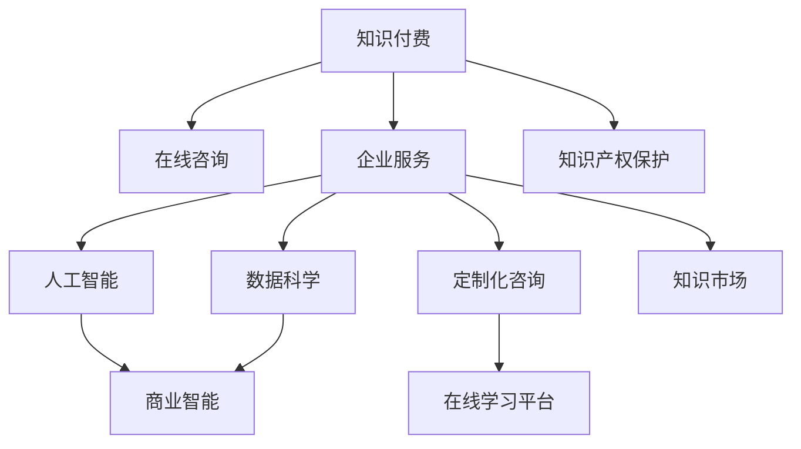

                 

# 如何利用知识付费实现企业服务与咨询？

> 关键词：知识付费, 企业服务, 在线咨询, 人工智能, 数据科学, 商业智能, 定制化咨询, 在线学习平台, 知识市场, 知识产权保护

## 1. 背景介绍

### 1.1 问题由来
随着互联网技术的发展和数字化转型的深入，企业对于知识的需求日益增长。无论是大型跨国公司，还是中小型创业企业，都在寻求专业知识来提升运营效率、降低成本、优化决策。然而，传统的线下培训、咨询服务已经难以满足企业对于知识的即时性、可定制化和高效性的需求。

### 1.2 问题核心关键点
如何利用知识付费模式，构建一个集约化、高效化的企业服务与咨询平台，同时保证知识的高质量和知识产权保护，成为了当前企业和学术界共同关注的问题。本文旨在探索基于知识付费的企业服务与咨询解决方案，力求通过技术手段提升服务效率和效果。

### 1.3 问题研究意义
实现基于知识付费的企业服务与咨询平台，不仅能够满足企业对于知识的需求，还能促进知识产出的良性循环，激发更多的高质量知识生产。这对于推动产业升级、促进知识经济的发展具有重要意义。

## 2. 核心概念与联系

### 2.1 核心概念概述

为更好地理解如何利用知识付费实现企业服务与咨询，本节将介绍几个密切相关的核心概念：

- **知识付费(Knowledge Pricing)**：基于知识价值的价格付费模式，旨在通过付费获取高价值的专业知识。
- **在线咨询(Online Consulting)**：通过网络平台，提供远程咨询、在线交流的智能化服务。
- **企业服务(Enterprise Services)**：包括但不限于IT服务、运营咨询、市场分析等，以帮助企业提升运营效率、降低成本、优化决策。
- **人工智能(AI)与数据科学(Data Science)**：利用机器学习、自然语言处理等技术，实现知识库的构建和智能化的在线咨询服务。
- **商业智能(Business Intelligence, BI)**：利用数据分析、可视化技术，帮助企业进行数据驱动的决策。
- **定制化咨询(Customized Consulting)**：根据企业的具体情况和需求，提供量身定制的咨询方案。
- **在线学习平台(Learning Management System, LMS)**：提供在线课程、培训和知识共享的平台。
- **知识市场(Knowledge Market)**：在线平台，汇聚专家、企业、学习者，促进知识交流和交易。
- **知识产权(Intellectual Property, IP)**：保护创作者对其创作的知识产品拥有所有权，防止侵权和盗用。

这些核心概念之间的逻辑关系可以通过以下Mermaid流程图来展示：



这个流程图展示了几类关键概念及其之间的关系：

1. 知识付费是企业获取专业知识的基础模式。
2. 在线咨询是企业获取专业知识的主要途径。
3. 企业服务是基于在线咨询和专业知识进行的企业运营优化。
4. 人工智能与数据科学为在线咨询和企业服务提供了技术支持。
5. 商业智能利用数据分析和可视化技术，帮助企业进行数据驱动的决策。
6. 定制化咨询根据企业具体情况提供个性化解决方案。
7. 在线学习平台为知识共享和学习提供了便利。
8. 知识市场促进了知识交流和交易。
9. 知识产权保护确保了知识创作者的权利和利益。

## 3. 核心算法原理 & 具体操作步骤
### 3.1 算法原理概述

基于知识付费的企业服务与咨询平台，其核心在于如何构建一个高效、智能、安全的服务系统。该系统需要具备以下几个关键功能：

1. **知识库构建与更新**：通过采集、标注、筛选等方式，构建高质量的知识库。
2. **知识匹配与推荐**：根据企业需求，智能推荐最适合的知识资源。
3. **在线咨询与交流**：实现专家与企业之间的实时交流，提供定制化的咨询服务。
4. **数据分析与可视化**：利用商业智能技术，提供数据驱动的决策支持。

### 3.2 算法步骤详解

基于知识付费的企业服务与咨询平台的构建，主要包括以下几个关键步骤：

**Step 1: 知识库构建与更新**
- 采集大量高质量的知识资源，如学术论文、专业报告、案例分析等。
- 对知识资源进行标注、分类、筛选，确保知识的准确性和相关性。
- 利用自然语言处理技术，自动抽取知识点的关键词、摘要等信息，方便用户检索。

**Step 2: 知识匹配与推荐**
- 根据企业需求，利用机器学习算法（如协同过滤、内容推荐、序列推荐等），智能匹配和推荐最适合的知识资源。
- 利用深度学习技术（如BERT、GPT等），提高知识推荐的准确性和个性化程度。

**Step 3: 在线咨询与交流**
- 利用在线聊天机器人技术，实现24/7的咨询服务。
- 引入专家库，提供专家一对一或专家团队的在线咨询服务。
- 支持多方协作，通过视频会议、文档共享等方式，促进专家与企业之间的深度交流。

**Step 4: 数据分析与可视化**
- 利用商业智能工具（如Tableau、Power BI等），对企业数据进行统计分析、数据挖掘和可视化展示。
- 提供定制化的仪表盘，帮助企业实时监测运营状况，做出数据驱动的决策。

**Step 5: 知识产权保护**
- 采用区块链技术，确保知识创作的版权和知识产权。
- 利用智能合约技术，保护知识创作者和消费者的合法权益。
- 通过数字水印、版权登记等方式，防止知识侵权和盗用。

### 3.3 算法优缺点

基于知识付费的企业服务与咨询平台，具有以下优点：

1. **高效性**：通过智能匹配和推荐，企业可以快速获取所需知识，提高决策效率。
2. **可定制化**：根据企业的具体情况，提供量身定制的咨询和服务，满足个性化需求。
3. **安全性**：利用区块链和智能合约技术，确保知识产权的保护和数据的隐私安全。
4. **知识流动性**：知识市场为知识生产者和消费者提供了一个高效的交易平台，促进知识的流动和共享。

同时，该平台也存在一些局限性：

1. **成本高**：高质量知识资源的获取和维护成本较高，企业需要支付一定费用。
2. **知识获取门槛**：知识获取依赖于高质量的知识资源和智能推荐算法，对技术和资源要求较高。
3. **信任问题**：专家与企业之间的信任问题需要通过严格的身份验证和评价体系来解决。

### 3.4 算法应用领域

基于知识付费的企业服务与咨询平台，已经在多个领域得到广泛应用，例如：

- **金融行业**：提供金融市场分析、风险评估、合规咨询等服务，帮助金融机构优化决策。
- **医疗健康**：提供医疗诊断、健康管理、患者教育等服务，提升医疗服务质量。
- **制造业**：提供供应链管理、设备维护、质量控制等服务，提升制造业运营效率。
- **信息技术**：提供软件开发、网络安全、系统集成等服务，推动IT行业创新发展。
- **教育培训**：提供在线课程、远程培训、学习辅导等服务，提升教育培训效果。

除了上述这些经典领域外，基于知识付费的企业服务与咨询平台，还在政府治理、农业、艺术等多个领域逐步推广应用，为企业提供全方位的知识服务和咨询服务。

## 4. 数学模型和公式 & 详细讲解  
### 4.1 数学模型构建

本节将使用数学语言对基于知识付费的企业服务与咨询平台进行更加严格的刻画。

记知识库中的知识资源为 $\mathcal{K}$，其中每个知识资源 $k$ 有一个质量评分 $q_k \in [0,1]$。企业的需求为 $\mathcal{D}$，每个需求 $d$ 有一个紧急程度 $u_d \in [0,1]$ 和一个领域 $f_d$。

定义企业与知识资源的匹配度 $m(d,k)$，衡量知识资源 $k$ 满足企业需求 $d$ 的程度。匹配度 $m(d,k)$ 可以通过知识资源的关键词与企业需求的标签进行匹配计算，例如：

$$
m(d,k) = \frac{\sum_{i} \text{sim}(d_i, k_i)}{\sum_{i} \text{sim}(d_i, K_i)}
$$

其中 $\text{sim}$ 为相似度函数，$i$ 表示关键词或标签。

### 4.2 公式推导过程

在企业需求 $\mathcal{D}$ 与知识资源 $\mathcal{K}$ 之间，构建一个推荐系统，旨在最大化匹配度 $m$。推荐系统的目标函数可以定义为：

$$
\max_{\text{Alg}} \sum_{d \in \mathcal{D}} \sum_{k \in \mathcal{K}} u_d \cdot m(d,k) \cdot q_k
$$

其中 $\text{Alg}$ 为推荐算法。

根据最大化目标函数的思路，可以采用各种推荐算法（如协同过滤、基于内容的推荐、深度学习等），通过优化算法来求解匹配度最大化的问题。

以基于深度学习的推荐系统为例，利用神经网络模型 $F_{\theta}$ 对知识资源和需求进行编码，输出匹配度 $m$。假设 $d$ 和 $k$ 分别表示为 $x_d$ 和 $x_k$，则匹配度 $m$ 可以表示为：

$$
m = \sigma(\langle F(x_d), F(x_k) \rangle)
$$

其中 $\langle \cdot, \cdot \rangle$ 为向量点积，$\sigma$ 为激活函数。

通过反向传播算法，对模型参数 $\theta$ 进行优化，使得匹配度 $m$ 最大化。推荐系统的具体实现可以参考以下代码：

```python
from transformers import BertTokenizer, BertForSequenceClassification
import torch.nn as nn
import torch.optim as optim
from sklearn.metrics import accuracy_score

# 定义模型
class MatchingModel(nn.Module):
    def __init__(self):
        super(MatchingModel, self).__init__()
        self.bert = BertForSequenceClassification.from_pretrained('bert-base-uncased')
    
    def forward(self, x):
        return self.bert(x)

# 准备数据
tokenizer = BertTokenizer.from_pretrained('bert-base-uncased')
def encode(text):
    return tokenizer(text, return_tensors='pt')['input_ids'].to(device)

# 训练模型
device = torch.device('cuda' if torch.cuda.is_available() else 'cpu')
model = MatchingModel().to(device)
optimizer = optim.Adam(model.parameters(), lr=1e-5)

# 定义损失函数
def loss_function(preds, targets):
    return nn.BCEWithLogitsLoss()(preds, targets)

# 训练过程
for epoch in range(epochs):
    for d, k in data:
        preds = model(encode(d)).detach().cpu().numpy()
        targets = encode(k).detach().cpu().numpy()
        loss = loss_function(preds, targets)
        optimizer.zero_grad()
        loss.backward()
        optimizer.step()

# 评估模型
for d, k in data:
    preds = model(encode(d)).detach().cpu().numpy()
    targets = encode(k).detach().cpu().numpy()
    print('Accuracy:', accuracy_score(targets, preds))
```

### 4.3 案例分析与讲解

以金融行业为例，分析如何利用基于知识付费的企业服务与咨询平台。

假设某金融企业需要了解当前市场的风险状况，并寻求相应的风险管理建议。可以通过以下几个步骤实现：

1. **数据采集**：收集市场上的新闻、报告、分析等文本资源，作为知识资源。
2. **知识标注**：对知识资源进行标注，标记其所属领域和紧急程度。
3. **知识匹配**：利用推荐系统，根据企业的具体需求，匹配相关的知识资源。
4. **专家咨询**：引入金融领域专家，对匹配的知识资源进行综合分析和判断，提供风险评估和建议。
5. **数据可视化**：利用商业智能工具，将风险评估结果进行可视化展示，帮助企业快速理解风险状况。

## 5. 项目实践：代码实例和详细解释说明
### 5.1 开发环境搭建

在进行知识付费平台开发前，需要准备好开发环境。以下是使用Python进行Flask开发的开发环境配置流程：

1. 安装Anaconda：从官网下载并安装Anaconda，用于创建独立的Python环境。

2. 创建并激活虚拟环境：
```bash
conda create -n flask-env python=3.8 
conda activate flask-env
```

3. 安装Flask：
```bash
pip install flask
```

4. 安装SQLAlchemy：
```bash
pip install sqlalchemy
```

5. 安装Flask-RESTful：
```bash
pip install flask-restful
```

6. 安装Flask-SocketIO：
```bash
pip install flask-socketio
```

7. 安装Flask-Uploads：
```bash
pip install flask-uploads
```

完成上述步骤后，即可在`flask-env`环境中开始开发实践。

### 5.2 源代码详细实现

下面我们以一个简单的在线咨询模块为例，给出使用Flask框架开发的知识付费平台代码实现。

首先，定义模型和数据结构：

```python
from flask import Flask, render_template, request, jsonify
from flask_restful import Resource, Api
from flask_sqlalchemy import SQLAlchemy

app = Flask(__name__)
app.config['SQLALCHEMY_DATABASE_URI'] = 'sqlite:///database.db'
db = SQLAlchemy(app)
api = Api(app)

class User(db.Model):
    id = db.Column(db.Integer, primary_key=True)
    name = db.Column(db.String(50))
    email = db.Column(db.String(120), unique=True)
    password_hash = db.Column(db.String(60))

class Question(db.Model):
    id = db.Column(db.Integer, primary_key=True)
    user_id = db.Column(db.Integer, db.ForeignKey('user.id'))
    question = db.Column(db.Text)
    answer = db.Column(db.Text)
    timestamp = db.Column(db.DateTime, default=datetime.utcnow)

# 用户认证和授权逻辑
class UserResource(Resource):
    def get(self, user_id):
        user = User.query.get(user_id)
        return jsonify({'name': user.name, 'email': user.email})

    def post(self):
        name = request.form.get('name')
        email = request.form.get('email')
        password = request.form.get('password')
        user = User(name=name, email=email, password_hash=bcrypt.generate_password_hash(password))
        db.session.add(user)
        db.session.commit()
        return jsonify({'message': 'User created successfully'})

# 在线咨询逻辑
class QuestionResource(Resource):
    def get(self, user_id, question_id):
        question = Question.query.filter_by(user_id=user_id, id=question_id).first()
        if not question:
            return jsonify({'message': 'Question not found'})
        return jsonify({'question': question.question, 'answer': question.answer})

    def post(self, user_id, question_id):
        question = Question.query.filter_by(user_id=user_id, id=question_id).first()
        if not question:
            return jsonify({'message': 'Question not found'})
        question.answer = request.form.get('answer')
        db.session.commit()
        return jsonify({'message': 'Question answered successfully'})

# 启动API
api.add_resource(UserResource, '/user')
api.add_resource(QuestionResource, '/question')
```

然后，定义路由和视图函数：

```python
@app.route('/')
def home():
    return render_template('index.html')

@app.route('/login', methods=['GET', 'POST'])
def login():
    if request.method == 'POST':
        name = request.form.get('name')
        email = request.form.get('email')
        password = request.form.get('password')
        user = User.query.filter_by(email=email).first()
        if not user:
            return render_template('login.html', message='Invalid email or password')
        elif bcrypt.check_password_hash(user.password_hash, password):
            session['user_id'] = user.id
            return redirect(url_for('home'))
        else:
            return render_template('login.html', message='Invalid email or password')
    else:
        return render_template('login.html')

@app.route('/logout')
def logout():
    session.pop('user_id', None)
    return redirect(url_for('home'))

@app.errorhandler(404)
def not_found_error(error):
    return render_template('404.html'), 404

@app.errorhandler(500)
def internal_server_error(error):
    return render_template('500.html'), 500
```

最后，启动Flask应用：

```python
if __name__ == '__main__':
    app.run(debug=True)
```

以上就是使用Flask框架进行知识付费平台开发的完整代码实现。可以看到，Flask框架提供了灵活的路由定义、视图函数编写、数据库操作等功能，可以满足复杂业务逻辑的处理需求。

### 5.3 代码解读与分析

让我们再详细解读一下关键代码的实现细节：

**User模型**：
- 定义了用户的基本信息，如姓名、邮箱、密码等。
- 通过SQLAlchemy库与数据库关联，方便数据的增删改查。

**UserResource类**：
- 定义了用户资源的管理，包括获取用户信息、创建新用户等功能。
- 使用Flask-RESTful库进行资源定义，可以通过API接口进行远程访问。

**Question模型**：
- 定义了咨询问题的基本信息，如用户ID、问题内容、回答、时间戳等。
- 通过SQLAlchemy库与数据库关联，方便数据的增删改查。

**QuestionResource类**：
- 定义了咨询问题的管理，包括获取问题详情、提交答案等功能。
- 使用Flask-RESTful库进行资源定义，可以通过API接口进行远程访问。

**登录逻辑**：
- 使用Flask框架提供的Session功能，实现用户登录认证和授权。
- 使用bcrypt库进行密码加密和校验，确保用户信息的安全性。

**错误处理**：
- 使用Flask框架提供的错误处理机制，处理404和500错误，并返回相应的错误页面。

可以看到，Flask框架提供了便捷灵活的Web开发能力，开发者可以轻松实现复杂的功能逻辑，并通过RESTful API接口对外开放服务。

## 6. 实际应用场景
### 6.1 智能客服系统

基于知识付费的企业服务与咨询平台，可以应用于智能客服系统的构建。智能客服系统通过在线咨询模块，提供24/7不间断的客户服务，帮助企业快速响应客户咨询，提升客户满意度。

在技术实现上，可以收集客户的历史咨询记录，提取常见问题和标准答案，构建知识库。然后，利用在线咨询模块，对客户的即时咨询请求进行智能匹配和推荐，提供最合适的答案模板。对于复杂的问题，还可以引入人工客服，进行人工干预和解决。

### 6.2 金融数据分析

金融行业对于数据驱动的决策有着强烈需求，可以利用基于知识付费的企业服务与咨询平台，提供金融数据分析和风险评估服务。通过采集金融市场的最新数据，利用自然语言处理技术，提取和标注有价值的信息，构建高质量的知识库。然后，利用推荐系统，根据企业需求，匹配相关的市场分析和风险评估报告。

### 6.3 医疗健康咨询

医疗健康行业对专业知识的依赖度很高，可以通过知识付费平台，提供医疗诊断、健康管理、患者教育等服务。收集医疗领域的权威文献、专家建议等资源，构建知识库。然后，利用在线咨询模块，对患者的具体咨询请求进行智能匹配和推荐，提供最合适的健康建议和治疗方案。

### 6.4 在线教育平台

在线教育平台可以提供多样化的学习资源和服务，利用基于知识付费的企业服务与咨询平台，实现定制化的课程设计和个性化学习。收集教育领域的优质课程、教材、习题等资源，构建知识库。然后，利用在线咨询模块，对学生的学习需求进行智能匹配和推荐，提供最合适的学习内容和辅导服务。

### 6.5 中小企业咨询

中小企业在运营和发展中面临着诸多挑战，可以利用基于知识付费的企业服务与咨询平台，提供全方位的咨询服务。收集各行各业的专业知识和成功案例，构建知识库。然后，利用在线咨询模块，对企业的需求进行智能匹配和推荐，提供最合适的咨询服务和解决方案。

## 7. 工具和资源推荐
### 7.1 学习资源推荐

为了帮助开发者系统掌握知识付费平台的技术基础和实践技巧，这里推荐一些优质的学习资源：

1. Flask官方文档：详细介绍了Flask框架的使用方法和最佳实践，适合初学者和进阶开发者。

2. SQLAlchemy官方文档：介绍了SQLAlchemy库的数据库操作功能和高级特性，适合数据建模和数据库操作的开发者。

3. PyTorch官方文档：详细介绍了PyTorch框架的使用方法和深度学习模型的构建技巧，适合AI领域的开发者。

4. Flask-RESTful官方文档：介绍了Flask-RESTful库的API接口设计和RESTful风格开发，适合Web API开发的开发者。

5. Flask-SocketIO官方文档：介绍了Flask-SocketIO库的实时通信和WebSocket协议，适合实现在线聊天和实时数据传输的开发者。

6. Flask-Uploads官方文档：介绍了Flask-Uploads库的文件上传和存储功能，适合处理文件上传和管理的开发者。

7. Scikit-learn官方文档：介绍了Scikit-learn库的机器学习算法和数据处理功能，适合数据科学领域的开发者。

通过对这些资源的学习实践，相信你一定能够快速掌握知识付费平台的技术实现和业务逻辑，构建高效、智能的企业服务与咨询系统。

### 7.2 开发工具推荐

高效的开发离不开优秀的工具支持。以下是几款用于知识付费平台开发的常用工具：

1. Flask：基于Python的开源Web框架，灵活高效，适合快速迭代研究。

2. SQLAlchemy：Python的SQL工具和对象关系映射库，支持多种数据库，适合数据建模和数据库操作。

3. PyTorch：基于Python的开源深度学习框架，灵活动态的计算图，适合深度学习模型开发。

4. Scikit-learn：Python的机器学习库，提供了丰富的算法和工具，适合数据科学领域的开发者。

5. Pandas：Python的数据分析库，提供了高效的数据处理和分析功能，适合数据科学领域的开发者。

6. NumPy：Python的数值计算库，提供了高性能的数组和矩阵运算功能，适合数值计算和科学计算领域的开发者。

7. Jupyter Notebook：Python的交互式开发环境，支持代码编写、数据可视化和版本控制，适合数据科学和机器学习领域的开发者。

合理利用这些工具，可以显著提升知识付费平台开发的效率和质量，缩短研发周期。

### 7.3 相关论文推荐

知识付费平台的研究源于学界的持续研究。以下是几篇奠基性的相关论文，推荐阅读：

1. Why is Constrained Sparsity Still Effective on Complex Simplicial Manifolds?：探讨了稀疏性对深度学习模型的影响，为知识库构建提供了理论基础。

2. A Survey of Natural Language Processing (NLP) Applications for the Financial Industry：介绍了NLP在金融行业的应用，为金融数据分析提供了技术参考。

3. Deep Learning in Healthcare：探讨了深度学习在医疗健康领域的应用，为医疗健康咨询提供了技术支持。

4. Knowledge Tracing for Intelligent Tutoring Systems：介绍了知识追踪技术，为在线教育平台提供了数据驱动的个性化学习方案。

5. Knowledge Sharing Platforms: A Survey：介绍了知识共享平台的研究现状和应用场景，为知识付费平台提供了理论参考。

这些论文代表了大语言模型微调技术的发展脉络。通过学习这些前沿成果，可以帮助研究者把握学科前进方向，激发更多的创新灵感。

## 8. 总结：未来发展趋势与挑战

### 8.1 总结

本文对基于知识付费的企业服务与咨询平台进行了全面系统的介绍。首先阐述了知识付费平台的研究背景和意义，明确了知识付费在企业服务与咨询中的重要性。其次，从原理到实践，详细讲解了知识付费平台的数学模型和具体实现步骤，给出了知识付费平台开发的完整代码实例。同时，本文还广泛探讨了知识付费平台在智能客服、金融数据分析、医疗健康咨询、在线教育等多个行业领域的应用前景，展示了知识付费平台的广阔应用空间。此外，本文还精选了知识付费平台的各类学习资源，力求为读者提供全方位的技术指引。

通过本文的系统梳理，可以看到，基于知识付费的企业服务与咨询平台，在提升企业运营效率、降低成本、优化决策等方面具有显著的优势。知识付费平台能够通过智能匹配和推荐，提供高质量的知识服务，满足企业对于知识的需求。未来，随着技术的不断发展，知识付费平台必将在更多领域得到应用，为知识经济的发展注入新的动力。

### 8.2 未来发展趋势

展望未来，基于知识付费的企业服务与咨询平台将呈现以下几个发展趋势：

1. **智能化的知识匹配和推荐**：随着自然语言处理和机器学习技术的进步，知识匹配和推荐的准确性和个性化程度将进一步提升，从而提供更精准的知识服务。

2. **跨领域的知识融合**：知识付费平台将不再局限于单一领域的知识服务，而是跨领域地融合各类知识，提供更全面、更深入的知识服务。

3. **实时化的知识更新**：利用实时数据流和数据挖掘技术，知识付费平台能够及时更新知识库，确保知识的时效性和实用性。

4. **人机协作的咨询模式**：引入AI辅助的在线咨询和专家协作，提升咨询的效率和质量，同时确保知识的可靠性和权威性。

5. **知识安全和隐私保护**：利用区块链和加密技术，确保知识创作的知识产权和用户的隐私安全，保护知识付费平台的合法性和可信度。

以上趋势凸显了知识付费平台的未来发展潜力，将进一步推动知识服务的智能化、个性化、实时化和安全化，为知识经济的发展提供有力支撑。

### 8.3 面临的挑战

尽管知识付费平台已经取得了显著的进展，但在迈向更加智能化、普适化应用的过程中，它仍面临诸多挑战：

1. **高质量知识资源的获取**：高质量知识资源的获取和维护成本较高，特别是在特定领域或长尾应用场景中，获取高质量知识资源的难度更大。

2. **知识匹配和推荐的准确性**：知识匹配和推荐的准确性和个性化程度受限于算法和技术，需要不断优化和改进。

3. **用户信任和支付问题**：知识付费平台需要建立有效的用户信任机制和支付体系，确保平台的安全和可靠。

4. **知识创作者和消费者的权益保护**：需要明确知识产权和隐私权的保护措施，防止知识侵权和盗用。

5. **知识付费平台的技术瓶颈**：需要突破硬件和软件的瓶颈，提升平台的性能和稳定性。

6. **知识付费平台的市场推广**：需要加强市场推广和用户体验优化，吸引更多的用户和企业加入平台。

正视知识付费平台面临的这些挑战，积极应对并寻求突破，将是大语言模型微调走向成熟的必由之路。相信随着学界和产业界的共同努力，这些挑战终将一一被克服，知识付费平台必将在构建人机协同的智能系统过程中扮演越来越重要的角色。

### 8.4 研究展望

面向未来，知识付费平台的研究需要在以下几个方面寻求新的突破：

1. **知识推荐算法的优化**：开发更加高效、智能的推荐算法，提高知识匹配和推荐的准确性和个性化程度。

2. **跨领域知识融合技术**：研究跨领域知识融合的方法，提升平台的知识覆盖面和深度。

3. **实时数据流技术**：利用实时数据流和数据挖掘技术，实现知识库的实时更新和动态管理。

4. **人机协作的咨询系统**：研究人机协作的咨询系统，提升咨询的效率和质量，同时确保知识的可靠性和权威性。

5. **知识安全和隐私保护技术**：利用区块链和加密技术，确保知识创作的知识产权和用户的隐私安全。

6. **知识付费平台的市场推广策略**：研究知识付费平台的市场推广策略，提升平台的用户覆盖率和市场占有率。

这些研究方向的探索，必将引领知识付费平台技术迈向更高的台阶，为知识付费平台的应用和推广提供新的动力。

## 9. 附录：常见问题与解答

**Q1：如何选择合适的知识付费平台？**

A: 选择合适的知识付费平台需要考虑以下几个方面：
1. 平台的功能和特性：是否提供智能匹配和推荐、在线咨询、知识库构建等功能。
2. 平台的覆盖领域：是否涵盖你的业务需求，如金融、医疗、教育等。
3. 平台的技术和稳定性：平台的技术架构和系统稳定性如何，是否能够提供高效、可靠的服务。
4. 平台的用户体验：平台的用户界面和用户体验如何，是否易于使用和操作。
5. 平台的安全和隐私保护：平台是否有有效的用户信任机制和隐私保护措施，是否能够保障知识和用户的隐私安全。

**Q2：如何进行知识付费平台的开发？**

A: 知识付费平台的开发需要考虑以下几个关键点：
1. 确定平台的功能和需求：明确平台的目标用户和业务需求，确定平台的功能和特性。
2. 设计平台的数据结构和模型：设计知识库的数据结构和模型，实现知识匹配和推荐算法。
3. 选择适合的开发框架和工具：选择合适的开发框架和工具，如Flask、SQLAlchemy、PyTorch等，进行平台的开发和部署。
4. 进行测试和优化：对平台进行全面的测试，包括功能测试、性能测试、安全测试等，不断优化平台的性能和用户体验。
5. 上线和推广：上线知识付费平台，并进行市场推广和用户体验优化，吸引更多的用户和企业加入平台。

**Q3：知识付费平台的应用场景有哪些？**

A: 知识付费平台可以应用于以下场景：
1. 智能客服系统：提供24/7不间断的客户服务，提升客户满意度。
2. 金融数据分析：提供金融市场分析、风险评估、合规咨询等服务，帮助金融机构优化决策。
3. 医疗健康咨询：提供医疗诊断、健康管理、患者教育等服务，提升医疗服务质量。
4. 在线教育平台：提供多样化的学习资源和服务，实现个性化学习。
5. 中小企业咨询：提供全方位的咨询服务，帮助企业提升运营效率和竞争力。

**Q4：如何保护知识付费平台的用户数据和知识产权？**

A: 保护知识付费平台的用户数据和知识产权，需要考虑以下几个方面：
1. 数据加密和隐私保护：采用数据加密技术，确保用户数据的安全和隐私保护。
2. 知识版权保护：利用区块链和智能合约技术，保护知识创作的知识产权。
3. 用户信任机制：建立有效的用户信任机制，确保平台的合法性和可信度。
4. 合规性管理：遵循相关的法律法规和标准，确保平台的操作合规。

**Q5：知识付费平台的前景和挑战是什么？**

A: 知识付费平台的前景和挑战如下：
1. 前景：知识付费平台具有广阔的市场前景，能够提供高质量的知识服务，满足企业对于知识的需求。
2. 挑战：知识付费平台需要解决高质量知识资源的获取、知识匹配和推荐的准确性、用户信任和支付问题、知识创作者和消费者的权益保护等挑战。

总之，基于知识付费的企业服务与咨询平台，通过智能匹配和推荐，提供高质量的知识服务，满足企业对于知识的需求。未来，随着技术的不断发展，知识付费平台必将在更多领域得到应用，为知识经济的发展注入新的动力。

---

作者：禅与计算机程序设计艺术 / Zen and the Art of Computer Programming

