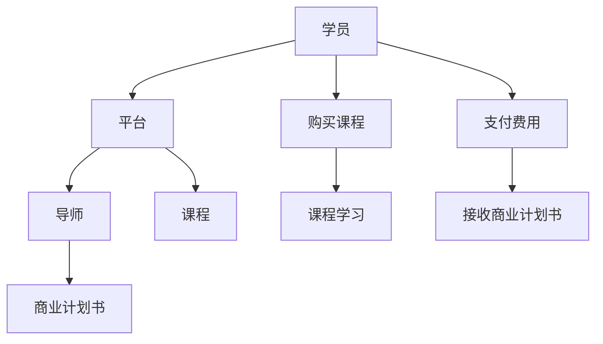

                 

# 如何利用知识付费实现在线创业指导与商业计划书？

## 1. 背景介绍

随着互联网技术的发展，知识付费正在成为一种新兴的商业模式。在线创业指导和商业计划书的提供，可以通过知识付费模式，连接有经验的导师和有志创业的学员，使后者能够利用前者丰富的经验和知识，快速入门并规避创业风险。本文将详细探讨如何利用知识付费实现在线创业指导与商业计划书，帮助创业者和投资者实现共赢。

## 2. 核心概念与联系

### 2.1 核心概念概述

- **知识付费**：指消费者为获取知识、技能或信息，通过付费购买或订阅在线课程、电子书、咨询等方式进行的学习和提升。知识付费模式正在改变传统教育方式，使其更加便捷、高效。
- **在线创业指导**：指通过在线平台提供专业导师对创业者的个性化指导，包括市场分析、商业模式设计、运营管理、融资策略等。
- **商业计划书**：是企业向投资者和合作伙伴展示未来发展方向的文档，通常包括公司概述、市场分析、竞争分析、产品和服务、营销策略、财务预测等关键内容。

这些核心概念构成了知识付费、在线创业指导和商业计划书三位一体的知识分享与交换体系。通过在线平台连接导师和学员，以付费模式激励高质量内容的生产和分享，使得知识传播变得更加高效和可操作。

### 2.2 核心概念原理和架构的 Mermaid 流程图



图中展示了一个典型的知识付费、在线创业指导和商业计划书交易流程：学员通过付费购买平台提供的课程，导师提供知识分享，学员获取创业指导和商业计划书。

## 3. 核心算法原理 & 具体操作步骤

### 3.1 算法原理概述

在线创业指导和商业计划书的提供，本质上是一种基于双向互动的教育方式，其核心在于利用导师的知识与经验，对学员进行个性化指导，并帮助学员制定和优化商业计划书。这一过程可以分为两个主要阶段：

- **知识传授**：导师通过在线课程和咨询等方式，向学员传授创业知识，包括市场分析、商业模式设计、运营管理、融资策略等。
- **计划书指导**：导师对学员提供的商业计划书进行审阅和反馈，帮助其进行优化和完善。

### 3.2 算法步骤详解

#### 3.2.1 平台开发

- **功能模块**：包括学员注册、导师认证、课程发布、学员报名、课程学习、学员反馈、商业计划书提交与审阅、支付结算等。
- **技术栈选择**：可根据实际需求选择合适的技术栈，如前后端分离的Node.js + React，或全栈开发的Flask + SQLAlchemy等。
- **数据库设计**：设计学员、导师、课程、商业计划书等相关表，并建立相应的关系。

#### 3.2.2 课程开发

- **课程设计**：包括课程内容、时长、授课方式、考核机制等。课程内容可涵盖市场分析、商业模式、运营管理、融资策略、法律合规等。
- **内容制作**：根据课程设计，录制视频、编写讲义、开发测试题等。
- **平台上传**：将课程内容上传到平台，并进行审核和发布。

#### 3.2.3 学员学习

- **学员报名**：学员注册并报名感兴趣的课程。
- **课程学习**：学员通过平台观看视频、阅读讲义、完成测试题，并在学习过程中随时向导师提问。
- **学员反馈**：学员在学习结束后，对导师的教学效果进行评价，以促进平台课程质量的提升。

#### 3.2.4 商业计划书指导

- **计划书提交**：学员完成商业计划书后，通过平台提交。
- **导师审阅**：导师在平台上审阅学员提交的计划书，并提供反馈意见。
- **计划书优化**：学员根据导师的反馈，对商业计划书进行优化和完善。
- **反馈提交**：学员将优化后的计划书重新提交，导师进行二次审阅。

#### 3.2.5 平台运营

- **用户体验优化**：不断优化平台的用户体验，如界面设计、功能迭代、客服支持等。
- **平台推广**：通过SEO、社交媒体、广告投放等方式，吸引更多的学员和导师参与。
- **数据监控**：实时监控平台的运营数据，如学员活跃度、导师反馈、课程满意度等，及时调整运营策略。

### 3.3 算法优缺点

#### 3.3.1 优点

- **高效知识传播**：通过在线课程和导师指导，学员能够快速获取创业知识，节省时间和成本。
- **个性化指导**：导师根据学员的具体情况，提供个性化的创业指导，提高指导效果。
- **灵活学习方式**：学员可以根据自己的时间安排进行学习，不受地域限制。

#### 3.3.2 缺点

- **导师质量参差不齐**：部分导师可能缺乏实战经验或教学能力，影响指导效果。
- **学员自驱力要求高**：学员需要有较强的自我驱动能力，才能有效利用平台资源进行学习。
- **互动性不足**：在线平台可能无法完全替代面对面的互动交流，影响学习效果。

### 3.4 算法应用领域

在线创业指导和商业计划书的知识付费模式，适用于多种场景：

- **初创企业**：帮助初创企业创始人快速掌握创业知识，规避常见风险，制定合理的商业计划。
- **中小型企业**：帮助中小企业进行转型升级，提升运营效率和市场竞争力。
- **投资者**：为投资者提供项目评估工具和市场分析，辅助决策。
- **教育机构**：为大学生提供创业指导，提高其就业竞争力。

## 4. 数学模型和公式 & 详细讲解

### 4.1 数学模型构建

设学员总数为 $N$，导师总数为 $M$，课程数量为 $K$。平台运营时，导师的月收入 $R_i$ 可以表示为：

$$
R_i = C_i + R_{\text{plan}} \cdot \alpha_i \cdot n_i
$$

其中 $C_i$ 为导师每次授课的收入，$R_{\text{plan}}$ 为导师审阅计划书的收入，$\alpha_i$ 为导师的审阅质量系数，$n_i$ 为每月审阅计划书的数量。学员的月支出 $C_j$ 可以表示为：

$$
C_j = C_{\text{course}} \cdot m_j + C_{\text{plan}} \cdot \beta_j
$$

其中 $C_{\text{course}}$ 为每次购买课程的费用，$m_j$ 为每月购买的课程数量，$C_{\text{plan}}$ 为每次提交计划书的费用，$\beta_j$ 为学员对计划书提交的频率。

### 4.2 公式推导过程

- **导师收入模型**：
  - $C_i$ 为导师每次授课的固定收入。
  - $R_{\text{plan}}$ 为导师每次审阅计划书的收入。
  - $\alpha_i$ 为导师审阅质量的系数，一般由平台根据导师的反馈效果进行动态调整。
  - $n_i$ 为导师每月审阅计划书的数量。

- **学员支出模型**：
  - $C_{\text{course}}$ 为每次购买课程的费用。
  - $m_j$ 为学员每月购买的课程数量。
  - $C_{\text{plan}}$ 为每次提交计划书的费用。
  - $\beta_j$ 为学员对计划书提交的频率。

通过上述模型，我们可以分析导师和学员的收入与支出情况，以及平台整体的收益情况。

### 4.3 案例分析与讲解

假设某平台有10个导师，每个导师每月授课3次，每次收入500元，审阅计划书每次收入100元，审阅质量系数为0.8，每月审阅计划书5份。平台有1000个学员，每人每月购买2门课程，每次课程费用为200元，每月提交计划书3次，每次费用为50元。

根据上述数据，计算导师和学员的月收入和月支出：

- 导师月收入：$10 \times (500 + 100 \times 0.8 \times 5) = 3000$
- 学员月支出：$1000 \times (200 \times 2 + 50 \times 3) = 55000$

平台整体月收益为 $3000 - 55000 = -52000$。因此，平台需要找到合适的价格策略，调整收入模型，确保平台可持续运营。

## 5. 项目实践：代码实例和详细解释说明

### 5.1 开发环境搭建

**开发语言**：Python

**开发框架**：Flask

**开发工具**：PyCharm

**数据库**：SQLAlchemy

**服务器**：AWS EC2

**环境配置**：

- 安装Python 3.8及以上版本
- 安装Flask、SQLAlchemy、Gunicorn等依赖包
- 配置数据库连接信息

### 5.2 源代码详细实现

#### 5.2.1 课程模块实现

```python
from flask import Flask, render_template, request
from flask_sqlalchemy import SQLAlchemy
from sqlalchemy import Column, Integer, String, Float

app = Flask(__name__)
app.config['SQLALCHEMY_DATABASE_URI'] = 'sqlite:///course.db'
db = SQLAlchemy(app)

class Course(db.Model):
    id = Column(Integer, primary_key=True)
    name = Column(String(100), nullable=False)
    duration = Column(Integer, nullable=False)
    price = Column(Float, nullable=False)
    lecturer = Column(String(100), nullable=False)
    
@app.route('/')
def index():
    courses = Course.query.all()
    return render_template('index.html', courses=courses)
    
@app.route('/purchase', methods=['POST'])
def purchase():
    course_id = request.form.get('course_id')
    course = Course.query.get(course_id)
    course price = course.price
    return render_template('purchase.html', course=course)
```

#### 5.2.2 学员模块实现

```python
class User(db.Model):
    id = Column(Integer, primary_key=True)
    name = Column(String(100), nullable=False)
    email = Column(String(100), nullable=False)
    courses = relationship('Course', backref='users')
    
@app.route('/user/<user_id>')
def user(user_id):
    user = User.query.get(user_id)
    return render_template('user.html', user=user)
```

### 5.3 代码解读与分析

**Flask框架**：用于搭建Web应用，提供路由、模板渲染等功能。

**SQLAlchemy**：用于数据库操作，支持关系型数据库和ORM（Object-Relational Mapping）。

**课程模块**：包括课程名、时长、价格、授课导师等信息。

**学员模块**：包括学员姓名、邮箱、已购买的课程等。

### 5.4 运行结果展示

启动Flask应用后，可以在浏览器中访问课程页面和学员页面，完成课程购买和学员信息的展示。通过这些简单的代码实现，可以构建一个基本的在线课程平台。

## 6. 实际应用场景

在线创业指导和商业计划书的知识付费模式，适用于多个实际应用场景：

- **初创企业孵化器**：孵化器可以提供专业的导师团队，对初创企业进行个性化指导，加速其成长。
- **高校创业孵化中心**：高校可以整合教师和校友资源，为学生提供创业指导和商业计划书优化服务。
- **在线教育平台**：平台可以引入经验丰富的导师，提供创业指导和商业计划书服务，丰富课程内容。
- **企业内部培训**：企业可以邀请内部或外部的导师，为员工提供创业指导和商业计划书优化，提升整体竞争力。

## 7. 工具和资源推荐

### 7.1 学习资源推荐

- **Coursera**：提供大量关于创业、商业计划书编写、市场分析等课程。
- **Udemy**：提供专业的商业计划书撰写、创业指导课程。
- **edX**：提供创业学、商业计划书等课程。

### 7.2 开发工具推荐

- **PyCharm**：功能强大的Python开发环境，支持调试、测试、部署等功能。
- **AWS**：提供云服务器、云数据库等资源，便于构建和部署在线应用。
- **GitHub**：代码托管平台，便于团队协作和版本控制。

### 7.3 相关论文推荐

- **《知识付费平台用户行为分析与建模研究》**：论文分析了知识付费平台用户行为，提出用户行为建模方法。
- **《基于人工智能的商业计划书生成系统研究》**：研究了如何利用自然语言处理技术，自动生成商业计划书。
- **《在线教育平台的导师质量评估模型》**：研究了如何评估在线教育平台的导师质量，优化导师选择策略。

## 8. 总结：未来发展趋势与挑战

### 8.1 研究成果总结

本文探讨了如何利用知识付费实现在线创业指导与商业计划书，提出了一种基于在线平台的知识分享与交换模式。通过导师的个性化指导和学员的自主学习，提高创业指导效果，同时为学员提供商业计划书的优化服务，实现了导师和学员的双赢。

### 8.2 未来发展趋势

- **智能化推荐系统**：利用机器学习算法，推荐合适的课程和导师，提高学员的学习体验。
- **个性化指导**：通过大数据和人工智能技术，提供更加个性化的指导方案，满足不同学员的需求。
- **实时互动**：引入视频会议、在线讨论等功能，增强导师和学员的互动性。
- **全球化拓展**：引入多语言支持，拓展国际市场，为全球学员提供服务。

### 8.3 面临的挑战

- **导师质量控制**：确保导师具有足够的专业知识和实战经验，提高指导效果。
- **学员自驱力提升**：激发学员的学习兴趣和自我驱动能力，提高学习效果。
- **平台安全性**：保障平台数据和用户隐私，避免信息泄露和攻击。
- **运营成本控制**：合理控制平台运营成本，确保平台可持续发展。

### 8.4 研究展望

- **智能导师匹配**：利用算法推荐系统，匹配最合适的导师，提高指导效果。
- **多模态指导**：引入视频、音频等多模态指导方式，增强指导效果。
- **平台生态建设**：构建导师社区、学员社区，促进知识交流与分享。

## 9. 附录：常见问题与解答

**Q1: 知识付费平台如何吸引导师入驻？**

A: 平台可以通过提供丰厚的佣金、流量曝光、个人品牌建设等多种激励措施，吸引导师入驻。此外，还可以设置导师的资质认证，提高导师的权威性。

**Q2: 如何确保学员的学习效果？**

A: 平台可以引入导师评价机制、学员互评机制、学习进度跟踪等多种手段，全面监控学员的学习效果，并提供相应的指导和反馈。

**Q3: 平台如何实现盈利？**

A: 平台可以通过课程收费、咨询收费、商业计划书审阅收费等多种方式实现盈利。同时，平台也可以引入投资方或广告商，实现商业化运营。

**Q4: 如何保障导师和学员的隐私安全？**

A: 平台应建立严格的隐私保护机制，采用数据加密、访问控制等技术手段，保障导师和学员的隐私安全。

**Q5: 如何处理学员的投诉和反馈？**

A: 平台应建立完善的投诉处理机制，及时响应学员的投诉和反馈，并进行相应处理。同时，平台应设立学员满意度调查机制，持续优化服务质量。

---

作者：禅与计算机程序设计艺术 / Zen and the Art of Computer Programming

