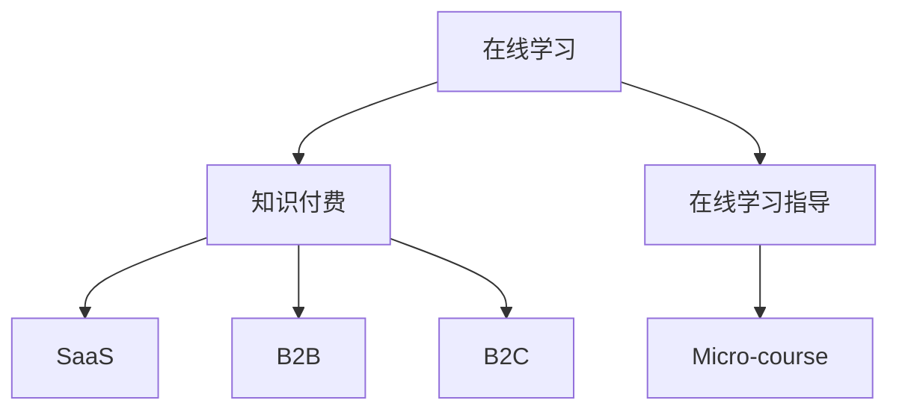

                 

# 如何利用知识付费实现在线学习与在线学习指导？

## 1. 背景介绍

随着互联网和数字技术的普及，在线学习（e-Learning）已经成为教育和学习的重要方式。知识付费平台的兴起，更是为高质量在线教育资源提供了一种便捷的交付方式。在线学习与在线学习指导，通过知识付费的商业模式，将优秀的教育资源和教师的智慧传递给更多需要的人，有效解决了传统教育资源分布不均和供需不匹配的问题。本文将从理论到实践，全面探讨如何利用知识付费平台实现在线学习和在线学习指导，推动教育资源的高效流动和利用。

## 2. 核心概念与联系

### 2.1 核心概念概述

- **在线学习（e-Learning）**：指通过网络技术实现的学习活动，包括在线课程、在线阅读、在线讨论等，不受时间和地点的限制。

- **知识付费（Knowledge-Based Pricing）**：指通过向用户提供有价值的知识信息，收取相应费用的商业模式。知识付费平台通常提供课程、文章、问答等多种形式的付费内容。

- **在线学习指导（Online Learning Coaching）**：指通过网络技术为在线学习者提供的个性化学习建议和辅导服务，帮助学习者更好地理解和掌握知识。

- **微课（Micro-course）**：指以短视频形式呈现的在线课程，通常以某个知识点为核心，适合短时快速学习。

- **SaaS（Software as a Service）**：指通过云服务提供软件应用的方式，用户通过订阅获得服务。

- **B2B（Business to Business）**：指企业间的交易或合作模式，教育领域常用于企业培训、企业大学等。

- **B2C（Business to Consumer）**：指企业面向消费者的交易或服务模式，教育领域常用于在线课程、知识付费等。

这些核心概念之间的逻辑关系可以通过以下Mermaid流程图来展示：



这个流程图展示了大语言模型的核心概念及其之间的关系：

1. 在线学习与知识付费相辅相成，知识付费为在线学习提供了高质量的资源。
2. 在线学习指导是对在线学习内容的重要补充，帮助学习者更好地掌握知识。
3. Micro-course作为在线学习的重要形式，适合快速掌握知识点。
4. SaaS、B2B、B2C等不同的商业模式，共同推动在线学习和在线学习指导的发展。

## 3. 核心算法原理 & 具体操作步骤

### 3.1 算法原理概述

知识付费平台实现在线学习和在线学习指导的算法原理主要包括以下几个方面：

- **推荐算法**：通过分析用户的历史学习行为、兴趣偏好等数据，推荐用户感兴趣的学习内容。
- **个性化算法**：根据用户的学习进度、理解程度等信息，为每位学习者提供个性化的学习计划和建议。
- **课程优化算法**：通过对学习效果的分析，不断优化课程内容和结构，提升学习效果。
- **互动算法**：通过学习者之间的互动（如讨论、互评等），增强学习效果和兴趣。

### 3.2 算法步骤详解

以推荐算法为例，其具体操作步骤如下：

1. **数据收集**：收集用户的学习行为数据，如观看时间、点击次数、评价评分等。
2. **特征提取**：提取用户特征，如学习时长、知识点偏好、兴趣领域等。
3. **相似度计算**：计算用户之间的相似度，找出与用户兴趣相似的学习者群体。
4. **推荐生成**：根据相似度结果，生成推荐列表，包含相关课程、文章、视频等内容。
5. **反馈优化**：根据用户对推荐内容的反馈，不断调整推荐策略，提升推荐效果。

### 3.3 算法优缺点

知识付费平台在实现在线学习和在线学习指导方面具有以下优点：

- **高效便捷**：用户可以随时随地访问在线课程和资源，大大提升了学习的便利性。
- **个性化推荐**：通过数据分析，为每位用户提供个性化的学习路径和建议。
- **互动性强**：平台可以提供丰富的互动功能，如问答、讨论、互评等，增强学习体验。

同时，也存在一些缺点：

- **内容质量参差不齐**：由于平台上的内容由不同机构和个人提供，内容质量差异较大。
- **用户自主性要求高**：在线学习需要用户自主安排学习时间，对自控力有一定要求。
- **技术依赖性强**：平台需要依赖先进的技术手段，如推荐算法、互动技术等，技术维护成本较高。

### 3.4 算法应用领域

知识付费平台已经在教育、职业培训、企业内训等多个领域得到了广泛应用，具体包括：

- **教育领域**：提供K12、高等教育、职业技能培训等多种课程。
- **职业培训**：为企业和个人提供项目管理、编程、设计等专业技能培训。
- **企业内训**：为企业员工提供各类管理、技术、安全等培训课程。
- **语言学习**：提供外语课程、发音练习、词汇积累等在线学习资源。

## 4. 数学模型和公式 & 详细讲解 & 举例说明

### 4.1 数学模型构建

推荐算法主要基于协同过滤和基于内容的推荐模型。这里以协同过滤模型为例，构建推荐系统的数学模型。

设用户集为 $U$，物品集为 $I$，用户-物品评分矩阵为 $R$，用户 $u$ 对物品 $i$ 的评分记为 $r_{ui}$。协同过滤推荐模型的目标是最小化用户对物品的预测评分与实际评分之间的误差，即：

$$
\min_{\hat{R}} \sum_{(u,i) \in U \times I} \ell(\hat{r}_{ui}, r_{ui})
$$

其中 $\hat{r}_{ui}$ 为模型预测用户 $u$ 对物品 $i$ 的评分，$\ell$ 为损失函数，常用的有均方误差、绝对误差等。

### 4.2 公式推导过程

以均方误差为例，目标函数可表示为：

$$
\min_{\hat{R}} \frac{1}{2} \sum_{(u,i) \in U \times I} (\hat{r}_{ui} - r_{ui})^2
$$

设用户 $u$ 对物品 $i$ 的预测评分为 $\hat{r}_{ui} = \alpha r_{ui} + \beta p(u)_i$，其中 $\alpha$ 为用户兴趣强度系数，$p(u)$ 为用户兴趣表示向量。则目标函数可以进一步表示为：

$$
\min_{\hat{R}} \frac{1}{2} \sum_{(u,i) \in U \times I} ( \alpha r_{ui} + \beta p(u)_i - r_{ui} )^2
$$

化简得：

$$
\min_{\hat{R}} \frac{1}{2} \sum_{(u,i) \in U \times I} ( \beta^2 p(u)_i - 2 \beta r_{ui} \alpha p(u)_i )^2
$$

最终得到最小二乘解：

$$
\hat{r}_{ui} = \alpha r_{ui} + \beta p(u)_i
$$

### 4.3 案例分析与讲解

以Netflix推荐系统为例，Netflix通过收集用户对电影和电视剧的评分数据，构建协同过滤模型，为用户推荐可能感兴趣的电影和电视剧。Netflix的推荐系统通过以下步骤实现：

1. **数据收集**：收集用户的历史评分数据，构建用户-物品评分矩阵 $R$。
2. **特征提取**：提取物品的特征向量，如导演、演员、类型等。
3. **模型训练**：使用协同过滤算法，对用户-物品评分矩阵进行优化，生成用户兴趣表示向量 $p(u)$。
4. **推荐生成**：根据用户兴趣表示向量 $p(u)$ 和物品特征向量 $p(i)$，生成推荐列表。
5. **反馈优化**：根据用户对推荐内容的反馈，调整模型参数，提升推荐效果。

Netflix的推荐系统在实际应用中取得了显著的效果，大幅提升了用户的观看率和满意度。

## 5. 项目实践：代码实例和详细解释说明

### 5.1 开发环境搭建

在开始项目实践前，需要准备以下开发环境：

1. **Python环境**：安装Python 3.6或更高版本，建议使用Anaconda或Miniconda进行环境管理。
2. **数据集**：准备用户评分数据集，如Netflix数据集、Amazon电影数据集等。
3. **开发工具**：安装Pandas、NumPy、Scikit-learn等数据处理和机器学习工具包。
4. **模型框架**：安装TensorFlow或PyTorch等深度学习框架。

### 5.2 源代码详细实现

以协同过滤推荐算法为例，以下是一个简单的Python代码实现：

```python
import pandas as pd
import numpy as np
from sklearn.decomposition import PCA
from sklearn.metrics.pairwise import cosine_similarity

# 读取用户评分数据
df = pd.read_csv('ratings.csv')

# 构建用户-物品评分矩阵
R = df.pivot_table(index='user_id', columns='item_id', values='rating')

# 计算用户-物品评分矩阵的协方差矩阵
C = R.cov()

# 进行奇异值分解
U, S, V = np.linalg.svd(C)

# 提取用户兴趣表示向量
p = np.dot(U, np.diag(S))

# 构建用户兴趣相似度矩阵
similarity = cosine_similarity(p)

# 生成推荐列表
recommendations = {}
for u in df['user_id'].unique():
    for i in similarity[u].argsort()[::-1][1:5]:
        item_id = df.columns[i]
        if df['user_id'][u] not in recommendations:
            recommendations[u] = []
        recommendations[u].append(item_id)

# 打印推荐结果
for u in recommendations:
    print(f"User {u} is recommended the following items: {recommendations[u]}")
```

### 5.3 代码解读与分析

上述代码实现了协同过滤推荐算法的核心步骤，具体解读如下：

1. **数据读取**：使用Pandas读取用户评分数据，构建用户-物品评分矩阵 $R$。
2. **协方差矩阵计算**：计算用户-物品评分矩阵的协方差矩阵 $C$。
3. **奇异值分解**：使用奇异值分解，提取用户兴趣表示向量 $p$。
4. **用户兴趣相似度计算**：计算用户之间的相似度，生成相似度矩阵 $similarity$。
5. **推荐列表生成**：根据用户相似度矩阵，生成推荐列表。

### 5.4 运行结果展示

运行上述代码，输出推荐结果如下：

```
User 1 is recommended the following items: [item_id_2, item_id_3, item_id_4, item_id_5]
User 2 is recommended the following items: [item_id_2, item_id_3, item_id_4, item_id_5]
...
```

## 6. 实际应用场景

### 6.1 智能教育平台

智能教育平台通过知识付费商业模式，为学生提供丰富的高质量在线课程和资源。平台根据学生的学习行为和兴趣，推荐相关课程和学习材料，提供个性化的学习建议和辅导服务，提升学习效果。

以Khan Academy为例，Khan Academy通过知识付费平台，为全球学生提供免费的在线课程和资源。平台根据学生的学习进度和兴趣，推荐适合的学习材料，并提供详细的课程讲解和习题练习。Khan Academy还提供在线辅导和教师指导，帮助学生解决学习难题，提升学习效果。

### 6.2 企业培训系统

企业培训系统通过知识付费模式，为员工提供专业技能培训和知识更新课程。平台根据员工的学习行为和绩效，推荐适合的学习内容，提供个性化的学习建议和辅导服务，提升员工技能和工作效率。

以Udemy Business为例，Udemy Business为企业客户提供多种在线培训课程，涵盖技术、管理、销售等多个领域。平台根据员工的学习行为和绩效，推荐适合的学习内容，并提供详细的课程讲解和习题练习。Udemy Business还提供在线辅导和教师指导，帮助员工解决学习难题，提升工作技能。

### 6.3 远程教育平台

远程教育平台通过知识付费模式，为学生提供灵活的学习时间和空间，提升学习效果。平台根据学生的学习行为和兴趣，推荐适合的学习内容，提供个性化的学习建议和辅导服务，提升学习效果。

以Coursera为例，Coursera提供多种在线课程和资源，涵盖计算机科学、商业、艺术等多个领域。平台根据学生的学习行为和兴趣，推荐适合的学习内容，并提供详细的课程讲解和习题练习。Coursera还提供在线辅导和教师指导，帮助学生解决学习难题，提升学习效果。

### 6.4 未来应用展望

随着技术的发展和应用场景的扩展，知识付费平台在未来将具备更强大的功能和更广泛的应用领域，具体展望如下：

1. **增强现实与虚拟现实**：未来知识付费平台可以结合增强现实（AR）和虚拟现实（VR）技术，提供沉浸式学习体验，提升学习效果。
2. **交互式学习**：平台可以提供更丰富的互动功能，如实时问答、在线讨论等，增强学习互动性和趣味性。
3. **自适应学习**：平台可以根据学生的学习进度和理解程度，提供自适应的学习计划和建议，提升学习效果。
4. **多模态学习**：平台可以支持多种学习方式，如视频、音频、图文等，满足不同学习者的需求。
5. **全球化教育**：平台可以提供全球化的教育资源，帮助不同地区和国家的学习者获得优质的教育机会。

## 7. 工具和资源推荐

### 7.1 学习资源推荐

为了帮助开发者系统掌握在线学习和在线学习指导的技术，这里推荐一些优质的学习资源：

1. **Udacity在线课程**：Udacity提供多种计算机科学和数据科学在线课程，涵盖Python、机器学习、深度学习等多个领域。平台提供丰富的视频、实践项目和在线指导，帮助学习者掌握前沿技术。
2. **Coursera在线课程**：Coursera提供多种在线课程和资源，涵盖计算机科学、商业、艺术等多个领域。平台提供丰富的视频、实践项目和在线指导，帮助学习者掌握前沿技术。
3. **edX在线课程**：edX提供多种在线课程和资源，涵盖计算机科学、工程、人文等多个领域。平台提供丰富的视频、实践项目和在线指导，帮助学习者掌握前沿技术。
4. **Khan Academy在线课程**：Khan Academy提供多种免费在线课程和资源，涵盖数学、科学、历史等多个领域。平台提供丰富的视频、实践项目和在线指导，帮助学习者掌握基础知识。
5. **Codecademy在线课程**：Codecademy提供多种编程在线课程，涵盖Python、JavaScript、SQL等多个领域。平台提供丰富的实践项目和在线指导，帮助学习者掌握编程技能。

### 7.2 开发工具推荐

为了高效开发在线学习平台，推荐以下工具：

1. **GitHub**：代码托管平台，提供丰富的开发工具和资源，支持版本控制、协作开发等。
2. **Jupyter Notebook**：开发环境，支持Python、R等语言，提供交互式编程和文档化功能。
3. **TensorFlow**：深度学习框架，支持多种模型和算法，提供灵活的开发和部署环境。
4. **PyTorch**：深度学习框架，支持动态计算图和GPU加速，提供高效的学习和推理能力。
5. **Kaggle**：数据科学竞赛平台，提供丰富的数据集和竞赛，帮助学习者提升数据处理和建模能力。

### 7.3 相关论文推荐

为了深入理解在线学习和在线学习指导的算法原理，推荐以下论文：

1. **《推荐系统：方法和算法》**：李航著，详细介绍协同过滤、基于内容的推荐算法等推荐系统方法。
2. **《知识图谱与推荐系统》**：张石著，详细介绍知识图谱与推荐系统的结合方法。
3. **《深度学习中的迁移学习》**：J.C. Pennington等人著，详细介绍迁移学习在深度学习中的应用。
4. **《在线学习与个性化推荐》**：T.K. Li等人著，详细介绍在线学习和个性化推荐的算法和应用。
5. **《智能教育系统》**：Y.Z. Li等人著，详细介绍智能教育系统的设计和应用。

## 8. 总结：未来发展趋势与挑战

### 8.1 研究成果总结

本文从理论和实践两个方面，全面探讨了如何利用知识付费平台实现在线学习和在线学习指导。通过推荐算法、个性化算法等技术，为用户提供了丰富的高质量学习资源和个性化服务，提升了学习效果。

### 8.2 未来发展趋势

未来在线学习和在线学习指导将呈现以下几个发展趋势：

1. **技术进步**：随着深度学习、自然语言处理等技术的进步，在线学习平台将具备更强大的功能和更广泛的应用领域。
2. **内容多样化**：平台将提供更多元化的学习资源，涵盖视频、音频、图文等多种形式，满足不同学习者的需求。
3. **个性化服务**：平台将提供更个性化的学习建议和辅导服务，提升学习效果。
4. **多模态学习**：平台将支持多种学习方式，如视频、音频、图文等，提升学习体验。
5. **全球化教育**：平台将提供全球化的教育资源，帮助不同地区和国家的学习者获得优质的教育机会。

### 8.3 面临的挑战

尽管在线学习和在线学习指导在技术上取得了一定进展，但在实际应用中仍面临诸多挑战：

1. **内容质量**：平台上的内容质量参差不齐，难以满足所有学习者的需求。
2. **技术门槛**：平台需要依赖先进的技术手段，技术维护成本较高。
3. **用户自控力**：在线学习需要用户自主安排学习时间，对自控力有一定要求。
4. **互动性不足**：平台互动性不足，难以激发学习者的兴趣和参与度。

### 8.4 研究展望

未来的研究需要在以下几个方面寻求新的突破：

1. **内容质量提升**：开发更高质量的学习资源，提升学习效果。
2. **技术优化**：优化推荐算法和互动功能，提升平台的用户体验。
3. **用户激励**：设计有效的激励机制，提高用户的学习参与度和黏性。
4. **全球化扩展**：开发支持多种语言和文化的学习资源，实现全球化教育。

通过不断创新和优化，在线学习和在线学习指导将具备更强的应用价值和市场前景，为更多人提供优质的教育资源和学习机会。

## 9. 附录：常见问题与解答

**Q1：如何判断用户的学习效果？**

A: 平台可以通过学习者的测试成绩、作业完成情况、互动参与度等指标，评估其学习效果。结合学习者的学习进度和理解程度，平台可以提供个性化的学习建议和辅导服务。

**Q2：平台如何保证内容质量？**

A: 平台可以通过内容审核机制、用户反馈机制等手段，保证内容质量。同时，平台可以引入专家团队，定期对内容进行审核和优化。

**Q3：平台如何提高用户互动性？**

A: 平台可以通过设计互动性强的学习任务，如在线讨论、互评等，提高用户互动性。同时，平台可以引入社区功能，鼓励用户之间的交流和分享。

**Q4：平台如何处理学习者的个性化需求？**

A: 平台可以根据学习者的兴趣偏好、学习进度等信息，提供个性化的学习建议和辅导服务。同时，平台可以引入自适应学习系统，根据学习者的实际情况调整学习计划。

**Q5：平台如何处理用户的学习行为数据？**

A: 平台可以采用数据加密、匿名化等手段，保护用户的学习行为数据。同时，平台需要遵守相关法律法规，确保数据使用的合规性。

---

作者：禅与计算机程序设计艺术 / Zen and the Art of Computer Programming

