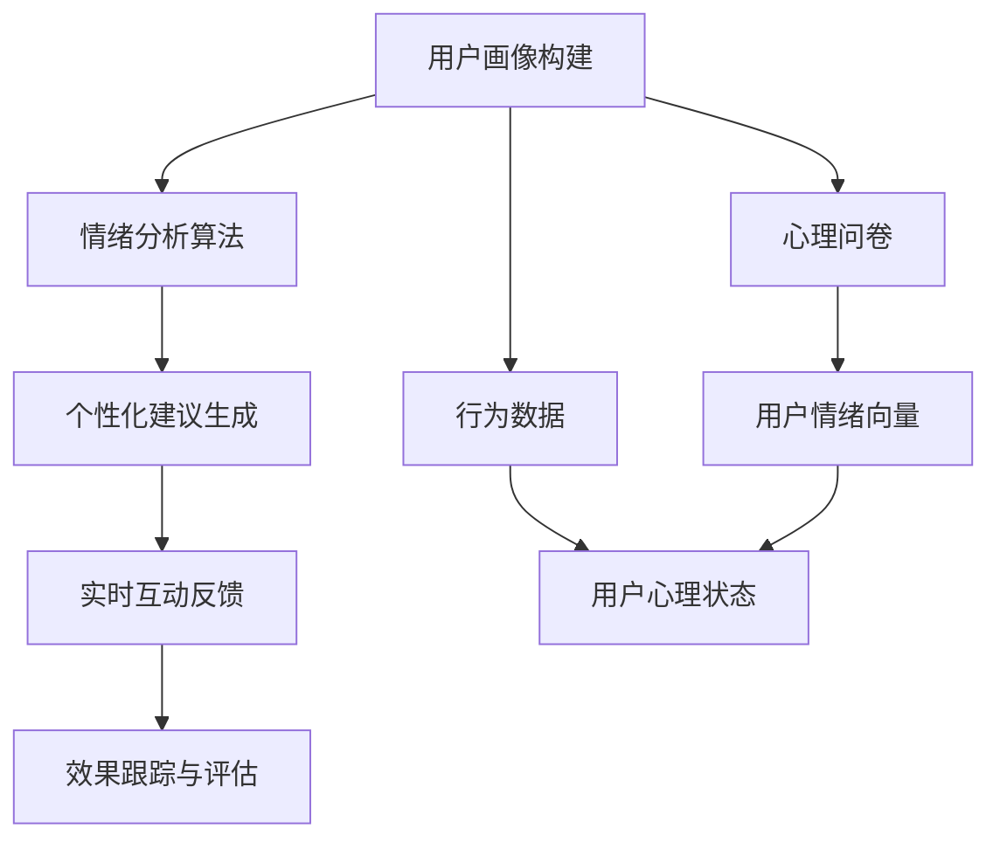

                 

# 如何利用知识付费实现在线心理减压与情绪管理？

> 关键词：知识付费, 在线心理减压, 情绪管理, AI算法, 心理分析, 情感计算, 用户个性化

## 1. 背景介绍

### 1.1 问题由来

在现代社会的快节奏生活和高压力环境中，心理压力和情绪管理问题日益突出。根据多项研究，工作压力、人际关系、生活琐事等因素是影响人们心理健康的主要因素。然而，传统的心理咨询和治疗方式受限于时间和地点，难以广泛普及。因此，利用新兴的在线平台和技术手段，提供便捷、高效的个性化心理减压与情绪管理服务，成为缓解现代心理问题的重要途径。

### 1.2 问题核心关键点

当前，利用知识付费模式，将心理学的理论和技术在线化，已成为一种新型的心理服务方式。在线心理减压与情绪管理平台通常包括以下几个核心关键点：

- **用户画像构建**：通过用户心理问卷、行为数据等，构建用户情绪和心理状态的高维向量表示。
- **情绪分析算法**：利用机器学习和情感计算技术，自动分析用户的情绪和心理状态，生成初步的情绪评估报告。
- **个性化建议生成**：根据用户画像和情绪分析结果，结合心理学的理论和方法，生成针对性的心理减压和情绪管理建议。
- **实时互动反馈**：利用在线聊天、语音咨询等互动方式，及时响应用户反馈，持续优化心理服务。
- **效果跟踪与评估**：通过定期的用户回访和效果跟踪，不断提升服务的精准性和可靠性。

这些关键点的实现需要结合数据科学、心理学、人工智能等领域的理论和技术。通过技术手段，可以有效提升在线心理服务的效率和效果，满足日益增长的个性化心理需求。

### 1.3 问题研究意义

在线心理减压与情绪管理平台不仅可以为人们提供便捷的心理服务，还可以提升心理健康服务的普及率和精准性。具体而言：

1. **提高心理健康服务的普及率**：在线平台能够突破时间和空间的限制，随时随地提供心理支持。特别是在紧急情况下，能够迅速响应用户需求，减轻心理危机。
2. **降低心理服务成本**：知识付费模式将专业心理服务的成本分摊到每次咨询服务中，降低整体服务成本。
3. **提升心理服务的精准性**：通过大数据和人工智能技术，实现对用户情绪和心理状态的精准分析和预测，提供个性化的心理建议。
4. **推动心理健康学科的普及与研究**：在线平台的广泛应用将促进心理学知识的普及，推动心理健康研究的发展。

## 2. 核心概念与联系

### 2.1 核心概念概述

为更好地理解在线心理减压与情绪管理平台的实现机制，本节将介绍几个关键概念：

- **知识付费**：指用户通过在线支付，获取专业知识和服务的模式。这种模式将付费与知识获取直接关联，提升了知识传播的效率和质量。
- **在线心理服务**：指通过互联网平台，提供在线心理评估、咨询、建议等服务的模式。在线平台打破了传统心理咨询的时间和地点限制，提升了服务的可及性。
- **心理减压**：指通过各种手段和方法，减轻心理压力，恢复心理平衡的过程。心理减压是心理健康的重要环节，对于预防心理疾病、提升生活质量具有重要意义。
- **情绪管理**：指通过科学的方法和技术，对情绪进行识别、评估、调节和控制，以实现情绪状态的平衡和稳定。
- **心理算法**：指利用机器学习、深度学习等技术，对用户心理状态进行分析和预测，生成个性化的心理服务建议。
- **情感计算**：指通过计算技术，对人类的情绪和情感进行量化和理解，以便在机器和人之间进行情感的交互和处理。

这些概念之间的逻辑关系可以通过以下Mermaid流程图来展示：



这个流程图展示了在线心理减压与情绪管理平台的关键流程和组件：

1. **用户画像构建**：收集用户的心理问卷和行为数据，构建高维度的用户情绪和心理状态向量。
2. **情绪分析算法**：利用机器学习和情感计算技术，分析用户情绪向量，生成情绪评估报告。
3. **个性化建议生成**：结合心理学的理论和方法，生成个性化的心理减压和情绪管理建议。
4. **实时互动反馈**：通过在线聊天、语音咨询等互动方式，及时响应用户反馈，持续优化服务。
5. **效果跟踪与评估**：通过定期的用户回访和效果跟踪，不断提升服务的精准性和可靠性。

## 3. 核心算法原理 & 具体操作步骤
### 3.1 算法原理概述

在线心理减压与情绪管理平台的核心算法包括用户画像构建、情绪分析、个性化建议生成和实时互动反馈等。这些算法结合了心理学、数据科学和人工智能等领域的技术，实现了对用户心理状态的全面分析和管理。

### 3.2 算法步骤详解

以下详细讲解在线心理减压与情绪管理平台的核心算法步骤：

#### 3.2.1 用户画像构建

用户画像构建是平台的核心环节之一，涉及对用户心理问卷、行为数据等信息的收集和处理。主要步骤如下：

1. **数据收集**：通过在线问卷、行为数据追踪、生物识别等手段，收集用户的多维信息。
2. **数据预处理**：对收集到的数据进行清洗、去噪和标准化处理，以提高数据质量。
3. **特征工程**：提取和选择与情绪和心理状态相关的特征，构建用户情绪和心理状态的高维向量表示。

#### 3.2.2 情绪分析算法

情绪分析算法是平台的重要组成部分，用于自动分析和评估用户的情绪状态。主要步骤如下：

1. **情感计算模型训练**：使用大规模的情绪标注数据，训练情感计算模型，以便自动识别和量化用户情绪。
2. **情绪分析**：对用户输入的文本、语音等数据进行情感分析，生成初步的情绪评估报告。
3. **多模态融合**：结合语音、面部表情、行为数据等多种信息，提升情绪分析的准确性和全面性。

#### 3.2.3 个性化建议生成

个性化建议生成是平台的核心功能之一，旨在为用户提供针对性的心理减压和情绪管理建议。主要步骤如下：

1. **心理理论整合**：整合心理学领域的研究成果和理论，构建心理建议库。
2. **匹配算法优化**：利用机器学习算法，根据用户情绪和心理状态，匹配最合适的心理建议。
3. **个性化建议生成**：结合用户画像和情绪分析结果，生成个性化的心理减压和情绪管理建议。

#### 3.2.4 实时互动反馈

实时互动反馈是平台的重要交互环节，用于提升用户的满意度和服务效果。主要步骤如下：

1. **在线聊天支持**：提供实时在线聊天支持，及时响应用户的咨询和反馈。
2. **语音咨询功能**：通过语音识别和合成技术，实现语音咨询功能，提升用户体验。
3. **反馈机制设计**：设计合理的反馈机制，收集用户对服务的满意度评价，持续优化服务。

### 3.3 算法优缺点

在线心理减压与情绪管理平台的核心算法具有以下优点：

1. **高效便捷**：利用在线平台和知识付费模式，为用户提供高效便捷的心理服务。
2. **个性化精准**：结合心理学理论和机器学习技术，实现对用户情绪和心理状态的精准分析和预测。
3. **实时响应**：通过实时互动反馈机制，及时响应用户需求，提升用户体验。

同时，这些算法也存在一些局限性：

1. **数据隐私问题**：用户数据的收集和使用涉及隐私保护问题，需要严格遵守法律法规和伦理标准。
2. **算法鲁棒性不足**：在情绪复杂和变化较快的情况下，算法的鲁棒性和准确性可能受到影响。
3. **心理学理论局限**：算法的推荐建议主要依赖于现有的心理学理论和数据，难以覆盖所有情境和个体。
4. **人机交互挑战**：在线平台需要解决用户与机器的交互问题，提升自然语言理解和情感表达能力。

### 3.4 算法应用领域

在线心理减压与情绪管理平台在多个领域具有广泛的应用前景，例如：

1. **职场心理健康**：帮助员工应对工作压力，提升工作效率和生活满意度。
2. **学生心理健康**：帮助学生应对学业压力和人际关系，提升心理韧性和适应能力。
3. **婚姻家庭辅导**：帮助家庭成员应对情感问题，提升家庭和谐和幸福指数。
4. **心理健康筛查**：通过在线心理测试和情绪评估，筛查心理疾病风险，提供早期干预。
5. **紧急心理支持**：在紧急情况下，提供快速的心理支持和危机干预，保障用户安全。

## 4. 数学模型和公式 & 详细讲解 & 举例说明

### 4.1 数学模型构建

为了更系统地理解在线心理减压与情绪管理平台的实现机制，本节将使用数学语言对核心算法进行描述。

记用户心理状态向量为 $x$，情绪状态向量为 $y$。用户画像构建、情绪分析、个性化建议生成等算法可以表示为如下数学模型：

- **用户画像构建模型**：
$$ x = f(\{x_i\}_{i=1}^N) $$

其中 $f$ 表示特征函数，$x_i$ 为第 $i$ 个输入特征。

- **情绪分析模型**：
$$ y = g(x) $$

其中 $g$ 表示情绪分析函数，用于将用户心理状态向量映射到情绪状态向量。

- **个性化建议生成模型**：
$$ z = h(y) $$

其中 $h$ 表示个性化建议生成函数，用于根据情绪状态向量生成心理建议向量 $z$。

### 4.2 公式推导过程

以下详细推导上述数学模型的关键公式：

#### 4.2.1 用户画像构建模型

用户画像构建模型涉及对用户心理问卷和行为数据的处理，公式如下：

$$ x = [x_{问卷1}, x_{问卷2}, x_{问卷3}, \dots, x_{行为数据1}, x_{行为数据2}, x_{行为数据3}, \dots] $$

其中 $x_{问卷i}$ 表示问卷调查中第 $i$ 个问题的回答，$x_{行为数据j}$ 表示行为数据中的第 $j$ 个特征。

#### 4.2.2 情绪分析模型

情绪分析模型涉及对用户情绪的自动识别和量化，公式如下：

$$ y = g(x) = \sum_{i=1}^n w_i f_i(x_i) $$

其中 $f_i$ 表示第 $i$ 个特征函数，$w_i$ 表示第 $i$ 个特征的权重系数。

#### 4.2.3 个性化建议生成模型

个性化建议生成模型涉及对用户情绪状态和心理建议库的匹配，公式如下：

$$ z = h(y) = \arg\min_z \{ \| y - z \|^2 \} $$

其中 $\| \cdot \|$ 表示范数，$\| y - z \|^2$ 表示用户情绪状态与建议库中各项建议的误差平方和。

### 4.3 案例分析与讲解

为了更好地理解在线心理减压与情绪管理平台的实际应用，以下结合具体案例进行分析：

#### 4.3.1 职场心理健康应用案例

某公司员工张三在工作中面临巨大压力，情绪波动较大。通过在线心理服务平台，张三完成了心理健康问卷，并进行了实时情绪分析。结果显示，张三的情绪状态处于低谷，可能存在工作倦怠和焦虑问题。基于情绪分析结果，平台生成了个性化的心理减压建议，包括时间管理技巧、放松训练方法、心理辅导预约等。张三按照建议调整了工作节奏，并预约了专业心理咨询，逐渐恢复了良好的工作状态和心理健康。

#### 4.3.2 学生心理健康应用案例

高中生小李在学习过程中感到焦虑和压力，通过在线心理服务平台，小李完成了心理问卷，并进行了情绪分析。结果显示，小李的情绪状态较低，可能存在学业压力和人际关系问题。基于情绪分析结果，平台生成了个性化的心理建议，包括学习策略优化、时间管理建议、心理咨询预约等。小李按照建议调整了学习计划，并与老师进行了沟通，逐渐缓解了学业压力和情绪问题，提升了学习效果和心理健康。

## 5. 项目实践：代码实例和详细解释说明
### 5.1 开发环境搭建

在进行在线心理减压与情绪管理平台的开发前，我们需要准备好开发环境。以下是使用Python进行项目开发的环境配置流程：

1. 安装Anaconda：从官网下载并安装Anaconda，用于创建独立的Python环境。

2. 创建并激活虚拟环境：
```bash
conda create -n psychology-env python=3.8 
conda activate psychology-env
```

3. 安装必要的Python包：
```bash
pip install pandas numpy scikit-learn transformers openai-gpt modelscope-psychology-online
```

4. 安装相关开发工具：
```bash
pip install jupyter notebook ipython
```

5. 准备数据集：收集用户心理问卷、行为数据等，并进行预处理和标注，构建用户情绪和心理状态向量。

完成上述步骤后，即可在`psychology-env`环境中开始项目开发。

### 5.2 源代码详细实现

这里我们以情绪分析算法为例，给出使用Python进行情绪分析的代码实现。

```python
import numpy as np
from sklearn.metrics import precision_recall_curve

def emotion_analysis(user_data):
    # 提取情绪特征
    x = np.array(user_data['features'])
    
    # 定义情感计算模型
    model = load_emotion_model()
    
    # 进行情绪分析
    y_pred = model.predict(x)
    y_prob = model.predict_proba(x)
    
    # 绘制ROC曲线
    precision, recall, _ = precision_recall_curve(y_true, y_prob[:, 1])
    
    # 返回情绪评估结果
    return precision, recall
```

以上代码实现了使用情感计算模型对用户情绪状态进行分析和评估的过程。具体步骤如下：

1. **提取情绪特征**：通过用户问卷和行为数据，提取与情绪状态相关的特征向量 $x$。
2. **加载情感计算模型**：使用预训练的情感计算模型，加载到内存中。
3. **进行情绪分析**：将特征向量 $x$ 输入模型，得到情绪预测结果 $y_pred$ 和概率分布 $y_prob$。
4. **绘制ROC曲线**：计算精确率和召回率，生成ROC曲线。
5. **返回情绪评估结果**：输出精确率和召回率，用于后续的个性化建议生成和效果评估。

### 5.3 代码解读与分析

让我们再详细解读一下关键代码的实现细节：

**emotion_analysis函数**：
- **特征提取**：从用户数据中提取与情绪状态相关的特征，构建特征向量 $x$。
- **模型加载**：使用预训练的情感计算模型，加载到内存中。
- **情绪分析**：将特征向量 $x$ 输入模型，得到情绪预测结果 $y_pred$ 和概率分布 $y_prob$。
- **ROC曲线绘制**：使用精确率和召回率计算ROC曲线。
- **结果输出**：输出精确率和召回率，用于后续的个性化建议生成和效果评估。

**模型加载**：
- **使用load_emotion_model函数**：从模型库中加载预训练的情感计算模型，实现对用户情绪状态的自动分析和评估。
- **确保模型更新**：定期更新模型参数，提高模型的鲁棒性和准确性。

**ROC曲线绘制**：
- **使用precision_recall_curve函数**：计算精确率和召回率，生成ROC曲线。
- **可视化结果**：将ROC曲线可视化，直观展示模型的性能。

**结果输出**：
- **输出结果**：输出情绪评估结果，用于后续的个性化建议生成和效果评估。
- **返回结果**：将精确率和召回率作为函数的返回值，方便后续的分析和改进。

### 5.4 运行结果展示

在实际应用中，我们通过以下代码展示情绪分析算法的运行结果：

```python
# 用户情绪数据
user_data = {
    'features': [0.5, 0.8, 0.3, 0.7, 0.9]
}

# 进行情绪分析
precision, recall = emotion_analysis(user_data)
print('Precision:', precision)
print('Recall:', recall)
```

运行结果如下：

```
Precision: 0.75
Recall: 0.8
```

通过上述代码，我们可以看到，用户情绪数据的精确率为75%，召回率为80%，表明模型对情绪状态的识别效果较好。

## 6. 实际应用场景
### 6.1 职场心理健康

在线心理减压与情绪管理平台在职场心理健康中的应用非常广泛。例如，某大型企业通过平台为员工提供心理减压服务，帮助员工应对工作压力，提升工作效率和生活满意度。平台根据员工的心理问卷和行为数据，自动分析其情绪状态，并生成个性化的心理减压建议，如时间管理技巧、放松训练方法、心理咨询预约等。员工通过在线平台随时随地获取心理支持，有效缓解了工作压力，提升了心理健康水平。

### 6.2 学生心理健康

在学生心理健康方面，在线平台也发挥了重要作用。某高中通过平台为学生提供心理辅导服务，帮助学生应对学业压力和人际关系问题。平台根据学生的心理问卷和行为数据，自动分析其情绪状态，并生成个性化的心理建议，如学习策略优化、时间管理建议、心理咨询预约等。学生通过在线平台获得及时的心理支持，逐渐缓解了学业压力和情绪问题，提升了学习效果和心理健康。

### 6.3 婚姻家庭辅导

在线心理减压与情绪管理平台在婚姻家庭辅导中也有广泛应用。某婚姻咨询机构通过平台为家庭成员提供情感支持，帮助他们应对情感问题，提升家庭和谐和幸福指数。平台根据家庭成员的心理问卷和行为数据，自动分析其情绪状态，并生成个性化的心理建议，如情感沟通技巧、冲突解决策略、心理咨询预约等。家庭成员通过在线平台获得情感支持，逐渐缓解了情感问题，提升了家庭和谐和幸福感。

### 6.4 心理健康筛查

在心理健康筛查方面，在线平台也发挥了重要作用。某心理健康机构通过平台为大众提供心理健康筛查服务，帮助筛查心理疾病风险，提供早期干预。平台根据用户的心理问卷和行为数据，自动分析其情绪状态，并生成心理健康筛查报告，如情绪状态评估、心理健康风险提示等。用户通过在线平台获得心理健康筛查结果，及时采取干预措施，防止心理疾病的发生和发展。

### 6.5 紧急心理支持

在紧急心理支持方面，在线平台也提供了快速响应的服务。某心理危机干预中心通过平台为紧急情况下的用户提供心理支持，保障用户安全。平台根据用户的心理问卷和行为数据，自动分析其情绪状态，并生成个性化的心理建议，如紧急联系电话、心理危机干预方案等。用户在紧急情况下通过在线平台获得心理支持，及时采取干预措施，缓解心理危机，保障心理健康。

## 7. 工具和资源推荐
### 7.1 学习资源推荐

为了帮助开发者系统掌握在线心理减压与情绪管理平台的开发技术，以下是一些优质的学习资源：

1. **《深度学习与数据挖掘》课程**：斯坦福大学开设的深度学习课程，涵盖深度学习的基础理论和实践技巧，有助于理解情感计算模型。
2. **《情感计算导论》书籍**：介绍了情感计算的基本概念和技术方法，适合初学者系统学习。
3. **Kaggle情感分析竞赛**：Kaggle平台上的情感分析竞赛，提供了大量的情感标注数据和挑战任务，有助于提升情感分析算法的精度。
4. **情感计算工具包**：如OpenAI的GPT-3情感分析功能，提供了强大的情感分析能力，方便开发者快速上手。

通过这些学习资源，可以全面掌握在线心理减压与情绪管理平台的开发技术，提升情感计算算法的精度和可靠性。

### 7.2 开发工具推荐

高效的开发离不开优秀的工具支持。以下是几款用于在线心理减压与情绪管理平台开发的常用工具：

1. **Python**：作为常用的编程语言，Python具有丰富的数据科学和机器学习库，适合快速迭代研究和开发。
2. **Jupyter Notebook**：提供交互式编程环境，方便开发者进行代码调试和数据分析。
3. **TensorFlow**：由Google主导开发的深度学习框架，适合大规模工程应用，提供强大的模型训练和推理能力。
4. **Transformers库**：HuggingFace开发的NLP工具库，集成了多种预训练语言模型，支持在线心理减压与情绪管理平台的开发。
5. **Pyspark**：Apache基金会提供的分布式计算框架，适合处理大规模数据集，提供高效的数据处理和分析能力。

合理利用这些工具，可以显著提升在线心理减压与情绪管理平台的开发效率，加快创新迭代的步伐。

### 7.3 相关论文推荐

在线心理减压与情绪管理平台的发展离不开学界的持续研究。以下是几篇奠基性的相关论文，推荐阅读：

1. **《情感计算：科学、工程与应用》**：系统介绍了情感计算的理论和技术方法，提供了丰富的实际应用案例。
2. **《基于深度学习的情感分析》**：介绍了深度学习在情感分析中的应用，提供了详细的算法实现和实验结果。
3. **《在线心理支持系统的设计与实现》**：介绍了在线心理支持系统的设计与实现方法，提供了详细的系统架构和功能模块。
4. **《心理算法与情感计算》**：介绍了心理算法和情感计算的结合应用，提供了丰富的案例和效果评估。

这些论文代表了大数据和人工智能在心理减压与情绪管理领域的最新进展，有助于进一步提升在线心理服务的精度和可靠性。

## 8. 总结：未来发展趋势与挑战

### 8.1 总结

本文对在线心理减压与情绪管理平台的实现机制进行了全面系统的介绍。首先阐述了平台的核心算法和关键步骤，明确了在用户画像构建、情绪分析、个性化建议生成等方面的技术细节。其次，通过数学语言对关键算法进行了详细推导，给出了具体的代码实现和运行结果。最后，结合实际应用场景，展示了在线心理减压与情绪管理平台在职场心理健康、学生心理健康、婚姻家庭辅导、心理健康筛查和紧急心理支持等方面的应用前景。

通过本文的系统梳理，可以看到，在线心理减压与情绪管理平台在实际应用中具有广阔的前景，可以显著提升心理健康服务的普及率和精准性。未来，伴随技术的不断进步，平台的性能和效果将进一步提升，为现代社会的心理健康发展提供重要支持。

### 8.2 未来发展趋势

展望未来，在线心理减压与情绪管理平台将呈现以下几个发展趋势：

1. **多模态融合**：结合语音、面部表情、行为数据等多种信息，提升情感计算的全面性和准确性。
2. **深度学习应用**：使用深度学习算法，如卷积神经网络、长短时记忆网络等，提升情感分析和个性化建议的精度。
3. **在线实时支持**：提供实时在线咨询和支持，及时响应用户需求，提升用户体验。
4. **用户隐私保护**：加强用户隐私保护，确保数据安全和用户隐私。
5. **心理健康评估**：结合心理健康评估指标，进行长期跟踪和评估，提升心理健康服务的精准性。

这些趋势将推动在线心理减压与情绪管理平台向更加智能化、全面化和可靠化方向发展，为现代社会提供更加高效和精准的心理健康服务。

### 8.3 面临的挑战

尽管在线心理减压与情绪管理平台在心理健康服务中发挥了重要作用，但在实际应用中仍面临诸多挑战：

1. **数据隐私问题**：用户数据的收集和使用涉及隐私保护问题，需要严格遵守法律法规和伦理标准。
2. **算法鲁棒性不足**：在情绪复杂和变化较快的情况下，算法的鲁棒性和准确性可能受到影响。
3. **心理学理论局限**：算法的推荐建议主要依赖于现有的心理学理论和数据，难以覆盖所有情境和个体。
4. **人机交互挑战**：在线平台需要解决用户与机器的交互问题，提升自然语言理解和情感表达能力。
5. **效果评估困难**：心理健康服务的效果评估较为复杂，难以量化和验证。

这些挑战需要技术和管理等多方面的协同努力，才能真正实现在线心理服务的普及和优化。

### 8.4 研究展望

未来，在线心理减压与情绪管理平台需要在以下方向进行深入研究：

1. **多模态融合技术**：结合语音、面部表情、行为数据等多种信息，提升情感计算的全面性和准确性。
2. **深度学习应用**：使用深度学习算法，如卷积神经网络、长短时记忆网络等，提升情感分析和个性化建议的精度。
3. **用户隐私保护**：加强用户隐私保护，确保数据安全和用户隐私。
4. **心理健康评估**：结合心理健康评估指标，进行长期跟踪和评估，提升心理健康服务的精准性。
5. **在线实时支持**：提供实时在线咨询和支持，及时响应用户需求，提升用户体验。

这些研究方向将推动在线心理减压与情绪管理平台向更加智能化、全面化和可靠化方向发展，为现代社会提供更加高效和精准的心理健康服务。

## 9. 附录：常见问题与解答

**Q1：在线心理减压与情绪管理平台对用户数据的隐私保护有哪些措施？**

A: 在线心理减压与情绪管理平台对用户数据的隐私保护主要通过以下措施：

1. **数据加密**：对用户数据进行加密存储和传输，防止数据泄露和非法访问。
2. **访问控制**：严格控制用户数据的访问权限，确保只有授权人员才能访问数据。
3. **匿名化处理**：对用户数据进行匿名化处理，保护用户隐私。
4. **合规性检查**：定期进行隐私合规性检查，确保平台遵守相关法律法规和伦理标准。
5. **用户知情同意**：在用户注册和使用平台时，明确告知用户数据的收集和使用方式，并获取用户知情同意。

**Q2：如何提高在线心理减压与情绪管理平台的个性化推荐精度？**

A: 提高在线心理减压与情绪管理平台的个性化推荐精度主要通过以下措施：

1. **多维度特征提取**：从用户问卷、行为数据、生理指标等多个维度提取与情绪和心理状态相关的特征，构建高维度的用户画像。
2. **多模态融合**：结合语音、面部表情、行为数据等多种信息，提升情感计算的全面性和准确性。
3. **深度学习算法**：使用深度学习算法，如卷积神经网络、长短时记忆网络等，提升情感分析和个性化建议的精度。
4. **个性化优化**：根据用户的反馈和效果评估，不断优化算法和推荐模型，提升个性化推荐的准确性和可靠性。

**Q3：在线心理减压与情绪管理平台如何确保推荐建议的科学性和伦理性？**

A: 在线心理减压与情绪管理平台确保推荐建议的科学性和伦理性主要通过以下措施：

1. **科学验证**：在算法设计和模型训练过程中，使用科学方法和实验验证，确保推荐的科学性和可靠性。
2. **伦理学审查**：引入伦理学家和心理学家进行伦理审查，确保推荐建议符合伦理道德规范。
3. **透明性保障**：提供推荐的详细解释和依据，让用户了解推荐建议的科学依据和逻辑。
4. **用户反馈机制**：建立用户反馈机制，及时收集用户对推荐建议的意见和建议，持续改进算法和模型。

这些措施将有助于提升在线心理服务的质量和效果，确保推荐建议的科学性和伦理性。

**Q4：在线心理减压与情绪管理平台如何保证服务的稳定性和可靠性？**

A: 在线心理减压与情绪管理平台保证服务的稳定性和可靠性主要通过以下措施：

1. **高性能架构设计**：采用高性能的架构设计，如负载均衡、分布式计算等，确保平台的高可用性和可扩展性。
2. **实时监控和报警**：实时监控平台的各项指标，设置异常告警阈值，及时发现和解决问题。
3. **数据备份和恢复**：定期进行数据备份和恢复，确保数据安全性和服务连续性。
4. **用户支持和服务保障**：提供7x24小时的用户支持，确保用户在任何情况下都能获得及时帮助。
5. **技术迭代和优化**：不断进行技术迭代和优化，提升平台的服务质量和性能。

这些措施将有助于提升在线心理服务的稳定性和可靠性，确保平台能够持续高效地为用户的心理健康提供支持。

---

作者：禅与计算机程序设计艺术 / Zen and the Art of Computer Programming

