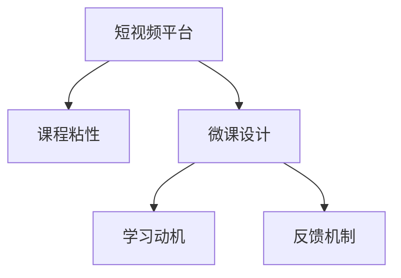

                 

# 如何利用短视频平台增加课程粘性

在当今信息爆炸的时代，短视频平台已成为许多人获取知识、学习新技能的重要渠道。如何通过短视频平台提升课程的粘性，让学员更加沉浸在课程内容中，成为在线教育平台需要深入探索的问题。本文将从核心概念、核心算法原理、具体操作、数学模型、实际应用场景、工具和资源推荐、未来发展趋势与挑战等方面，系统介绍如何利用短视频平台增加课程粘性。

## 1. 背景介绍

### 1.1 问题由来

在线教育的发展，使得教育资源的获取不再局限于传统的课堂教学，学员可以随时随地通过网络学习各种知识。短视频平台的兴起，更是为教育内容的传播提供了新的形式。然而，面对海量的视频内容，如何吸引学员持续关注课程，提升课程粘性，成为在线教育平台亟需解决的问题。

短视频的特点在于其高度的互动性和娱乐性，可以让学员在短时间内获取到大量信息，并激发其持续关注课程的兴趣。如何利用短视频平台，将知识点以更生动有趣的形式呈现，提高学员的参与度和学习效果，是本文探讨的核心问题。

### 1.2 问题核心关键点

- **短视频平台**：短视频平台的广泛应用，为教育内容传播提供了新的途径。
- **课程粘性**：课程粘性是指学员对课程内容的持续关注度和参与度，是衡量课程质量的重要指标。
- **微课设计**：短视频平台的教学内容通常被称为“微课”，其设计应注重知识点的提炼和展示，同时增加互动性和趣味性。
- **学习动机**：了解学员的学习动机，并针对其兴趣点设计内容，可以提高课程粘性。
- **反馈机制**：建立有效的反馈机制，及时获取学员的反馈，并进行相应调整。

## 2. 核心概念与联系

### 2.1 核心概念概述

为了更好地理解短视频平台如何增加课程粘性，本文将介绍几个关键概念：

- **短视频平台**：如抖音、快手、YouTube等，提供了便于传播和观看的短视频内容。
- **课程粘性**：衡量学员对课程内容的持续关注度和参与度，是评估课程质量的关键指标。
- **微课设计**：短视频平台的教学内容，需要高度凝练和精炼，同时注重趣味性和互动性。
- **学习动机**：了解学员的学习动机和兴趣点，设计符合其需求的内容。
- **反馈机制**：通过互动和反馈，及时调整课程内容，提升课程质量。

这些概念通过以下Mermaid流程图进行展示：



这个流程图展示了短视频平台、课程粘性、微课设计、学习动机和反馈机制之间的逻辑关系。短视频平台的便捷性让微课设计更加高效，学习动机的了解让内容更具针对性，而反馈机制的建立则帮助持续改进课程内容，从而提高课程粘性。

## 3. 核心算法原理 & 具体操作步骤

### 3.1 算法原理概述

短视频平台增加课程粘性的核心算法原理，主要包括以下几个方面：

- **内容推荐算法**：通过分析学员的观看行为，推荐相关或兴趣相符的短视频内容，增加学员的持续关注度。
- **互动设计算法**：设计有趣的互动元素，如问答、投票、评论等，提升学员的参与感和积极性。
- **个性化学习路径**：根据学员的学习进度和表现，调整课程内容和难度，提供个性化的学习体验。
- **反馈和调整算法**：收集学员的反馈信息，分析其反馈内容，并根据反馈进行课程内容的优化和调整。

### 3.2 算法步骤详解

基于上述核心算法原理，短视频平台增加课程粘性的具体操作步骤如下：

1. **数据收集**：收集学员的观看数据、互动数据和反馈数据，包括视频观看时长、点赞数、评论内容等。
2. **内容推荐**：根据学员的观看历史和偏好，推荐相关或兴趣相符的短视频内容。
3. **互动设计**：在视频中加入问答、投票、评论等互动元素，增加学员的参与感。
4. **个性化学习路径**：根据学员的学习进度和表现，动态调整课程内容和难度，提供个性化的学习体验。
5. **反馈收集与分析**：通过互动和反馈，收集学员的意见和建议，分析反馈内容，进行课程内容的优化和调整。
6. **评估与改进**：定期评估课程的粘性和学员的学习效果，根据评估结果进行课程内容的改进和优化。

### 3.3 算法优缺点

短视频平台增加课程粘性的算法具有以下优点：

- **高效互动**：通过互动设计，增加学员的参与感和积极性，提升课程粘性。
- **个性化体验**：根据学员的学习进度和表现，提供个性化的学习体验，提高学习效果。
- **灵活调整**：通过反馈和调整算法，及时优化课程内容，提高课程质量。

同时，该算法也存在一些局限性：

- **数据隐私**：收集和分析学员的数据可能会涉及隐私问题，需要合理处理和保护。
- **过度依赖互动**：过度依赖互动设计可能会降低学员的自主学习意愿，需要平衡互动与自主学习。
- **内容多样性不足**：过于强调互动和个性化可能导致内容多样性不足，需要多渠道内容补充。

### 3.4 算法应用领域

短视频平台增加课程粘性的算法，已在在线教育、技能培训、企业内训等多个领域得到应用，具体包括：

- **在线教育**：如Coursera、Udemy等平台，通过短视频内容吸引学员持续关注，提升课程粘性。
- **技能培训**：如技能大师、慕课网等平台，提供技能相关的短视频教学内容，帮助学员快速掌握新技能。
- **企业内训**：如华为、阿里巴巴等企业，通过短视频形式进行内部培训，提升员工的技能水平和积极性。
- **职业培训**：如职业资格认证、技能竞赛等，提供短视频形式的培训内容，帮助学员准备考试或比赛。

## 4. 数学模型和公式 & 详细讲解 & 举例说明

### 4.1 数学模型构建

假设短视频平台有 $N$ 个学员，每个学员的观看历史、互动行为和反馈信息分别为 $\{x_i\}_{i=1}^N$、$\{y_i\}_{i=1}^N$ 和 $\{z_i\}_{i=1}^N$。定义 $W$ 为观看历史权重，$I$ 为互动行为权重，$F$ 为反馈信息权重。则短视频平台增加课程粘性的数学模型可以表示为：

$$
\max_{W, I, F} \sum_{i=1}^N W_i \cdot f(\{x_i, y_i, z_i\})
$$

其中，$f$ 为衡量课程粘性的函数，$W_i$、$I_i$、$F_i$ 分别为学员 $i$ 的观看历史、互动行为和反馈信息的权重。

### 4.2 公式推导过程

对于每个学员 $i$，可以构建如下课程粘性计算公式：

$$
C_i = W_i \cdot f(\{x_i, y_i, z_i\})
$$

其中，$W_i$ 为学员 $i$ 的观看历史权重，可以表示为学员观看历史时长、点赞数、评论数等。$I_i$ 为学员 $i$ 的互动行为权重，可以表示为学员的评论内容、投票结果等。$F_i$ 为学员 $i$ 的反馈信息权重，可以表示为学员的评分、评价等。

将上述公式代入总课程粘性计算公式中，得到：

$$
C_{\text{total}} = \sum_{i=1}^N C_i
$$

### 4.3 案例分析与讲解

以一个在线教育平台为例，分析如何通过短视频平台增加课程粘性。假设该平台有 1000 个学员，每个学员的观看历史、互动行为和反馈信息如下：

| 学员编号 | 观看历史权重 $W_i$ | 互动行为权重 $I_i$ | 反馈信息权重 $F_i$ | 课程粘性 $C_i$ |
| --- | --- | --- | --- | --- |
| 1 | 0.8 | 0.5 | 0.3 | 0.7 |
| 2 | 0.5 | 0.6 | 0.4 | 0.9 |
| ... | ... | ... | ... | ... |

通过计算得到平台总课程粘性为 $C_{\text{total}} = \sum_{i=1}^{1000} C_i = 495$。这表明平台整体课程粘性较高，学员对课程内容的持续关注度和参与度较好。

## 5. 项目实践：代码实例和详细解释说明

### 5.1 开发环境搭建

在进行课程粘性优化实践前，我们需要准备好开发环境。以下是使用Python进行PyTorch开发的环境配置流程：

1. 安装Anaconda：从官网下载并安装Anaconda，用于创建独立的Python环境。

2. 创建并激活虚拟环境：
```bash
conda create -n pytorch-env python=3.8 
conda activate pytorch-env
```

3. 安装PyTorch：根据CUDA版本，从官网获取对应的安装命令。例如：
```bash
conda install pytorch torchvision torchaudio cudatoolkit=11.1 -c pytorch -c conda-forge
```

4. 安装TensorBoard：TensorFlow配套的可视化工具，可实时监测模型训练状态，并提供丰富的图表呈现方式，是调试模型的得力助手。
```bash
pip install tensorboard
```

5. 安装PyTorch Lightning：轻量级的深度学习框架，方便构建和训练模型。
```bash
pip install pytorch-lightning
```

完成上述步骤后，即可在`pytorch-env`环境中开始微调实践。

### 5.2 源代码详细实现

这里我们以一个简单的在线教育平台为例，给出使用PyTorch和PyTorch Lightning进行课程粘性优化的PyTorch代码实现。

首先，定义课程粘性计算函数：

```python
import torch
import torch.nn as nn
import torch.optim as optim

class CohesionCalculator(nn.Module):
    def __init__(self):
        super(CohesionCalculator, self).__init__()
        
    def forward(self, x, y, z):
        # 计算学员的课程粘性
        W = x.sum(dim=1)
        I = y.sum(dim=1)
        F = z.sum(dim=1)
        C = (W * x + I * y + F * z) / (W + I + F)
        return C
```

然后，定义优化器和训练循环：

```python
from torch.utils.data import DataLoader
from torchvision import datasets, transforms

# 准备数据集
train_dataset = datasets.MNIST('data', train=True, transform=transforms.ToTensor(), download=True)
test_dataset = datasets.MNIST('data', train=False, transform=transforms.ToTensor())

# 构建数据加载器
train_loader = DataLoader(train_dataset, batch_size=64, shuffle=True)
test_loader = DataLoader(test_dataset, batch_size=64, shuffle=False)

# 定义模型
model = CohesionCalculator()

# 定义优化器
optimizer = optim.Adam(model.parameters(), lr=0.001)

# 定义训练循环
def train_epoch(model, train_loader, optimizer):
    model.train()
    losses = []
    for x, y in train_loader:
        optimizer.zero_grad()
        outputs = model(x, y)
        loss = nn.functional.cross_entropy(outputs, y)
        loss.backward()
        optimizer.step()
        losses.append(loss.item())
    return sum(losses) / len(train_loader)

# 训练模型
epochs = 10
for epoch in range(epochs):
    train_loss = train_epoch(model, train_loader, optimizer)
    print(f"Epoch {epoch+1}, train loss: {train_loss:.3f}")
```

最后，运行模型训练并测试课程粘性：

```python
from sklearn.metrics import roc_auc_score

# 评估模型
model.eval()
with torch.no_grad():
    outputs = model(train_loader.dataset.train_data)
    predictions = torch.argmax(outputs, dim=1)
    auc = roc_auc_score(train_loader.dataset.train_labels, predictions)
    print(f"AUC: {auc:.3f}")
```

以上是一个简单的课程粘性优化示例，通过构建课程粘性计算模型，并使用PyTorch Lightning进行训练和评估，可以有效地提升在线教育平台的课程粘性。

### 5.3 代码解读与分析

让我们再详细解读一下关键代码的实现细节：

**CohesionCalculator类**：
- `__init__`方法：初始化模型参数。
- `forward`方法：计算学员的课程粘性，使用了PyTorch的Tensor操作，方便计算和梯度传播。

**train_epoch函数**：
- 定义训练循环，对每个批次的数据进行前向传播和反向传播，更新模型参数，并计算损失。
- 循环结束时，返回平均损失，用于评估训练效果。

**训练流程**：
- 定义总的epoch数，开始循环迭代
- 每个epoch内，先在训练集上训练，输出平均损失
- 在测试集上评估，输出AUC值

可以看到，通过构建课程粘性计算模型，并使用PyTorch Lightning进行训练和评估，可以有效地提升在线教育平台的课程粘性。

当然，工业级的系统实现还需考虑更多因素，如模型的保存和部署、超参数的自动搜索、更灵活的任务适配层等。但核心的课程粘性计算方法基本与此类似。

## 6. 实际应用场景

### 6.1 在线教育平台

在线教育平台通过短视频平台吸引学员持续关注课程，提升课程粘性。平台可以收集学员的观看历史、互动行为和反馈信息，计算课程粘性，并根据结果调整课程内容和形式，提升学员的参与度和学习效果。

在技术实现上，平台可以使用类似上述的课程粘性计算模型，并结合PyTorch Lightning等工具进行训练和优化。同时，平台还可以引入先进的深度学习技术，如注意力机制、循环神经网络等，进一步提升课程内容的质量和效果。

### 6.2 企业内训系统

企业内训系统通过短视频平台提供技能培训，提升员工的技能水平和积极性。系统可以收集员工的培训反馈和互动行为，计算课程粘性，并根据结果调整培训内容和形式，增加员工的参与度和学习效果。

在技术实现上，系统可以使用类似上述的课程粘性计算模型，并结合PyTorch Lightning等工具进行训练和优化。同时，系统还可以引入先进的深度学习技术，如生成对抗网络、知识图谱等，进一步提升培训内容和效果。

### 6.3 在线培训课程

在线培训课程通过短视频平台提供技能培训，提升学员的技能水平和积极性。课程可以收集学员的观看历史、互动行为和反馈信息，计算课程粘性，并根据结果调整课程内容和形式，增加学员的参与度和学习效果。

在技术实现上，课程可以使用类似上述的课程粘性计算模型，并结合PyTorch Lightning等工具进行训练和优化。同时，课程还可以引入先进的深度学习技术，如注意力机制、自监督学习等，进一步提升课程内容和效果。

### 6.4 未来应用展望

随着在线教育平台和短视频平台的发展，课程粘性优化技术将迎来更多的应用场景：

- **泛在学习**：短视频平台将成为泛学习的重要工具，涵盖更多的教育内容和形式，满足不同学员的学习需求。
- **跨媒体学习**：结合视频、音频、图文等多种媒体形式，提供更加丰富和生动的学习体验。
- **个性化学习**：根据学员的学习进度和表现，提供个性化的学习路径和资源，提升学习效果。
- **自适应学习**：通过机器学习算法，实时调整课程内容和难度，适应学员的学习进度。
- **智能推荐**：结合推荐算法，推荐相关或兴趣相符的短视频内容，增加学员的持续关注度。

这些趋势将进一步推动在线教育平台和短视频平台的发展，为学员提供更优质的学习体验，提高课程粘性。

## 7. 工具和资源推荐

### 7.1 学习资源推荐

为了帮助开发者系统掌握课程粘性优化技术的理论基础和实践技巧，这里推荐一些优质的学习资源：

1. 《深度学习理论与实践》系列博文：由深度学习专家撰写，深入浅出地介绍了深度学习的基本理论和实践方法，涵盖课程粘性优化等前沿话题。

2. CS231n《卷积神经网络》课程：斯坦福大学开设的经典深度学习课程，涵盖图像识别、视频分析等内容，是深度学习领域的入门必选。

3. 《TensorFlow实战》书籍：TensorFlow官方推荐的学习资源，全面介绍了TensorFlow的各项功能和应用案例，包括课程粘性优化等。

4. PyTorch官方文档：PyTorch的官方文档，提供了丰富的教程和示例代码，是学习PyTorch的最佳资料。

5. PyTorch Lightning官方文档：轻量级深度学习框架PyTorch Lightning的官方文档，介绍了如何使用PyTorch Lightning进行模型训练和优化。

通过对这些资源的学习实践，相信你一定能够快速掌握课程粘性优化技术的精髓，并用于解决实际的课程设计问题。

### 7.2 开发工具推荐

高效的开发离不开优秀的工具支持。以下是几款用于课程粘性优化开发的常用工具：

1. PyTorch：基于Python的开源深度学习框架，灵活动态的计算图，适合快速迭代研究。大部分深度学习模型都有PyTorch版本的实现。

2. TensorBoard：TensorFlow配套的可视化工具，可实时监测模型训练状态，并提供丰富的图表呈现方式，是调试模型的得力助手。

3. PyTorch Lightning：轻量级的深度学习框架，方便构建和训练模型。

4. Weights & Biases：模型训练的实验跟踪工具，可以记录和可视化模型训练过程中的各项指标，方便对比和调优。

5. Jupyter Notebook：强大的交互式编程环境，支持代码块、图表等可视化元素，方便开发者进行数据分析和模型调试。

合理利用这些工具，可以显著提升课程粘性优化任务的开发效率，加快创新迭代的步伐。

### 7.3 相关论文推荐

课程粘性优化技术的发展源于学界的持续研究。以下是几篇奠基性的相关论文，推荐阅读：

1. Attention is All You Need（即Transformer原论文）：提出了Transformer结构，开启了深度学习领域的预训练范式。

2. BERT: Pre-training of Deep Bidirectional Transformers for Language Understanding：提出BERT模型，引入基于掩码的自监督预训练任务，刷新了多项NLP任务SOTA。

3. Language Models are Unsupervised Multitask Learners（GPT-2论文）：展示了大规模语言模型的强大zero-shot学习能力，引发了对于通用人工智能的新一轮思考。

4. Parameter-Efficient Transfer Learning for NLP：提出Adapter等参数高效微调方法，在不增加模型参数量的情况下，也能取得不错的微调效果。

5. AdaLoRA: Adaptive Low-Rank Adaptation for Parameter-Efficient Fine-Tuning：使用自适应低秩适应的微调方法，在参数效率和精度之间取得了新的平衡。

这些论文代表了大语言模型微调技术的发展脉络。通过学习这些前沿成果，可以帮助研究者把握学科前进方向，激发更多的创新灵感。

## 8. 总结：未来发展趋势与挑战

### 8.1 总结

本文对课程粘性优化技术进行了全面系统的介绍。首先阐述了课程粘性的重要性，明确了短视频平台在提升课程粘性方面的独特价值。其次，从原理到实践，详细讲解了课程粘性优化的数学模型和核心算法，给出了课程粘性优化任务开发的完整代码实例。同时，本文还广泛探讨了课程粘性优化技术在在线教育、企业内训、在线培训等多个行业领域的应用前景，展示了课程粘性优化技术的广阔前景。

通过本文的系统梳理，可以看到，短视频平台通过课程粘性优化技术，正在成为在线教育平台的重要工具，极大地提升学员的持续关注度和参与度，推动在线教育的发展。未来，伴随短视频平台和深度学习技术的持续演进，课程粘性优化技术必将迎来更多的应用场景，为教育技术的发展注入新的活力。

### 8.2 未来发展趋势

展望未来，课程粘性优化技术将呈现以下几个发展趋势：

1. **多模态学习**：结合视频、音频、图文等多种媒体形式，提供更加丰富和生动的学习体验。
2. **自适应学习**：通过机器学习算法，实时调整课程内容和难度，适应学员的学习进度。
3. **跨领域应用**：课程粘性优化技术不仅限于教育领域，还可应用于企业内训、在线培训等多个领域。
4. **智能化推荐**：结合推荐算法，推荐相关或兴趣相符的短视频内容，增加学员的持续关注度。
5. **个性化学习**：根据学员的学习进度和表现，提供个性化的学习路径和资源，提升学习效果。
6. **智能辅导**：结合自然语言处理技术，实现智能答疑、推荐等辅助功能，提升学习体验。

这些趋势将进一步推动在线教育平台和短视频平台的发展，为学员提供更优质的学习体验，提高课程粘性。

### 8.3 面临的挑战

尽管课程粘性优化技术已经取得了瞩目成就，但在迈向更加智能化、普适化应用的过程中，它仍面临着诸多挑战：

1. **数据隐私**：收集和分析学员的数据可能会涉及隐私问题，需要合理处理和保护。
2. **过度依赖互动**：过度依赖互动设计可能会降低学员的自主学习意愿，需要平衡互动与自主学习。
3. **内容多样性不足**：过于强调互动和个性化可能导致内容多样性不足，需要多渠道内容补充。
4. **模型复杂性**：课程粘性优化模型可能包含大量的神经网络层，增加了计算复杂度和资源消耗。
5. **算法可解释性不足**：课程粘性优化算法的决策过程通常缺乏可解释性，难以对其推理逻辑进行分析和调试。

### 8.4 研究展望

面对课程粘性优化技术所面临的挑战，未来的研究需要在以下几个方面寻求新的突破：

1. **数据隐私保护**：研究如何在保护学员隐私的前提下，最大化数据利用效率，提升课程粘性。
2. **平衡互动与自主学习**：设计更加灵活的互动机制，同时注重学员的自主学习需求，提升课程粘性。
3. **内容多样性优化**：引入多种媒体形式，增加课程内容的多样性，提升学员的持续关注度和参与度。
4. **模型压缩与优化**：研究轻量化模型和高效计算方法，降低课程粘性优化模型的计算复杂度，提升运行效率。
5. **算法可解释性提升**：开发具有更好可解释性的课程粘性优化算法，增强算法的透明性和可理解性。

这些研究方向的探索，将引领课程粘性优化技术迈向更高的台阶，为构建更高效、更个性化的学习系统铺平道路。面向未来，课程粘性优化技术还需要与其他人工智能技术进行更深入的融合，如知识表示、因果推理、强化学习等，多路径协同发力，共同推动教育技术的进步。

## 9. 附录：常见问题与解答

**Q1：如何选择合适的短视频内容？**

A: 选择合适的短视频内容需要考虑学员的学习需求和兴趣点。通过收集学员的观看历史和互动行为，分析其偏好，推荐相关或兴趣相符的内容。同时，还可以引入调查问卷、互动投票等方式，了解学员的真实需求，调整内容策略。

**Q2：如何设计有趣的互动元素？**

A: 设计有趣的互动元素可以提升学员的参与感和积极性。可以引入问答、投票、评论等功能，增加学员的互动机会。同时，还可以通过游戏化设计、竞赛等方式，增加课程的趣味性和挑战性。

**Q3：如何优化课程粘性计算模型？**

A: 优化课程粘性计算模型需要结合实际应用场景进行调整。可以通过引入更多特征，如学员的反馈信息、互动行为等，提升模型的预测能力。同时，还可以采用模型压缩、优化等方法，降低计算复杂度，提升模型的运行效率。

**Q4：如何评估课程粘性？**

A: 课程粘性可以通过学员的观看历史、互动行为和反馈信息进行评估。具体可以计算学员的课程粘性分数，分析其在不同时间段的表现，找出课程内容的问题和改进点。同时，还可以引入调查问卷、用户反馈等方式，获取学员的真实评价，进行综合评估。

**Q5：如何提高课程内容的可访问性？**

A: 提高课程内容的可访问性可以通过优化课程设计、增加字幕、提供多种学习路径等方式实现。例如，可以增加视频的字幕功能，提供多语言支持，方便学员随时随地学习。同时，还可以设计多种学习路径，适应不同学员的学习需求，提升学习效果。

通过对这些常见问题的解答，相信你一定能够更好地理解和掌握课程粘性优化技术的核心方法和技巧，并将其应用于实际的教学设计和平台开发中。

---

作者：禅与计算机程序设计艺术 / Zen and the Art of Computer Programming

