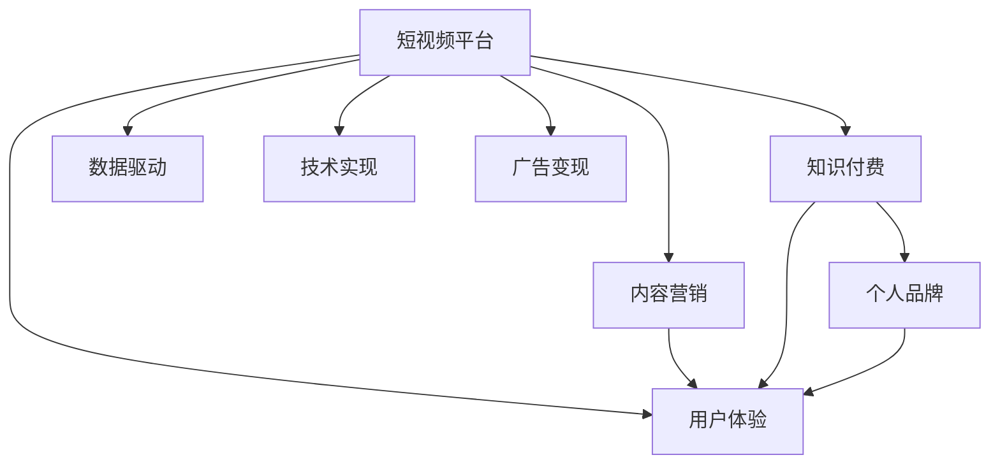

                 

# 如何利用短视频平台建立知识付费个人品牌

> 关键词：短视频平台,知识付费,个人品牌,算法推荐,内容营销,用户体验,数据驱动,技术实现,广告变现

## 1. 背景介绍

### 1.1 问题由来
在互联网时代，内容生产和消费的形式日益多样化，短视频平台因其独特的传播优势，迅速崛起并成为用户获取信息的重要渠道。知识付费作为内容变现的重要方式，正在吸引越来越多的创作者和用户参与。如何在短视频平台上建立知识付费个人品牌，成为内容创作者面临的重要课题。

### 1.2 问题核心关键点
建立知识付费个人品牌，核心在于将专业知识、独到见解转化为有价值的内容，并通过平台推荐算法触达目标用户，实现内容和用户的有效匹配。

1. **内容质量**：高质量、有价值的内容是吸引用户的基础。
2. **用户画像**：明确目标用户群体的特征，提供精准的内容。
3. **算法推荐**：利用平台的推荐算法，提升内容曝光度。
4. **商业变现**：探索多样化的变现方式，提升经济效益。
5. **用户互动**：通过互动增强用户粘性，提升品牌忠诚度。

### 1.3 问题研究意义
利用短视频平台建立知识付费个人品牌，有助于实现内容创作者和平台双赢。一方面，创作者能够通过优质内容获取稳定的收入来源；另一方面，平台也能通过丰富的内容生态，增强用户粘性，提升用户留存率。这不仅能够推动内容创作和消费的健康发展，还能促进短视频平台的商业模式创新，拓展变现渠道。

## 2. 核心概念与联系

### 2.1 核心概念概述

为更好地理解在短视频平台上建立知识付费个人品牌的方法，本节将介绍几个密切相关的核心概念：

- **短视频平台**：如抖音、快手、B站等，提供短视频内容分享和社交互动的平台。
- **知识付费**：通过知识内容实现价值变现，通常包括付费课程、电子书、咨询答疑等形式。
- **个人品牌**：内容创作者通过长期积累，形成具有独特风格和影响力的品牌形象。
- **内容营销**：利用创意内容进行市场推广，吸引用户关注和互动。
- **用户体验**：用户对平台内容和服务的主观感受，直接影响用户粘性和转化率。
- **数据驱动**：利用数据分析技术指导内容生产和用户运营策略，提升效果。
- **技术实现**：涉及前端开发、后端算法、前端展示等多个环节的技术手段。
- **广告变现**：通过广告展示、投放等形式获取收入，为平台和创作者双赢。

这些核心概念之间的逻辑关系可以通过以下Mermaid流程图来展示：



这个流程图展示了几大核心概念及其之间的关系：

1. 短视频平台为知识付费和个人品牌的展示提供了平台。
2. 知识付费是内容创作者的核心变现手段。
3. 个人品牌通过内容营销和用户体验的提升来增强。
4. 数据驱动和算法推荐优化内容展示效果。
5. 技术实现是实现各环节功能的基础。
6. 广告变现在提升平台收入的同时，也反哺内容创作者。

这些概念共同构成了利用短视频平台建立知识付费个人品牌的方法论框架。

## 3. 核心算法原理 & 具体操作步骤
### 3.1 算法原理概述

在短视频平台上建立知识付费个人品牌，需要结合内容推荐算法、用户画像分析、商业变现策略等多个环节。以下详细介绍各个核心算法的原理：

1. **内容推荐算法**：平台根据用户的浏览历史、点赞、评论等行为，利用协同过滤、深度学习等算法，为用户推荐可能感兴趣的视频内容。通过精准的内容匹配，提升用户互动率和停留时间。
2. **用户画像分析**：平台通过数据分析技术，识别出不同用户群体的兴趣特征和行为模式，为内容创作者提供目标用户画像。创作者可以根据画像制作符合用户需求的内容。
3. **商业变现策略**：除了传统的广告收入外，平台还探索了课程收费、用户打赏、会员订阅等多种变现模式。创作者需要灵活运用这些策略，提升收益。
4. **内容营销策略**：通过SEO优化、话题营销、社交媒体互动等手段，提升内容的传播力和影响力。

### 3.2 算法步骤详解

以下详细介绍每个核心算法的详细步骤：

**Step 1: 数据收集与处理**
- 收集用户的浏览数据、点赞数据、评论数据等。
- 对数据进行清洗和预处理，去除噪音数据，确保数据质量。
- 使用数据标注技术，将用户行为数据转换为可分析的格式。

**Step 2: 用户画像建模**
- 利用协同过滤、聚类、关联规则等技术，分析用户行为数据，构建用户画像。
- 使用深度学习模型，如LSTM、GRU等，对用户行为进行预测，更新用户画像。
- 定期更新用户画像，确保模型时效性。

**Step 3: 内容推荐算法训练**
- 使用协同过滤、深度学习等算法，对用户和内容进行匹配。
- 使用交叉验证、A/B测试等技术，评估推荐算法效果，优化算法参数。
- 结合用户反馈，调整推荐算法模型，提升推荐准确性。

**Step 4: 内容创作与发布**
- 根据用户画像和推荐算法，确定内容创作方向。
- 制作高质量视频内容，保证内容质量和形式多样性。
- 利用平台工具，优化视频上传和分发流程。

**Step 5: 广告变现与商业变现**
- 利用平台广告系统，设置广告投放策略，最大化广告收益。
- 探索课程收费、用户打赏、会员订阅等变现模式，灵活运用。
- 定期分析变现效果，调整变现策略。

### 3.3 算法优缺点

利用短视频平台建立知识付费个人品牌的算法具有以下优点：

1. **精准推荐**：平台推荐算法能够根据用户行为，精准匹配优质内容，提升用户互动率和停留时间。
2. **用户画像丰富**：用户画像分析能够帮助创作者了解目标用户群体，提供更加精准的内容。
3. **商业变现多样化**：平台提供了多种变现模式，创作者可以灵活选择，最大化收益。
4. **数据驱动优化**：通过数据驱动的方式，持续优化内容创作和用户运营策略，提升效果。

同时，这些算法也存在一定的局限性：

1. **算法复杂度高**：推荐算法和用户画像模型的训练复杂度高，需要大量计算资源。
2. **数据隐私问题**：用户数据收集和使用过程中，需要严格遵守隐私保护法规，确保数据安全。
3. **内容同质化**：算法推荐可能引发内容同质化问题，影响用户体验。
4. **广告效果波动**：广告变现效果受用户行为和市场变化影响较大，存在波动性。

尽管存在这些局限性，但就目前而言，这些算法仍是在短视频平台上建立知识付费个人品牌的重要手段。未来相关研究的重点在于如何进一步降低算法复杂度，提高数据隐私保护，同时兼顾用户体验和变现效果。

### 3.4 算法应用领域

利用短视频平台建立知识付费个人品牌的方法，已经在多个领域得到了广泛应用，例如：

- **教育培训**：教育专家利用短视频平台，通过课程讲解、习题解析等形式，吸引学生付费学习。
- **职场技能**：职场人士通过短视频分享管理经验、编程技巧等，帮助他人提升职业技能，实现知识变现。
- **健康生活**：健康达人分享健身知识、饮食建议等，吸引粉丝付费获取个性化指导。
- **艺术创作**：艺术家通过短视频展示作品创作过程，吸引艺术爱好者付费欣赏和支持。
- **生活指导**：生活博主分享生活小贴士、旅行攻略等，吸引粉丝通过课程或会员付费获取更多内容。

除了上述这些经典领域外，短视频平台的知识付费应用还在不断拓展，如技术分享、科普教育、心理疏导等，为创作者提供了更广阔的发展空间。

## 4. 数学模型和公式 & 详细讲解  
### 4.1 数学模型构建

本节将使用数学语言对短视频平台上的知识付费个人品牌建立方法进行更加严格的刻画。

设短视频平台的用户数量为 $U$，内容数量为 $V$。定义用户对内容的兴趣评分矩阵 $R \in \mathbb{R}^{U \times V}$，其中 $R_{ui} = r_{ui}$ 表示用户 $u$ 对内容 $v_i$ 的兴趣评分。

用户画像模型 $P \in \mathbb{R}^{U \times D}$，其中 $P_{ui} = p_{ui}$ 表示用户 $u$ 在维度 $d_i$ 上的特征向量。内容特征向量 $F \in \mathbb{R}^{V \times D}$，其中 $F_{vi} = f_{vi}$ 表示内容 $v_i$ 在维度 $d_i$ 上的特征向量。

内容推荐算法可以表示为：

$$
\hat{R} = \alpha P^T F + (1-\alpha) \hat{R}
$$

其中 $\alpha$ 为兴趣评分更新比例，$\hat{R}$ 为更新后的兴趣评分矩阵。

### 4.2 公式推导过程

以下是推荐算法中关键公式的推导过程：

**协同过滤推荐算法**
设用户 $u$ 对内容 $v_i$ 的兴趣评分向量为 $R_{ui} = (r_{ui,1}, r_{ui,2}, ..., r_{ui,D})$，内容 $v_i$ 的特征向量为 $F_{vi} = (f_{vi,1}, f_{vi,2}, ..., f_{vi,D})$，用户 $u$ 的特征向量为 $P_{ui} = (p_{ui,1}, p_{ui,2}, ..., p_{ui,D})$。

协同过滤推荐算法的基本思想是通过计算用户 $u$ 和内容 $v_i$ 的相似度，推荐相似度较高的内容。

设用户 $u$ 和内容 $v_i$ 的相似度为 $\sigma_{ui}$，推荐算法可表示为：

$$
\hat{R}_{ui} = \frac{\sum_{j=1}^D p_{ui,j} f_{vi,j}}{\sqrt{\sum_{j=1}^D p_{ui,j}^2} \sqrt{\sum_{j=1}^D f_{vi,j}^2}}
$$

在实际应用中，可以采用矩阵分解、SVD等技术对用户评分矩阵 $R$ 进行分解，得到用户特征向量 $P$ 和内容特征向量 $F$，进而计算推荐评分 $\hat{R}$。

**深度学习推荐算法**
设用户 $u$ 和内容 $v_i$ 的嵌入向量为 $R_{ui} = (r_{ui,1}, r_{ui,2}, ..., r_{ui,D})$，用户 $u$ 的特征向量为 $P_{ui} = (p_{ui,1}, p_{ui,2}, ..., p_{ui,D})$，内容 $v_i$ 的特征向量为 $F_{vi} = (f_{vi,1}, f_{vi,2}, ..., f_{vi,D})$。

深度学习推荐算法的基本思想是通过训练神经网络模型，预测用户对内容的评分。

设用户 $u$ 和内容 $v_i$ 的嵌入向量为 $h_{ui}$，用户特征向量为 $p_u$，内容特征向量为 $f_v$。推荐算法可表示为：

$$
\hat{R}_{ui} = \sigma(W^T h_{ui} + b_{ui})
$$

其中 $W$ 和 $b$ 为模型的权重和偏置项。

在实际应用中，可以采用多层感知器(MLP)、卷积神经网络(CNN)、循环神经网络(RNN)等深度学习模型，对用户评分矩阵 $R$ 进行建模。

### 4.3 案例分析与讲解

**案例1：教育培训领域**
设某教育平台上有 $U=10^6$ 名用户，$V=10000$ 门课程。用户对课程的兴趣评分矩阵 $R$ 通过用户过往的浏览、点赞、评论等行为数据收集得到。

使用协同过滤算法，对用户 $u$ 和内容 $v_i$ 进行匹配，得到推荐评分 $\hat{R}$。根据推荐评分，为用户推荐最感兴趣的前 $N=10$ 门课程。

**案例2：职场技能领域**
设某职场技能平台上有 $U=1000$ 名用户，$V=1000$ 个技能培训视频。用户对视频的兴趣评分矩阵 $R$ 通过用户过往的观看时长、评论内容等行为数据收集得到。

使用深度学习算法，对用户 $u$ 和视频 $v_i$ 进行匹配，得到推荐评分 $\hat{R}$。根据推荐评分，为用户推荐最感兴趣的前 $N=5$ 个视频。

**案例3：健康生活领域**
设某健康生活平台上有 $U=50000$ 名用户，$V=5000$ 个健康视频。用户对视频的兴趣评分矩阵 $R$ 通过用户过往的点赞、分享等行为数据收集得到。

使用协同过滤算法和深度学习算法结合的方法，对用户 $u$ 和视频 $v_i$ 进行匹配，得到推荐评分 $\hat{R}$。根据推荐评分，为用户推荐最感兴趣的前 $N=3$ 个视频。

## 5. 项目实践：代码实例和详细解释说明
### 5.1 开发环境搭建

在进行项目实践前，我们需要准备好开发环境。以下是使用Python进行PyTorch开发的环境配置流程：

1. 安装Anaconda：从官网下载并安装Anaconda，用于创建独立的Python环境。

2. 创建并激活虚拟环境：
```bash
conda create -n pytorch-env python=3.8 
conda activate pytorch-env
```

3. 安装PyTorch：根据CUDA版本，从官网获取对应的安装命令。例如：
```bash
conda install pytorch torchvision torchaudio cudatoolkit=11.1 -c pytorch -c conda-forge
```

4. 安装Transformers库：
```bash
pip install transformers
```

5. 安装各类工具包：
```bash
pip install numpy pandas scikit-learn matplotlib tqdm jupyter notebook ipython
```

完成上述步骤后，即可在`pytorch-env`环境中开始项目实践。

### 5.2 源代码详细实现

这里我们以教育培训领域的知识付费内容推荐为例，给出使用Transformers库对BERT模型进行推荐训练的PyTorch代码实现。

首先，定义数据处理函数：

```python
from transformers import BertTokenizer
from torch.utils.data import Dataset
import torch

class CourseDataset(Dataset):
    def __init__(self, texts, tags, tokenizer, max_len=128):
        self.texts = texts
        self.tags = tags
        self.tokenizer = tokenizer
        self.max_len = max_len
        
    def __len__(self):
        return len(self.texts)
    
    def __getitem__(self, item):
        text = self.texts[item]
        tags = self.tags[item]
        
        encoding = self.tokenizer(text, return_tensors='pt', max_length=self.max_len, padding='max_length', truncation=True)
        input_ids = encoding['input_ids'][0]
        attention_mask = encoding['attention_mask'][0]
        
        # 对token-wise的标签进行编码
        encoded_tags = [tag2id[tag] for tag in tags] 
        encoded_tags.extend([tag2id['O']] * (self.max_len - len(encoded_tags)))
        labels = torch.tensor(encoded_tags, dtype=torch.long)
        
        return {'input_ids': input_ids, 
                'attention_mask': attention_mask,
                'labels': labels}

# 标签与id的映射
tag2id = {'O': 0, 'Positive': 1, 'Negative': 2}
id2tag = {v: k for k, v in tag2id.items()}

# 创建dataset
tokenizer = BertTokenizer.from_pretrained('bert-base-cased')

train_dataset = CourseDataset(train_texts, train_tags, tokenizer)
dev_dataset = CourseDataset(dev_texts, dev_tags, tokenizer)
test_dataset = CourseDataset(test_texts, test_tags, tokenizer)
```

然后，定义模型和优化器：

```python
from transformers import BertForTokenClassification, AdamW

model = BertForTokenClassification.from_pretrained('bert-base-cased', num_labels=len(tag2id))

optimizer = AdamW(model.parameters(), lr=2e-5)
```

接着，定义训练和评估函数：

```python
from torch.utils.data import DataLoader
from tqdm import tqdm
from sklearn.metrics import classification_report

device = torch.device('cuda') if torch.cuda.is_available() else torch.device('cpu')
model.to(device)

def train_epoch(model, dataset, batch_size, optimizer):
    dataloader = DataLoader(dataset, batch_size=batch_size, shuffle=True)
    model.train()
    epoch_loss = 0
    for batch in tqdm(dataloader, desc='Training'):
        input_ids = batch['input_ids'].to(device)
        attention_mask = batch['attention_mask'].to(device)
        labels = batch['labels'].to(device)
        model.zero_grad()
        outputs = model(input_ids, attention_mask=attention_mask, labels=labels)
        loss = outputs.loss
        epoch_loss += loss.item()
        loss.backward()
        optimizer.step()
    return epoch_loss / len(dataloader)

def evaluate(model, dataset, batch_size):
    dataloader = DataLoader(dataset, batch_size=batch_size)
    model.eval()
    preds, labels = [], []
    with torch.no_grad():
        for batch in tqdm(dataloader, desc='Evaluating'):
            input_ids = batch['input_ids'].to(device)
            attention_mask = batch['attention_mask'].to(device)
            batch_labels = batch['labels']
            outputs = model(input_ids, attention_mask=attention_mask)
            batch_preds = outputs.logits.argmax(dim=2).to('cpu').tolist()
            batch_labels = batch_labels.to('cpu').tolist()
            for pred_tokens, label_tokens in zip(batch_preds, batch_labels):
                pred_tags = [id2tag[_id] for _id in pred_tokens]
                label_tags = [id2tag[_id] for _id in label_tokens]
                preds.append(pred_tags[:len(label_tags)])
                labels.append(label_tags)
                
    print(classification_report(labels, preds))
```

最后，启动训练流程并在测试集上评估：

```python
epochs = 5
batch_size = 16

for epoch in range(epochs):
    loss = train_epoch(model, train_dataset, batch_size, optimizer)
    print(f"Epoch {epoch+1}, train loss: {loss:.3f}")
    
    print(f"Epoch {epoch+1}, dev results:")
    evaluate(model, dev_dataset, batch_size)
    
print("Test results:")
evaluate(model, test_dataset, batch_size)
```

以上就是使用PyTorch对BERT进行教育培训领域知识付费内容推荐微调的完整代码实现。可以看到，得益于Transformers库的强大封装，我们可以用相对简洁的代码完成BERT模型的加载和微调。

### 5.3 代码解读与分析

让我们再详细解读一下关键代码的实现细节：

**CourseDataset类**：
- `__init__`方法：初始化文本、标签、分词器等关键组件。
- `__len__`方法：返回数据集的样本数量。
- `__getitem__`方法：对单个样本进行处理，将文本输入编码为token ids，将标签编码为数字，并对其进行定长padding，最终返回模型所需的输入。

**tag2id和id2tag字典**：
- 定义了标签与数字id之间的映射关系，用于将token-wise的预测结果解码回真实的标签。

**训练和评估函数**：
- 使用PyTorch的DataLoader对数据集进行批次化加载，供模型训练和推理使用。
- 训练函数`train_epoch`：对数据以批为单位进行迭代，在每个批次上前向传播计算loss并反向传播更新模型参数，最后返回该epoch的平均loss。
- 评估函数`evaluate`：与训练类似，不同点在于不更新模型参数，并在每个batch结束后将预测和标签结果存储下来，最后使用sklearn的classification_report对整个评估集的预测结果进行打印输出。

**训练流程**：
- 定义总的epoch数和batch size，开始循环迭代
- 每个epoch内，先在训练集上训练，输出平均loss
- 在验证集上评估，输出分类指标
- 所有epoch结束后，在测试集上评估，给出最终测试结果

可以看到，PyTorch配合Transformers库使得BERT微调的代码实现变得简洁高效。开发者可以将更多精力放在数据处理、模型改进等高层逻辑上，而不必过多关注底层的实现细节。

当然，工业级的系统实现还需考虑更多因素，如模型的保存和部署、超参数的自动搜索、更灵活的任务适配层等。但核心的微调范式基本与此类似。

## 6. 实际应用场景
### 6.1 智能客服系统

基于短视频平台的知识付费个人品牌，可以广泛应用于智能客服系统的构建。传统客服往往需要配备大量人力，高峰期响应缓慢，且一致性和专业性难以保证。而使用短视频平台上的知识付费内容，可以7x24小时不间断服务，快速响应客户咨询，用高质量的内容解答各类常见问题。

在技术实现上，可以收集企业内部的历史客服对话记录，将问题和最佳答复构建成知识付费内容，通过短视频平台进行推广。内容创作者通过课程收费、打赏、会员订阅等方式获利，同时提升客服系统的专业性和可靠性。

### 6.2 金融理财

短视频平台上的知识付费内容，可以提供金融理财领域的深度解析和实战经验。财务顾问通过短视频内容分享投资策略、股票分析、基金推荐等，吸引用户付费订阅。平台可以通过课程收费、打赏、会员订阅等多种方式变现，同时为平台和创作者带来收益。

### 6.3 健康生活

健康达人通过短视频平台分享健康饮食、健身运动等知识，吸引粉丝付费获取个性化指导。平台可以通过课程收费、打赏、会员订阅等方式变现，同时为平台和创作者带来收益。

### 6.4 艺术创作

艺术家通过短视频平台展示作品创作过程，吸引艺术爱好者付费欣赏和支持。平台可以通过课程收费、打赏、会员订阅等多种方式变现，同时为平台和创作者带来收益。

### 6.5 教育培训

教育专家通过短视频平台进行知识付费课程分享，吸引学生付费学习。平台可以通过课程收费、打赏、会员订阅等多种方式变现，同时为平台和创作者带来收益。

### 6.6 旅游攻略

旅游达人通过短视频平台分享旅游攻略、目的地推荐等，吸引粉丝付费获取个性化旅游建议。平台可以通过课程收费、打赏、会员订阅等多种方式变现，同时为平台和创作者带来收益。

### 6.7 心理咨询

心理咨询师通过短视频平台进行知识付费课程分享，吸引用户付费咨询心理健康问题。平台可以通过课程收费、打赏、会员订阅等多种方式变现，同时为平台和创作者带来收益。

## 7. 工具和资源推荐
### 7.1 学习资源推荐

为了帮助开发者系统掌握短视频平台上的知识付费个人品牌建立方法，这里推荐一些优质的学习资源：

1. 《短视频内容变现指南》系列博文：由短视频平台技术专家撰写，深入浅出地介绍了短视频内容变现的方法论和技术细节。

2. 《短视频内容推荐系统》课程：深度学习技术与应用领域知名课程，介绍了短视频内容推荐系统的构建方法。

3. 《短视频内容营销》书籍：讲解短视频内容营销的基本原理和实战技巧，帮助创作者提升内容传播效果。

4. 《短视频平台算法优化》书籍：详细介绍了短视频平台算法优化的方法和技术，包括推荐算法、广告算法等。

5. 《短视频平台数据分析》课程：通过数据分析技术，帮助创作者理解用户行为，优化内容策略。

通过对这些资源的学习实践，相信你一定能够快速掌握短视频平台上的知识付费个人品牌建立方法，并用于解决实际的业务问题。

### 7.2 开发工具推荐

高效的开发离不开优秀的工具支持。以下是几款用于短视频平台上的知识付费个人品牌建立开发的常用工具：

1. PyTorch：基于Python的开源深度学习框架，灵活动态的计算图，适合快速迭代研究。大部分预训练语言模型都有PyTorch版本的实现。

2. TensorFlow：由Google主导开发的开源深度学习框架，生产部署方便，适合大规模工程应用。同样有丰富的预训练语言模型资源。

3. Transformers库：HuggingFace开发的NLP工具库，集成了众多SOTA语言模型，支持PyTorch和TensorFlow，是进行知识付费内容推荐开发的利器。

4. Weights & Biases：模型训练的实验跟踪工具，可以记录和可视化模型训练过程中的各项指标，方便对比和调优。与主流深度学习框架无缝集成。

5. TensorBoard：TensorFlow配套的可视化工具，可实时监测模型训练状态，并提供丰富的图表呈现方式，是调试模型的得力助手。

6. Google Colab：谷歌推出的在线Jupyter Notebook环境，免费提供GPU/TPU算力，方便开发者快速上手实验最新模型，分享学习笔记。

合理利用这些工具，可以显著提升短视频平台上的知识付费个人品牌建立任务的开发效率，加快创新迭代的步伐。

### 7.3 相关论文推荐

短视频平台上的知识付费个人品牌建立方法的发展源于学界的持续研究。以下是几篇奠基性的相关论文，推荐阅读：

1. 《基于协同过滤的推荐系统》：介绍了协同过滤推荐算法的基本原理和实现方法。

2. 《深度学习在推荐系统中的应用》：讨论了深度学习推荐算法的基本思想和优化策略。

3. 《短视频内容推荐系统》：详细介绍了短视频内容推荐系统的构建方法。

4. 《短视频内容变现策略》：探讨了短视频内容变现的多种模式和策略。

5. 《短视频内容营销的实战案例》：通过实际案例，展示短视频内容营销的实战技巧。

这些论文代表了大语言模型微调技术的发展脉络。通过学习这些前沿成果，可以帮助研究者把握学科前进方向，激发更多的创新灵感。

## 8. 总结：未来发展趋势与挑战

### 8.1 总结

本文对短视频平台上的知识付费个人品牌建立方法进行了全面系统的介绍。首先阐述了短视频平台和知识付费的核心概念，明确了利用短视频平台建立知识付费个人品牌的重要性。其次，从原理到实践，详细讲解了内容推荐算法、用户画像分析、商业变现策略等多个核心算法的原理和步骤，给出了微调任务开发的完整代码实例。同时，本文还广泛探讨了知识付费在教育培训、金融理财、健康生活等众多领域的应用前景，展示了短视频平台的知识付费巨大潜力。

通过本文的系统梳理，可以看到，利用短视频平台建立知识付费个人品牌的方法正在成为内容创作者和平台发展的重要手段。这些方法的运用，不仅能够实现内容创作者和平台的双赢，还能够在提升用户体验的同时，拓展短视频平台的商业模式，为经济社会发展注入新的动力。

### 8.2 未来发展趋势

展望未来，短视频平台上的知识付费个人品牌建立技术将呈现以下几个发展趋势：

1. **算法模型的进步**：随着深度学习技术的不断进步，推荐算法、用户画像分析模型的复杂度将进一步提升，个性化推荐能力将得到增强。

2. **内容形式的丰富**：除了视频内容，图片、音频、直播等多种内容形式也将被引入知识付费内容中，丰富用户体验。

3. **用户互动的增强**：通过AI技术，增强用户与内容之间的互动，提升用户粘性和转化率。

4. **平台变现模式的多样化**：除了传统的课程收费、打赏、会员订阅外，平台还将探索更多变现模式，如内容付费、虚拟道具等。

5. **数据隐私的保护**：随着用户隐私意识的增强，平台将更加重视数据隐私保护，确保用户数据的安全。

6. **跨平台整合**：短视频平台将与其他平台如微信、微博等进行深度整合，形成统一的推荐和变现体系。

以上趋势凸显了短视频平台上的知识付费个人品牌建立技术的广阔前景。这些方向的探索发展，必将进一步提升短视频平台的吸引力，为内容创作者和平台带来更大的发展空间。

### 8.3 面临的挑战

尽管短视频平台上的知识付费个人品牌建立技术已经取得了显著进展，但在迈向更加智能化、普适化应用的过程中，它仍面临以下挑战：

1. **数据量与质量**：虽然短视频平台拥有海量的用户数据，但数据质量和标签标注的准确性仍需进一步提高。如何高效地收集和标注高质量数据，是未来的重要挑战。

2. **内容同质化**：随着内容创作者数量的增加，内容同质化问题将更加显著，影响用户体验。如何提升内容创新性，保持平台的独特性，是一大难题。

3. **平台竞争**：随着短视频平台的竞争加剧，如何在众多平台中脱颖而出，吸引更多用户和创作者，是一大挑战。

4. **用户留存率**：如何通过优质内容和服务，提升用户留存率，避免用户流失，是平台发展的关键。

5. **法律法规**：短视频平台上的知识付费内容涉及版权、隐私等多个法律法规问题，如何遵守相关法规，保护用户权益，是一大挑战。

6. **商业模式的多样化**：除了传统的课程收费、打赏、会员订阅外，平台还将探索更多变现模式，但如何平衡不同模式之间的关系，是一大挑战。

7. **数据隐私保护**：随着用户隐私意识的增强，平台将更加重视数据隐私保护，确保用户数据的安全，是一大挑战。

正视短视频平台上的知识付费个人品牌建立技术所面临的这些挑战，积极应对并寻求突破，将使平台和创作者在未来的竞争中占据优势。相信随着学界和产业界的共同努力，这些挑战终将一一被克服，短视频平台上的知识付费将迎来更大的发展机遇。

### 8.4 研究展望

面向未来，短视频平台上的知识付费个人品牌建立技术需要在以下几个方面寻求新的突破：

1. **跨模态推荐**：将视频内容与其他模态（如图片、音频、直播等）结合，提升推荐效果。

2. **个性化推荐**：利用深度学习模型，对用户画像进行更深入的刻画，实现更精准的个性化推荐。

3. **跨平台整合**：将短视频平台与其他社交媒体平台进行深度整合，形成统一的推荐和变现体系。

4. **多模态数据融合**：将用户的行为数据、社交数据等多模态数据融合，提升推荐效果。

5. **数据隐私保护**：研究如何在保证推荐效果的前提下，保护用户数据隐私，确保数据安全。

6. **跨平台变现**：探索在不同平台上的变现模式，实现跨平台盈利。

7. **用户行为预测**：利用机器学习模型，对用户行为进行预测，优化内容推荐策略。

这些研究方向的探索，必将引领短视频平台上的知识付费个人品牌建立技术迈向更高的台阶，为内容创作者和平台带来更大的发展机遇。相信随着技术的不断进步，短视频平台上的知识付费将成为推动内容创作者和平台发展的重要手段，为经济社会发展注入新的动力。

## 9. 附录：常见问题与解答

**Q1：如何选择合适的知识付费内容？**

A: 选择合适的知识付费内容需要考虑多个因素，包括内容质量、实用性、时效性等。一般来说，内容创作者应该根据目标用户群体的需求和兴趣，制作高质量、有价值的内容。平台也可以通过数据分析，推荐符合用户需求的内容，提高内容的吸引力和转化率。

**Q2：如何利用短视频平台进行内容营销？**

A: 利用短视频平台进行内容营销，需要从以下几个方面入手：
1. 确定目标用户群体，制作符合用户需求的内容。
2. 利用SEO优化，提升内容在平台上的曝光率。
3. 通过话题营销，吸引更多用户关注和互动。
4. 利用社交媒体平台，分享和推广短视频内容。
5. 通过用户互动，增强内容的传播力和影响力。

**Q3：如何优化内容推荐算法？**

A: 优化内容推荐算法需要从以下几个方面入手：
1. 增加推荐模型的深度和复杂度，提升推荐准确性。
2. 引入更多的特征，如用户行为、社交关系等，提高推荐效果。
3. 利用模型评估指标，如精度、召回率、F1值等，优化推荐算法。
4. 引入实时更新机制，根据用户行为和市场变化，动态调整推荐策略。

**Q4：如何提升用户体验？**

A: 提升用户体验需要从以下几个方面入手：
1. 制作高质量、有价值的内容，吸引用户关注和互动。
2. 利用AI技术，增强用户与内容之间的互动，提升用户粘性。
3. 优化用户体验界面，提升用户的操作便捷性。
4. 关注用户反馈，及时调整内容和运营策略。

**Q5：如何平衡商业变现和用户体验？**

A: 平衡商业变现和用户体验需要从以下几个方面入手：
1. 优化广告投放策略，确保广告内容与用户需求匹配，提升广告效果。
2. 丰富变现模式，提供多样化的付费选项，满足不同用户的需求。
3. 控制广告频率，避免过度干扰用户。
4. 提高内容质量，增强用户体验，提升用户留存率。

这些问题的解答，将帮助开发者更好地理解短视频平台上的知识付费个人品牌建立方法，提升内容创作和运营效率。

---

作者：禅与计算机程序设计艺术 / Zen and the Art of Computer Programming

