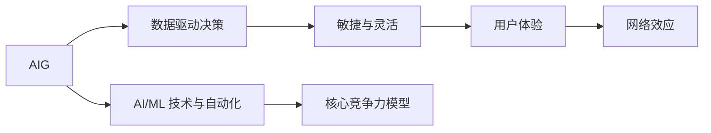

                 

## 1. 背景介绍

在快速变化的数字化时代，自动化创业正成为新的经济增长点。自动化技术不仅能够提高生产效率，还能优化资源配置，降低运营成本。然而，仅靠技术和工具的堆砌并不能实现持久的竞争优势，在自动化创业中建立核心竞争力才是关键。本文将从核心概念与联系、算法原理与操作步骤、实际应用场景等角度，深入探讨如何在自动化创业中建立核心竞争力。

## 2. 核心概念与联系

### 2.1 核心概念概述

自动化创业的核心在于利用先进的技术手段，通过智能化、自动化的方法解决特定业务问题，提升业务效率和竞争力。以下是我们认为在自动化创业中建立核心竞争力需要关注的几个核心概念：

- **AI/ML 技术与自动化**：将人工智能和机器学习技术应用到自动化过程中，以实现更高效、更精确的自动化解决方案。
- **数据驱动决策**：通过收集和分析数据，做出基于数据的决策，优化业务流程。
- **敏捷与灵活**：快速响应市场变化，灵活调整业务策略和自动化方案。
- **用户体验**：注重自动化解决方案的用户体验，提升用户满意度和粘性。
- **网络效应**：通过自动化系统建立网络效应，吸引更多的用户和合作伙伴，形成正反馈循环。

这些核心概念相互关联，共同构成了自动化创业的核心竞争力模型。

### 2.2 核心概念原理和架构的 Mermaid 流程图



以上图表展示了核心概念之间的关系。自动化创业的关键在于将AI/ML技术与自动化相结合，利用数据驱动决策，保持敏捷与灵活，注重用户体验，并通过网络效应形成竞争优势。

## 3. 核心算法原理 & 具体操作步骤

### 3.1 算法原理概述

在自动化创业中，核心算法原理主要围绕以下几个方面展开：

- **数据预处理与特征工程**：清洗和处理原始数据，提取有价值的特征，构建模型输入。
- **模型选择与训练**：选择合适的AI/ML模型，并使用训练数据对其进行训练，优化模型参数。
- **部署与集成**：将训练好的模型部署到实际业务环境中，并与业务系统进行集成，实现自动化流程。
- **监控与优化**：监控自动化系统的性能，根据反馈数据对模型和流程进行持续优化。

### 3.2 算法步骤详解

#### 3.2.1 数据预处理与特征工程

1. **数据清洗**：去除噪声、缺失值等无效数据，确保数据的质量。
2. **数据标准化**：对数据进行归一化、标准化等处理，确保模型输入的一致性。
3. **特征提取**：通过统计、嵌入式等方法，提取对业务问题有影响的特征。
4. **特征选择**：根据领域知识和模型性能，选择对预测目标有帮助的特征。

#### 3.2.2 模型选择与训练

1. **模型选择**：根据业务问题和数据特点，选择合适的AI/ML模型。如回归模型、分类模型、聚类模型等。
2. **模型训练**：使用训练数据对模型进行训练，调整模型参数，优化模型性能。
3. **模型评估**：使用测试数据对模型进行评估，确保模型泛化性能。

#### 3.2.3 部署与集成

1. **模型部署**：将训练好的模型部署到生产环境中，使用适当的API或SDK进行调用。
2. **系统集成**：将自动化模型与业务系统进行集成，实现业务流程的自动化。
3. **用户界面设计**：设计友好的用户界面，提供良好的用户体验。

#### 3.2.4 监控与优化

1. **性能监控**：实时监控自动化系统的性能指标，如准确率、召回率等。
2. **异常检测**：及时发现并处理系统异常，避免业务中断。
3. **持续优化**：根据监控数据和用户反馈，对模型和流程进行持续优化，提高自动化系统的稳定性和性能。

### 3.3 算法优缺点

#### 3.3.1 优点

1. **效率提升**：通过自动化技术，可以大幅提升业务效率，降低运营成本。
2. **决策科学化**：基于数据驱动的决策过程，使业务决策更科学、更准确。
3. **灵活性高**：自动化系统可以根据业务需求快速调整，适应市场变化。
4. **用户体验优化**：提供更优质的用户服务，提升用户满意度和粘性。
5. **网络效应增强**：通过自动化系统吸引更多用户和合作伙伴，形成良性循环。

#### 3.3.2 缺点

1. **初始投入大**：建设自动化系统需要较大的前期投入，包括硬件、软件、人力等。
2. **技术复杂度高**：自动化系统的构建和维护需要较高的技术水平，对团队能力要求高。
3. **数据隐私和安全问题**：自动化系统处理大量敏感数据，需注意数据隐私和安全问题。
4. **模型鲁棒性要求高**：模型需具备较高的鲁棒性，以应对各种异常情况。
5. **用户接受度问题**：用户对自动化系统的接受度可能影响其推广效果。

### 3.4 算法应用领域

自动化技术在多个领域具有广泛的应用前景：

- **金融科技**：自动化交易、风险管理、客户服务自动化等。
- **医疗健康**：电子病历处理、患者管理、药物研发等。
- **制造业**：智能制造、供应链优化、质量检测等。
- **零售电商**：客户推荐、库存管理、物流优化等。
- **人力资源**：招聘筛选、员工培训、绩效评估等。

## 4. 数学模型和公式 & 详细讲解 & 举例说明

### 4.1 数学模型构建

在自动化创业中，数学模型构建主要涉及以下几个方面：

- **回归模型**：用于预测连续数值，如股票价格预测。
- **分类模型**：用于分类离散变量，如信用风险分类。
- **聚类模型**：用于无监督数据分组，如客户分群。

### 4.2 公式推导过程

以回归模型为例，其基本公式为：

$$ y = \beta_0 + \beta_1 x_1 + \beta_2 x_2 + \ldots + \beta_n x_n + \epsilon $$

其中，$y$为预测目标，$\beta_0$为截距，$\beta_i$为第$i$个特征的系数，$x_i$为第$i$个特征，$\epsilon$为随机误差项。

### 4.3 案例分析与讲解

假设我们想预测一个客户是否会购买某产品，可以构建一个逻辑回归模型，公式如下：

$$ \ln \left( \frac{P(y=1)}{P(y=0)} \right) = \beta_0 + \beta_1 x_1 + \beta_2 x_2 + \ldots + \beta_n x_n $$

其中，$x_i$可以是客户的年龄、性别、收入等特征。通过训练模型，可以找到最优的$\beta$值，对新客户进行预测。

## 5. 项目实践：代码实例和详细解释说明

### 5.1 开发环境搭建

1. **环境安装**：安装Python、R、Jupyter Notebook等开发工具，并配置好依赖库。
2. **数据准备**：收集、整理业务数据，进行预处理和特征工程。
3. **环境搭建**：搭建开发环境，如本地服务器、虚拟机等。

### 5.2 源代码详细实现

#### 5.2.1 数据预处理

```python
import pandas as pd
from sklearn.preprocessing import StandardScaler

# 加载数据
data = pd.read_csv('data.csv')

# 数据清洗
data = data.dropna()

# 数据标准化
scaler = StandardScaler()
data = scaler.fit_transform(data)

# 特征选择
features = ['age', 'income', 'gender']
X = data[features]
y = data['purchase']
```

#### 5.2.2 模型训练

```python
from sklearn.linear_model import LogisticRegression

# 训练模型
model = LogisticRegression()
model.fit(X, y)
```

#### 5.2.3 部署与集成

```python
# 部署模型
def predict_purchase(age, income, gender):
    x = pd.DataFrame([age, income, gender], columns=['age', 'income', 'gender'])
    x = scaler.transform(x)
    pred = model.predict(x)
    return pred[0]
```

### 5.3 代码解读与分析

- **数据预处理**：使用Pandas进行数据加载和清洗，确保数据质量。使用StandardScaler进行数据标准化，确保特征的一致性。
- **模型训练**：使用Scikit-learn的LogisticRegression模型进行训练，调整模型参数，优化模型性能。
- **部署与集成**：设计API接口，将模型集成到业务系统中，供用户调用。

### 5.4 运行结果展示

```python
# 运行结果展示
print(predict_purchase(30, 5000, 'male'))
```

## 6. 实际应用场景

### 6.1 金融科技

在金融科技领域，自动化技术可以应用于风险评估、欺诈检测、自动化交易等。例如，利用自动化系统对客户信用进行评分，快速识别出高风险客户，防范金融风险。

### 6.2 医疗健康

在医疗健康领域，自动化技术可以应用于电子病历处理、患者管理、药物研发等。例如，利用自动化系统分析患者的健康数据，提供个性化的治疗方案。

### 6.3 制造业

在制造业领域，自动化技术可以应用于智能制造、供应链优化、质量检测等。例如，利用自动化系统优化生产流程，提升生产效率，降低成本。

### 6.4 零售电商

在零售电商领域，自动化技术可以应用于客户推荐、库存管理、物流优化等。例如，利用自动化系统分析客户行为数据，提供个性化的商品推荐。

## 7. 工具和资源推荐

### 7.1 学习资源推荐

1. **Coursera 课程**：提供机器学习和数据科学的课程，涵盖从基础到高级的内容。
2. **Kaggle 竞赛**：参加机器学习竞赛，提升实战能力。
3. **GitHub 开源项目**：参与和贡献开源项目，积累项目经验。

### 7.2 开发工具推荐

1. **Jupyter Notebook**：基于Web的交互式开发环境，支持Python、R等多种语言。
2. **AWS SageMaker**：提供云端机器学习服务，支持模型训练、部署和管理。
3. **TensorFlow**：谷歌开源的深度学习框架，支持分布式训练和模型部署。

### 7.3 相关论文推荐

1. **《Deep Learning》 by Ian Goodfellow**：深度学习领域的经典书籍，涵盖深度学习的理论基础和应用实践。
2. **《Hands-On Machine Learning with Scikit-Learn, Keras, and TensorFlow》 by Aurélien Géron**：介绍机器学习工具和实战案例的书籍。
3. **《Automatic Machine Learning: Methods, Systems, Challenges》 by Pedro Domingos**：探讨自动化机器学习的理论和实践。

## 8. 总结：未来发展趋势与挑战

### 8.1 研究成果总结

在自动化创业中，建立核心竞争力需要综合考虑技术、数据、业务等多方面的因素。本文介绍了数据驱动决策、敏捷与灵活、用户体验、网络效应等核心概念，并详细讲解了自动化创业中的核心算法原理与操作步骤。通过实际应用场景和工具资源推荐，为读者提供了全面的指导。

### 8.2 未来发展趋势

未来自动化创业将呈现以下几个发展趋势：

1. **AI/ML 技术的深入应用**：AI/ML技术将在更多领域得到应用，提升自动化系统的智能水平。
2. **跨领域融合**：自动化技术将与其他领域的技术进行深度融合，形成新的业务模式和创新点。
3. **自适应与个性化**：自动化系统将更加注重自适应和个性化，提供更贴合用户需求的解决方案。
4. **数据隐私与安全**：随着数据隐私法规的不断加强，自动化系统将更加注重数据安全与隐私保护。
5. **人机协作**：自动化系统将与人类协同工作，实现更高效、更精准的业务处理。

### 8.3 面临的挑战

尽管自动化创业具有巨大的潜力，但在实践中仍面临以下挑战：

1. **技术复杂性**：自动化系统的构建和维护需要较高的技术水平，团队需要具备多方面的技能。
2. **数据质量与隐私**：数据的准确性和隐私保护是自动化系统成功应用的关键，需要投入大量资源进行数据管理和安全防护。
3. **业务整合**：将自动化系统与现有业务系统进行有效整合，需要跨部门协调和项目管理能力。
4. **用户接受度**：自动化系统的推广和应用需要用户接受度，需要通过市场教育和用户体验设计提高用户黏性。
5. **持续优化**：自动化系统的持续优化和升级需要不断的技术投入和业务反馈。

### 8.4 研究展望

面对上述挑战，未来的研究需要在以下几个方面寻求突破：

1. **自动化技术提升**：研发更加高效、智能的自动化技术，降低技术复杂性。
2. **数据管理与安全**：建立数据治理体系，提升数据质量和隐私保护水平。
3. **业务协同设计**：通过系统设计实现业务整合，提升自动化系统的业务适应性。
4. **用户体验优化**：通过用户界面设计提升用户体验，提高用户接受度。
5. **持续优化机制**：建立自动化系统的持续优化机制，实现自我迭代和升级。

## 9. 附录：常见问题与解答

**Q1: 自动化创业的关键是什么？**

A: 自动化创业的关键在于构建核心竞争力，包括AI/ML技术与自动化、数据驱动决策、敏捷与灵活、用户体验、网络效应等方面。这些因素共同构成自动化创业的核心竞争力模型。

**Q2: 如何选择适合的自动化技术？**

A: 选择适合的自动化技术需要综合考虑业务需求、数据特点、技术可行性等因素。可以通过需求分析、技术调研、项目试点等方法，评估不同技术的适用性。

**Q3: 自动化创业中如何管理数据隐私？**

A: 数据隐私管理是自动化创业的重要环节，需要建立数据治理体系，明确数据使用规则，采用数据加密、访问控制等技术手段保护数据安全。

**Q4: 自动化创业中如何提升用户体验？**

A: 提升用户体验需要注重用户界面设计、用户体验研究、用户反馈收集等方面。可以通过用户测试、A/B测试等方法，不断优化用户体验。

**Q5: 自动化创业中如何持续优化系统？**

A: 持续优化需要建立自动化系统的监测和反馈机制，通过数据分析、用户反馈等手段，定期评估系统性能，调整优化策略。

作者：禅与计算机程序设计艺术 / Zen and the Art of Computer Programming

