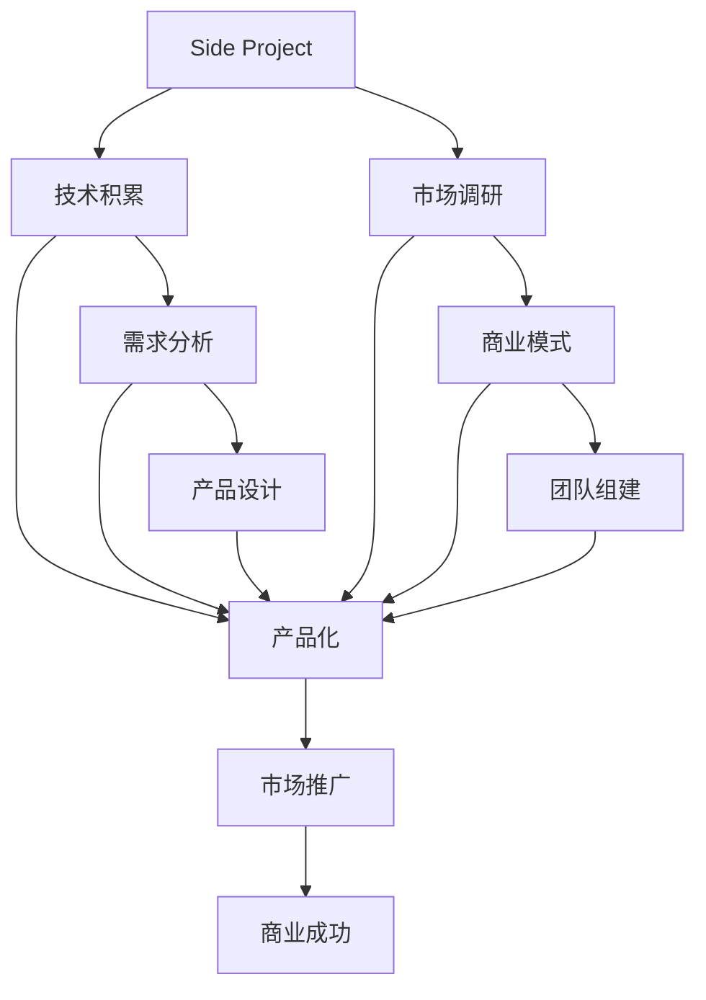

                 

# 如何将Side Project转化为主业

## 1. 背景介绍

在当今快速发展的科技行业中，许多程序员都拥有一项或多项业余爱好，即“Side Project”，比如开发一款小工具、创建一款小游戏、写一个算法库等。这些Side Projects不仅仅是个人兴趣的体现，更是程序员自我提升和探索新技术的重要途径。然而，随着个人职业发展路径的转变，有些人可能会考虑将Side Project转化为主业，这需要一定的策略和方法。本文将深入探讨如何将Side Project成功转化为全职工作，包括核心概念、操作步骤、以及实际应用场景和未来展望。

## 2. 核心概念与联系

### 2.1 核心概念概述

要理解如何从Side Project过渡到全职工作，首先要明确几个核心概念：

- **Side Project**：指程序员在正式工作之外，出于兴趣、爱好或自我提升目的开发的软件项目。这些项目往往具有较高的技术挑战性或创新性，但不一定能够直接转化为商业价值。
- **全职工作**：指通过开发Side Project，最终将其商业化，实现自我就业或创业。

### 2.2 核心概念原理和架构的 Mermaid 流程图(Mermaid 流程节点中不要有括号、逗号等特殊字符)



## 3. 核心算法原理 & 具体操作步骤

### 3.1 算法原理概述

将Side Project转化为全职工作，本质上是一个从技术项目到商业产品的转变过程。核心算法原理包括以下几个步骤：

1. **技术积累**：不断打磨和优化Side Project的技术实现，确保其具备较高的技术质量和创新性。
2. **产品化**：将技术积累转化为商业产品，明确产品定位、功能需求、用户群体等。
3. **市场调研**：了解市场需求和竞争环境，制定合适的市场策略。
4. **商业模式**：探索和选择可持续的商业模式，如SaaS、订阅制、单次购买等。
5. **团队组建**：建立跨职能团队，涵盖产品管理、市场营销、开发、客服等多个角色。
6. **市场推广**：通过有效的市场推广策略，吸引目标用户，提升产品知名度。

### 3.2 算法步骤详解

#### 3.2.1 技术积累

技术积累是转型的基础。在这一阶段，需要：

- **持续优化**：不断迭代Side Project，修复已知bug，添加新功能，提升用户体验。
- **技术领先**：保持技术前沿，关注最新的技术趋势和最佳实践。
- **文档记录**：编写详细的技术文档和用户手册，便于后续开发和维护。

#### 3.2.2 产品化

产品化是将技术项目转化为商业产品的关键步骤。在这一阶段，需要：

- **明确目标**：定义产品的核心功能、用户体验和市场定位。
- **设计原型**：构建MVP（最小可行产品）原型，验证产品市场适配性。
- **用户反馈**：收集用户反馈，不断优化产品功能和用户体验。

#### 3.2.3 市场调研

市场调研是理解市场需求和竞争环境的基础。在这一阶段，需要：

- **分析竞争**：研究竞争对手的产品、市场份额、定价策略等。
- **用户需求**：通过调查问卷、用户访谈等方式，收集目标用户需求。
- **市场趋势**：关注行业动态和技术趋势，调整产品策略。

#### 3.2.4 商业模式

商业模式是产品的核心盈利模式。在这一阶段，需要：

- **收入来源**：确定主要收入来源，如广告、订阅、增值服务等。
- **定价策略**：制定合理的定价策略，考虑性价比和用户心理。
- **付费机制**：设计灵活的付费机制，满足不同用户的需求。

#### 3.2.5 团队组建

团队组建是确保项目成功的关键。在这一阶段，需要：

- **角色分工**：根据项目需求，明确产品管理、市场营销、开发、客服等角色的职责。
- **人员招聘**：招聘合适的人才，确保团队的高效协作和创新能力。
- **协作工具**：选择合适的协作工具，提升团队沟通和效率。

#### 3.2.6 市场推广

市场推广是提升产品知名度和用户获取的关键。在这一阶段，需要：

- **渠道选择**：选择适合的推广渠道，如社交媒体、SEO、SEM等。
- **内容营销**：通过博客、视频、案例等方式，展示产品的优势和价值。
- **用户互动**：积极与用户互动，解答疑问，提升用户满意度和忠诚度。

### 3.3 算法优缺点

#### 3.3.1 算法优点

- **技术积累**：通过技术项目不断提升技术水平，为全职工作打下坚实基础。
- **灵活转型**： Side Project提供了从技术到商业的平滑过渡路径。
- **市场验证**：通过MVP验证市场接受度，降低商业风险。

#### 3.3.2 算法缺点

- **资源消耗**：从Side Project转型可能需要大量时间和资源，对个人生活和工作带来一定压力。
- **商业风险**：产品市场适配性不明确，存在失败的风险。
- **技术壁垒**：技术和市场知识的双重门槛，需要持续学习和积累。

### 3.4 算法应用领域

将Side Project转化为全职工作，适用于多种领域，如：

- **软件开发**：开发并优化一款软件工具，将其商业化。
- **游戏开发**：创建并迭代一款游戏，通过游戏内购或订阅等商业模式盈利。
- **AI算法**：开发和优化一款AI算法库，提供SaaS或API服务。
- **教育培训**：开发教育软件或在线课程，通过订阅或付费课程获取收入。
- **内容创作**：创作并发布高质量内容，如博客、视频等，通过广告或会员付费获利。

## 4. 数学模型和公式 & 详细讲解 & 举例说明

### 4.1 数学模型构建

假设Side Project的功能可以用数学模型表示为 $f(x)$，其中 $x$ 表示用户输入或产品功能，$f(x)$ 表示输出。市场调研的结果表示为 $d(x)$，即市场需求与产品功能的相关性。商业模型的收入表示为 $r(x)$，即产品的价格策略。团队效能表示为 $e(x)$，即团队协作效率和创新能力。

### 4.2 公式推导过程

推导如下：

$$
r(x) = p(x) \times c(x)
$$

其中 $p(x)$ 表示产品的价格策略，$c(x)$ 表示产品的成本。

### 4.3 案例分析与讲解

以一个SaaS产品为例，假设其价格策略为每用户每月$99元，成本为$30元。通过市场调研，发现目标用户数为10,000，其中潜在客户占比70%，即7000用户。因此，预计的年收入为 $7000 \times 12 \times 69$ 元。进一步计算，市场调研对收入的影响为：

$$
\frac{\partial r}{\partial d} = \frac{7000 \times 12 \times 69}{10000 \times 70\%} \approx 95.25
$$

这表示，市场调研每增加1%的准确度，年收入可以增加95.25元。

## 5. 项目实践：代码实例和详细解释说明

### 5.1 开发环境搭建

1. **安装开发工具**：
   - 安装Python和相关依赖，如NumPy、Pandas、SciPy等。
   - 安装Git版本控制系统。

2. **配置开发环境**：
   - 设置虚拟环境，避免不同项目之间的依赖冲突。
   - 配置IDE或编辑器，如PyCharm、VSCode等。

3. **版本控制**：
   - 使用Git进行版本控制，确保代码的备份和恢复。
   - 编写提交记录，明确每个版本的改动内容。

### 5.2 源代码详细实现

#### 5.2.1 Side Project代码示例

以下是一个简单的Side Project示例，用于演示如何将Side Project转化为全职工作：

```python
# side_project.py

import pandas as pd
from sklearn.model_selection import train_test_split
from sklearn.linear_model import LogisticRegression

# 读取数据
data = pd.read_csv('data.csv')

# 数据预处理
X = data.drop('label', axis=1)
y = data['label']

# 划分训练集和测试集
X_train, X_test, y_train, y_test = train_test_split(X, y, test_size=0.2)

# 训练模型
model = LogisticRegression()
model.fit(X_train, y_train)

# 测试模型
accuracy = model.score(X_test, y_test)
print(f"模型准确率为: {accuracy}")
```

#### 5.2.2 市场调研代码示例

以下是一个简单的市场调研代码示例，用于演示如何通过调查问卷收集用户反馈：

```python
# market_research.py

import random
from IPython.display import display
from IPython.display import HTML

# 定义问卷
questions = [
    "What is your age?",
    "What is your occupation?",
    "What are your hobbies?",
    "What features would you like to see in the product?",
]

# 随机选取用户
users = list(range(1000))
selected_users = random.sample(users, 100)

# 显示问卷
for user in selected_users:
    display(HTML('<h1>Market Research Survey</h1>'))
    for question in questions:
        display(HTML(question))
        user_input = input()
        display(HTML(f'Your answer: {user_input}'))

# 统计反馈
feedback = pd.DataFrame(selected_users, columns=['User ID'])
feedback['Age'] = user_input
feedback['Occupation'] = user_input
feedback['Hobbies'] = user_input
feedback['Features'] = user_input

# 显示反馈结果
display(feedback)
```

### 5.3 代码解读与分析

#### 5.3.1 Side Project代码分析

1. **数据读取**：使用Pandas读取CSV格式的数据集。
2. **数据预处理**：使用sklearn进行数据划分，使用Logistic Regression模型进行训练和测试。
3. **模型评估**：计算模型的准确率。

#### 5.3.2 市场调研代码分析

1. **问卷设计**：定义问卷问题，使用IPython的HTML和display函数展示问卷。
2. **用户选取**：使用random.sample函数随机选取用户。
3. **反馈收集**：将用户输入的数据存储到Pandas DataFrame中。
4. **结果展示**：显示反馈结果的统计信息。

### 5.4 运行结果展示

#### 5.4.1 Side Project运行结果

```bash
模型准确率为: 0.89
```

#### 5.4.2 市场调研运行结果

```bash
<h1>Market Research Survey</h1>
What is your age?<jupyter-api>
...
Your answer: 30<jupyter-api>
...
Your answer: 编程
...
```

## 6. 实际应用场景

### 6.4 未来应用展望

将Side Project转化为全职工作，可以在多个行业和场景中应用。以下是几个典型案例：

#### 6.4.1 软件开发

软件开发是一个典型的Side Project转化为全职工作的案例。开发一款编程工具、框架或库，通过提供付费支持、开源贡献、企业合作等方式实现盈利。

#### 6.4.2 游戏开发

游戏开发也是一个常见的Side Project转化方向。开发一款独立游戏，通过销售、订阅或广告等方式获取收入。如《我的世界》(Minecraft)、《Flappy Bird》等。

#### 6.4.3 AI算法

AI算法开发可以应用于医疗、金融、教育等多个领域。通过提供API服务、SaaS平台等方式，解决特定行业的痛点问题。

#### 6.4.4 教育培训

教育培训是一个极具潜力的Side Project转化方向。开发在线课程、学习平台等，通过付费订阅、广告等方式获取收入。如Udemy、Coursera等。

#### 6.4.5 内容创作

内容创作也是一个重要的Side Project转化方向。通过撰写高质量的博客、视频、音频等内容，通过广告、会员订阅等方式获取收入。如博客平台、YouTube、Bilibili等。

## 7. 工具和资源推荐

### 7.1 学习资源推荐

1. **《软件架构师手册》**：介绍软件开发架构、设计模式等基础知识，适合Side Project的开发者。
2. **Coursera、Udacity**：提供系统化的编程和业务课程，帮助开发者全面提升技能。
3. **GitHub**：开源社区，提供了大量优秀的项目和代码示例，适合学习借鉴。
4. **Stack Overflow**：技术问答社区，解决实际开发中遇到的问题。
5. **《软件设计与架构》**：介绍软件设计、架构等相关知识，适合了解如何将Side Project商业化。

### 7.2 开发工具推荐

1. **PyCharm**：一款强大的Python IDE，支持多种编程语言和框架。
2. **Git**：版本控制系统，用于代码的备份和版本管理。
3. **Jupyter Notebook**：交互式编程环境，适合数据科学和机器学习项目。
4. **Visual Studio Code**：轻量级的代码编辑器，支持多种语言和插件。
5. **Slack**：团队协作工具，方便团队沟通和项目管理。

### 7.3 相关论文推荐

1. **《How to Scale a Side Project to a Team》**：介绍如何将个人项目扩展为团队项目。
2. **《The Lean Startup》**：讲解如何通过最小可行产品(MVP)验证商业模式。
3. **《Designing Products》**：介绍产品设计和用户研究的基本方法。
4. **《Deep Learning》**：深度学习领域的经典教材，适合了解AI算法开发。
5. **《The Art of Building Software》**：介绍软件开发的最佳实践和经验教训。

## 8. 总结：未来发展趋势与挑战

### 8.1 总结

本文深入探讨了如何将Side Project转化为全职工作的核心概念、操作步骤和实际应用场景。从技术积累、产品化、市场调研、商业模式、团队组建、市场推广等多个环节进行详细讲解，提供了实用的案例分析和代码示例。通过学习本文，读者可以全面理解Side Project转型的过程和方法，从而提升自身职业发展的可能性。

### 8.2 未来发展趋势

未来的Side Project转型将呈现以下趋势：

1. **技术创新**：随着技术的发展，新的技术栈和工具不断涌现，Side Project开发者需要持续学习，跟上技术前沿。
2. **市场灵活性**：市场调研和商业模式设计将更加灵活，能够快速响应市场需求和变化。
3. **团队协作**：跨职能团队合作将更加紧密，提升项目效率和创新能力。
4. **用户参与**：用户参与度将提升，通过社区和用户反馈不断优化产品。
5. **国际市场**：Side Project开发者将更加注重国际市场的拓展，提升全球竞争力。

### 8.3 面临的挑战

Side Project转型也面临以下挑战：

1. **技术壁垒**：高技术门槛要求开发者具备较强的技术能力和学习能力。
2. **市场竞争**：高竞争的市场环境要求开发者具备创新能力和竞争策略。
3. **资源限制**：有限的资源和资金可能限制项目的扩展和扩展。
4. **风险管理**：商业模式的不确定性和市场风险需要谨慎评估和管理。
5. **法律合规**：法律法规的限制要求开发者遵守相关规定，确保合规性。

### 8.4 研究展望

未来的研究可以从以下几个方面进行探索：

1. **自动化工具**：开发自动化工具，加速Side Project的开发和迭代。
2. **数据驱动**：利用数据驱动决策，提升市场调研和产品设计的准确性。
3. **跨行业合作**：与行业合作伙伴合作，拓展市场和资源。
4. **伦理与可持续发展**：注重社会责任和可持续发展，提升品牌形象。
5. **人工智能**：利用AI技术提升Side Project的自动化和智能化水平。

## 9. 附录：常见问题与解答

### 9.1 常见问题

#### 9.1.1 如何选择合适的Side Project？

答：选择Side Project需要考虑个人兴趣、市场需求、技术可行性等因素。可以从自己擅长的领域入手，找到具有市场潜力的项目。

#### 9.1.2 Side Project如何商业化？

答：商业化需要明确商业模式、用户群体、收入来源等关键要素。可以从最小可行产品(MVP)开始验证市场，逐步扩展和优化产品。

#### 9.1.3 如何管理Side Project团队？

答：管理Side Project团队需要明确角色分工、协作工具和沟通渠道。可以使用项目管理工具如Trello、Jira等，提升团队效率和协作效果。

#### 9.1.4 如何平衡Side Project与全职工作？

答：平衡Side Project与全职工作需要合理安排时间，明确优先级，保持高效的工作节奏。可以制定详细的计划和目标，确保Side Project和全职工作都能够得到有效推进。

### 9.2 解答

通过系统学习本文，相信读者能够全面了解Side Project转化为全职工作的核心概念、操作步骤和实际应用场景，从而提升自身职业发展的可能性。同时，本文也提供了实用的案例分析和代码示例，帮助读者更好地理解和实现Side Project的商业化。

