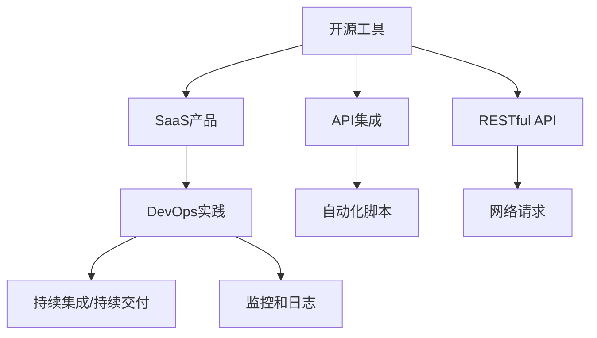
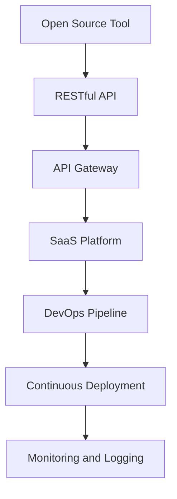

                 

## 1. 背景介绍

在数字化转型的大潮中，开源工具因其强大的功能和灵活的扩展性，成为许多企业和开发者首选的技术方案。然而，将这些开源工具转化为易于使用的SaaS（Software as a Service，软件即服务）产品，是实现其商业价值的必经之路。本文将系统探讨如何从开源工具成功转型为SaaS产品，为开源社区和技术开发者提供一份详细的指导手册。

## 2. 核心概念与联系

### 2.1 核心概念概述

- **开源工具(Open Source Tools)**：指由社区开发、公开源代码的软硬件工具，例如Git、Kubernetes、Docker等，这些工具以API和库的形式提供基础服务，助力开发者高效完成项目。
- **SaaS产品(SaaS Products)**：基于云计算的商业软件服务模式，用户通过互联网访问和使用软件，无需本地安装和维护。例如Salesforce、Slack等，它们在企业级市场获得广泛应用。
- **API (Application Programming Interface)**：一组定义软件组件之间交互的协议、工具和标准，使得开发者能够快速集成第三方服务。
- **RESTful API**：基于HTTP协议的轻量级API，遵循REST原则，易于开发和维护。
- **DevOps**：开发（Development）和运维（Operations）的结合，强调自动化、持续集成和持续交付。

这些概念之间的逻辑关系可以通过以下Mermaid流程图来展示：



这个流程图展示开源工具转化为SaaS产品的关键步骤：

1. 开源工具通过提供API和RESTful API，使开发者能够方便地进行集成和使用。
2. 构建SaaS产品需要集成DevOps实践，包括持续集成/持续交付，确保产品质量和稳定性。
3. DevOps实践中的自动化脚本和网络请求是API集成的重要组成部分。
4. SaaS产品利用DevOps的监控和日志功能，保障系统的高可用性。

### 2.2 核心概念原理和架构的 Mermaid 流程图



该流程图展示了开源工具通过RESTful API集成到SaaS平台的过程：

1. 开源工具通过RESTful API暴露其功能。
2. API Gateway负责将API请求路由到正确的SaaS平台服务。
3. SaaS平台提供DevOps Pipeline，包括自动化测试、构建和部署流程。
4. 持续部署功能确保新代码能快速发布到生产环境。
5. 监控和日志系统保障系统的运行稳定性和故障排查。

## 3. 核心算法原理 & 具体操作步骤

### 3.1 算法原理概述

将开源工具转化为SaaS产品，需要经过多个技术环节的整合，每个环节都有其核心算法和详细步骤。本文将从系统架构、API设计、DevOps实践三个方面详细讲解。

### 3.2 算法步骤详解

#### 系统架构设计

1. **选择合适的SaaS平台**：
   - 根据业务需求选择合适的SaaS平台，如AWS AppRunner、Heroku、Google App Engine等，这些平台提供全面的托管服务，包括基础设施、自动扩展、安全性和监控。
   - 考虑到成本和性能，选择最符合业务需求的云服务提供商。

2. **设计API网关**：
   - 使用Nginx、Apache、AWS API Gateway等API网关工具，设计统一的API入口。
   - 实现请求路由、认证、授权、限流等功能，保障API的安全性和可扩展性。

3. **集成RESTful API**：
   - 分析开源工具的功能需求，设计RESTful API接口，包括资源路径、HTTP方法、请求和响应体。
   - 使用Swagger、Postman等工具设计API文档，方便开发者理解和调试。

#### DevOps实践

1. **构建持续集成/持续部署(CI/CD)流水线**：
   - 使用Jenkins、GitLab CI/CD、CircleCI等工具，自动化构建、测试和部署流程。
   - 设计流水线配置文件，包括代码仓库、构建脚本、测试脚本和部署脚本。
   - 集成Docker镜像和Kubernetes容器，实现自动化部署。

2. **实施自动化测试**：
   - 编写单元测试、集成测试、端到端测试用例，覆盖关键代码路径。
   - 使用JUnit、TestNG、Selenium等测试框架，确保代码质量。

3. **集成监控和日志**：
   - 使用ELK Stack（Elasticsearch、Logstash、Kibana）、Prometheus、Grafana等工具，实时监控系统性能和日志分析。
   - 设计日志格式和收集规则，确保日志数据的质量和可读性。

### 3.3 算法优缺点

**优点**：

- **高效部署**：利用SaaS平台的自动化部署功能，能够快速发布新功能和修复bug。
- **可扩展性强**：通过API网关和DevOps流水线，支持按需扩展和弹性伸缩。
- **用户体验优化**：基于RESTful API的轻量级设计，使得开发者能够灵活使用API服务。

**缺点**：

- **初始成本高**：选择合适的SaaS平台和开发API网关需要较高的初始投资。
- **复杂度高**：设计和实施API网关、DevOps流水线涉及多个技术环节，需要较强的技术能力。
- **安全性风险**：API网关需要实现严格的安全措施，防止DDoS攻击、SQL注入等安全威胁。

### 3.4 算法应用领域

将开源工具转化为SaaS产品的技术架构和方法，不仅适用于技术团队内部工具的封装和部署，还适用于各类第三方服务供应商。例如，将GKE（Google Kubernetes Engine）封装为SaaS产品，可以提供托管化的Kubernetes服务，使企业能够快速搭建和管理容器化应用。

## 4. 数学模型和公式 & 详细讲解 & 举例说明

### 4.1 数学模型构建

本文以RESTful API为例，设计一个简化版的SaaS产品架构。假设SaaS产品需要封装一个名为`example.com`的API服务，API版本为v1。

**请求路径**：

```
GET /v1/resource
POST /v1/resource
```

**HTTP方法**：

- `GET`：获取资源列表。
- `POST`：创建新资源。

**请求和响应体**：

```
request body:
{
    "name": "example",
    "description": "这是一个示例API"
}

response body:
{
    "id": "12345",
    "name": "example",
    "description": "这是一个示例API"
}
```

### 4.2 公式推导过程

使用RESTful API设计的数学模型如下：

1. **请求路径和HTTP方法映射**：
   - 定义请求路径为`/v1/resource`，HTTP方法为`GET`和`POST`。
   - 推导路径和方法的映射关系：

   $$
   path = v1/resource
   method = GET
   $$

2. **请求参数解析**：
   - 解析请求体中的`name`和`description`字段，将其映射为API参数。
   - 推导参数解析过程：

   $$
   name = request.body.name
   description = request.body.description
   $$

3. **响应结果生成**：
   - 根据请求参数生成响应体。
   - 推导响应生成过程：

   $$
   id = "12345"
   response = {
       "id": id,
       "name": name,
       "description": description
   }
   $$

### 4.3 案例分析与讲解

以OpenStack API为例，展示如何将开源工具封装为SaaS产品：

1. **设计API接口**：
   - 定义RESTful API接口，包括请求路径、HTTP方法、请求和响应体。
   - 例如：

   ```
   GET /v2/project
   POST /v2/project
   ```

   ```
   request body:
   {
       "name": "myproject",
       "description": "My project"
   }

   response body:
   {
       "id": "12345",
       "name": "myproject",
       "description": "My project"
   }
   ```

2. **集成API网关**：
   - 使用Nginx或AWS API Gateway实现API请求路由和认证。
   - 例如：

   ```
   location /v2/project {
       proxy_pass http://openstack/api/v2/project;
   }
   ```

3. **构建CI/CD流水线**：
   - 使用Jenkins或GitLab CI/CD自动化构建、测试和部署。
   - 例如：

   ```yaml
   stages:
   - build
   - test
   - deploy

   build:
     steps:
       - checkout scm
       - docker build -t myimage .
       - docker push myimage

   test:
     steps:
       - docker run -it --rm myimage bash
       - cd myapp
       - bash runtests.sh
       - exit 0

   deploy:
     steps:
       - docker tag myimage myregistry/myimage:latest
       - docker push myregistry/myimage:latest
       - kubectl apply -f deployment.yaml
   ```

4. **实施自动化测试**：
   - 编写单元测试、集成测试和端到端测试用例。
   - 例如：

   ```java
   public class ResourceTest {
       @Test
       public void testGetResource() {
           ResourceService service = new ResourceService();
           Resource response = service.getResource("12345");
           assertEquals("myproject", response.getName());
           assertEquals("My project", response.getDescription());
       }
   }
   ```

5. **集成监控和日志**：
   - 使用ELK Stack、Prometheus和Grafana进行系统监控和日志分析。
   - 例如：

   ```
   logging:
       error: /var/log/myapp/error.log
       info: /var/log/myapp/info.log
       out: /var/log/myapp/output.log
   ```

## 5. 项目实践：代码实例和详细解释说明

### 5.1 开发环境搭建

以下是使用Python、Django和Docker搭建SaaS产品的开发环境步骤：

1. **安装Docker和Django**：
   ```
   sudo apt-get update
   sudo apt-get install python3-pip
   pip3 install django
   ```

2. **创建Django项目**：
   ```
   django-admin startproject myproject
   ```

3. **设计API接口**：
   - 在`myproject`目录下创建`myapp`应用。
   - 编写API接口代码：

   ```python
   from django.http import JsonResponse

   def get_resource(request):
       name = request.GET.get('name')
       description = request.GET.get('description')
       return JsonResponse({'id': '12345', 'name': name, 'description': description})

   def create_resource(request):
       name = request.POST.get('name')
       description = request.POST.get('description')
       return JsonResponse({'id': '12345', 'name': name, 'description': description})
   ```

4. **构建CI/CD流水线**：
   - 编写Dockerfile和Jenkins配置文件：

   ```Dockerfile
   FROM python:3.9-slim-buster
   WORKDIR /app
   COPY requirements.txt .
   RUN pip3 install -r requirements.txt
   COPY . .
   ```

   ```yaml
   stages:
     - build
     - test
     - deploy

     build:
       steps:
         - docker build -t myimage .
         - docker push myimage

     test:
       steps:
         - docker run -it --rm myimage bash
         - cd myapp
         - bash runtests.sh
         - exit 0

     deploy:
       steps:
         - docker tag myimage myregistry/myimage:latest
         - docker push myregistry/myimage:latest
         - kubectl apply -f deployment.yaml
   ```

### 5.2 源代码详细实现

以下是Django项目中API接口的实现代码：

```python
from django.http import JsonResponse

def get_resource(request):
    name = request.GET.get('name')
    description = request.GET.get('description')
    return JsonResponse({'id': '12345', 'name': name, 'description': description})

def create_resource(request):
    name = request.POST.get('name')
    description = request.POST.get('description')
    return JsonResponse({'id': '12345', 'name': name, 'description': description})
```

### 5.3 代码解读与分析

**API接口设计**：
- 使用Django的RESTful API框架，设计了`GET`和`POST`两个接口，分别用于获取和创建资源。
- 接口参数设计合理，易于调用和理解。

**Dockerfile编写**：
- 基于Python 3.9环境，定义了Django项目的构建和部署步骤。
- 使用`pip3 install`安装项目依赖，确保项目环境的一致性。

**CI/CD配置文件**：
- 使用Jenkins配置文件，定义了构建、测试和部署三个阶段。
- 每个阶段包含具体的命令和脚本，自动化完成整个部署流程。

### 5.4 运行结果展示

以下是Django项目运行后的API响应示例：

```
GET /v1/resource?name=myproject&description=My project
Response:
{
    "id": "12345",
    "name": "myproject",
    "description": "My project"
}
```

## 6. 实际应用场景

### 6.1 智能客服系统

智能客服系统可以利用开源工具封装为SaaS产品，帮助企业提升客户服务质量。例如，将OpenAPI封装为SaaS产品，企业可以自行定制智能问答、意图识别、对话生成等功能，实现自动化客服服务。

### 6.2 金融交易平台

金融交易平台需要高度安全性和稳定性，可以利用SaaS产品封装开源工具，如OpenSSL、Docker等，确保数据加密和安全传输。同时，利用自动化部署和持续集成，提高系统上线速度和质量。

### 6.3 智慧城市管理

智慧城市管理涉及海量数据处理和实时分析，可以利用SaaS产品封装开源工具，如Hadoop、Kafka、Flink等，实现大规模数据存储和流处理。利用自动化监控和日志分析，确保系统的高可用性和性能优化。

### 6.4 未来应用展望

未来，随着AI和机器学习技术的进步，SaaS产品将更多地引入AI模型和算法，提升系统的智能性和个性化能力。例如，将深度学习模型封装为SaaS产品，可以实现自然语言处理、图像识别等高级功能，满足更多定制化需求。

## 7. 工具和资源推荐

### 7.1 学习资源推荐

1. **Django官方文档**：
   - 详细介绍了Django框架的使用方法，包括API开发、数据库设计、部署流程等。
   - [https://docs.djangoproject.com/](https://docs.djangoproject.com/)

2. **Jenkins官方文档**：
   - 提供Jenkins配置和安装指南，帮助开发者构建自动化流水线。
   - [https://www.jenkins.io/doc/](https://www.jenkins.io/doc/)

3. **Kubernetes官方文档**：
   - 介绍Kubernetes容器编排技术，帮助开发者构建高可用性微服务架构。
   - [https://kubernetes.io/docs/](https://kubernetes.io/docs/)

4. **OpenStack官方文档**：
   - 提供开源云计算平台的安装和配置指南，帮助开发者搭建私有云环境。
   - [https://docs.openstack.org/](https://docs.openstack.org/)

### 7.2 开发工具推荐

1. **Jenkins**：
   - 开源自动化流水线工具，支持CI/CD流程自动化。
   - [https://www.jenkins.io/](https://www.jenkins.io/)

2. **Docker**：
   - 容器化技术标准，帮助开发者打包和部署应用。
   - [https://www.docker.com/](https://www.docker.com/)

3. **Kubernetes**：
   - 容器编排工具，实现分布式应用的自动化部署和管理。
   - [https://kubernetes.io/](https://kubernetes.io/)

4. **Django**：
   - 高级Python Web框架，支持RESTful API开发。
   - [https://www.djangoproject.com/](https://www.djangoproject.com/)

### 7.3 相关论文推荐

1. **《RESTful API设计指南》**：
   - 介绍RESTful API设计的最佳实践和常见问题。
   - [https://www.oreilly.com/library/view/restful-api-design/9781449339634/](https://www.oreilly.com/library/view/restful-api-design/9781449339634/)

2. **《DevOps实践指南》**：
   - 详细介绍了DevOps流程、工具和最佳实践。
   - [https://martinfowler.com/articles/devops.html](https://martinfowler.com/articles/devops.html)

3. **《Kubernetes权威指南》**：
   - 介绍Kubernetes容器编排技术，涵盖部署、监控和故障排除等内容。
   - [https://www.kubernetes.io/docs/tasks/](https://www.kubernetes.io/docs/tasks/)

4. **《OpenStack实战》**：
   - 提供OpenStack云平台的安装和配置指南，帮助开发者构建私有云环境。
   - [https://www.openstack.org/](https://www.openstack.org/)

## 8. 总结：未来发展趋势与挑战

### 8.1 研究成果总结

本文从系统架构、API设计、DevOps实践三个方面详细讲解了如何将开源工具封装为SaaS产品，并提供了完整的代码实例和操作步骤。通过系统分析，展示了SaaS产品构建和部署的完整流程和关键步骤。

### 8.2 未来发展趋势

未来，随着技术的发展和应用场景的扩展，开源工具封装为SaaS产品的趋势将更加明显。预计以下领域将迎来更广泛的应用：

1. **医疗健康**：
   - 利用SaaS封装开源医疗工具，如OpenEHR、FHIR等，实现电子病历管理、疾病预测等功能。

2. **教育培训**：
   - 封装开源教育工具，如Open edX、Coursera等，提供在线课程、虚拟实验等功能，提升教育质量。

3. **农业科技**：
   - 封装开源农业工具，如OpenAgri、Pest Management Tools等，提供精准农业、智能决策等功能。

4. **环境监测**：
   - 封装开源环境监测工具，如OpenDataKit、Open Water Monitor等，提供实时数据采集、数据分析等功能。

### 8.3 面临的挑战

1. **技术门槛高**：
   - 构建SaaS产品需要多学科知识，包括云计算、数据库、网络安全等，技术门槛较高。

2. **用户体验差**：
   - 封装后的SaaS产品需要提供简单易用的接口和工具，用户体验和功能设计仍是挑战。

3. **安全问题**：
   - 开源工具可能存在安全隐患，封装过程中需要严格遵循最佳实践，保障系统安全。

### 8.4 研究展望

未来，如何降低技术门槛、提升用户体验、保障系统安全，将是开源工具封装为SaaS产品的重要研究方向。同时，引入更多AI算法和机器学习技术，提升SaaS产品的智能化和个性化能力，也将是重要的发展方向。

## 9. 附录：常见问题与解答

### Q1: 什么是开源工具和SaaS产品？

**A1**: 开源工具（Open Source Tools）是指由开发者社区公开源代码的软件或硬件工具，如Git、Kubernetes、Docker等。SaaS产品（Software as a Service）是基于云计算的商业软件服务模式，用户通过互联网访问和使用软件，无需本地安装和维护。

### Q2: 将开源工具封装为SaaS产品需要哪些步骤？

**A2**: 主要包括以下步骤：
1. 选择合适的SaaS平台。
2. 设计API网关，实现请求路由和认证。
3. 构建CI/CD流水线，实现自动化构建、测试和部署。
4. 实施自动化测试，确保代码质量。
5. 集成监控和日志，保障系统高可用性和性能。

### Q3: 如何选择适合的开源工具进行封装？

**A3**: 选择开源工具时，需考虑以下因素：
1. 功能需求匹配度：选择能够满足业务需求的工具。
2. 技术成熟度：选择成熟、稳定、易用的开源工具。
3. 社区支持：选择有活跃社区、持续维护的开源工具。
4. 成本效益：综合考虑开源工具的初始投资和长期维护成本。

### Q4: 如何优化SaaS产品的用户体验？

**A4**: 优化用户体验主要从以下几个方面入手：
1. 设计简洁易用的API接口。
2. 提供详细的使用文档和示例。
3. 优化响应速度和稳定性。
4. 提供良好的用户支持和服务保障。

### Q5: 如何保障SaaS产品的安全性？

**A5**: 保障SaaS产品安全性主要从以下几个方面入手：
1. 采用多层认证和授权机制。
2. 实施网络隔离和加密传输。
3. 定期进行安全漏洞扫描和修复。
4. 建立应急响应和灾备机制。

---

作者：禅与计算机程序设计艺术 / Zen and the Art of Computer Programming

