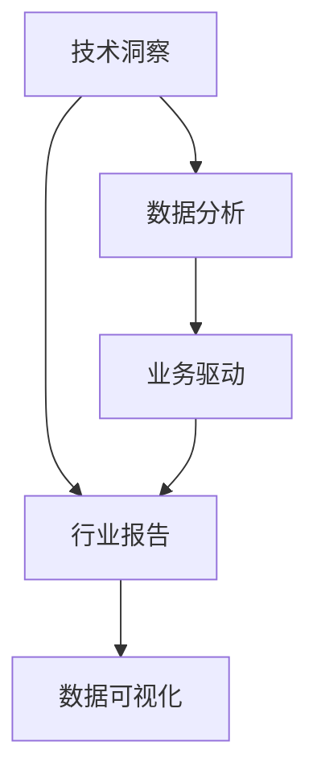

                 

# 如何将技术洞察转化为付费行业报告

> 关键词：技术洞察, 数据驱动, 商业决策, 行业报告, 数据分析, 数据可视化

## 1. 背景介绍

### 1.1 问题由来
在当今数据驱动的时代，获取高质量、实时的技术洞察对商业决策至关重要。企业希望通过深入分析自身和市场的数据，掌握未来发展的趋势，制定更加科学合理的策略。然而，大量的数据和复杂的分析手段，使得很多企业难以高效地进行决策支持。

### 1.2 问题核心关键点
如何高效地从海量数据中提取出有价值的洞察，并通过可视化的方式呈现给决策者，成为了当前数据分析领域的重要课题。数据驱动的商业决策需要技术洞察来支撑，但技术洞察的获取和转化往往需要耗费大量时间和精力。

### 1.3 问题研究意义
将技术洞察转化为付费行业报告，是帮助企业快速获取市场洞察、提升决策效率的有效途径。一份高质量的行业报告，不仅能够提供全面准确的数据，还能通过精巧的分析框架和直观的可视化效果，辅助企业进行科学决策。

## 2. 核心概念与联系

### 2.1 核心概念概述

为更好地理解如何将技术洞察转化为付费行业报告，本节将介绍几个密切相关的核心概念：

- 技术洞察(Technical Insight)：通过数据分析和机器学习技术，从数据中提取出的有意义、可操作的知识或结论。
- 行业报告(Industry Report)：包含对某一行业或领域的市场、技术、竞争、趋势等进行分析总结的文档，帮助读者理解行业现状和未来发展方向。
- 数据分析(Analytical Data)：收集、整理和分析数据，以发现数据中的模式、趋势和关联的过程。
- 数据可视化(Data Visualization)：将数据以图形、图表等形式直观展示，便于理解和使用。
- 数据驱动(Business-Driven)：基于数据而非直觉或经验进行商业决策，提高决策的准确性和科学性。

这些核心概念之间的逻辑关系可以通过以下Mermaid流程图来展示：



这个流程图展示了一些关键概念的相互关系：

1. 技术洞察是行业报告的基础，通过数据分析得到。
2. 行业报告的编写需要数据可视化的支撑，使得结论更加直观易懂。
3. 数据驱动强调了行业报告与业务决策的紧密联系，辅助企业优化商业策略。

## 3. 核心算法原理 & 具体操作步骤
### 3.1 算法原理概述

将技术洞察转化为付费行业报告，涉及多个核心步骤，主要包括以下几个方面：

1. **数据采集与整理**：收集行业内相关的数据，包括市场规模、增长率、主要玩家份额等。对数据进行清洗和处理，确保数据的准确性和一致性。
2. **数据分析**：通过统计分析和机器学习模型，对数据进行深入挖掘，提取关键指标和趋势。
3. **报告编写**：将分析结果整理成报告，通过结构化的章节、段落和子标题，清晰地呈现出来。
4. **数据可视化**：通过图表、图形等可视化工具，将复杂的数据和结论更加直观地展示。
5. **结果验证**：通过实际业务场景的验证，确保分析结论的可靠性和实用性。

### 3.2 算法步骤详解

以下是具体的操作流程：

**Step 1: 数据收集与整理**
- 确定报告的行业和范围，明确需要收集的数据类型。
- 使用API、数据库、公开数据集等手段，获取原始数据。
- 对数据进行清洗，去除缺失值、异常值等，确保数据质量。
- 将数据转化为易于分析的格式，如表格、时间序列等。

**Step 2: 数据分析**
- 根据报告目的，选择适合的统计分析方法，如均值、标准差、回归分析等。
- 使用机器学习模型，进行深度数据分析，提取关键趋势和关联。
- 对分析结果进行汇总，形成初步的结论和建议。

**Step 3: 报告编写**
- 根据分析结果，设计报告的结构和章节。
- 编写报告内容，用结构化的方式呈现数据和结论，如使用标题、子标题、段落等。
- 添加图表和图形，帮助读者直观理解数据和结论。

**Step 4: 数据可视化**
- 选择合适的可视化工具，如Tableau、Power BI等，创建图表和图形。
- 对可视化效果进行优化，确保简洁明了、美观易读。
- 将可视化结果与报告内容结合，确保报告的完整性和连贯性。

**Step 5: 结果验证**
- 通过实际业务数据或模拟实验，验证分析结果的准确性。
- 收集反馈意见，根据反馈对报告进行迭代和优化。
- 确保报告中的结论和建议具有可操作性和实用性。

### 3.3 算法优缺点

将技术洞察转化为付费行业报告的方法具有以下优点：
1. 数据驱动：通过数据分析和机器学习，能够挖掘出有价值的洞察，提供更加科学合理的决策依据。
2. 直观展示：通过数据可视化的方式，使得复杂的数据和结论更加直观易懂，便于用户理解。
3. 结构清晰：报告通过结构化的方式呈现内容，条理清晰，便于读者快速获取关键信息。
4. 实用性强：报告内容紧密结合实际业务场景，提供具体可操作的建议，有助于决策者制定策略。

同时，该方法也存在一些局限性：
1. 数据质量依赖：报告的质量高度依赖于原始数据的质量和完整性，数据采集和处理需要投入大量的时间和精力。
2. 技术门槛高：数据分析和机器学习涉及复杂的算法和工具，需要较高的技术能力和经验。
3. 报告撰写周期长：编写高质量的报告需要详细的数据分析和深入的洞察，编写周期较长。
4. 成本高昂：从数据采集到报告发布，各个环节的成本较高，适用于需要快速获取洞察的企业。

尽管存在这些局限性，但将技术洞察转化为付费行业报告的方法，仍然是企业获取高质量洞察、提升决策效率的重要手段。未来相关研究的重点在于如何进一步简化数据采集和处理流程，提高分析效率和报告撰写效率，降低成本。

### 3.4 算法应用领域

将技术洞察转化为付费行业报告的方法，在各个领域都有着广泛的应用，例如：

- 金融行业：分析市场趋势、投资机会、风险管理等，为企业决策提供数据支持。
- 零售行业：洞察消费者行为、市场竞争、销售趋势等，帮助企业制定促销策略和优化供应链。
- 医疗行业：分析患者数据、药物效果、医疗市场等，为临床研究和医疗管理提供依据。
- 科技行业：了解技术发展趋势、市场应用、竞争格局等，辅助企业创新和战略规划。
- 媒体行业：分析受众需求、广告效果、内容分布等，帮助媒体制定内容策略和提升用户体验。

除了上述这些经典领域外，该方法还在更多场景中得到应用，如政策分析、教育评估、社会治理等，为各个行业提供了深度洞察和决策支持。

## 4. 数学模型和公式 & 详细讲解 & 举例说明

### 4.1 数学模型构建

将技术洞察转化为付费行业报告，需要构建多个数学模型，用于数据分析和验证报告的有效性。以下是一些关键的数学模型：

- **回归分析模型**：用于分析变量之间的线性关系，如时间序列分析、回归方程等。
- **分类模型**：用于对数据进行分类，如逻辑回归、决策树等。
- **聚类模型**：用于将数据分成不同的群组，如K-Means、层次聚类等。
- **时间序列模型**：用于分析时间序列数据的趋势和周期性，如ARIMA、季节性自回归模型等。

### 4.2 公式推导过程

以时间序列分析为例，推导ARIMA模型的公式。

假设有一个时间序列数据 $y_t$，我们可以使用ARIMA(p,d,q)模型对其进行分析，其中p是自回归阶数，d是差分阶数，q是移动平均阶数。模型的公式为：

$$
(1-L)^d(1-\phi_1L-\phi_2L^2-\cdots-\phi_pL^p)(1-\theta_1L-\theta_2L^2-\cdots-\theta_qL^q)y_t=\epsilon_t
$$

其中，L为滞后算子，$\phi_i$和$\theta_j$为模型的系数，$\epsilon_t$为误差项。

对于ARIMA模型，我们通常需要通过模型诊断和参数优化，来确定合适的p、d、q值。常用的参数估计方法包括最小二乘法、最大似然法等。

### 4.3 案例分析与讲解

假设我们有一份关于电商销售数据的行业报告，我们需要分析各个季度的销售趋势和影响因素。我们可以采用时间序列分析模型，将销售数据进行差分，然后使用ARIMA模型对其进行拟合，得到销售趋势的预测值。具体步骤如下：

1. **数据预处理**：对销售数据进行差分，将其转化为平稳的时间序列数据。
2. **模型拟合**：使用ARIMA模型对差分后的数据进行拟合，得到模型的系数。
3. **趋势预测**：使用拟合好的模型，预测未来几个季度的销售趋势。

通过这种方法，我们可以将技术洞察转化为具体的趋势预测，辅助企业制定销售策略。

## 5. 项目实践：代码实例和详细解释说明

### 5.1 开发环境搭建

在进行报告编写和数据分析前，我们需要准备好开发环境。以下是使用Python进行Pandas、NumPy、Scikit-Learn等库开发的环境配置流程：

1. 安装Anaconda：从官网下载并安装Anaconda，用于创建独立的Python环境。

2. 创建并激活虚拟环境：
```bash
conda create -n data-env python=3.8 
conda activate data-env
```

3. 安装数据科学相关库：
```bash
conda install pandas numpy scikit-learn matplotlib seaborn
```

4. 安装可视化库：
```bash
conda install plotly
```

5. 安装报告生成工具：
```bash
pip install reportlab
```

完成上述步骤后，即可在`data-env`环境中开始项目实践。

### 5.2 源代码详细实现

以下是使用Python进行电商销售数据的时间序列分析报告的代码实现。

首先，导入所需的库：

```python
import pandas as pd
import numpy as np
from sklearn.metrics import mean_squared_error
from sklearn.linear_model import ARIMA
import matplotlib.pyplot as plt
import seaborn as sns
from reportlab.lib.pagesizes import letter
from reportlab.platypus import SimpleDocTemplate, Paragraph, Spacer, Table, TableStyle
```

然后，读取数据并进行预处理：

```python
data = pd.read_csv('sales_data.csv')
data['季度'] = pd.cut(data['日期'], bins=4, labels=['Q1', 'Q2', 'Q3', 'Q4'])
data = data.groupby('季度')['销售额'].sum().reset_index()
data = data[0]
data['销售额'] = data['销售额'].diff().fillna(0)
```

接着，进行ARIMA模型拟合：

```python
model = ARIMA(data['销售额'], order=(1, 1, 1))
model_fit = model.fit()
```

最后，编写报告并生成PDF文件：

```python
doc = SimpleDocTemplate('sales_report.pdf', pagesize=letter)
story = []
story.append(Spacer(1, 12*12))
story.append(Paragraph('电商销售趋势报告', 'Helvetica'))
story.append(Spacer(1, 12*6))
table_data = [
    ['季度', '销售额', '预测销售额'],
    ['Q1', data['销售额'][0], model_fit.predict(0)[0]],
    ['Q2', data['销售额'][1], model_fit.predict(1)[0]],
    ['Q3', data['销售额'][2], model_fit.predict(2)[0]]
]
table = Table(table_data)
table.setStyle(TableStyle([('BACKGROUND', (0, 0), (-1, 0), 'grey'), ('ALIGN', (0, 0), (-1, -1), 'CENTER')])
story.append(table)
doc.build(story)
```

以上就是使用Python进行电商销售数据时间序列分析报告的完整代码实现。可以看到，通过Pandas和Scikit-Learn库，我们可以快速完成数据的清洗、预处理和建模。而通过报告生成工具ReportLab，我们可以将分析结果以PDF的形式呈现，便于企业使用。

### 5.3 代码解读与分析

让我们再详细解读一下关键代码的实现细节：

**数据预处理**：
- `pd.cut()`方法：将日期字段按照季度进行分组，便于后续的差分操作。
- `data['销售额'].diff().fillna(0)`：对销售额进行一阶差分，并将差分结果中的NaN值填充为0。

**模型拟合**：
- `ARIMA(data['销售额'], order=(1, 1, 1))`：创建ARIMA模型，指定自回归阶数、差分阶数和移动平均阶数。
- `model_fit = model.fit()`：拟合模型，得到模型的系数和预测值。

**报告编写**：
- `SimpleDocTemplate`类：创建PDF文档模板，指定文档大小和页面布局。
- `Paragraph`类：创建段落，用于添加标题和内容。
- `Table`类：创建表格，用于展示销售趋势和预测结果。
- `TableStyle`类：设置表格样式，包括背景颜色和对齐方式。

**报告生成**：
- `doc.build(story)`：生成PDF文件，将所有内容写入文件。

通过这种方法，我们可以将技术洞察快速转化为易于理解和使用的行业报告，辅助企业制定更加科学合理的商业决策。

## 6. 实际应用场景

### 6.1 金融行业

在金融行业，数据分析和机器学习技术被广泛应用于风险管理、投资分析和市场预测等。通过分析历史交易数据、宏观经济指标等，金融机构可以构建风险评估模型，预测市场趋势，制定投资策略，优化资产配置。

具体而言，可以从历史交易数据中提取时间序列特征，使用ARIMA模型预测未来交易量。结合宏观经济指标，如GDP、失业率等，构建多变量时间序列模型，进行市场趋势分析。通过这些分析结果，金融机构可以更好地理解市场变化，制定相应的风险控制和投资策略。

### 6.2 零售行业

零售行业可以利用数据分析技术，洞察消费者行为、优化库存管理和提升销售效率。通过分析销售数据、客户反馈等，零售商可以预测销售趋势，优化库存配置，提升顾客满意度。

具体而言，可以从历史销售数据中提取时间序列特征，使用ARIMA模型预测未来销售量。结合客户反馈数据，构建客户情感分析模型，分析不同产品和服务对客户情感的影响。通过这些分析结果，零售商可以更好地理解消费者需求，制定相应的营销策略和产品优化方案。

### 6.3 医疗行业

在医疗行业，数据分析技术被广泛应用于患者管理、疾病预测和医疗资源优化等。通过分析患者数据、病历记录等，医疗机构可以构建疾病预测模型，优化医疗资源配置，提升患者治疗效果。

具体而言，可以从患者数据中提取时间序列特征，使用ARIMA模型预测未来病情发展。结合病历记录，构建疾病分类模型，分析不同疾病的发展趋势和风险因素。通过这些分析结果，医疗机构可以更好地理解疾病发展规律，制定相应的治疗方案和资源配置方案。

### 6.4 科技行业

科技行业可以利用数据分析技术，洞察技术发展趋势、市场应用和竞争格局等。通过分析专利数据、技术论文等，科技公司可以预测技术发展方向，优化产品设计，提升市场竞争力。

具体而言，可以从专利数据中提取技术发展特征，使用时间序列分析模型预测技术发展趋势。结合技术论文数据，构建技术分类模型，分析不同技术的发展方向和创新点。通过这些分析结果，科技公司可以更好地理解技术发展趋势，制定相应的技术研发和产品开发策略。

## 7. 工具和资源推荐

### 7.1 学习资源推荐

为了帮助开发者系统掌握将技术洞察转化为付费行业报告的理论基础和实践技巧，这里推荐一些优质的学习资源：

1. 《Python数据分析与可视化》系列书籍：详细介绍了Python在数据分析和可视化中的应用，包括Pandas、NumPy、Matplotlib等库的使用。

2. 《R语言实战》系列书籍：R语言在数据分析领域有着广泛的应用，本书详细介绍了R语言的基本操作和数据处理技巧。

3. 《商业数据分析》课程：Coursera平台提供的商业数据分析课程，涵盖了数据分析的基本方法和工具，适合初学者学习。

4. 《Data Science 101》系列博文：Kaggle平台上提供的实战型数据科学教程，通过具体案例讲解数据科学的基本流程和方法。

5. 《大数据分析实战》书籍：深入浅出地介绍了大数据技术在各个行业的应用，帮助读者理解数据驱动的商业决策。

通过对这些资源的学习实践，相信你一定能够快速掌握将技术洞察转化为付费行业报告的技术流程和方法，并用于解决实际的业务问题。

### 7.2 开发工具推荐

高效的开发离不开优秀的工具支持。以下是几款用于数据报告开发的常用工具：

1. Microsoft Excel：强大的电子表格工具，适合数据清洗、统计分析和图表绘制。

2. Tableau：专业的数据可视化工具，支持复杂的数据分析和可视化。

3. Power BI：微软提供的商业智能工具，支持大规模数据分析和实时仪表板。

4. Jupyter Notebook：开源的交互式计算平台，支持Python、R等语言的开发和交互。

5. R Shiny：R语言与Web开发的结合，可以快速构建交互式的数据报告。

6. Google Sheets：谷歌提供的在线电子表格工具，适合团队协作和数据共享。

合理利用这些工具，可以显著提升数据分析和报告编写的效率，加快创新迭代的步伐。

### 7.3 相关论文推荐

将技术洞察转化为付费行业报告的方法，源于学界的持续研究。以下是几篇奠基性的相关论文，推荐阅读：

1. "Time Series Analysis and Its Applications"：统计学权威教材，系统介绍了时间序列分析的方法和应用。

2. "An Introduction to Statistical Learning"：机器学习领域的经典教材，详细介绍了统计学习的基础理论和算法。

3. "Pattern Recognition and Machine Learning"：深度学习领域的经典教材，涵盖了机器学习的基本方法和应用。

4. "Data-Driven Decisions: Using Data Analytics for Smart Business"：企业级数据驱动决策的实战手册，介绍了数据驱动决策的流程和方法。

5. "The Art of Data Science"：数据科学领域的入门书籍，通过实际案例讲解数据科学的应用方法和工具。

这些论文代表了大数据分析和机器学习的研究脉络。通过学习这些前沿成果，可以帮助研究者把握学科前进方向，激发更多的创新灵感。

## 8. 总结：未来发展趋势与挑战

### 8.1 总结

本文对将技术洞察转化为付费行业报告的方法进行了全面系统的介绍。首先阐述了数据驱动的商业决策对技术洞察的需求，明确了技术洞察在企业决策中的重要地位。其次，从原理到实践，详细讲解了技术洞察转化为行业报告的数学模型和操作步骤，给出了实际应用中的代码实例。同时，本文还广泛探讨了技术洞察在各个行业领域的应用前景，展示了其广泛的适用性和潜力。

通过本文的系统梳理，可以看到，将技术洞察转化为付费行业报告的方法，是企业获取高质量洞察、提升决策效率的重要手段。该方法通过数据驱动的分析和可视化，将复杂的技术洞察转化为易于理解的报告内容，辅助企业制定更加科学合理的决策策略。

### 8.2 未来发展趋势

展望未来，技术洞察转化为行业报告的方法将呈现以下几个发展趋势：

1. 自动化程度提高：随着AI技术的不断进步，自动化数据采集、清洗和分析将变得更加普及，报告撰写和生成效率将进一步提升。

2. 实时性增强：通过实时数据流处理和分析，企业可以获取更为即时和精准的技术洞察，支持快速决策。

3. 多模态融合：未来的报告将结合文本、图像、视频等多模态数据，提供更加全面和丰富的洞察。

4. 模型智能化：使用更先进的机器学习模型，如深度学习、强化学习等，进行深入的洞察分析，提高报告的准确性和实用性。

5. 可视化工具丰富：未来的可视化工具将更加多样化和交互化，支持用户自定义报告的展示形式和内容。

6. 平台化发展：将技术洞察转化为行业报告将变得更加平台化，企业可以通过云平台、SaaS服务等方式获取和部署技术洞察报告。

以上趋势凸显了技术洞察转化为行业报告方法的广阔前景。这些方向的探索发展，将进一步提升数据分析和决策支持的效率和效果，为企业提供更加全面和精准的洞察。

### 8.3 面临的挑战

尽管将技术洞察转化为行业报告的方法已经取得了一定进展，但在迈向更加智能化、普适化应用的过程中，它仍面临着诸多挑战：

1. 数据质量和完整性：技术洞察的高度依赖于数据的质量和完整性，原始数据的采集和处理需要投入大量的时间和精力。

2. 技术门槛高：数据分析和机器学习技术较为复杂，需要较高的技术能力和经验，对大多数企业来说存在一定的门槛。

3. 报告撰写周期长：高质量的行业报告需要详细的数据分析和深入的洞察，编写周期较长，无法满足快速决策的需求。

4. 报告可操作性：虽然技术洞察具有很好的科学性和准确性，但报告内容的可操作性和实用性还需要进一步提升。

5. 成本和资源限制：数据采集、分析和报告生成需要一定的硬件和软件资源，对于中小型企业来说可能存在成本负担。

尽管存在这些挑战，但将技术洞察转化为行业报告的方法，仍然是企业获取高质量洞察、提升决策效率的重要手段。未来相关研究的重点在于如何进一步简化数据采集和处理流程，提高分析效率和报告撰写效率，降低成本。

### 8.4 研究展望

面对技术洞察转化为行业报告所面临的挑战，未来的研究需要在以下几个方面寻求新的突破：

1. 自动化数据处理流程：通过AI技术自动化数据采集、清洗和分析，减少人工干预，提高报告生成效率。

2. 实时数据流处理：通过实时数据流处理技术，获取即时和动态的数据洞察，支持快速决策。

3. 模型高效化：开发更高效的数据分析模型，减少计算资源消耗，提升报告生成速度。

4. 可视化工具集成：将数据可视化工具与报告生成工具集成，提供更加交互化和个性化的报告体验。

5. 多模态数据融合：将文本、图像、视频等不同模态的数据进行融合，提供更全面的洞察和分析。

6. 数据治理机制：建立数据治理机制，确保数据的质量和安全性，避免数据泄露和滥用。

这些研究方向的探索，将引领技术洞察转化为行业报告的方法走向成熟，为数据驱动的商业决策提供更加高效和可靠的技术支撑。

## 9. 附录：常见问题与解答

**Q1：如何选择合适的数据采集和处理工具？**

A: 数据采集和处理工具的选择应根据具体需求和数据类型进行。一般而言，对于结构化数据，可以使用SQL数据库、ETL工具（如Talend、Apache Nifi等）进行采集和清洗；对于非结构化数据，可以使用爬虫工具（如Scrapy、BeautifulSoup等）进行数据采集。同时，可以考虑使用数据仓库（如Redshift、BigQuery等）进行数据管理和分析。

**Q2：如何优化模型参数以提高分析准确性？**

A: 模型参数的优化可以通过交叉验证、网格搜索等方法进行。常用的优化工具包括Scikit-Learn、XGBoost等。同时，可以考虑使用更先进的模型，如深度学习模型（如CNN、RNN等），进行更深入的分析。

**Q3：如何提高报告的可操作性？**

A: 提高报告的可操作性需要关注以下几点：
1. 明确报告的目标和受众，确保报告内容与受众需求相匹配。
2. 提供具体的行动建议，帮助受众应用分析结果进行决策。
3. 通过实际案例和用户故事，展示分析结果的实际应用效果。

**Q4：如何处理多模态数据的融合问题？**

A: 多模态数据的融合可以通过以下步骤实现：
1. 收集多模态数据，包括文本、图像、视频等。
2. 对不同模态的数据进行预处理，使其具有相同的特征表示。
3. 使用融合算法，如特征拼接、深度学习等，将不同模态的数据进行融合。
4. 使用融合后的数据进行模型训练和分析，得到更全面的洞察。

通过以上方法，可以更好地处理多模态数据的融合问题，提升报告的全面性和深入性。

---

作者：禅与计算机程序设计艺术 / Zen and the Art of Computer Programming

