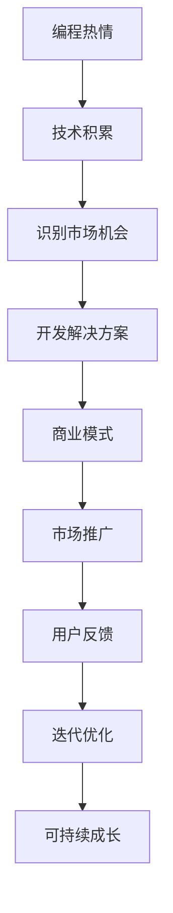

                 

## 1. 背景介绍

编程热情与创业动力在本质上都源于对技术的深入热爱和对创新的持续追求。然而，如何将这份热情转化为实际的创业成果，却是一个需要深入思考和实践的问题。本文旨在探讨这一话题，为编程爱好者提供一些建议和思路，帮助他们将编程热情转化为创业动力。

## 2. 核心概念与联系

### 2.1 核心概念概述

1. **编程热情**：对编程技术和创新的持续热情，表现为不断学习和实践新技术的强烈愿望。
2. **创业动力**：将编程技能和创新想法转化为商业价值的动力，包括识别市场需求、构建解决方案和实现商业化过程。
3. **技术创业**：利用编程技能和创新技术，创造新产品或服务，实现商业化目标的创业过程。
4. **商业模式**：为了实现持续盈利，企业需要建立和维护的商业运作模式，包括产品定价、市场定位、客户获取等策略。
5. **用户需求**：企业的产品和服务必须满足用户的需求，解决他们的痛点，才能获得市场认可。

### 2.2 核心概念原理和架构的 Mermaid 流程图



该流程图展示了编程热情如何通过技术积累、市场机会识别、解决方案开发、商业模式构建、市场推广和用户反馈迭代等环节，最终实现可持续的商业成长。

## 3. 核心算法原理 & 具体操作步骤

### 3.1 算法原理概述

编程热情转化为创业动力的过程，可以看作是一个迭代优化过程。以下步骤概述了这一过程的关键环节：

1. **技术积累**：通过持续学习和实践，掌握最新的编程技术和工具，积累技术储备。
2. **市场机会识别**：通过市场调研和用户访谈，发现潜在需求和未被满足的痛点。
3. **解决方案开发**：结合技术积累和市场需求，开发创新的产品或服务。
4. **商业模式构建**：根据产品特性和市场需求，设计合理的商业模式，包括定价策略、市场定位等。
5. **市场推广**：通过营销和销售策略，吸引目标用户，获取市场份额。
6. **用户反馈和迭代优化**：根据用户反馈，不断优化产品和服务，提升用户体验。

### 3.2 算法步骤详解

**Step 1: 技术积累**

- **学习**：参加线上线下培训、阅读技术书籍、参与开源项目等，不断学习新技术和新工具。
- **实践**：通过实际项目实践，积累经验，提升解决问题的能力。
- **反思**：定期回顾所学知识，总结经验教训，提升技术水平。

**Step 2: 市场机会识别**

- **调研**：通过行业报告、市场分析和用户访谈，了解目标市场和用户需求。
- **洞察**：分析市场趋势和竞争格局，识别未被满足的需求和痛点。
- **验证**：通过最小可行性产品(MVP)测试，验证市场需求和用户接受度。

**Step 3: 解决方案开发**

- **设计**：根据市场需求和用户反馈，设计创新的产品或服务。
- **开发**：使用编程技能，实现产品或服务的核心功能。
- **测试**：进行单元测试、集成测试和用户测试，确保产品质量。

**Step 4: 商业模式构建**

- **价值主张**：明确产品或服务为用户提供的具体价值和优势。
- **定价策略**：根据市场竞争和用户需求，制定合理的定价策略。
- **市场定位**：确定目标用户群体，制定市场推广策略。

**Step 5: 市场推广**

- **营销**：通过内容营销、社交媒体和搜索引擎优化(SEO)等手段，提升品牌知名度。
- **销售**：建立销售渠道，获取用户反馈，不断优化销售策略。
- **合作**：寻找合作伙伴，扩大市场影响力，共同开发市场。

**Step 6: 用户反馈和迭代优化**

- **收集**：通过用户反馈、市场调研和数据分析，收集用户需求和建议。
- **分析**：分析用户反馈，找出问题和改进点。
- **优化**：根据用户反馈，不断优化产品和服务，提升用户体验。

### 3.3 算法优缺点

**优点**：
1. **创新性强**：通过技术积累和市场调研，可以发现新的市场需求和创新点。
2. **风险可控**：通过小规模测试和快速迭代，可以降低失败风险。
3. **灵活性高**：可以根据用户反馈和市场变化，灵活调整产品和服务。

**缺点**：
1. **资源投入大**：需要大量时间和金钱投入技术积累和市场调研。
2. **竞争激烈**：市场上的竞争者众多，需要不断创新才能保持竞争力。
3. **用户需求变化快**：市场需求和用户需求变化快，需要持续跟踪和优化。

### 3.4 算法应用领域

技术创业的典型应用领域包括但不限于以下几个方面：

- **软件即服务(SaaS)**：提供云端软件解决方案，如项目管理、CRM、ERP等。
- **移动应用**：开发移动应用，满足用户移动端的各种需求。
- **电子商务**：开发电商平台，提供便捷的购物体验。
- **人工智能**：利用机器学习和深度学习技术，开发智能产品和服务。
- **区块链**：利用区块链技术，提供安全的交易和数据存储服务。

## 4. 数学模型和公式 & 详细讲解 & 举例说明

### 4.1 数学模型构建

我们可以使用数学模型来描述编程热情转化为创业动力的过程。设 $T$ 为编程热情的强度，$M$ 为技术积累，$O$ 为市场机会识别，$S$ 为解决方案开发，$B$ 为商业模式构建，$P$ 为市场推广，$F$ 为用户反馈和迭代优化。则整个转化过程可以用以下模型表示：

$$
T_{out} = f(T_{in}, M, O, S, B, P, F)
$$

其中 $T_{in}$ 为原始编程热情强度，$T_{out}$ 为最终创业动力的强度。各环节之间的关系可以表示为：

$$
M = g(T_{in})
$$
$$
O = h(M)
$$
$$
S = i(O)
$$
$$
B = j(S)
$$
$$
P = k(B)
$$
$$
F = l(P)
$$
$$
T_{out} = m(M, O, S, B, P, F)
$$

### 4.2 公式推导过程

以上模型中的每个函数都是非线性的，因此需要使用迭代方法求解。假设 $T_{in}$ 为1（表示完全的编程热情），各环节的转换效率分别为 $c_1, c_2, c_3, c_4, c_5, c_6$，则最终创业动力的强度 $T_{out}$ 可以表示为：

$$
T_{out} = c_1 c_2 c_3 c_4 c_5 c_6
$$

其中 $c_1 = f_1(T_{in})$，$c_2 = f_2(T_{in}, M)$，$c_3 = f_3(M, O)$，$c_4 = f_4(O, S)$，$c_5 = f_5(S, B)$，$c_6 = f_6(B, F)$。

### 4.3 案例分析与讲解

以开发一款基于区块链技术的供应链管理系统为例：

1. **编程热情**：开发者对区块链技术充满热情，希望通过创新实现供应链管理的自动化。
2. **技术积累**：开发者不断学习区块链和供应链管理的相关知识，积累技术储备。
3. **市场机会识别**：通过市场调研，发现供应链管理中的数据共享和透明性问题。
4. **解决方案开发**：开发者设计并开发了基于区块链的供应链管理系统，确保数据的安全共享和透明性。
5. **商业模式构建**：针对中小企业用户，采用低成本的订阅制商业模式，提供基础版和高级版两种选择。
6. **市场推广**：通过内容营销和社交媒体推广，吸引用户试用并购买。
7. **用户反馈和迭代优化**：根据用户反馈，不断优化系统功能和用户体验，提升产品竞争力。

最终，开发者成功地将编程热情转化为创业动力，开发出一款成功的供应链管理系统。

## 5. 项目实践：代码实例和详细解释说明

### 5.1 开发环境搭建

1. **安装编程环境**：
   - **Python**：安装最新版本的Python，确保所有必要的库和框架都能兼容。
   - **开发框架**：选择适合的Web框架（如Django、Flask）和数据库系统（如MySQL、PostgreSQL）。
   - **版本控制**：使用Git进行版本控制，方便团队协作和代码管理。

2. **环境配置**：
   - **虚拟环境**：使用虚拟环境管理工具（如virtualenv、conda），创建独立的开发环境。
   - **依赖管理**：使用Pip或Conda管理项目所需的第三方库和依赖。
   - **开发工具**：配置开发工具（如IDE、编辑器、调试工具），提升开发效率。

### 5.2 源代码详细实现

以下是一个简单的Web应用程序示例，用于演示如何将编程热情转化为创业动力：

```python
# 示例代码：基于Django的Web应用程序

# 设置Django项目
django-admin startproject myproject

# 设置Django应用
myproject/settings.py 添加应用设置

# 定义模型
myproject/models.py 定义数据模型

# 编写视图
myproject/views.py 编写视图函数

# 配置路由
myproject/urls.py 配置路由

# 编写模板
myproject/templates 编写HTML模板

# 执行迁移
python manage.py makemigrations
python manage.py migrate

# 启动开发服务器
python manage.py runserver
```

### 5.3 代码解读与分析

- **模型设计**：根据项目需求，设计合适的数据模型，确保数据的完整性和一致性。
- **视图编写**：根据用户交互需求，编写视图函数，处理用户请求并返回响应。
- **路由配置**：配置路由，将URL映射到相应的视图函数，构建Web应用程序的结构。
- **模板编写**：编写HTML模板，定义用户界面的展示效果。

### 5.4 运行结果展示

运行开发服务器后，可以在浏览器中访问应用程序，查看用户界面和功能展示。

```python
# 示例代码：查看用户界面

# 打开浏览器，输入URL
http://localhost:8000/
```

## 6. 实际应用场景

### 6.1 智能教育平台

基于编程热情和创业动力的智能教育平台，可以提供个性化的学习体验，帮助学生高效学习。开发平台可以通过编程练习、智能评测和数据驱动的教学方法，提升学生的学习效果。

### 6.2 健康管理应用

开发一款基于编程热情的智能健康管理应用，可以提供个性化健康建议、饮食计划和运动指导，帮助用户管理健康，提升生活质量。

### 6.3 金融科技

利用编程热情和技术积累，开发金融科技应用，如智能投顾、风险评估和区块链金融服务等，提升金融服务的效率和安全性。

### 6.4 未来应用展望

随着编程技术的不断进步和创业环境的日益成熟，编程热情和技术创业将迎来更多的机遇和挑战。未来，编程热情和技术创业将可能应用于更多领域，如物联网、虚拟现实、智能家居等，带来更广泛的社会影响。

## 7. 工具和资源推荐

### 7.1 学习资源推荐

1. **《代码之美》**：张林编译的编程经典书籍，涵盖编程哲学、设计模式和技术实践。
2. **《代码大全》**：Steve McConnell编写的经典编程指南，提供编程最佳实践和经验总结。
3. **Coursera**：在线学习平台，提供丰富的编程和创业课程。
4. **Udacity**：提供编程和创业相关的NanoDegree课程，帮助学习者系统掌握相关知识。

### 7.2 开发工具推荐

1. **Git**：版本控制工具，用于代码管理和团队协作。
2. **Jupyter Notebook**：交互式编程环境，方便数据科学和机器学习任务。
3. **PyCharm**：Python IDE，提供代码编辑、调试和项目管理功能。
4. **Django**：Python Web框架，方便开发Web应用程序。

### 7.3 相关论文推荐

1. **《编程就是一切》**：Ward Cunningham撰写的编程哲学著作，探讨编程的意义和价值。
2. **《编程的艺术》**：Micah Zabansky撰写的编程美学书籍，探讨编程的艺术性和创造性。
3. **《创业革命》**：Eric Ries撰写的创业指南，提供创业成功的方法和策略。

## 8. 总结：未来发展趋势与挑战

### 8.1 研究成果总结

编程热情和技术创业的结合，为技术人才提供了一个将创意和热情转化为实际成果的途径。通过技术积累和市场调研，可以识别新的市场需求和创新点，开发出创新的产品和服务，实现商业化。

### 8.2 未来发展趋势

1. **人工智能与创业的融合**：人工智能技术将为创业提供更强大的数据驱动和自动化支持，提升创业效率和成功率。
2. **区块链技术的应用**：区块链技术将为创业提供更安全、透明和可信任的基础设施，拓展创业场景和应用。
3. **编程教育的普及**：编程教育的普及将培养更多技术人才，为创业提供更多资源和动力。
4. **云计算和大数据的应用**：云计算和大数据技术将为创业提供更强大的计算和存储能力，支持大规模应用开发。

### 8.3 面临的挑战

1. **技术迭代快**：技术迭代速度加快，需要持续学习和更新技术知识。
2. **市场需求多变**：市场需求多变，需要快速调整产品和服务。
3. **资源投入大**：创业初期需要大量资源投入，包括资金、时间和人力。
4. **竞争激烈**：市场竞争激烈，需要不断创新才能保持竞争优势。
5. **用户需求复杂**：用户需求复杂多变，需要持续跟踪和优化。

### 8.4 研究展望

未来的编程热情和技术创业将更加注重创新性和多样性，结合人工智能、区块链、云计算等新技术，拓展更多的应用场景和市场机会。同时，加强技术人才培养和教育普及，提升技术人才的创业能力和水平。

## 9. 附录：常见问题与解答

**Q1: 编程热情和技术创业如何结合？**

A: 通过技术积累和市场调研，识别新的市场需求和创新点，开发出创新的产品和服务，实现商业化。

**Q2: 如何识别市场需求？**

A: 通过市场调研和用户访谈，了解目标市场和用户需求，分析市场趋势和竞争格局，识别未被满足的痛点。

**Q3: 如何构建商业模式？**

A: 明确产品或服务为用户提供的具体价值和优势，制定合理的定价策略和市场定位，设计可持续的商业模式。

**Q4: 如何应对技术迭代快的问题？**

A: 持续学习和更新技术知识，保持技术前沿，灵活应对技术变化。

**Q5: 如何应对市场需求多变的问题？**

A: 根据用户反馈和市场变化，不断调整产品和服务，保持灵活性。

---

作者：禅与计算机程序设计艺术 / Zen and the Art of Computer Programming

