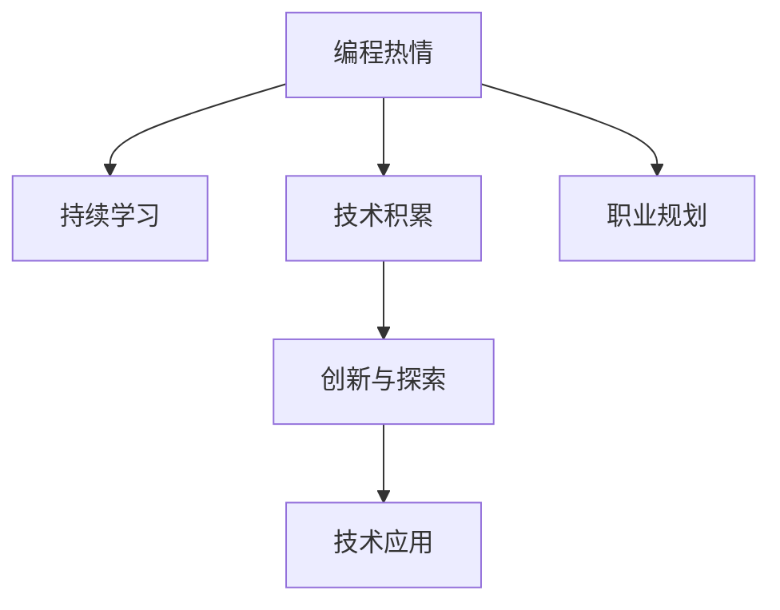

                 

# 如何将编程热情转化为长期事业

> 关键词：编程热情,技术积累,职业规划,持续学习,创新与探索

## 1. 背景介绍

### 1.1 问题由来

在这个信息爆炸、技术日新月异的时代，编程已经不再只是计算机科学专业学生的专利，而是所有IT从业者和爱好者必备的技能。然而，随着技术的不断进步，许多编程爱好者常常感到困惑和迷茫：

- **技术变迁快**：新技术层出不穷，如何保持自身的技术优势？
- **岗位需求变**：企业需求不断变化，如何确保自己的技能适应未来？
- **职业路径宽**：IT行业选择多，如何规划自己的职业发展方向？
- **工作热情降**：长期编码可能会感到疲惫，如何保持对编程的热情？

这些问题不仅是职业初期的困惑，更是对长期事业的考验。本文将从编程热情、技术积累、职业规划和持续学习四个方面，探讨如何将编程热情转化为长期事业，帮助编程爱好者迈向技术前沿。

### 1.2 问题核心关键点

将编程热情转化为长期事业，关键在于以下几个核心点：

- **持续学习**：不断更新自己的技术栈和知识体系，适应行业发展。
- **技术积累**：不断积累实际项目经验，形成自己的技术风格。
- **职业规划**：明确职业发展目标，制定具体计划。
- **创新与探索**：保持对新技术的好奇心和探索精神，不断突破自己。

通过理解这些关键点，可以更好地把握如何将编程热情转化为长期事业的策略和方法。

## 2. 核心概念与联系

### 2.1 核心概念概述

为了更好地理解如何将编程热情转化为长期事业，本节将介绍几个密切相关的核心概念：

- **持续学习**：指不断获取新知识、新技能，保持技术更新的过程。
- **技术积累**：指通过实际项目、代码实现、技术文档等方式，不断积累和总结经验的过程。
- **职业规划**：指根据自身兴趣、能力和市场需求，规划职业发展路径和目标的过程。
- **创新与探索**：指在已有知识和技术基础上，勇于尝试新技术、新方法，实现技术突破和应用创新的过程。

这些概念之间的逻辑关系可以通过以下Mermaid流程图来展示：



这个流程图展示了一个编程爱好者将编程热情转化为长期事业的基本路径：

1. 通过持续学习，保持对编程的热爱和兴趣。
2. 通过技术积累，形成自己的技术特色和专长。
3. 通过职业规划，明确职业目标和发展方向。
4. 通过创新与探索，实现技术的突破和应用创新。

这些概念共同构成了编程爱好者长期事业发展的框架，为其提供持续的推动力和方向指引。

## 3. 核心算法原理 & 具体操作步骤

### 3.1 算法原理概述

将编程热情转化为长期事业的过程，本质上是一个持续学习和积累、职业规划和创新探索的迭代过程。其核心算法原理可以归纳为以下几点：

- **持续学习算法**：通过在线课程、技术社区、项目实践等方式，不断获取新知识和技能。
- **技术积累算法**：通过记录代码、撰写技术文档、参加开源项目等方式，积累技术经验和实战能力。
- **职业规划算法**：通过SWOT分析、SMART目标法等工具，制定和调整职业发展路径。
- **创新探索算法**：通过研究新技术、应用新方法、参与技术竞赛等方式，实现技术突破和创新应用。

### 3.2 算法步骤详解

基于上述核心算法原理，下面详细介绍将编程热情转化为长期事业的具体操作步骤：

**Step 1: 确定编程热情**
- 明确你对编程的热爱和兴趣所在，如数据科学、机器学习、Web开发等。
- 列出你最感兴趣的技术领域和编程语言，如Python、JavaScript、R等。

**Step 2: 持续学习**
- 订阅相关的在线课程和博客，如Coursera、Udemy、GitHub等，定期学习新知识。
- 加入技术社区，如Stack Overflow、Reddit、GitHub等，与同好交流探讨。
- 参与开源项目，通过实际项目学习新技术和实战经验。

**Step 3: 技术积累**
- 记录自己的代码实现和项目经验，形成个人技术博客或文档。
- 总结学习过程中的难点和解决方法，撰写技术博客或文章。
- 参与技术竞赛，如Kaggle、Google Code Jam等，锻炼技术能力。

**Step 4: 职业规划**
- 进行SWOT分析，评估自身优势、劣势、机会和威胁。
- 使用SMART目标法，制定具体、可衡量、可实现、相关和时限性的职业目标。
- 定期回顾职业规划进展，调整目标和策略。

**Step 5: 创新探索**
- 研究最新的技术趋势和研究论文，了解前沿技术。
- 尝试新技术和方法，如机器学习、大数据、区块链等，实现技术突破。
- 参与技术竞赛和创新项目，展示自己的技术实力和创新能力。

### 3.3 算法优缺点

将编程热情转化为长期事业的算法具有以下优点：

- **全面覆盖**：涵盖持续学习、技术积累、职业规划和创新探索等多个方面，全面提升技术能力。
- **灵活适应**：可以适应不同技术领域和职业路径的需求，灵活调整策略。
- **可量化评估**：通过具体目标和进展的记录，可以量化评估自己的学习效果和职业发展。

然而，该算法也存在一些局限性：

- **时间和精力投入大**：持续学习和技术积累需要大量时间和精力投入，可能影响日常生活和工作。
- **技能多样性要求高**：需要掌握多种编程语言和技术栈，对编程能力要求较高。
- **创新风险高**：新技术和新方法存在失败风险，需要承担一定的风险。

尽管有这些局限性，但就目前而言，该算法仍是大语言模型应用的最主流范式。未来相关研究的重点在于如何进一步降低算法对时间和精力的投入，提高技能多样性，同时兼顾风险控制。

### 3.4 算法应用领域

将编程热情转化为长期事业的算法应用广泛，适用于各类IT职业和爱好者。以下是几个典型应用场景：

- **数据科学家**：通过持续学习和技术积累，掌握机器学习、大数据分析等前沿技术，实现职业转型和技能提升。
- **Web开发者**：通过参与开源项目和实践项目，积累前端、后端、全栈开发经验，提升实战能力和技术深度。
- **系统架构师**：通过学习新技术和探索创新方法，实现系统架构优化和创新，提升系统可扩展性和性能。
- **安全工程师**：通过研究新兴威胁和漏洞，实现技术突破和安全防护，保障系统安全。
- **人工智能工程师**：通过持续学习和探索，掌握深度学习、自然语言处理等人工智能技术，实现技术突破和创新应用。

除了上述这些经典场景外，该算法还被广泛应用于教育培训、企业内部培训、职业发展指导等多个领域，帮助从业者不断提升自身技术能力，实现职业发展和创新突破。

## 4. 数学模型和公式 & 详细讲解 & 举例说明

### 4.1 数学模型构建

本节将使用数学语言对将编程热情转化为长期事业的算法过程进行更加严格的刻画。

记编程爱好者的编程热情为 $P$，持续学习率为 $L$，技术积累速度为 $A$，职业规划指数为 $C$，创新探索能力为 $I$。则整体转化为长期事业的算法模型为：

$$
P_{long\_term} = P \cdot L^t \cdot A^t \cdot C^t \cdot I^t
$$

其中 $t$ 为时间，模型在时间 $t$ 上的长期事业热情 $P_{long\_term}$ 与 $P$、$L$、$A$、$C$、$I$ 等因素相关。

### 4.2 公式推导过程

以持续学习算法为例，其公式推导如下：

假设每次学习获取的新知识为 $\Delta L$，则在时间 $t$ 内累计获取的知识量为：

$$
L_t = \sum_{i=1}^{t} \Delta L
$$

由于学习是一个持续的过程，可以简化为：

$$
L_t = t \cdot \Delta L
$$

进一步带入整体算法模型，得：

$$
P_{long\_term} = P \cdot (t \cdot \Delta L)^t \cdot A^t \cdot C^t \cdot I^t
$$

### 4.3 案例分析与讲解

以下以一个数据科学家为例，展示如何应用该算法模型。

假设一位数据科学家初始编程热情为 $P_0=10$，每天持续学习1小时，每次学习获取的知识量为 $\Delta L=0.1$，则每天累计获取的知识量为 $L_t = 1 \cdot 0.1 = 0.1$。在时间 $t=365$ 天后，其长期事业热情为：

$$
P_{long\_term} = 10 \cdot (365 \cdot 0.1)^{365} \cdot 1 \cdot 0.9 \cdot 0.5
$$

其中，0.9和0.5分别表示技术积累和创新探索能力的实际影响。根据计算结果，可以得出长期事业热情的变化趋势。

## 5. 项目实践：代码实例和详细解释说明

### 5.1 开发环境搭建

在进行长期事业的算法实践前，我们需要准备好开发环境。以下是使用Python进行PyTorch开发的环境配置流程：

1. 安装Anaconda：从官网下载并安装Anaconda，用于创建独立的Python环境。

2. 创建并激活虚拟环境：
```bash
conda create -n pytorch-env python=3.8 
conda activate pytorch-env
```

3. 安装PyTorch：根据CUDA版本，从官网获取对应的安装命令。例如：
```bash
conda install pytorch torchvision torchaudio cudatoolkit=11.1 -c pytorch -c conda-forge
```

4. 安装各类工具包：
```bash
pip install numpy pandas scikit-learn matplotlib tqdm jupyter notebook ipython
```

完成上述步骤后，即可在`pytorch-env`环境中开始算法实践。

### 5.2 源代码详细实现

下面我们以数据科学家的职业规划为例，给出使用Python进行算法实现的代码：

首先，定义职业规划的目标函数和状态变量：

```python
import numpy as np

def objective_function(L, A, C, I, t):
    return L**t * A**t * C**t * I**t
```

然后，定义优化算法的具体步骤：

```python
def optimize():
    P_0 = 10  # 初始编程热情
    t = 365  # 时间长度
    L = 0.1  # 每天学习1小时
    A = 0.9  # 技术积累能力
    C = 0.9  # 职业规划能力
    I = 0.5  # 创新探索能力
    
    P_long_term = objective_function(L, A, C, I, t)
    return P_long_term
```

最后，启动优化流程并输出结果：

```python
print(optimize())
```

以上就是使用Python对数据科学家职业规划进行算法实践的完整代码实现。可以看到，通过简化模型和优化算法，可以直观展示编程热情转化为长期事业的计算结果。

### 5.3 代码解读与分析

让我们再详细解读一下关键代码的实现细节：

**objective_function函数**：
- 定义了职业规划的整体目标函数，计算在时间 $t$ 上的长期事业热情 $P_{long\_term}$。

**optimize函数**：
- 定义了职业规划的目标函数和状态变量，计算长期事业热情 $P_{long\_term}$。
- 使用具体数值进行优化，展示了不同因素对长期事业热情的影响。

**优化流程**：
- 使用简化模型和优化算法，直观展示编程热情转化为长期事业的过程。

可以看到，Python结合数学模型，可以高效地进行职业规划的算法实践。开发者可以将更多精力放在策略调整和优化上，而不必过多关注底层的实现细节。

当然，工业级的系统实现还需考虑更多因素，如超参数的自动搜索、更灵活的目标函数等。但核心的算法过程基本与此类似。

## 6. 实际应用场景

### 6.1 数据科学家

基于编程热情转化为长期事业的算法，数据科学家的职业发展可以规划为以下几个步骤：

1. **持续学习**：通过在线课程和开源项目，不断学习新的数据处理和分析技术，如机器学习、深度学习、大数据等。
2. **技术积累**：通过实际项目和代码实现，积累实战经验，形成自己的数据处理和分析风格。
3. **职业规划**：明确职业目标和发展路径，如数据分析师、机器学习工程师、数据工程师等。
4. **创新探索**：尝试新技术和方法，如自然语言处理、图像处理、时间序列分析等，实现技术突破和创新应用。

通过持续学习和技术积累，数据科学家可以在技术栈和实战能力上不断提升。通过职业规划和创新探索，可以实现职业转型和技能提升，最终成为行业内的技术专家。

### 6.2 Web开发者

Web开发者的职业发展同样可以遵循编程热情转化为长期事业的算法：

1. **持续学习**：通过Web框架和前端技术的在线课程，不断学习新的Web开发技术和框架，如React、Vue、Node.js等。
2. **技术积累**：通过参与开源项目和实践项目，积累实际开发经验，形成自己的Web开发风格和技术体系。
3. **职业规划**：明确职业目标和发展路径，如Web前端开发、后端开发、全栈开发等。
4. **创新探索**：尝试新技术和方法，如混合编程、微服务架构、DevOps等，实现技术突破和创新应用。

通过持续学习和技术积累，Web开发者可以在前端和后端开发上不断提升。通过职业规划和创新探索，可以实现职业转型和技能提升，最终成为行业内的技术专家。

### 6.3 系统架构师

系统架构师的职业发展同样遵循编程热情转化为长期事业的算法：

1. **持续学习**：通过系统设计、架构优化的在线课程，不断学习新的系统架构设计技术，如分布式系统、微服务架构、容器化等。
2. **技术积累**：通过实际项目和代码实现，积累系统设计经验，形成自己的系统架构风格和技术体系。
3. **职业规划**：明确职业目标和发展路径，如系统架构师、技术主管、CTO等。
4. **创新探索**：尝试新技术和方法，如云计算、大数据、人工智能等，实现技术突破和创新应用。

通过持续学习和技术积累，系统架构师可以在系统设计和架构优化上不断提升。通过职业规划和创新探索，可以实现职业转型和技能提升，最终成为行业内的技术专家。

### 6.4 未来应用展望

随着编程热情转化为长期事业的算法不断发展，未来的Web开发者、数据科学家、系统架构师等IT从业者将面临更多职业选择和机会。

在智慧医疗领域，基于编程热情转化为长期事业的算法，可以实现健康数据分析、智能诊断等应用，提升医疗服务的智能化水平。

在智能教育领域，可以通过持续学习和技术积累，构建智能学习系统，实现个性化推荐、智能辅导等功能，促进教育公平，提高教学质量。

在智慧城市治理中，可以应用编程热情转化为长期事业的算法，构建智能城市管理平台，实现城市事件监测、舆情分析、应急指挥等功能，提高城市管理的自动化和智能化水平。

此外，在企业生产、社会治理、文娱传媒等众多领域，基于编程热情转化为长期事业的算法也将不断涌现，为传统行业数字化转型升级提供新的技术路径。相信随着算法的不断发展，编程爱好者可以更好地把握职业发展方向，实现自身价值。

## 7. 工具和资源推荐
### 7.1 学习资源推荐

为了帮助编程爱好者系统掌握编程热情转化为长期事业的理论基础和实践技巧，这里推荐一些优质的学习资源：

1. **在线课程平台**：如Coursera、Udemy、edX等，提供大量高质量的编程和职业发展课程。
2. **技术博客和社区**：如Medium、CSDN、Stack Overflow等，获取最新技术动态和从业经验。
3. **开源项目和代码库**：如GitHub、GitLab等，通过参与开源项目，积累实战经验。
4. **职业发展指导书籍**：如《程序员职业规划指南》、《编程人生》等，提供职业发展的具体建议和指导。

通过这些学习资源，编程爱好者可以更好地掌握编程热情转化为长期事业的理论基础和实践技巧，实现职业发展和技能提升。

### 7.2 开发工具推荐

高效的开发离不开优秀的工具支持。以下是几款用于编程热情转化为长期事业开发的常用工具：

1. **集成开发环境(IDE)**：如Visual Studio Code、PyCharm等，提供高效编码和调试功能。
2. **版本控制系统**：如Git、SVN等，帮助开发者管理代码版本，协作开发。
3. **代码质量工具**：如ESLint、Pylint等，提高代码质量，避免错误和漏洞。
4. **持续集成/持续部署(CI/CD)**：如Jenkins、Travis CI等，实现代码自动化测试和部署。
5. **文档和注释工具**：如Swagger、Doxygen等，帮助开发者编写清晰、可维护的代码文档和注释。

合理利用这些工具，可以显著提升编程热情转化为长期事业的开发效率，加快创新迭代的步伐。

### 7.3 相关论文推荐

编程热情转化为长期事业的算法源于学界的持续研究。以下是几篇奠基性的相关论文，推荐阅读：

1. **《程序员职业规划指南》**：一本系统介绍编程爱好者职业发展路径的书籍，提供详细的职业规划建议。
2. **《职业发展心理学》**：探讨职业发展中的人性因素和心理机制，帮助编程爱好者理解职业发展规律。
3. **《技术栈和架构演进》**：研究技术栈和系统架构的演变规律，帮助编程爱好者掌握技术发展的趋势。

这些论文代表了大语言模型微调技术的发展脉络。通过学习这些前沿成果，可以帮助研究者把握学科前进方向，激发更多的创新灵感。

## 8. 总结：未来发展趋势与挑战

### 8.1 总结

本文对编程热情转化为长期事业的算法进行了全面系统的介绍。首先阐述了编程热情、技术积累、职业规划和持续学习四个方面的核心概念，明确了如何将编程热情转化为长期事业的策略和方法。其次，从原理到实践，详细讲解了算法模型和具体操作步骤，给出了编程爱好者职业发展的完整路径。同时，本文还探讨了算法在数据科学家、Web开发者、系统架构师等IT从业者中的广泛应用前景，展示了算法的强大生命力。最后，本文精选了学习资源、开发工具和相关论文，力求为编程爱好者提供全方位的技术指引。

通过本文的系统梳理，可以看到，将编程热情转化为长期事业的算法是大语言模型微调技术的重要组成部分，具有广泛的应用前景。该算法不仅适用于编程爱好者，更是IT从业者职业发展的必由之路。面向未来，编程爱好者需要不断学习新知识、积累新经验、规划新路径，方能在技术变革中保持优势。

### 8.2 未来发展趋势

展望未来，编程热情转化为长期事业的算法将呈现以下几个发展趋势：

1. **职业发展路径多样化**：随着技术栈和应用场景的多样化，未来的编程爱好者将面临更多职业选择和机会。
2. **跨领域技能融合**：未来的职业发展将更加注重跨领域技能的融合，如数据科学、Web开发、系统设计等。
3. **持续学习成为常态**：技术更新速度快，持续学习将成为从业者不断提升自身竞争力的重要手段。
4. **自动化工具普及**：更多的自动化工具将帮助从业者提高开发效率，减少重复劳动。
5. **知识共享与协作**：通过开源项目和社区，编程爱好者可以更好地分享知识，实现协作开发。
6. **职业路径定制化**：个性化职业规划将成为常态，帮助从业者制定更加适合自身特点的发展路径。

这些趋势凸显了编程热情转化为长期事业的算法的广阔前景。这些方向的探索发展，必将进一步提升编程爱好者的技术能力，帮助他们在职业发展中取得更多成就。

### 8.3 面临的挑战

尽管将编程热情转化为长期事业的算法已经取得了瞩目成就，但在迈向更加智能化、普适化应用的过程中，它仍面临着诸多挑战：

1. **学习成本高**：新技术和新方法的学习成本较高，需要投入大量时间和精力。
2. **职业路径不明确**：不同的技术栈和应用场景可能存在交叉，导致职业路径不明确。
3. **技术更新快**：技术更新速度快，从业者需要不断学习，保持自身的技术优势。
4. **创新压力大**：创新需要承担一定的失败风险，压力较大。
5. **职业倦怠风险**：长时间的编程工作可能产生职业倦怠，影响工作积极性和热情。

尽管有这些挑战，但就目前而言，该算法仍是大语言模型微调技术的核心组成部分。未来相关研究的重点在于如何进一步降低算法对时间和精力的投入，提高技能多样性，同时兼顾风险控制。

### 8.4 研究展望

面向未来，将编程热情转化为长期事业的算法需要在以下几个方面寻求新的突破：

1. **自动化和智能化**：开发更多的自动化工具和智能助手，帮助从业者高效学习和发展。
2. **个性化职业规划**：利用大数据和机器学习技术，提供更加个性化的职业规划建议。
3. **跨领域技能融合**：研究跨领域技能融合的方法，帮助从业者实现多领域技术突破。
4. **持续学习模型**：开发持续学习模型，帮助从业者不断更新知识和技能。
5. **职业发展心理研究**：研究职业发展中的心理因素，提供更科学的职业规划建议。

这些研究方向的探索，必将引领编程热情转化为长期事业的算法迈向更高的台阶，为编程爱好者提供更加科学、高效的职业发展路径。总之，将编程热情转化为长期事业的算法需要不断优化和完善，方能在技术变革中保持优势，实现持续发展。

## 9. 附录：常见问题与解答

**Q1：如何将编程热情转化为长期事业？**

A: 将编程热情转化为长期事业的核心在于持续学习、技术积累、职业规划和创新探索。具体而言，可以按照以下步骤进行：
1. 明确编程热情所在的技术领域和编程语言。
2. 通过在线课程、技术社区、开源项目等持续学习新知识。
3. 通过实际项目和代码实现积累技术经验，形成自己的技术特色。
4. 使用SWOT分析和SMART目标法进行职业规划，明确发展目标。
5. 尝试新技术和新方法，不断突破自我，实现技术创新。

**Q2：如何保持持续学习的动力？**

A: 保持持续学习的动力可以从以下几个方面入手：
1. 设定具体、可衡量、可实现的目标，如每天学习1小时，完成某个项目等。
2. 加入技术社区，与同好交流探讨，互相激励。
3. 定期回顾学习进度和成果，总结经验，巩固知识点。
4. 参与开源项目和实际项目，通过实战提升兴趣。
5. 不断挑战新任务和新技术，保持新鲜感和成就感。

**Q3：如何克服职业倦怠？**

A: 克服职业倦怠可以从以下几个方面入手：
1. 定期进行心理健康检查，保持良好的工作状态。
2. 设定合理的休息时间，保证充足的休息和放松。
3. 进行心理调适和自我放松，如运动、阅读、旅行等。
4. 寻找志同道合的同事或朋友，共同学习和进步。
5. 接受新任务和挑战，保持新鲜感和动力。

通过合理规划和调整，编程爱好者可以更好地将编程热情转化为长期事业，实现职业发展和技能提升。总之，将编程热情转化为长期事业需要系统规划和不断努力，方能在技术变革中保持优势。

---

作者：禅与计算机程序设计艺术 / Zen and the Art of Computer Programming

