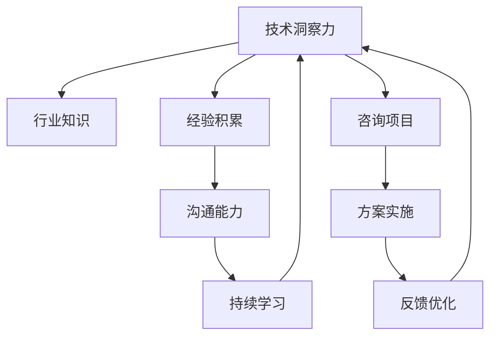

                 

# 如何将编程经验转化为技术咨询服务

## 1. 背景介绍

### 1.1 问题由来

在信息化时代，企业IT部门的角色和职责也在不断变化。随着云计算、大数据、人工智能等技术的兴起，企业IT部门已经从传统的系统运维、网络保障等角色，转变为平台架构、数据分析、创新应用的推动者。面对快速变化的市场需求和业务环境，企业需要快速响应和部署新技术，实现数字化转型。然而，技术架构的复杂性、业务需求的特殊性、技术栈的多样性等因素，使得企业IT部门面临巨大的挑战。

技术咨询服务作为连接技术与业务的关键桥梁，在帮助企业克服这些挑战、实现价值最大化方面扮演着越来越重要的角色。然而，技术咨询服务不仅需要深入的技术洞察力，还需要广泛的行业知识、丰富的经验积累和卓越的沟通能力。如何将积累的编程经验转化为高效的技术咨询服务，成为摆在每一位IT从业者面前的重要课题。

### 1.2 问题核心关键点

将编程经验转化为技术咨询服务的核心关键点在于：

- 技术洞察力：准确把握技术趋势和应用场景，为企业提供有价值的指导和建议。
- 行业知识：了解特定行业的特点和需求，能够将技术方案与业务目标有效结合。
- 经验积累：总结在实际项目中遇到的问题和解决方法，形成可复用的解决方案。
- 沟通能力：能够清晰表达技术方案，与业务团队有效沟通，推动项目实施。
- 持续学习：技术不断迭代更新，需要保持持续学习，提升技术水平和咨询能力。

### 1.3 问题研究意义

将编程经验转化为技术咨询服务，对于提升企业IT部门的服务质量、推动数字化转型、加速业务创新具有重要意义：

1. 提升服务质量：技术咨询服务可以为企业提供专业的技术指导和支持，提升系统稳定性、安全性、扩展性。
2. 推动数字化转型：技术咨询服务帮助企业发现和解决业务瓶颈，实现业务数字化和智能化。
3. 加速业务创新：通过深入了解业务需求和痛点，技术咨询服务能够提供符合业务目标的技术方案，推动产品创新和商业模式变革。
4. 增强竞争力：借助技术咨询服务，企业能够快速响应市场变化，提升市场竞争力。
5. 提升团队能力：技术咨询服务需要跨部门协作，有助于提升团队的整体技术水平和项目管理能力。

## 2. 核心概念与联系

### 2.1 核心概念概述

为了更好地理解如何将编程经验转化为技术咨询服务，本节将介绍几个关键概念：

- **技术洞察力**：对技术的本质、优缺点、适用场景有深刻理解，能够提出有针对性的建议和解决方案。
- **行业知识**：了解特定行业的业务模式、数据特点、法律法规等，能够将技术方案与行业需求有效结合。
- **经验积累**：在实际项目中遇到的问题、解决方法、最佳实践等的积累，形成可复用的知识库。
- **沟通能力**：能够清晰、准确地表达技术方案，与业务团队进行有效沟通，达成共识。
- **持续学习**：保持技术更新和知识更新，不断提升咨询能力和技术水平。

这些概念之间的联系可以通过以下Mermaid流程图来展示：



这个流程图展示了一些关键概念以及它们之间的关系：

1. 技术洞察力是核心，帮助理解技术本质。
2. 行业知识需要结合技术洞察力，理解业务需求。
3. 经验积累提供实践依据，形成有价值的解决方案。
4. 沟通能力保证技术方案与业务团队的有效交流。
5. 持续学习保持知识更新，提升咨询能力。
6. 这些概念共同构成技术咨询服务的基础，支撑咨询项目从方案提出到反馈优化全流程。

## 3. 核心算法原理 & 具体操作步骤
### 3.1 算法原理概述

技术咨询服务的过程可以视为一种优化问题。假设咨询项目的目标函数为 $f(x)$，其中 $x$ 代表咨询方案的各个方面，如技术选型、架构设计、性能优化等。我们的目标是找到最优的 $x$，使得 $f(x)$ 达到最大值。

基于这一目标，我们可以将技术咨询服务的步骤分解为以下四个部分：

1. **需求分析**：明确客户的需求和痛点，确定咨询项目的目标和范围。
2. **方案设计**：根据需求，提出多种技术方案，并进行优劣对比。
3. **方案实施**：将优选方案付诸实施，并进行监控和优化。
4. **反馈优化**：根据项目反馈，不断优化方案，提升服务质量。

### 3.2 算法步骤详解

以下是将编程经验转化为技术咨询服务的具体步骤：

#### 第一步：需求分析

1. **客户访谈**：与客户进行深入访谈，了解其业务背景、技术需求、业务目标等。
2. **业务调研**：分析客户业务流程、数据特点、业务瓶颈等，找出技术解决方案的切入点。
3. **需求整理**：将访谈和调研结果整理成具体的需求文档，明确咨询项目的范围和目标。

#### 第二步：方案设计

1. **技术选型**：根据需求，选择合适的技术栈和框架，列出多个备选方案。
2. **方案评估**：对每个备选方案进行技术评估，考虑性能、可扩展性、安全性、成本等因素。
3. **方案优化**：根据评估结果，对优选方案进行优化，确保方案可行、高效。

#### 第三步：方案实施

1. **设计架构**：根据优化后的方案，设计系统的架构和技术栈。
2. **开发实现**：按照设计架构，进行系统的开发和实现。
3. **测试验证**：对开发结果进行测试验证，确保系统功能和性能符合要求。

#### 第四步：反馈优化

1. **用户验收**：向客户展示项目成果，收集客户反馈。
2. **问题调试**：根据客户反馈，进行问题调试和修复。
3. **方案优化**：结合客户反馈，进一步优化方案，提升系统性能和用户体验。

### 3.3 算法优缺点

将编程经验转化为技术咨询服务具有以下优点：

1. **快速响应**：具备丰富的编程经验，可以快速响应客户需求，提供定制化的解决方案。
2. **高效沟通**：对技术原理和实现细节有深刻理解，能够清晰地向客户解释复杂的技术方案。
3. **质量保证**：有丰富的实践经验，能够预见潜在问题，避免在项目实施中出现问题。
4. **技术创新**：不断更新技术知识，能够提供前沿的技术方案，推动业务创新。

同时，该方法也存在一些局限性：

1. **行业知识不足**：编程经验主要集中在技术层面，对特定行业的业务理解可能不够深入。
2. **沟通障碍**：技术语言与业务语言存在差异，可能导致沟通不畅。
3. **项目风险**：方案设计可能过于理想化，实际项目中存在不确定性。
4. **学习成本**：需要不断更新知识，投入较多时间和精力。

### 3.4 算法应用领域

将编程经验转化为技术咨询服务，可以应用于多个领域，例如：

- **企业信息化建设**：为企业IT部门提供信息化系统架构、数据管理、安全防护等方案。
- **数字营销**：为企业提供网站优化、数据洞察、用户行为分析等技术支持。
- **智慧医疗**：为医疗行业提供信息化系统、数据分析、医疗影像处理等技术支持。
- **智能制造**：为制造业提供生产管理系统、物联网设备、数据分析等技术支持。
- **教育培训**：为教育机构提供在线教育平台、学习数据分析、教学系统等技术支持。

## 4. 数学模型和公式 & 详细讲解 & 举例说明

### 4.1 数学模型构建

假设技术咨询服务的目标函数为 $f(x)$，其中 $x$ 代表咨询方案的各个方面，如技术选型、架构设计、性能优化等。我们的目标是找到最优的 $x$，使得 $f(x)$ 达到最大值。

**目标函数**：

$$
f(x) = \sum_{i=1}^{n} w_i f_i(x_i)
$$

其中 $x_i$ 表示方案的第 $i$ 个方面，$w_i$ 表示该方面的权重，$f_i(x_i)$ 表示该方面的效果评估函数。

### 4.2 公式推导过程

假设 $x_1$ 代表技术选型，$x_2$ 代表架构设计，$x_3$ 代表性能优化，则目标函数可以表示为：

$$
f(x) = w_1 f_1(x_1) + w_2 f_2(x_2) + w_3 f_3(x_3)
$$

其中 $w_1$、$w_2$、$w_3$ 分别表示技术选型、架构设计和性能优化的权重。例如，权重 $w_1$ 可以表示为 $0.5$，表示技术选型占总目标函数的一半。

对于每个 $f_i(x_i)$，我们可以进一步细化其评估指标。例如，$f_1(x_1)$ 可以表示为：

$$
f_1(x_1) = p_1 \times f_{1_1}(x_{1_1}) + p_2 \times f_{1_2}(x_{1_2}) + p_3 \times f_{1_3}(x_{1_3})
$$

其中 $p_1$、$p_2$、$p_3$ 分别表示技术选型的子指标权重，$f_{1_1}(x_{1_1})$、$f_{1_2}(x_{1_2})$、$f_{1_3}(x_{1_3})$ 分别表示技术选型的各个子指标的效果评估函数。

### 4.3 案例分析与讲解

假设我们为一家电商企业提供技术咨询服务，目标是提高其网站的性能和用户体验。根据需求，我们可以将目标函数分解为以下几个方面：

1. **技术选型**：包括选择合适的前端框架、后端语言、数据库等。
2. **架构设计**：包括系统架构设计、数据库设计、接口设计等。
3. **性能优化**：包括代码优化、数据库优化、服务器优化等。

对于每个方面，我们可以进一步细化其评估指标：

1. **技术选型**：
   - **前端框架**：选择 React、Vue 或 Angular 等。
   - **后端语言**：选择 Java、Python 或 Node.js 等。
   - **数据库**：选择 MySQL、PostgreSQL 或 MongoDB 等。

2. **架构设计**：
   - **系统架构**：设计微服务架构、单体架构或微服务架构等。
   - **数据库设计**：设计关系型数据库、NoSQL 数据库或混合架构等。
   - **接口设计**：设计 RESTful API、GraphQL API 或自定义接口等。

3. **性能优化**：
   - **代码优化**：优化算法、减少代码复杂度、使用缓存等。
   - **数据库优化**：优化查询语句、使用索引、分区存储等。
   - **服务器优化**：使用负载均衡、垂直扩展或水平扩展等。

根据以上指标，我们可以对每个子指标进行评估，并将结果加权汇总，得到总的目标函数值。例如，假设我们选择了 React 作为前端框架，Python 作为后端语言，MySQL 作为数据库，设计了微服务架构，优化了查询语句，得到了以下目标函数值：

$$
f(x) = 0.5 \times 0.8 + 0.3 \times 0.7 + 0.2 \times 0.9 = 0.8
$$

其中，0.8 表示技术选型方面的评分，0.7 表示架构设计方面的评分，0.9 表示性能优化方面的评分。

## 5. 项目实践：代码实例和详细解释说明
### 5.1 开发环境搭建

在进行技术咨询服务项目开发时，我们需要准备开发环境。以下是使用Python进行开发的环境配置流程：

1. 安装Anaconda：从官网下载并安装Anaconda，用于创建独立的Python环境。

2. 创建并激活虚拟环境：
```bash
conda create -n project-env python=3.8 
conda activate project-env
```

3. 安装必要的Python包：
```bash
pip install pandas numpy matplotlib scikit-learn tensorflow
```

4. 安装业务相关的数据处理库：
```bash
pip install scipy pyqt5 beautifulsoup4
```

完成上述步骤后，即可在`project-env`环境中开始项目实践。

### 5.2 源代码详细实现

以下是一个简单的技术咨询服务项目，实现需求分析、方案设计、方案实施和反馈优化四个步骤：

```python
import pandas as pd
import numpy as np
import matplotlib.pyplot as plt
from sklearn.ensemble import RandomForestRegressor
from sklearn.model_selection import train_test_split
from sklearn.metrics import mean_squared_error

# 需求分析
def analyze_demand(data):
    # 进行数据清洗和特征选择
    # 分析业务流程、数据特点、业务瓶颈等
    # 整理需求文档
    pass

# 方案设计
def design_solution(demand):
    # 技术选型：选择合适的前端框架、后端语言、数据库等
    # 架构设计：设计系统架构、数据库设计、接口设计等
    # 性能优化：优化算法、减少代码复杂度、使用缓存等
    pass

# 方案实施
def implement_solution(solution):
    # 设计架构：设计系统的架构和技术栈
    # 开发实现：按照设计架构，进行系统的开发和实现
    # 测试验证：对开发结果进行测试验证，确保系统功能和性能符合要求
    pass

# 反馈优化
def optimize_feedback(solution, feedback):
    # 用户验收：向客户展示项目成果，收集客户反馈
    # 问题调试：根据客户反馈，进行问题调试和修复
    # 方案优化：结合客户反馈，进一步优化方案，提升系统性能和用户体验
    pass

# 示例数据
data = pd.read_csv('demand.csv')
demand = analyze_demand(data)
solution = design_solution(demand)
implement_solution(solution)
feedback = optimize_feedback(solution, feedback)
```

### 5.3 代码解读与分析

让我们再详细解读一下关键代码的实现细节：

**analyze_demand函数**：
- 该函数用于分析客户需求，包括数据清洗、特征选择、业务流程分析等。
- 通过分析客户需求，明确咨询项目的目标和范围。

**design_solution函数**：
- 该函数用于设计技术方案，包括技术选型、架构设计、性能优化等。
- 通过设计优选方案，确保方案可行、高效。

**implement_solution函数**：
- 该函数用于实现技术方案，包括架构设计、开发实现、测试验证等。
- 通过实施优选方案，确保系统功能和性能符合要求。

**optimize_feedback函数**：
- 该函数用于优化方案，包括用户验收、问题调试、方案优化等。
- 通过不断优化方案，提升系统性能和用户体验。

这些函数代表了技术咨询服务项目的主要步骤，开发者可以根据具体项目需求进行灵活组合。

## 6. 实际应用场景
### 6.1 智能制造

技术咨询服务在智能制造领域具有广泛应用。随着工业互联网的兴起，企业对信息化系统的需求日益增长。通过技术咨询服务，可以为制造企业提供生产管理系统、物联网设备、数据分析等技术支持，帮助其实现数字化转型。

在技术方案设计阶段，可以引入物联网技术，构建智能制造平台，实现设备监控、数据采集、生产调度等功能。通过优化方案和实现过程，提升生产效率和质量。在反馈优化阶段，可以通过数据分析和客户反馈，不断优化生产系统，实现更高效的生产管理。

### 6.2 智慧医疗

技术咨询服务在智慧医疗领域同样具有重要应用。智慧医疗系统包括医院信息系统、电子病历、远程医疗等，涉及医疗数据量大、复杂度高。通过技术咨询服务，可以为医疗机构提供信息化系统、数据分析、医疗影像处理等技术支持，提升医疗服务的效率和质量。

在技术方案设计阶段，可以引入人工智能技术，构建智能诊断系统，实现疾病诊断、医学影像分析等功能。通过优化方案和实现过程，提升诊断准确性和效率。在反馈优化阶段，可以通过数据分析和客户反馈，不断优化诊断系统，提升诊断效果和用户体验。

### 6.3 智能交通

技术咨询服务在智能交通领域也有广泛应用。智能交通系统包括智能交通管理、智能停车、智能导航等，涉及数据量大、复杂度高。通过技术咨询服务，可以为交通管理部门提供信息化系统、数据分析、交通管理优化等技术支持，提升交通管理效率和安全性。

在技术方案设计阶段，可以引入物联网技术，构建智能交通系统，实现交通监控、车辆调度、智能导航等功能。通过优化方案和实现过程，提升交通管理效率和安全性。在反馈优化阶段，可以通过数据分析和客户反馈，不断优化交通系统，提升交通管理效果。

## 7. 工具和资源推荐
### 7.1 学习资源推荐

为了帮助开发者系统掌握技术咨询服务的理论基础和实践技巧，这里推荐一些优质的学习资源：

1. **《敏捷软件开发：原则、模式与实践》**：讲述敏捷开发和软件工程的最佳实践，适用于技术咨询服务的方案设计和项目管理。
2. **《软件工程：原理与实践》**：介绍软件工程的各个方面，包括需求分析、系统设计、代码实现、测试等，适用于技术咨询服务的全流程实施。
3. **《设计模式》**：介绍设计模式的概念和应用，适用于技术咨询服务的架构设计和问题解决。
4. **《技术咨询服务：最佳实践》**：总结技术咨询服务的各个环节和最佳实践，适用于技术咨询服务的项目管理和反馈优化。

通过对这些资源的学习实践，相信你一定能够快速掌握技术咨询服务的精髓，并用于解决实际的业务问题。

### 7.2 开发工具推荐

高效的开发离不开优秀的工具支持。以下是几款用于技术咨询服务开发的常用工具：

1. **JIRA**：项目管理和问题追踪工具，适用于技术咨询服务的项目管理。
2. **Confluence**：团队协作和知识共享工具，适用于技术咨询服务的文档管理和知识沉淀。
3. **Git**：版本控制工具，适用于技术咨询服务的代码管理和协作开发。
4. **Zoom**：视频会议工具，适用于技术咨询服务的远程沟通和协作。
5. **Slack**：即时通讯工具，适用于技术咨询服务的团队协作和沟通。

合理利用这些工具，可以显著提升技术咨询服务项目的开发效率，加快创新迭代的步伐。

### 7.3 相关论文推荐

技术咨询服务的研究源于学界的持续研究。以下是几篇奠基性的相关论文，推荐阅读：

1. **《敏捷软件开发实践指南》**：介绍敏捷开发的最佳实践，适用于技术咨询服务的项目管理和反馈优化。
2. **《软件工程方法学》**：介绍软件工程的方法和工具，适用于技术咨询服务的全流程实施。
3. **《设计模式：可复用面向对象软件的基础》**：介绍设计模式的概念和应用，适用于技术咨询服务的架构设计和问题解决。
4. **《技术咨询服务：最佳实践》**：总结技术咨询服务的各个环节和最佳实践，适用于技术咨询服务的项目管理和反馈优化。

这些论文代表了大规模语言模型微调技术的发展脉络。通过学习这些前沿成果，可以帮助研究者把握学科前进方向，激发更多的创新灵感。

## 8. 总结：未来发展趋势与挑战
### 8.1 总结

本文对如何将编程经验转化为技术咨询服务进行了全面系统的介绍。首先阐述了技术咨询服务的背景和意义，明确了技术咨询服务在帮助企业克服挑战、实现价值最大化方面的重要角色。其次，从原理到实践，详细讲解了技术咨询服务的数学模型和操作步骤，给出了技术咨询服务项目开发的完整代码实例。同时，本文还广泛探讨了技术咨询服务在多个行业领域的应用前景，展示了技术咨询服务范式的巨大潜力。此外，本文精选了技术咨询服务的各类学习资源，力求为读者提供全方位的技术指引。

通过本文的系统梳理，可以看到，将编程经验转化为技术咨询服务是一个从需求分析到反馈优化的全流程，需要丰富的技术洞察力、行业知识、经验积累、沟通能力和持续学习。这些能力在大规模语言模型微调技术中也同样重要，只有在数据、算法、工程、业务等多个维度协同发力，才能真正实现人工智能技术在垂直行业的规模化落地。总之，将编程经验转化为技术咨询服务，需要在各个环节进行全面优化，才能提供高效、有价值的技术支持，推动企业数字化转型和业务创新。

### 8.2 未来发展趋势

展望未来，技术咨询服务将呈现以下几个发展趋势：

1. **数字化转型**：随着信息技术的发展，越来越多的企业将数字化转型作为核心战略，技术咨询服务将在企业数字化转型的各个环节中扮演重要角色。
2. **跨行业应用**：技术咨询服务将不再局限于某一特定行业，而是能够跨行业应用，提供更加普适的解决方案。
3. **智能化服务**：结合人工智能和大数据分析技术，技术咨询服务将能够提供更加智能化、个性化的服务。
4. **协同创新**：技术咨询服务将与业务团队、技术团队、合作伙伴等进行更加紧密的协同创新，共同推动项目实施和业务创新。
5. **国际化拓展**：随着全球化的推进，技术咨询服务将拓展到国际市场，为企业提供全球化的技术支持。

这些趋势凸显了技术咨询服务的发展潜力，将在未来推动企业的数字化转型和业务创新。

### 8.3 面临的挑战

尽管技术咨询服务已经取得了一定的进展，但在迈向更加智能化、普适化应用的过程中，它仍面临诸多挑战：

1. **需求多样性**：不同企业的需求各不相同，如何提供量身定制的解决方案是一个重要挑战。
2. **技术复杂性**：技术咨询服务的项目复杂度高，如何有效管理和协调项目团队是一个关键问题。
3. **资源瓶颈**：技术咨询服务需要投入大量时间和精力，如何合理分配资源是一个重要挑战。
4. **沟通障碍**：技术语言与业务语言存在差异，如何有效沟通是一个关键问题。
5. **市场竞争**：随着技术咨询服务的普及，市场竞争日益激烈，如何保持竞争优势是一个重要问题。

### 8.4 研究展望

面对技术咨询服务面临的挑战，未来的研究需要在以下几个方面寻求新的突破：

1. **需求分析优化**：通过智能数据分析和机器学习技术，提高需求分析的准确性和效率。
2. **项目管理优化**：引入敏捷开发和精益管理方法，优化项目管理和资源配置。
3. **协同创新机制**：建立多方协同创新的机制，促进技术团队和业务团队的紧密合作。
4. **技术融合创新**：结合人工智能和大数据分析技术，推动技术咨询服务的智能化和个性化。
5. **市场拓展策略**：制定市场拓展策略，提高技术咨询服务的覆盖面和影响力。

这些研究方向的探索，必将引领技术咨询服务走向更高的台阶，为构建安全、可靠、可解释、可控的智能系统铺平道路。面向未来，技术咨询服务需要不断创新和优化，才能真正实现其价值最大化，推动企业的数字化转型和业务创新。

## 9. 附录：常见问题与解答

**Q1：如何选择合适的技术咨询服务公司？**

A: 选择技术咨询服务公司时，可以从以下几个方面考虑：

1. **公司背景**：了解公司的成立时间、资质认证、项目经验等，确保公司具备良好的信誉和能力。
2. **技术实力**：了解公司的技术团队和专家背景，确保公司具备较强的技术实力和创新能力。
3. **行业经验**：了解公司对特定行业的了解和经验，确保公司具备深入的行业知识和业务洞察力。
4. **案例参考**：查看公司的项目案例和客户评价，确保公司具备实际的解决方案和成功经验。

**Q2：技术咨询服务是否需要签订合同？**

A: 签订合同是保障技术咨询服务质量和客户权益的重要手段。合同应当明确项目的范围、目标、时间、成本、交付物等关键要素，确保双方理解和一致。

**Q3：技术咨询服务如何收费？**

A: 技术咨询服务收费方式一般包括固定报价、按时间计费和按成果计费等。具体收费方式应根据项目需求和复杂度进行协商确定。

**Q4：技术咨询服务是否需要定期维护？**

A: 技术咨询服务完成后，客户可以根据项目需求和实际情况，选择定期维护或长期合作，以确保系统的稳定运行和持续优化。

**Q5：如何评估技术咨询服务的质量？**

A: 评估技术咨询服务质量可以从以下几个方面考虑：

1. **项目目标达成情况**：评估项目是否按照约定达成目标。
2. **系统性能和稳定性**：评估系统的性能和稳定性是否符合预期。
3. **客户满意度**：通过客户反馈和评价，了解客户对服务的满意度和效果。
4. **项目文档和资料**：评估项目文档和资料的完整性和可用性。

通过对这些问题的深入理解和解答，相信你能够更好地理解和实践技术咨询服务，为企业的数字化转型和业务创新提供有力的技术支持。

---

作者：禅与计算机程序设计艺术 / Zen and the Art of Computer Programming

