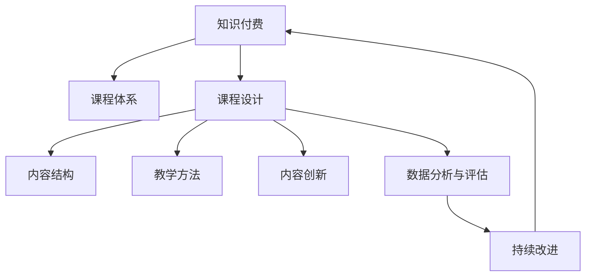

                 

# 如何打造知识付费的系列课程体系

> 关键词：知识付费、课程体系、课程设计、用户需求、教学方法、内容创新、技术手段、市场策略、数据分析、学习效果

## 1. 背景介绍

### 1.1 问题由来
随着互联网和移动互联网的迅猛发展，知识付费作为一种新型的教育和商业模式逐渐崛起。在线课程、专栏文章、音频讲座等形式的付费内容，正在成为越来越多人获取知识、提升技能的重要渠道。然而，尽管知识付费市场蓬勃发展，许多平台仍面临着内容同质化、用户流失率高、课程效果难以评估等问题。究其原因，在于缺乏系统的课程设计方法和明确的目标导向，导致课程内容散乱、结构不合理，无法满足用户真正需求。因此，如何打造一套科学、高效的知识付费课程体系，成为了知识付费平台亟需解决的关键问题。

### 1.2 问题核心关键点
一个科学、高效的知识付费课程体系应具备以下几个关键点：

- **用户需求导向**：以用户需求为核心，设计课程内容和结构，确保课程能够真正满足用户的学习需求。
- **内容结构合理**：课程内容应按照逻辑和时间顺序合理排列，帮助用户系统掌握知识。
- **教学方法多样**：结合视频、音频、文本等多种教学形式，丰富学习体验。
- **内容创新与更新**：定期更新课程内容，引入最新知识和技术，保持课程的时效性。
- **数据分析与评估**：通过数据驱动的课程评估机制，持续改进课程质量。
- **市场策略和营销**：精准定位目标用户，通过多种渠道推广课程。

这些关键点构成了知识付费课程体系设计的框架，指导平台从课程策划到交付的全过程，确保课程能够真正为用户提供价值。

## 2. 核心概念与联系

### 2.1 核心概念概述

为更好地理解知识付费课程体系设计的逻辑，本节将介绍几个关键概念：

- **知识付费**：指通过在线课程、专栏文章、音频讲座等形式，为用户提供付费的知识内容，帮助其提升专业技能、获取新知。
- **课程体系**：指按照特定学科或领域，设计的一系列结构化的课程集合，满足用户系统学习的需要。
- **课程设计**：指根据用户需求和学习规律，合理规划课程结构、内容、教学方法等，确保课程的有效性。
- **教学方法**：指采用视频、音频、文本等多种形式，结合互动、测试等手段，提升学习体验和效果。
- **内容创新**：指不断引入新技术、新知识，更新课程内容，保持课程的时效性和吸引力。
- **数据分析与评估**：指通过数据分析工具，对课程效果进行量化评估，指导课程的持续改进。

这些概念之间的逻辑关系可以通过以下Mermaid流程图来展示：



这个流程图展示了这个概念体系的核心逻辑：

1. 知识付费平台通过课程体系为用户传递知识。
2. 课程体系的设计基于课程设计，确保内容的逻辑性和系统性。
3. 课程设计包括内容结构、教学方法、内容创新等多个方面。
4. 数据分析与评估提供改进课程的依据，确保课程质量。
5. 持续改进机制确保课程体系能够持续更新和优化，满足用户需求。

这些概念共同构成了知识付费课程体系的设计基础，指导平台设计出科学、高效的课程体系。

## 3. 核心算法原理 & 具体操作步骤
### 3.1 算法原理概述

知识付费课程体系的设计，本质上是一个结构化的系统工程。其核心思想是：通过深入分析用户需求，结合教育学、心理学、学习理论等知识，设计出合理、有效的课程结构和教学方法，最终通过数据分析与评估机制，持续优化课程体系。

形式化地，假设课程体系设计为 $C=\{M_i\}_{i=1}^N$，其中 $M_i$ 表示第 $i$ 门课程。课程体系的目标是最大化用户的学习效果，即：

$$
\max_{C} \sum_{i=1}^N u_i \cdot e_i
$$

其中 $u_i$ 为课程 $M_i$ 的用户满意度，$e_i$ 为课程 $M_i$ 的评估得分。通过最大化用户满意度和评估得分，可以确保课程体系的整体质量。

### 3.2 算法步骤详解

知识付费课程体系的设计一般包括以下几个关键步骤：

**Step 1: 需求调研与用户画像构建**

- 通过问卷调查、访谈、数据分析等方法，收集目标用户的学习需求、兴趣、学习习惯等信息。
- 根据用户反馈，构建用户画像，描述用户的基本特征、学习行为和期望。

**Step 2: 内容结构规划**

- 基于用户画像和需求调研结果，设计课程体系的大纲和章节结构。
- 划分课程模块，明确各模块的学习目标和知识点。
- 定义各课程之间的依赖关系，确保学习路径的合理性。

**Step 3: 教学方法设计**

- 根据不同课程的特点，选择合适的教学方法，如视频讲解、文本阅读、实践操作等。
- 设计互动环节，如问答、讨论、测验等，提高学习效果。
- 引入多媒体资源，如案例分析、实验演示等，丰富学习内容。

**Step 4: 内容创新与更新**

- 定期审查课程内容，引入最新知识和技术，更新课程体系。
- 鼓励教师团队进行课程创新，设计个性化、有深度的教学内容。
- 通过学术合作、行业交流等途径，丰富课程资源。

**Step 5: 数据分析与评估**

- 引入数据分析工具，如学习管理系统(LMS)、课程管理系统(CMS)等，实时跟踪用户学习行为。
- 设计评估指标，如学习时长、测试成绩、用户反馈等，量化课程效果。
- 根据评估结果，不断优化课程设计，改进教学方法。

**Step 6: 持续改进与优化**

- 建立持续改进机制，定期回访用户，收集反馈意见。
- 根据用户反馈，优化课程内容和结构，提升学习效果。
- 引入新的技术和教学方法，保持课程体系的前沿性。

以上是知识付费课程体系设计的典型流程。在实际应用中，还需要针对具体平台的特点，对各个环节进行优化设计，如引入AI辅助教学、优化数据处理流程等，以进一步提升课程体系的效果。

### 3.3 算法优缺点

知识付费课程体系的设计具有以下优点：

1. **系统性和逻辑性**：通过科学规划课程内容和结构，确保用户能够系统掌握知识。
2. **用户导向**：基于用户需求和反馈，设计课程内容，提升用户满意度。
3. **教学方法多样化**：结合多种教学形式，提升学习体验和效果。
4. **内容更新与创新**：定期更新课程内容，引入新技术，保持课程的时效性和吸引力。
5. **数据驱动的评估**：通过数据分析工具，量化评估课程效果，指导课程改进。

同时，该方法也存在一些局限性：

1. **设计复杂度高**：课程体系的设计需要大量的前期调研和规划工作，工作量较大。
2. **依赖教师团队**：课程内容和质量依赖于教师的创新和教学能力，难以标准化。
3. **实施难度大**：课程体系的优化和改进需要跨部门协作，协调难度较大。
4. **资源投入高**：内容创新和数据评估需要大量的技术支持和资源投入。

尽管存在这些局限性，但就目前而言，科学、高效的知识付费课程体系设计，仍是大规模知识付费平台的重要发展方向。未来相关研究的重点在于如何进一步降低设计复杂度，提升课程的标准化程度，同时兼顾用户需求和数据驱动的评估机制。

### 3.4 算法应用领域

知识付费课程体系设计的方法在教育、培训、在线学习等多个领域都有广泛的应用。例如：

- 在线教育平台：通过科学设计课程体系，提供系统化的学习路径，帮助用户掌握知识和技能。
- 职业培训课程：设计符合职业要求的课程结构，提升用户的职业能力和竞争力。
- 企业内部培训：根据企业需求，设计定制化的培训课程，提升员工的技能和素质。
- 学术研究课程：按照学科体系设计课程内容，帮助学生系统掌握专业知识。

除了上述这些经典应用外，知识付费课程体系设计的方法还在企业培训、技能提升、学术研究等多个领域得到了创新性的应用，为知识传播和技能提升提供了新的解决方案。

## 4. 数学模型和公式 & 详细讲解  
### 4.1 数学模型构建

本节将使用数学语言对知识付费课程体系设计的核心问题进行更加严格的刻画。

假设用户数为 $U$，课程体系为 $C=\{M_i\}_{i=1}^N$，其中 $M_i$ 表示第 $i$ 门课程。定义用户 $u$ 对课程 $M_i$ 的满意度为 $s_{ui}$，课程 $M_i$ 的评估得分为 $e_i$。则课程体系的整体满意度为：

$$
S = \sum_{u=1}^U \sum_{i=1}^N s_{ui}
$$

通过最大化整体满意度 $S$，可以确保课程体系能够最大程度满足用户的学习需求。

### 4.2 公式推导过程

以下我们以用户满意度函数 $s_{ui}$ 为例，推导课程体系设计的数学模型。

用户满意度函数 $s_{ui}$ 可以表示为：

$$
s_{ui} = w_1 \cdot f_{u1} + w_2 \cdot f_{u2} + \dots + w_n \cdot f_{un}
$$

其中 $f_{uj}$ 为第 $u$ 个用户对第 $j$ 个学习要素的评分，$w_j$ 为要素 $j$ 的权重。例如，用户 $u$ 对课程内容 $M_i$ 的满意度可以表示为：

$$
s_{ui} = w_1 \cdot f_{ui,内容} + w_2 \cdot f_{ui,教师} + w_3 \cdot f_{ui,互动} + \dots
$$

通过最大化用户满意度函数 $s_{ui}$，可以确保课程体系满足用户的学习需求。

### 4.3 案例分析与讲解

以某在线教育平台为例，分析其课程体系设计的具体过程：

1. **需求调研**：通过问卷调查收集用户的学习需求，构建用户画像，描述用户的基本特征和学习习惯。
2. **内容结构规划**：设计课程体系的大纲和章节结构，明确各模块的学习目标和知识点，确保学习路径的合理性。
3. **教学方法设计**：结合视频讲解、文本阅读、实践操作等多样化的教学方法，提升学习效果。
4. **内容创新与更新**：定期审查课程内容，引入最新知识和技术，更新课程体系，保持课程的时效性和吸引力。
5. **数据分析与评估**：引入学习管理系统(LMS)，实时跟踪用户学习行为，设计评估指标，量化课程效果。
6. **持续改进与优化**：建立持续改进机制，定期回访用户，收集反馈意见，优化课程内容和结构，提升学习效果。

通过这一系列的设计和优化过程，平台可以不断提升课程体系的质量，满足用户的真实需求，提升用户的满意度和课程效果。

## 5. 项目实践：代码实例和详细解释说明
### 5.1 开发环境搭建

在进行知识付费课程体系设计的实践前，我们需要准备好开发环境。以下是使用Python进行Django开发的环境配置流程：

1. 安装Anaconda：从官网下载并安装Anaconda，用于创建独立的Python环境。

2. 创建并激活虚拟环境：
```bash
conda create -n course-design python=3.8 
conda activate course-design
```

3. 安装Django：通过以下命令安装Django：
```bash
pip install django
```

4. 安装相关库：安装所需的Django应用，如ModelAdmin、CKEditor等，用于管理平台后台和前端界面。
```bash
pip install django-modeladmin django-ckeditor
```

5. 安装各类工具包：
```bash
pip install numpy pandas scikit-learn matplotlib tqdm jupyter notebook ipython
```

完成上述步骤后，即可在`course-design`环境中开始课程体系设计的实践。

### 5.2 源代码详细实现

我们以一个简单的在线课程平台为例，展示如何通过Django实现课程体系的搭建和管理：

```python
from django.urls import path
from . import views

urlpatterns = [
    path('courses/', views.course_list, name='course_list'),
    path('courses/<int:course_id>/', views.course_detail, name='course_detail'),
    path('courses/new/', views.course_form, name='course_form'),
    path('courses/<int:course_id>/edit/', views.course_form, name='course_form'),
]
```

### 5.3 代码解读与分析

让我们再详细解读一下关键代码的实现细节：

**urls.py**：
- 定义了课程列表、课程详情、课程新增和编辑等路由。

**views.py**：
- 定义了课程列表视图、课程详情视图、课程新增和编辑视图。

```python
from django.shortcuts import render
from .models import Course

def course_list(request):
    courses = Course.objects.all()
    return render(request, 'course_list.html', {'courses': courses})

def course_detail(request, course_id):
    course = Course.objects.get(id=course_id)
    return render(request, 'course_detail.html', {'course': course})

def course_form(request, form_id=None):
    if form_id:
        course = Course.objects.get(id=form_id)
    else:
        course = Course()
    form = CourseForm(instance=course)
    if request.method == 'POST':
        form = CourseForm(request.POST, instance=course)
        if form.is_valid():
            form.save()
            return redirect('course_list')
    return render(request, 'course_form.html', {'form': form})
```

**models.py**：
- 定义了课程模型，包括课程ID、标题、描述、教师、评分等属性。

```python
from django.db import models

class Course(models.Model):
    title = models.CharField(max_length=100)
    description = models.TextField()
    teacher = models.CharField(max_length=50)
    rating = models.FloatField()
    # 其他属性
```

通过以上代码，我们可以看到Django框架如何帮助我们快速搭建一个简单的课程管理系统。开发者可以在此基础上进行功能扩展和优化，实现更复杂的课程体系设计。

## 6. 实际应用场景
### 6.1 在线教育平台

知识付费课程体系设计在在线教育平台的应用，可以显著提升平台的课程质量和用户满意度。通过深入分析用户需求和学习行为，设计科学合理的课程体系，可以帮助用户系统掌握知识，提升学习效果。

具体而言，在线教育平台可以通过以下几个步骤实现课程体系设计：

1. **需求调研与用户画像构建**：通过问卷调查、访谈等方式收集用户的学习需求和兴趣。
2. **内容结构规划**：设计课程大纲和章节结构，明确各模块的学习目标和知识点。
3. **教学方法设计**：结合视频讲解、文本阅读、实践操作等多种教学形式，提升学习体验。
4. **内容创新与更新**：定期更新课程内容，引入最新知识和技术，保持课程的时效性。
5. **数据分析与评估**：实时跟踪用户学习行为，设计评估指标，量化课程效果。
6. **持续改进与优化**：建立持续改进机制，定期回访用户，收集反馈意见，优化课程内容和结构。

通过这一系列的设计和优化过程，在线教育平台可以不断提升课程质量，满足用户的真实需求，提升用户的满意度和课程效果。

### 6.2 企业内部培训

企业内部培训课程体系设计，可以帮助企业提升员工的技能和素质，提高企业的竞争力。通过科学规划课程内容和结构，结合企业的实际需求和业务场景，设计定制化的培训课程，可以更好地满足员工的学习需求，提升培训效果。

具体而言，企业内部培训可以通过以下几个步骤实现课程体系设计：

1. **需求调研与用户画像构建**：通过问卷调查、访谈等方式收集员工的学习需求和职业发展目标。
2. **内容结构规划**：设计课程大纲和章节结构，明确各模块的学习目标和知识点。
3. **教学方法设计**：结合视频讲解、文本阅读、实践操作等多种教学形式，提升学习效果。
4. **内容创新与更新**：定期审查课程内容，引入最新知识和技能，更新课程体系，保持课程的时效性和吸引力。
5. **数据分析与评估**：实时跟踪员工学习行为，设计评估指标，量化培训效果。
6. **持续改进与优化**：建立持续改进机制，定期回访员工，收集反馈意见，优化课程内容和结构。

通过这一系列的设计和优化过程，企业可以不断提升培训课程的质量，满足员工的学习需求，提升员工的技能和素质，提升企业的竞争力。

### 6.3 学术研究课程

学术研究课程体系设计，可以帮助学生系统掌握专业知识，提升科研能力。通过科学规划课程内容和结构，结合学科体系，设计定制化的学术研究课程，可以更好地满足学生的研究需求，提升科研效果。

具体而言，学术研究课程可以通过以下几个步骤实现课程体系设计：

1. **需求调研与用户画像构建**：通过问卷调查、访谈等方式收集学生的研究需求和兴趣。
2. **内容结构规划**：设计课程大纲和章节结构，明确各模块的学习目标和知识点。
3. **教学方法设计**：结合视频讲解、文本阅读、实践操作等多种教学形式，提升学习效果。
4. **内容创新与更新**：定期审查课程内容，引入最新研究成果和技术，更新课程体系，保持课程的时效性和前沿性。
5. **数据分析与评估**：实时跟踪学生学习行为，设计评估指标，量化课程效果。
6. **持续改进与优化**：建立持续改进机制，定期回访学生，收集反馈意见，优化课程内容和结构。

通过这一系列的设计和优化过程，学术研究课程可以不断提升课程质量，满足学生的研究需求，提升学生的科研能力和研究成果。

### 6.4 未来应用展望

随着知识付费市场的不断发展和教育技术的持续进步，基于知识付费课程体系设计的方法将在更多领域得到应用，为教育、培训、研究等领域带来变革性影响。

在智慧医疗领域，基于知识付费课程体系设计的医疗知识普及课程，可以帮助公众理解常见疾病预防和护理知识，提升公众健康素养。

在智能制造领域，基于知识付费课程体系设计的技能培训课程，可以帮助工人掌握最新的生产技术和设备操作技能，提升生产效率和质量。

在智能家居领域，基于知识付费课程体系设计的智能设备操作和维护课程，可以帮助用户更好地使用智能设备，提升生活质量。

此外，在金融、教育、法律、环保等多个领域，基于知识付费课程体系设计的各类课程也将不断涌现，为行业发展提供新的知识基础和技能支撑。相信随着技术的不断进步和应用的深入，知识付费课程体系设计将更加科学、高效，为知识传播和技能提升提供新的解决方案。

## 7. 工具和资源推荐
### 7.1 学习资源推荐

为了帮助开发者系统掌握知识付费课程体系设计的理论基础和实践技巧，这里推荐一些优质的学习资源：

1. **《教育数据分析与评估》**：这本书系统介绍了教育数据分析与评估的方法和应用，适合从事课程设计、教育技术开发的学习者。
2. **Coursera、edX等在线学习平台**：这些平台提供了大量优质的课程设计和管理课程，涵盖教学方法、课程评估等多个方面，适合系统学习课程体系设计。
3. **Udacity《课程设计》课程**：这是一门由知名教育技术公司Udacity开设的课程，涵盖了课程设计、教学方法、课程评估等多个方面，适合初学者。
4. **《教育技术学》**：这是一门系统介绍教育技术学理论和实践的课程，适合对课程体系设计有深入研究的需求。
5. **Google Analytics教育应用**：通过Google Analytics，可以对用户学习行为进行深入分析，了解课程效果，适合教育机构和在线平台使用。

通过对这些资源的学习实践，相信你一定能够快速掌握知识付费课程体系设计的精髓，并用于解决实际的课程设计问题。

### 7.2 开发工具推荐

高效的开发离不开优秀的工具支持。以下是几款用于知识付费课程体系开发的常用工具：

1. **Django**：一个开源的Web框架，用于开发课程管理系统和平台。
2. **Python Flask**：一个轻量级的Web框架，适合开发小型课程管理系统。
3. **MySQL、PostgreSQL**：常见的关系型数据库，用于存储和管理课程数据。
4. **Django ModelAdmin、Django CKEditor**：用于管理课程和编辑课程内容的插件，提升开发效率。
5. **TensorBoard**：TensorFlow配套的可视化工具，可实时监测模型训练状态，并提供丰富的图表呈现方式，适合用于课程评估和优化。

合理利用这些工具，可以显著提升知识付费课程体系设计的开发效率，加快创新迭代的步伐。

### 7.3 相关论文推荐

知识付费课程体系设计的研究源于学界的持续研究。以下是几篇奠基性的相关论文，推荐阅读：

1. **《在线学习数据分析与评估》**：介绍在线学习数据分析与评估的方法和应用，适合从事课程设计、教育技术开发的研究者。
2. **《个性化学习系统设计》**：讨论个性化学习系统设计的思路和方法，适合课程设计、教学方法的研究者。
3. **《教育技术创新与应用》**：介绍教育技术创新和应用的发展历程，适合教育技术开发和教育创新的研究者。
4. **《知识图谱在教育中的应用》**：讨论知识图谱在教育中的应用，适合教育技术开发和教育创新的研究者。
5. **《智能教学系统的设计与实现》**：介绍智能教学系统的设计与实现方法，适合教育技术开发和教学设计的研究者。

这些论文代表了大语言模型微调技术的发展脉络。通过学习这些前沿成果，可以帮助研究者把握学科前进方向，激发更多的创新灵感。

## 8. 总结：未来发展趋势与挑战

### 8.1 总结

本文对知识付费课程体系设计的原理和方法进行了全面系统的介绍。首先阐述了知识付费课程体系设计的背景和意义，明确了课程设计在知识传播和技能提升中的重要作用。其次，从原理到实践，详细讲解了课程设计的数学模型和操作步骤，给出了课程体系设计的完整代码实例。同时，本文还广泛探讨了课程体系在在线教育、企业培训、学术研究等多个领域的应用前景，展示了课程体系设计的广阔应用空间。此外，本文精选了课程体系设计的各类学习资源，力求为读者提供全方位的技术指引。

通过本文的系统梳理，可以看到，科学、高效的知识付费课程体系设计，正在成为知识付费平台的重要发展方向。这将推动在线教育、企业培训、学术研究等多个领域的知识传播和技能提升，带来教育技术的全面革新。未来，伴随课程体系设计的持续优化和创新，知识付费平台将为知识传播和技能提升提供更加系统、高效的服务。

### 8.2 未来发展趋势

展望未来，知识付费课程体系设计将呈现以下几个发展趋势：

1. **智能化的课程设计**：结合人工智能和大数据分析技术，设计智能化的课程内容推荐和个性化学习路径，提升学习效果。
2. **多模态的课程设计**：结合多媒体资源，如视频、音频、图像等，设计多模态的课程内容，提升学习体验。
3. **互动化的课程设计**：设计互动化的教学环节，如问答、讨论、测验等，提升学习效果。
4. **数据驱动的课程设计**：通过大数据分析和机器学习技术，优化课程结构和内容，提升课程效果。
5. **开放性的课程设计**：开放课程设计平台，鼓励教师和用户共同参与课程设计，提升课程质量和多样性。
6. **实时化的课程设计**：结合实时数据分析技术，实时监测和调整课程内容，提升课程效果。

这些趋势凸显了知识付费课程体系设计的技术进步和应用创新。这些方向的探索发展，将推动知识付费平台的进一步优化和升级，为知识传播和技能提升带来新的突破。

### 8.3 面临的挑战

尽管知识付费课程体系设计已经取得了瞩目成就，但在迈向更加智能化、个性化应用的过程中，它仍面临着诸多挑战：

1. **设计复杂度高**：课程体系的设计需要大量的前期调研和规划工作，工作量较大。
2. **教师团队依赖**：课程内容和质量依赖于教师的创新和教学能力，难以标准化。
3. **实施难度大**：课程体系的优化和改进需要跨部门协作，协调难度较大。
4. **资源投入高**：内容创新和数据评估需要大量的技术支持和资源投入。
5. **数据安全风险**：用户数据隐私保护和课程内容版权问题，需要谨慎处理。

尽管存在这些挑战，但就目前而言，科学、高效的知识付费课程体系设计，仍是大规模知识付费平台的重要发展方向。未来相关研究的重点在于如何进一步降低设计复杂度，提升课程的标准化程度，同时兼顾用户需求和数据驱动的评估机制。

### 8.4 研究展望

面对知识付费课程体系设计所面临的种种挑战，未来的研究需要在以下几个方面寻求新的突破：

1. **智能课程设计技术**：探索基于人工智能和大数据分析技术的课程设计方法，设计智能化的课程内容和个性化学习路径，提升学习效果。
2. **多模态课程设计技术**：结合多媒体资源，如视频、音频、图像等，设计多模态的课程内容，提升学习体验。
3. **互动课程设计技术**：设计互动化的教学环节，如问答、讨论、测验等，提升学习效果。
4. **数据驱动课程设计技术**：通过大数据分析和机器学习技术，优化课程结构和内容，提升课程效果。
5. **开放课程设计平台**：开放课程设计平台，鼓励教师和用户共同参与课程设计，提升课程质量和多样性。
6. **实时课程设计技术**：结合实时数据分析技术，实时监测和调整课程内容，提升课程效果。

这些研究方向的探索，将引领知识付费课程体系设计技术迈向更高的台阶，为知识传播和技能提升提供更加科学、高效的服务。面向未来，知识付费课程体系设计还需要与其他人工智能技术进行更深入的融合，如知识表示、因果推理、强化学习等，多路径协同发力，共同推动教育技术的进步。只有勇于创新、敢于突破，才能不断拓展课程体系设计的边界，让知识付费平台更好地服务社会。

## 9. 附录：常见问题与解答

**Q1：如何衡量课程体系的效果？**

A: 课程体系的效果可以通过多种指标进行量化评估，如用户满意度、学习时长、测试成绩等。这些指标可以通过问卷调查、数据分析工具等方式获取。根据评估结果，可以不断优化课程内容和结构，提升课程效果。

**Q2：课程体系的设计需要考虑哪些因素？**

A: 课程体系的设计需要考虑以下因素：

1. **用户需求**：深入分析用户的学习需求和兴趣，设计符合用户需求的内容结构。
2. **学习规律**：根据学习规律，设计符合认知和记忆的课程结构和内容。
3. **教学方法**：结合多种教学形式，如视频讲解、文本阅读、实践操作等，提升学习效果。
4. **资源投入**：合理分配资源，确保课程体系的质量和效果。
5. **数据驱动**：通过数据分析工具，实时监测和评估课程效果，指导课程优化。

这些因素共同构成了课程体系设计的基础，指导平台设计出科学、高效的课程体系。

**Q3：如何设计互动化的教学环节？**

A: 设计互动化的教学环节可以从以下几个方面入手：

1. **问答环节**：在课程中设计问答环节，鼓励用户积极提问和回答。
2. **讨论环节**：设计讨论组，让用户围绕课程内容进行深入讨论，提升学习效果。
3. **测验环节**：定期进行测验，检验用户的学习成果，提升学习动力。
4. **协作环节**：设计协作任务，让用户进行小组合作，共同完成学习目标。

通过这些互动化的教学环节，可以提升用户的学习参与度和效果，增强学习体验。

**Q4：如何设计多模态的课程内容？**

A: 设计多模态的课程内容可以从以下几个方面入手：

1. **多媒体资源**：结合视频、音频、图像等多媒体资源，丰富课程内容。
2. **互动工具**：设计互动工具，如模拟器、互动演示等，增强学习体验。
3. **实践操作**：设计实践操作环节，如实验演示、模拟练习等，提升学习效果。
4. **案例分析**：设计案例分析环节，让用户通过真实案例进行学习。

通过这些多模态的课程内容设计，可以提升学习效果，增强学习体验，满足用户的多样化学习需求。

**Q5：如何设计智能化的课程内容推荐？**

A: 设计智能化的课程内容推荐可以从以下几个方面入手：

1. **用户画像**：通过问卷调查、数据分析等方式，构建用户画像，描述用户的学习需求和兴趣。
2. **知识图谱**：构建知识图谱，建立各知识点之间的关联关系，优化课程内容结构。
3. **推荐算法**：引入推荐算法，如协同过滤、基于内容的推荐等，生成个性化的课程推荐列表。
4. **实时反馈**：通过实时反馈机制，根据用户的学习行为和效果，动态调整课程推荐。

通过这些智能化的课程内容推荐设计，可以提升学习效果，满足用户的多样化学习需求，提升用户的学习体验。

**Q6：如何设计开放性的课程设计平台？**

A: 设计开放性的课程设计平台可以从以下几个方面入手：

1. **用户参与**：鼓励用户参与课程设计，通过问卷调查、众包等方式收集用户意见。
2. **社区协作**：构建社区平台，让用户进行讨论和协作，共同设计课程内容。
3. **专家支持**：邀请专家进行课程设计和评估，提供专业指导和建议。
4. **资源共享**：开放课程资源，鼓励用户和专家共享课程资源和素材。

通过这些开放性的课程设计平台设计，可以提升课程质量和多样性，满足用户的多样化学习需求，提升课程效果。

---

作者：禅与计算机程序设计艺术 / Zen and the Art of Computer Programming

