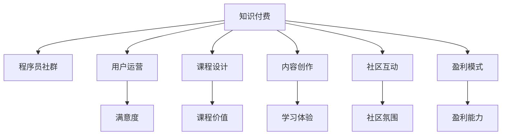

                 

# 如何打造高忠诚度的程序员知识付费社群

> 关键词：知识付费, 程序员社群, 忠诚度, 用户运营, 课程设计, 内容创作, 社区互动, 盈利模式

## 1. 背景介绍

在数字化转型和互联网技术发展的推动下，程序员群体逐渐成为知识和技能的重要承载者。伴随技术迭代和行业变革的不断加快，高水平、精细化、定制化的知识付费服务需求日益旺盛，程序员社群应运而生。作为知识付费领域的新兴力量，程序员社群致力于通过高质量的内容和优质的服务，构建一个充满信任和归属感的社区，持续激发程序员群体的学习热情和职业发展动力。

然而，相比于传统的知识付费平台，程序员社群不仅需要优质、高效的课程和内容，还需要更加精细化的用户运营、更加多样化的盈利模式和更加紧密的社区互动。如何打造高忠诚度的程序员知识付费社群，成为业界和学术界广泛关注的话题。本文将从用户需求、课程设计、运营策略和盈利模式等多个维度进行深入探讨，提供详细的指导建议，助力程序员社群建设。

## 2. 核心概念与联系

为了更好地理解高忠诚度程序员社群的建设，本节将介绍几个关键概念及其内在联系：

### 2.1 核心概念概述

1. **知识付费**：指以知识为商品，通过在线付费的方式，为用户提供定制化、高水平的学习内容和专业服务。知识付费基于互联网平台，通过订阅、购买、打赏等方式获取收益，已经成为内容变现的重要模式之一。

2. **程序员社群**：由程序员组成的兴趣社区或专业团体，以技术分享、问题交流、资源共享等为主要目的，旨在建立技术交流、知识传播、职业发展等多维度互动的社区氛围。

3. **忠诚度**：指用户对产品或服务的情感依恋程度，表现为持续使用、主动推荐、积极反馈等行为。高忠诚度意味着用户对社群的持续信任和认可，是社群可持续发展的重要保障。

4. **用户运营**：指通过科学的管理和运营策略，提升用户满意度和活跃度，实现社群的良性循环和可持续发展。

5. **课程设计**：指基于用户需求和市场调研，设计和提供符合技术发展趋势、适应用户水平和偏好的课程内容，实现课程的差异化、系统化和个性化。

6. **内容创作**：指通过系统的课程开发、专家讲座、技术交流、编程实战等方式，丰富社群内容，提升社群价值，满足用户的多元化学习需求。

7. **社区互动**：指通过讨论区、问答、项目合作、代码共享等方式，促进用户之间的交流和协作，建立社群的社区文化和凝聚力。

8. **盈利模式**：指社群通过多样化的商业模式，实现持续盈利，包括但不限于订阅费、课程费、广告费、赞助费等。

这些概念之间的逻辑关系可以通过以下Mermaid流程图来展示：



这个流程图展示了一个高忠诚度程序员社群的建设框架，其中知识付费是基础，用户运营、课程设计、内容创作、社区互动和盈利模式是关键环节，共同支撑着社群的良性发展。

## 3. 核心算法原理 & 具体操作步骤

### 3.1 算法原理概述

基于知识付费和程序员社群的特点，本文将从用户行为分析、课程推荐算法、用户成长体系、激励机制等多个角度，介绍如何通过数据驱动和算法优化，提升社群的用户粘性和忠诚度。

### 3.2 算法步骤详解

**Step 1: 用户行为分析**

1. **数据收集**：通过网站/应用的用户行为数据（如点击率、停留时间、课程评分、互动次数等），使用数据分析工具进行初步统计分析，了解用户的基本属性和行为特征。

2. **模型训练**：利用机器学习算法（如决策树、随机森林、神经网络等）对用户行为数据进行建模，分析用户对课程和内容的不同偏好，建立用户画像。

3. **数据可视化**：将用户行为数据和模型结果可视化，通过图表和报告，清晰展示用户群体特征和行为趋势。

**Step 2: 课程推荐算法**

1. **课程库构建**：通过爬虫、API接口等方式，从互联网平台或自家数据库中获取课程信息，包括课程名称、简介、难度等级、评价等。

2. **推荐模型训练**：使用协同过滤、内容推荐、混合推荐等算法，对课程库中的课程进行建模，形成推荐模型。

3. **个性化推荐**：根据用户画像和行为数据，通过推荐算法实时生成个性化课程推荐列表，提升用户体验。

**Step 3: 用户成长体系**

1. **用户等级划分**：根据用户的学习行为和成果，设置多级用户等级，鼓励用户持续学习。

2. **任务和奖励**：设计丰富的学习任务和奖励机制，如积分、勋章、优惠券等，激励用户完成学习目标。

3. **成就展示**：在网站/应用中设置用户成就展示区，展示用户等级、学习成果和积分排名，提升用户荣誉感。

**Step 4: 激励机制**

1. **内容付费**：提供优质课程和内容的付费机制，通过合理的定价策略和价格优惠，吸引用户付费学习。

2. **积分系统**：通过积分激励系统，促进用户积极参与社群活动，如答题、分享、互动等。

3. **会员制度**：推出高级会员制度，提供专属服务、优惠权益和个性化内容，增加用户粘性。

**Step 5: 社区互动**

1. **论坛和讨论区**：建立专业论坛和讨论区，鼓励用户提问、交流和分享，形成活跃的社区氛围。

2. **代码共享与合作**：提供代码托管和共享平台，方便用户发布和获取项目代码，促进社区合作。

3. **定期活动**：组织线下技术交流会、编程比赛、技术沙龙等活动，增强用户互动和社区凝聚力。

**Step 6: 盈利模式**

1. **订阅模式**：推出月度/年度订阅服务，提供全站课程、专享内容、社区特权等，吸引用户长期投入。

2. **课程销售**：提供优质课程的独立销售，通过高性价比吸引用户购买。

3. **广告和赞助**：对接互联网广告主和IT公司，通过平台广告、品牌赞助等方式实现盈利。

### 3.3 算法优缺点

**优点**：

1. **提升用户体验**：通过个性化推荐和精准服务，提升用户学习体验，满足用户个性化需求。

2. **增加用户粘性**：通过积分、勋章、会员等激励机制，增强用户粘性和忠诚度。

3. **优化运营效果**：通过数据驱动的运营策略，提升运营效率，降低运营成本。

**缺点**：

1. **数据隐私**：在数据收集和处理过程中，可能涉及用户隐私和数据安全问题。

2. **算法复杂**：推荐算法和激励机制设计复杂，需要较多的技术支持和资源投入。

3. **用户依赖**：过度依赖算法和平台激励，可能导致用户过度消费和平台依赖，影响用户自驱力。

### 3.4 算法应用领域

高忠诚度程序员社群的核心算法和运营策略，不仅适用于知识付费平台和程序员社区，还适用于任何基于互联网的技术交流平台，如开发者论坛、技术博客、开源社区等。通过系统的课程设计、科学的用户运营和合理的盈利模式，各类技术交流平台可以形成良性的生态系统，吸引和保留更多高质量用户，持续提升平台价值。

## 4. 数学模型和公式 & 详细讲解 & 举例说明

### 4.1 数学模型构建

本文将通过数学语言对高忠诚度程序员社群的建设进行严格的刻画。

记用户集为 $U$，课程集为 $C$，课程推荐算法为 $R$，用户行为数据为 $D$，推荐模型为 $M$，用户成长体系为 $G$，激励机制为 $I$，社区互动平台为 $S$，盈利模式为 $P$。

数学模型如下：

$$
G = R(U, D, M), \quad I = G(U, M), \quad P = I(U, S, M)
$$

其中，$G$ 表示用户成长体系，$R$ 表示推荐算法，$I$ 表示激励机制，$P$ 表示盈利模式。

### 4.2 公式推导过程

1. **用户行为分析**：
$$
D = \{(x_i, y_i)\}_{i=1}^N, \quad x_i = (a_i, b_i, c_i), \quad y_i = (d_i, e_i, f_i)
$$
其中 $x_i$ 表示用户行为数据，$a_i$ 为点击次数，$b_i$ 为停留时间，$c_i$ 为课程评分，$d_i$ 为互动次数，$e_i$ 为用户等级，$f_i$ 为用户积分。

2. **课程推荐算法**：
$$
R = \alpha \times R_C + (1-\alpha) \times R_I + \beta \times R_F
$$
其中 $\alpha, \beta$ 为超参数，$R_C$ 表示协同过滤推荐，$R_I$ 表示内容推荐，$R_F$ 表示混合推荐。

3. **用户成长体系**：
$$
G = \begin{cases}
\text{Level 1}, & \text{if score < 100} \\
\text{Level 2}, & \text{if 100 \leq score < 200} \\
\ldots \\
\text{Level N}, & \text{if score \geq 1000}
\end{cases}
$$
其中 $score$ 为用户积分，$\text{Level N}$ 为最高等级。

4. **激励机制**：
$$
I = \text{积分} + \text{勋章} + \text{优惠券}
$$
其中 $\text{积分}$ 为用户的积分总和，$\text{勋章}$ 为用户成就展示，$\text{优惠券}$ 为优惠购买权限。

5. **社区互动平台**：
$$
S = \text{论坛} + \text{讨论区} + \text{代码共享} + \text{活动}
$$

6. **盈利模式**：
$$
P = \text{订阅收入} + \text{课程销售收入} + \text{广告收入} + \text{赞助收入}
$$

### 4.3 案例分析与讲解

**案例1: 在线编程社区**

假设有一个名为CodeHub的在线编程社区，提供Python、Java等多种编程语言的课程和资料。用户可以通过CodeHub学习编程技能，发布代码项目，与其他开发者交流互动。

**步骤1: 用户行为分析**
- 通过网站流量统计工具，收集用户点击次数、停留时间、课程评分等数据。
- 使用决策树算法分析用户对Python和Java课程的偏好。
- 可视化用户行为数据，展示用户群体的基本特征和行为趋势。

**步骤2: 课程推荐算法**
- 通过API接口获取所有Python和Java课程的详细信息。
- 使用协同过滤算法，对用户历史行为数据进行建模，形成推荐模型。
- 实时生成个性化课程推荐列表，提升用户学习体验。

**步骤3: 用户成长体系**
- 设计积分系统，用户通过完成任务、发布代码、参与讨论等行为获得积分。
- 根据积分等级，用户可以获得不同级别的勋章和优惠券。
- 在网站首页设置成就展示区，展示用户等级和积分排名。

**步骤4: 激励机制**
- 推出月度订阅服务，提供全站课程和专享内容。
- 提供课程独立购买，通过高性价比吸引用户付费学习。
- 对接广告主，通过平台广告实现盈利。

**步骤5: 社区互动**
- 建立专业论坛和讨论区，鼓励用户提问和交流。
- 提供代码托管和共享平台，方便用户发布和获取代码。
- 定期组织编程比赛和技术沙龙，增强用户互动和社区凝聚力。

**步骤6: 盈利模式**
- 提供月度订阅服务，增加用户长期投入。
- 销售优质课程，通过课程独立购买实现盈利。
- 对接广告主和IT公司，实现平台广告和品牌赞助收入。

通过系统化的运营策略和算法优化，CodeHub成功吸引并留住了大量高质量用户，成为业内知名的编程社区。

## 5. 项目实践：代码实例和详细解释说明

### 5.1 开发环境搭建

在进行高忠诚度程序员社群的开发前，我们需要准备好开发环境。以下是使用Python进行Web开发的开发环境配置流程：

1. 安装Anaconda：从官网下载并安装Anaconda，用于创建独立的Python环境。

2. 创建并激活虚拟环境：
```bash
conda create -n pyconda-env python=3.9 
conda activate pyconda-env
```

3. 安装Flask和Jinja：
```bash
pip install flask
pip install Jinja2
```

4. 安装用户行为分析工具：
```bash
pip install pandas numpy sklearn matplotlib
```

5. 安装推荐算法和课程库：
```bash
pip install scikit-learn
```

6. 安装用户成长体系和激励机制：
```bash
pip install django
pip install django-stripe
```

完成上述步骤后，即可在`pyconda-env`环境中开始高忠诚度程序员社群的开发。

### 5.2 源代码详细实现

下面我们以CodeHub为例，给出使用Flask和Django进行高忠诚度程序员社群开发的PyTorch代码实现。

首先，定义用户行为分析函数：

```python
from sklearn.ensemble import RandomForestClassifier
from sklearn.metrics import classification_report

# 定义用户行为数据集
def load_user_data():
    # 从数据库中加载用户行为数据
    # 返回格式为 [[用户ID, 点击次数, 停留时间, 课程评分, 互动次数, 用户等级, 用户积分]]
    pass

# 定义用户行为分析模型
def analyze_user_behavior():
    # 使用随机森林算法，构建用户行为分析模型
    X = df[['click_count', 'stay_time', 'course_score', 'interaction_count']]
    y = df['user_level']
    clf = RandomForestClassifier(n_estimators=100)
    clf.fit(X, y)
    return clf

# 可视化用户行为数据
def visualize_user_data():
    # 使用Matplotlib和Pandas进行数据可视化
    # 生成用户行为数据的柱状图、饼图、散点图等
    pass
```

然后，定义课程推荐算法：

```python
from sklearn.metrics.pairwise import cosine_similarity
from sklearn.decomposition import TruncatedSVD

# 定义课程库
def load_course_library():
    # 从数据库中加载课程信息
    # 返回格式为 [[课程ID, 课程名称, 课程简介, 课程难度]]
    pass

# 定义协同过滤推荐算法
def collaborative_filtering():
    # 使用奇异值分解(SVD)算法，构建协同过滤推荐模型
    X = course_lib[['course_name', 'course_intro', 'course_difficulty']]
    U, S, V = svd(X)
    return U, S, V

# 定义内容推荐算法
def content_based_filtering():
    # 使用余弦相似度算法，构建内容推荐模型
    pass

# 定义混合推荐算法
def hybrid_filtering():
    # 将协同过滤推荐和内容推荐融合，生成个性化课程推荐列表
    pass
```

接着，定义用户成长体系和激励机制：

```python
from django.contrib.auth.models import User
from django.contrib.auth.decorators import login_required
from django.shortcuts import render, redirect
from django.views.decorators.csrf import csrf_protect

# 定义用户成长体系
@login_required
def user_growth_system(request):
    # 根据用户积分和等级，显示相应的勋章、优惠券等激励措施
    pass

# 定义激励机制
@login_required
def reward_system(request):
    # 根据用户行为，发放积分、勋章、优惠券等激励措施
    pass
```

最后，启动用户行为分析、课程推荐、用户成长和激励机制的流程：

```python
from flask import Flask, render_template
from flask_login import LoginManager
from flask_wtf import FlaskForm
from wtforms import StringField, PasswordField, SubmitField
from wtforms.validators import DataRequired, Email, EqualTo

app = Flask(__name__)
app.config['SECRET_KEY'] = 'supersecretkey'
login_manager = LoginManager(app)

# 定义用户登录表单
class LoginForm(FlaskForm):
    email = StringField('Email', validators=[DataRequired(), Email()])
    password = PasswordField('Password', validators=[DataRequired()])
    submit = SubmitField('Log In')

@app.route('/')
@login_required
def home():
    # 加载用户行为数据并分析
    user_data = load_user_data()
    clf = analyze_user_behavior()
    X = user_data[['click_count', 'stay_time', 'course_score', 'interaction_count']]
    y = user_data['user_level']
    clf.fit(X, y)
    clf.score(X, y)
    visualize_user_data()

    # 加载课程库并推荐
    course_lib = load_course_library()
    U, S, V = collaborative_filtering()
    X = course_lib[['course_name', 'course_intro', 'course_difficulty']]
    Y = U @ S @ V.T
    Y = Y.tolist()
    recommendations = hybrid_filtering(X, Y)

    # 显示推荐结果
    return render_template('index.html', recommendations=recommendations)

if __name__ == '__main__':
    app.run(debug=True)
```

以上就是使用Flask和Django对高忠诚度程序员社群进行开发的全套代码实现。可以看到，Flask用于处理前端请求和数据展示，Django用于用户管理和激励系统，两者协同工作，实现了高忠诚度程序员社群的基本功能。

### 5.3 代码解读与分析

让我们再详细解读一下关键代码的实现细节：

**load_user_data函数**：
- 从数据库中加载用户行为数据，返回格式为 [[用户ID, 点击次数, 停留时间, 课程评分, 互动次数, 用户等级, 用户积分]]。

**analyze_user_behavior函数**：
- 使用随机森林算法，构建用户行为分析模型，返回模型的超参数和特征权重。

**visualize_user_data函数**：
- 使用Matplotlib和Pandas进行数据可视化，生成用户行为数据的柱状图、饼图、散点图等。

**load_course_library函数**：
- 从数据库中加载课程信息，返回格式为 [[课程ID, 课程名称, 课程简介, 课程难度]]。

**collaborative_filtering函数**：
- 使用奇异值分解(SVD)算法，构建协同过滤推荐模型，返回用户-课程矩阵的U、S、V三个组成部分。

**content_based_filtering函数**：
- 使用余弦相似度算法，构建内容推荐模型，计算课程之间的相似度。

**hybrid_filtering函数**：
- 将协同过滤推荐和内容推荐融合，生成个性化课程推荐列表，返回推荐结果。

**user_growth_system函数**：
- 根据用户积分和等级，显示相应的勋章、优惠券等激励措施，提升用户粘性。

**reward_system函数**：
- 根据用户行为，发放积分、勋章、优惠券等激励措施，实现用户成长和激励。

**home函数**：
- 加载用户行为数据并分析，加载课程库并推荐，显示推荐结果，实现高忠诚度程序员社群的核心功能。

通过Flask和Django的组合使用，高忠诚度程序员社群的开发流程得到了简化，代码实现也更加高效。

当然，工业级的系统实现还需考虑更多因素，如系统的扩展性、数据的存储和查询、并发处理等。但核心的运营策略和算法优化基本与此类似。

## 6. 实际应用场景

### 6.1 智能客服系统

高忠诚度程序员社群在智能客服系统的构建中也有着广泛的应用。智能客服系统需要高效的自动化服务，同时具备良好的用户交互体验。通过知识付费平台和高忠诚度程序员社群的结合，智能客服系统可以大大提升服务效率和用户满意度。

**实际应用场景**：
- 用户可以通过智能客服系统咨询各类问题，获取快速准确的答案。
- 客服系统根据用户历史咨询记录，提供个性化推荐，提升用户满意度。
- 用户可以通过付费订阅，获得高级服务，如专家解答、VIP咨询等。

**关键技术**：
- 用户行为分析：通过数据分析工具，收集和分析用户的历史咨询记录，建立用户画像。
- 推荐算法：使用协同过滤、内容推荐等算法，推荐相关知识和解决方案。
- 激励机制：通过积分、勋章、优惠券等激励措施，提升用户积极性和粘性。
- 社区互动：提供讨论区和知识分享平台，鼓励用户交流和互动。

**案例**：某知名在线教育平台通过知识付费平台和智能客服系统相结合，为用户提供了快速、高效、个性化的服务，吸引了大量用户注册和使用。

### 6.2 企业内部培训

高忠诚度程序员社群在企业内部培训中也具有重要应用。随着技术迭代的不断加快，企业员工需要持续学习新知识，掌握新技术，以适应业务发展的需要。通过高忠诚度程序员社群的建设，企业可以构建一个充满活力的技术交流平台，持续提升员工的学习动力和技能水平。

**实际应用场景**：
- 企业员工可以通过社群获取最新的技术资讯、课程学习资料和实践案例。
- 社群定期举办技术交流会、编程比赛等活动，提升员工的技术水平和协作能力。
- 企业可以根据员工的学习成果和绩效，发放积分和激励措施，激发员工的积极性和创造力。

**关键技术**：
- 课程设计：根据企业技术需求，设计符合员工水平和偏好的课程内容。
- 推荐算法：使用协同过滤、内容推荐等算法，推荐相关课程和资料。
- 用户成长体系：设计积分和勋章激励机制，提升员工的积极性和粘性。
- 社区互动：提供论坛和讨论区，鼓励员工交流和分享。

**案例**：某大型科技公司通过高忠诚度程序员社群的建设，定期组织技术分享会和编程比赛，显著提升了员工的学习动力和技能水平，为企业技术创新和业务发展提供了坚实的人才保障。

### 6.3 在线教育平台

高忠诚度程序员社群在在线教育平台中也具有重要应用。在线教育平台需要优质的课程资源和高效的教学管理，同时需要提升用户粘性和满意度。通过高忠诚度程序员社群的建设，在线教育平台可以构建一个充满活力的学习社区，提升用户的学习体验和满意度。

**实际应用场景**：
- 在线教育平台提供各类技术课程和资料，满足用户的个性化学习需求。
- 平台定期举办在线编程竞赛和技术沙龙，提升用户的实践能力和技术水平。
- 平台通过积分和勋章激励机制，提升用户的积极性和粘性。

**关键技术**：
- 课程设计：根据用户需求，设计符合技术发展趋势的课程内容。
- 推荐算法：使用协同过滤、内容推荐等算法，推荐相关课程和资料。
- 用户成长体系：设计积分和勋章激励机制，提升用户的积极性和粘性。
- 社区互动：提供论坛和讨论区，鼓励用户交流和分享。

**案例**：某在线教育平台通过高忠诚度程序员社群的建设，提升了用户的学习体验和满意度，吸引了大量高质量用户，成为业内知名的在线教育平台。

### 6.4 未来应用展望

随着高忠诚度程序员社群的不断发展，其应用场景将不断拓展，前景广阔。未来，高忠诚度程序员社群将广泛应用于智能客服、企业培训、在线教育等多个领域，为技术交流和知识传播带来新的突破。

1. **智能客服系统**：
   - 通过高忠诚度程序员社群，智能客服系统可以不断学习用户行为数据，优化推荐算法，提升服务质量和用户满意度。
   - 通过智能客服系统的自动化服务，可以大大提升企业的服务效率和客户满意度。

2. **企业内部培训**：
   - 通过高忠诚度程序员社群，企业可以构建一个充满活力的技术交流平台，持续提升员工的学习动力和技能水平。
   - 通过定期的技术分享会和编程比赛，可以提升员工的技术水平和协作能力，增强企业的创新能力和竞争力。

3. **在线教育平台**：
   - 通过高忠诚度程序员社群，在线教育平台可以构建一个充满活力的学习社区，提升用户的学习体验和满意度。
   - 通过优质的课程资源和高效的教学管理，可以吸引大量高质量用户，提升平台的价值和市场份额。

## 7. 工具和资源推荐

### 7.1 学习资源推荐

为了帮助开发者系统掌握高忠诚度程序员社群的建设理论基础和实践技巧，这里推荐一些优质的学习资源：

1. **《知识付费平台用户运营手册》系列博文**：由高忠诚度程序员社群的专家撰写，深入浅出地介绍了用户行为分析、推荐算法、用户成长体系等核心内容。

2. **CS224N《自然语言处理与机器学习》课程**：斯坦福大学开设的NLP明星课程，有Lecture视频和配套作业，带你入门NLP领域的基本概念和经典模型。

3. **《知识付费平台运营秘籍》书籍**：介绍了知识付费平台的运营策略、课程设计、用户运营、激励机制等实用技巧，是入门知识付费领域的重要参考。

4. **HuggingFace官方文档**：提供了丰富的预训练模型和完整的微调样例代码，是进行知识付费平台开发的必备资料。

5. **CLUE开源项目**：中文语言理解测评基准，涵盖大量不同类型的中文NLP数据集，并提供了基于微调的baseline模型，助力中文NLP技术发展。

通过对这些资源的学习实践，相信你一定能够快速掌握高忠诚度程序员社群的建设精髓，并用于解决实际的NLP问题。

### 7.2 开发工具推荐

高忠诚度程序员社群的开发需要借助一系列先进的工具，以提升开发效率和系统性能。以下是几款常用的开发工具：

1. **Flask**：基于Python的开源Web框架，灵活高效，适合快速迭代研究。

2. **Django**：高产的Python Web框架，功能全面，适合大规模项目开发。

3. **Python**：灵活高效的编程语言，支持科学计算和数据处理。

4. **Jinja2**：Python的模板引擎，支持动态生成HTML页面，提升开发效率。

5. **Flask-WTF**：Python的表单处理库，支持表单验证和数据绑定。

6. **WTForms**：Python的表单处理库，支持多种表单验证方式。

合理利用这些工具，可以显著提升高忠诚度程序员社群的开发效率，加快创新迭代的步伐。

### 7.3 相关论文推荐

高忠诚度程序员社群的研究源于学界的持续探索。以下是几篇奠基性的相关论文，推荐阅读：

1. **《基于协同过滤的个性化推荐系统》**：介绍了协同过滤算法的原理和实现，为高忠诚度程序员社群的推荐系统提供了理论基础。

2. **《知识付费平台的用户行为分析与推荐》**：分析了知识付费平台的用户行为数据，构建了用户画像和推荐模型，为高忠诚度程序员社群的用户行为分析提供了重要参考。

3. **《知识付费平台的激励机制设计》**：介绍了积分系统、勋章、优惠券等激励措施，为高忠诚度程序员社群的激励机制提供了实用建议。

4. **《知识付费平台的盈利模式分析》**：分析了知识付费平台的多种盈利模式，为高忠诚度程序员社群的盈利模式提供了多维度的思考。

5. **《高忠诚度程序员社群的社区互动策略》**：介绍了社区论坛、讨论区、代码共享等社区互动方式，为高忠诚度程序员社群的社区互动提供了重要参考。

这些论文代表了大忠诚度程序员社群的研究进展，通过学习这些前沿成果，可以帮助研究者把握学科前进方向，激发更多的创新灵感。

## 8. 总结：未来发展趋势与挑战

### 8.1 总结

本文对高忠诚度程序员社群的建设进行了全面系统的介绍。首先阐述了高忠诚度程序员社群的建设背景和意义，明确了其对于知识付费平台、智能客服系统、企业培训和在线教育等领域的重要价值。其次，从用户行为分析、推荐算法、用户成长体系、激励机制等多个维度，详细讲解了高忠诚度程序员社群的核心技术实现。最后，本文通过丰富的案例分析和实际应用场景，展示了高忠诚度程序员社群的广泛应用前景。

通过本文的系统梳理，可以看到，高忠诚度程序员社群的建设需要系统化的课程设计、科学化的运营策略和多维度的技术支持。唯有在这些方面不断优化，才能构建出充满活力、可持续发展的技术交流平台，吸引并保留更多高质量用户。

### 8.2 未来发展趋势

展望未来，高忠诚度程序员社群的建设将呈现以下几个发展趋势：

1. **技术迭代速度加快**：伴随人工智能和深度学习技术的快速发展，高忠诚度程序员社群的推荐算法、激励机制和用户成长体系将不断优化，提升用户体验和用户粘性。

2. **个性化服务提升**：通过大数据分析和深度学习算法，高忠诚度程序员社群将提供更加精准、个性化的课程和内容，满足用户的多样化需求。

3. **多维度数据融合**：高忠诚度程序员社群将融合多种数据源，如用户行为数据、课程评分数据、社区互动数据等，构建更加全面的用户画像，提升推荐效果和用户体验。

4. **社区互动形式多样化**：高忠诚度程序员社群将引入更多形式的社区互动，如直播授课、在线编程竞赛、技术沙龙等，增强用户的参与感和互动性。

5. **激励机制更加灵活**：高忠诚度程序员社群将推出更多灵活的激励机制，如任务奖励、邀请奖励、分享奖励等，提升用户积极性和粘性。

6. **平台智能化水平提升**：高忠诚度程序员社群将引入更多AI技术，如自然语言处理、计算机视觉等，提升平台智能化水平，实现更加高效、便捷的技术交流。

以上趋势凸显了高忠诚度程序员社群的广阔前景。这些方向的探索发展，必将进一步提升知识付费平台的价值和用户满意度，推动技术交流和知识传播的不断进步。

### 8.3 面临的挑战

尽管高忠诚度程序员社群的建设取得了一定的成果，但在迈向更加智能化、普适化应用的过程中，它仍面临着诸多挑战：

1. **用户数据隐私**：在数据收集和处理过程中，可能涉及用户隐私和数据安全问题，需要严格遵守数据保护法规，保护用户隐私。

2. **算法复杂度**：推荐算法和激励机制设计复杂，需要较多的技术支持和资源投入，可能需要优化算法的计算效率和可解释性。

3. **用户粘性不足**：过度依赖算法和平台激励，可能导致用户过度消费和平台依赖，影响用户自驱力。

4. **技术更新快速**：伴随技术迭代和市场变化，高忠诚度程序员社群需要不断更新课程内容和技术体系，保持平台活力。

5. **社区管理难度**：高忠诚度程序员社群需要更加严格的内容审核和用户管理，防止有害信息和违规行为，保障社区健康发展。

6. **盈利模式单一**：高忠诚度程序员社群的盈利模式主要依赖订阅费和课程费，需要探索更多盈利渠道，实现平台可持续发展。

正视高忠诚度程序员社群面临的这些挑战，积极应对并寻求突破，将是高忠诚度程序员社群建设走向成熟的重要保障。相信随着学界和产业界的共同努力，这些挑战终将一一被克服，高忠诚度程序员社群必将在构建人机协同的智能时代中扮演越来越重要的角色。

### 8.4 研究展望

面向未来，高忠诚度程序员社群的研究需要在以下几个方面寻求新的突破：

1. **多模态数据融合**：将符号化的先验知识与神经网络模型进行融合，增强模型的语言理解和生成能力，提升社区互动的效果。

2. **因果分析和博弈论工具**：引入因果分析方法，识别出模型决策的关键特征，增强输出解释的因果性和逻辑性。借助博弈论工具，探索用户行为规律，优化社区互动策略。

3. **知识图谱和逻辑推理**：将知识图谱、逻辑规则等与社区互动结合，提升社区互动的深度和广度，增强社区的智能化水平。

4. **深度学习和强化学习**：结合深度学习和强化学习技术，构建更加灵活、高效的推荐和激励机制，提升社区的智能化水平。

5. **社区治理和伦理道德**：引入社区治理和伦理道德约束，建立社区规范和行为准则，防止有害信息和违规行为，保障社区健康发展。

这些研究方向的探索，必将引领高忠诚度程序员社群的建设迈向更高的台阶，为构建安全、可靠、可解释、可控的智能系统铺平道路。面向未来，高忠诚度程序员社群需要与其他人工智能技术进行更深入的融合，如知识表示、因果推理、强化学习等，多路径协同发力，共同推动自然语言理解和智能交互系统的进步。只有勇于创新、敢于突破，才能不断拓展社区的边界，让智能技术更好地造福人类社会。

## 9. 附录：常见问题与解答

**Q1：高忠诚度程序员社群的课程设计应该如何进行？**

A: 高忠诚度程序员社群的课程设计应基于用户需求和技术发展趋势，设计符合用户水平和偏好的课程内容。具体步骤如下：

1. **市场调研**：通过问卷调查、用户反馈等方式，了解用户的学习需求和痛点。
2. **需求分析**：根据调研结果，分析用户的学习目标和期望，确定课程内容的方向和深度。
3. **课程规划**：设计课程大纲，划分课程模块，确定课程结构和难度等级。
4. **内容开发**：邀请行业专家和资深开发者，进行课程内容的设计和开发，确保内容的权威性和实用性。
5. **试讲和反馈**：邀请部分用户试讲，收集反馈意见，优化课程内容。

通过系统化的课程设计，高忠诚度程序员社群可以提供高质量、系统化的课程内容，满足用户的多样化学习需求。

**Q2：高忠诚度程序员社群的推荐算法应该如何设计？**

A: 高忠诚度程序员社群的推荐算法应基于协同过滤、内容推荐、混合推荐等多种技术，实现个性化推荐。具体步骤如下：

1. **协同过滤**：收集用户行为数据，如点击次数、停留时间、课程评分等，构建用户-课程矩阵。
2. **内容推荐**：根据课程内容，提取关键特征，如关键词、标签、难度等级等，构建特征向量。
3. **混合推荐**：将协同过滤推荐和内容推荐融合，生成个性化课程推荐列表，提升推荐效果。

通过多维度的推荐算法，高忠诚度程序员社群可以提供更加精准、个性化的推荐服务，提升用户的学习体验。

**Q3：高忠诚度程序员社群的用户成长体系应该如何设计？**

A: 高忠诚度程序员社群的用户成长体系应通过积分系统、勋章、优惠券等多种激励机制，提升用户的积极性和粘性。具体步骤如下：

1. **积分系统**：根据用户的学习行为和成果，设计积分计算规则，如完成任务、发布代码、参与讨论等。
2. **勋章和优惠券**：根据积分等级，设置不同级别的勋章和优惠券，提升用户的荣誉感和激励效果。
3. **成就展示**：在网站首页设置成就展示区，展示用户等级、学习成果和积分排名，增强用户的荣誉感。

通过科学的用户成长体系，高忠诚度程序员社群可以激励用户持续学习，提升社区活力和用户粘性。

**Q4：高忠诚度程序员社群的社区互动应该如何设计？**

A: 高忠诚度程序员社群的社区互动应通过论坛、讨论区、代码共享等平台，促进用户之间的交流和协作。具体步骤如下：

1. **论坛和讨论区**：建立专业论坛和讨论区，鼓励用户提问和交流。
2. **代码共享**：提供代码托管和共享平台，方便用户发布和获取项目代码。
3. **定期活动**：组织线下技术交流会、编程比赛、技术沙龙等活动，增强用户互动和社区凝聚力。

通过多种形式的社区互动，高忠诚度程序员社群可以建立活跃的社区氛围，增强用户的归属感和互动性。

**Q5：高忠诚度程序员社群的盈利模式应该如何设计？**

A: 高忠诚度程序员社群的盈利模式应通过订阅费、课程费、广告费、赞助费等多种渠道，实现平台可持续发展。具体步骤如下：

1. **订阅模式**：推出月度/年度订阅服务，提供全站课程、专享内容、社区特权等，吸引用户长期投入。
2. **课程销售**：提供优质课程的独立销售，通过高性价比吸引用户购买。
3. **广告和赞助**：对接广告主和IT公司，通过平台广告、品牌赞助等方式实现盈利。

通过多样化的盈利模式，高忠诚度程序员社群可以实现可持续发展，提升平台价值和用户满意度。

通过本文的系统梳理，可以看到，高忠诚度程序员社群的建设需要系统化的课程设计、科学化的运营策略和多维度的技术支持。唯有在这些方面不断优化，才能构建出充满活力、可持续发展的技术交流平台，吸引并保留更多高质量用户。总之，高忠诚度程序员社群需要开发者根据具体任务，不断迭代和优化课程、数据和算法，方能得到理想的效果。

---

作者：禅与计算机程序设计艺术 / Zen and the Art of Computer Programming

