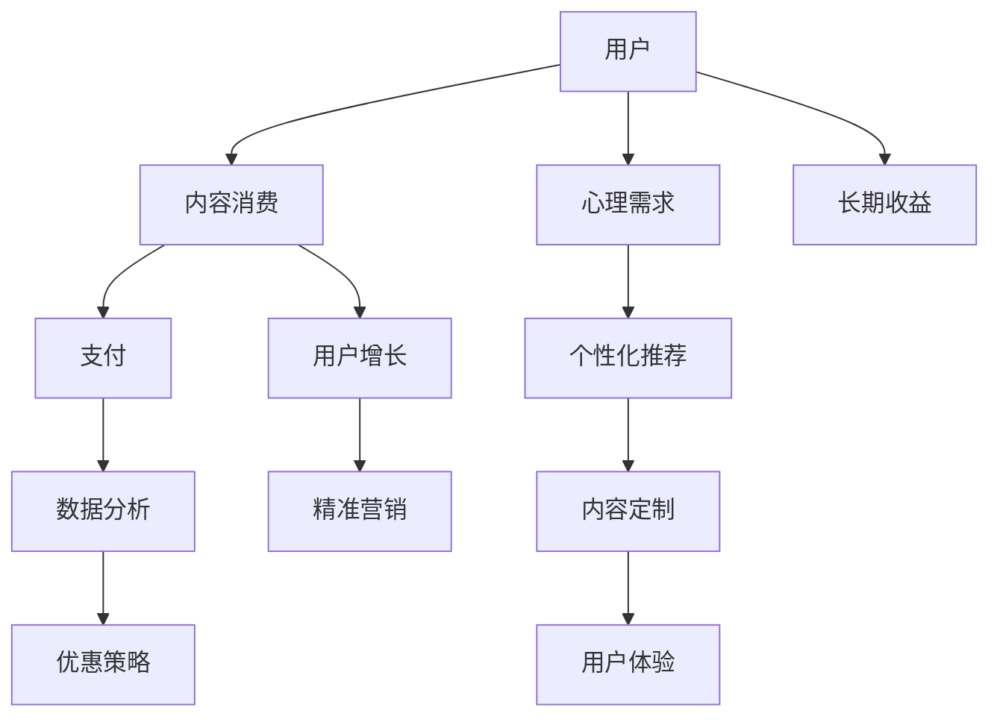

                 

# 如何设计有吸引力的知识付费优惠活动

> 关键词：知识付费, 用户增长, 优惠策略, 精准营销, 数据分析, 长期收益

## 1. 背景介绍

在知识付费快速发展的今天，越来越多的用户开始为优质内容付费，知识付费市场日益繁荣。然而，付费门槛高、内容质量参差不齐等问题也随之而来。为了吸引更多的用户，知识付费平台纷纷推出各类优惠活动。本文将深入探讨如何设计有吸引力的知识付费优惠活动，从用户的角度出发，制定合理的策略，以实现用户增长和平台收益的双赢。

## 2. 核心概念与联系

在设计知识付费优惠活动时，我们需要掌握几个核心概念及其相互联系：

### 2.1 核心概念概述

- **知识付费**：用户为获取专业内容或技能，通过付费订阅、单次付费、打赏等方式获取知识的消费行为。
- **用户增长**：指知识付费平台吸引并保留更多用户的过程，包括新用户获取和现有用户留存。
- **优惠策略**：平台为吸引用户，推出折扣、赠品、试用期等优惠措施。
- **精准营销**：通过分析用户行为、兴趣等信息，向用户推送个性化、有针对性的优惠信息。
- **数据分析**：利用用户行为数据，分析用户偏好、消费行为，优化优惠活动效果。
- **长期收益**：在确保用户获取良好体验的同时，通过长期付费和持续性消费，实现平台收益最大化。

### 2.2 核心概念原理和架构的 Mermaid 流程图



这个流程图展示了用户从接触到购买，再到最终成为长期付费用户的路径。各个环节相互关联，共同构成了知识付费平台的整体营销框架。

## 3. 核心算法原理 & 具体操作步骤

### 3.1 算法原理概述

设计有吸引力的知识付费优惠活动，需要基于用户行为数据和心理特征，通过数学模型进行建模和优化。核心算法原理主要包括以下几个方面：

- **用户行为分析**：通过分析用户的行为数据，如浏览记录、购买历史、评分评价等，了解用户的偏好和需求。
- **心理需求建模**：研究用户心理需求，如获取新知的渴望、自我提升的需求等，设计符合用户心理预期的优惠活动。
- **决策树和推荐系统**：构建决策树模型和推荐系统，根据用户特征和行为数据，推荐合适的优惠活动。
- **收益优化**：利用优化算法，如梯度下降、遗传算法等，优化优惠活动设计，实现收益最大化。

### 3.2 算法步骤详解

1. **用户行为数据分析**：
    - 收集用户的浏览记录、购买记录、评分评价等数据。
    - 通过统计分析、关联规则挖掘等方法，发现用户的行为模式和偏好。
    - 使用聚类算法（如K-Means）对用户进行分群，识别出不同类型用户群体。

2. **心理需求建模**：
    - 进行用户心理需求调研，使用问卷调查、心理测试等手段，了解用户的心理预期和需求。
    - 构建心理需求模型，将用户的行为特征与心理需求映射起来。
    - 通过机器学习算法（如逻辑回归、随机森林）进行建模，预测用户的心理需求。

3. **决策树和推荐系统设计**：
    - 设计决策树模型，根据用户行为数据和心理需求，选择适合的优惠活动。
    - 引入推荐系统，结合用户的购买历史和浏览行为，推荐符合用户偏好的优惠活动。
    - 优化推荐系统，利用协同过滤、基于内容的推荐等技术，提升推荐效果。

4. **收益优化算法**：
    - 确定优化目标函数，如用户转化率、复购率、ARPU（每用户平均收益）等。
    - 使用梯度下降、遗传算法等优化算法，对优惠活动进行参数调整。
    - 评估优化效果，利用A/B测试等方法，比较不同策略的效果。

### 3.3 算法优缺点

**优点**：
- 精细化用户画像，提高推荐精准度。
- 优化活动设计，提升用户转化率和复购率。
- 最大化平台收益，实现长期盈利。

**缺点**：
- 数据收集和分析成本高，需要投入大量资源。
- 算法复杂度较高，需要较高的技术水平和专业知识。
- 用户行为和心理需求难以预测，存在不确定性。

### 3.4 算法应用领域

知识付费优惠活动的核心算法原理可以应用于多个领域，如电子商务、在线教育、金融理财等。通过分析用户行为和心理需求，制定合理的优惠策略，可以有效提升用户增长和平台收益。

## 4. 数学模型和公式 & 详细讲解

### 4.1 数学模型构建

为了实现有吸引力的知识付费优惠活动设计，可以构建以下数学模型：

- **用户行为分析模型**：
    - 数据集：$D=\{(x_i, y_i)\}_{i=1}^N$
    - 目标：预测用户是否会购买课程 $y_i$
    - 模型：$y_i=f(x_i;\theta)$

- **心理需求模型**：
    - 数据集：$D=\{(x_i, y_i)\}_{i=1}^N$
    - 目标：预测用户的心理需求 $y_i$
    - 模型：$y_i=g(x_i;\theta)$

- **优惠策略模型**：
    - 数据集：$D=\{(x_i, y_i)\}_{i=1}^N$
    - 目标：预测优惠策略 $y_i$
    - 模型：$y_i=h(x_i;\theta)$

### 4.2 公式推导过程

以用户行为分析模型为例，我们采用逻辑回归模型进行推导：

- 输入特征 $x_i=(x_{i1},x_{i2},...,x_{in})$
- 目标变量 $y_i \in \{0,1\}$，其中1表示购买，0表示不购买
- 模型参数 $\theta=(\theta_1,\theta_2,...,\theta_n)$

逻辑回归模型的公式如下：

$$
\begin{aligned}
    f(x_i;\theta) &= \frac{1}{1+\exp(-\sum_{j=1}^n \theta_j x_{ij})} \\
    \hat{y_i} &= \left\{\begin{aligned}
        1 & , & f(x_i;\theta) > 0.5 \\
        0 & , & f(x_i;\theta) \leq 0.5
    \end{aligned}\right.
\end{aligned}
$$

其中 $f(x_i;\theta)$ 为逻辑回归模型的输出，$\hat{y_i}$ 为预测结果。

### 4.3 案例分析与讲解

假设某知识付费平台收集了用户浏览、购买、评分等数据，使用逻辑回归模型进行建模。输入特征包括用户的浏览时长、课程评分、用户评分等。模型输出为0-1之间的概率值，表示用户购买课程的概率。根据预测结果，平台可以选择不同的优惠策略，如折扣、赠品、试用期等。

## 5. 项目实践：代码实例和详细解释说明

### 5.1 开发环境搭建

为了进行优惠活动设计，我们需要搭建以下开发环境：

1. **Python环境**：安装Python 3.x，推荐使用Anaconda。
2. **数据分析库**：安装Pandas、NumPy等数据分析库。
3. **机器学习库**：安装Scikit-learn、TensorFlow等机器学习库。
4. **可视化库**：安装Matplotlib、Seaborn等可视化库。

### 5.2 源代码详细实现

以下是一个简单的用户行为分析模型的代码实现：

```python
import pandas as pd
from sklearn.model_selection import train_test_split
from sklearn.linear_model import LogisticRegression
from sklearn.metrics import accuracy_score

# 数据准备
data = pd.read_csv('user_behavior.csv')
X = data[['browsing_time', 'course_score', 'user_score']]
y = data['is_purchase']

# 数据划分
X_train, X_test, y_train, y_test = train_test_split(X, y, test_size=0.2)

# 逻辑回归模型
model = LogisticRegression()
model.fit(X_train, y_train)

# 预测测试集
y_pred = model.predict(X_test)

# 评估模型
accuracy = accuracy_score(y_test, y_pred)
print('Accuracy:', accuracy)
```

### 5.3 代码解读与分析

代码中，我们首先导入了Pandas、NumPy、Scikit-learn等库，并读取了用户行为数据。接着，将数据划分为训练集和测试集，并使用逻辑回归模型进行训练。最后，通过测试集评估模型的准确率。

## 6. 实际应用场景

### 6.1 用户增长

在用户增长方面，优惠活动可以有以下几种方式：

1. **新用户优惠**：针对新注册用户，提供首单折扣、免费试用等优惠。
2. **推荐好友优惠**：老用户通过推荐新用户，可以获得折扣、积分等奖励。
3. **节日优惠**：在特定节日（如春节、双十一）推出大规模折扣活动，吸引用户参与。

### 6.2 精准营销

通过数据分析，可以设计出精准的营销活动，提升用户转化率。

1. **个性化推荐**：根据用户的浏览行为和购买历史，推荐符合其兴趣的课程。
2. **动态定价**：根据用户的消费行为，动态调整课程价格，吸引用户购买。
3. **用户画像分析**：利用聚类算法和关联规则挖掘，识别出高价值用户群体，针对性营销。

### 6.3 长期收益

在设计优惠活动时，需考虑长期收益，避免一次性优惠导致用户流失。

1. **阶梯定价**：通过分阶段折扣，引导用户逐步增加付费频率。
2. **会员优惠**：设计会员制度，提供会员专享折扣、内容更新等福利。
3. **积分系统**：引入积分奖励机制，激励用户持续消费。

## 7. 工具和资源推荐

### 7.1 学习资源推荐

- **《机器学习实战》**：详细讲解了机器学习的基本概念和算法，适合入门学习。
- **Kaggle竞赛**：参与Kaggle竞赛，实践数据分析和机器学习技能。
- **Coursera课程**：Coursera提供了丰富的数据分析和机器学习课程，涵盖多种算法和工具。
- **GitHub项目**：GitHub上有大量优秀的开源项目，可以作为学习和参考的资源。

### 7.2 开发工具推荐

- **Jupyter Notebook**：免费的交互式编程环境，支持Python代码的在线编辑和运行。
- **PyCharm**：专业的Python开发工具，提供代码自动补全、调试等功能。
- **RapidMiner**：一款数据挖掘和分析平台，提供可视化的数据处理和建模工具。
- **Tableau**：数据可视化工具，支持复杂的数据分析和报表生成。

### 7.3 相关论文推荐

- **《深度学习入门：基于Python的理论与实现》**：介绍了深度学习的基本概念和实现方法，适合入门学习。
- **《大数据分析：方法与实践》**：详细讲解了大数据分析的基本方法和技术，适合数据分析领域从业者。
- **《机器学习实战》**：讲解了多种机器学习算法及其应用，适合实际开发使用。
- **《数据挖掘导论》**：讲解了数据挖掘的基本概念和算法，适合了解数据挖掘技术。

## 8. 总结：未来发展趋势与挑战

### 8.1 研究成果总结

在知识付费优惠活动的设计中，我们通过用户行为数据分析、心理需求建模、决策树和推荐系统设计，结合收益优化算法，构建了一套精细化的优惠活动设计框架。该框架能够根据用户特征和行为数据，推荐合适的优惠活动，提升用户转化率和平台收益。

### 8.2 未来发展趋势

1. **智能化推荐**：随着AI技术的发展，智能化推荐系统将更加精准，提升用户满意度。
2. **实时化优化**：通过实时数据流分析，动态调整优惠活动策略，提升用户体验。
3. **个性化定价**：结合用户行为数据和市场变化，实现个性化定价，优化收益。

### 8.3 面临的挑战

1. **数据隐私**：用户行为数据涉及隐私问题，需要加强数据保护和隐私管理。
2. **算法复杂性**：优惠活动设计需要高水平算法技术，对开发者和技术人员要求较高。
3. **模型泛化性**：用户行为和心理需求复杂多样，模型需要具备良好的泛化性。

### 8.4 研究展望

未来的研究可以聚焦以下几个方向：

1. **多模态数据融合**：结合用户行为、社交数据、地理位置等多模态数据，构建更加全面、准确的用户画像。
2. **对抗性攻击防御**：分析用户对优惠活动的响应行为，设计抗攻击的防御策略。
3. **深度学习优化**：引入深度学习技术，提升推荐系统的精准度和泛化性。

综上所述，通过科学的算法设计和数据驱动的策略优化，我们可以设计出有吸引力的知识付费优惠活动，提升用户增长和平台收益。然而，优惠活动设计并非一劳永逸，需要持续跟进用户行为和市场变化，不断优化活动设计，实现长期收益和用户价值的最大化。

## 9. 附录：常见问题与解答

### Q1: 用户行为分析如何实现？

A: 用户行为分析可以通过数据收集和分析实现。具体步骤如下：
1. 收集用户行为数据，包括浏览记录、购买记录、评分评价等。
2. 使用数据分析工具，如Pandas、NumPy，对数据进行处理和分析。
3. 利用机器学习算法，如逻辑回归、决策树、随机森林等，构建用户行为分析模型。

### Q2: 如何设计个性化的推荐系统？

A: 个性化推荐系统设计可以通过以下步骤实现：
1. 收集用户行为数据，包括浏览记录、购买记录等。
2. 使用协同过滤、基于内容的推荐等算法，构建个性化推荐模型。
3. 引入深度学习技术，如协同矩阵分解、深度神经网络等，提升推荐效果。

### Q3: 如何保证用户数据隐私？

A: 用户数据隐私保护可以从以下几个方面进行：
1. 匿名化处理：对用户数据进行匿名化处理，保护用户隐私。
2. 数据加密：对敏感数据进行加密存储，防止数据泄露。
3. 访问控制：严格控制数据访问权限，防止未经授权的访问。
4. 法律法规遵守：遵循相关法律法规，如GDPR、CCPA等，保护用户数据隐私。

### Q4: 如何提升用户转化率？

A: 提升用户转化率可以通过以下方式实现：
1. 个性化推荐：根据用户行为数据，推荐符合用户兴趣的内容。
2. 动态定价：根据用户行为数据，动态调整商品价格，吸引用户购买。
3. 精准营销：通过数据分析，设计针对性的营销活动，提高用户转化率。

综上所述，通过科学的算法设计和数据驱动的策略优化，我们可以设计出有吸引力的知识付费优惠活动，提升用户增长和平台收益。然而，优惠活动设计并非一劳永逸，需要持续跟进用户行为和市场变化，不断优化活动设计，实现长期收益和用户价值的最大化。

---

作者：禅与计算机程序设计艺术 / Zen and the Art of Computer Programming

