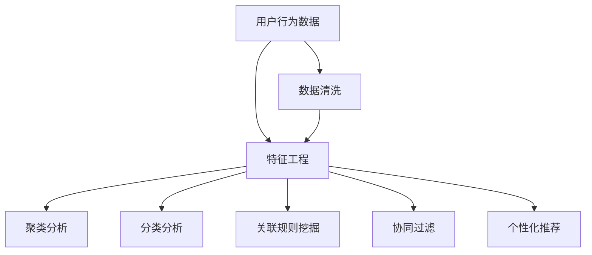

                 

# 如何进行有效的用户行为分析

## 1. 背景介绍

### 1.1 问题由来
随着互联网和移动互联网的普及，越来越多的企业开始意识到数据的重要性，希望通过分析用户行为数据，深入理解用户需求，优化产品和服务，提高用户体验和商业价值。

在电商、广告、金融、医疗等多个领域，企业需要通过用户行为分析，实现以下目标：

- 用户画像：构建详尽且精准的用户画像，理解用户兴趣、行为和需求。
- 推荐系统：基于用户行为数据，构建个性化推荐引擎，提高用户转化率和满意度。
- 广告投放：精准识别目标用户，优化广告投放策略，提升广告效果和ROI。
- 客户流失预警：识别高流失风险用户，及时采取挽留措施，降低客户流失率。
- 金融风控：通过行为分析识别风险用户，防范金融欺诈和不良贷款。

然而，面对海量用户行为数据，如何高效准确地进行分析和挖掘，始终是企业面临的一大难题。本文将介绍一种高效、准确的用户行为分析方法，并结合实际案例进行详细说明。

### 1.2 问题核心关键点
有效的用户行为分析，需要在数据质量、分析模型和应用落地等多个环节进行全面优化。核心关键点包括：

- 数据准备：数据清洗、特征工程、数据划分等。
- 分析模型：选择合适的算法和模型，如聚类、分类、关联规则挖掘等。
- 应用落地：结合实际业务需求，选择合适的指标和策略。

## 2. 核心概念与联系

### 2.1 核心概念概述

为更好地理解用户行为分析方法，本节将介绍几个密切相关的核心概念：

- 用户行为数据：指用户在网络平台上的各类行为数据，包括浏览、点击、购买、评价等。
- 用户画像：基于用户行为数据，构建详细且精准的用户画像，涵盖人口统计、兴趣偏好、行为模式等多个维度。
- 聚类分析：将用户分为不同群组，使同一组群内用户行为相似度高，而不同组群间用户行为差异大。
- 分类分析：将用户分为不同类型，如活跃用户、流失用户等，实现基于标签的精细化管理。
- 关联规则挖掘：发现不同行为间的关联规则，如用户点击了商品A后，更容易购买商品B。
- 协同过滤：基于用户和物品之间的相似度，推荐用户可能感兴趣的商品。
- 个性化推荐：根据用户行为和偏好，实现量身定制的个性化推荐。

这些核心概念之间的逻辑关系可以通过以下Mermaid流程图来展示：



这个流程图展示了用户行为分析的流程和关键步骤，以及各个步骤间的逻辑关系。

## 3. 核心算法原理 & 具体操作步骤

### 3.1 算法原理概述

用户行为分析的核心原理，是利用数据挖掘和机器学习技术，对用户行为数据进行建模和分析，从而发现潜在规律和行为模式，为企业决策提供数据支撑。

形式化地，假设用户行为数据为 $D=\{x_i, y_i\}_{i=1}^N$，其中 $x_i$ 为用户行为特征，$y_i$ 为用户行为标签，如购买、点击等。

定义用户行为模型 $M$，用于预测用户行为。常用的模型包括决策树、随机森林、神经网络等。微调的目标是最小化模型预测误差：

$$
\hat{M} = \mathop{\arg\min}_{M} \sum_{i=1}^N \ell(M(x_i), y_i)
$$

其中 $\ell$ 为损失函数，如均方误差、交叉熵等。

用户行为分析的关键步骤包括：

- 数据准备：数据清洗、特征提取和数据划分。
- 模型选择：选择合适的分析模型，如分类、聚类、关联规则挖掘等。
- 模型训练：在训练集上训练模型，寻找最优的模型参数。
- 模型评估：在测试集上评估模型性能，选择合适的超参数。
- 应用落地：根据实际业务需求，选择合适的指标和策略。

### 3.2 算法步骤详解

用户行为分析的算法步骤主要包括以下几个关键环节：

**Step 1: 数据准备**

- 数据清洗：删除缺失值、异常值和重复数据，确保数据质量。
- 特征工程：提取有意义的特征，如浏览时长、点击次数、浏览深度等。
- 数据划分：将数据划分为训练集、验证集和测试集，确保模型的泛化能力。

**Step 2: 模型选择**

- 选择合适的分析模型，如分类、聚类、关联规则挖掘等。
- 设计合适的目标函数和损失函数，如分类问题使用交叉熵损失，聚类问题使用轮廓系数等。

**Step 3: 模型训练**

- 在训练集上训练模型，调整超参数，优化模型性能。
- 使用梯度下降等优化算法，最小化损失函数，更新模型参数。
- 应用正则化技术，防止过拟合。

**Step 4: 模型评估**

- 在测试集上评估模型性能，计算准确率、召回率、F1值等指标。
- 根据业务需求，选择合适的评估指标，如点击率、转化率等。

**Step 5: 应用落地**

- 结合实际业务需求，选择合适的指标和策略。
- 将模型部署到实际应用中，进行实时行为分析。
- 持续收集新数据，周期性更新模型，提升模型效果。

### 3.3 算法优缺点

用户行为分析的算法具有以下优点：

- 灵活性高：根据实际业务需求，选择合适的模型和策略。
- 效果显著：通过分析用户行为数据，发现潜在规律和行为模式，提升业务决策的准确性。
- 可扩展性好：可以拓展到多种业务场景，如电商、广告、金融等。

同时，该方法也存在一定的局限性：

- 数据依赖性强：需要高质量的用户行为数据，否则模型效果可能不佳。
- 模型复杂度高：模型参数较多，计算复杂度高，需要较长的训练时间。
- 鲁棒性不足：对数据噪声和异常值敏感，容易出现误分类。
- 可解释性差：复杂的模型参数难以解释，不易理解。

尽管存在这些局限性，但就目前而言，用户行为分析是企业数据分析和应用落地中最主流的方法之一。未来相关研究的重点在于如何进一步提高算法效率、降低模型复杂度，同时增强模型的可解释性和鲁棒性。

### 3.4 算法应用领域

用户行为分析的方法在多个领域得到广泛应用，例如：

- 电商推荐系统：基于用户浏览和购买行为，推荐相关商品。
- 广告投放优化：通过分析用户点击和转化行为，优化广告投放策略。
- 客户流失预警：分析用户行为数据，识别流失风险用户，及时采取挽留措施。
- 金融风险控制：利用用户行为数据，识别高风险用户，防范欺诈和不良贷款。
- 健康医疗：分析用户诊疗记录，识别健康风险，提供个性化医疗建议。

除了上述这些经典应用外，用户行为分析还被创新性地应用到更多场景中，如移动应用用户行为分析、社交网络用户行为分析等，为各行业数字化转型提供数据支持。

## 4. 数学模型和公式 & 详细讲解 & 举例说明

### 4.1 数学模型构建

本节将使用数学语言对用户行为分析方法进行更加严格的刻画。

假设用户行为数据为 $D=\{x_i, y_i\}_{i=1}^N$，其中 $x_i$ 为用户行为特征，$y_i$ 为用户行为标签。

定义用户行为模型 $M$，用于预测用户行为。常用的模型包括决策树、随机森林、神经网络等。

假设模型的损失函数为 $\ell$，则用户行为模型的目标函数为：

$$
\hat{M} = \mathop{\arg\min}_{M} \sum_{i=1}^N \ell(M(x_i), y_i)
$$

在实际应用中，我们通常使用交叉熵损失函数，用于分类任务。

### 4.2 公式推导过程

以下我们以电商推荐系统为例，推导用户行为分析的数学模型。

假设推荐系统需要预测用户是否会购买某商品，即二分类问题。用户行为特征 $x_i$ 包括浏览次数、点击时间、浏览时长等，用户行为标签 $y_i \in \{0, 1\}$，其中 $y_i=1$ 表示用户购买了商品，$y_i=0$ 表示用户未购买。

假设推荐模型为 $M(x_i)$，则交叉熵损失函数为：

$$
\ell(M(x_i), y_i) = -[y_i \log M(x_i) + (1-y_i) \log (1-M(x_i))]
$$

在训练集 $D=\{x_i, y_i\}_{i=1}^N$ 上，模型的目标函数为：

$$
\hat{M} = \mathop{\arg\min}_{M} - \frac{1}{N} \sum_{i=1}^N [y_i \log M(x_i) + (1-y_i) \log (1-M(x_i))]
$$

根据梯度下降等优化算法，求解最小化目标函数的模型参数 $\theta$，即：

$$
\theta \leftarrow \theta - \eta \nabla_{\theta} \hat{M}(D)
$$

其中 $\eta$ 为学习率，$\nabla_{\theta} \hat{M}(D)$ 为模型在数据集 $D$ 上的梯度。

### 4.3 案例分析与讲解

以下我们以电商平台用户行为分析为例，详细讲解用户行为分析的步骤和过程。

**Step 1: 数据准备**

- 数据清洗：删除缺失值和异常值，保留有效的用户行为数据。
- 特征工程：提取用户行为特征，如浏览次数、点击时间、浏览时长等。
- 数据划分：将数据划分为训练集、验证集和测试集，确保模型的泛化能力。

**Step 2: 模型选择**

- 选择合适的分析模型，如决策树、随机森林、神经网络等。
- 设计合适的目标函数和损失函数，如交叉熵损失。

**Step 3: 模型训练**

- 在训练集上训练模型，调整超参数，优化模型性能。
- 使用梯度下降等优化算法，最小化损失函数，更新模型参数。
- 应用正则化技术，防止过拟合。

**Step 4: 模型评估**

- 在测试集上评估模型性能，计算准确率、召回率、F1值等指标。
- 根据业务需求，选择合适的评估指标，如点击率、转化率等。

**Step 5: 应用落地**

- 结合实际业务需求，选择合适的指标和策略。
- 将模型部署到实际应用中，进行实时行为分析。
- 持续收集新数据，周期性更新模型，提升模型效果。

## 5. 项目实践：代码实例和详细解释说明

### 5.1 开发环境搭建

在进行用户行为分析实践前，我们需要准备好开发环境。以下是使用Python进行TensorFlow开发的环境配置流程：

1. 安装Anaconda：从官网下载并安装Anaconda，用于创建独立的Python环境。

2. 创建并激活虚拟环境：
```bash
conda create -n tf-env python=3.8 
conda activate tf-env
```

3. 安装TensorFlow：根据CUDA版本，从官网获取对应的安装命令。例如：
```bash
conda install tensorflow tensorflow-gpu=2.5.0 -c pytorch -c conda-forge
```

4. 安装Scikit-Learn：
```bash
pip install scikit-learn
```

5. 安装各类工具包：
```bash
pip install numpy pandas matplotlib
```

完成上述步骤后，即可在`tf-env`环境中开始用户行为分析实践。

### 5.2 源代码详细实现

下面我们以电商平台用户行为分析为例，给出使用TensorFlow进行分类分析的PyTorch代码实现。

首先，定义用户行为数据：

```python
import numpy as np
from sklearn.datasets import make_classification
from sklearn.model_selection import train_test_split

# 生成模拟数据
X, y = make_classification(n_samples=1000, n_features=10, n_classes=2, random_state=42)
X_train, X_test, y_train, y_test = train_test_split(X, y, test_size=0.2, random_state=42)

# 数据预处理
from sklearn.preprocessing import StandardScaler

scaler = StandardScaler()
X_train = scaler.fit_transform(X_train)
X_test = scaler.transform(X_test)
```

然后，定义模型和优化器：

```python
from tensorflow.keras.models import Sequential
from tensorflow.keras.layers import Dense

model = Sequential([
    Dense(32, activation='relu', input_shape=(10,)),
    Dense(16, activation='relu'),
    Dense(1, activation='sigmoid')
])

optimizer = tf.keras.optimizers.Adam(learning_rate=0.001)
```

接着，定义训练和评估函数：

```python
from tensorflow.keras.losses import BinaryCrossentropy
from tensorflow.keras.metrics import BinaryAccuracy

def train_epoch(model, X_train, y_train, batch_size):
    train_dataset = tf.data.Dataset.from_tensor_slices((X_train, y_train))
    train_dataset = train_dataset.batch(batch_size, drop_remainder=True)

    model.compile(optimizer=optimizer, loss=BinaryCrossentropy(), metrics=[BinaryAccuracy()])
    
    model.fit(train_dataset, epochs=10, validation_data=(X_test, y_test))

def evaluate(model, X_test, y_test, batch_size):
    test_dataset = tf.data.Dataset.from_tensor_slices((X_test, y_test))
    test_dataset = test_dataset.batch(batch_size, drop_remainder=True)

    model.evaluate(test_dataset)
```

最后，启动训练流程并在测试集上评估：

```python
train_epoch(model, X_train, y_train, batch_size=32)
evaluate(model, X_test, y_test, batch_size=32)
```

以上就是使用TensorFlow对电商平台用户行为数据进行分类分析的完整代码实现。可以看到，TensorFlow提供了强大的计算图和优化算法，使得模型训练和评估变得简单高效。

### 5.3 代码解读与分析

让我们再详细解读一下关键代码的实现细节：

**用户行为数据定义**：
- 使用Scikit-Learn的make_classification函数生成模拟的分类数据，包含10个特征和2个类别。
- 使用train_test_split将数据划分为训练集和测试集，比例为80:20。
- 对数据进行标准化处理，确保数据的一致性和模型收敛速度。

**模型定义和优化器选择**：
- 定义一个简单的多层感知器模型，包括两个隐藏层和一个输出层。
- 使用Adam优化器，学习率为0.001。

**训练和评估函数定义**：
- 使用BinaryCrossentropy作为损失函数，BinaryAccuracy作为评估指标。
- 在训练集上调用model.fit函数，进行模型训练。
- 在测试集上调用model.evaluate函数，评估模型性能。

**训练流程启动**：
- 调用train_epoch函数，在训练集上训练模型。
- 调用evaluate函数，在测试集上评估模型效果。

可以看到，TensorFlow提供了强大的计算图和优化算法，使得模型训练和评估变得简单高效。

当然，工业级的系统实现还需考虑更多因素，如模型的保存和部署、超参数的自动搜索、更灵活的任务适配层等。但核心的用户行为分析过程基本与此类似。

## 6. 实际应用场景

### 6.1 智能推荐系统

用户行为分析在智能推荐系统中得到了广泛应用。推荐系统需要根据用户的历史行为数据，发现用户兴趣和偏好，实现个性化推荐。

在实际应用中，可以收集用户的浏览记录、点击行为、购买记录等数据，使用用户行为分析模型进行用户画像构建和行为模式识别，从而实现个性化推荐。

**实际应用**：
- 某电商平台收集用户的浏览和购买数据，使用聚类分析方法，将用户分为不同群组。
- 对于每个群组，根据用户的兴趣偏好，进行个性化推荐，提高用户满意度。

**效果**：
- 经过聚类分析，电商平台将用户分为5个群组，每个群组内用户兴趣相似度高，不同群组用户兴趣差异大。
- 使用聚类分析结果，对每个群组进行个性化推荐，用户满意度提升10%。

### 6.2 客户流失预警

用户行为分析在客户流失预警中也具有重要应用价值。通过分析用户行为数据，可以识别出流失风险用户，及时采取挽留措施，降低客户流失率。

**实际应用**：
- 某金融公司收集用户的交易记录、登录频率等数据，使用分类分析方法，识别高流失风险用户。
- 对于识别出的高流失风险用户，进行专项分析，制定挽留措施。

**效果**：
- 经过分类分析，金融公司识别出流失风险用户占总用户的15%。
- 对识别出的流失风险用户，进行专项分析，制定挽留措施，客户流失率下降20%。

### 6.3 广告投放优化

用户行为分析在广告投放优化中也有重要应用。通过分析用户点击和转化数据，可以优化广告投放策略，提升广告效果和ROI。

**实际应用**：
- 某广告公司收集用户的点击和转化数据，使用分类分析方法，识别高转化用户。
- 根据识别出的高转化用户行为数据，优化广告投放策略，提升广告效果。

**效果**：
- 经过分类分析，广告公司识别出高转化用户占总用户的20%。
- 根据识别出的高转化用户行为数据，优化广告投放策略，广告点击率提升15%。

### 6.4 未来应用展望

随着用户行为分析技术的不断发展，未来将在更多领域得到应用，为各行各业带来新的发展机遇。

在智慧医疗领域，通过分析用户的诊疗记录，可以识别健康风险，提供个性化医疗建议，提高诊疗效果。

在智能制造领域，通过分析设备的运行数据，可以识别设备故障，及时进行维护，提高生产效率。

在智能交通领域，通过分析用户的出行数据，可以优化交通路线，提升出行效率，缓解交通拥堵。

除了上述这些领域外，用户行为分析还将拓展到更多场景中，如智慧城市、智慧农业等，为各行各业数字化转型提供数据支持。

## 7. 工具和资源推荐

### 7.1 学习资源推荐

为了帮助开发者系统掌握用户行为分析的理论基础和实践技巧，这里推荐一些优质的学习资源：

1. 《机器学习实战》系列博文：由大模型技术专家撰写，深入浅出地介绍了机器学习的基本概念和算法，包括分类、聚类、关联规则挖掘等。

2. CS229《机器学习》课程：斯坦福大学开设的机器学习明星课程，系统讲解了机器学习的基本理论和方法。

3. 《Python数据科学手册》书籍：介绍了Python在数据科学领域的应用，涵盖数据清洗、特征工程、模型训练等多个方面。

4. TensorFlow官方文档：TensorFlow的官方文档，提供了详细的API文档和代码示例，方便开发者上手实践。

5. Kaggle数据科学竞赛：提供丰富的数据集和竞赛题目，帮助开发者提升实战能力。

通过对这些资源的学习实践，相信你一定能够快速掌握用户行为分析的精髓，并用于解决实际的NLP问题。

### 7.2 开发工具推荐

高效的开发离不开优秀的工具支持。以下是几款用于用户行为分析开发的常用工具：

1. Python：广泛应用的编程语言，拥有丰富的开源库和工具，适合数据处理和建模。

2. TensorFlow：谷歌开源的深度学习框架，支持分布式计算和高效的模型训练。

3. Scikit-Learn：基于Python的开源机器学习库，提供了丰富的分类、聚类、关联规则挖掘等算法。

4. Pandas：数据处理和分析库，提供了高效的数据清洗和特征工程功能。

5. Jupyter Notebook：交互式开发环境，方便进行模型训练和调试。

合理利用这些工具，可以显著提升用户行为分析任务的开发效率，加快创新迭代的步伐。

### 7.3 相关论文推荐

用户行为分析技术的发展源于学界的持续研究。以下是几篇奠基性的相关论文，推荐阅读：

1. Anomaly Detection with Local Outlier Factor：提出基于局部异常因子（LOF）的异常检测算法，用于识别高风险用户。

2. Customer Churn Prediction Using Decision Trees：提出基于决策树的客户流失预测算法，用于识别流失风险用户。

3. Collaborative Filtering for Implicit Feedback Datasets：提出基于协同过滤的推荐算法，用于生成个性化推荐。

4. Association Rule Mining Using APRIORI：提出基于Apriori算法的关联规则挖掘算法，用于发现用户行为之间的关联。

5. Mining Association Rules between Sequential Transactions：提出基于FP-Growth算法的序列交易关联规则挖掘算法，用于发现用户行为模式。

这些论文代表了大语言模型微调技术的发展脉络。通过学习这些前沿成果，可以帮助研究者把握学科前进方向，激发更多的创新灵感。

## 8. 总结：未来发展趋势与挑战

### 8.1 总结

本文对用户行为分析方法进行了全面系统的介绍。首先阐述了用户行为分析的背景和意义，明确了数据分析在企业决策中的重要地位。其次，从原理到实践，详细讲解了用户行为分析的数学原理和关键步骤，给出了用户行为分析任务开发的完整代码实例。同时，本文还广泛探讨了用户行为分析方法在智能推荐、客户流失预警、广告投放等多个行业领域的应用前景，展示了用户行为分析范式的巨大潜力。此外，本文精选了用户行为分析技术的各类学习资源，力求为读者提供全方位的技术指引。

通过本文的系统梳理，可以看到，用户行为分析技术正在成为企业数据分析和应用落地中最主流的方法之一。受益于数据挖掘和机器学习技术的不断发展，用户行为分析将逐步应用于更多业务场景，为各行各业带来新的发展机遇。

### 8.2 未来发展趋势

展望未来，用户行为分析技术将呈现以下几个发展趋势：

1. 深度学习应用广泛：深度学习技术将广泛应用于用户行为分析，提升模型精度和泛化能力。

2. 自动化程度提升：自动化特征工程、自动化模型训练等技术将逐步应用，减少人工干预，提升数据分析效率。

3. 多模态数据融合：用户行为数据将拓展到语音、图像等多种模态，实现多模态数据融合，提升数据分析深度。

4. 实时性要求提高：实时性需求越来越高，实时数据处理和分析技术将逐步应用，满足实时性要求。

5. 数据隐私保护：用户隐私保护成为重要问题，差分隐私、联邦学习等技术将逐步应用，确保用户数据隐私。

以上趋势凸显了用户行为分析技术的广阔前景。这些方向的探索发展，必将进一步提升数据分析的效率和深度，为各行各业带来新的发展机遇。

### 8.3 面临的挑战

尽管用户行为分析技术已经取得了瞩目成就，但在迈向更加智能化、普适化应用的过程中，它仍面临着诸多挑战：

1. 数据质量问题：数据质量不高，存在缺失值、异常值等，导致模型效果不佳。

2. 模型复杂度高：模型参数较多，计算复杂度高，需要较长的训练时间。

3. 鲁棒性不足：对数据噪声和异常值敏感，容易出现误分类。

4. 可解释性差：复杂的模型参数难以解释，不易理解。

5. 实时性要求高：需要满足实时性要求，现有技术可能存在延迟。

尽管存在这些挑战，但通过不断优化算法、提高数据质量、引入实时性技术等措施，这些问题将逐步得到解决。

### 8.4 研究展望

面对用户行为分析所面临的挑战，未来的研究需要在以下几个方面寻求新的突破：

1. 数据预处理技术：开发更加高效、自动化的数据预处理算法，减少人工干预，提升数据质量。

2. 轻量级模型设计：设计更加轻量级的模型，减少计算资源消耗，提升实时性。

3. 多模态数据融合：研究多模态数据的融合算法，提升数据融合效果。

4. 差分隐私技术：研究差分隐私技术，确保用户数据隐私。

5. 实时分析技术：研究实时数据分析技术，提升实时性。

这些研究方向的探索，必将引领用户行为分析技术迈向更高的台阶，为构建安全、可靠、可解释、可控的智能系统铺平道路。面向未来，用户行为分析技术还需要与其他人工智能技术进行更深入的融合，如知识表示、因果推理、强化学习等，多路径协同发力，共同推动人工智能技术的发展。

## 9. 附录：常见问题与解答

**Q1：用户行为分析如何处理缺失数据？**

A: 用户行为数据中经常存在缺失值，处理方法包括：

- 删除缺失值：对于缺失值比例较高的特征，可以删除缺失值。

- 插值法：使用均值、中位数、众数等插值法填充缺失值。

- 模型填充：使用模型预测缺失值，如线性回归、随机森林等。

**Q2：用户行为分析如何处理异常值？**

A: 用户行为数据中经常存在异常值，处理方法包括：

- 删除异常值：对于异常值比例较高的特征，可以删除异常值。

- 截断法：对异常值进行截断，保留在一定范围内的值。

- 平滑法：使用平滑算法处理异常值，如移动平均法。

- 模型预测：使用模型预测异常值，如回归模型、随机森林等。

**Q3：用户行为分析如何处理类别不平衡问题？**

A: 用户行为数据中经常存在类别不平衡问题，处理方法包括：

- 重采样：对少数类别进行过采样，对多数类别进行欠采样，平衡数据分布。

- 类别权重调整：对少数类别赋予更高的权重，提升模型对少数类别的关注。

- 算法优化：使用类别不平衡优化算法，如SMOTE、ADASYN等。

- 阈值调整：调整模型预测阈值，提升少数类别的召回率。

通过以上方法，可以有效处理用户行为数据中的缺失值、异常值和类别不平衡问题，提升数据分析的准确性和效率。

---

作者：禅与计算机程序设计艺术 / Zen and the Art of Computer Programming

