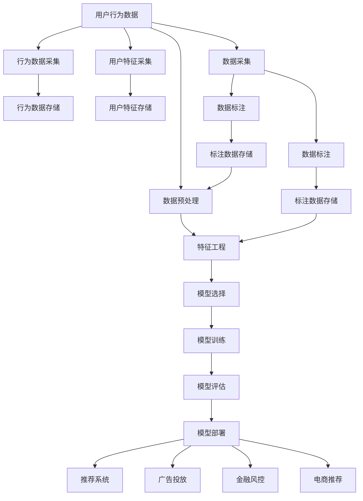

                 

# 如何进行有效的用户行为预测

> 关键词：用户行为预测, 数据挖掘, 机器学习, 深度学习, 推荐系统, 决策树, 神经网络, 协同过滤

## 1. 背景介绍

在数字经济时代，用户行为预测已成为电商、广告、金融、娱乐等领域的重要决策依据。用户行为不仅影响公司收益，还关乎用户体验和品牌声誉。有效预测用户行为，有助于企业精准推荐商品、个性化营销、风险控制等，具有显著的经济和社会效益。本文将系统介绍用户行为预测的关键技术，包括数据采集、特征工程、模型选择与优化、部署与评估等环节，以期为实际应用提供参考。

### 1.1 问题由来

用户行为预测涉及从海量数据中挖掘用户特征，并构建模型以预测用户后续行为。当前，用户行为预测技术已在电商推荐、金融风控、广告投放、内容推荐等领域得到了广泛应用，对企业运营决策产生了显著影响。然而，用户行为预测面临着数据量大、噪声多、模式复杂等挑战，因此需要高效、准确、鲁棒的预测方法。

### 1.2 问题核心关键点

用户行为预测的核心挑战在于：
- **数据质量与特征工程**：用户行为数据具有高维度、稀疏性、噪声多等特点，需要设计有效的特征工程，提取有价值的特征。
- **模型选择与优化**：需要选择合适的模型，并通过调参、正则化等方法优化模型性能。
- **模型评估与部署**：需要评估模型效果，并针对实际应用场景进行模型部署和优化。

## 2. 核心概念与联系

### 2.1 核心概念概述

为更好理解用户行为预测，本节将介绍几个密切相关的核心概念：

- **用户行为预测**：通过分析用户历史行为数据，预测用户未来行为的概率，包括购买、点击、流失等。
- **数据挖掘**：从海量数据中提取有价值信息，并用于预测用户行为。
- **机器学习与深度学习**：通过模型学习用户行为数据中的模式和规律，实现行为预测。
- **推荐系统**：根据用户历史行为和特征，预测用户可能感兴趣的商品或内容，并推荐给用户。
- **决策树与神经网络**：用于构建预测模型，决策树更侧重于特征重要性，神经网络则更擅长处理复杂非线性关系。
- **协同过滤**：利用用户之间的相似性，预测用户对未购买商品或未点击内容的兴趣。

这些核心概念之间的逻辑关系可以通过以下Mermaid流程图来展示：



这个流程图展示了几大核心概念及其之间的关系：

1. 用户行为数据是所有预测任务的基础。
2. 数据预处理和特征工程是模型训练的前提。
3. 模型选择和训练是预测的核心。
4. 模型评估和部署是实际应用的关键。
5. 推荐系统、广告投放、金融风控、电商推荐等具体应用场景，均依赖于用户行为预测。

这些概念共同构成了用户行为预测的完整框架，使其能够在各种应用场景中发挥巨大作用。

## 3. 核心算法原理 & 具体操作步骤
### 3.1 算法原理概述

用户行为预测的本质是通过构建概率模型，学习用户行为数据中的规律，并用于预测用户未来行为。常见的方法包括统计方法、决策树、神经网络、协同过滤等。

以神经网络为例，用户行为预测模型通过输入用户特征和历史行为，输出预测行为的概率分布。模型的训练目标是最大化预测结果与实际行为之间的概率一致性。

具体而言，用户行为预测模型的基本步骤包括：
1. 数据采集与预处理
2. 特征工程
3. 模型选择与构建
4. 模型训练与调参
5. 模型评估与选择
6. 模型部署与应用

### 3.2 算法步骤详解

以下详细介绍用户行为预测的主要步骤：

**Step 1: 数据采集与预处理**

用户行为数据通常来源于日志、交易记录、行为轨迹等。数据采集环节需要确保数据的全面性和时效性。

数据预处理包括数据清洗、缺失值填充、特征归一化等步骤。常见的预处理方法包括：
- 去除重复和异常数据
- 对缺失值进行填充，如均值、中位数、插值等
- 对特征进行归一化或标准化处理

例如，可以使用Python的Pandas库进行数据清洗和预处理：

```python
import pandas as pd
from sklearn.preprocessing import StandardScaler

# 读取数据
data = pd.read_csv('user_behavior_data.csv')

# 数据清洗
data.drop_duplicates(inplace=True)
data.fillna(method='ffill', inplace=True)

# 特征归一化
scaler = StandardScaler()
data[['feature1', 'feature2']] = scaler.fit_transform(data[['feature1', 'feature2']])
```

**Step 2: 特征工程**

用户行为数据通常包含时间戳、设备类型、地理位置、操作路径等复杂特征。需要设计有效的特征提取和特征选择方法，构建有意义的特征向量。

常见的特征工程技术包括：
- 特征提取：从原始数据中提取有意义的特征，如文本特征词频、时间特征小时、星期等。
- 特征选择：选择最有信息量的特征，减少模型的维度，提高泛化能力。
- 特征变换：如多项式特征、PCA降维等。

例如，可以使用Scikit-Learn库进行特征工程：

```python
from sklearn.feature_extraction.text import CountVectorizer
from sklearn.decomposition import PCA

# 特征提取
vectorizer = CountVectorizer()
X = vectorizer.fit_transform(data['text'])

# 特征选择
selector = SelectKBest(k=10)
X = selector.fit_transform(X, data['label'])

# 特征降维
pca = PCA(n_components=5)
X = pca.fit_transform(X)
```

**Step 3: 模型选择与构建**

选择合适的模型是用户行为预测的关键。目前常用的模型包括决策树、随机森林、神经网络、支持向量机等。

以决策树为例，其构建过程包括：
- 划分数据集为训练集和测试集
- 选择最优划分特征
- 递归构建决策树

```python
from sklearn.tree import DecisionTreeClassifier

# 划分数据集
train_data, test_data, train_labels, test_labels = train_test_split(X_train, y_train, test_size=0.2, random_state=42)

# 构建决策树
clf = DecisionTreeClassifier(max_depth=3)
clf.fit(train_data, train_labels)
```

**Step 4: 模型训练与调参**

模型训练过程需要选择合适的优化器和损失函数，并使用训练集进行迭代优化。

常见的优化器包括随机梯度下降(SGD)、Adam等，损失函数包括交叉熵损失、均方误差损失等。

例如，使用TensorFlow库进行模型训练：

```python
import tensorflow as tf

# 定义模型
model = tf.keras.Sequential([
    tf.keras.layers.Dense(64, activation='relu', input_shape=(X_train.shape[1],)),
    tf.keras.layers.Dense(1, activation='sigmoid')
])

# 定义损失函数和优化器
loss = tf.keras.losses.BinaryCrossentropy()
optimizer = tf.keras.optimizers.Adam()

# 训练模型
model.compile(optimizer=optimizer, loss=loss, metrics=['accuracy'])
model.fit(train_data, train_labels, epochs=100, batch_size=32)
```

**Step 5: 模型评估与选择**

模型评估过程需要计算模型的准确率、召回率、F1值等指标，评估模型在测试集上的表现。

例如，使用Scikit-Learn库进行模型评估：

```python
from sklearn.metrics import accuracy_score, precision_score, recall_score, f1_score

# 计算模型在测试集上的表现
y_pred = clf.predict(test_data)
accuracy = accuracy_score(test_labels, y_pred)
precision = precision_score(test_labels, y_pred)
recall = recall_score(test_labels, y_pred)
f1 = f1_score(test_labels, y_pred)

print('Accuracy:', accuracy)
print('Precision:', precision)
print('Recall:', recall)
print('F1 Score:', f1)
```

**Step 6: 模型部署与应用**

模型部署需要考虑模型的计算效率、存储需求和运行环境。常见的方法包括模型封装、模型保存和模型部署。

例如，使用TensorFlow库进行模型封装和保存：

```python
# 保存模型
model.save('user_behavior_predictor.h5')

# 加载模型
loaded_model = tf.keras.models.load_model('user_behavior_predictor.h5')
```

## 4. 数学模型和公式 & 详细讲解  
### 4.1 数学模型构建

用户行为预测的数学模型通常由以下几部分构成：

- **输入数据**：$x_1, x_2, ..., x_n$，表示用户历史行为数据。
- **输出数据**：$y$，表示用户未来行为的概率。
- **模型参数**：$\theta$，表示模型中的权重和偏置。

常见的数学模型包括线性回归、逻辑回归、决策树、神经网络等。

以逻辑回归为例，其数学模型为：

$$
y = \sigma(\theta^T x)
$$

其中 $\sigma(\cdot)$ 为sigmoid函数，$x$ 为输入特征向量，$\theta$ 为模型参数。

### 4.2 公式推导过程

逻辑回归模型的训练目标是最大化预测结果与实际行为之间的对数似然概率：

$$
\mathcal{L}(\theta) = -\frac{1}{N} \sum_{i=1}^N \big[ y_i \log \sigma(\theta^T x_i) + (1 - y_i) \log (1 - \sigma(\theta^T x_i)) \big]
$$

通过梯度下降等优化算法，最小化损失函数 $\mathcal{L}(\theta)$，更新模型参数 $\theta$。

## 5. 项目实践：代码实例和详细解释说明
### 5.1 开发环境搭建

在进行用户行为预测实践前，我们需要准备好开发环境。以下是使用Python进行TensorFlow开发的環境配置流程：

1. 安装Anaconda：从官网下载并安装Anaconda，用于创建独立的Python环境。

2. 创建并激活虚拟环境：
```bash
conda create -n tf-env python=3.8 
conda activate tf-env
```

3. 安装TensorFlow：从官网获取对应的安装命令。例如：
```bash
pip install tensorflow
```

4. 安装各类工具包：
```bash
pip install numpy pandas scikit-learn matplotlib tqdm jupyter notebook ipython
```

完成上述步骤后，即可在`tf-env`环境中开始用户行为预测实践。

### 5.2 源代码详细实现

这里我们以用户点击行为预测为例，给出使用TensorFlow库进行逻辑回归模型预测的PyTorch代码实现。

首先，定义数据集类：

```python
from sklearn.model_selection import train_test_split
import numpy as np

class UserClickDataset:
    def __init__(self, X, y):
        self.X = X
        self.y = y
        
    def split(self, test_size=0.2, random_state=42):
        X_train, X_test, y_train, y_test = train_test_split(self.X, self.y, test_size=test_size, random_state=random_state)
        return X_train, X_test, y_train, y_test
```

然后，定义模型和优化器：

```python
import tensorflow as tf

model = tf.keras.Sequential([
    tf.keras.layers.Dense(64, activation='relu', input_shape=(X_train.shape[1],)),
    tf.keras.layers.Dense(1, activation='sigmoid')
])

loss = tf.keras.losses.BinaryCrossentropy()
optimizer = tf.keras.optimizers.Adam()
```

接着，定义训练和评估函数：

```python
def train_epoch(model, X_train, y_train, batch_size=32):
    for batch in range(epochs):
        X_batch, y_batch = X_train[batch*batch_size:(batch+1)*batch_size], y_train[batch*batch_size:(batch+1)*batch_size]
        with tf.GradientTape() as tape:
            y_pred = model(X_batch)
            loss_value = loss(y_pred, y_batch)
        gradients = tape.gradient(loss_value, model.trainable_variables)
        optimizer.apply_gradients(zip(gradients, model.trainable_variables))

def evaluate(model, X_test, y_test):
    y_pred = model.predict(X_test)
    accuracy = accuracy_score(y_test, y_pred)
    precision = precision_score(y_test, y_pred)
    recall = recall_score(y_test, y_pred)
    f1 = f1_score(y_test, y_pred)
    return accuracy, precision, recall, f1
```

最后，启动训练流程并在测试集上评估：

```python
epochs = 100

X_train, X_test, y_train, y_test = dataset.split(test_size=0.2, random_state=42)

train_epoch(model, X_train, y_train)
accuracy, precision, recall, f1 = evaluate(model, X_test, y_test)

print(f'Accuracy: {accuracy:.2f}, Precision: {precision:.2f}, Recall: {recall:.2f}, F1 Score: {f1:.2f}')
```

以上就是使用TensorFlow库进行用户行为预测的完整代码实现。可以看到，TensorFlow提供了丰富的API和工具，使得模型构建和训练过程变得简单高效。

### 5.3 代码解读与分析

让我们再详细解读一下关键代码的实现细节：

**UserClickDataset类**：
- `__init__`方法：初始化数据集，包括输入特征X和输出标签y。
- `split`方法：将数据集划分为训练集和测试集。

**模型和优化器定义**：
- 使用Sequential模型定义多层神经网络结构，包括一个隐藏层和一个输出层。
- 定义损失函数为二元交叉熵损失，优化器为Adam。

**训练和评估函数**：
- `train_epoch`方法：对训练集进行前向传播和反向传播，更新模型参数。
- `evaluate`方法：计算模型在测试集上的各种指标，包括准确率、精确率、召回率和F1值。

**训练流程**：
- 定义总训练轮数epochs。
- 对数据集进行划分。
- 在每个epoch内，对训练集进行迭代优化。
- 在测试集上评估模型性能，输出结果。

可以看出，TensorFlow提供了便捷的API和工具，使得用户行为预测的模型构建和训练过程变得简单高效。

## 6. 实际应用场景

### 6.1 电商推荐系统

用户行为预测在电商推荐系统中有广泛应用。通过分析用户历史点击、购买、浏览行为，预测用户可能感兴趣的商品，并进行推荐。

例如，在用户打开某电商平台后，根据其历史行为数据，预测其可能感兴趣的商品，并展示在推荐列表中。当用户点击某商品时，更新该商品的用户兴趣度，优化推荐算法，提升推荐效果。

### 6.2 金融风控系统

在金融领域，用户行为预测用于风险评估和反欺诈检测。通过分析用户交易记录、行为特征等，预测用户是否存在违约风险或欺诈行为，及时预警和干预。

例如，在贷款申请过程中，根据用户历史交易记录和行为特征，预测其还款能力，评估贷款风险，进行风险控制。同时，通过分析用户行为模式，识别异常交易，进行反欺诈检测。

### 6.3 广告投放系统

用户行为预测在广告投放中有重要作用。通过分析用户历史点击、浏览行为，预测用户对广告的兴趣程度，优化广告投放策略，提高广告投放效果和ROI。

例如，在广告投放前，分析目标用户的点击行为和兴趣偏好，选择最合适的广告素材和投放位置，提升广告点击率和转化率。同时，通过用户行为预测，实时调整广告投放策略，实现动态优化。

### 6.4 未来应用展望

随着用户行为预测技术的不断发展，未来将有更多应用场景涌现。以下是一些可能的应用方向：

1. **智能客服**：通过分析用户行为数据，预测用户咨询意图和问题类型，进行智能分流和自动回复，提升客服效率和用户满意度。

2. **个性化学习**：根据学生历史学习行为，预测其学习兴趣和知识水平，推荐个性化学习资源和课程，提升学习效果。

3. **智能医疗**：通过分析患者历史诊疗行为，预测其疾病风险和治疗效果，提供个性化医疗方案，提高诊疗效果和患者满意度。

4. **智能家居**：通过分析用户行为数据，预测其生活习惯和需求，实现智能家居设备的自动化控制和个性化服务。

5. **智慧城市**：通过分析市民行为数据，预测城市交通流量、公共设施使用情况等，优化城市规划和管理，提升城市运行效率和居民生活质量。

这些应用场景展示了用户行为预测的广阔前景，相信未来将在更多行业得到深入应用，带来巨大的社会和经济效益。

## 7. 工具和资源推荐
### 7.1 学习资源推荐

为了帮助开发者系统掌握用户行为预测的理论基础和实践技巧，这里推荐一些优质的学习资源：

1. **《深度学习》课程**：斯坦福大学Andrew Ng教授开设的深度学习课程，涵盖了从基础到高级的深度学习算法和应用，包括神经网络和用户行为预测。

2. **Kaggle数据科学竞赛平台**：提供丰富的用户行为预测数据集和竞赛题目，通过实际项目训练实践深度学习模型。

3. **《机器学习实战》书籍**：详细介绍了机器学习的基本概念和经典算法，包括决策树、随机森林、神经网络等，适合初学者入门。

4. **Scikit-Learn官方文档**：提供了丰富的API和工具，适用于数据预处理、特征工程、模型构建等各个环节。

5. **TensorFlow官方文档**：提供了全面的API和工具，适用于模型构建、训练、部署等各个环节。

通过对这些资源的学习实践，相信你一定能够快速掌握用户行为预测的精髓，并用于解决实际的预测问题。

### 7.2 开发工具推荐

高效的开发离不开优秀的工具支持。以下是几款用于用户行为预测开发的常用工具：

1. **Python**：作为一种高效、易学的编程语言，广泛应用于机器学习和深度学习领域。

2. **TensorFlow**：由Google主导开发的深度学习框架，提供了丰富的API和工具，适用于模型构建和训练。

3. **Scikit-Learn**：提供丰富的机器学习算法和工具，适用于数据预处理、特征工程、模型构建等环节。

4. **Pandas**：提供了高效的数据处理和分析工具，适用于数据清洗、预处理和特征工程。

5. **Keras**：提供简单易用的高级API，适用于快速搭建和训练深度学习模型。

6. **Matplotlib**：提供了丰富的绘图工具，适用于数据可视化。

合理利用这些工具，可以显著提升用户行为预测的开发效率，加快创新迭代的步伐。

### 7.3 相关论文推荐

用户行为预测涉及的领域非常广泛，涉及机器学习、深度学习、数据挖掘等多个方向。以下是几篇奠基性的相关论文，推荐阅读：

1. **《用户行为预测与建模》**：介绍用户行为预测的基本概念和算法，包括决策树、神经网络、协同过滤等。

2. **《深度学习在电商推荐系统中的应用》**：介绍深度学习在电商推荐系统中的应用，包括神经网络、注意力机制等。

3. **《用户行为预测与反欺诈检测》**：介绍用户行为预测在金融风控中的应用，包括决策树、随机森林等。

4. **《用户行为预测与个性化推荐》**：介绍用户行为预测在个性化推荐中的应用，包括神经网络、协同过滤等。

这些论文代表了大用户行为预测的发展脉络，通过学习这些前沿成果，可以帮助研究者把握学科前进方向，激发更多的创新灵感。

## 8. 总结：未来发展趋势与挑战

### 8.1 总结

本文对用户行为预测的关键技术进行了系统介绍。首先阐述了用户行为预测的背景和重要性，明确了预测任务的主要挑战和核心关键点。其次，从原理到实践，详细讲解了用户行为预测的数学模型和算法步骤，给出了具体的代码实现和应用示例。同时，本文还探讨了用户行为预测在电商推荐、金融风控、广告投放等多个领域的应用场景，展示了其广泛的应用前景。最后，本文精选了用户行为预测的学习资源、开发工具和相关论文，为读者提供了全面的技术指引。

通过本文的系统梳理，可以看到，用户行为预测在数字经济时代具有重要价值，是大数据技术的重要应用之一。用户行为预测技术的发展，有助于提升企业的运营效率和决策精准性，具有显著的经济和社会效益。

### 8.2 未来发展趋势

展望未来，用户行为预测技术将呈现以下几个发展趋势：

1. **深度学习模型的应用**：深度学习模型在用户行为预测中具有显著优势，未来的预测任务将更多地采用深度学习模型，如神经网络、卷积神经网络、循环神经网络等。

2. **跨领域数据融合**：用户行为数据通常来自多个领域，未来的预测任务将更多地考虑跨领域数据融合，提升预测的准确性和鲁棒性。

3. **在线学习与增量学习**：用户行为数据通常具有高时效性，未来的预测任务将更多地采用在线学习、增量学习等方法，实时更新模型参数，提高预测的及时性。

4. **多模态数据的融合**：用户行为数据通常涉及文本、图像、视频等多种模态，未来的预测任务将更多地考虑多模态数据的融合，提升预测的全面性和准确性。

5. **自动化特征工程**：用户行为数据通常包含大量复杂特征，未来的预测任务将更多地采用自动化特征工程，减少人工干预，提高效率。

6. **分布式计算与联邦学习**：用户行为数据通常具有高维度和大规模的特点，未来的预测任务将更多地采用分布式计算和联邦学习等方法，提升计算效率和数据隐私保护。

以上趋势凸显了用户行为预测技术的广阔前景。这些方向的探索发展，必将进一步提升预测模型的性能和应用范围，为数字经济的发展提供强有力的支撑。

### 8.3 面临的挑战

尽管用户行为预测技术已经取得了显著进展，但在迈向更加智能化、普适化应用的过程中，仍面临诸多挑战：

1. **数据质量问题**：用户行为数据通常具有高噪声和多缺失值的特点，如何有效地处理和清洗数据，是预测任务的重要挑战。

2. **特征工程复杂**：用户行为数据通常涉及大量复杂特征，如何设计有效的特征工程，提取有价值的特征，是预测任务的关键。

3. **模型泛化能力不足**：用户行为数据通常具有高维度和稀疏性的特点，如何构建具有强泛化能力的预测模型，是预测任务的难点。

4. **模型计算资源消耗大**：用户行为数据通常具有高维度和大规模的特点，如何优化模型的计算效率和资源消耗，是预测任务的挑战。

5. **模型可解释性不足**：用户行为预测模型通常具有复杂的非线性关系，如何提高模型的可解释性和可解释性，是预测任务的难点。

6. **数据隐私和安全问题**：用户行为数据通常涉及用户隐私和商业秘密，如何保护数据隐私和安全，是预测任务的重要挑战。

这些挑战需要研究者不断探索和改进，才能使得用户行为预测技术更好地服务于实际应用。

### 8.4 研究展望

面对用户行为预测面临的种种挑战，未来的研究需要在以下几个方面寻求新的突破：

1. **改进特征工程方法**：设计更加高效和自动化的特征工程方法，减少人工干预，提高特征提取的效率和效果。

2. **优化深度学习模型**：开发更加高效和可解释的深度学习模型，提升预测模型的性能和可解释性。

3. **融合多源数据**：探索跨领域数据融合和多模态数据融合的方法，提升预测模型的全面性和准确性。

4. **应用在线学习和增量学习**：开发更加实时和高效的在线学习、增量学习方法，提高预测模型的及时性和泛化能力。

5. **优化计算资源使用**：开发更加高效和可扩展的计算资源使用方法，提升预测模型的计算效率和资源利用率。

6. **保护数据隐私和安全**：探索数据隐私保护和安全保障的方法，确保用户行为数据的隐私和安全。

这些研究方向的探索，必将引领用户行为预测技术迈向更高的台阶，为数字经济的发展提供强有力的支撑。

## 9. 附录：常见问题与解答

**Q1：如何处理用户行为数据中的噪声和多缺失值？**

A: 用户行为数据通常具有高噪声和多缺失值的特点，需要进行数据清洗和缺失值处理。具体方法包括：
- 数据清洗：去除重复和异常数据，确保数据的一致性和准确性。
- 缺失值处理：使用均值、中位数、插值等方法进行缺失值填充，减少缺失值对预测模型的影响。

**Q2：如何设计有效的特征工程？**

A: 特征工程是用户行为预测的关键步骤。设计有效的特征工程需要考虑以下几点：
- 特征提取：从原始数据中提取有意义的特征，如文本特征词频、时间特征小时、星期等。
- 特征选择：选择最有信息量的特征，减少模型的维度，提高泛化能力。
- 特征变换：如多项式特征、PCA降维等。

**Q3：如何选择和优化预测模型？**

A: 选择和优化预测模型需要考虑以下几个方面：
- 模型选择：选择适合的预测模型，如决策树、随机森林、神经网络等。
- 模型优化：通过调参、正则化等方法优化模型性能，如选择最优的特征、调整学习率等。

**Q4：如何进行用户行为预测模型的部署和评估？**

A: 模型部署需要考虑模型的计算效率、存储需求和运行环境。常见的方法包括模型封装、模型保存和模型部署。模型评估需要计算模型的准确率、召回率、F1值等指标，评估模型在测试集上的表现。

**Q5：如何保护用户行为数据的安全和隐私？**

A: 用户行为数据通常涉及用户隐私和商业秘密，需要采取以下措施：
- 数据加密：对数据进行加密处理，防止数据泄露。
- 数据匿名化：对数据进行匿名化处理，保护用户隐私。
- 访问控制：限制数据访问权限，防止未授权访问。

这些技术措施可以确保用户行为数据的安全和隐私保护。

