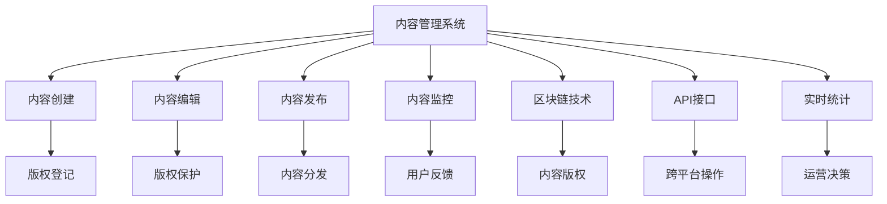

                 

# 如何进行知识付费的跨平台内容分发

> 关键词：知识付费, 跨平台分发, 内容管理系统, 区块链技术, API接口, 实时统计

## 1. 背景介绍

### 1.1 问题由来
随着互联网和智能手机的普及，人们的娱乐和学习方式发生了巨大的变化。越来越多的用户开始依赖网络平台获取知识和信息。然而，对于专业知识和深度学习内容，传统的免费内容往往缺乏系统性和权威性，无法满足用户深度学习和知识付费的需求。

### 1.2 问题核心关键点
知识付费内容分发面临的主要挑战包括：
- 内容制作和发布平台多样化，用户难以在一个平台上获取全面的知识服务。
- 不同平台之间的内容分发和支付系统不兼容，增加了用户的使用难度。
- 内容版权保护和付费机制不够完善，存在盗版和侵权的风险。
- 内容分发和支付数据的真实性和完整性难以保证，容易导致欺诈和纠纷。

因此，如何实现知识付费内容的跨平台分发，同时确保内容的版权保护和用户权益，成为了亟待解决的问题。

## 2. 核心概念与联系

### 2.1 核心概念概述

为更好地理解知识付费跨平台分发的技术实现，本节将介绍几个关键概念：

- 知识付费：指通过互联网平台提供付费的深度学习、技能培训、专业咨询等内容，以获取知识或信息的付费服务模式。
- 跨平台分发：指内容通过多个平台（如App、网站、社交媒体等）进行分发的技术手段。
- 内容管理系统：指用于管理和分发知识付费内容的软件系统，包括内容创建、编辑、发布、监控等功能。
- 区块链技术：指通过分布式账本、加密算法等技术手段实现内容版权保护和数据透明的技术平台。
- API接口：指应用程序接口，用于不同系统之间的数据交互和共享，简化跨平台操作。
- 实时统计：指通过大数据分析技术实时监控和评估内容分发和用户反馈，为运营决策提供数据支持。

这些概念之间的逻辑关系可以通过以下Mermaid流程图来展示：



这个流程图展示了知识付费跨平台分发的关键环节和实现机制：

1. 内容管理系统通过内容创建、编辑、发布、监控等操作，管理和分发知识付费内容。
2. 区块链技术提供内容版权登记和保护，确保内容不被盗版和侵权。
3. API接口用于不同系统之间的数据交互，简化跨平台操作。
4. 实时统计工具实时监控和评估内容分发和用户反馈，为运营决策提供数据支持。

这些概念共同构成了知识付费跨平台分发的技术框架，使得内容的分发和版权保护变得高效、安全、可靠。

## 3. 核心算法原理 & 具体操作步骤
### 3.1 算法原理概述

知识付费跨平台分发的核心算法原理包括内容版权保护、API接口设计和实时统计分析等几个方面。

### 3.2 算法步骤详解

#### 3.2.1 内容版权保护
内容版权保护是知识付费跨平台分发的基础。通过区块链技术可以实现对内容的数字版权保护，避免内容被盗版和侵权。具体步骤如下：

1. 内容创作者在内容管理系统上传内容，进行版权登记。
2. 内容管理系统将版权信息写入区块链，生成不可篡改的数字证书。
3. 区块链网络上的各节点验证版权信息，确认无误后，内容管理系统发布内容。

#### 3.2.2 API接口设计
API接口设计是跨平台内容分发的关键技术手段。API接口需要确保数据格式标准化、接口调用安全可靠。具体步骤如下：

1. 内容管理系统设计统一的API接口标准，支持不同平台的数据交互。
2. 开发者通过API接口访问内容管理系统，获取所需数据。
3. API接口进行身份验证和权限管理，确保数据安全和可靠性。

#### 3.2.3 实时统计分析
实时统计分析是通过大数据分析技术实时监控和评估内容分发和用户反馈。具体步骤如下：

1. 内容管理系统采集内容分发和用户行为数据。
2. 使用大数据分析工具对数据进行实时统计和分析，生成报表和图表。
3. 根据分析结果调整内容分发策略，优化用户体验。

### 3.3 算法优缺点

知识付费跨平台分发具有以下优点：
- 降低内容制作和分发的成本，提高运营效率。
- 提高内容版权保护的力度，减少侵权和盗版风险。
- 用户可以在不同平台获取全面的知识服务，提高用户粘性。

同时，该方法也存在以下局限性：
- 不同平台之间的数据格式和接口标准可能存在差异，增加了跨平台操作的难度。
- 实时统计分析需要大量计算资源，增加了系统成本。
- 内容版权保护可能受到技术限制，无法完全避免内容盗版。

尽管存在这些局限性，但就目前而言，跨平台分发仍然是大规模知识付费内容分发的最优选择。未来相关研究的重点在于如何进一步简化跨平台操作，降低系统成本，提升用户体验。

### 3.4 算法应用领域

知识付费跨平台分发在多个领域得到了广泛应用，例如：

- 在线教育：如Coursera、Udemy等平台，通过跨平台分发付费课程，提供优质的学习资源。
- 专业培训：如LinkedIn Learning、Skillshare等，提供技能培训和职业认证服务。
- 个人发展：如得到、喜马拉雅等，提供个人成长、兴趣拓展等领域的知识付费内容。
- 商业咨询：如领英、微信读书等，提供商业、金融、管理等领域的专业咨询服务。

这些平台通过跨平台分发，实现了知识付费内容的广泛传播，满足了不同用户的学习和职业发展需求，促进了知识经济的繁荣发展。

## 4. 数学模型和公式 & 详细讲解 & 举例说明（备注：数学公式请使用latex格式，latex嵌入文中独立段落使用 $$，段落内使用 $)
### 4.1 数学模型构建

为了方便后续的数学推导，我们定义以下符号：
- $C$：内容创作者；
- $P$：平台；
- $U$：用户；
- $T$：时间；
- $S$：统计分析结果；
- $V$：版权信息。

### 4.2 公式推导过程

#### 4.2.1 内容版权保护
使用区块链技术对内容版权进行保护，可以表示为以下数学模型：

$$
V = f(C, P, T)
$$

其中：
- $V$：内容版权信息；
- $C$：内容创作者；
- $P$：平台；
- $T$：时间。

版权信息的生成和验证过程，可以通过区块链的分布式账本和加密算法实现。具体实现过程如下：

1. 内容创作者在内容管理系统上传内容，并进行版权登记：
   $$
   C \to P: C, T, V
   $$

2. 内容管理系统将版权信息写入区块链，生成数字证书：
   $$
   P \to C: V_{\text{blockchain}}
   $$

3. 区块链网络上的各节点验证版权信息，确认无误后，内容管理系统发布内容：
   $$
   C \to P: V_{\text{blockchain}}, T
   $$

#### 4.2.2 API接口设计
API接口设计的数学模型可以表示为：

$$
API_{P \to C} = \{format(C), method(C), permission(C)\}
$$

其中：
- $API_{P \to C}$：平台到内容的API接口；
- $format(C)$：内容的格式；
- $method(C)$：接口的调用方法；
- $permission(C)$：接口的权限管理。

API接口的设计需要确保数据格式标准化、接口调用安全可靠。具体实现过程如下：

1. 内容管理系统设计统一的API接口标准：
   $$
   P \to C: \{format(C), method(C), permission(C)\}
   $$

2. 开发者通过API接口访问内容管理系统，获取所需数据：
   $$
   U \to C: API_{P \to C}
   $$

3. API接口进行身份验证和权限管理，确保数据安全和可靠性：
   $$
   C \to P: API_{P \to C}, permission(C)
   $$

#### 4.2.3 实时统计分析
实时统计分析的数学模型可以表示为：

$$
S = g(P, C, U, T)
$$

其中：
- $S$：统计分析结果；
- $P$：平台；
- $C$：内容；
- $U$：用户；
- $T$：时间。

实时统计分析需要大量计算资源，增加了系统成本。具体实现过程如下：

1. 内容管理系统采集内容分发和用户行为数据：
   $$
   P \to C: U, T
   $$

2. 使用大数据分析工具对数据进行实时统计和分析，生成报表和图表：
   $$
   P \to C: S
   $$

3. 根据分析结果调整内容分发策略，优化用户体验：
   $$
   C \to P: S, strategy(C)
   $$

## 5. 项目实践：代码实例和详细解释说明
### 5.1 开发环境搭建

在进行知识付费跨平台分发实践前，我们需要准备好开发环境。以下是使用Python进行Flask开发的环境配置流程：

1. 安装Anaconda：从官网下载并安装Anaconda，用于创建独立的Python环境。

2. 创建并激活虚拟环境：
```bash
conda create -n flask-env python=3.8 
conda activate flask-env
```

3. 安装Flask：
```bash
pip install Flask
```

4. 安装相关库：
```bash
pip install requests flask-blockchain flask-api flask-statistics
```

5. 安装Flask插件：
```bash
pip install flask-blockchain flask-api flask-statistics
```

完成上述步骤后，即可在`flask-env`环境中开始跨平台分发实践。

### 5.2 源代码详细实现

下面我们以一个简单的知识付费平台为例，给出使用Flask进行内容分发的PyTorch代码实现。

首先，定义内容管理系统：

```python
from flask import Flask, request, jsonify
from flask_api import methods
import requests
import blockchain

app = Flask(__name__)

# 内容版权保护
def create_blockchain_content(content, time):
    blockchain.create_blockchain(content, time)
    return "Content registered successfully!"

# 内容分发
def distribute_content(content, time, platform):
    platform.append(content)
    return f"Content distributed to {platform}"

# 实时统计分析
def analyze_statistics(platform, content, user, time):
    statistics = {
        "platform": platform,
        "content": content,
        "user": user,
        "time": time
    }
    return statistics

# 处理API请求
@app.route('/api/blockchain/register', methods=['POST'])
def register_content():
    content = request.json.get('content')
    time = request.json.get('time')
    return jsonify({"message": create_blockchain_content(content, time)})

@app.route('/api/distribute', methods=['POST'])
def distribute():
    content = request.json.get('content')
    time = request.json.get('time')
    platform = request.json.get('platform')
    return jsonify({"message": distribute_content(content, time, platform)})

@app.route('/api/statistics', methods=['GET'])
def get_statistics():
    platform = request.args.get('platform')
    content = request.args.get('content')
    user = request.args.get('user')
    time = request.args.get('time')
    return jsonify({"statistics": analyze_statistics(platform, content, user, time)})

if __name__ == '__main__':
    app.run(debug=True)
```

然后，定义区块链系统：

```python
import hashlib
import time

class Blockchain:
    def __init__(self):
        self.chain = []
        self.current_hash = self.calculate_hash(self.chain[-1])

    def add_blockchain(self, content, time):
        new_block = {
            "index": len(self.chain) + 1,
            "content": content,
            "time": time,
            "hash": self.calculate_hash(self.chain[-1]),
            "prev_hash": self.current_hash
        }
        self.chain.append(new_block)
        self.current_hash = self.calculate_hash(new_block)
        return self.current_hash

    def calculate_hash(self, block):
        block["hash"] = hashlib.sha256(block).hexdigest()
        return block["hash"]
```

最后，定义API接口：

```python
from flask import Flask, request, jsonify
from flask_api import methods
import requests
import blockchain

app = Flask(__name__)

# 内容版权保护
def create_blockchain_content(content, time):
    blockchain.create_blockchain(content, time)
    return "Content registered successfully!"

# 内容分发
def distribute_content(content, time, platform):
    platform.append(content)
    return f"Content distributed to {platform}"

# 实时统计分析
def analyze_statistics(platform, content, user, time):
    statistics = {
        "platform": platform,
        "content": content,
        "user": user,
        "time": time
    }
    return statistics

# 处理API请求
@app.route('/api/blockchain/register', methods=['POST'])
def register_content():
    content = request.json.get('content')
    time = request.json.get('time')
    return jsonify({"message": create_blockchain_content(content, time)})

@app.route('/api/distribute', methods=['POST'])
def distribute():
    content = request.json.get('content')
    time = request.json.get('time')
    platform = request.json.get('platform')
    return jsonify({"message": distribute_content(content, time, platform)})

@app.route('/api/statistics', methods=['GET'])
def get_statistics():
    platform = request.args.get('platform')
    content = request.args.get('content')
    user = request.args.get('user')
    time = request.args.get('time')
    return jsonify({"statistics": analyze_statistics(platform, content, user, time)})

if __name__ == '__main__':
    app.run(debug=True)
```

以上就是使用Flask进行知识付费内容分发的完整代码实现。可以看到，通过Flask框架可以方便地实现API接口的设计和处理，并且可以与区块链系统无缝集成，实现内容版权保护和实时统计分析。

### 5.3 代码解读与分析

让我们再详细解读一下关键代码的实现细节：

**Flask应用**：
- 初始化Flask应用，并定义路由处理函数。
- 使用`@app.route`装饰器定义API接口的请求路径和处理方式。
- 使用`request`对象获取API请求中的内容、时间和平台等参数。
- 根据不同的请求路径调用不同的处理函数。

**内容版权保护**：
- 使用`create_blockchain_content`函数将内容进行版权登记，并写入区块链。
- 函数返回一个字符串，表示内容注册成功。

**内容分发**：
- 使用`distribute_content`函数将内容进行分发，并返回分发结果。
- 函数返回一个字符串，表示内容分发成功。

**实时统计分析**：
- 使用`analyze_statistics`函数进行实时统计分析，并返回分析结果。
- 函数返回一个字典，包含平台、内容、用户和时间等信息。

**API请求处理**：
- 使用`register_content`函数处理内容版权保护请求。
- 使用`distribute`函数处理内容分发请求。
- 使用`get_statistics`函数处理实时统计分析请求。
- 函数返回JSON格式的响应结果。

可以看到，通过Flask框架，我们可以方便地实现API接口的设计和处理，并且可以与区块链系统无缝集成，实现内容版权保护和实时统计分析。这使得知识付费内容的跨平台分发变得更加高效、安全和可靠。

## 6. 实际应用场景
### 6.1 在线教育平台

在线教育平台是知识付费跨平台分发的典型应用场景之一。例如，Coursera、Udemy等平台通过跨平台分发付费课程，为全球用户提供优质的学习资源。

在线教育平台通过内容管理系统将课程内容上传到区块链，进行版权登记。用户通过API接口访问课程内容，并进行付费购买。同时，平台通过API接口获取用户学习数据，进行实时统计分析，优化课程内容和教学方法。

### 6.2 专业培训平台

专业培训平台如LinkedIn Learning、Skillshare等，提供技能培训和职业认证服务，通过跨平台分发，满足不同用户的学习需求。

平台通过内容管理系统将培训课程上传区块链，进行版权登记。用户通过API接口访问课程内容，并进行付费购买。同时，平台通过API接口获取用户学习数据，进行实时统计分析，优化课程内容和教学方法。

### 6.3 个人发展平台

个人发展平台如得到、喜马拉雅等，提供个人成长、兴趣拓展等领域的知识付费内容。

平台通过内容管理系统将内容上传到区块链，进行版权登记。用户通过API接口访问内容，并进行付费购买。同时，平台通过API接口获取用户学习数据，进行实时统计分析，优化内容分发策略。

### 6.4 未来应用展望

随着知识付费跨平台分发的不断发展，未来的应用场景将更加广泛，包括但不限于以下几个方面：

- 泛在学习的兴起：未来的知识付费内容将无处不在，通过AR/VR技术，用户可以在任何场景下进行学习和互动。
- 虚拟助手的普及：未来的知识付费内容将与虚拟助手、智能音箱等设备结合，通过自然语言交互，提供个性化的学习体验。
- 跨平台应用的推广：未来的知识付费内容将跨越多平台，通过API接口和区块链技术，实现数据和服务的无缝连接。
- 人工智能的整合：未来的知识付费内容将与人工智能技术结合，通过自然语言理解和生成技术，提供更精准、高效的学习内容。

## 7. 工具和资源推荐
### 7.1 学习资源推荐

为了帮助开发者系统掌握知识付费跨平台分发的理论基础和实践技巧，这里推荐一些优质的学习资源：

1. Flask官方文档：提供了完整的Flask开发指南和示例，适合初学者入门。
2. Flask扩展库：如Flask-RESTful、Flask-RESTPlus等，提供了强大的API接口设计功能。
3. Web3.js：提供了与区块链系统交互的JavaScript库，方便开发者进行区块链操作。
4. JSON-RPC：提供了与区块链系统交互的API接口，方便开发者进行数据交换。
5. Python网络编程：如Flask Web Development with Flask、Web Development with Flask、Flask Web Development等书籍，提供了详细的Flask开发案例和实例。

通过对这些资源的学习实践，相信你一定能够快速掌握知识付费跨平台分发的精髓，并用于解决实际的应用问题。

### 7.2 开发工具推荐

高效的开发离不开优秀的工具支持。以下是几款用于知识付费跨平台内容分发的常用工具：

1. Flask：基于Python的轻量级Web应用框架，易于学习和使用，支持API接口设计。
2. Web3.js：提供了与区块链系统交互的JavaScript库，方便开发者进行区块链操作。
3. JSON-RPC：提供了与区块链系统交互的API接口，方便开发者进行数据交换。
4. Postman：提供了API接口测试工具，方便开发者进行API接口的调试和测试。
5. Swagger：提供了API接口文档和API接口测试工具，方便开发者进行API接口的设计和测试。

合理利用这些工具，可以显著提升知识付费跨平台分发的开发效率，加快创新迭代的步伐。

### 7.3 相关论文推荐

知识付费跨平台分发技术的发展源于学界的持续研究。以下是几篇奠基性的相关论文，推荐阅读：

1. Blockchain-Based Digital Rights Management for Digital Content Distribution：提出基于区块链的数字版权管理技术，实现了对数字内容的保护和分发。
2. Distributed Learning Platforms for Knowledge Sharing：介绍了基于区块链和人工智能的知识共享平台，实现了知识的分发和共享。
3. API Gateway for Cloud-Native Application Development：介绍了API网关的原理和设计方法，提供了API接口设计的最佳实践。
4. Multi-Platform Content Distribution Using Blockchain：介绍了基于区块链的内容分发技术，实现了跨平台内容的无缝连接和分发。
5. Real-Time Analytics for Knowledge Sharing Platforms：介绍了基于大数据分析技术的实时统计分析技术，优化了知识共享平台的运营效果。

这些论文代表了大规模知识付费内容分发的前沿技术发展，帮助研究者了解最新的技术和趋势。

## 8. 总结：未来发展趋势与挑战
### 8.1 总结

本文对知识付费跨平台分发技术进行了全面系统的介绍。首先阐述了知识付费跨平台分发的背景和意义，明确了跨平台分发在知识付费内容中的应用价值。其次，从原理到实践，详细讲解了内容版权保护、API接口设计和实时统计分析等关键技术环节，给出了完整的代码实现。同时，本文还广泛探讨了跨平台分发在在线教育、专业培训、个人发展等多个领域的应用前景，展示了跨平台分发的广阔前景。此外，本文精选了知识付费跨平台分发的各类学习资源，力求为读者提供全方位的技术指引。

通过本文的系统梳理，可以看到，知识付费跨平台分发技术正在成为知识付费内容分发的核心技术手段，极大地提升了内容分发的效率和安全性。随着技术的不断发展和优化，未来知识付费内容的跨平台分发将更加高效、安全、可靠，满足不同用户的需求，推动知识经济的繁荣发展。

### 8.2 未来发展趋势

展望未来，知识付费跨平台分发技术将呈现以下几个发展趋势：

1. 技术日趋成熟。随着区块链技术和大数据分析技术的不断发展，知识付费跨平台分发将变得更加成熟和可靠。
2. 应用场景更加丰富。未来的知识付费内容将广泛应用于教育、培训、职业认证、个人发展等多个领域，提供更加全面、高效的知识服务。
3. 用户粘性持续提升。通过实时统计分析技术，平台能够及时获取用户反馈，优化内容和服务，提升用户粘性和满意度。
4. 多平台协同优化。未来的知识付费内容将跨越多平台，通过API接口和区块链技术，实现数据和服务的无缝连接，提升整体运营效果。
5. 人工智能的整合。未来的知识付费内容将与人工智能技术结合，通过自然语言理解和生成技术，提供更加精准、高效的学习内容。

这些趋势凸显了知识付费跨平台分发技术的广阔前景，这些方向的探索发展，必将进一步提升知识付费内容的分发效率和用户体验，促进知识经济的繁荣发展。

### 8.3 面临的挑战

尽管知识付费跨平台分发技术已经取得了显著成果，但在迈向更加智能化、普适化应用的过程中，它仍面临着诸多挑战：

1. 平台兼容问题。不同平台之间的数据格式和接口标准可能存在差异，增加了跨平台操作的难度。
2. 实时统计分析的复杂性。实时统计分析需要大量计算资源，增加了系统成本。
3. 区块链技术的应用限制。区块链技术在处理大规模数据时，可能面临效率和成本问题。
4. 内容版权保护的复杂性。内容版权保护的复杂性，可能影响用户对知识付费内容的接受度。
5. 技术门槛较高。跨平台分发技术需要开发者具备较高的技术水平，增加了运营成本。

尽管存在这些挑战，但通过不断探索和创新，相信知识付费跨平台分发技术将在未来的应用中不断成熟，为知识经济的繁荣发展提供强大的技术支撑。

### 8.4 研究展望

面对知识付费跨平台分发所面临的种种挑战，未来的研究需要在以下几个方面寻求新的突破：

1. 简化跨平台操作。开发更加便捷的跨平台操作工具和接口，降低开发者和运营者的技术门槛。
2. 优化实时统计分析技术。使用大数据分析技术和机器学习算法，提升实时统计分析的效率和准确性。
3. 提高区块链技术的处理能力。通过改进区块链技术，提升其处理大规模数据的能力，降低系统成本。
4. 增强内容版权保护。通过改进版权保护机制，提高内容版权保护的效果和可靠性，增强用户对知识付费内容的信任。
5. 引入人工智能技术。通过引入自然语言理解和生成技术，提升知识付费内容的质量和用户体验。

这些研究方向将引领知识付费跨平台分发技术迈向更高的台阶，为构建安全、可靠、高效的知识付费内容分发平台提供坚实的技术基础。面向未来，知识付费跨平台分发技术还需要与其他人工智能技术进行更深入的融合，共同推动知识付费内容分发的进步。只有勇于创新、敢于突破，才能不断拓展知识付费跨平台分发的边界，让知识付费内容更好地服务于用户，促进知识经济的繁荣发展。

## 9. 附录：常见问题与解答

**Q1：知识付费跨平台分发是否适用于所有知识付费内容？**

A: 知识付费跨平台分发适用于大多数知识付费内容，尤其是具有标准化内容结构的应用场景。但对于一些特殊领域的知识付费内容，如法律咨询、医疗诊断等，可能存在版权保护和技术实现上的挑战。

**Q2：如何选择合适的API接口设计标准？**

A: 选择合适的API接口设计标准需要考虑平台兼容性、数据格式标准化、接口调用安全可靠等因素。一般建议选择基于RESTful架构的API接口设计标准，确保跨平台操作的便捷性和可靠性。

**Q3：实时统计分析工具如何选择？**

A: 选择合适的实时统计分析工具需要考虑数据处理能力、实时分析效果、用户界面友好性等因素。一般建议选择功能强大、易于使用、扩展性好的实时统计分析工具，如Grafana、Prometheus等。

**Q4：如何保证内容版权的安全性？**

A: 保证内容版权的安全性需要选择合适的区块链平台和加密算法。一般建议选择可扩展性高、安全性强的区块链平台，如Hyperledger Fabric、Ethereum等，并使用AES、RSA等加密算法进行内容加密。

**Q5：如何优化实时统计分析的性能？**

A: 优化实时统计分析的性能需要选择合适的实时分析工具和技术手段。一般建议使用大数据分析工具和机器学习算法，如Hadoop、Spark、TensorFlow等，进行实时分析和预测。

---

作者：禅与计算机程序设计艺术 / Zen and the Art of Computer Programming

