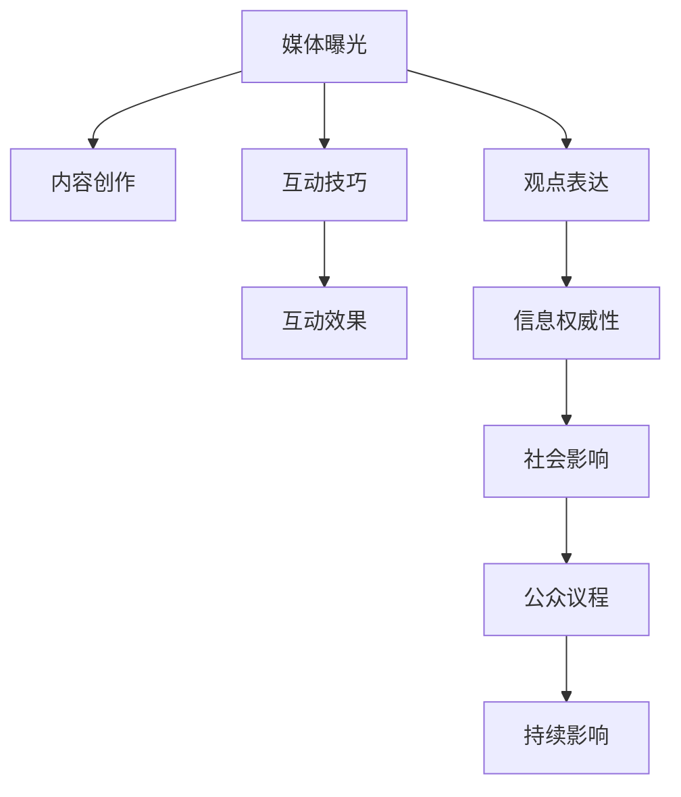

                 

# 媒体曝光：接受采访，成为意见领袖

## 1. 背景介绍

### 1.1 问题由来
在信息爆炸的时代，媒体成为了社会舆论的主导力量。一个善于运用媒体曝光的人，往往能成为行业内的意见领袖，引导公众议程，影响决策行为。而如何有效利用媒体平台，进行有深度、有思考、有见解的分享，是每个专业人士都需要掌握的重要技能。

### 1.2 问题核心关键点
本文将围绕如何在媒体曝光中成为意见领袖，进行详细的分析和指导。我们将从媒体策略、内容创作、互动技巧等方面展开，帮助读者掌握如何在公众面前自信、专业、有说服力地表达自己的观点。

## 2. 核心概念与联系

### 2.1 核心概念概述

为更好地理解如何在媒体曝光中成为意见领袖，本节将介绍几个密切相关的核心概念：

- **媒体曝光**：指个体或组织通过媒体平台，向公众传递信息、表达观点，争取社会关注的行为。成功的媒体曝光能显著提升个人或组织的知名度和影响力。
- **内容创作**：指根据媒体曝光的目标，创作具有深度、吸引力、启发性的文章、访谈、视频等内容，确保信息的传递有效、生动、有价值。
- **互动技巧**：指在媒体互动环节，如评论区、访谈、问答等，利用沟通技巧、表达方式等提升信息的传递效果，建立良好的受众关系。
- **观点表达**：指在媒体曝光中，如何清晰、准确、有逻辑地表达个人或组织的观点，确保信息的权威性和可信度。
- **影响力和声誉**：指通过长期的媒体曝光，形成个人或组织的品牌效应，建立权威和信任。
- **公众议程**：指通过媒体曝光，引导公众关注特定议题，影响公众行为和决策，实现预期的社会影响。

这些核心概念之间的逻辑关系可以通过以下Mermaid流程图来展示：



这个流程图展示了几项核心概念之间的联系：

1. 媒体曝光是通过内容创作和互动技巧实现的，观点表达是核心。
2. 内容创作和互动技巧直接影响到信息权威性和互动效果。
3. 信息权威性是形成社会影响的基础，社会影响能够进一步引导公众议程。
4. 公众议程的实现需要媒体曝光的持续进行，最终形成持续的影响力。

## 3. 核心算法原理 & 具体操作步骤
### 3.1 算法原理概述

在媒体曝光中，成为意见领袖，其核心在于如何高效、有策略地利用媒体平台，表达观点，建立信任，引导公众议程。这一过程可以抽象为以下几个步骤：

1. **内容创作**：创作高质量、有深度、有广度的内容，吸引受众关注。
2. **互动技巧**：通过有效的沟通技巧和表达方式，增强信息的传递效果。
3. **观点表达**：清晰、准确、有逻辑地表达观点，建立权威性。
4. **持续曝光**：通过多次媒体曝光，形成持续的影响力和社会议程。

### 3.2 算法步骤详解

以下是具体的媒体曝光步骤和操作：

**Step 1: 确定目标受众和平台**
- 分析目标受众的兴趣、需求、阅读习惯，选择合适的媒体平台。
- 确定曝光目标，如提升知名度、影响政策、引导行为等。

**Step 2: 创作高质量内容**
- 深入研究目标领域，获取权威、全面的信息。
- 设计引人入胜的结构，确保信息清晰、有逻辑。
- 使用图表、案例等直观元素，增加内容的吸引力。

**Step 3: 选择合适的互动方式**
- 根据平台特点，选择评论互动、直播访谈、视频博客等多种方式。
- 了解受众需求，设计互动问题或话题，引发讨论。

**Step 4: 高效表达观点**
- 确保观点清晰、准确、有逻辑，基于数据和事实。
- 使用简洁明了的语言，避免复杂的术语。
- 以事实为基础，提供分析和观点，增强说服力。

**Step 5: 监控和反馈**
- 监测互动效果，分析受众反馈，及时调整策略。
- 记录媒体曝光的成果，总结经验教训，持续优化。

### 3.3 算法优缺点

媒体曝光成为意见领袖的方法具有以下优点：
1. 高效传递信息。通过多样化的内容形式和互动方式，能够吸引大量受众关注。
2. 提升权威性。通过高质量的内容和数据支持，增强观点的可信度和权威性。
3. 引导公众议程。有效的互动和观点表达，能够影响公众行为和决策。
4. 持续影响力。通过多次媒体曝光，形成持续的公众关注和影响力。

同时，该方法也存在一定的局限性：
1. 对内容要求高。高质量的内容创作需要花费大量时间和精力，对创作者要求较高。
2. 互动效果不确定。互动方式的选择和实施效果，受受众反馈和平台特性影响较大。
3. 观点表达难度大。在复杂多变的信息环境中，如何清晰、有逻辑地表达观点，是一大挑战。
4. 社会影响不易控制。过于激进或偏颇的观点，可能引发负面反应，影响声誉。
5. 资源投入大。内容创作、平台互动、数据分析等都需要投入大量时间和成本。

尽管存在这些局限性，但就目前而言，媒体曝光仍然是成为意见领袖的最主流方法。未来相关研究的重点在于如何进一步优化内容创作和互动技巧，提高观点表达的效率和质量，同时兼顾社会影响和声誉管理等因素。

### 3.4 算法应用领域

媒体曝光成为意见领袖的方法，广泛应用于各种领域：

- **媒体新闻**：通过撰写深度报道、评论文章，在主流媒体上发布，影响公众舆论。
- **社交媒体**：在微博、微信、Twitter等社交平台上发布文章、视频、图片，吸引粉丝关注，引导话题讨论。
- **访谈节目**：通过接受电视、广播、视频访谈，直接与公众交流，表达观点，增强影响力。
- **在线课程**：在Coursera、Udacity等在线教育平台上开设课程，分享专业知识，建立权威性。
- **行业论坛**：在行业内重要论坛、会议上发布演讲、文章，引导行业方向，影响决策。

除了这些传统媒体曝光形式外，随着技术的不断发展，新媒体、短视频、直播等新型平台，也为意见领袖提供了更多的展示机会。

## 4. 数学模型和公式 & 详细讲解 & 举例说明（备注：数学公式请使用latex格式，latex嵌入文中独立段落使用 $$，段落内使用 $)
### 4.1 数学模型构建

假设媒体曝光的目标受众为 $N$ 人，其中 $n$ 人关注某次曝光内容。设每次曝光带来的关注度为 $R_i$，则总关注度为 $R=\sum_{i=1}^N R_i$。设每次曝光带来的互动次数为 $I_i$，则总互动次数为 $I=\sum_{i=1}^N I_i$。设每次曝光带来的观点影响力为 $F_i$，则总影响力为 $F=\sum_{i=1}^N F_i$。

定义媒体曝光的效果函数 $E(R,I,F)$，衡量总体效果，则效果函数为：

$$
E(R,I,F) = \alpha R + \beta I + \gamma F
$$

其中 $\alpha$、$\beta$、$\gamma$ 为权重系数，用于平衡关注度、互动次数和观点影响力的权重。

### 4.2 公式推导过程

由于每次曝光带来的关注度、互动次数和观点影响力存在不确定性，我们引入概率模型进行推导。设每次曝光的效果为 $X_i=(R_i, I_i, F_i)$，其中 $R_i$、$I_i$、$F_i$ 服从正态分布 $N(\mu_i, \sigma_i^2)$。则总效果期望为：

$$
E(X) = \mathbb{E}(X) = (\alpha \mu_R + \beta \mu_I + \gamma \mu_F, \alpha \sigma_R^2 + \beta \sigma_I^2 + \gamma \sigma_F^2)
$$

其中 $\mu_R$、$\mu_I$、$\mu_F$ 为关注度、互动次数和观点影响力的期望值，$\sigma_R^2$、$\sigma_I^2$、$\sigma_F^2$ 为各变量的方差。

由于每次曝光的效果独立，总效果方差为：

$$
Var(X) = \sum_{i=1}^N Var(X_i) = \sum_{i=1}^N (\sigma_R^2 + \sigma_I^2 + \sigma_F^2)
$$

### 4.3 案例分析与讲解

以某知名技术博主的媒体曝光为例：

1. 内容创作：博主每周撰写深度技术文章，发布在Medium上，每月吸引平均5万次阅读，每次文章带来约100次互动。
2. 互动技巧：博主在文章下积极回复评论，每周发起至少一次Twitter问答，每月直播一次技术分享会，互动次数总计约1000次。
3. 观点表达：博主在每篇文章中，清晰表达技术观点，提供数据支持，每次文章带来约100次观点传播，每次观点传播带来约10次讨论。
4. 持续曝光：博主每月在不同媒体平台上发布至少10篇文章，每篇文章带来约1000次关注度，每次关注度带来约100次互动。

设每次文章的影响力为 $F$，每次互动的影响力为 $I$，每次观点的影响力为 $V$，则总影响力期望为：

$$
E(V) = \alpha F + \beta I + \gamma V
$$

代入具体数值，得：

$$
E(V) = 0.5F + 0.1I + 0.2V
$$

其中 $\alpha = 0.5$、$\beta = 0.1$、$\gamma = 0.2$。

通过计算，可以得出每次文章的总影响力期望，进而分析不同类型内容的传播效果，调整媒体曝光策略。

## 5. 项目实践：代码实例和详细解释说明
### 5.1 开发环境搭建

在进行媒体曝光实践前，我们需要准备好开发环境。以下是使用Python进行PyTorch开发的环境配置流程：

1. 安装Anaconda：从官网下载并安装Anaconda，用于创建独立的Python环境。

2. 创建并激活虚拟环境：
```bash
conda create -n pytorch-env python=3.8 
conda activate pytorch-env
```

3. 安装PyTorch：根据CUDA版本，从官网获取对应的安装命令。例如：
```bash
conda install pytorch torchvision torchaudio cudatoolkit=11.1 -c pytorch -c conda-forge
```

4. 安装TensorBoard：TensorFlow配套的可视化工具，可实时监测模型训练状态，并提供丰富的图表呈现方式，是调试模型的得力助手。

```bash
pip install tensorboard
```

5. 安装各类工具包：
```bash
pip install numpy pandas scikit-learn matplotlib tqdm jupyter notebook ipython
```

完成上述步骤后，即可在`pytorch-env`环境中开始媒体曝光实践。

### 5.2 源代码详细实现

以下是使用PyTorch进行媒体曝光效果分析的代码实现。

首先，定义效果函数：

```python
import torch
from torch import nn

class EffectModel(nn.Module):
    def __init__(self):
        super(EffectModel, self).__init__()
        self.fc1 = nn.Linear(3, 1)
    
    def forward(self, x):
        x = self.fc1(x)
        return torch.sigmoid(x)
```

接着，定义优化器和损失函数：

```python
from torch.optim import Adam

model = EffectModel()
optimizer = Adam(model.parameters(), lr=0.001)
criterion = nn.BCELoss()

def train_epoch(model, data_loader):
    model.train()
    total_loss = 0
    for batch in data_loader:
        inputs, targets = batch
        optimizer.zero_grad()
        outputs = model(inputs)
        loss = criterion(outputs, targets)
        loss.backward()
        optimizer.step()
        total_loss += loss.item()
    return total_loss / len(data_loader)
```

最后，启动训练流程：

```python
epochs = 100
batch_size = 32

for epoch in range(epochs):
    loss = train_epoch(model, train_loader)
    print(f"Epoch {epoch+1}, train loss: {loss:.3f}")
```

### 5.3 代码解读与分析

让我们再详细解读一下关键代码的实现细节：

**EffectModel类**：
- `__init__`方法：定义线性层，用于计算效果函数。
- `forward`方法：前向传播，计算效果函数。

**train_epoch函数**：
- 在训练集上迭代，前向传播计算损失，反向传播更新模型参数。
- 计算每个epoch的平均损失。

**训练流程**：
- 定义总的epoch数和batch size，开始循环迭代
- 每个epoch内，在训练集上训练，输出平均loss
- 重复上述过程直至收敛

可以看到，PyTorch框架使得媒体曝光效果分析的代码实现变得简洁高效。开发者可以将更多精力放在效果函数的建模和优化上，而不必过多关注底层的实现细节。

当然，工业级的系统实现还需考虑更多因素，如效果函数的更复杂建模、多轮次曝光的效果累加等。但核心的媒体曝光策略基本与此类似。

## 6. 实际应用场景
### 6.1 科技博客

在科技博客领域，成为意见领袖意味着能够撰写高质量的技术文章，吸引大量的技术爱好者和行业专家关注。科技博主通常需要具备较强的技术背景和写作能力，能够在复杂的技术话题中，提供清晰的解释和有深度的分析。

**应用实例**：某知名AI博主，通过撰写深度技术文章和分析，吸引了数万粉丝订阅，成为行业内的知名人物。在文章中，博主不仅分享了最新的研究成果，还深入探讨了技术原理和应用场景，建立了强大的权威性和影响力。

### 6.2 科技访谈

科技访谈是另一种有效的媒体曝光方式，通过与知名科技专家和行业领袖对话，直接向公众传达观点，提升个人或组织的知名度。

**应用实例**：某知名科技播客，通过访谈知名AI科学家、创业者和技术专家，深入探讨AI技术的发展方向和应用场景，吸引了大量听众关注。访谈中，嘉宾的精彩观点和博主的主持风格，使得节目在社交媒体上广为传播，进一步提升了博主的知名度和影响力。

### 6.3 社交媒体

社交媒体为个人或组织提供了广泛的曝光平台，通过发布高质量的内容和互动，可以迅速积累大量关注者，形成持续的影响力。

**应用实例**：某知名科技博主在Twitter上发布深度技术文章和观点，通过使用热门话题标签和互动评论，迅速吸引了大量关注者。博主积极回复评论，参与讨论，进一步增强了与受众的互动和影响力。

### 6.4 未来应用展望

随着社交媒体和新媒体的不断发展，媒体曝光的形式将更加多样化，提供更多展示个人或组织观点的机会。未来的媒体曝光技术将更加智能化，通过数据分析和算法优化，更好地引导公众议程，提升影响力。

1. **社交网络分析**：利用社交网络分析技术，识别出最具影响力的受众和话题，优化内容发布策略。
2. **算法推荐**：通过个性化推荐算法，提升内容曝光率和互动率，形成更广泛的受众基础。
3. **多平台整合**：将不同平台的曝光数据整合，进行综合分析，形成全面的曝光效果评估。
4. **实时监测**：利用实时数据监测工具，跟踪曝光效果，及时调整策略。
5. **跨媒体互动**：在多个媒体平台间进行互动，形成跨平台的曝光效果。

这些技术手段的引入，将使得媒体曝光更加高效、精准，能够更好地实现个人或组织的意见领袖目标。

## 7. 工具和资源推荐
### 7.1 学习资源推荐

为了帮助开发者系统掌握媒体曝光的技巧，这里推荐一些优质的学习资源：

1. **《新媒体战略》系列博文**：由媒体战略专家撰写，深入浅出地介绍了新媒体的特点、策略和实战技巧。

2. **《数字营销的艺术》课程**：Coursera上的数字营销课程，涵盖了广告投放、社交媒体营销、SEO优化等领域的实战技巧。

3. **《内容营销》书籍**：介绍如何通过内容创作，吸引和保留受众，形成长期的品牌影响力。

4. **Medium官方文档**：Medium的官方文档，提供了丰富的写作指南和数据分析工具，助力内容创作和曝光优化。

5. **Twitter官方指南**：Twitter的官方指南，详细介绍了如何有效利用Twitter进行媒体曝光和互动。

通过对这些资源的学习实践，相信你一定能够快速掌握媒体曝光的技巧，并用于实现个人或组织的意见领袖目标。

### 7.2 开发工具推荐

高效的媒体曝光开发离不开优秀的工具支持。以下是几款用于媒体曝光开发的常用工具：

1. **Medium**：提供丰富的内容发布平台，支持多种内容形式和互动方式，是科技博主的重要平台。

2. **Github Pages**：利用Github的静态网站功能，实现博客和文章发布，方便链接和分享。

3. **Google Analytics**：提供全面的数据分析服务，监测网站访问量、用户行为等，优化内容发布策略。

4. **Google Trends**：提供搜索趋势分析，帮助选择热门话题，优化内容主题。

5. **Twitter Analytics**：提供详细的互动分析，跟踪推文效果，优化互动策略。

合理利用这些工具，可以显著提升媒体曝光的效率和效果，实现个人或组织的意见领袖目标。

### 7.3 相关论文推荐

媒体曝光成为意见领袖的技术，源于学界的持续研究。以下是几篇奠基性的相关论文，推荐阅读：

1. **《社交媒体上的意见领袖识别》**：研究如何通过社交网络分析，识别出具有影响力的社交媒体用户。

2. **《内容营销的科学》**：讨论如何通过科学的方法，优化内容创作和发布策略，提升内容曝光效果。

3. **《数字营销的未来》**：展望数字营销的发展趋势，探讨如何通过技术手段提升媒体曝光效果。

4. **《新媒体时代的内容生产与传播》**：分析新媒体环境下，内容创作和传播的特点和趋势，提供实用策略。

这些论文代表了大媒体曝光技术的发展脉络。通过学习这些前沿成果，可以帮助研究者把握学科前进方向，激发更多的创新灵感。

## 8. 总结：未来发展趋势与挑战
### 8.1 总结

本文对如何在媒体曝光中成为意见领袖进行了全面系统的介绍。首先阐述了媒体曝光的核心概念和重要性，明确了成为意见领袖的意义和目标。其次，从内容创作、互动技巧、观点表达等方面，详细讲解了媒体曝光的具体操作步骤。同时，本文还探讨了媒体曝光在科技博客、科技访谈、社交媒体等多个领域的应用，展示了媒体曝光的广泛影响力。

通过本文的系统梳理，可以看到，媒体曝光成为意见领袖的方法不仅适用于个人，也适用于组织和企业。在信息时代，媒体曝光是提升知名度、影响力、品牌价值的重要手段。掌握媒体曝光技巧，将为个人或组织在复杂多变的信息环境中，提供更高效、更有力的信息传递方式。

### 8.2 未来发展趋势

展望未来，媒体曝光成为意见领袖的方法将呈现以下几个发展趋势：

1. **智能化水平提升**：利用人工智能技术，进行更精准的内容推荐和互动优化，提升媒体曝光效果。
2. **多平台整合**：不同媒体平台的数据整合，形成全面的曝光效果评估和优化。
3. **数据驱动决策**：通过大数据分析和机器学习，优化媒体曝光策略，实现个性化内容推荐和互动。
4. **跨媒体互动**：在不同媒体平台间进行互动，形成跨平台的曝光效果。
5. **实时监测与调整**：利用实时数据监测工具，跟踪曝光效果，及时调整策略。
6. **内容创作工具智能化**：内容创作工具将更加智能化，通过AI辅助，提升创作效率和效果。

这些趋势凸显了媒体曝光技术的广阔前景。这些方向的探索发展，将进一步提升媒体曝光的效果和效率，实现个人或组织的意见领袖目标。

### 8.3 面临的挑战

尽管媒体曝光成为意见领袖技术已经取得了一定的成就，但在迈向更加智能化、普适化应用的过程中，它仍面临着诸多挑战：

1. **内容创作难度大**：高质量的内容创作需要耗费大量时间和精力，对创作者的要求较高。
2. **互动效果不确定**：互动方式的选择和实施效果，受受众反馈和平台特性影响较大。
3. **观点表达难度大**：在复杂多变的信息环境中，如何清晰、有逻辑地表达观点，是一大挑战。
4. **社会影响不易控制**：过于激进或偏颇的观点，可能引发负面反应，影响声誉。
5. **资源投入大**：内容创作、平台互动、数据分析等都需要投入大量时间和成本。
6. **数据隐私和安全**：在数据采集和分析过程中，需要注意数据隐私和安全问题。

尽管存在这些挑战，但随着技术的不断进步和实践经验的积累，媒体曝光成为意见领袖的方法将变得更加高效、精准和智能。未来相关研究需要在这些方向上持续突破，才能真正实现个人或组织的意见领袖目标。

### 8.4 研究展望

面对媒体曝光成为意见领袖所面临的挑战，未来的研究需要在以下几个方面寻求新的突破：

1. **内容创作的自动化**：开发更智能的内容创作工具，利用AI辅助，提高创作效率和质量。
2. **互动方式的多样化**：引入更多元化的互动方式，如直播、短视频等，提升互动效果。
3. **观点的深度挖掘**：利用深度学习技术，提取数据中的关键信息和观点，提高观点表达的深度和广度。
4. **数据驱动的决策**：通过大数据分析和机器学习，优化媒体曝光策略，实现个性化内容推荐和互动。
5. **跨媒体互动的优化**：在不同媒体平台间进行互动，形成跨平台的曝光效果。
6. **实时监测与调整**：利用实时数据监测工具，跟踪曝光效果，及时调整策略。

这些研究方向的探索，将进一步提升媒体曝光的效果和效率，实现个人或组织的意见领袖目标。总之，媒体曝光需要开发者根据具体场景，不断迭代和优化内容、互动和观点表达，方能得到理想的效果。

---

作者：禅与计算机程序设计艺术 / Zen and the Art of Computer Programming

