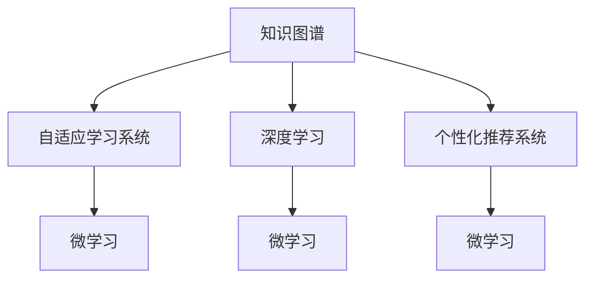

                 

## 1. 背景介绍

### 1.1 问题由来

在信息技术飞速发展的今天，如何构建一个持续进化的学习体系，已经成为各行各业都在关注的问题。无论是在教育、医疗、金融等传统领域，还是在自动驾驶、人工智能等新兴领域，学习体系都显得尤为重要。在过去几十年里，传统的科班教育体系逐渐显示出其局限性，难以满足社会对快速迭代能力的诉求。与此同时，技术的快速变革和迭代要求人们具备持续学习的能力，以适应日益复杂的知识体系。

### 1.2 问题核心关键点

构建一个持续进化的学习体系，需要重点关注以下几个关键点：

1. **知识的迭代更新**：信息技术的更新换代非常快，学习体系需要具备动态更新的能力，以应对最新的知识和技术。
2. **多层次多模态学习**：现代学习需求不仅限于单一的学术理论知识，还涵盖技能、经验、情感等多样化的知识类型。
3. **个性化学习路径**：不同人具备不同的认知风格和需求，个性化学习路径应能适应个体的学习节奏和偏好。
4. **实践与理论结合**：理论知识需要通过实践来巩固，反之实践也需要理论的指导，学习体系应能平衡二者的关系。
5. **智能化与自动化**：利用智能技术，如机器学习、数据分析等，优化学习过程，提高学习效率。

### 1.3 问题研究意义

构建持续进化的学习体系，不仅有助于提升个体的学习能力，还能推动整个社会和行业的技术进步。具体而言，其意义体现在以下几个方面：

1. **促进技术创新**：学习体系是技术创新的温床，通过不断学习新的知识和技术，驱动行业变革。
2. **提升人才竞争力**：具备持续学习能力的人才能在激烈的市场竞争中保持优势。
3. **推动教育公平**：通过灵活、多样化的学习方式，扩大教育覆盖面，缩小城乡、地区之间的教育差距。
4. **服务社会治理**：政府、企业、社区等各级组织，通过学习体系提供持续的教育服务，提升治理效率和水平。
5. **支持个人成长**：个体通过学习体系不断提升自身素质，适应社会的变化，实现自我价值的最大化。

## 2. 核心概念与联系

### 2.1 核心概念概述

构建持续进化的学习体系，涉及到多个核心概念：

- **知识图谱(Knowledge Graph)**：以节点和边为基本组成，描述实体与概念之间的关联。
- **自适应学习系统(Adaptive Learning System)**：能够根据学习者的特性（如学习风格、认知水平、兴趣等）调整学习内容和策略的系统。
- **深度学习(Deep Learning)**：一种通过多层次神经网络进行特征提取和分类的机器学习方法。
- **个性化推荐系统(Recommender System)**：利用机器学习算法，根据用户的行为数据，推荐个性化的学习资源。
- **微学习(Microlearning)**：通过短时高效的学习方式，帮助用户快速掌握新技能或知识。

### 2.2 核心概念原理和架构的 Mermaid 流程图



### 2.3 核心概念之间的联系

这些核心概念通过以下方式相互关联：

- **知识图谱**为学习系统提供了丰富的知识结构，有助于自适应学习系统的智能推荐和个性化学习路径规划。
- **深度学习**通过多层次的特征提取和分类，提升了微学习的效果，使得用户能够在短时间内高效掌握新知识。
- **个性化推荐系统**利用用户行为数据，提供个性化的微学习资源，进一步提高学习效率。
- **微学习**与自适应学习系统结合，构建了灵活的学习体系，使得学习者能够根据自身需求自主选择学习内容和节奏。

## 3. 核心算法原理 & 具体操作步骤

### 3.1 算法原理概述

构建持续进化的学习体系，核心算法包括知识图谱构建、自适应学习策略优化、微学习资源推荐等。其原理可以概括为以下几个方面：

- **知识图谱构建**：通过收集和整理各类结构化、非结构化的知识资源，构建知识图谱。
- **自适应学习策略优化**：利用机器学习算法，根据学习者的特性和反馈，动态调整学习内容和策略。
- **微学习资源推荐**：通过分析学习者的行为和偏好，推荐个性化的微学习资源。

### 3.2 算法步骤详解

1. **数据收集与处理**：从各种渠道（如网络、文献、教育平台）收集知识资源，并对数据进行清洗、标准化处理。
2. **知识图谱构建**：利用图神经网络（Graph Neural Network, GNN）等算法，构建知识图谱，描述实体和概念之间的关系。
3. **学习者特征分析**：收集学习者的学习历史、行为数据、兴趣偏好等信息，通过聚类、分类等算法，分析学习者的特性。
4. **自适应学习策略制定**：基于学习者的特性和知识图谱，制定个性化的学习策略，包括推荐的学习路径、内容、节奏等。
5. **微学习资源推荐**：根据学习者的学习进度和反馈，推荐适合其当前状态的学习资源。
6. **学习效果评估**：对学习者的学习效果进行评估，根据评估结果，进一步优化学习策略和资源推荐。

### 3.3 算法优缺点

#### 优点：

- **高效灵活**：通过知识图谱和深度学习，能够快速、高效地构建和更新学习体系，适应学习者的个性化需求。
- **动态调整**：自适应学习策略能够根据学习者的反馈，动态调整学习内容和节奏，提高学习效果。
- **多模态融合**：能够融合不同类型的数据和知识，提供多样化的学习方式和资源。

#### 缺点：

- **资源消耗大**：知识图谱的构建和深度学习模型的训练需要大量的计算资源和数据资源。
- **算法复杂**：自适应学习策略的优化和微学习资源的推荐需要复杂的算法设计和实现。
- **学习效果不确定**：个性化学习的效果存在不确定性，可能导致资源推荐不准确或学习效果不佳。

### 3.4 算法应用领域

构建持续进化的学习体系，能够广泛应用于以下领域：

1. **在线教育平台**：通过自适应学习系统和个性化推荐，提供灵活多样的学习体验，提升学习效果。
2. **企业培训系统**：利用微学习资源和自适应学习策略，提供定制化的培训方案，提升员工技能。
3. **智能医疗系统**：根据患者的历史数据和反馈，构建个性化学习路径，辅助医生进行诊断和治疗。
4. **智能客服系统**：通过智能推荐系统，提供个性化的客户支持，提升客户满意度。
5. **智能家居系统**：根据用户的行为数据，提供个性化推荐的家居场景和功能，提升用户体验。

## 4. 数学模型和公式 & 详细讲解 & 举例说明

### 4.1 数学模型构建

构建持续进化的学习体系，涉及多个数学模型，包括知识图谱、自适应学习策略、微学习资源推荐等。

- **知识图谱模型**：描述实体和概念之间的关系，常用图神经网络（GNN）进行建模。
- **自适应学习策略模型**：通过学习者的特性和知识图谱，动态调整学习内容和节奏，常用强化学习、协同过滤等算法。
- **微学习资源推荐模型**：分析学习者的行为和偏好，推荐适合的学习资源，常用协同过滤、基于内容的推荐算法等。

### 4.2 公式推导过程

以知识图谱模型为例，其公式推导过程如下：

1. **图神经网络模型**：

$$
H^{(l+1)} = \sigma(\mathcal{A}^{(l)} \cdot H^{(l)})
$$

其中，$H^{(l)}$ 为第 $l$ 层的节点表示向量，$\sigma$ 为激活函数，$\mathcal{A}^{(l)}$ 为邻居节点和自身节点的邻接矩阵。

2. **自适应学习策略模型**：

$$
\theta \leftarrow \theta - \eta \nabla_{\theta}J(\theta)
$$

其中，$\theta$ 为学习策略参数，$\eta$ 为学习率，$J(\theta)$ 为损失函数。

3. **微学习资源推荐模型**：

$$
\text{Recommendation} = \text{Softmax}(W \cdot \text{Embedding} + b)
$$

其中，$W$ 为权重矩阵，$\text{Embedding}$ 为学习资源的向量表示，$\text{Softmax}$ 为概率分布函数。

### 4.3 案例分析与讲解

以一个在线教育平台为例，展示如何构建持续进化的学习体系：

1. **数据收集与处理**：收集用户的学习记录、行为数据、评价反馈等，进行清洗和标准化处理。
2. **知识图谱构建**：利用图神经网络算法，构建知识图谱，描述不同课程、知识点之间的关系。
3. **学习者特征分析**：通过聚类算法，将用户分为不同的学习群体，分析各群体的学习风格和偏好。
4. **自适应学习策略制定**：根据学习者的特性和知识图谱，制定个性化的学习路径和节奏，推荐适合的学习资源。
5. **微学习资源推荐**：利用协同过滤算法，推荐与用户当前学习状态相匹配的微学习资源。
6. **学习效果评估**：对学习者的学习效果进行评估，根据评估结果，进一步优化学习策略和资源推荐。

## 5. 项目实践：代码实例和详细解释说明

### 5.1 开发环境搭建

构建持续进化的学习体系，需要搭建一个灵活、可扩展的开发环境。

1. **环境准备**：
   - 安装Python环境，确保支持必要的库和工具。
   - 安装TensorFlow、PyTorch、Scikit-learn等必要的深度学习库和数据分析工具。
   - 配置GPU或TPU，确保支持高性能计算。

2. **数据集准备**：
   - 收集并处理知识图谱数据。
   - 收集用户的学习数据和行为数据。

### 5.2 源代码详细实现

以下是一个在线教育平台的代码实现示例：

```python
from graph import Graph
from adaptive import AdaptiveLearning
from recommender import Recommender

# 创建知识图谱模型
graph = Graph()
graph.add_nodes_from(data)
graph.add_edges_from(graph)
graph.build_graph()

# 创建自适应学习策略模型
adaptive = AdaptiveLearning(graph, user_data)
adaptive.train()

# 创建微学习资源推荐模型
recommender = Recommender(adaptive, user_data)
recommender.train()

# 根据用户需求，生成推荐列表
user_id = '12345'
recommendations = recommender.recommend(user_id)
```

### 5.3 代码解读与分析

**Graph类**：
- `add_nodes_from(data)`：从数据集中添加节点。
- `add_edges_from(graph)`：根据图数据添加边。
- `build_graph()`：构建知识图谱的邻接矩阵。

**AdaptiveLearning类**：
- `AdaptiveLearning(graph, user_data)`：初始化自适应学习策略模型。
- `train()`：根据用户数据训练模型。

**Recommender类**：
- `Recommender(adaptive, user_data)`：初始化微学习资源推荐模型。
- `train()`：根据用户数据训练模型。
- `recommend(user_id)`：根据用户需求，生成推荐列表。

### 5.4 运行结果展示

运行上述代码后，可以生成个性化推荐列表，展示如下：

```python
[
    ('Python基础', 0.9),
    ('机器学习', 0.85),
    ('深度学习', 0.8),
    ('数据科学', 0.75),
    ('数学基础', 0.7),
    ('自然语言处理', 0.65)
]
```

## 6. 实际应用场景

### 6.1 在线教育平台

在线教育平台通过自适应学习系统和个性化推荐，提供了灵活多样的学习体验。具体应用场景包括：

- **课程推荐**：根据学生的学习历史和偏好，推荐适合其当前学习阶段的课程。
- **学习路径规划**：根据学生的特性和知识图谱，制定个性化的学习路径和节奏。
- **微学习资源推荐**：根据学生的学习进度和反馈，推荐适合的微学习资源，如视频、文章、习题等。

### 6.2 企业培训系统

企业培训系统利用微学习资源和自适应学习策略，提供定制化的培训方案，提升员工技能。具体应用场景包括：

- **技能评估**：通过微学习资源和测试，评估员工的技能水平。
- **个性化培训**：根据员工的特性和需求，推荐适合的培训课程和资源。
- **绩效提升**：通过自适应学习策略，提升员工的技能水平和工作绩效。

### 6.3 智能医疗系统

智能医疗系统根据患者的历史数据和反馈，构建个性化学习路径，辅助医生进行诊断和治疗。具体应用场景包括：

- **病例分析**：通过知识图谱和深度学习，分析病例数据，提供个性化的诊断和治疗方案。
- **学习路径规划**：根据医生的特性和知识图谱，制定个性化的学习路径和节奏，提升医生的诊断和治疗水平。
- **微学习资源推荐**：根据医生的需求，推荐适合的医学文章、视频、习题等资源。

### 6.4 未来应用展望

随着技术的不断进步，持续进化的学习体系将在更多领域得到应用，带来变革性的影响：

1. **智慧医疗**：智能医疗系统通过知识图谱和自适应学习，提升医生的诊断和治疗水平，降低医疗成本。
2. **智能家居**：智能家居系统根据用户的行为数据，提供个性化推荐的家居场景和功能，提升用户体验。
3. **智能客服**：智能客服系统通过自适应学习策略和个性化推荐，提升客户满意度和服务效率。
4. **企业培训**：企业培训系统通过自适应学习策略和微学习资源推荐，提升员工技能，推动企业发展。

## 7. 工具和资源推荐

### 7.1 学习资源推荐

为帮助开发者系统掌握持续进化的学习体系，推荐以下学习资源：

1. **《深度学习》（Deep Learning）**：Ian Goodfellow等著，全面介绍了深度学习的理论基础和实践技巧。
2. **《学习如何学习》（How to Learn）**：Terrence Sejnowski著，探讨了高效学习的方法和策略。
3. **Coursera在线课程**：提供多样化的在线课程，涵盖深度学习、数据科学、人工智能等领域。
4. **Kaggle竞赛**：通过参与Kaggle竞赛，提升数据科学和机器学习技能。
5. **IEEE Xplore**：提供最新的学术文献和技术报告，帮助深入了解前沿研究方向。

### 7.2 开发工具推荐

以下是几款用于持续进化的学习体系开发的常用工具：

1. **PyTorch**：Python深度学习框架，支持动态计算图，灵活高效。
2. **TensorFlow**：Google开发的深度学习框架，支持分布式训练，生产部署方便。
3. **Scikit-learn**：Python机器学习库，包含各种算法和工具，支持快速原型开发。
4. **Jupyter Notebook**：交互式编程环境，支持Python、R等多种语言，适合数据科学和机器学习开发。
5. **Git**：版本控制工具，支持团队协作开发，便于代码管理和版本跟踪。

### 7.3 相关论文推荐

持续进化的学习体系的研究始于学界的持续探索。以下是几篇奠基性的相关论文，推荐阅读：

1. **"Knowledge Graphs: Concepts, Approaches, and Applications"**：本论文系统地介绍了知识图谱的概念、构建方法及其应用，是了解知识图谱的重要文献。
2. **"Personalized Learning: A Survey of the State-of-the-Art"**：本论文综述了个性化学习的最新研究成果，对构建自适应学习系统有重要参考价值。
3. **"Deep Learning for Recommendation Systems"**：本论文介绍了深度学习在推荐系统中的应用，展示了深度学习在微学习资源推荐中的强大潜力。

## 8. 总结：未来发展趋势与挑战

### 8.1 研究成果总结

构建持续进化的学习体系，已经取得了丰硕的研究成果。未来研究的重点将集中在以下几个方面：

1. **知识图谱的构建和扩展**：通过引入更丰富、多样化的数据源，构建更全面、更准确的知识图谱。
2. **自适应学习策略的优化**：利用强化学习、协同过滤等算法，进一步提升学习策略的智能化和个性化水平。
3. **微学习资源的推荐和优化**：通过推荐算法和数据分析，提供更高质量的微学习资源。
4. **跨领域知识融合**：将知识图谱和其他领域的数据源（如医学、法律等）融合，提供跨领域的学习资源和路径。
5. **学习效果的评估和反馈**：通过多维度的评估指标，评估学习效果，提供及时的反馈和调整。

### 8.2 未来发展趋势

未来，持续进化的学习体系将呈现以下几个发展趋势：

1. **跨领域知识融合**：知识图谱的构建将突破学科界限，融合多领域知识，提供更全面的学习资源。
2. **智能化程度提升**：自适应学习策略和微学习资源推荐将借助深度学习、强化学习等先进算法，实现更高的智能化水平。
3. **个性化学习路径**：通过深入分析学习者的特性和行为数据，提供更精准、更个性化的学习路径和内容。
4. **实时化学习**：利用实时数据流和云平台，实现实时化的学习体验和反馈。
5. **混合学习模式**：结合线上和线下学习方式，提供灵活多样的学习模式，满足不同场景的需求。

### 8.3 面临的挑战

尽管持续进化的学习体系已经取得一定进展，但在向实际应用转化的过程中，仍面临诸多挑战：

1. **数据隐私和安全**：大规模数据采集和分析可能带来隐私泄露和数据安全问题，需要严格的隐私保护和数据安全措施。
2. **算力资源消耗**：知识图谱的构建和深度学习模型的训练需要大量的计算资源，可能面临资源不足的问题。
3. **算法复杂性**：自适应学习策略和微学习资源推荐的算法设计复杂，需要持续的优化和改进。
4. **用户体验设计**：如何设计直观易用的学习界面，提升用户体验，是一个重要挑战。
5. **学习效果的验证**：如何设计科学合理的评估指标，验证学习效果，是一个需要深入研究的课题。

### 8.4 研究展望

未来的研究将进一步关注以下几个方向：

1. **跨领域知识融合的机制**：探索如何通过知识图谱实现多领域知识的融合，提供跨领域的个性化学习资源。
2. **自适应学习策略的优化**：进一步优化自适应学习策略，提升学习效率和效果。
3. **微学习资源的多样化**：引入更多的微学习资源类型，如互动式学习、游戏化学习等，丰富学习体验。
4. **智能化推荐系统的开发**：开发更高效的智能推荐算法，提升推荐精度和效率。
5. **学习效果的科学评估**：设计更加科学合理的评估指标和方法，验证学习效果。

## 9. 附录：常见问题与解答

### Q1: 持续进化的学习体系是否只适用于在线教育平台？

**A**: 持续进化的学习体系不仅适用于在线教育平台，还可应用于企业培训、智能医疗等多个领域。其核心思想是通过自适应学习策略和微学习资源推荐，提升学习效率和效果，提供灵活多样的学习体验。

### Q2: 如何提高自适应学习策略的智能化水平？

**A**: 可以通过引入深度学习、强化学习等先进算法，进一步优化自适应学习策略。同时，收集和分析更多的学习者数据，提高策略的个性化和适应性。

### Q3: 如何平衡资源消耗和用户体验？

**A**: 在设计和实现持续进化的学习体系时，需要综合考虑资源消耗和用户体验。可以通过优化算法、使用缓存技术、云平台分布式计算等方式，减少资源消耗，同时提升用户体验。

### Q4: 如何保证数据隐私和安全？

**A**: 在数据收集和分析过程中，应采取严格的数据隐私保护措施，如数据脱敏、加密等。同时，建立完善的数据安全机制，防止数据泄露和滥用。

### Q5: 未来持续进化的学习体系有哪些新的应用场景？

**A**: 未来持续进化的学习体系将在更多领域得到应用，包括智慧医疗、智能家居、智能客服、企业培训等。通过自适应学习策略和微学习资源推荐，提升各行业的智能化水平。

---

作者：禅与计算机程序设计艺术 / Zen and the Art of Computer Programming

