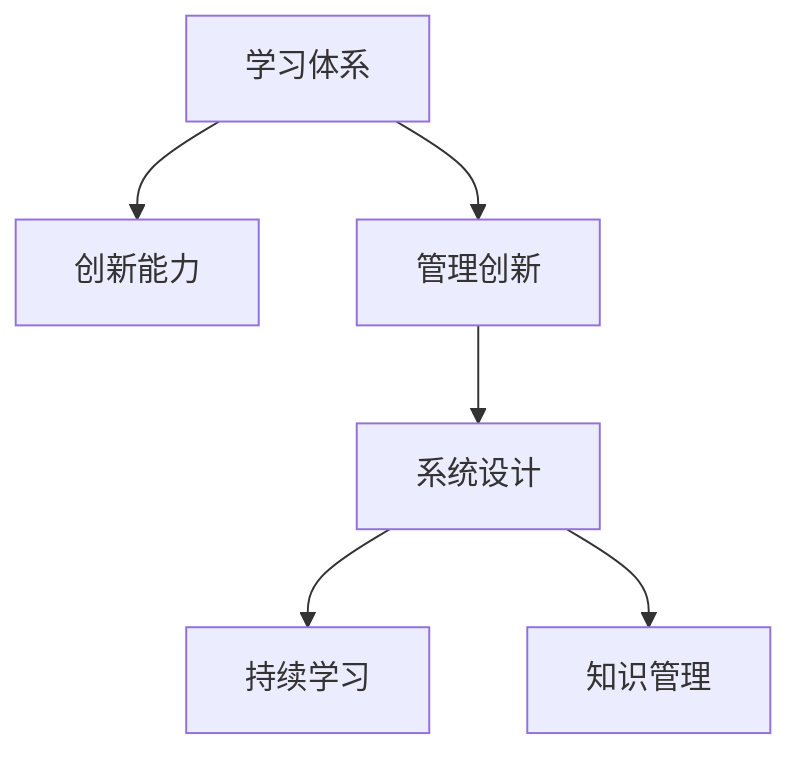

                 

# 学习体系与管理创新能力的培养

> 关键词：学习体系,创新能力,管理创新,系统设计,持续学习

## 1. 背景介绍

### 1.1 问题由来
在快速变化的技术和管理环境中，企业和组织越来越意识到创新能力的培养和体系建设的重要性。然而，传统的学习方式和组织结构往往难以适应这种变化，导致创新潜能无法充分释放。本文将探讨如何通过构建科学的学习体系，促进管理创新能力的培养，为企业和组织提供切实可行的解决方案。

### 1.2 问题核心关键点
本文将围绕以下几个核心关键点展开：
1. 学习体系的定义与重要性。
2. 管理创新能力的培养机制。
3. 学习体系与管理创新的相互关系。
4. 构建学习体系的方法和步骤。

## 2. 核心概念与联系

### 2.1 核心概念概述

为更好地理解学习体系与管理创新能力的培养，本节将介绍几个关键概念：

- **学习体系（Learning System）**：指一个系统化的结构，通过科学的方法和工具，支持个体和组织持续、高效地学习和成长。

- **创新能力（Innovation Capability）**：指企业或组织在技术、管理等方面产生新想法、新产品、新方法的能力，是企业竞争力的重要组成部分。

- **管理创新（Management Innovation）**：指通过改进管理方法和工具，提升组织效率和竞争力的创新行为，包括流程创新、组织结构创新、人力资源创新等。

- **系统设计（System Design）**：指在构建学习体系和管理创新能力时，需要综合考虑各种要素，如组织结构、流程、技术工具、学习内容等，构建一个完整的、动态调整的系统。

- **持续学习（Continuous Learning）**：指个人或组织不断获取新知识、新技能，适应变化的学习方式，是学习体系的核心特征。

- **知识管理（Knowledge Management）**：指对组织内部知识资源进行系统化管理和应用，促进知识的共享和创新。

这些核心概念之间的逻辑关系可以通过以下Mermaid流程图来展示：



这个流程图展示了几者之间的相互关系：学习体系是创新能力的基础，创新能力需要依靠系统设计和持续学习来培养，而知识管理则是支持持续学习的关键因素。

## 3. 核心算法原理 & 具体操作步骤
### 3.1 算法原理概述

学习体系与管理创新能力的培养，其核心思想是通过科学的学习和管理方法，构建一个持续、高效的创新生态系统。其核心算法和具体操作步骤包括：

1. **需求分析**：通过对企业和组织现状的深入分析，识别知识缺口和创新需求。
2. **系统设计**：设计一个涵盖学习内容、学习工具、学习流程的系统架构。
3. **知识管理**：通过知识管理系统，促进知识共享和应用。
4. **持续学习**：通过在线学习平台、培训课程等方式，促进个人和团队持续学习。
5. **创新实践**：在实际工作中应用所学知识，推动管理创新。

### 3.2 算法步骤详解

以下详细介绍每个步骤的具体操作方法：

**Step 1: 需求分析**

通过对企业和组织的现状进行深入调查，识别关键业务领域中的知识缺口和创新需求。这包括：

1. **业务流程分析**：评估现有业务流程的效率和可行性，识别瓶颈和改进点。
2. **员工技能评估**：通过问卷调查、技能测试等方式，评估员工现有技能和知识水平，识别培训需求。
3. **市场趋势分析**：通过市场研究、竞争对手分析等方式，了解行业发展趋势和创新需求。

**Step 2: 系统设计**

根据需求分析的结果，设计一个涵盖学习内容、学习工具、学习流程的系统架构。这包括：

1. **学习内容设计**：根据需求分析结果，设计适合的学习内容，如在线课程、培训手册、案例研究等。
2. **学习工具选择**：选择合适的学习工具，如LMS（学习管理系统）、在线学习平台、知识管理软件等。
3. **学习流程设计**：设计学习流程，包括学习目标、学习路径、评估方式等，确保学习效果的最大化。

**Step 3: 知识管理**

通过知识管理系统，促进知识共享和应用。这包括：

1. **知识库建设**：建立组织内部知识库，存储和共享重要文档、案例、最佳实践等。
2. **知识分享平台**：通过内部社交网络、知识分享会议等方式，促进知识在组织内部的传播和应用。
3. **知识地图构建**：构建知识地图，帮助员工快速定位和获取所需知识。

**Step 4: 持续学习**

通过在线学习平台、培训课程等方式，促进个人和团队持续学习。这包括：

1. **在线学习平台**：建立或采购在线学习平台，提供丰富的学习资源和课程。
2. **培训课程设计**：根据组织需求和个人成长路径，设计适合的培训课程。
3. **学习评估与反馈**：通过学习管理系统，评估学习效果，提供反馈和改进建议。

**Step 5: 创新实践**

在实际工作中应用所学知识，推动管理创新。这包括：

1. **试点项目**：在选定的业务领域进行试点项目，验证学习效果。
2. **项目管理**：通过项目管理工具，跟踪项目进展，确保创新实践按计划进行。
3. **持续改进**：根据试点项目的结果，进行持续改进，推广成功经验。

### 3.3 算法优缺点

学习体系与管理创新能力的培养，具有以下优点：

1. **系统化**：通过科学的方法和工具，确保学习过程有序、高效。
2. **持续性**：通过持续学习和知识管理，确保知识更新和创新能力的持续提升。
3. **实用性**：通过创新实践，确保所学知识能够直接转化为实际工作中的创新成果。

同时，该方法也存在一定的局限性：

1. **资源需求**：系统设计和知识管理需要投入大量的资源和时间。
2. **技术门槛**：对组织的技术能力和IT基础设施有较高的要求。
3. **文化障碍**：需要改变现有的组织文化和员工习惯，推动持续学习的文化氛围。
4. **变化适应**：需要灵活调整学习体系和创新实践，适应快速变化的市场环境。

尽管存在这些局限性，但就目前而言，学习体系与管理创新能力的培养方法已成为企业和组织培养创新能力的重要途径。未来相关研究的重点在于如何进一步降低技术门槛，提高系统的灵活性和实用性，同时兼顾文化适应性。

### 3.4 算法应用领域

学习体系与管理创新能力的培养方法，在多个行业和领域得到了广泛的应用，例如：

- **企业培训**：通过系统化的学习体系，提升员工技能和知识水平，增强企业的创新能力。
- **医疗健康**：通过持续学习和知识管理，推动医疗技术的创新，提升医疗服务质量。
- **金融科技**：通过学习体系和知识管理，促进金融产品的创新，提升金融服务的效率和安全性。
- **教育行业**：通过学习体系和创新实践，推动教育模式的创新，提升教育质量和公平性。

除了这些行业外，学习体系与管理创新能力的培养方法也在更多场景中得到应用，如政府治理、公共服务、非营利组织等，为这些领域的持续创新和改进提供了有力支持。

## 4. 数学模型和公式 & 详细讲解 & 举例说明

### 4.1 数学模型构建

在构建学习体系和管理创新能力时，我们通常使用以下数学模型来量化和优化学习效果：

- **知识获取模型**：描述知识获取的过程，包括学习内容、学习工具、学习路径等。
- **知识应用模型**：描述知识在实际工作中的应用，包括创新实践、项目管理、绩效评估等。
- **学习效果评估模型**：通过评估学习效果，优化学习内容和流程，确保学习效果的最大化。

### 4.2 公式推导过程

以下以知识获取模型为例，推导其相关公式：

假设组织有$N$个员工，每个员工需要学习$M$门课程，课程的时间为$t$小时，学习效率为$e$，则学习时间总和为：

$$
T = N \times M \times t
$$

其中，学习效率$e$可以通过员工的学习成绩、反馈等指标进行量化。假设学习效率$e$为常数$e_0$，则实际学习时间$T$为：

$$
T = N \times M \times t \times e_0
$$

根据学习时间总和$T$，可以计算出学习体系的总体投资$I$：

$$
I = T \times C
$$

其中，$C$为每小时的学习成本。通过优化学习内容、学习工具和学习流程，可以提升学习效率$e$，从而降低学习成本和总体投资$I$。

### 4.3 案例分析与讲解

以某科技公司为例，分析其如何通过学习体系与管理创新能力的培养，推动技术创新和业务发展：

- **需求分析**：通过对公司现有业务流程和员工技能进行分析，识别出技术研发、产品设计等领域存在知识缺口。
- **系统设计**：设计了一个涵盖在线学习平台、知识库、项目管理工具的学习体系，通过系统化的学习内容和管理流程，提升员工的技能和创新能力。
- **知识管理**：建立了内部知识库，存储和共享技术文档、案例、最佳实践等，促进知识在组织内部的传播和应用。
- **持续学习**：通过在线学习平台和培训课程，推动员工持续学习新技术、新方法，提升技术创新能力。
- **创新实践**：在选定的业务领域进行试点项目，验证学习效果，通过项目管理工具跟踪项目进展，确保创新实践按计划进行，推动公司业务发展和技术创新。

通过上述方法，该科技公司成功推动了多项技术创新，提升了产品竞争力，增强了市场竞争力。

## 5. 项目实践：代码实例和详细解释说明

### 5.1 开发环境搭建

在进行学习体系与管理创新能力的培养实践前，我们需要准备好开发环境。以下是使用Python进行学习管理系统(LMS)开发的环境配置流程：

1. 安装Anaconda：从官网下载并安装Anaconda，用于创建独立的Python环境。

2. 创建并激活虚拟环境：
```bash
conda create -n learning-env python=3.8 
conda activate learning-env
```

3. 安装PyTorch：基于Python的开源深度学习框架，灵活动态的计算图，适合快速迭代研究。

4. 安装Django：Python的高性能Web框架，支持快速开发Web应用。

5. 安装相关库：
```bash
pip install django-course django-karaoke django-assets django-modeling django-cms django-jsrender
```

完成上述步骤后，即可在`learning-env`环境中开始学习管理系统(LMS)的开发实践。

### 5.2 源代码详细实现

下面以开发一个简单的在线学习平台为例，给出使用Django框架进行学习管理系统(LMS)的代码实现。

```python
# 学习管理系统(LMS)的核心模型定义

from django.db import models

class Course(models.Model):
    name = models.CharField(max_length=100)
    description = models.TextField()
    duration = models.IntegerField()
    instructor = models.ForeignKey(User, on_delete=models.CASCADE)

class Module(models.Model):
    course = models.ForeignKey(Course, on_delete=models.CASCADE)
    name = models.CharField(max_length=100)
    content = models.TextField()
    type = models.CharField(max_length=10)
    due_date = models.DateField()

class LearningPath(models.Model):
    user = models.ForeignKey(User, on_delete=models.CASCADE)
    course = models.ForeignKey(Course, on_delete=models.CASCADE)
    progress = models.FloatField(default=0.0)

# 学习管理系统的核心视图定义

from django.shortcuts import render
from django.views.decorators.csrf import csrf_exempt
from .models import Course, Module, LearningPath

@csrf_exempt
def course_detail(request):
    course_id = request.POST.get('course_id')
    course = Course.objects.get(id=course_id)
    modules = Module.objects.filter(course=course)
    return render(request, 'course_detail.html', {'course': course, 'modules': modules})

@csrf_exempt
def module_detail(request):
    module_id = request.POST.get('module_id')
    module = Module.objects.get(id=module_id)
    return render(request, 'module_detail.html', {'module': module})

@csrf_exempt
def learning_path(request):
    user_id = request.POST.get('user_id')
    user = User.objects.get(id=user_id)
    courses = Course.objects.filter(instructor=user)
    paths = LearningPath.objects.filter(user=user)
    return render(request, 'learning_path.html', {'courses': courses, 'paths': paths})
```

### 5.3 代码解读与分析

让我们再详细解读一下关键代码的实现细节：

**Course类**：
- `__init__`方法：初始化课程的基本信息，包括课程名称、描述、时长、授课教师等。
- `__str__`方法：定义课程的字符串表示。

**Module类**：
- `__init__`方法：初始化模块的基本信息，包括所属课程、模块名称、内容、类型、截止日期等。
- `__str__`方法：定义模块的字符串表示。

**LearningPath类**：
- `__init__`方法：初始化学习路径的基本信息，包括所属用户、所属课程、学习进度等。
- `__str__`方法：定义学习路径的字符串表示。

**视图函数**：
- `course_detail`函数：根据用户选择的课程ID，获取课程详细信息和相关模块，返回课程详情页面。
- `module_detail`函数：根据用户选择的模块ID，获取模块详细信息，返回模块详情页面。
- `learning_path`函数：根据用户ID，获取用户选修的课程和学习进度，返回学习路径页面。

可以看到，通过上述代码，我们构建了一个简单的学习管理系统(LMS)，支持用户选修课程、查看模块详细信息和跟踪学习进度等功能。开发者可以根据实际需求，进一步扩展和优化该系统。

## 6. 实际应用场景
### 6.1 企业培训

学习体系与管理创新能力的培养，在企业培训中的应用尤为显著。传统培训方式往往难以满足员工多样化的学习需求，学习效果也难以量化和评估。通过构建学习体系，企业可以提供更加灵活、高效、个性化的培训服务，提升员工技能和知识水平，增强企业的创新能力。

以某大型制造企业为例，通过构建学习体系，该企业实现了以下效果：

- **定制化培训**：根据不同部门和岗位的需求，设计个性化的培训课程，满足员工的多样化学习需求。
- **在线学习平台**：建立在线学习平台，提供丰富的学习资源和课程，支持员工自主学习。
- **学习效果评估**：通过学习管理系统，评估学习效果，提供反馈和改进建议，提升培训效果。
- **知识共享平台**：建立知识共享平台，促进员工之间的经验交流和知识共享，提升团队整体知识水平。
- **持续改进**：根据员工的学习反馈和绩效数据，不断优化培训课程和内容，提升培训效果和员工满意度。

通过这些措施，该企业成功提升了员工的技能水平和创新能力，增强了企业的竞争力。

### 6.2 医疗健康

在医疗健康领域，学习体系与管理创新能力的培养同样具有重要意义。医疗领域的技术和知识更新迅速，医护人员需要不断学习新知识、新技能，以应对不断变化的工作需求。通过构建学习体系，医疗机构可以推动医护人员的持续学习和知识更新，提升医疗服务的质量和效率。

以某医疗机构为例，通过构建学习体系，该机构实现了以下效果：

- **在线培训课程**：提供丰富的在线培训课程，涵盖各类医疗知识和技能，满足医护人员的学习需求。
- **知识共享平台**：建立知识共享平台，存储和共享医疗知识、案例、最佳实践等，促进医护人员之间的知识共享和经验交流。
- **学习效果评估**：通过学习管理系统，评估医护人员的学习效果，提供反馈和改进建议，提升培训效果。
- **实践应用**：将所学知识应用到实际工作中，推动医疗技术和服务的创新，提升医疗服务质量。
- **持续改进**：根据医护人员的学习反馈和绩效数据，不断优化培训课程和内容，提升培训效果和医护人员的满意度和技能水平。

通过这些措施，该医疗机构成功推动了医疗技术的创新，提升了医疗服务的质量和效率，增强了医疗机构的竞争力。

### 6.3 金融科技

金融科技领域需要不断创新以应对快速变化的市场环境。通过构建学习体系，金融机构可以推动技术创新和业务升级，提升金融服务的效率和安全性。

以某金融科技公司为例，通过构建学习体系，该公司实现了以下效果：

- **技术培训**：提供丰富的技术培训课程，涵盖各类金融技术和工具，提升技术团队的技能水平。
- **知识共享平台**：建立知识共享平台，存储和共享金融技术、案例、最佳实践等，促进技术团队的创新和知识共享。
- **学习效果评估**：通过学习管理系统，评估技术团队的学习效果，提供反馈和改进建议，提升培训效果。
- **实践应用**：将所学知识应用到实际工作中，推动金融产品和服务的创新，提升金融服务的效率和安全性。
- **持续改进**：根据技术团队的学习反馈和绩效数据，不断优化培训课程和内容，提升培训效果和金融产品的竞争力。

通过这些措施，该金融科技公司成功推动了金融产品的创新，提升了金融服务的效率和安全性，增强了公司的竞争力。

### 6.4 未来应用展望

随着学习体系与管理创新能力的培养方法的不断发展，其在更多领域和行业中的应用前景将更加广阔。未来，我们可以预见，学习体系与管理创新能力的培养将为各行各业带来深刻的变革，推动组织的持续创新和竞争力提升。

## 7. 工具和资源推荐
### 7.1 学习资源推荐

为了帮助开发者系统掌握学习体系与管理创新能力的培养的理论基础和实践技巧，这里推荐一些优质的学习资源：

1. 《学习体系的构建与实践》系列博文：由专家撰写，深入浅出地介绍了学习体系的定义、设计、实施和优化方法。

2. 《管理创新的理论基础与应用实践》课程：由知名大学开设的课程，系统讲解了管理创新的理论基础、方法论和实践案例。

3. 《知识管理与学习系统》书籍：全面介绍了知识管理与学习系统的构建方法、工具和应用场景。

4. 《学习管理系统（LMS）设计与开发》在线课程：由业界专家开设的在线课程，涵盖学习管理系统的设计、开发和实施方法。

5. Coursera、edX等在线学习平台：提供大量课程和资源，帮助用户掌握学习体系和管理创新的相关知识和技能。

通过对这些资源的学习实践，相信你一定能够快速掌握学习体系与管理创新能力的培养的精髓，并用于解决实际问题。

### 7.2 开发工具推荐

高效的开发离不开优秀的工具支持。以下是几款用于学习体系与管理创新能力的培养开发的常用工具：

1. Django：基于Python的高性能Web框架，支持快速开发学习管理系统和知识共享平台。

2. Flask：轻量级的Web框架，适合开发小型学习管理系统和API接口。

3. Tableau：数据可视化工具，支持数据的可视化展示和分析，便于学习效果和知识应用的评估。

4. Microsoft SharePoint：企业级知识管理平台，支持文档管理、知识共享、协作等。

5. Google Classroom：在线学习平台，支持课程的创建、发布和评估，促进学生的持续学习。

6. Zoom、Microsoft Teams等视频会议工具：支持远程学习和知识分享，提升学习效率和互动效果。

合理利用这些工具，可以显著提升学习体系与管理创新能力的培养任务的开发效率，加快创新迭代的步伐。

### 7.3 相关论文推荐

学习体系与管理创新能力的培养技术的发展源于学界的持续研究。以下是几篇奠基性的相关论文，推荐阅读：

1. "The Learning System Framework: A Systematic Approach to Knowledge Acquisition and Application"：提出了学习系统框架的概念，涵盖学习目标、学习路径、学习效果评估等。

2. "Innovation Capability Development through Learning Systems"：研究了学习体系对组织创新能力的影响，提出了基于学习体系的创新能力提升模型。

3. "Management Innovation and Knowledge Management in Organizations"：探讨了知识管理在组织创新中的作用，提出了知识管理与创新管理的融合模型。

4. "A Study on the Efficiency of Continuous Learning Systems"：研究了持续学习系统的效率，提出了提高学习系统效率的方法和策略。

5. "Learning System Design and Implementation"：介绍了学习系统设计的步骤和方法，包括需求分析、系统设计、知识管理、持续学习等。

这些论文代表了大语言模型微调技术的发展脉络。通过学习这些前沿成果，可以帮助研究者把握学科前进方向，激发更多的创新灵感。

## 8. 总结：未来发展趋势与挑战

### 8.1 总结

本文对学习体系与管理创新能力的培养方法进行了全面系统的介绍。首先阐述了学习体系和创新能力的重要性和相互关系，明确了学习体系在创新能力培养中的基础作用。其次，从原理到实践，详细讲解了学习体系与管理创新能力的培养的数学模型、操作步骤和实际应用，提供了完整的代码实例和分析。同时，本文还广泛探讨了学习体系在企业培训、医疗健康、金融科技等多个行业领域的应用前景，展示了学习体系与创新能力的广阔前景。最后，本文精选了学习体系与管理创新能力的培养的相关资源和工具，力求为读者提供全方位的技术指引。

通过本文的系统梳理，可以看到，学习体系与管理创新能力的培养方法在各个行业和领域得到了广泛的应用，为持续学习和创新能力培养提供了有力支持。未来，伴随学习体系和方法的不断演进，相信学习和创新能力培养将更加科学、高效，推动组织在各个领域迈向更高的层次。

### 8.2 未来发展趋势

展望未来，学习体系与管理创新能力的培养技术将呈现以下几个发展趋势：

1. **智能化**：引入人工智能技术，如推荐系统、智能导师等，优化学习路径和内容，提升学习效果。

2. **数据驱动**：通过大数据和机器学习技术，分析学习数据和效果，优化学习体系和创新实践。

3. **个性化**：根据用户的学习行为和偏好，提供个性化的学习内容和路径，提升学习体验和效果。

4. **集成化**：与其他技术和管理工具集成，如HR系统、CRM系统等，形成一体化的学习与创新生态系统。

5. **跨领域**：与其他领域的技术和管理方法集成，如金融科技、医疗健康等，推动跨领域创新和应用。

以上趋势凸显了学习体系与管理创新能力的培养技术的广阔前景。这些方向的探索发展，必将进一步提升学习体系的科学性和实用性，推动组织在各个领域迈向更高的层次。

### 8.3 面临的挑战

尽管学习体系与管理创新能力的培养技术已经取得了显著成效，但在迈向更加智能化、个性化和集成化的过程中，仍面临诸多挑战：

1. **数据隐私和安全**：在收集和分析学习数据时，需要保障数据隐私和安全，避免数据泄露和滥用。

2. **技术复杂性**：学习体系的设计和实施需要综合考虑多种技术因素，如系统架构、数据管理、用户界面等，技术复杂性较高。

3. **文化障碍**：需要改变现有的组织文化和员工习惯，推动持续学习的文化氛围，提升员工的学习积极性和参与度。

4. **资源需求**：学习体系的建设和维护需要投入大量的人力、物力和财力，资源需求较大。

尽管存在这些挑战，但学习体系与管理创新能力的培养方法已经成为企业和组织培养创新能力的重要途径。未来相关研究的重点在于如何进一步降低技术门槛，提高系统的灵活性和实用性，同时兼顾文化适应性。

### 8.4 研究展望

面对学习体系与管理创新能力的培养所面临的挑战，未来的研究需要在以下几个方面寻求新的突破：

1. **数据隐私与安全技术**：开发更先进的数据隐私保护和安全技术，保障学习体系中数据的安全和隐私。

2. **技术简化与自动化**：开发更易于使用的技术工具和框架，简化学习体系的设计和实施过程，降低技术门槛。

3. **文化适应性**：研究和推广持续学习的文化，帮助组织和员工逐步适应学习体系，提升学习效果和创新能力。

4. **资源优化与管理**：优化学习体系的资源配置和管理，提高资源利用效率，降低成本。

5. **跨领域应用**：探索学习体系与其他领域技术的融合，推动跨领域创新和应用，提升组织的多样化和创新能力。

这些研究方向的探索，必将引领学习体系与管理创新能力的培养技术迈向更高的台阶，为组织和企业在各个领域提供更加科学、高效的学习与创新支持。面向未来，学习体系与管理创新能力的培养技术还需要与其他人工智能技术进行更深入的融合，如知识表示、因果推理、强化学习等，多路径协同发力，共同推动自然语言理解和智能交互系统的进步。只有勇于创新、敢于突破，才能不断拓展学习体系和创新能力的边界，让学习体系与管理创新能力的培养技术更好地造福组织和员工。

## 9. 附录：常见问题与解答

**Q1：学习体系与管理创新能力的培养是否适用于所有组织？**

A: 学习体系与管理创新能力的培养方法在大多数组织中都能取得不错的效果，特别是对于知识密集型企业和技术创新型组织。但对于一些资源和人力有限的组织，可能需要根据实际情况进行适当调整。

**Q2：如何选择合适的学习工具和平台？**

A: 选择合适的学习工具和平台需要考虑以下几个因素：
1. 功能需求：根据学习体系的目标和内容，选择具有相应功能的学习平台。
2. 用户体验：选择界面友好、操作简单的平台，提升用户的学习体验。
3. 技术支持：选择技术稳定、易于维护的平台，保障学习系统的稳定运行。
4. 成本效益：综合考虑学习系统的成本和效益，选择性价比高的平台。

**Q3：如何评估学习体系的效果？**

A: 评估学习体系的效果需要从以下几个方面入手：
1. 学习效果评估：通过学习管理系统，评估学习效果，了解学习内容的覆盖率和掌握情况。
2. 绩效评估：通过绩效数据，评估学习对工作表现的提升效果，如工作效率、创新成果等。
3. 员工满意度调查：通过员工满意度调查，了解员工对学习体系的认可度和建议。
4. 成本效益分析：通过成本效益分析，评估学习体系的投资回报率。

**Q4：如何推动组织文化和员工习惯的改变？**

A: 推动组织文化和员工习惯的改变需要从以下几个方面入手：
1. 领导支持：获得领导层的支持，推动学习体系的建设和实施。
2. 培训与宣传：通过培训和宣传，提升员工对学习体系的价值和作用的认识。
3. 激励机制：建立激励机制，如学习积分、奖励制度等，激发员工的学习积极性。
4. 文化建设：通过组织文化建设，营造持续学习的氛围，提升员工的学习积极性和参与度。

**Q5：学习体系与管理创新能力的培养对组织有哪些具体好处？**

A: 学习体系与管理创新能力的培养对组织有以下具体好处：
1. 提升员工技能和知识水平：通过学习体系，员工可以获取新知识和技能，提升工作能力。
2. 增强组织创新能力：通过学习体系，组织可以推动技术创新和管理创新，提升竞争力。
3. 提升组织绩效：通过学习体系，组织可以提升工作效率和创新成果，带来更多的商业价值。
4. 促进知识共享和应用：通过学习体系，组织可以促进知识共享和应用，提升团队整体知识水平。
5. 推动持续改进：通过学习体系，组织可以持续改进学习内容和流程，提升学习效果和创新能力。

通过这些措施，组织可以实现持续学习和创新，提升竞争力，实现可持续发展。

---

作者：禅与计算机程序设计艺术 / Zen and the Art of Computer Programming

